# 环境

v2ray v2raya  https://v2raya.org/docs/prologue/installation/debian/

ZSH https://www.cnblogs.com/nevertoolate22/p/16799684.html

升级git 
sudo apt install software-properties-common -y  ;
sudo add-apt-repository ppa:git-core/ppa -y  ;
sudo apt update -y  ;
sudo apt install git -y  ;

升级 make
[make-4.4.tar.gz](http://ftp.gnu.org/gnu/make/make-4.4.tar.gz)

执行./configuration
执行./build.sh
执行sudo make install
//删除已安装的make：sudo apt remove make
备份并替换make文件：sudo cp make /usr/bin/make

安装 更新 python pip

```shell
sudo apt update
sudo apt install build-essential zlib1g-dev libncurses5-dev \
libgdbm-dev libnss3-dev libssl-dev libsqlite3-dev \
libreadline-dev libffi-dev curl libbz2-dev curl -y

curl -O https://www.python.org/ftp/python/3.9.15/Python-3.9.15.tar.xz
```

https://blog.csdn.net/dacming/article/details/121073912

> 版本过低的环境 不能适配 新版本的neovim 用vscode ssh 替代了. 
> 注意升级clangd, 不然低版本占用太高. 

vscode plugs

C/C++
C/C++ Extension Pack
C/C++ Snippets
Clangd
Remote SSH
Code Runner
Code Spell Checker
vscode-icons
compareit
DeviceTree
Tabnine AI Autocomplete
Bracket Pair Colorization Toggler
Rainbow Highlighter
- 高亮文字：shift + alt + z
- 取消高亮：shift + alt + a
Arm Assembly
Chinese
Hex Editor
One Dark Pro
Markdown All in One
Markdown Preview Enhanced

编译第一个驱动程序:
- 01_hello_drv
```makefile
KERN_DIR = /home/book/100ask_imx6ull-sdk/Linux-4.9.88

all:
    make -C $(KERN_DIR) M=`pwd` modules
    $(CROSS_COMPILE)gcc -o hello_drv_test hello_drv_test.c

clean:
    make -C $(KERN_DIR) M=`pwd` modules clean
    rm -rf modules.order
    rm -f hello_drv_test
    
obj-m   += hello_drv.o
```

- 板子挂载网络系统, 然后装载驱动

- 用buildroot 构建整套系统, 第六章.
	- 编译 bootloader  编译 u-boot 镜像
	-  编译 Linux Kernel 和模块
	- 制作根文件系统
		- busybox手工做
		- 使用 Buildroot 自动制作
		- 使用 Yocto (不适合新手, 复杂)

- 构建完就是烧写了.

# 应用编程

- makefile & gcc
- 文件 IO
- Framebuffer 应用编程
- 输入系统框架及调试 (具体就看完全发开手册)
- Linux 串口应用编程
- I2C 应用编程

	I2C 在SCL时钟线高电平的时候 SDA数据线切电平, 在时钟线低电平的时候, 数据线保持电平, 以供读数据.

- SMBus 是 I2C 协议的一个子集, 但相较于IIC, SMBus 的要求更严格, 体现在硬件协议 和 软件协议上.
	- 因为很多设备都实现了 SMBus，而不是更宽泛的 I2C 协议，所以优先使用SMBus。即使 I2C 控制器没有实现 SMBus，软件方面也是可以使用 I2C 协议来模拟 SMBus。所以：Linux 建议优先使用 SMBus。

# 裸机开发(基于imx6ull)

> 6ull用的Cortex-A7处理器, 基于ARMv7-A架构

MCU: Micro Control unit
MPU: Micro Processing Unit
AP: Application Processors
“片上系统”(SoC，System on Chip)，SoC的本意是在一个芯片上就可以搭建完整的系统。

冯诺依曼架构  哈弗架构   改进的哈弗架构(指令数据混放, 但有指令cache和数据cache)

XIP: eXecute In Place, 本地执行。可以不用将代码拷贝到内存，而直接在代码的存储空间运行。
XIP devices: Devices which are directly addressable by CPU

一句话引出整个嵌入式系统: 支持多种设备启动

问题引出:
 a. 系统支持SPI FLASH启动.
    这意味着可以运行SPI FLASH上的代码
    the system can boot from spi flash,
    so it needs to run code on spi flash

b. 但是SPI FLASH不是XIP设备, 
    cpu无法直接执行里面的代码
    but the spi flash isn't xip device,
    cpu can't run code on spi flash directly

问题来了，
CPU如何执行SPI FLASH上的代码?
一上电, CPU执行的第1个程序、第1条指令在哪里?

how can the cpu run the code on spi flash ?
where is the first code run by cpu, when power up ?

答案: 
a. ARM板子支持多种启动方式：XIP设备启动、非XIP设备启动等等。
   比如：Nor Flash、SD卡、SPI Flash, 甚至支持UART、USB、网卡启动。
   这些设备中，很多都不是XIP设备。

问：既然CPU无法直接运行非XIP设备的代码，为何可以从非XIP设备启动？
答：上电后，CPU运行的第1条指令、第1个程序，位于片内ROM中，它是XIP设备。
这个程序会执行必要的初始化，比如设置时钟、设置内存；再从"非XIP设备"中把程序读到内存；最后启动这上程序。

ARM芯片内部有很多部件，这是一个片上系统(System on chip),
- 比如有：
		  cpu
		  rom
		  ram
		  memory controller --- ddr
		  sd/mmc controller --- sd card
		  spi controller    --- spi flash
		  usb controller    --- usb storage device
		  uart controller
		  LCD controller
		  ......
		  interrtupt controller

跟PC的类比
   CPU      ---- 单独的芯片
   启动设备 ---- BIOS芯片
   DDR      ---- 单独的可拔插式模块
   存储设备 ---- SATA硬盘，可拔插
   usb controller ...


## 嵌入式系统启动流程概述

主芯片内部有ROM，ROM程序协助从非XIP设备启动。
以SD卡启动为例。
而CPU只能运行XIP设备中的程序
ROM程序做什么？
显然：ROM需要把SD卡上的程序读到内存里(片内RAM或是片外的DDR)

ROM程序要做的事情：
a. 初始化硬件
   初始化时钟，提高CPU、外设速度
   初始化内存：DDR需要初始化才能使用
   初始化其他硬件，比如看门狗、SD卡等
   
b. 从外设把程序复制到内存
b.1 
   支持那么多的启动方式，SD卡、SPI FLASH、USB DISK，
   怎么选择？
   通过跳线，选择某个设备；
   或通过跳线，选择一个设备列表，按列表顺序逐个尝试
   或不让客户选择，按固定顺序逐个尝试

b.2 内存那么大，把程序从SD卡等设备，复制到内存哪个位置？复制多长？
烧写在SD卡等设备上的程序，含有一个头部信息，里面指定了内存地址和长度；
或不给客户选择，程序被复制到内存固定的位置，长度也固定。

b.3 程序在SD卡上怎么存？
原始二进制(raw bin),
或者作为一个文件保存在分区里

c. 执行新程序


## 第一个程序(IMX6ULL点灯)

硬件知识_LED原理图

我们怎样去点亮一个LED呢？

分为三步：
1.看原理图，确定控制LED的引脚;
2.看主芯片的芯片手册，确定如何设置控制这个引脚;
3.写程序


LED的驱动方式，常见的有四种。

方式1：使用引脚输出3.3V点亮LED，输出0V熄灭LED。
方式2：使用引脚拉低到0V点亮LED，输出3.3V熄灭LED。

有的芯片为了省电等原因，其引脚驱动能力不足，这时可以使用三极管驱动。

方式3：使用引脚输出1.2V点亮LED，输出0V熄灭LED。
方式4：使用引脚输出0V点亮LED，输出1.2V熄灭LED。


由此，主芯片引脚输出高电平/低电平，即可改变LED状态，而无需关注GPIO引脚输出的是3.3V还是1.2V。

所以简称输出1或0：

逻辑1-->高电平
逻辑0-->低电平

## GPIO引脚操作方法概述

GPIO: General-purpose input/output，通用的输入输出口

1. GPIO模块一般结构：

a. 有多组GPIO，每组有多个GPIO
b. 使能：电源/时钟
c. 模式(Mode)：引脚可用于GPIO或其他功能
d. 方向：引脚Mode设置为GPIO时，可以继续设置它是输出引脚，还是输入引脚
e. 数值：对于输出引脚，可以设置寄存器让它输出高、低电平
      对于输入引脚，可以读取寄存器得到引脚的当前电平

2. GPIO寄存器操作：

a. 芯片手册一般有相关章节，用来介绍：power/clock
可以设置对应寄存器使能某个GPIO模块(Module)
有些芯片的GPIO是没有使能开头的，即它总是使能的

b. 一个引脚可以用于GPIO、串口、USB或其他功能，
有对应的寄存器来选择引脚的功能

c. 对于已经设置为GPIO功能的引脚，有方向寄存器用来设置它的方向：输出、输入
d. 对于已经设置为GPIO功能的引脚，有数据寄存器用来写、读引脚电平状态

GPIO寄存器的2种操作方法：

原则：不能影响到其他位

a. 直接读写：读出、修改对应位、写入
要设置bit n：
val = data_reg;
val = val | (1<<n);
data_reg = val;

要清除bit n：
val = data_reg;
val = val & ~(1<<n);
data_reg = val;

b. set-and-clear protocol：
set_reg, clr_reg, data_reg 三个寄存器对应的是同一个物理寄存器,
要设置bit n：set_reg = (1<<n);
要清除bit n：clr_reg = (1<<n);

3. GPIO的其他功能：防抖动、中断、唤醒：
后续章节再介绍

## imx6ull GPIO

### 原理图
- 
- 
- 

### IMX6ULL的GPIO操作方法

CCM: Clock Controller Module (时钟控制模块)
IOMUXC ​: IOMUX Controller，IO复用控制器
GPIO: General-purpose input/output，通用的输入输出口

- IMX6ULL的GPIO模块结构

参考资料：芯片手册《Chapter 28​: General Purpose Input/Output (GPIO)》

有5组GPIO（GPIO1～GPIO5），每组引脚最多有32个，但是可能实际上并没有那么多。
GPIO1有32个引脚：GPIO1_IO0~GPIO1_IO31；
GPIO2有22个引脚：GPIO2_IO0~GPIO2_IO21；
GPIO3有29个引脚：GPIO3_IO0~GPIO3_IO28；
GPIO4有29个引脚：GPIO4_IO0~GPIO4_IO28；
GPIO5有12个引脚：GPIO5_IO0~GPIO5_IO11；

GPIO的控制涉及4大模块：CCM、IOMUXC、GPIO模块本身，框图如下：
- 

### CCM用于设置是否向GPIO模块提供时钟

参考资料：芯片手册《Chapter 18: Clock Controller Module (CCM)》

GPIOx要用CCM_CCGRy寄存器中的2位来决定该组GPIO是否使能。哪组GPIO用哪个CCM_CCGR寄存器来设置，请看上图红框部分。

CCM_CCGR寄存器中某2位的取值含义如下：
- 

- 00：该GPIO模块全程被关闭
- 01：该GPIO模块在CPU run mode情况下是使能的；在WAIT或STOP模式下，关闭
- 10：保留
- 11：该GPIO模块全程使能

> 看下面的GPIO图就可以知道, 32位的寄存器, 每个CGn 占2位. 取值就是上面的四个, 意思已经解释.  这就知道了 如何设置CCM.

GPIO2时钟控制：
- 

GPIO1、GPIO5时钟控制：
- 

GPIO3时钟控制：
- 

GPIO4时钟控制：
- 

- 6ull的系统时钟(GPIO相关配置)
	- 

- CCM memory map 
	- 
	- 
	- 

### IOMUXC：引脚的模式(Mode、功能)

参考资料：芯片手册《Chapter 32: IOMUX Controller (IOMUXC)》。

- 
- 	- 

对于某个/某组引脚，IOMUXC中有2个寄存器用来设置它：
- 选择功能：
	- `IOMUXC_SW_MUX_CTL_PAD_<PADNAME>` ：Mux pad xxx，选择某个pad的功能
	- `IOMUXC_SW_MUX_CTL_GRP_<GROUP NAME>` : Mux grp xxx，选择某组引脚的功能

	- 某个引脚，或是某组预设的引脚，都有8个可选的模式(alternate (ALT) MUX_MODE)。
		- 

	- 比如
		- 

> 所以 GPIO1 用做GPIO时 低四位是0101

- 设置上下拉电阻等参数：
	- `IOMUXC_SW_PAD_CTL_PAD_<PAD_NAME>`：pad pad xxx，设置某个pad的参数
	- `IOMUXC_SW_PAD_CTL_GRP_<GROUP NAME>`:pad grp xxx，设置某组引脚的参数
		- 
	
	 - 比如：
		 - 

### GPIO模块内部

上面 使能了GPIO, 那么GPIO 还有分输出 输入, 如何设置嘞. 

框图如下：
- 
- memory map
	- 

我们暂时只需要关心3个寄存器：
- GPIOx_GDIR：设置引脚方向，每位对应一个引脚，1-output，0-input
	- GPIO direction register (GPIOx_GDIR) 方向寄存器
	- 
		- GPIO1 有32个引脚 其他的都不到32个引脚.

- GPIOx_DR：设置输出引脚的电平，每位对应一个引脚，1-高电平，0-低电平
	- 32位数据寄存器, 存放要输出的数据. 前提是IOMUXC作为GPIO用, 然后GPIO方向也确定了, 那么相关的DR bit就会被驱动到输出.
	- 
	- 

- GPIOx_PSR：读取引脚的电平，每位对应一个引脚，1-高电平，0-低电平
	- 这个是一个只读存储器, 每一位存的是相应的输入信号的值
	- 

### 怎么编程

- 读GPIO
	- 

翻译一下：

① 设置CCM_CCGRx寄存器中某位使能对应的GPIO模块 // 默认是使能的，上图省略了
② 设置IOMUX来选择引脚用于GPIO
③ 设置GPIOx_GDIR中某位为0，把该引脚设置为输入功能
④ 注意: 读GPIOx_DR或GPIOx_PSR得到某位的值（读GPIOx_DR返回的是GPIOx_PSR的值）

- 写GPIO
	- 

翻译一下：

① 设置CCM_CCGRx寄存器中某位使能对应的GPIO模块 // 默认是使能的，上图省略了
② 设置IOMUX来选择引脚用于GPIO
③ 设置GPIOx_GDIR中某位为1，把该引脚设置为输出功能
④ 写GPIOx_DR某位的值

需要注意的是，你可以设置该引脚的loopback功能，这样就可以从GPIOx_PSR中读到引脚的有实电平；你从GPIOx_DR中读回的只是上次设置的值，它并不能反应引脚的真实电平，比如可能因为硬件故障导致该引脚跟地短路了，你通过设置GPIOx_DR让它输出高电平并不会起效果。

## IMX6ULL LED寄存器操作

- 先看原理图
	- 
	- SNVS_TAMPER3 要设置成 GPIO

- GPIO5_3属于GPIO5里的第3个引脚
	- 所以, 先使能GPIO5 
	- 
		- 6ull 默认使能GPIO5 

- 再看芯片手册：设置GPIO5_3为GPIO
	- 

- 再看芯片手册：设置GPIO5_3为输出
	- GPIO5 基地址: 0x020AC000 
	- 
		- GPIO5_GDIR 地址 0x020AC004  , 把它的第三位设置为1

- 再看芯片手册：怎么设置GPIO的输出电平？
	-  
	- GPIO5_DR的第3位写为0 根据原理图就知道 LED灯会亮.

## 6ull 第一个点灯

怎么访问寄存器？
- 用指针访问寄存器地址

```c
int   a;
unsigned int *p  = &a;   // p等于“a的地址”

*p = val;   // 写这个地址，就是写a
val = *p;   // 读这个地址，就是读a


unsigned int *p  = 0x40010800; // p等于某个寄存器的地址

*p = val;   // 写这个地址，也就是写这个寄存器
Val = *p;  // 读寄存器

```

程序的布局与运行

1. ROM上的固件根据EMMC或TF卡上`1K偏移处的头部信息`，把`led.bin`复制到`0x80100000`处，并运行
2. 第一条指令把栈设置为`0x80100000`
3. 程序从`0x80100000`向上运行，栈从`0x80100000`向下增长


- EMMC 直接把 led.imx 烧写进去 因为烧写工具可以跨过开头的1k
- 而TF/SD卡则 需要偏移1k 字节. 前面1k必须留着, 所以烧写.img

## ARM 架构

见 arm架构那个文件夹下的文档. 此处偏实践.

### 地址空间

- ARM 是内存跟外设IO `统一编址`的. 与独立编址的x86架构是不同的.
	- 
	- memory 控制器会根据CPU发过来的地址去对应的地址段访问设备.


ARM芯片属于精简指令集计算机(RISC：Reduced Instruction Set Computing)，它所用的指令比较简单，有如下特点：

① 对内存只有读、写指令
② 对于数据的运算是在CPU内部实现
③ 使用RISC指令的CPU复杂度小一点，易于设计

- 
- 对于左图所示的乘法运算`a = a * b`，
- 在RISC中要使用4条汇编指令(而在复杂指令集中可能只要一条指令)：
	- ① 读内存a
	- ② 读内存b
	- ③ 计算`a*b`
	- ④ 把结果写入内存

x86属于复杂指令集计算机(CISC：Complex Instruction Set Computing)，它所用的指令比较复杂，比如某些复杂的指令，它是通过“微程序”来实现的。

比如执行乘法指令时，实际上会去执行一个“微程序”，在“微程序”里，一样是去执行这4步操作：
- ① 读内存a
- ② 读内存b
- ③ 计算`a*b`
- ④ 把结果写入内存

但是对于程序员来说，他看不到“微程序”，他好像用一条指令就搞定了这一切！

- RISC和CISC比较
	- CISC的指令能力强, 单多数指令使用率低却增加了CPU的复杂度, 指令是可变长格式；
	- RISC的指令大部分为单周期指令, 指令长度固定, 操作寄存器, 对于内存只有Load/Store操作
	- CISC支持多种寻址方式; RISC支持的寻址方式
	- CISC通过微程序控制技术实现; 
	- RISC增加了通用寄存器, 硬布线逻辑控制为主, 采用流水线
	- CISC的研制周期长
	- RISC优化编译, 有效支持高级语言


### ARM内部寄存器

- CPU内部有很多寄存器

无论是cortex-M3/M4，还是cortex-A7，CPU内部都有R0、R1、……、R15寄存器；它们可以用来“暂存”数据。

对于R13、R14、R15，还另有用途：

- R13：别名SP(Stack Pointer)，栈指针
- R14：别名LR(Link Register)，用来保存返回地址
- R15：别名PC(Program Counter)，程序计数器，表示当前指令地址，写入新值即可跳转
- 

- M3/M4/A7 CPU内部寄存器
- cortex-M3/M4：
	- 
		- 对于R13, M3 M4有两个实体, 不同设置下对应不同实体一般用sp_main. 跑rtos时才用sp_process

- cortex-A7也是类似的：
	- 

- M3 M4 跟 A7 都有PSR, 程序状态寄存器
	- 比如你比较两个数的值, 比较结果会放在PSR中的某一个bit上

- M3/M4：比较两个数时，结果保存在哪？
	- 

- M3/M4:xPSR实际上对应3个寄存器APSR/IPSR/EPSR
- 对于cortex-M3/M4来说，xPSR实际上对应3个寄存器：
	- ① APSR：Application PSR，应用PSR
	- ② IPSR：Interrupt PSR，中断PSR
	- ③ EPSR：Exectution PSR，执行PSR
- 这3个寄存器的含义如图所示
	- 
	- 
		- N Z C V Q 用来保存比较结果

- 这3个寄存器，可以单独访问：
	- MRS  R0, APSR  ;读APSR
	- MRS  R0, IPSR    ;读IPSR
	- MSR  APSR, R0   ;写APSR

- 这3个寄存器，也可以一次性访问：
- MRS  R0,  PSR  ; 读组合程序状态
- MSR  PSR, R0   ; 写组合程序状态
- 所谓组合程序状态，入下图所示：
	- 


- A7架构：比较两个数时，结果保存在哪？
	- 对于cortex-A7，还要一个Current Program Status Register
	- 
	- 

- M3/M4/A7 CPU内部寄存器
	- 多种工作模式下的寄存器
	- 
	- 不同模式下有专用的寄存器, 在这些模式下不会去用通用的寄存器, 从而不会影响到别的寄存器里的内容.

### ARM 汇编

> ARM汇编概述

一开始，ARM公司发布两类指令集：

① ARM指令集，这是32位的，每条指令占据32位，高效，但是太占空间
② Thumb指令集，这是16位的，每条指令占据16位，节省空间

要节省空间时用Thumb指令, 要效率时用ARM指令.

一个CPU既可以运行Thumb指令, 也能运行ARM指令.

怎么区分当前指令是Thumb还是ARM指令呢？

`程序状态寄存器`中有一位, 名为“T”, 它等于1时表示当前运行的是Thumb指令.
- 

假设函数A是使用Thumb指令写的, 函数B是使用ARM指令写的, 怎么调用A/B? 
我们可以往PC寄存器里写入函数A或B的地址，就可以调用A或B，
但是怎么让CPU在执行A函数是进入Thumb状态，在执行B函数时进入ARM状态？

做个手脚：
调用函数A时，让PC寄存器的BIT0等于1，即：PC=函数A地址+(1<<0)；
调用函数B时，让PC寄存器的BIT0等于0，即：PC=函数B地址

麻烦吧？麻烦！

所以引入Thumb2指令集，它支持16位指令、32位指令混合编程。

ARM公司推出了： Unified Assembly Language UAL，统一汇编语言，你不需要去区分这些指令集。

在程序前面用 CODE32/CODE16/THUMB 表示指令集: ARM/Thumb/Thumb2


上面红框中的指令会用即可.

汇编指令可以分为几大类：数据处理、内存访问、跳转、饱和运算、其他指令
- Operation表示各类汇编指令，比如ADD、MOV；如下图：
- 

cond有多种取值，如下：
- 

## 使用按键控制LED

### 先看原理图

- 100ASK IMX6ULL按键原理图
- 

- 我们使用KEY2来控制LED：按下KEY2则灯亮，松开后灯灭
- 课后作业：使用KEY1来控制LED(我在视频里演示KEY2，它更复杂一点)
- KEY2用的是GPIO04_IO14引脚

### 再看芯片手册

- 使能GPIO4模块

**CCM_CCGR3地址：20C_4000h base + 74h offset = 0x020C4074**
- 

- 设置引脚工作于GPIO模式

**IOMUXC_SW_MUX_CTL_PAD_NAND_CE1_B 地址：20E_0000h base + 1B0h offset = 0x020E01B0**

- 

- 设置引脚为输入引脚

**GPIO4_GDIR地址：0x020A8004** 

- 

- 读取引脚值

**GPIO4_DR地址：0x020A8000**
- 

KEY1 就更简单了, 它是GPIO5_01 默认使能的.  看代码吧.

# UART串口编程

## 硬件知识_UART硬件介绍

### 串口的硬件介绍

- UART的全称是Universal Asynchronous Receiver and Transmitter，即异步发送和接收。
- 串口顾名思义是数据串行接口，即数据的传输是一位接一位传输，属于一种串行的数据总线，属于异步通讯，同时支持全双工数据传输（全双工数据传输：允许发送数据和接收数据在同一时刻发生）。
- 串口在嵌入式中用途非常的广泛，主要的用途有：
	- 打印调试信息；
	- 外接各种模块：GPS、蓝牙；
- 串口因为结构简单、稳定可靠，广受欢迎。
- 除了UART，另外还有一种叫USART，全称是通用同步/异步串行接收/发送器(Universal Synchronous/Asynchronous Receiver/Transmitter)，USART比 UART多了同步通信功能，但是百分之90的工程应用中不会应用该同步功能，都是将USART当做UART使用，即采取异步串行通讯。一般开发板或者产品中都会将UART串口标为serial或COM。

### UART硬件连接

1) UART串口最精简的连接是TTL电平三线连接

- 通过三根线即可，发送、接收、地线。
	- 
	- 

- 通过`TxD->RxD`把ARM开发板要发送的信息发送给PC机。 
- 通过`RxD->TxD`线把PC机要发送的信息发送给ARM开发板。 
- 最下面的地线统一参考地。

上图为UART串口TTL电平硬件连接，此时使用标准的TTL电平来表示数据，高电平表示1，低电平表示0，标准TTL输入高电平最小2V，输出高电平最小2.4V，典型值为3.4V，输入低电平最大0.8V，输出低电平最大0.4V，典型值为0.2V。

直接采用TTL电平进行串行通讯，由于其抗干扰能力差，导致传输距离短，且容易出现数据不可靠的情况。

为提高抗干扰能力和传输距离，一般采用下面两种硬件连接方式。
- 1）TTL电平转RS232电平
- 
- RS232电平规定逻辑“1”的电平为-5V~-15 V，逻辑“0”的电平为+5 V～+15 V，选用该电气标准以提高抗干扰能力。常用的TTL转RS232芯片有：MAX232，SP3232等。

- 2）TTL电平转USB电平
- 
- 将TTL电平转换为USB电平（D+与D-一对差分信号采用NRZI编码实现通讯），提高抗干扰能力，常用的TTL转USB芯片有：PL2303，CH340, CP2102等
- 100ASK_IMX6ULL采用的是上述方案中的“TTL转USB方案”.

### 串口的参数

- 波特率：一般选波特率都会有9600,19200,115200等选项。其实意思就是每秒传输这么多个比特位数(bit)。
- 起始位:先发出一个逻辑”0”的信号，表示传输数据的开始。
- 数据位：可以是5~8位逻辑”0”或”1”。如ASCII码（7位），扩展BCD码（8位）。小端传输。
- 校验位(Parity)：数据位加上这一位后，使得“1”的位数应为偶数(偶校验)或奇数(奇校验)，以此来校验数据传送的正确性。(技术进步这个已经不用了)
- 停止位：它是一个字符数据的结束标志。

> 所以一般就是10位传一个字节.

怎么发送一字节数据，比如‘A‘?
- ‘A’的ASCII值是0x41,二进制就是01000001，怎样把这8位数据发送给PC机呢？

- 双方约定好波特率（每一位占据的时间）；
- 规定传输协议, 确定传输数据的格式
- UART串口通信的数据包以帧为单位，常用的帧结构为：1位起始位+8位数据位+1位奇偶校验位（可选）+1位停止位。
    - 原来是高电平，ARM拉低电平，保持1bit时间；
    - PC在低电平开始处计时；
    - ARM根据数据依次驱动TxD的电平，同时PC依次读取RxD引脚电平，获得数据；
    - PC在数据位持续时间中间读取引脚状态, `data[0]` 就是 PC的RxD引脚t0时的状态


- 上图为：1位起始位+8位数据位+1位偶校验位+1位停止位 的波形。
- 根据查找ASCII码表得知’ A’字符的ASCII值为41（十进制），将其转换成二进制应该为0100 0001，小端传输，即低位（LSB）在前，高位（MSB）在后，和上图所示一致。
- 上图中各位的详细说明如下：
	- 1) 空闲位: 平时没有数据时，数据线为高电平（逻辑1）；
	- 2) 起始位: 当需要发送数据时，UART将改变UARTx_TXD的状态，变为低电平，即为上图中的起始位（逻辑0）；
	- 3) 数据位: 可以有5、6、7或8位的数据，一般我们是按字节（8位）传输数据，发送方一位一位的改变数据线上的状态（高电平或低电平）将它们发送出去，传输数据时先传最低位，最后传送最高位。
		- 字符’A’的8位二进制字符是0100 0001，先发送最低位bit 0，其值为1；再发送bit 1，其值为0，如此继续；最后发送最高位bit 7，其值为0。
	- 4) 奇偶校验位
		- 如果使用了奇偶校验功能，有效数据位发送完毕后，还要发送1个校验位（奇偶校验位）。
		- 有两种校验方法：奇校验，偶校验-------数据位连同校验位中，“1”的数目等于奇数或偶数。奇偶校验只能检错，不能纠错的。而且只能检测1位误码，检测出有错后只能要求重发，没法纠正的。
		- 上图中使用的是偶较验，即8个数据位和1个校验位中，一共有偶数个“1”：2个。
	- 5) 停止位
		- 停止位（逻辑1）用来表示当前数据传输完毕。
		- 停止位的长度有三种：1位，1.5位，2位，通常我们选择1位即可。

前面图中提及到了逻辑电平，也就是说代表信号1的引脚电平是人为规定的。 如图是TTL/CMOS逻辑电平下，传输‘A’时的波形：


- 在xV至5V之间，就认为是逻辑1，在0V至yV之间就为逻辑0。

- 如图是RS-232逻辑电平下，传输‘A’时的波形：
- 

- 在-12V至-3V之间，就认为是逻辑1，在+3V至+12V之间就为逻辑0。
- RS-232的电平比TTL/CMOS高，能传输更远的距离，在工业上用得比较多。
- 市面上大多数ARM芯片都不止一个串口，ARM开发板一般使用`串口0来调试`，其它串口来外接模块。

### 串口电平

- `ARM芯片上得串口都是TTL电平`的，`通过`板子上或者外接的`电平转换芯片`，转成RS232接口，连接到电脑的RS232串口上，实现两者的数据传输。
- 

- 现在的电脑越来越少有RS232串口的接口，但USB是几乎都有的。因此使用USB串口芯片将ARM芯片上的TTL电平转换成USB串口协议，即可通过USB与电脑数据传输。
	- 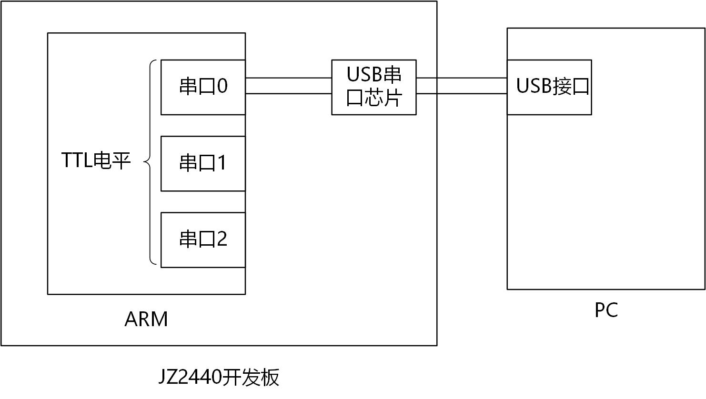

- 上面的两种方式，对ARM芯片的编程操作都是一样的。

### UART 内部结构 功能模块

- 如图所示串口结构图：
	- 

ARM芯片是如何发送/接收数据？

要发送数据时，CPU控制`内存`要发送的数据通过`FIFO`传给UART单位，UART里面的`移位器`，依次将数据发送出去，在`发送完成后产生中断`提醒CPU传输完成。 

接收数据时，获取接收引脚的电平，逐位放进接收移位器，再放入FIFO，写入内存。在接收完成后产生中断提醒CPU传输完成。

## IMX6ULL 的UART操作

### UART编程

1. 串口编程步骤

- 1.1 看原理图确定引脚
	- 有很多串口，使用哪一个？看原理图确定

- 1.2 配置引脚为UART功能
	- 至少用到发送、接收引脚：txd、rxd
	- 需要把这些引脚配置为UART功能，并使能UART模块

- 1.3 设置串口参数
	- 有哪些参数？
	    - 波特率
	    - 数据位
	    - 校验位
	    - 停止位
	- 示例： 比如 `15200,8n1` 表示`波特率为115200,8个数据为，没有校验位，1个停止位`

- 1.4 根据状态寄存器读写数据
	- 肯定有一个数据寄存器，程序把数据写入，即刻通过串口向外发送数据
	- 肯定有一个数据寄存器，程序读取这个寄存器，就可以获得先前接收到的数据
	- 很多有状态寄存器
	    - 判断数据是否发送出去？是否发送成功？
	    - 判断是否接收到了数据？

### IMX6ULL串口框架

参考手册`IMX6ULLRM.pdf中《CChapter 55: Universal Asynchronous Receiver/Transmitter (UART)》` 各类芯片的UART框图都是类似的，当设置好UART后，程序读写数据寄存器就可以接收、发送数据了。

- 
- 跟之前用2440介绍的一样的. 都是通过外部总线, 把数据送到发送FIFO寄存器中去, 然后再通过移位寄存器一位一位发送出去.
- Rx Block 会自动从RX_DATA引脚获取数据存到RxFIFO, 然后CPU就到这个RxFIFO读数据.
- 可以通过Module Clock 设置时钟, 经过时钟分频之后, 得到期望的波特率.

### IMX6ULL串口操作

- 100ASK IMX6ULL的`UART1`接到一个USB串口芯片, 然后就可以通过USB线连接电脑了.

- 1. 看原理图确定引脚

	- 原理图如下 100ask_imx6ull_v1.1.pdf
	- 
	- 
		- 右边的图放大.
	- SOC板 引脚
	- 

- 核心板 原理图 MYC-Y6ULX1211.pdf
- 上图中的USART1_RX、USART1_TX，接到了PA9、PA10
- 

- 2 使能UART

- 2.1 设置UART的总时钟
- 参考IMX6ULL芯片手册《Chapter 18: Clock Controller Module (CCM)》， 根据IMX6ULL的时钟树，设置CSCDR1寄存器就可以给UART提供总时钟，如下图：
- 
- 顺着这跟粉红色的线上去找到:
- 

- 下图是CSCDR1(CCM Serial Clock Divider Register 1)的位说明，对于UART，我们选择时钟源位80M, 而不用晶振(OSC, Oscillator_ Clock). 
-  
- 
- 

- 根据上面的图, 我们需要设置CSCDR1中的 UART_CLK_SEL 跟 UART_CLK_PODF 两个域.
- 
	- UART_CLK_SEL 占用1位, 决定是用pll3_80m 还是用晶振.
	- UART_CLK_PODF 占6位

- 2.2 给UART模块提供时钟

- 前面生成UART_CLK_ROOT, 要传给各个串口模块, 还要配置寄存器, 让时钟能传给某个串口模块. 比如UART1里有寄存器来控制.
	- 

- CCM Clock Gating Register 5 (CCM_CCGR5)
	- 
	- 

- 2.3 使能UART模块

虽然给UART提供了时钟，但是UART本身并未使能，需要设置以下寄存器：
- 
- 
- 

- 2.4 配置引脚功能

原理图上的引脚是UART1_TX_DATA, datasheet 搜这个引脚.
- 

- 配置UART1_TX引脚
- 在芯片手册中搜索UART1_TX，可以找到下图所示寄存器：
	- 

- 配置UART1_RX引脚
- 在芯片手册中搜索UART1_RX, 可以找到下图所示寄存器: 
	- 

- 2.5 IMX6ULL特殊的地方

- Daisy Chain select
- IMX6ULL还有一个“Daisy Chain select”功能，比如下图中：
	- 
- A、B、C三个引脚都可以连接到Module X，它们都可以驱动Module X
- 使用哪一个引脚呢？还需要设置“Daisy Chain select”，用来选择A、B、C之一。

Daisy Chain Select有什么用处呢？ 

- 比如UART，它只有TXD、RXD两个引脚：RXD有外部电路输入。 能否让UART的TXD直接给RXD提供数据？
	- 可以！这就是回环，方便调试。 怎么做？ 可以在外部电路把TXD接到RXD，也可以在芯片内部让RXD可以选择数据来源，如下图所示：
	- 

- 所以我们需要配置UART的 接收引脚, 不要设置成回环模式.
- 在IOMUXC IO多路复用章节
- 

- 3 设置串口参数

- 3.1 设置波特率

波特率算公式：
- 

上述公式中，Ref Freq为80MHZ，UBMR 和 UBIR 在寄存器中设置。

- 要先设置UBIR，再设置BUMR
- UBIR、BUMR中的值，是实际值减1
- 

- 3.2 设置数据格式

比如数据位设置为8，无校验位，停止位设置为1。
- 

- 3.3 IMX6ULL芯片要求必须设置
- 对于UART1_UCR3的bit2，必须设置为1，芯片要求的，没什么道理可讲：
- 

> 配置完成, 那么如何去读写UART寄存器里的数据呢? 我们在读写数据之前, 必须先读取 UART状态寄存器, 以知道 UART数据寄存器里的数据 有没有, 满没满之类的. 才能去读写.


### 根据状态寄存器读写数据

- 状态寄存器
	- 
	- 我们要读的是 Bit0 跟 Bit3, 来判断读写块各自的状态, 数据是否已经发送完, 或者是否已经收到了.

- 接收数据寄存器
	- 

- 发送数据寄存器
	- 

### 寄存器地址

- 其他寄存器地址
```c
volatile unsigned int *IOMUXC_SW_MUX_CTL_PAD_UART1_TX_DATA ;
volatile unsigned int *IOMUXC_SW_MUX_CTL_PAD_UART1_RX_DATA	;
volatile unsigned int *IOMUXC_UART1_RX_DATA_SELECT_INPUT ;
volatile unsigned int *CCM_CSCDR1;
volatile unsigned int *CCM_CCGR5;

IOMUXC_SW_MUX_CTL_PAD_UART1_TX_DATA		= (volatile unsigned int *)(0x20E0084);
IOMUXC_SW_MUX_CTL_PAD_UART1_RX_DATA		= (volatile unsigned int *)(0x20E0088);
IOMUXC_UART1_RX_DATA_SELECT_INPUT		= (volatile unsigned int *)(0x20E0624);
CCM_CSCDR1 = (volatile unsigned int *)(0x020C4024);
CCM_CCGR5 = (volatile unsigned int *)(0x020C407C);
```

- UART1寄存器
- UART1基地址：0x02020000，里面的寄存器用结构体来表示比较方便：
```c
/*根据IMX6ULL芯片手册<<55.15 UART Memory Map/Register Definition>>的3608页，定义UART的结构体,*/
typedef struct {
  volatile unsigned int  URXD;               /**< UART Receiver Register, offset: 0x0 	           串口接收寄存器，偏移地址0x0     */
  		   unsigned char RESERVED_0[60];		
  volatile unsigned int  UTXD;               /**< UART Transmitter Register, offset: 0x40          串口发送寄存器，偏移地址0x40*/
  		   unsigned char RESERVED_1[60];		
  volatile unsigned int  UCR1;               /**< UART Control Register 1, offset: 0x80 	       串口控制寄存器1，偏移地址0x80*/
  volatile unsigned int  UCR2;               /**< UART Control Register 2, offset: 0x84 	       串口控制寄存器2，偏移地址0x84*/
  volatile unsigned int  UCR3;               /**< UART Control Register 3, offset: 0x88            串口控制寄存器3，偏移地址0x88*/
  volatile unsigned int  UCR4;               /**< UART Control Register 4, offset: 0x8C            串口控制寄存器4，偏移地址0x8C*/
  volatile unsigned int  UFCR;               /**< UART FIFO Control Register, offset: 0x90         串口FIFO控制寄存器，偏移地址0x90*/
  volatile unsigned int  USR1;               /**< UART Status Register 1, offset: 0x94             串口状态寄存器1，偏移地址0x94*/
volatile unsigned int  USR2;               /**< UART Status Register 2, offset: 0x98             串口状态寄存器2，偏移地址0x98*/
  volatile unsigned int  UESC;               /**< UART Escape Character Register, offset: 0x9C     串口转义字符寄存器，偏移地址0x9C*/
  volatile unsigned int  UTIM;               /**< UART Escape Timer Register, offset: 0xA0         串口转义定时器寄存器 偏移地址0xA0*/
  volatile unsigned int  UBIR;               /**< UART BRM Incremental Register, offset: 0xA4      串口二进制倍率增加寄存器 偏移地址0xA4*/
  volatile unsigned int  UBMR;               /**< UART BRM Modulator Register, offset: 0xA8 	   串口二进制倍率调节寄存器 偏移地址0xA8*/
  volatile unsigned int  UBRC;               /**< UART Baud Rate Count Register, offset: 0xAC      串口波特率计数寄存器 偏移地址0xAC*/
  volatile unsigned int  ONEMS;              /**< UART One Millisecond Register, offset: 0xB0      串口一毫秒寄存器 偏移地址0xB0*/
  volatile unsigned int  UTS;                /**< UART Test Register, offset: 0xB4                 串口测试寄存器 偏移地址0xB4*/		
  volatile unsigned int  UMCR;               /**< UART RS-485 Mode Control Register, offset: 0xB8  串口485模式控制寄存器 偏移地址0xB8*/
} UART_Type;

UART_Type *uart1 = (UART_Type *)0x02020000;
```

- 

# 代码重定位

## 1. 问题的引入

- `led.imx = 头部 + led.bin` 或 `led.stm32 = 头部 + led.bin`
    - 头部里含有位置信息(addr)：固件要把led.bin复制到哪里去
		- 链接程序时，指定了链接地址，一般来说头部信息的addr就等于链接地址
		- 如果，偏要修改头部信息的addr，让它不等于链接地址，会发生什么？
    - 头部里含有长度信息(len)：led.bin多大
- 在串口程序中添加全局变量，把它打印出来，看看会发生什么事.

- makefile 中确定加载地址和入口地址为 0x80100000  
- 更改链接脚本的地址, 从0x80100000 改为0x80200000

6ull boot rom 会把代码读取到指定地址比如A地址, 执行, 但是如果你的链接地址跟A不一样, 你在编译的时候把链接地址写成B, 那么boot rom code还是把代码点bin文件读到A地址, 但实际你的运行地址是B, 那么就需要把A地址处要用到的内容复制到B地址去, 否则B地址里没有你想要的数据.

## 2. 段的概念

### 2.1 程序直接烧写在ROM上

代码段、只读数据段、可读可写的数据段、BSS段。
```c
char g_Char = 'A';           // 可读可写，不能放在ROM上，应该放在RAM里  
const char g_Char2 = 'B';    // 只读变量，可以放在ROM上  
int g_A = 0;   // 初始值为0，干嘛浪费空间保存在ROM上？没必要  
int g_B;       // 没有初始化，干嘛浪费空间保存在ROM上？没必要
```

所以，程序分为这几个段：

- 代码段(RO-CODE)：就是程序本身，不会被修改
- 可读可写的数据段(RW-DATA)：有初始值的全局变量、静态变量，需要从ROM上复制到内存
- 只读的数据段(RO-DATA)：可以放在ROM上，不需要复制到内存
- BSS段或ZI段：
    - 初始值为0的全局变量或静态变量，没必要放在ROM上，使用之前清零就可以
    - 未初始化的全局变量或静态变量，没必要放在ROM上，使用之前清零就可以

- 局部变量：保存在栈中，运行时生成
- 堆：一块空闲空间，使用malloc函数来管理它，malloc函数可以自己写

### 2.2 片内固件功能强大，理解段的概念麻烦一点

## 3. 重定位

保存在ROM上的全局变量的值，在使用前要复制到内存，这就是数据段重定位。
想把代码移动到其他位置，这就是代码重定位。

## 重定位要做的事

### 1. 程序中含有什么？

- 代码段：如果它不在链接地址上，就需要重定位
    
- 只读数据段：如果它不在链接地址上，就需要重定位
    
- 可读可写的数据段：如果它不在链接地址上，就需要重定位
    
- BSS段：不需要重定位，因为程序里根本不保存BSS段，使用前把BSS段对应的空间清零即可
    

### 2. 谁来做重定位？

> 6ULL 和157 这种强大芯片, 片上的rom或固件, 可以帮我们做重定位, 但一般都是我们自己来写重定位. 

- 程序本身：它把自己复制到链接地址去
    
- 一开始，程序可能并不位于它的链接地址上, 可能在rom中, 也可能是由固件从外部存储器拷贝到ram上的加载地址，为什么它可以执行重定位的操作？
	
	- 因为重定位的代码是使用“位置无关码”写的
	- 
- 什么叫位置无关码：这段代码扔在任何位置都可以运行，跟它所在的位置无关
    
- 怎么写出位置无关码：
    
    - 跳转：使用相对跳转指令，不能使用绝对跳转指令
	- 只能使用branch指令(比如`bl main`)，不能给PC直接复制，比如`ldr pc, =main`
    
    - 不要访问全局变量、静态变量
    - 不使用字符串

### 3. 怎么做重定位和清除BSS段？

- 核心：复制
    
- 复制的三要素：源、目的、长度
    
    - 怎么知道代码段/数据段保存在哪？(加载地址)
    - 怎么知道代码段/数据段要被复制到哪？(链接地址)
    - 怎么知道代码段/数据段的长度？
        
- 怎么知道BSS段的地址范围：起始地址、长度？
- 这一切
    
    - 在keil中使用散列文件(Scatter File)来描述
    - 在GCC中使用链接脚本(Link Script)来描述

### 4. 加载地址和链接地址的区别

程序运行时，**应该**位于它的链接地址处，因为：

- 使用函数地址时用的是"函数的链接地址"，所以代码段**应该**位于链接地址处
- 去访问全局变量、静态变量时，用的是"变量的链接地址"，所以数据段**应该**位于链接地址处

但是： 程序一开始时可能并没有位于它的"链接地址"：

- 比如对于STM32F103，程序被烧录器烧写在Flash上，这个地址称为"加载地址"
- 比如对于IMX6ULL/STM32MP157，片内ROM根据头部信息把程序读入内存，这个地址称为“加载地址”

当**加载地址 ！= 链接地址**时，就需要重定位。

## 链接脚本使用与分析

> 参考手册：[Using LD, the GNU linker](http://ftp.gnu.org/old-gnu/Manuals/ld-2.9.1/html_mono/ld.html)


### 1. 重定位的实质: 移动数据

把代码段、只读数据段、数据段，移动到它的链接地址处。 也就是**复制**！ 数据复制的三要素：源、目的、长度。

- 数据保存在哪里？加载地址
- 数据要复制到哪里？链接地址
- 长度

这3要素怎么得到？ 在GCC中，使用链接脚本来描述。 在keil中，跟链接脚本对应的是散列文件，散列的意思就是"分散排列"，在STM32F103这类`资源紧缺的单片机芯片`中：

- 代码段保存在Flash上，直接在Flash上运行(当然也可以重定位到内存里)
- 数据段保存在Flash上，使用前被复制到内存里

	这就是单片机的分散加载(排列)了. 

但是，在`资源丰富`的MPU板子上：

- 内存很大，几十M、几百M，甚至几G
- 可能没有XIP设备(XIP: eXecute In Place，原地执行)
    - 没有类似STM32F103上的Flash，代码无法在存储芯片上直接运行
- 基于这些特点，在MPU板子上
    - 代码段、数据段、BSS段等等，运行时没有必要分开存放
    - 重定位时，把整个程序(包括代码段、数据段等)，一起复制到它的链接地址去

### 2. 链接脚本示例

2.1 链接脚本示例

```
SECTIONS {
    . = 0xC0200000;   /* 对于STM32MP157设置链接地址为0xC0200000, 对于IMX6ULL设为0x80200000 */

    . = ALIGN(4);
    .text      :
    {
      *(.text)
    }

    . = ALIGN(4);
    .rodata : { *(.rodata) }

    . = ALIGN(4);
    .data : { *(.data) }

    . = ALIGN(4);
    __bss_start = .;
    .bss : { *(.bss) *(.COMMON) }
    __bss_end = .;
}
```


2.2 链接脚本语法

- 完整的语法

一个链接脚本由一个SECTIONS组成。 一个SECTIONS里面，含有一个或多个section。

```
SECTIONS {
...
secname start BLOCK(align) (NOLOAD) : AT ( ldadr )
  { contents } >region :phdr =fill
...
}
```

section是链接脚本的核心，它的语法如下：

```
secname start BLOCK(align) (NOLOAD) : AT ( ldadr )
  { contents } >region :phdr =fill
```

- 几个栗子

实际上不需要那么复制，不需要把语法里各项都写完。

- 示例1

```
SECTIONS { 
  .text : { *(.text) }            /* secname为".text"，里面是所有文件的".text"段 */ 
  .data : { *(.data) }            /* secname为".data"，里面是所有文件的".data"段 */
  .bss :  { *(.bss)  *(.COMMON) } /* secname为".bss"，里面是所有文件的".bss"段和".COMMON"段 */
} 
```

- 示例2 还可以按文件指定

```
SECTIONS {
  outputa 0x10000 :     /* secname为"outputa"，链接地址为0x10000 */ 
    {
    first.o                 /* 把first.o整个文件放在前面 */
    second.o (.text)        /* 接下来是second.o的".text"段 */
    }
  outputb :             /* secname为"outputb"，链接地址紧随outputa */ 
    {
    second.o (.data)        /* second.o的".data"段 */
    }
  outputc :             /* secname为"outputc"，链接地址紧随outputb */  
    {
    *(.bss)                 /* 所有文件的".bss"段 */
    *(.COMMON)              /* 所有文件的".COMMON"段 */
    }
}
```

- 示例3

```
SECTIONS { 
  .text 0x10000 : AT (0)       /* secname为".text"，链接地址是0x10000，加载地址是0 */ 
  { *(.text) }  
  .data 0x20000 : AT (0x1000)  /* secname为".data"，链接地址是0x20000，加载地址是0x1000 */
  { *(.data) } 
  .bss :                       /* secname为".bss"，链接地址紧随.data段，加载地址紧随.data段 */
  { *(.bss)  *(.COMMON) } 
} 
```

### 3. 怎么获得各个段的信息

数据复制3要素：源、目的、长度。 怎么知道某个段的加载地址、链接地址、长度？

3.1 怎么确定源？

可以用ADR伪指令获得当前代码的地址，对于这样的代码：

```
.text
.global  _start
_start: 
    ......
    adr r0, _start
```

adr是伪指令，它最终要转换为真实的指令。它怎么获得`_start`代码的当前所处地址呢？ 实际上，`adr r0, _start`指令的本质是`r0 = pc - offset`，offset是在链接时就确定了。

3.2 怎么确定目的地址？

也就是怎么确定链接地址？可以用LDR伪指令。 对于这样的代码：

```
.text
.global  _start
_start: 
    ......
    ldr r0, =_start
```

ldr是伪指令，它最终要转换为真实的指令。它怎么获得`_start`的链接地址呢？ `_start`的链接地址在链接时，由链接脚本确定。

3.3 如何获得更详细的信息

在链接脚本里可以定义各类符号，在代码里读取这些符号的值。 比如对于下面的链接脚本，可以使用`__bss_start`、`__bss_end`得到BSS段的起始、结束地址：

```
    __bss_start = .;
    .bss : { *(.bss) *(.COMMON) }
    __bss_end = .;
```

上述代码里，有一个"."，它被称为"Location Counter"，表示当前地址：可读可写。 它表示的是链接地址。

```
. = 0xABC;       /* 设置当前地址为0xABC */ 
_abc_addr = . ;  /* 设置_abc_addr等于当前地址 */
. = . + 0x100;   /* 当前地址增加0x100 */
. = ALIGN(4);    /* 当前地址向4对齐 */
```

注意："Location Counter"只能增大，不能减小。

### 4. 编写程序重定位数据段

4.1 修改链接脚本

我们故意只重定位数据段，在后面的课程再来重定位代码段并引入更多知识。 数据段要被复制到哪去？需要在链接脚本里确定一下：增加了`__data_start`

```
SECTIONS {
    . = 0xC0200000;   /* 对于STM32MP157设置链接地址为0xC0200000, 对于IMX6ULL设为0x80200000 */

    . = ALIGN(4);
    .text      :
    {
      *(.text)
    }

    . = ALIGN(4);
    __data_start = .;
    .rodata : { *(.rodata) }

    . = ALIGN(4);
    .data : { *(.data) }

    . = ALIGN(4);
    __bss_start = .;
    .bss : { *(.bss) *(.COMMON) }
    __bss_end = .;
}
```

4.2 编写程序

修改start.S：

```
ldr r0, =__data_start   /* 目的: 链接地址 */

/* 计算data段的当前地址:
 * _start的链接地址 - _start的当前地址 = __data_start的链接地址 - data段的当前地址
 * data段的当前地址 = __data_start的链接地址 - (_start的链接地址 - _start的当前地址)
 */
adr r1, _start
ldr r2, =_start
sub r2, r2, r1
sub r1, r0, r2

/* 计算data段的长度 */
ldr r2, =__bss_start
ldr r3, =__data_start
sub r2, r2, r3

bl memcpy    /* 需要3个参数: dest, src, len */
```


## 数据段重定位

参考手册：[Using LD, the GNU linker](http://ftp.gnu.org/old-gnu/Manuals/ld-2.9.1/html_mono/ld.html)

### 1. 怎么获得各个段的信息

数据复制3要素：源、目的、长度。 怎么知道某个段的加载地址、链接地址、长度？

### 1.1 怎么确定源？

可以用ADR伪指令获得当前代码的地址，对于这样的代码：
```
.text  
.global  _start  
_start:   
    ......  
    adr r0, _start
```

adr是伪指令，它最终要转换为真实的指令。它怎么获得`_start`代码的当前所处地址呢？ 实际上，`adr r0, _start`指令的本质是`r0 = pc - offset`，offset是在链接时就确定了。

### 1.2 怎么确定目的地址？

也就是怎么确定链接地址？可以用LDR伪指令。 对于这样的代码：
```
.text  
.global  _start  
_start:   
    ......  
    ldr r0, =_start
```

ldr是伪指令，它最终要转换为真实的指令。它怎么获得`_start`的链接地址呢？ _start的链接地址在链接时，由链接脚本确定。

### 1.3 如何获得更详细的信息

在链接脚本里可以定义各类符号，在代码里读取这些符号的值。 比如对于下面的链接脚本，可以使用`__bss_start`、`__bss_end`得到BSS段的起始、结束地址：
```
    __bss_start = .;  
    .bss : { *(.bss) *(.COMMON) }  
    __bss_end = .;
```

上述代码里，有一个"."，它被称为"Location Counter"，表示当前地址：可读可写。 它表示的是链接地址。
```
. = 0xABC;       /* 设置当前地址为0xABC */   
_abc_addr = . ;  /* 设置_abc_addr等于当前地址 */  
. = . + 0x100;   /* 当前地址增加0x100 */  
. = ALIGN(4);    /* 当前地址向4对齐 */
```
注意："Location Counter"只能增大，不能较小。

### 2. 编写程序重定位数据段

### 2.1 修改链接脚本

我们故意只重定位数据段，在后面的课程再来重定位代码段并引入更多知识。 数据段要被复制到哪去？需要在链接脚本里确定一下：增加了`__data_start`

```
SECTIONS {  
    . = 0xC0200000;   /* 对于STM32MP157设置链接地址为0xC0200000, 对于IMX6ULL设为0x80200000 */  
​  
    . = ALIGN(4);  
    .text      :  
    {  
      *(.text)  
    }  
​  
    . = ALIGN(4);  
    __rodata_start = .;  
    .rodata : { *(.rodata) }  
​  
    . = ALIGN(4);  
    .data : { *(.data) }  
​  
    . = ALIGN(4);  
    __bss_start = .;  
    .bss : { *(.bss) *(.COMMON) }  
    __bss_end = .;  
}
```
### 2.2 编写程序

修改start.S：
```
ldr r0, =__data_start   /* 目的: 链接地址 */

/* 计算data段的当前地址:
 * _start的链接地址 - _start的当前地址 = __rodata_start的链接地址 - rodata段的当前地址
 * data段的当前地址 = __rodata_start的链接地址 - (_start的链接地址 - _start的当前地址)
 */
ldr r0, =__rodata_start

ldr r2, =_start  /* link addr */
adr r3, _start   /* load addr */
sub r2, r2, r3
sub r1, r0, r2   /* 源 */

ldr r3, =__bss_start
sub r2, r3, r0

bl memcpy    /* r0: 目的, r1: 源, r2：长度 */
```

## 清除BSS段

### 1. C语言中的BSS段

程序里的全局变量，如果它的初始值为0，或者没有设置初始值，这些变量被放在BSS段里。
```
char g_Char = 'A';  
const char g_Char2 = 'B';  
int g_A = 0;  // 放在BSS段  
int g_B;      // 放在BSS段
```

BSS段并不会放入bin文件中，否则也太浪费空间了。 在使用BSS段里的变量之前，把BSS段所占据的内存清零就可以了。

### 2. 清除BSS段

### 2.1 BSS段在哪？多大？

在链接脚本中，BSS段如下描述：
```
SECTIONS {  
    . = 0xC0200000;   /* 对于STM32MP157设置链接地址为0xC0200000, 对于IMX6ULL设为0x80200000 */  
​  
    . = ALIGN(4);  
    .text      :  
    {  
      *(.text)  
    }  
​  
    . = ALIGN(4);  
    __rodata_start = .;  
    .rodata : { *(.rodata) }  
​  
    . = ALIGN(4);  
    .data : { *(.data) }  
​  
    . = ALIGN(4);  
    __bss_start = .;  
    .bss : { *(.bss) *(.COMMON) }  
    __bss_end = .;  
}
```
BSS段的起始地址、结束地址，使用`__bss_start`和`__bss_end`来获得，它们是链接地址。

### 2.2 怎么清除BSS段
```
ldr r0, =__bss_start   /* 目的 */  
mov r1, #0             /* 值 */  
ldr r2, =__bss_end       
sub r2, r2, r1         /* 长度 */  
bl memset              /* r0: 目的, r1: 值, r2: 长度 */
```


## 代码段重定位

### 1. 代码段不重定位的后果

谁执行了数据段的重定位？
谁清除了BSS段？
都是程序自己做的，也就是代码段那些指令实现的。
代码段并没有位于它的链接地址上，并没有重定位，为什么它也可以执行？

因为重定位之前的代码是使用**位置无关码**写的，后面再说。

如果代码段没有重定位，则不能使用链接地址来调用函数：

* 汇编中

  ```
  ldr  pc, =main   ; 这样调用函数时，用到main函数的链接地址，如果代码段没有重定位，则跳转失败
  ```

* C语言中

  ```c
  void (*funcptr)(const char *s, unsigned int val);
  funcptr = put_s_hex;
  funcptr("hello, test function ptr", 123);
  ```


### 2. 代码段重定位

### 2.1 代码段在哪？多大？

这要看链接脚本，对于MPU的程序，代码段、数据段一般是紧挨着排列的。

所以重定位时，干脆把代码段、数据段一起重定位。

* 链接脚本

```
SECTIONS {
    . = 0xC0200000;   /* 对于STM32MP157设置链接地址为0xC0200000, 对于IMX6ULL设为0x80200000 */

    . = ALIGN(4);
    .text      :
    {
      *(.text)
    }

    . = ALIGN(4);
    __rodata_start = .;
    .rodata : { *(.rodata) }

    . = ALIGN(4);
    .data : { *(.data) }

    . = ALIGN(4);
    __bss_start = .;
    .bss : { *(.bss) *(.COMMON) }
    __bss_end = .;
}
```

对于这样的代码：
```
.text
.global  _start
_start: 				
```

* 确定目的
  ```
  ldr r0, =_start
  ```

* 确定源
  ```
  adr  r1, _start
  ```
* 确定长度
  ```
  ldr r3, =__bss_start
  sub r2, r3, r0
  ```
  

### 4.2 怎么重定位

```
ldr r0, =_start
adr  r1, _start
ldr r3, =__bss_start
sub r2, r3, r0
bl memcpy
```

### 5. 为什么重定位之前的代码也可以正常运行？

因为重定位之前的代码是使用**位置无关码**写的：

* 只使用相对跳转指令：b、bl

* 不只用绝对跳转指令：

  ```
  ldr pc, =main
  ```

* 不访问全局变量、静态变量、字符串、数组

* 重定位完后，使用绝对跳转指令跳转到XXX函数的链接地址去

  ```
  bl main         // bl相对跳转，程序仍在原来的区域运行
  
  ldr pc, =main   // 绝对跳转，跳到链接地址去运行
  
  ldr r0, =main   // 更规范的写法，支持指令集切换
  blx r0
  ```


## 重定位的纯C函数实现

### 1. 怎么得到链接脚本里的值
对于这样的链接脚本，怎么得到其中的`__bss_start`和`    __bss_end`:

```
SECTIONS {
    . = 0xC0200000;   /* 对于STM32MP157设置链接地址为0xC0200000, 对于IMX6ULL设为0x80200000 */

    . = ALIGN(4);
    .text      :
    {
      *(.text)
    }

    . = ALIGN(4);
    __rodata_start = .;
    .rodata : { *(.rodata) }

    . = ALIGN(4);
    .data : { *(.data) }

    . = ALIGN(4);
    __bss_start = .;
    .bss : { *(.bss) *(.COMMON) }
    __bss_end = .;
}
```

### 1.1 汇编代码
```
ldr  r0, =__bss_start
ldr  r1, =__bss_end
```

### 1.2 C语言

* 方法1
声明为外部变量，使用时**需要**使用取址符：

```c
extern unsigned int __bss_start;
extern unsigned int __bss_end;
unsigned int len;
len = (unsigned int)&__bss_end - (unsigned int)&__bss_start;
memset(&__bss_start, 0, len);
```

* 方法2
  声明为外部数组，使用时**不需要**使用取址符：

  ```c
  extern char __bss_start[];
  extern char __bss_end[];
  unsigned int len;
  len = __bss_end - __bss_start;
  memset(__bss_start, 0, len);
  ```


### 2. 怎么理解上述代码

 对于这样的C变量：

```c
int g_a;
```

编译的时候会有一个符号表(symbol table)，如下：

| Name | Address  |
| ---- | -------- |
| g_a  | xxxxxxxx |

对于链接脚本中的各类Symbol，有2中声明方式：

```c
extern unsigned int __bss_start;     // 声明为一般变量
extern char __bss_start[];           // 声明为数组
```

不管是哪种方式，它们都会保存在符号表里，比如：

| Name        | Address  |
| ----------- | -------- |
| g_a         | xxxxxxxx |
| `__bss_start` | yyyyyyyy |

* 对于`int g_a`变量
  * 使用`&g_a`得到符号表里的地址。
* 对于`extern unsigned int __bss_start`变量
  * 要得到符号表中的地址，也是使用`&__bss_start`。
* 对于`extern char __bss_start[]`变量
  * 要得到符号表中的地址，直接使用`__bss_start[]`，不需要加`&`
  * 为什么？`__bss_start本身就表示地址啊


# 异常与中断的处理

两种处理方式:
- 轮询
- 中断

## ARM系统中异常与中断处理流程

对于arm系统，异常与中断的硬件框图如下：

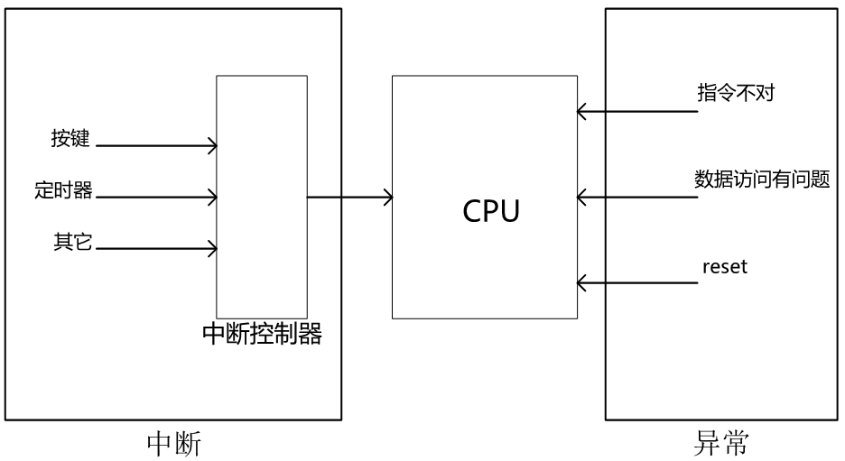

所有的`中断源` (按键、定时器等)，它们发出的中断汇聚到 **中断控制器**，再由中断控制器发信号给CPU，告诉它发生了那些紧急情况。

除了这些中断，还有什么可以打断CPU的运行？

- 指令不对
- 数据访问有问题
- reset信号
- 等等，这些都可以打断断CPU，这些被称为 **`异常`**
- 中断属于一种异常

ARM系统中如何处理异常与中断？重点在于 **保存现场** 以及 **恢复现场**，处理过程如下：

- 保存现场(各种寄存器)
- 处理异常(中断属于一种异常), 调用对应的中断处理程序
- 恢复现场

细化一下，在ARM系统中如何使用异常(中断)？

- 1. 初始化
    
    - 设置中断源，让它可以产生中断
    - 设置中断控制器(可以屏蔽某个中断，优先级)
    - 设置CPU总开关，使能中断

- 2. 执行其他程序：正常程序
    
- 3. 产生中断，举例：按下按键--->中断控制器--->CPU
- 4. cpu每执行完一条指令都会检查有无中断/异常产生
- 5. 发现有中断/异常产生，开始处理：
    
    - 保存现场
    - 分辨异常/中断，调用对应异常/中断的处理函数
    - 恢复现场

不同的芯片，不同的架构，在这方面的处理稍有差别：

- 保存/恢复现场：cortex M3/M4是`硬件实现`的，cortex A7是`软件实现`的
- CPU中止当前执行，跳转去执行处理异常的代码：也有差异
    - cortex M3/M4在`向量表上`放置的是`函数地址`
    - cortex A7在`向量表上`放置的是`跳转指令`

## ARM架构中异常与中断的处理

掌握了M3/M4 跟 A7 两种不同的异常处理方式, 那么基本上异常处理方式都掌握了.

### 1.1 处理流程是一样的

- 每执行完一条指令都会检查有无中断/异常产生
- 发现有中断/异常产生，开始处理：
    
    - 保存现场
    - 分辨异常/中断，调用对应的异常/中断处理函数
    - 恢复现场
        

不同的芯片，不同的架构，在这方面的处理稍有差别：

- CPU中止当前执行，跳转去执行处理异常的代码：也有差异
    - cortex M3/M4在向量表上放置的是函数地址
    - cortex A7在向量表上放置的是跳转指令
- 保存/恢复现场：cortex M3/M4是硬件实现的，cortex A7是软件实现的

### 1.2 cortex M3/M4

参考资料：`DDI0403E_B_armv7m_arm.pdf`、`ARM Cortex-M3与Cortex-M4权威指南.pdf`、`PM0056.pdf`

要想理解这个处理流程，需要从向量表说起。 向量，在数学定义里是 **有方向的量**，在程序里可以认为向量就是一个`数组`，里面有多个项。 在ARM架构里，对于异常/中断，它们的 **处理入口**会整齐地排放在一起。

### 1.2.1 M3/M4的向量表

M3/M4的向量表中，放置的是具体异常/中断的处理函数的地址。 比如发生`Reset`异常时，CPU就会从向量表里找到第1项，得到Reset_Handler函数的地址，跳转去执行。 比如发生`EXTI Line 0`中断时，CPU就会从向量表里找到第22项，得到`EXTI0_IRQHandler`函数的地址，跳转去执行。

向量表存放在程序的最前面. 被烧写到flash上面.

- 跳转之前，硬件会保存现场
- 函数执行完毕，返回之后，硬件会恢复现场

```
; Vector Table Mapped to Address 0 at Reset
                AREA    RESET, DATA, READONLY
                EXPORT  __Vectors
                EXPORT  __Vectors_End
                EXPORT  __Vectors_Size

__Vectors       DCD     __initial_sp               ; Top of Stack
                DCD     Reset_Handler              ; Reset Handler
                DCD     NMI_Handler                ; NMI Handler
                DCD     HardFault_Handler          ; Hard Fault Handler
                DCD     MemManage_Handler          ; MPU Fault Handler
                DCD     BusFault_Handler           ; Bus Fault Handler
                DCD     UsageFault_Handler         ; Usage Fault Handler
                DCD     0                          ; Reserved
                DCD     0                          ; Reserved
                DCD     0                          ; Reserved
                DCD     0                          ; Reserved
                DCD     SVC_Handler                ; SVCall Handler
                DCD     DebugMon_Handler           ; Debug Monitor Handler
                DCD     0                          ; Reserved
                DCD     PendSV_Handler             ; PendSV Handler
                DCD     SysTick_Handler            ; SysTick Handler

                ; External Interrupts
                DCD     WWDG_IRQHandler            ; Window Watchdog
                DCD     PVD_IRQHandler             ; PVD through EXTI Line detect
                DCD     TAMPER_IRQHandler          ; Tamper
                DCD     RTC_IRQHandler             ; RTC
                DCD     FLASH_IRQHandler           ; Flash
                DCD     RCC_IRQHandler             ; RCC
                DCD     EXTI0_IRQHandler           ; EXTI Line 0
                DCD     EXTI1_IRQHandler           ; EXTI Line 1
                DCD     EXTI2_IRQHandler           ; EXTI Line 2
                DCD     EXTI3_IRQHandler           ; EXTI Line 3
                DCD     EXTI4_IRQHandler           ; EXTI Line 4
                DCD     DMA1_Channel1_IRQHandler   ; DMA1 Channel 1
                DCD     DMA1_Channel2_IRQHandler   ; DMA1 Channel 2
                DCD     DMA1_Channel3_IRQHandler   ; DMA1 Channel 3
                DCD     DMA1_Channel4_IRQHandler   ; DMA1 Channel 4
                DCD     DMA1_Channel5_IRQHandler   ; DMA1 Channel 5
                DCD     DMA1_Channel6_IRQHandler   ; DMA1 Channel 6
                DCD     DMA1_Channel7_IRQHandler   ; DMA1 Channel 7
                DCD     ADC1_2_IRQHandler          ; ADC1 & ADC2
                DCD     USB_HP_CAN1_TX_IRQHandler  ; USB High Priority or CAN1 TX
                DCD     USB_LP_CAN1_RX0_IRQHandler ; USB Low  Priority or CAN1 RX0
                DCD     CAN1_RX1_IRQHandler        ; CAN1 RX1
                DCD     CAN1_SCE_IRQHandler        ; CAN1 SCE
                DCD     EXTI9_5_IRQHandler         ; EXTI Line 9..5
                DCD     TIM1_BRK_IRQHandler        ; TIM1 Break
                DCD     TIM1_UP_IRQHandler         ; TIM1 Update
                DCD     TIM1_TRG_COM_IRQHandler    ; TIM1 Trigger and Commutation
                DCD     TIM1_CC_IRQHandler         ; TIM1 Capture Compare
                DCD     TIM2_IRQHandler            ; TIM2
                DCD     TIM3_IRQHandler            ; TIM3
                DCD     TIM4_IRQHandler            ; TIM4
                DCD     I2C1_EV_IRQHandler         ; I2C1 Event
                DCD     I2C1_ER_IRQHandler         ; I2C1 Error
                DCD     I2C2_EV_IRQHandler         ; I2C2 Event
                DCD     I2C2_ER_IRQHandler         ; I2C2 Error
                DCD     SPI1_IRQHandler            ; SPI1
                DCD     SPI2_IRQHandler            ; SPI2
                DCD     USART1_IRQHandler          ; USART1
                DCD     USART2_IRQHandler          ; USART2
                DCD     USART3_IRQHandler          ; USART3
                DCD     EXTI15_10_IRQHandler       ; EXTI Line 15..10
                DCD     RTCAlarm_IRQHandler        ; RTC Alarm through EXTI Line
                DCD     USBWakeUp_IRQHandler       ; USB Wakeup from suspend
                DCD     TIM8_BRK_IRQHandler        ; TIM8 Break
                DCD     TIM8_UP_IRQHandler         ; TIM8 Update
                DCD     TIM8_TRG_COM_IRQHandler    ; TIM8 Trigger and Commutation
                DCD     TIM8_CC_IRQHandler         ; TIM8 Capture Compare
                DCD     ADC3_IRQHandler            ; ADC3
                DCD     FSMC_IRQHandler            ; FSMC
                DCD     SDIO_IRQHandler            ; SDIO
                DCD     TIM5_IRQHandler            ; TIM5
                DCD     SPI3_IRQHandler            ; SPI3
                DCD     UART4_IRQHandler           ; UART4
                DCD     UART5_IRQHandler           ; UART5
                DCD     TIM6_IRQHandler            ; TIM6
                DCD     TIM7_IRQHandler            ; TIM7
                DCD     DMA2_Channel1_IRQHandler   ; DMA2 Channel1
                DCD     DMA2_Channel2_IRQHandler   ; DMA2 Channel2
                DCD     DMA2_Channel3_IRQHandler   ; DMA2 Channel3
                DCD     DMA2_Channel4_5_IRQHandler ; DMA2 Channel4 & Channel5
__Vectors_End
```

### 1.2.2 M3/M4的异常/中断处理流程

发生异常/中断时，`硬件`上实现了这些事情：

* 保存现场：把被中断瞬间的寄存器的值保存进栈里
* 根据异常/中断号，从向量表中得到 **函数地址**，跳转过去执
* 函数执行完后，从栈中恢复现场

保存现场、分辨异常/中断、跳转执行，都是硬件实现的。
我们只需要在向量表中，把处理函数的地址填进去就可以了。

**硬件** 承包了大部分的工作。

M3/M4的向量表中，存放的是 **函数地址**。


### 1.3 cortex A7

参考资料：`ARM ArchitectureReference Manual ARMv7-A and ARMv7-R edition.pdf`

实际上，以前的S3C2440属于ARM9处理器，它的异常/中断处理流程跟cortex A7是一样的。

### 1.3.1 A7的向量表

A7的向量表中，放置的是某类异常的 **跳转指令**。
比如发生`Reset`异常时，CPU就会从向量表里找到第0项，得到`b reset`指令，执行后就跳转到reset函数。
比如发生任何的中断时，CPU就会从向量表里找到第6项，得到`ldr  pc, _irq`指令，执行后就跳转到_irq函数。

* 跳转之前，硬件只会保存CPSR寄存器
* 跳转之后，软件要保存现场
* 函数执行完毕，返回之前，软件恢复现场

```
_start: 
    b	reset
	ldr	pc, _undefined_instruction
	ldr	pc, _software_interrupt
	ldr	pc, _prefetch_abort
	ldr	pc, _data_abort
	ldr	pc, _not_used
	ldr	pc, _irq
	ldr	pc, _fiq
```


### 1.3.2 A7的异常/中断处理流程

发生异常/中断时，硬件上实现了这些事情：

* CPU切换到对应的异常模式，比如IRQ模式、未定义模式、SVC模式
* 保存被中断时的CPSR到SPSR
	- CPSR：current program status register，当前程序状态寄存器
	- SRSR：saved program status register，保存的程序状态寄存器

* 跳到这个异常的入口地址去，执行 **指令**，这通常是一条跳转指令

软件要做的事情就比较多了：

* 保存现场
* 分辨异常/中断
* 调用对应的处理函数
* 恢复现场

A7的向量表中，存放的是**跳转指令**。


## 异常处理深入分析_保存现场

### 1.1 回顾一下处理流程

CPU每执行完一条指令都会检查有无中断/异常产生，发现有中断/异常产生，开始处理：

* 保存现场
* 分辨异常/中断，调用对应的异常/中断处理函数
* 恢复现场

对于不用的处理器，具体的处理工作有差别：

* 保存现场：cortex M3/M4里是硬件完成，cortex A7等是软件实现
* 分辨异常/中断：cortex M3/M4里是硬件完成，cortex A7等是软件实现
* 调用处理函数：cortex M3/M4里是硬件来调用，cortex A7等是软件自己去调用
* 恢复现场：cortex M3/M4里是软件触发、硬件实现，cortex A7等是软件实现

不管是硬件还是软件实现，第一步都是**保存现场**。


### 1.2 为什么要保存现场

任何程序，最终都会转换为机器码，上述C代码可以转换为右边的汇编指令。
对于这4条指令，它们可能随时被异常打断，怎么保证异常处理完后，被打断的程序还能正确运行？

* 这4条指令涉及R0、R1寄存器，程序被打断时、恢复运行时，R0、R1要保持不变
* 执行完第3条指令时，比较结果保存在**程序状态寄存器**里，程序被打断时、恢复运行时，程序状态寄存器保持不变

* 这4条指令，读取a、b内存，程序被打断时、恢复运行时，a、b内存保持不变

内存保持不变，这很容易实现，程序不越界就可以。
所以，关键在于R0、R1、程序状态寄存器要保持不变(当然不止这些寄存器)：

* 在处理异常前，把这些寄存器保存在栈中，这称为**保存现场**
* 在处理完异常后，从栈中恢复这些寄存器，这称为**恢复现场**


### 1.3 保存现场

ARM处理器中有这些寄存器：


在arm中有个ATPCS规则(ARM-THUMB procedure call standard（ARM-Thumb过程调用标准）。
约定R0-R15寄存器的用途：

* R0-R3

  调用者和被调用者之间传参数, 主调函数负责备份

* R4-R11

  函数可能被使用，所以在函数的入口保存它们，在函数的出口恢复它们。
  


还有一个**程序状态寄存器**，对于M3/M4它被称为 **XPSR**，对于A7它被称为 **CPSR**，我们简称为PSR。

R0-R15、PSR，就是所谓的 **现场**。
发生异常/中断后，在处理异常/中断前，需要**保存现场**，难道需要保存所有这些寄存器吗？

不需要！

在C函数中，可以修改R0~R3、R12、R14(LR)以及PSR。如果C函数要用到这些寄存器，就要把它们保存到栈里，在函数结束前在从栈中恢复它们。

这些寄存器被拆分成2部分：**调用者保存的寄存器(R0-R3,R12,LR,PSR)**、**被调用者保存的寄存器(R4-R11)**。

比如函数A调用函数B，函数A应该知道：

* R0-R3是用来传参数给函数B的
* 函数B可以肆意修改R0-R3
* 函数A不要指望函数B帮你保存R0-R3
* 保存R0-R3，是函数A的事情
* 对于LR、PSR也是同样的道理，保存它们是函数A的责任

对于函数B：

* 我用到R4-R11中的某一个，我都会在函数入口保存、在函数返回前恢复
* 保证在B函数调用前后，函数A看到的R4-R11保存不变

假设函数B就是异常/中断处理函数，函数B本身能保证R4-R11不变，那么保存现场时，只需要保存这些：

* 调用者保存的寄存器(R0-R3,R12,LR,PSR)
* PC

### 1.4 对于M3/M4

参考资料：`DDI0403E_B_armv7m_arm.pdf`、`ARM Cortex-M3与Cortex-M4权威指南.pdf`、`PM0056.pdf`

### 1.4.1 硬件保存现场


### 1.4.2 然后调用C处理函数

C函数执行完后，它返回LR所指示的位置。
难道把LR设置为被中断的程序的地址就行了吗？

如果只是返回LR所指示的地方，硬件帮我们保存在栈里的寄存器，怎么恢复？(注意, 这些都是硬件完成的, 而不是你可以用软件来完成的)

M3/M4在调用异常处理函数前，把LR设置为一个特殊的值，转给特殊的值被称为 **EXC_RETURN**。

当PC寄存器的值等于 **EXC_RETURN** 时，会`触发异常返回机制`，简单地说：会从栈里恢复R0-R3,R12,LR,PC,PSR等寄存器。

**EXC_RETURN**的值，请参考`ARM Cortex-M3与Cortex-M4权威指南.pdf`，截图如下：
- 

补充2个知识点：

* 操作模式：M3/M4有两个操作模式

  * 处理模式：执行中断服务程序等异常处理时，处于 **处理模式**
  * 线程模式：执行普通应用程序代码时，处于 **线程模式**

* M3/M4有2个SP寄存器：SP_process、SP_main
- 有些RTOS在运行用户程序时会使用SP_process，默认使用SP_main。

### 1.5 对于A7

它寄存器如下：
- 

处理器有9中模式：User、Sys、FIQ、IRQ、ABT、SVC、UND、MON、HYP。

上图中深色的寄存器，表示该模式下的"Banked"寄存器，比如SPSR寄存器，在很多模式下都有自己的、单独的寄存器。

比如IRQ模式下访问SPSR时，访问到的是IRQ模式下自己的SPSR_irq，别的模式下无法访问SPSR_irq。

比较值得关注的是FIQ模式，名为"快中断"，它有很多"Banked"寄存器：R8-R12,SP,LR。

在FIQ模式下，它既然能使用自己的R8-R12,SP,LR，自然不需要去保存被中断的程序的"R8-R12,SP,LR"了。

省去保存这几个寄存器的时间，处理中断时自然就快很多，所以被称为"FIQ"。

从上图也看到，几乎每个模式下都有自己是SP寄存器，意味着这些模式下有自己的栈。


当发生异常时，以IRQ为例：

* 1. CPU会自动切换进入对应的模式，比如进入IRQ模式, 使用SP_irq
* 2. 并且会把被中断时的CPSR保存到SPSR_irq里
- 3. 然后就跳转到对应的异常类型总入口.
	- `ldr pc, _irq`
	- 3.1 保存现场  R0~R3, R12, LR入栈, 栈指针寄存器用的是SP_irq
	- 3.2 分辨异常/中断, 处理异常/中断
	- 3.3 恢复现场

1 2 3 都是硬件做的, 3.1 3.2 3.3 是由软件来完成.

所以发生异常/中断时，在保存现场时，只需要保存：

* 调用者保存的寄存器(R0-R3,R12,LR)
* PC

## CPU模式(Mode)状态(State)与寄存器

这节课我们来讲CPU的工作模式(Mode) 状态(State)寄存器，主要是cortex A7。参考：

- `《ARM体系结构与编程》作者：杜春雷`
- `ARM ArchitectureReference Manual ARMv7-A and ARMv7-R edition.pdf`
- `S3C2440A_UserManual_Rev13.pdf`：没错，这个手册里描述得更清晰

ARM9和cortex A7的CPU模式、状态、寄存器，以及发生异常时的处理细节，几乎是一模一样的。

### 1.1 CPU有9种Mode

跟ARM9相比，多了2中Mode：Monitor、Hyp。在本课程中不涉及这两种模式。

除usr模式外，其他模式是 **特权模式**。在特权模式下, 可以随意切换到别的模式, 在usr模式下, 不能随便切换到别的模式. 

除usr 跟 sys外, 其他都是 **异常模式**

usr模式下，无法通过修改CPSR寄存器进入其他模式。
在其他模式下，可以通过修改CPSR寄存器进入其他模式。

* usr：用户模式
* sys：系统模式
* undefined(und)：未定义指令模式
* Supervisor(svc)：管理模式
* Monitor
* Abort(abt)：中止模式
	- 有两种情况会导致CPU进入中止模式：
		* 指令预取中止(读取某条指令时发生错误) 
		* 数据访问终止 (读写某个地址上的数据时，发生错误)
* Hyp
* IRQ(irq)：中断模式
* FIQ(fiq)：快中断模


### 1.2 有2种State

以前的ARM9芯片，支持两种指令集：

* ARM state：每条指令都是32位的，高效，但是占空间
* Thumb state：每天指令都是16位的，节省空间，但是有时候效率不高

对于Cortex A7芯片，还有Thumb2指令集，支持16位、32位指令混合编程。

### 1.3 寄存器

有这些寄存器：

* 通用寄存器
* 备份寄存器(banked register)
* 当前程序状态寄存器(CPSR，Current Program Status Register)
* CPSR的备份寄存器(SPSR，Save Program Status Register)

### 1.3.1 寄存器总图


我们不关心Monitor模式、Hyp模式，那么可以看ARM9手册上的这个图，更直观：


### 1.3.2 备份寄存器

上图中阴影部分，是该模式下自己专有的寄存器。
比如执行这样的指令：

```
mov R0, R8
```

在System 模式下访问的是R0和R8，在所有模式下访问R0都是同一个寄存器。
但是在FIQ模式下，访问R8时访问，它对应FIQ模式专属的R8寄存器，不是同一个物理上的寄存器，相当于：

```
mov R0,R8_fiq
```

在这各种异常模式下，都有自己专属的R13、R14寄存器：

* R13用作SP(栈) ：所以发生异常时，使用的是该异常模式下的栈
* R14用作LR(返回地址)：用来保存发生异常时的指令地址，处理完异常后，根据LR的值恢复被中断的程序

为什么快中断(FIQ)有那么多专属寄存器？
回顾一下中断的处理过程：

* 保存现场(保存被中断模式的寄存器)
* 处理异常
* 最后恢复这些寄存器
  
假设程序正在系统模式/用户模式下运行， 当发生中断时，需要把R0 ~ R14这些寄存器全部保存下来。
但如果是快中断，那么就不需要保存系统/用户模式下的R8 ~ R12这几个寄存器，
因为在FIQ模式下有自己专属的R8 ~ R12寄存器，
这样可以省略保存寄存器的时间，加快处理速度。

Linux系统下, FIQ很少用. 单片机这种对时间要求很高的场景可能会用到.

### 1.3.3 程序状态寄存器

CPSR，表示当前程序状态寄存器，这是一个特别重要的寄存器
SPSR，用来保存CPSR，它们格式如下:
- 
- 
- 

*  M4 ~ M0 表示当前CPU处于哪一种模式(Mode)
  我们可以读取这5位来判断CPU处于哪一种模式，也可以修改它进入其他模式。
  **注意**：假如当前处于用户模式下，是没有权限修改这些位的。
  M4 ~ M0对应模式，如下图所示：


* 其他位
  * Bit5 State bits：表示CPU工作于Thumb State还是ARM State，用的指令集是什么。
  * Bit6 FIQ disable：当bit6等于1时，FIQ被禁止。
  * Bit7 IRQ disable：当bit5等于1时，禁止所有的IRQ中断，这个位是IRQ的总开关
  * Bite28 ~ Bit31是状态位
    什么是状态位，比如说执行这两条指令
    
    ```
    cmp R0, R1
    beq xxx
    ```

    如果R0 等于 R1，第1条指令会导致CPSR中的Z位等于1。
    后面的跳转指令，会根据Z位的值决定是否跳转：Z等于1就跳转，否则就不跳转。

每个模式下都有自己的SPSR寄存器，表示发生异常时，这个寄存器会用来保存被中断的模式下的CPSR。
- 就比如程序在系统模式下运行，当发生中断时会进入irq模式时，这个SPSR_irq就保存系统模式下的CPSR。

### 1.4 发生异常时处理流程

我们来看看发生异常时CPU是如何协同工作的。

### 1.4.1 异常向量表

在ARM9里，异常向量表基地址只有两个取值：0、0xFFFF0000。
对于cortex A7，它的异常向量表基地址是可以修改的。


### 1.4.2 进入异常的处理流程(硬件)

- 
- 

我们来翻译一下：
发生异常时，我们的CPU会做什么事情

1. 硬件确定要进入哪种异常模式
2. LR寄存器被更新，它表示处理完异常后要返回到哪里，这个值可能需要修改。
3. SPSR = 被中断时的CPSR
4. 对于"Security Exceptions"，……，本课程不涉及
5. 更新异常模式下的CPSR：设置模式位、设置mask bit(屏蔽其他异常)、设置指令集状态位
6. PC = 异常入口地址
7. 从PC所指示地方执行程序

### 1.4.3 退出异常

在`ARM ArchitectureReference Manual ARMv7-A and ARMv7-R edition.pdf`中，对异常的退出，描述得很复杂。但是很多情况，我们并不涉及。
所以我们参考`S3C2440A_UserManual_Rev13.pdf`，它描述得更清晰、简单。

- 
- 

从异常中退出，要做什么事情？

1. 让LR减去某个值，然后赋值给PC(PC = 某个异常LR寄存器减去 offset)
   减去什么值呢？
   也就是我们怎么返回去继续执行原来的程序，根据下面这个表来取值：

   如果发生的是SWI可以把 R14_svc复制给PC
   如果发生的是IRQ可以把R14_irq的值减去4赋值给PC
2. 把CPSR的值恢复(CPSR 值等于 某一个一场模式下的SPSR)
3. 清中断（如果是中断的话，对于其他异常不用设置）

### 1.4.4 确定异常返回地址

发生异常时，LR寄存器里保存的值是什么？

```
LR = Preferred return address + offset
```

"Preferred return address"是什么？请看下图：
- 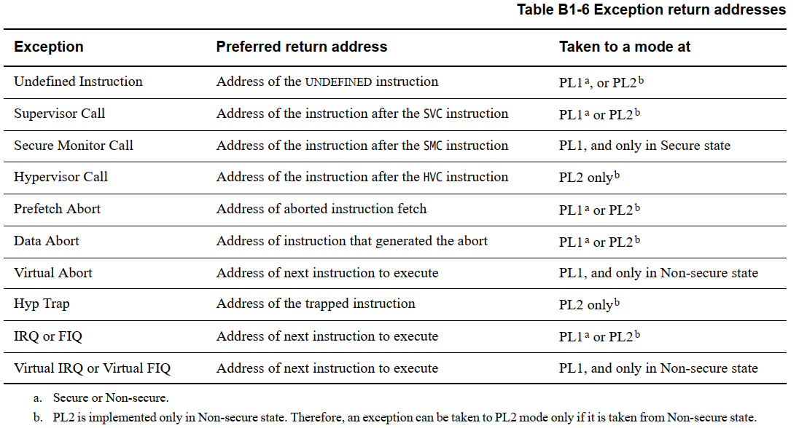

offset是什么？请看下图：
- 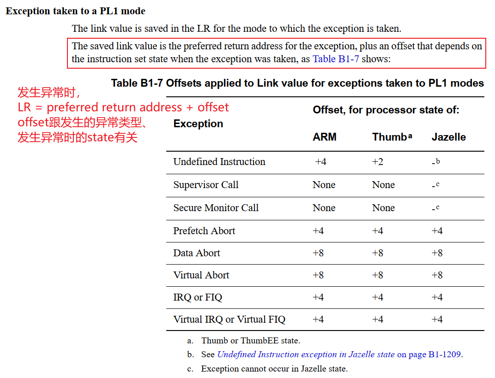
- 

从异常中返回时，LR可能需要调整，再赋给PC。
`ARM9`的手册讲得比较清楚，返回指令如下：
- 
- 

## ARM_Thumb指令集程序示例

### 1.1 汇编里指定指令集

对于IMX6ULL、STM32MP157，默认使用ARM指令集。
在汇编文件里，可以使用这样的语法告诉编译器：

### 1.1.1 新语法

```
.arm   // 表示后续的指令使用ARM指令集
.thumb // 表示后续的指令使用thumb指令集	
```

### 1.1.2 以前的语法

```
.code 32 // 表示后续的指令使用ARM指令集
.code 16 // 表示后续的指令使用thumb指令集
```

### 1.2 编译C文件时指定指令集

使用GCC编译时：

```
-marm     // 使用ARM指令集编译
-mthumb   // 使用Thumb指令集编译

比如：
arm-linux-gcc -marm -c -o main.o main.c
```

### 1.3 汇编里切换状态

要切换CPU的State，比如从ARM切换到Thumb，或者从Thumb切换到ARM，可以使用BX、BLX指令：

```
// 如果R0的bit0为0，表示切换到ARM State; 如果R0的bit0位1，表示切换到Thumb State
BX R0   
BLX R0
```

汇编里调用C函数时，可以直接如此调用：

```
LDR PC, =main   // 如果main函数时用Thumb指令集编译的，最终的指令如下：

// 注意到下面的c020051b，它的bit0为1
c0200010:	e59ff004 	ldr	pc, [pc, #4]	; c020001c <AB+0x14>
c0200014:	c0100000 	andsgt	r0, r0, r0
c0200018:	c02004a3 	eorgt	r0, r0, r3, lsr #9
c020001c:	c020051b 	eorgt	r0, r0, fp, lsl r5
```

# 实战_未定义指令异常

要想深入理解异常处理，需要写程序来验证。
本节课程故意执行一条未定义的指令，让它触发异常。

参考资料：`ARM ArchitectureReference Manual ARMv7-A and ARMv7-R edition.pdf`

## 1.1 A7的异常向量表

从向量表可以看出，A7支持哪些异常：未定义指令、软中断(SVC)、预取指令中止、数据中止、IRQ、FIQ。

```
_start: 
    b	reset
	ldr	pc, _undefined_instruction
	ldr	pc, _software_interrupt
	ldr	pc, _prefetch_abort
	ldr	pc, _data_abort
	ldr	pc, _not_used
	ldr	pc, _irq
	ldr	pc, _fiq
```


## 1.2 什么是未定义指令？

未定义指令，即使"还没有定义的指令"，也就是CPU不认识的指令。
很多时候，我们故意在代码里插入一些伪造的指令，故意让CPU执行到它时触发错误。
这在调试时很有用，比如想打断点：怎么实现呢？
有很多种方法：硬件监视点(watch point，数量有限)、软件断点(数量无限)。
软件断点就是使用`未定义指令`来实现的，比如想让程序执行到某个地址A时停下来，可以这样做：

* 地址A上原来的指令是`xxx`
* 我们故意把它改成`yyy`，改成一条CPU无法识别的指令
* 当CPU执行到地址A上的`yyy`指令时，触发异常
* 在异常处理函数里，打印更多调试信息
* 调试完毕后，恢复地址A上的指令为`xxx`
* 从地址A重新执行程序

本节教程并不打算制作调试器，这里只是讲述一下未定义指令的作用，使用它来深入理解异常处理流程。

## 1.3 在汇编代码里插入未定义指令

在代码中插入：

```
.word  0xffffffff
```

看看会发生什么事情。

## 1.4 编程

### 1.4.1 设置异常向量表基地址

```
MRC p15, 0, <Rt>, c12, c0, 0 ; Read VBAR into Rt
MCR p15, 0, <Rt>, c12, c0, 0 ; Write Rt to VBAR
```

# 实战_SVC异常

要想深入理解异常处理，需要写程序来验证。
本节课程故意执行一条SVC指令，让它触发异常。

参考资料：`ARM ArchitectureReference Manual ARMv7-A and ARMv7-R edition.pdf`

## 1.1 A7的异常向量表

从向量表可以看出，A7支持哪些异常：未定义指令、软中断(SVC)、预取指令中止、数据中止、IRQ、FIQ。

```
_start: 
    b	reset
	ldr	pc, _undefined_instruction
	ldr	pc, _software_interrupt
	ldr	pc, _prefetch_abort
	ldr	pc, _data_abort
	ldr	pc, _not_used
	ldr	pc, _irq
	ldr	pc, _fiq
```


## 1.2 什么是SVC指令？

在ARM指令中，有一条指令：

```
SVC #VAL
```

它会触发一个异常。
在操作系统中，比如各类RTOS或者Linux，都会使用`SVC`指令故意触发异常，从而导致内核的异常处理函数被调用，进而去使用内核的服务。
比如Linux中，各类文件操作的函数`open`、`read`、`write`，它的实质都是`SVC`指令。
本节课程不讲解 `SVC` 在内核中的使用，我们只是看看如何处理 `SVC` 触发的异常。

## 1.3 在汇编代码里插入SVC指令

在代码中插入：

```
SVC #1
```

看看会发生什么事情。

## 1.4 编程

### 1.4.1 设置SVC模式的栈

```
do_svc:
    /* 设置SP_und */
    ldr sp, =STACK_BASE - STACK_SIZE - STACK_SIZE
```

### 1.4.2 保存现场

```
    /* 保存现场 */
    stmdb sp!, {R0-R3,R12,LR}
```

### 1.4.3 处理异常

```
    /* 调用处理函数 */
    bl do_svc_c
```

### 1.4.4 恢复现场

```
    /* 恢复现场 */
    ldmia sp!, {R0-R3,R12,PC}^
```

# 中断的硬件框架

## 1.1 中断路径上的3个部件

* 中断源
  中断源多种多样，比如GPIO、定时器、UART、DMA等等。
  它们都有自己的寄存器，可以进行相关设置：使能中断、中断状态、中断类型等等。

* 中断控制器
  各种中断源发出的中断信号，汇聚到中断控制器。
  可以在中断控制器中设置各个中断的优先级。
  中断控制器会向CPU发出中断信号，CPU可以读取中断控制器的寄存器，判断当前处理的是哪个中断。
  中断控制器有多种实现，比如：
  * STM32F103中被称为 NVIC：Nested Vectored Interrupt controller(嵌套向量中断控制器)
  * ARM9中一般是芯片厂家自己实现的，没有统一标准
  * Cortex A7中使用GIC(Generic Interrupt Controller)

* CPU
  CPU每执行完一条指令，都会判断一下是否有中断发生了。
  CPU也有自己的寄存器，可以设置它来使能/禁止中断，这是中断处理的总开关。

- 

## 1.2 STM32F103的GPIO中断

参考资料：`STM32F103数据手册.pdf`、`ARM Cortex-M3与Cortex-M4权威指南.pdf`、`PM0056.pdf`

对于GPIO中断，STM32F103又引入了`External interrupt/event controller (EXTI)`。
用来设置GPIO的中断类型，如下图：

- 
- 

EXTI可以给NVIC提供16个中断信号：EXTI0~EXTI15。
那么某个EXTIx，它来自哪些GPIO呢？这需要设置GPIO控制器。

### 1.2.1 GPIO控制器

STM32F103的GPIO控制器中有 `AFIO_EXTICR1 ~ AFIO_EXTICR4` 一共4个寄存器
名为：External interrupt configuration register，外部中断配置寄存器。
用来选择某个外部中断EXTIx的中断源，示例如下：

- 

**注意**：从上图可知，EXTI0只能从PA0、……、PG0中选择一个，这也意味着PA0、……、PG0中只有一个引脚可以用于中断。这跟其他芯片不一样，很多芯片的任一GPIO引脚都可以同时用于中断。

- 

### 1.2.2 EXTI

在GPIO控制器中，可以设置某个GPIO引脚作为中断源，给EXTI提供中断信号。
但是，这个中断的触发方式是怎样的？高电平触发、低电平触发、上升沿触发、下降沿触发？
这需要进一步设置。
EXTI框图如下：
- 

沿着上面框图中的红线，我们要设置：

* Falling trigger selection register：是否选择下降沿触发
* Rising trigger selection register：是否选择上升沿触发
* Interrupt mask register：是否屏蔽中断

当发生中断时，可以读取下列寄存器判断是否发生了中断、发生了哪个中断：

* Pending reqeust register

要使用EXTI，流程如下：
- 
- 

翻译如下：

* 配置EXTI_IMR：允许EXTI发出中断
* 配置EXTI_RTSR、EXTI_FTSR，选择中断触发方式
* 配置NVIC中的寄存器，允许NVIC把中断发给CPU

### 1.2.3 NVIC

多个中断源汇聚到NVIC，NVIC的职责就是从多个中断源中取出优先级最高的中断，向CPU发出中断信号。
处理中断时，程序可以写NVIC的寄存器，清除中断。
涉及的寄存器：
- 

我们暂时只需要关注：ISER(中断设置使能寄存器)、ICPR(中断清除挂起寄存器)。
要注意的是，这些寄存器有很多个，比如ISER0、ISER1等等。里面的每一位对应一个中断。
ISER0中的bit0对应异常向量表中的第16项(向量表从第0项开始)，如下图：

- 

### 1.2.4 CPU

cortex M3/M4处理器内部有这几个寄存器：

#### 1. PRIMASK


  把PRIMASK的bit0设置为1，就可以屏蔽所有**优先级可配置**的中断。
  可以使用这些指令来设置它：

  ```
  CPSIE I  ; 清除PRIMASK，使能中断
  CPSID I  ; 设置PRIMASK，禁止中断
  
  或者：
  MOV R0, #1
  MSR  PRIMASK R0  ; 将1写入PRIMASK禁止所有中断
  
  MOV R0, #0
  MSR PRIMASK, R0  ; 将0写入PRIMASK使能所有中断
  ```


#### 2. FAULTMASK


  FAULTMASK和PRIMASK很像，它更进一步，出来一般的中断外，把HardFault都禁止了。
  只有NMI可以发生。
  可以使用这些指令来设置它：

  ```
  CPSIE F  ; 清除FAULTMASK
  CPSID F  ; 设置FAULTMASK
  
  或者：
  MOV R0, #1
  MSR  FAULTMASK R0  ; 将1写入FAULTMASK禁止中断
  
  MOV R0, #0
  MSR FAULTMASK, R0  ; 将0写入FAULTMASK使能中断
  ```


#### 3. BASEPRI


  BASEPRI用来屏蔽这些中断：它们的优先级，其值大于或等于BASEPRI。
  可以使用这些指令来设置它：

  ```
  MOVS R0, #0x60
  MSR BASEPRI, R0   ; 禁止优先级在0x60~0xFF间的中断
  
  MRS R0, BASEPRI   ; 读取BASEPRI
  
  MOVS R0, #0
  MSR BASEPRI, R0    ; 取消BASEPRI屏蔽
  ```


## 1.3 STM32MP157的GPIO中断

STM32MP157的GPIO中断在硬件上的框架，跟STM32F103是类似的。
它们的中断控制器不一样，STM32MP157中使用的是GIC：

- 
- 

### 1.3.1 GPIO控制器

对于STM32MP157，除了把GPIO引脚配置为输入功能外，GPIO控制器里没有中断相关的寄存器。
请参考前面的课程《01_使用按键控制LED(STM32MP157)》。

### 1.3.2 EXTI

GPIO引脚可以向CPU发出中断信号，所有的GPIO引脚都可以吗？
不是的，需要在EXTI控制器中设置、选择。
GPIO引脚触发中断的方式是怎样的？高电平触发、低电平触发、上升沿触发、下降沿触发？
这需要进一步设置。
这些，都是在EXTI中配置，EXTI框图如下：


沿着红线走：

#### 1. 设置`EXTImux`

选择哪些GPIO可以发出中断。
只有16个EXTI中断，从EXTI0~EXTI15；每个EXTIx中断只能从PAx、PBx、……中选择某个引脚，如下图所示：


**注意**：从上图可知，EXTI0只能从PA0、……中选择一个，这也意味着PA0、……中只有一个引脚可以用于中断。这跟其他芯片不一样，很多芯片的任一GPIO引脚都可以同时用于中断。

通过EXTI_EXTICR1等寄存器来设置EXTIx的中断源是哪个GPIO引脚，入下图所示：


#### 2. 设置`Event Trigger`

设置中断触发方式：

- 

#### 3. 设置`Masking`

允许某个EXTI中断：

- 

#### 4. 查看中断状态、清中断

- 

### 1.3.3 GIC

`ARM体系结构`定义了通用中断控制器（GIC），该控制器包括一组用于管理单核或多核系统中的中断的硬件资源。GIC提供了内存映射寄存器，可用于管理中断源和行为，以及（在多核系统中）用于将中断路由到各个CPU核。它使软件能够屏蔽，启用和禁用来自各个中断源的中断，以（在硬件中）对各个中断源进行优先级排序和生成软件触发中断。它还提供对TrustZone安全性扩展的支持。GIC接受系统级别中断的产生，并可以发信号通知给它所连接的每个内核，从而有可能导致IRQ或FIQ异常发生。

GIC比较复杂，下一个视频再详细讲解。

### 1.3.4 CPU

CPU的CPSR寄存器中有一位：I位，用来使能/禁止中断。

- 

可以使用以下汇编指令修改I位：

```
  CPSIE I  ; 清除I位，使能中断
  CPSID I  ; 设置I位，禁止中断
```

## 1.4 IMX6ULL的GPIO中断

IMX6ULL的GPIO中断在硬件上的框架，跟STM32MP157是类似的。
IMX6ULL中没有EXTI控制器，对GPIO的中断配置、控制，都在`GPIO模块内部实现`：

- 

### 1.4.1 GPIO控制器

#### 1. 配置GPIO中断

每组GPIO中都有对应的GPIOx_ICR1、GPIOx_ICR2寄存器(interrupt configuration register )。
每个引脚都可以配置为中断引脚，并配置它的触发方式：

- 

#### 2. 使能GPIO中断

- 


#### 3. 判断中断状态、清中断

- 

### 1.4.2 GIC

`ARM体系结构`定义了通用中断控制器（GIC），该控制器包括一组用于管理单核或多核系统中的中断的硬件资源。GIC提供了内存映射寄存器，可用于管理中断源和行为，以及（在多核系统中）用于将中断路由到各个CPU核。它使软件能够屏蔽，启用和禁用来自各个中断源的中断，以（在硬件中）对各个中断源进行优先级排序和生成软件触发中断。它还提供对TrustZone安全性扩展的支持。GIC接受系统级别中断的产生，并可以发信号通知给它所连接的每个内核，从而有可能导致IRQ或FIQ异常发生。

GIC比较复杂，下一个视频再详细讲解。

### 1.4.3 CPU

CPU的CPSR寄存器中有一位：I位，用来使能/禁止中断。

- 

可以使用以下汇编指令修改I位：

```
  CPSIE I  ; 清除I位，使能中断
  CPSID I  ; 设置I位，禁止中断
```


# GIC介绍与编程

参考资料：`ARM® Generic Interrupt Controller Architecture Specification Architecture version 2.0(IHI0048B_b_gic_architecture_specification_v2).pdf`

## 1.1 GIC介绍

​	ARM体系结构定义了通用中断控制器（GIC），该控制器包括一组用于管理单核或多核系统中的中断的硬件资源。GIC提供了内存映射寄存器，可用于管理中断源和行为，以及（在多核系统中）用于将中断路由到各个CPU核。它使软件能够屏蔽，启用和禁用来自各个中断源的中断，以（在硬件中）对各个中断源进行优先级排序和生成软件触发中断。它还提供对TrustZone安全性扩展的支持。GIC接受系统级别中断的产生，并可以发信号通知给它所连接的每个内核，从而有可能导致IRQ或FIQ异常发生。

**从软件角度来看，GIC具有两个主要功能模块，简单画图如下：**


① 分发器(Distributor)
	系统中的所有中断源都连接到该单元。可以通过仲裁单元的寄存器来控制各个中断源的属性，例如优先级、状态、安全性、路由信息和使能状态。
分发器把中断输出到“CPU接口单元”，后者决定将哪个中断转发给CPU核。

② CPU接口单元（CPU Interface）
	CPU核通过控制器的CPU接口单元接收中断。CPU接口单元寄存器用于屏蔽，识别和控制转发到CPU核的中断的状态。系统中的每个CPU核心都有一个单独的CPU接口。
	中断在软件中由一个称为`中断ID的数字`标识。中断ID唯一对应于一个中断源。软件可以使用中断ID来识别中断源并调用相应的处理程序来处理中断。呈现给软件的中断ID由系统设计确定，一般在SOC的数据手册有记录。


**中断可以有多种不同的类型：**

① 软件触发中断（SGI，Software Generated Interrupt）
  	这是由软件通过写入 专用仲裁单元的寄存器 即 软件触发中断寄存器（ICDSGIR）显式生成的。它最常用于 `CPU核间通信` 。SGI既可以发给所有的核，也可以发送给系统中选定的一组核心。中断号 0-15 保留用于 SGI 的中断号。用于通信的确切中断号由软件决定。 

② 私有外设中断（PPI，Private Peripheral Interrupt）
	这是由 `单个CPU核私有的外设` 生成的。PPI的中断号为 16-31 。它们标识CPU核私有的中断源，并且独立于另一个内核上的相同中断源，比如，`每个核的计时器`。

③ 共享外设中断（SPI，Shared Peripheral Interrupt）
	这是由外设生成的，中断控制器可以将其路由到多个核。中断号为32-1020。SPI用于从整个系统可访问的各种外围设备发出中断信号。

​	 中断可以是边沿触发的（在中断控制器检测到相关输入的上升沿时认为中断触发，并且一直保持到清除为止）或电平触发（仅在中断控制器的相关输入为高时触发）。

- 

**中断可以处于多种不同状态：**

① 非活动状态（Inactive）–这意味着该中断未触发。
② 挂起（Pending）–这意味着中断源已被触发，但正在等待CPU核处理。待处理的中断要通过转发到CPU接口单元，然后再由CPU接口单元转发到内核。
③ 活动（Active）–描述了一个已被内核接收并正在处理的中断。
④ 活动和挂起（Active and pending）–描述了一种情况，其中CPU核正在为中断服务，而GIC又收到来自同一源的中断。


​	`中断的优先级` 和 `可接收中断的核` 都在`分发器(distributor)` 中配置。外设发给分发器的中断将标记为`pending状态`（或Active and Pending状态，如触发时果状态是active）。distributor确定可以传递给CPU核的优先级最高的pending中断，并将其转发给内核的CPU interface。通过CPU interface，该中断又向CPU核发出信号，此时CPU核将触发FIQ或IRQ异常。

​	作为响应，CPU核执行异常处理程序。异常处理程序必须从CPU interface寄存器查询中断ID，并开始为中断源提供服务。完成后，处理程序必须写入CPU interface寄存器以报告处理结束。然后CPU interface准备转发distributor发给它的下一个中断。

​	在处理中断时，中断的状态开始为pending，active，结束时变成inactive。中断状态保存在distributor寄存器中。

下图是GIC控制器的逻辑结构：


- 0到15号中断为SGI中断, 软件产生的中断
- 16到31号中断 为PPI中断, 私有外设中断
	- 0到31号中断 是属于某一个CPU核 的, 每个CPU核 都能发出自己的0到31号中断.
- 32到1019号中断 是共享外部中断, 所有CPU核收到的中断号一样. 32到1019是所有CPU核 都看的到的. 第0个CPU核和第1个CPU核看到的32号中断都是属于同一个设备发出的.

- 
- 

### 1.1.1 配置

​	GIC作为内存映射的外围设备，被软件访问。所有内核都可以访问公共的distributor单元，但是CPU interface是备份的，也就是说，每个CPU核都使用相同的地址来访问其专用CPU接口。一个CPU核不可能访问另一个CPU核的CPU接口。

**Distributor拥有许多寄存器，可以通过它们配置各个中断的属性。这些可配置属性是：**

*  中断优先级：Distributor使用它来确定接下来将哪个中断转发到CPU接口。
* 中断配置：这确定中断是对电平触发还是边沿触发。
* 中断目标：这确定了可以将中断发给哪些CPU核。
* 中断启用或禁用状态：只有Distributor中启用的那些中断变为挂起状态时，才有资格转发。
* 中断安全性：确定将中断分配给Secure还是Normal world软件。
* 中断状态。

  Distributor还提供优先级屏蔽，可防止低于某个优先级的中断发送给CPU核。
  每个CPU核上的CPU interface，专注于控制和处理发送给该CPU核的中断。

 
### 1.1.2 初始化

​	Distributor和CPU interface在复位时均被禁用。复位后，必须初始化GIC，才能将中断传递给CPU核。
​	在Distributor中，软件必须配置优先级、目标核、安全性并启用单个中断；随后必须通过其控制寄存器使能。
​	对于每个CPU interface，软件必须对优先级和抢占设置进行编程。每个CPU接口模块本身必须通过其控制寄存器使能。
​	在CPU核可以处理中断之前，软件会通过在向量表中设置有效的中断向量并清除CPSR中的中断屏蔽位来让CPU核可以接收中断。
​	可以通过禁用Distributor单元来禁用系统中的整个中断机制；可以通过禁用单个CPU的CPU接口模块或者在CPSR中设置屏蔽位来禁止向单个CPU核的中断传递。也可以在Distributor中禁用（或启用）单个中断。
​	为了使某个中断可以触发CPU核，必须将各个中断，Distributor和CPU interface全部使能，并

将CPSR中断屏蔽位清零，如下图：

- 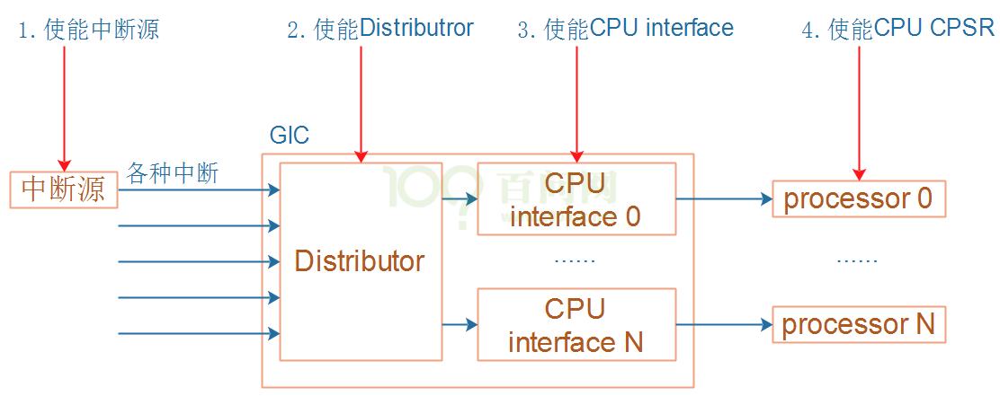

### 1.1.3 GIC中断处理

​	当CPU核接收到中断时，它会跳转到中断向量表执行。
​	顶层中断处理程序读取CPU接口模块的Interrupt Acknowledge Register，以获取中断ID。除了返回中断ID之外，读取操作还会使该中断在Distributor中标记为active状态。一旦知道了中断ID（标识中断源），顶层处理程序现在就可以分派特定于设备的处理程序来处理中断。
​	当特定于设备的处理程序完成执行时，顶级处理程序将相同的中断ID写入CPU interface模块中的End of Interrupt register中断结束寄存器，指示中断处理结束。除了把当前中断移除active状态之外，这将使最终中断状态变为inactive或pending（如果状态为inactive and pending），这将使CPU interface能够将更多待处理pending的中断转发给CPU核。这样就结束了单个中断的处理。
​	同一CPU核上可能有多个中断等待服务，但是CPU interface一次只能发出一个中断信号。顶层中断处理程序重复上述顺序，直到读取特殊的中断ID值1023，表明该内核不再有任何待处理的中断。这个特殊的中断ID被称为伪中断ID（spurious interrupt ID）。
​	伪中断ID是保留值，不能分配给系统中的任何设备。

## 1.2 GIC的寄存器

​	GIC分为两部分：Distributor和CPU interface，它们的寄存器都有相应的前缀：“GICD_”、“GICC_”。这些寄存器都是映射为内存接口(memery map)，CPU可以直接读写。

### 1.2.1 Distributor 寄存器描述

#### 1. **Distributor Control Register, GICD_CTLR**

- 

| 位域 | 名         | 读写 | 描述                                                         |
| ---- | ---------- | ---- | ------------------------------------------------------------ |
| 1    | EnableGrp1 | R/W  | 用于将pending Group 1中断从Distributor转发到CPU interfaces  0：group 1中断不转发  1：根据优先级规则转发Group 1中断 |
| 0    | EnableGrp0 | R/W  | 用于将pending Group 0中断从Distributor转发到CPU interfaces  0：group 0中断不转发  1：根据优先级规则转发Group 0中断 |

 

#### 2. **Interrupt Controller Type Register, GICD_TYPER**

- 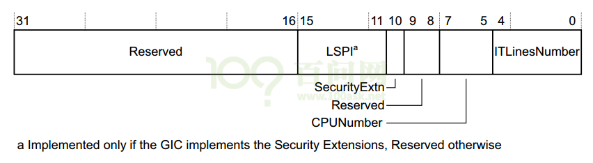

| 位域  | 名            | 读写 | 描述                                                         |
| ----- | ------------- | ---- | ------------------------------------------------------------ |
| 15:11 | LSPI          | R    | 如果GIC实现了安全扩展，则此字段的值是已实现的可锁定SPI的最大数量，范围为0（0b00000）到31（0b11111）。  如果此字段为0b00000，则GIC不会实现配置锁定。  如果GIC没有实现安全扩展，则保留该字段。 |
| 10    | SecurityExtn  | R    | 表示GIC是否实施安全扩展：  0未实施安全扩展；  1实施了安全扩展 |
| 7:5   | CPUNumber     | R    | 表示已实现的CPU  interfaces的数量。  已实现的CPU interfaces数量比该字段的值大1。  例如，如果此字段为0b011，则有四个CPU interfaces。 |
| 4:0   | ITLinesNumber | R    | 表示GIC支持的最大中断数。  如果ITLinesNumber = N，则最大中断数为32*(N+1)。  中断ID的范围是0到（ID的数量– 1）。  例如：0b00011最多128条中断线，中断ID 0-127。  中断的最大数量为1020（0b11111）。  无论此字段定义的中断ID的范围如何，都将中断ID  1020-1023保留用于特殊目的 |

 
#### 3. **Distributor Implementer Identification Register, GICD_IIDR**

- 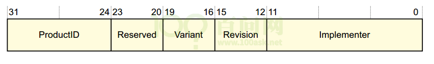

| 位域  | 名          | 读写 | 描述                                                         |
| ----- | ----------- | ---- | ------------------------------------------------------------ |
| 31:24 | ProductID   | R    | 产品标识ID                                                   |
| 23:20 | 保留        |      |                                                              |
| 19:16 | Variant     | R    | 通常是产品的主要版本号                                       |
| 15:12 | Revision    | R    | 通常此字段用于区分产品的次版本号                             |
| 11:0  | Implementer | R    | 含有实现这个GIC的公司的JEP106代码；  [11:8]：JEP106 continuation code，对于ARM实现，此字段为0x4；  [7]：始终为0；  [6:0]：实现者的JEP106code，对于ARM实现，此字段为0x3B |


#### 4. **Interrupt Group Registers, GICD_IGROUPRn**

- 

| 位域 | 名                 | 读写 | 描述                                                         |
| ---- | ------------------ | ---- | ------------------------------------------------------------ |
| 31:0 | Group  status bits | R/W  | 组状态位，对于每个位：  0：相应的中断为Group 0；  1：相应的中断为Group 1。 |

对于一个中断，如何设置它的Group ？首先找到对应的GICD_IGROUPRn寄存器，即n是多少？还要确定使用这个寄存器里哪一位。
对于interrtups ID m，如下计算：

```
n = m DIV 32，GICD_IGROUPRn里的n就确定了；
GICD_IGROUPRn在GIC内部的偏移地址是多少？0x080+(4*n)
使用GICD_IPRIORITYRn中哪一位来表示interrtups ID m？
bit = m mod 32。
```

#### 5. **Interrupt Set-Enable Registers, GICD_ISENABLERn**

- 

| 位域 | 名               | 读写 | 描述                                                         |
| ---- | ---------------- | ---- | ------------------------------------------------------------ |
| 31:0 | Set-enable  bits | R/W  | 对于SPI和PPI类型的中断，每一位控制对应中断的转发行为：从Distributor转发到CPU interface：  读：  0：表示当前是禁止转发的；  1：表示当前是使能转发的；  写：  0：无效  1：使能转发 |

**对于一个中断，如何找到GICD_ISENABLERn并确定相应的位？**
```
对于interrtups ID m，如下计算：
n = m DIV 32，GICD_ISENABLERn里的n就确定了；
GICD_ISENABLERn在GIC内部的偏移地址是多少？0x100+(4*n)
使用GICD_ISENABLERn中哪一位来表示interrtups ID m？
bit = m mod 32。
```


#### 6. **Interrupt Clear-Enable Registers, GICD_ICENABLERn**

- 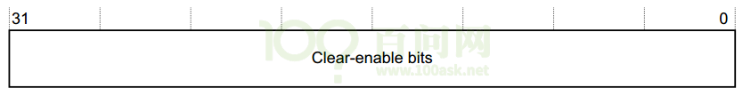

| 位域 | 名                 | 读写 | 描述                                                         |
| ---- | ------------------ | ---- | ------------------------------------------------------------ |
| 31:0 | Clear-enable  bits | R/W  | 对于SPI和PPI类型的中断，每一位控制对应中断的转发行为：从Distributor转发到CPU interface：  读：  0：表示当前是禁止转发的；  1：表示当前是使能转发的；  写：  0：无效  1：禁止转发 |

对于一个中断，如何找到GICD_ICENABLERn并确定相应的位？

```
对于interrtups ID m，如下计算：
n = m DIV 32，GICD_ICENABLERn里的n就确定了；
GICD_ICENABLERn在GIC内部的偏移地址是多少？0x180+(4*n)
使用GICD_ICENABLERn中哪一位来表示interrtups ID m？
bit = m mod 32。
```

#### 7. **Interrupt Set-Active Registers, GICD_ISACTIVERn**

- 
 
| 位域 | 名               | 读写 | 描述                                                         |
| ---- | ---------------- | ---- | ------------------------------------------------------------ |
| 31:0 | Set-active  bits | R/W  | 读：  0：表示相应中断不是active状态；  1：表示相应中断是active状态；  写：  0：无效  1：把相应中断设置为active状态，如果中断已处于Active状态，则写入无效 |

对于一个中断，如何找到GICD_ISACTIVERn并确定相应的位？

```
对于interrtups ID m，如下计算：
n = m DIV 32，GICD_ISACTIVERn里的n就确定了；
GICD_ISACTIVERn在GIC内部的偏移地址是多少？0x300+(4*n)
使用GICD_ISACTIVERn 中哪一位来表示interrtups ID m？
bit = m mod 32。
```

#### 8. **Interrupt Clear-Active Registers, GICD_ICACTIVERn**

- 

| 位域 | 名                 | 读写 | 描述                                                         |
| ---- | ------------------ | ---- | ------------------------------------------------------------ |
| 31:0 | Clear-active  bits | R/W  | 读：  0：表示相应中断不是active状态；  1：表示相应中断是active状态；  写：  0：无效  1：把相应中断设置为deactive状态，如果中断已处于dective状态，则写入无效 |

对于一个中断，如何找到GICD_ICACTIVERn并确定相应的位？

```
对于interrtups ID m，如下计算：
n = m DIV 32，GICD_ICACTIVERn里的n就确定了；
GICD_ICACTIVERn 在GIC内部的偏移地址是多少？0x380+(4*n)
使用GICD_ICACTIVERn中哪一位来表示interrtups ID m？
bit = m mod 32。
```

#### 9. **Interrupt Priority Registers, GICD_IPRIORITYRn**

- 

| 位域  | 名                       | 读写 | 描述                                                         |
| ----- | ------------------------ | ---- | ------------------------------------------------------------ |
| 31:24 | Priority, byte  offset 3 | R/W  | 对于每一个中断，都有对应的8位数据用来描述：它的优先级。  每个优先级字段都对应一个优先级值，值越小，相应中断的优先级越高 |
| 23:16 | Priority,  byte offset 2 | R/W  |                                                              |
| 15:8  | Priority,  byte offset 1 | R/W  |                                                              |
| 7:0   | Priority,  byte offset 0 | R/W  |                                                              |

对于一个中断，如何设置它的优先级(Priority)，首先找到对应的GICD_IPRIORITYRn寄存器，即n是多少？还要确定使用这个寄存器里哪一个字节。

```
对于interrtups ID m，如下计算：
n = m DIV 4，GICD_IPRIORITYRn里的n就确定了；
GICD_IPRIORITYRn在GIC内部的偏移地址是多少？0x400+(4*n)
使用GICD_IPRIORITYRn中4个字节中的哪一个来表示interrtups ID m的优先级？
byte offset = m mod 4。
byte offset 0对应寄存器里的[7:0]；
byte offset 1对应寄存器里的[15:8]；
byte offset 2对应寄存器里的[23:16]；
byte offset 3对应寄存器里的[31:24]。
```


#### 10. **Interrupt Processor Targets Registers, GICD_ITARGETSRn**

- 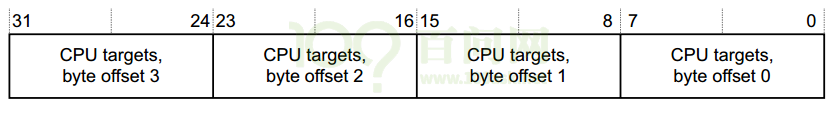
 
| 位域  | 名                         | 读写 | 描述                                                         |
| ----- | -------------------------- | ---- | ------------------------------------------------------------ |
| 31:24 | CPU targets, byte offset 3 | R/W  | 对于每一个中断，都有对应的8位数据用来描述：这个中断可以发给哪些CPU。  处理器编号从0开始，8位数里每个位均指代相应的处理器。  例如，值0x3表示将中断发送到处理器0和1。  当读取GICD_ITARGETSR0～GICD_ITARGETSR7时，读取里面任意字节，返回的都是执行这个读操作的CPU的编号。 |
| 23:16 | CPU targets, byte offset 2 | R/W  |                                                              |
| 15:8  | CPU targets, byte offset 1 | R/W  |                                                              |
| 7:0   | CPU targets, byte offset 0 | R/W  |                                                              |

对于一个中断，如何设置它的目杯CPU？优先级(Priority)，首先找到对应的GICD_ITARGETSRn寄存器，即n是多少？还要确定使用这个寄存器里哪一个字节。

```
对于interrtups ID m，如下计算：
n = m DIV 4，GICD_ITARGETSRn里的n就确定了；
GICD_ITARGETSRn在GIC内部的偏移地址是多少？0x800+(4*n)
使用GICD_ITARGETSRn中4个字节中的哪一个来表示interrtups ID m的目标CPU？
byte offset = m mod 4。
byte offset 0对应寄存器里的[7:0]；
byte offset 1对应寄存器里的[15:8]；
byte offset 2对应寄存器里的[23:16]；
byte offset 3对应寄存器里的[31:24]。
```


#### 11. **Interrupt Configuration Registers, GICD_ICFGRn**

- 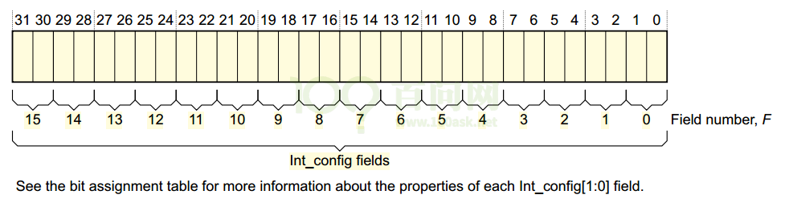

| 位域          | 名                    | 读写 | 描述                                                         |
| ------------- | --------------------- | ---- | ------------------------------------------------------------ |
| [2*F*+1:2*F*] | Int_config, field *F* | R/W  | 对于每一个中断，都有对应的2位数据用来描述：它的边沿触发，还是电平触发。  对于Int_config [1]，即高位[2F + 1]，含义为：  0：相应的中断是电平触发；  1：相应的中断是边沿触发。     对于Int_config [0]，即低位[2F]，是保留位。 |

对于一个中断，如何找到GICD_ICFGRn并确定相应的位域F？
```
对于interrtups ID m，如下计算：
n = m DIV 16，GICD_ICFGRn里的n就确定了；
GICD_ICACTIVERn 在GIC内部的偏移地址是多少？0xC00+(4*n)
F = m mod 16。
```


#### 12. **Identification registers: Peripheral ID2 Register, ICPIDR2**

- 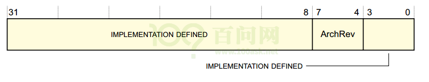

| 位域   | 名      | 读写 | 描述                                                      |
| ------ | ------- | ---- | --------------------------------------------------------- |
| [31:0] | -       | R/W  | 由实现定义                                                |
| [7:4]  | ArchRev | R    | 该字段的值取决于GIC架构版本：  0x1：GICv1；  0x2：GICv2。 |
| [3:0]  | -       | R/W  | 由实现定义                                                |


### 1.2.2 CPU interface寄存器描述

#### 1. **CPU Interface Control Register, GICC_CTLR**

​	此寄存器用来控制CPU interface传给CPU的中断信号。对于不同版本的GIC，这个寄存器里各个位的含义大有不同。以GICv2为例，有如下2种格式：
- 
  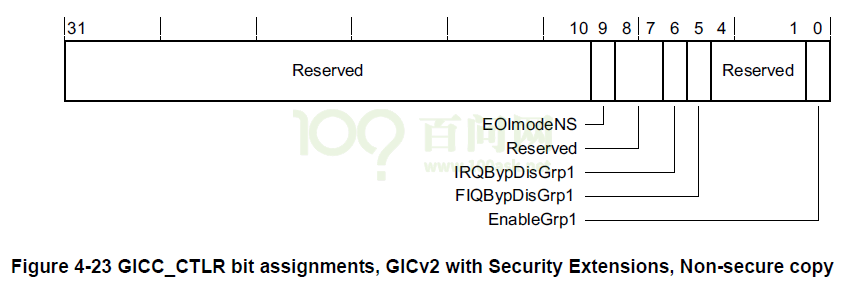
- 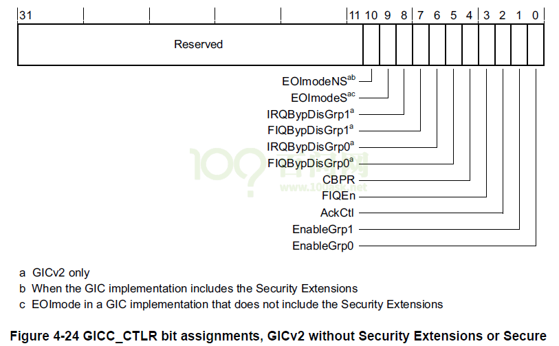

​	以`GIC2 with Security Extensions, Non-secure copy` 为例，GICC_CTLR中各个位的定义如下：

| 位域    | 名            | 读写 | 描述                                                         |
| ------- | ------------- | ---- | ------------------------------------------------------------ |
| [31:10] | -             |      | 保留                                                         |
| [9]     | EOImodeNS     | R/W  | 控制对GICC_EOIR和GICC_DIR寄存器的非安全访问：  0：GICC_EOIR具有降低优先级和deactivate中断的功能；  对GICC_DIR的访问是未定义的。  1：GICC_EOIR仅具有降低优先级功能；  GICC_DIR寄存器具有deactivate中断功能。 |
| [8:7]   | -             |      | 保留                                                         |
| [6]     | IRQBypDisGrp1 | R/W  | 当CPU interface的IRQ信号被禁用时，该位控制是否向处理器发送bypass IRQ信号：  0：将bypass IRQ信号发送给处理器；  1：将bypass IRQ信号不发送到处理器。 |
| [5]     | FIQBypDisGrp1 | R/W  | 当CPU interface的FIQ信号被禁用时，该位控制是否向处理器发送bypass FIQ信号：  0：将bypass FIQ信号发送给处理器；  1：旁路FIQ信号不发送到处理器 |
| [4:1]   | -             |      | 保留                                                         |
| [0]     | -             | R/W  | 使能CPU interface向连接的处理器发出的组1中断的信号:  0：禁用中断信号  1：使能中断信号 |


#### 2. **Interrupt Priority Mask Register, GICC_PMR**

​提供优先级过滤功能，优先级高于某值的中断，才会发送给CPU。
- 

| 位域   | 名   | 读写 | 描述                                  |
| ------ | ---- | ---- | ------------------------------------- |
| [31:8] | -    |      | 保留                                  |
| [7:0]  | -    | R/W  | 优先级高于这个值的中断，才会发送给CPU |

`[7:0]`共8位，可以表示256个优先级。但是某些芯片里的GIC支持的优先级少于256个，则某些位为RAZ / WI，如下所示：

```
如果有128个级别，则寄存器中bit[0] = 0b0，即使用[7:1]来表示优先级；
如果有64个级别，则寄存器中bit[1:0] = 0b00，即使用[7:2]来表示优先级；
如果有32个级别，则寄存器中bit[2:0] = 0b000，即使用[7:3]来表示优先级；
如果有16个级别，则寄存器中bit[3:0] = 0b0000，即使用[7:4]来表示优先级；
```

注意：**imx6ull最多为32个级别**


#### 3. **Binary Point Register, GICC_BPR**

​	此寄存器用来把8位的优先级字段拆分为组优先级和子优先级，组优先级用来决定中断抢占。

- 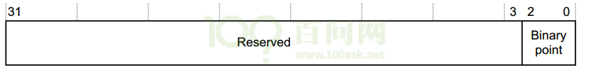

| 位域   | 名            | 读写 | 描述                                                         |
| ------ | ------------- | ---- | ------------------------------------------------------------ |
| [31:3] | -             |      | 保留                                                         |
| [2:0]  | Binary  point | R/W  | 此字段的值控制如何将8bit中断优先级字段拆分为组优先级和子优先级，组优先级用来决定中断抢占。  更多信息还得看看GIC手册。 |

#### 4. **Interrupt Acknowledge Register, GICC_IAR**

​	CPU读此寄存器，获得当前中断的interrtup ID。

- 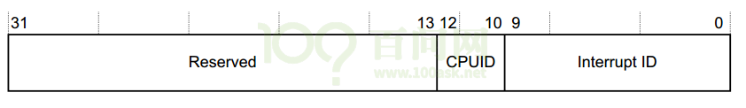

| 位域    | 名           | 读写 | 描述                                                         |
| ------- | ------------ | ---- | ------------------------------------------------------------ |
| [31:13] | -            |      | 保留                                                         |
| [12:10] | CPUID        | R    | 对于SGI类中断，它表示谁发出了中断。例如，值为3表示该请求是通过对CPU  interface 3上的GICD_SGIR的写操作生成的。 |
| [9:0]   | Interrupt ID | R    | 中断ID                                                       |


#### 5. **Interrupt Register, GICC_EOIR**

​	写此寄存器，表示某中断已经处理完毕。GICC_IAR的值表示当前在处理的中断，把GICC_IAR的值写入GICC_EOIR就表示中断处理完了。

- 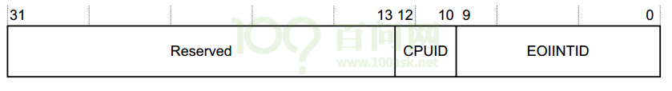

| 位域    | 名       | 读写 | 描述                                           |
| ------- | -------- | ---- | ---------------------------------------------- |
| [31:13] | -        |      | 保留                                           |
| [12:10] | CPUID    | W    | 对于SGI类中断，它的值跟GICD_IAR. CPUID的相同。 |
| [9:0]   | EOIINTID | W    | 中断ID，它的值跟GICD_IAR里的中断ID相同         |

## 1.3 GIC编程

使用cortex A7处理器的芯片，一般都是使用GIC v2的中断控制器。
除了GIC的基地址不一样外，对GIC的操作都是一样的。
在NXP官网可以找到 [IMX6ULL的SDK包](https://www.nxp.com.cn/products/processors-and-microcontrollers/arm-processors/i-mx-applications-processors/i-mx-6-processors/i-mx-6ull-single-core-processor-with-arm-cortex-a7-core:i.MX6ULL?tab=Design_Tools_Tab) 。
下载后可以参考这个文件：core_ca7.h ，里面含有GIC的初始化代码。

# GPIO中断编程

目的：实现KEY2中断，按下、松开按键，串口输出相应信息。

## 1.1 先看原理图

* 100ASK IMX6ULL按键原理图
- 

* 我们使用KEY2来演示中断的处理(它更复杂一点)

* 课后作业：实现KEY1的中断处理函数。

* KEY2用的是GPIO04_IO14引脚


## 1.2 IMX6ULL的GPIO中断

IMX6ULL的GPIO中断在硬件上的框架，跟STM32MP157是类似的。
IMX6ULL中没有EXTI控制器，对GPIO的中断配置、控制，都在GPIO模块内部实现：

- 


### 1.2.1 GPIO控制器

#### 1. 配置GPIO中断

每组GPIO中都有对应的GPIOx_ICR1、GPIOx_ICR2寄存器(interrupt configuration register )。

每个引脚都可以配置为中断引脚，并配置它的触发方式：
- 
- 

- 我们要用到的是GPIO4的第14个引脚跟GPIO5的第1个引脚
- 之前写过的KEY来控制LED的时候, 使能过GPIO4 CCM_CCGR3, IOMUXC寄存器
- 配置GPIO4_14 为输入引脚.
- 配置触发方式 双边沿触发, 要用GPIO4_EDGE_SEL 这个寄存器.

#### 2. 使能GPIO中断

- 
- 使能中断配置 GPIO4_IMR 掩码寄存器 置1 为不屏蔽.

#### 3. 判断中断状态、清中断

- 
- 置1 为清除中断

### 1.2.2 GIC

ARM体系结构定义了通用中断控制器（GIC），该控制器包括一组用于管理单核或多核系统中的中断的硬件资源。GIC提供了内存映射寄存器，可用于管理中断源和行为，以及（在多核系统中）用于将中断路由到各个CPU核。它使软件能够屏蔽，启用和禁用来自各个中断源的中断，以（在硬件中）对各个中断源进行优先级排序和生成软件触发中断。它还提供对TrustZone安全性扩展的支持。GIC接受系统级别中断的产生，并可以发信号通知给它所连接的每个内核，从而有可能导致IRQ或FIQ异常发生。

- 
	- 0到15号引脚发出的中断号是(72 + 32) 16到32号引脚发出的(73 + 32).
	- 我们用到的是GPIO4_14 号引脚, 所以会触发72+32号中断
	- 我们也会用到GPIO5_01 号引脚, 所以会触发74+32号中断

- clear_gic_irq 官方SDK给的接口, 清除GIC中的中断号
- gic_enable_irq 官方SDK的接口, 使能GIC中的某个中断号.

### 1.2.3 CPU

CPU的CPSR寄存器中有一位：I位，用 来使能/禁止中断。
- 

可以使用以下汇编指令修改I位：

```
  CPSIE I  ; 清除I位，使能中断
  CPSID I  ; 设置I位，禁止中断
```

