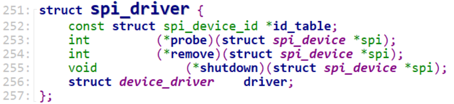
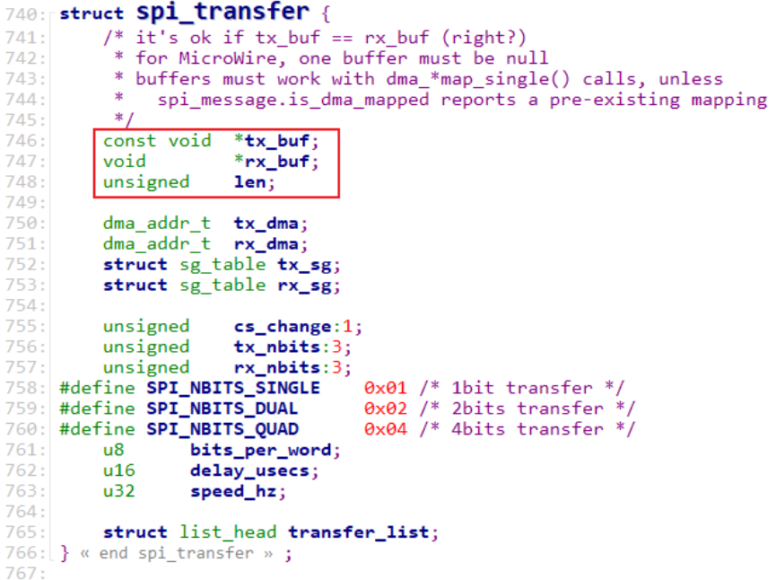
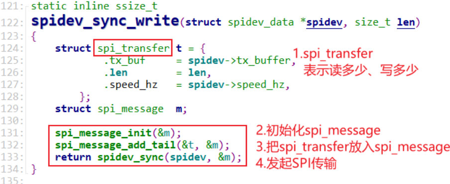
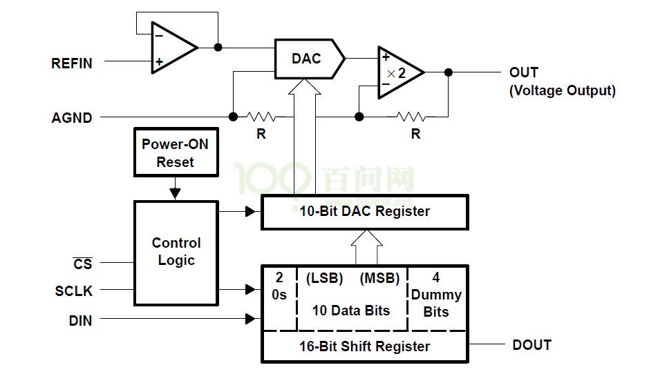
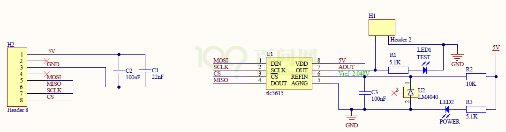
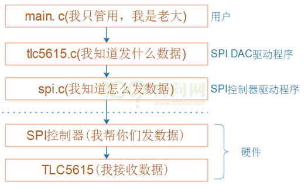
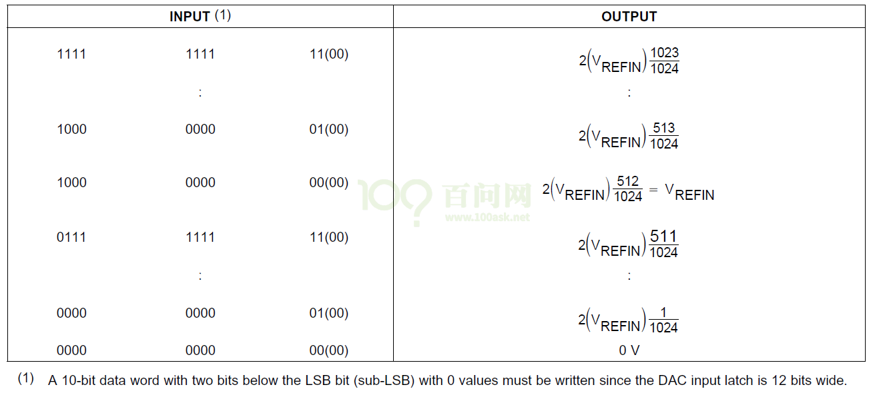
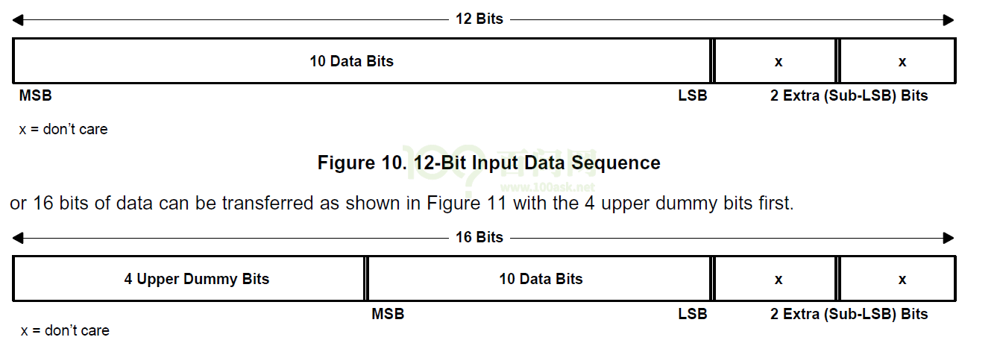

这里开始就是实验班的内容了. 重实践, 理论部分看前面即可. 
可以看做是 前面理论部分的补充吧

# 字符设备的另一种注册方法cdev

- 
- 原来那种register_chrdev的方法, 主设备号确定哪个驱动程序, 次设备号不参与驱动程序的对应. 次设备号只指定用这个驱动程序的那些设备.
- 如果主设备号不够用了, 要超过255了 怎么办. 引入cdev
- cdev 就可以让主 次设备号 一起作用 来确定驱动程序.
	- 比如 241 0 对应hello_dev 而 241 1 对应led_drv

## 驱动程序

- 声明 `static struct cdev hello_cdev;` 与 `static dev_t dev;`
- 分配设备号 `int alloc_chrdev_region(dev_t *dev, unsigned baseminor, unsigned count, const char *name)`
	- Linux 社区推荐使用动态分配设备号. 参数:
	- dev：保存申请到的设备号。
	- baseminor：次设备号起始地址，alloc_chrdev_region 可以申请一段连续的多个设备号，这些设备号的主设备号一样，但是次设备号不同，次设备号以 baseminor 为起始地址地址开始递增。一般 baseminor 为 0，也就是说次设备号从 0 开始。
	- count：要申请的设备号数量。
	- name：设备名字。
- 初始化 `struct cdev hello_cdev` 注册ops结构体
	- `cdev_init(&hello_cdev, &hellodrv_ops);`
- 添加内核字符设备
	- `int cdev_add(struct cdev *p, dev_t dev, unsigned count)`
	- 参数 p 指向要添加的字符设备(cdev 结构体变量)，参数 dev 就是设备所使用的设备号，参数 count 是要添加的设备数量
- 创建类 class_create
- 创建字符设备节点 device_create

- 删除字符设备节点 device_destroy
- 删除类 class_destroy
- 删除字符设备 cdev_del
- 注销字符设备 `void unregister_chrdev_region(dev_t from, unsigned count);`

# 步进电机

28BYJ-48 是一款常见的步机电机，其名称的含义为外径 28 毫米四相八拍式永磁减速型步进电机。型号的含义如下：

- ① 28：步进电机的有效最大外径是 28 毫米
- ② B：表示是步进电机
- ③ Y：表示是永磁式
- ④ J：表示是减速型（减速比 1:64）
- ⑤ 48：表示四相八拍


28BYJ-48 为减速电机，电机输出的转速并不等于转子的转速。下图是这个 28BYJ-48 步进电机的拆解图：
- 

因 100ASK_IMX6ULL 的 GPIO 驱动能力有限，需要在 100ASK_IMX6ULL 和电机之间加入驱动电路，本案选择了双路有刷直流马达驱动芯片 MX1508，驱动电路原理图见下图：
- 


按照 A AB B BC C CD D DA 给电就可以让转子逆时针转. 反之就是顺时针.

# DHT11 温湿度传感器

主机通过一条数据线与 DH11 连接，主机通过这条线发命令给 DHT11，DHT11 再通过这条线把数据发送给主机。


DHT11 的硬件电路比较简单，核心要点就是 主机发给 DHT11 的命令格式和DHT11 返回的数据格式。


- 主机需要先发一个开始信号给 DHT11，才能接收数据
- 其中深黑色信号表示由主机驱动，即主机向 DHT11 发信号，浅灰色信号表示DHT11 驱动，即 DHT11 发向主机发信号。
- 当主机没有与 DHT11 通信时，总线处于空闲状态，此时总线电平由于上拉电阻的作用处于高电平。
- 当主机与 DHT11 正在通信时，总线处于通信状态，一次完整的通信过程如下：
	- a) 主机将对应的 GPIO 管脚配置为输出，准备向 DHT11 发送数据；
	- b) 主机发送一个开始信号：
		- `开始信号=一个低脉冲+一个高脉冲. 低脉冲至少持续18ms,高脉冲持续20-40us.`
	- c) 主机将对应的 GPIO 管脚配置为输入，准备接受 DHT11 传来的数据，这时信号由上拉电阻拉高;
	- d) DHT11 发出响应信号：
		- `响应信号 = 一个低脉冲 + 一个高脉冲。低脉冲持续 80us，高脉冲持续 80us。`
	- e) DHT11 发出数据信号：
		- 数据为 0 的一位信号 = 一个低脉冲 + 一个高脉冲。低脉冲持续50us，高脉冲持续 26～28us。
		- 数据为 1 的一位信号 = 一个低脉冲 + 一个高脉冲。低脉冲持续50us，高脉冲持续 70us。
	- f) DHT11 发出结束信号：
		- 最后 1bit 数据传送完毕后，DHT11 拉低总线 50us，然后释放总线，总线由上拉电阻拉高进入空闲状态。
	- 


数据格式:

8bit 湿度整数数据+8bit 湿度小数数据+8bit 温度整数数据+8bit 温度小数数据+8bit 校验和

数据传送正确时,校验和等于“8bit 湿度整数数据+8bit 湿度小数数据+8bi温度整数数据+8bit 温度小数数据”所得结果的末 8 位。

编程思路如下：
- ① 设置好 GPIO；
- ② 主机把 GPIO 设置为输出引脚，发送开始信号，然后把 GPIO 设置为输入引脚；
- ③ 主机判断是否收到 DHT11 的回应信号；
- ④ 接收到回应信号后，开始读取数据；
	- 关键在于如何得到一位数据，看看下图：
	- 
	- 先等待低电平结束，一直等到出现高电平；然后延时 40us，读取 GPIO 值：这就是该位的数据值。

- ⑤ 接收完数据后，校验、解析。

# DS18B20 温度模块

DS18B20 温度传感器具有线路简单、体积小的特点，用来测量温度非常简单，在一根通信线上可以挂载多个 DS18B20 温度传感器。用户可以通过编程实现9~12 位的温度读数，每个 DS18B20 有唯一的 64 位序列号，保存在 rom 中，因此一条总线上可以挂载多个 DS18B20。

DS18B20 也使用的是“1-Wire 单总线”，只通过一条数据线传输数据，既要控制器发送数据给芯片，又要通过芯片发送数据给控制器，是双向传输数据。DS18B20 的硬件设计电路与前面的 DHT11 基本一致，原理图如下：
- 

DS18B20 内部有个 64 位只读存储器（ROM）和 64 位配置存储器（SCRATCHP）。64 位只读存储器（ROM）包含序列号等，具体格式如下图：
- 

低八位用于 CRC 校验，中间 48 位是 DS18B20 唯一序列号，高八位是该系列产品系列号(固定为 28h)。因此，根据每个 DS18B20 唯一的序列号，可以实现一条总线上可以挂载多个 DS18B20 时，获取指定 DS18B20 的温度信息。

64 位配置存储器（SCRATCHP）由 9 个 Byte 组成，包含温度数据、配置信息等，具体格式如下图：
- 

- `Byte[0:1]`：温度值。也就是当我们发出一个测量温度的命令之后，还需要发送一个读内存的命令才能把温度值读取出来。
- `Byte[2:3]`：TL 是低温阈值设置，TH 是高温阈值设置。当温度低于/超过阈值，就会报警。 TL、TH 存储在 EEPROM 中，数据在掉电时不会丢失；
- `Byte4`：配置寄存器。用于配置温度精度为 9、10、11 或 12 位。配置寄存器也存储在 EEPROM 中，数据在掉电时不会丢失；
- `Byte[5:7]`：厂商预留；
- `Byte[8]`：CRC 校验码。

通信时序:

- ① 初始化时序
	- 类似前面的 DHT11，主机要跟 DS18B20 通信，首先需要发出一个开始信号。深黑色线表示由主机驱动信号，浅灰色线表示由 DS18B20 驱动信号。最开始时引脚是高电平，想要开始传输信号，
	- 
- a) 必须要拉低至少 480us, 这是复位信号;
- b) 然后拉高释放总线, 等待 15~60us 之后, 
- c) 如果 GPIO 上连有 DS18B20 芯片, 它会拉低 60~240us.
- 如果主机在最后检查到 60～240us 的低脉冲, 则表示 DS18B20 初始化成功.

- ② 写时序
	- 如果写 0, 拉低至少 60us(写周期为 60-120us)即可;
	- 如果写 1, 先拉低至少 1us, 然后拉高, 整个写周期至少为 60us 即可.
	- 
- ③ 读时序
	- 主机先拉低至少 1us，随后读取电平，如果为 0，即读到的数据是 0，如果为 1，即可读到的数据是 1。
	- 整个过程必须在 15us 内完成，15us 后引脚都会被拉高。
	- 

> 实验班代码这里 delay 15us 是错的.

现在我们知道怎么发 1 位数据，收 1 位数据。发什么数据才能得到温度值，这需要用到“命令”。
DS18B20 中有两类命令：ROM 命令、功能命令，列表如下：
- 
- 


DS18B20 芯片手册中有 ROM 命令、功能命令的流程图，先贴出来，下一小节再举例。
- ① ROM 命令流程图
- 


- ② 功能命令流程图
- 

编程思路:

按照流程图来编程即可：
- ① 实现复位函数；
- ② 实现等待回应的函数；
- ③ 实现发送 1 位数据的函数，进而实现发送 1 字节的函数；
- ④ 实现读取 1 位数据的函数，进而实现读取 1 字节的函数；
- ⑤ 按照流程图或是表格，发送、接收数据。


# IRDA 红外遥控模块

红外遥控器系统分为发送端和接收端，如图下图所示。


发送端就是红外遥控器，上面有许多按键，当我们按下遥控器按键时，遥控器内部电路会进行编码和调制，再通过红外发射头，将信号以肉眼不可见的红外线发射出去。红外线线虽然肉眼不可见，但可以通过手机摄像头看到，常用该方法检查遥控器是否正常工作。

接收端是一个红外接收头，收到红外信号后，内部电路会进行信号放大和解调，再将数据传给板子上的 GPIO，板子收到数据后再解码才能确定是哪个按键被按下。
- 

我们按下遥控器按键的时候，遥控器自动发送某个红外信号，接收头接收到红外信号，然后把红外信号转换成电平信号，通过 IRD 这根线，传给 SOC。整个传输，只涉及单向传输，由 HS0038 向主芯片传送。

因此，我们只需要编写程序，从 IRD 上获取数据即可，在这之前，我们需要先了解下数据是怎么表示的，也就是传输的红外数据的格式。

红外协议有：NEC、SONY、RC5、RC6 等，常用的就是 NEC 格式，因此我们主要对 NEC 进行讲解。

开始传输数据之前，一般都会发出一个 start 起始信号，通知对方我开始传输数据了，后面就是每一位每一位的数据。

NEC 协议的开始是一段引导码：
- 

这个引导码由一个 9ms 的低脉冲加上一个 4.5ms 的高脉冲组成，它用来通知接收方我要开始传输数据了。
- 

然后接着的是数据，数据由 4 字节组成：地址、地址(取反)、数据、数据(取反)，取反是用来校验用的。

地址是指遥控器的 ID，每一类遥控器的 ID 都不一样，这样就可以防止操控电视的遥控器影响空调。数据就是遥控器上的不同按键值。

从前面的图可以知道，NEC 每次要发 32 位（地址、地址取反、数据、数据取反，每个 8 位）的数据。数据的 1 和 0，开始都是 0.56ms 的低脉冲，对于数据 1，后面的高脉冲比较长，对于数据 0，后面的高脉冲比较短。
- 

第一次按下按键时，它会发出引导码，地址，地址取反，数据，数据取反。

如果这时还没松开按键，这就是“长按”，怎么表示“长按”？遥控器会发送一个不一样的引导码，这个引导码由 9ms 的低脉冲，2.25ms 的高脉冲组成，表示现在按的还是上次一样的按键，也叫连发码，它会一直发送，直到松开。


编程思路:

有了上述基础知识后就可以开始编写程序了。编程思路如下：
- ① 平时 GPIO 为高；
- ② 发现 GPIO 为低时，判断它有 9ms 的低电平：
	- 对于引导码，或连发码，它们都有 9ms 的低电平，如下图：
	- 
- ③ 分辨是引导码，还是连发码：
	- 在 9ms 的低电平之后，判断高电平持续时间，引导码的高电平维持时间是4.5ms，连发码的高电平维持时间是 2.25ms。
	- 发现是连发码时，直接结束译码。
	- 发现是引导码时，还得继续接收 32 位数据。
- ④ 接收数据：
	- 关键在于如何得到一位数据，看看下图：
	- 

先等待低电平结束，一直等到出现高电平；然后延时 800us，读取 GPIO 值：这就是该位的数据值。


# EEPROM 模块

## I2C驱动程序模板

参考资料：

* Linux内核文档:
  * `Documentation\i2c\instantiating-devices.rst`
  * `Documentation\i2c\writing-clients.rst`
* Linux内核驱动程序示例:
  * `drivers/eeprom/at24.c`

## 1. I2C驱动程序的层次


I2C Core就是I2C核心层，它的作用：

* 提供统一的访问函数，比如`i2c_transfer`、`i2c_smbus_xfer`等
* 实现`I2C总线-设备-驱动模型`，管理：I2C设备(i2c_client)、I2C设备驱动(i2c_driver)、I2C控制器(i2c_adapter)

## 2. I2C总线-设备-驱动模型


### 2.1 i2c_driver

i2c_driver表明能支持哪些设备：

* 使用of_match_table来判断
  * 设备树中，某个I2C控制器节点下可以创建I2C设备的节点
    * 如果I2C设备节点的compatible属性跟of_match_table的某项兼容，则匹配成功
  * i2c_client.name跟某个of_match_table[i].compatible值相同，则匹配成功
* 使用id_table来判断
  * i2c_client.name跟某个id_table[i].name值相同，则匹配成功

i2c_driver跟i2c_client匹配成功后，就调用i2c_driver.probe函数。

### 2.2 i2c_client

i2c_client表示一个I2C设备，创建i2c_client的方法有4种：

* 方法1

  * 通过I2C bus number来创建

    ```c
    int i2c_register_board_info(int busnum, struct i2c_board_info const *info, unsigned len);
    ```

  * 通过设备树来创建

    ```shell
    	i2c1: i2c@400a0000 {
    		/* ... master properties skipped ... */
    		clock-frequency = <100000>;
    
    		flash@50 {
    			compatible = "atmel,24c256";
    			reg = <0x50>;
    		};
    
    		pca9532: gpio@60 {
    			compatible = "nxp,pca9532";
    			gpio-controller;
    			#gpio-cells = <2>;
    			reg = <0x60>;
    		};
    	};
    ```

* 方法2
  有时候无法知道该设备挂载哪个I2C bus下，无法知道它对应的I2C bus number。
  但是可以通过其他方法知道对应的i2c_adapter结构体。
  可以使用下面两个函数来创建i2c_client：

* i2c_new_device

```c
      static struct i2c_board_info sfe4001_hwmon_info = {
    	I2C_BOARD_INFO("max6647", 0x4e),
      };
    
      int sfe4001_init(struct efx_nic *efx)
      {
    	(...)
    	efx->board_info.hwmon_client =
    		i2c_new_device(&efx->i2c_adap, &sfe4001_hwmon_info);
    
    	(...)
      }
```

* i2c_new_probed_device

```c
      static const unsigned short normal_i2c[] = { 0x2c, 0x2d, I2C_CLIENT_END };
    
      static int usb_hcd_nxp_probe(struct platform_device *pdev)
      {
    	(...)
    	struct i2c_adapter *i2c_adap;
    	struct i2c_board_info i2c_info;
    
    	(...)
    	i2c_adap = i2c_get_adapter(2);
    	memset(&i2c_info, 0, sizeof(struct i2c_board_info));
    	strscpy(i2c_info.type, "isp1301_nxp", sizeof(i2c_info.type));
    	isp1301_i2c_client = i2c_new_probed_device(i2c_adap, &i2c_info,
    						   normal_i2c, NULL);
    	i2c_put_adapter(i2c_adap);
    	(...)
      }
```

* 差别：
    * i2c_new_device：会创建i2c_client，即使该设备并不存在
    * i2c_new_probed_device：
      * 它成功的话，会创建i2c_client，并且表示这个设备肯定存在
      * I2C设备的地址可能发生变化，比如AT24C02的引脚A2A1A0电平不一样时，设备地址就不一样
      * 可以罗列出可能的地址
      * i2c_new_probed_device使用这些地址判断设备是否存在

* 方法3(不推荐)：由i2c_driver.detect函数来判断是否有对应的I2C设备并生成i2c_client

* 方法4：通过用户空间(user-space)生成
  调试时、或者不方便通过代码明确地生成i2c_client时，可以通过用户空间来生成。

```c
  // 创建一个i2c_client, .name = "eeprom", .addr=0x50, .adapter是i2c-3
  # echo eeprom 0x50 > /sys/bus/i2c/devices/i2c-3/new_device
  
  // 删除一个i2c_client
  # echo 0x50 > /sys/bus/i2c/devices/i2c-3/delete_device
```

## 3. AT24C02驱动编写

### 3.1 修改设备树

* 放在哪个I2C控制器下面
* AT24C02的I2C设备地址
* compatible属性：用来寻址驱动程序

修改设备树：`arch/arm/boot/dts/100ask_imx6ull-14x14.dts`

```shell
&i2c1 {
    clock-frequency = <100000>;
    pinctrl-names = "default";
    pinctrl-0 = <&pinctrl_i2c1>;
    status = "okay";

    at24c02 { 
       compatible = "100ask,i2cdev";
       reg = <0x50>;
    };  
};
```

### 3.2 编写驱动

### 3.3 编写APP

### 3.4 上机

# SPI驱动程序模板

参考资料：
* 内核头文件：`include\linux\spi\spi.h`

## 数据结构

SPI子系统中涉及2类硬件：SPI控制器、SPI设备。

SPI控制器有驱动程序，提供SPI的传输能力。

SPI设备也有自己的驱动程序，提供SPI设备的访问能力：
* 它知道怎么访问这个设备，它知道这个设备的数据含义是什么
* 它会调用SPI控制器的函数来收发数据。

### 2.1 SPI控制器数据结构

参考内核文件：`include\linux\spi\spi.h`

Linux中使用spi_master结构体描述SPI控制器，里面最重要的成员就是`transfer`函数指针：


### 2.2 SPI设备数据结构

参考内核文件：`include\linux\spi\spi.h`

Linux中使用spi_device结构体描述SPI设备，里面记录有设备的`片选引脚`、`频率`、`挂在哪个SPI控制器`下面：


### 2.3 SPI设备驱动

参考内核文件：`include\linux\spi\spi.h`

Linux中使用`spi_driver结构体`描述SPI设备驱动：



### 2.4 接口函数

#### 2.4.1 函数原型

接口函数都在这个内核文件里：`include\linux\spi\spi.h`

* 简易函数

    ```c
    /**
     * SPI同步写
     * @spi: 写哪个设备
     * @buf: 数据buffer
     * @len: 长度
     * 这个函数可以休眠
     *
     * 返回值: 0-成功, 负数-失败码
     */
    static inline int
    spi_write(struct spi_device *spi, const void *buf, size_t len);
    
    /**
     * SPI同步读
     * @spi: 读哪个设备
     * @buf: 数据buffer
     * @len: 长度
     * 这个函数可以休眠
     *
     * 返回值: 0-成功, 负数-失败码
     */
    static inline int
    spi_read(struct spi_device *spi, void *buf, size_t len);
    
    
    /**
     * spi_write_then_read : 先写再读, 这是一个同步函数
     * @spi: 读写哪个设备
     * @txbuf: 发送buffer
     * @n_tx: 发送多少字节
     * @rxbuf: 接收buffer
     * @n_rx: 接收多少字节
     * 这个函数可以休眠
     * 
     * 这个函数执行的是半双工的操作: 先发送txbuf中的数据，在读数据，读到的数据存入rxbuf
     *
     * 这个函数用来传输少量数据(建议不要操作32字节), 它的效率不高
     * 如果想进行高效的SPI传输，请使用spi_{async,sync}(这些函数使用DMA buffer)
     *
     * 返回值: 0-成功, 负数-失败码
     */
    extern int spi_write_then_read(struct spi_device *spi,
    		const void *txbuf, unsigned n_tx,
    		void *rxbuf, unsigned n_rx);
    
    /**
     * spi_w8r8 - 同步函数，先写8位数据，再读8位数据
     * @spi: 读写哪个设备
     * @cmd: 要写的数据
     * 这个函数可以休眠
     *
     *
     * 返回值: 成功的话返回一个8位数据(unsigned), 负数表示失败码
     */
    static inline ssize_t spi_w8r8(struct spi_device *spi, u8 cmd);
    
    /**
     * spi_w8r16 - 同步函数，先写8位数据，再读16位数据
     * @spi: 读写哪个设备
     * @cmd: 要写的数据
     * 这个函数可以休眠
     *
     * 读到的16位数据: 
     *     低地址对应读到的第1个字节(MSB)，高地址对应读到的第2个字节(LSB)
     *     这是一个big-endian的数据
     *
     * 返回值: 成功的话返回一个16位数据(unsigned), 负数表示失败码
     */
    static inline ssize_t spi_w8r16(struct spi_device *spi, u8 cmd);
    
    /**
     * spi_w8r16be - 同步函数，先写8位数据，再读16位数据，
     *               读到的16位数据被当做big-endian，然后转换为CPU使用的字节序
     * @spi: 读写哪个设备
     * @cmd: 要写的数据
     * 这个函数可以休眠
     *
     * 这个函数跟spi_w8r16类似，差别在于它读到16位数据后，会把它转换为"native endianness"
     *
     * 返回值: 成功的话返回一个16位数据(unsigned, 被转换为本地字节序), 负数表示失败码
     */
    static inline ssize_t spi_w8r16be(struct spi_device *spi, u8 cmd);
    ```

* 复杂的函数

    ```c
    /**
     * spi_async - 异步SPI传输函数，简单地说就是这个函数即刻返回，它返回后SPI传输不一定已经完成
     * @spi: 读写哪个设备
     * @message: 用来描述数据传输，里面含有完成时的回调函数(completion callback)
     * 上下文: 任意上下文都可以使用，中断中也可以使用
     *
     * 这个函数不会休眠，它可以在中断上下文使用(无法休眠的上下文)，也可以在任务上下文使用(可以休眠的上下文) 
     *
     * 完成SPI传输后，回调函数被调用，它是在"无法休眠的上下文"中被调用的，所以回调函数里不能有休眠操作。
     * 在回调函数被调用前message->statuss是未定义的值，没有意义。
     * 当回调函数被调用时，就可以根据message->status判断结果: 0-成功,负数表示失败码
     * 当回调函数执行完后，驱动程序要认为message等结构体已经被释放，不能再使用它们。
     *
     * 在传输过程中一旦发生错误，整个message传输都会中止，对spi设备的片选被取消。
     *
     * 返回值: 0-成功(只是表示启动的异步传输，并不表示已经传输成功), 负数-失败码
     */
    extern int spi_async(struct spi_device *spi, struct spi_message *message);
    
    /**
     * spi_sync - 同步的、阻塞的SPI传输函数，简单地说就是这个函数返回时，SPI传输要么成功要么失败
     * @spi: 读写哪个设备
     * @message: 用来描述数据传输，里面含有完成时的回调函数(completion callback)
     * 上下文: 能休眠的上下文才可以使用这个函数
     *
     * 这个函数的message参数中，使用的buffer是DMA buffer
     *
     * 返回值: 0-成功, 负数-失败码
     */
    extern int spi_sync(struct spi_device *spi, struct spi_message *message);
    
    /**
     * spi_sync_transfer - 同步的SPI传输函数
     * @spi: 读写哪个设备
     * @xfers: spi_transfers数组，用来描述传输
     * @num_xfers: 数组项个数
     * 上下文: 能休眠的上下文才可以使用这个函数
     *
     * 返回值: 0-成功, 负数-失败码
     */
    static inline int
    spi_sync_transfer(struct spi_device *spi, struct spi_transfer *xfers,
    	unsigned int num_xfers);
    ```

#### 2.4.2 函数解析

在SPI子系统中，用spi_transfer结构体描述一个传输，用spi_message管理过个传输。
SPI传输时，发出N个字节，就可以同时得到N个字节。

* 即使只想读N个字节，也必须发出N个字节：可以发出0xff
* 即使只想发出N个字节，也会读到N个字节：可以忽略读到的数据。

spi_transfer结构体如下图所示：

* tx_buf：不是NULL的话，要发送的数据保存在里面
* rx_buf：不是NULL的话，表示读到的数据不要丢弃，保存进rx_buf里



可以构造多个spi_transfer结构体，把它们放入一个spi_message里面。

spi_message结构体如下图所示：


SPI传输示例：

- 

## 3. SPI驱动框架


### 3.1 SPI控制器驱动程序

SPI控制器的驱动程序可以基于"平台总线设备驱动"模型来实现：

* 在设备树里描述SPI控制器的硬件信息，在设备树子节点里描述挂在下面的SPI设备的信息
* 在platform_driver中提供一个probe函数
    * 它会注册一个spi_master
    * 还会解析设备树子节点，创建spi_device结构体

### 3.2 SPI设备驱动程序

跟"平台总线设备驱动模型"类似，Linux中也有一个"SPI总线设备驱动模型"：

* 左边是spi_driver，使用C文件实现，里面有id_table表示能支持哪些SPI设备，有probe函数
* 右边是spi_device，用来描述SPI设备，比如它的片选引脚、频率
    * 可以来自设备树：比如由SPI控制器驱动程序解析设备树后创建、注册spi_device
    * 可以来自C文件：比如使用`spi_register_board_info`创建、注册spi_device

## 4. DAC 模块

> `SPI-imx` 4.9.88 版本内核有bug 参考70天驱动视频. 修复内核bug之后, 在来写这个驱动.

DAC(Digital Analog Convector)即数模转换器，是把数字量转变成模拟量的器件。主要包括以下几个主要性能指标：

- ① 分辨率：指最小输出电压与最大输出电压直逼。如 N 位 DAC 转换器，其分辨率为：1/（2^N-1）。在实际使用中，分辨率的大小也可以用输入数字量的位数来表示；
- ② 精度线性度；
- ③ 转换精度：影响转换精度的主要因素有失调误差、增益误差、非线性误差和微分非线性误差灯；
- ④ 转换速度。

不同类型的 DAC 有不同的通讯方式，这里我们选择 SPI 接口 DAC 芯片TLC5615。TLC5615 是一个 10 位的 DAC，具有如下特性：

- ① 10 位 CMOS 电压输出 DAC
- ② 5V 供电电压
- ③ 3 线串行操作
- ④ 高阻抗参考电压输入
- ⑤ 输出电压最大为 2 倍的输入参考电压
- ⑥ 内部有上电复位电路
- ⑦ 低电源功耗，最大 1.75mW
- ⑧ 最大更新速度为 1.21MHz
- TLC5615 使用简单，只需要提供 5V 供电和外部参考电压即可，无需其他配置。主控通过三线 SPI 连接 TLC5615，将 10bit 的数据发送给 TLC5615；TLC5615将数值转换为电压输出。
- TLC5615 内部框图如下图所示：
    - 

百问网 DAC 模块的设计电路如下图所示,通过外部连接器提供 5V 供电电压.

该模块中,TLC5615从 SPI 接口得到数据后,经过 DAC 转换为电压值,用来驱动 LED1.我们可以通过 LED 灯的亮度来判断 DAC 模块的输出电压高低,亮度越大,表示输出电压越高.

- 

程序框架:
- 
- spi.c 中实现了 SPI 的操作, 在前面的章节有 SPI 的详细介绍; 这不是本章的重点. 重点在于 tlc5615.c, 它实现了 DAC 的操作: 怎么初始化, 怎么发数据.

DAC 操作方法:

- 向 SPI DAC 模块直接传输 10 位数据, 即可控制电压输出. 电压计算如下, 不同的参考电压会导致不同的输出电压, 我们使用 2.048V 参考电压, 最大可以输出 4.096V 电压

    - 

由于 TLC5615 是 10 位 DAC,它允许主控每次发送 12 位或者 16 位的数据，12 位和 16 位的发送数据格式要求如下图所示。

- 

### 4.1 设备树

* 放在哪个SPI控制器下面
* DAC模块的片选引脚
* SPI频率
* compatible属性: 用来寻址驱动程序

修改设备树：`arch/arm/boot/dts/100ask_imx6ull-14x14.dts`

```shell
&ecspi1 {
    pinctrl-names = "default";
    pinctrl-0 = <&pinctrl_ecspi1>;

    fsl,spi-num-chipselects = <2>;
    cs-gpios = <&gpio4 26 GPIO_ACTIVE_LOW>, <&gpio4 24 GPIO_ACTIVE_LOW>;
    status = "okay";

    dac: dac {
        compatible = "100ask,spidev";
        reg = <0>;
        spi-max-frequency = <1000000>;
    };
```
### 4.2 编写驱动
