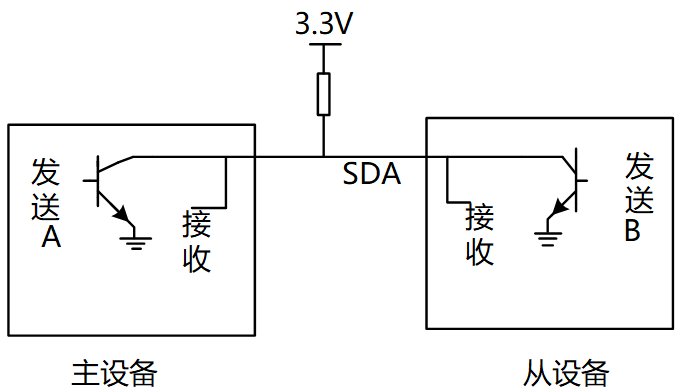
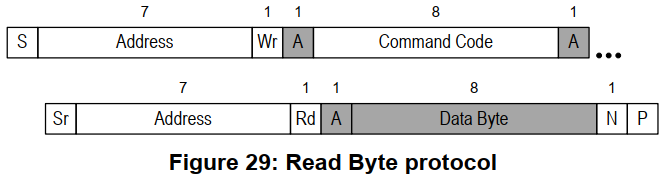
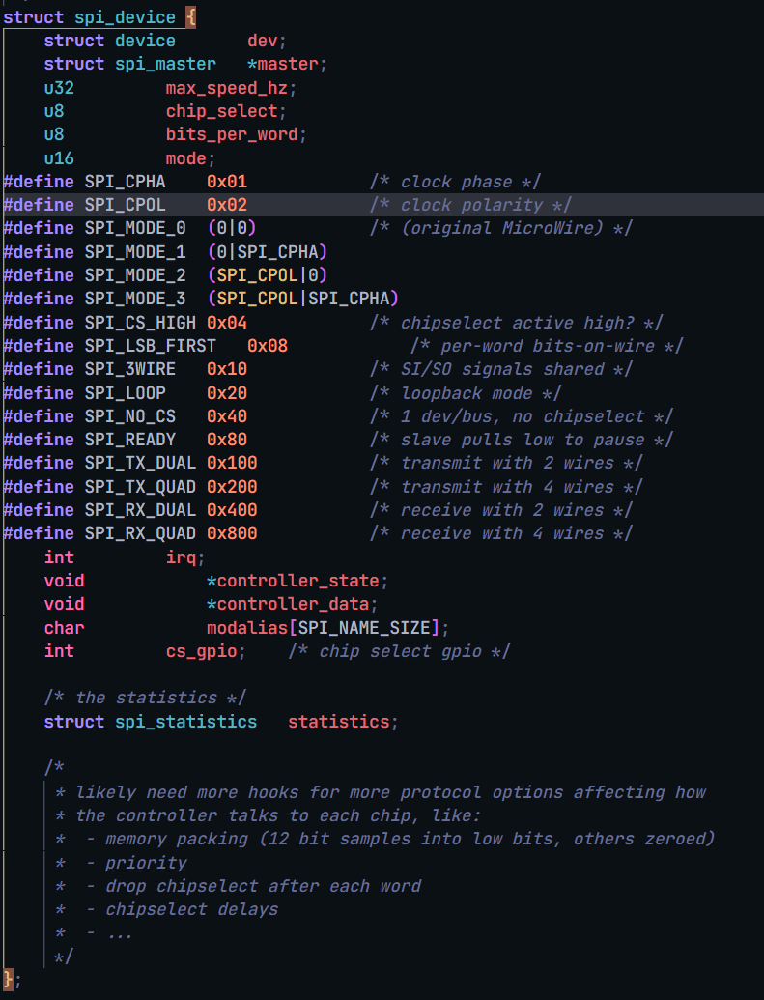

这是驱动大全SPI和I2C部分.

# I2C 子系统

参考资料：
- I2CTools：[https://mirrors.edge.kernel.org/pub/software/utils/i2c-tools/](https://mirrors.edge.kernel.org/pub/software/utils/i2c-tools/)

# 1 I2C硬件框架


- 在一个芯片(SoC)内部，有一个或多个I2C控制器
- 在一个I2C控制器上，可以连接一个或多个I2C设备
- I2C总线只需要2条线：时钟线SCL、数据线SDA
- 在I2C总线的SCL、SDA线上，都有上拉电阻

# 2 I2C软件框架


以I2C接口的存储设备AT24C02为例：

- APP：
    - 提出要求：把字符串`"hello"`写入AT24C02地址16开始的地方
    - 它是大爷，不关心底层实现的细节
    - 它只需要调用设备驱动程序提供的接口
- AT24C02驱动：
    - 它知道AT24C02要求的地址、数据格式
    - 它知道发出什么信号才能让AT24C02执行擦除、烧写工作
    - 它知道怎么判断数据是否烧写成功
    - 它构造好一系列的数据，发给I2C控制器
- I2C控制器驱动
    - 它根据I2C协议发出各类信号：I2C设备地址、I2C存储地址、数据
    - 它根据I2C协议判断

# 3 我们讲什么

## 3.1 对于Linux


从上到下：

* 先讲I2C协议
* APP可以通过`两类驱动程序`访问设备
	* I2C设备自己的驱动程序
	* 内核自带的`i2c-dev.c`驱动程序，它是i2c控制器驱动程序`暴露给用户空间`的驱动程序(i2c-dev.c)
* I2C Device Driver
	* I2C设备自己的驱动程序
	* 内核自带的i2c-dev.c驱动程序，它是i2c控制器驱动程序暴露给用户空间的驱动程序(i2c-dev.c)
* I2C Controller Driver
	* 芯片I2C控制器的驱动程序(称为adapter)
	* 使用`GPIO模拟`的I2C控制器驱动程序(i2c-gpio.c)


用户态app使用`i2c控制器`的读写能力
- APP可以通过内核暴露给用户态的驱动程序i2c-dev.c, 访问到下面的i2c控制器. App就可以原始地读写i2c设备
- 以前 I2C驱动程序要做的 发送dev_addr, reg_addr, 然后获得data, 解析数据, 这些工作现在都可以在用户态app里做了.
- 这就是用户态的驱动程序

## 3.2 对于单片机/裸机


从上到下：

- 先讲I2C协议
- APP
- I2C Device Driver
- I2C Controller Driver(也被称为adapter)

# I2C协议

参考资料：
- i2c_spec.pdf

I2C（Inter-Integrated Circuit BUS）是 I2C BUS 简称，中文为集成电路总线，是目前应用最广泛的总线之一。和 IMX6ULL 有些相关的是，刚好该总线是 NXP 前身的 PHILIPS 设计。

I2C 是一种`串行通信总线`，使用`多主从架构`，最初设计目的为了让主板、嵌入式系统或手机用来连接低速周边设备。多用于`小数据量`的场合，有传输距离短，任意时刻只能有一个主机等特性。严格意义上讲，I2C 应该是`软硬件结合体`，所以我们将分物理层和协议层来介绍该总线。

## 1 硬件连接

I2C在硬件上的接法如下所示，主控芯片引出两条线`SCL,SDA线`，在一条I2C总线上可以接很多I2C设备，我们还会放一个上拉电阻（放一个上拉电阻的原因以后我们再说）。
- 


## 2 传输数据类比

怎么通过I2C传输数据，我们需要把数据从主设备发送到从设备上去，也需要把数据从从设备传送到主设备上去，数据涉及到双向传输。

举个例子：
- 

体育老师：可以把球发给学生，也可以把球从学生中接过来。
- 发球：
    - 老师：开始了(start)
    - 老师：A！我要发球给你！(地址/方向)
    - 学生A：到！(回应)
    - 老师把球发出去（传输）
    - A收到球之后，应该告诉老师一声（回应）
    - 老师：结束（停止）
	
- 接球：
    - 老师：开始了(start)
    - 老师：B！把球发给我！(地址/方向)
    - 学生B：到！
    - B把球发给老师（传输）
    - 老师收到球之后，给B说一声，表示收到球了（回应）
    - 老师：结束（停止）

我们就使用这个简单的例子, 来解释一下IIC的传输协议：

- 老师说开始了, 表示开始信号(start)
- 老师提醒某个学生要发球, 表示发送地址和方向(address/read/write)
- 老师发球/接球, 表示数据的传输
- 收到球要回应: 回应信号(ACK)
- 老师说结束, 表示IIC传输结束(P)

## 补充: 物理层

>特性 1：半双工（非全双工）

I2C 总线中只使用两条线路：SDA、SCL。

- ① SDA(串行数据线):
	- 主芯片通过一根 SDA 线既可以把数据发给从设备，也可以从 SDA 上读取数据。在 I2C 设备内部有两个引脚（发送引脚/接受引脚），它们都连接到外部的SDA 线上。
- ② SCL(串行时钟线)：
	- I2C 主设备发出时钟，从设备接收时钟。
	- SDA 和 SCL 引脚的内部电路结构一致，引脚的输出驱动与输入缓冲连在一起。其中输出为漏极开路的场效应管、输入缓冲为一只高输入阻抗的同相器。这样结构有如下特性：
-  由于 SDA、SCL 为漏极开路结构，借助于外部的上拉电阻实现了信号的“线与”逻辑；
-  引脚在输出信号的同时还作用输入信号供内部进行检测，当输出与输入不一致时，就表示有问题发生了。这为 “时钟同步”和“总线仲裁”提供硬件基础。

SDA 和 CLK 连接线上连有两个上拉电阻，当总线空闲时，两根线均为高电平。连到总线上的任一器件输出的低电平，都将使总线的信号变低。物理层连接如下图所示：
- 

>特性 2：地址和角色可配置

每个连接到总线的器件都可以通过唯一的地址和其它器件通信，主机/从机角色和地址可配置，主机可以作为主机发送器和主机接收器。

>特性 3：多主机

IIC 是真正的多主机总线，I2C 设备可以在通讯过程转变成主机。如果两个或更多的主机同时请求总线，可以通过冲突检测和仲裁防止总线数据被破坏。

> 特性 4：传输速率

传输速率在标准模式下可以达到 100kb/s，快速模式下可以达到 400kb/s。

> 特性 5：负载和距离

节点的最大数量受限于地址空间以及总线电容决定，另外`总电容`也限制了实际通信距离只有几米。

## 3 IIC传输数据的格式

### 3.1 写操作

流程如下：

- 主芯片要发出一个start信号
- 然后发出一个设备地址(用来确定是往哪一个芯片写数据)，方向(读/写，0表示写，1表示读)
- 从设备回应(用来确定这个设备是否存在)，然后就可以传输数据
- 主设备发送一个字节数据给从设备，并等待回应
- 每传输一字节数据，接收方要有一个回应信号（确定数据是否接受完成)，然后再传输下一个数据。
- 数据发送完之后，主芯片就会发送一个停止信号。

下图：白色背景表示`"主→从"`，灰色背景表示`"从→主"`
- 

### 3.2 读操作

流程如下：

- 主芯片要发出一个start信号
- 然后发出一个设备地址(用来确定是往哪一个芯片写数据)，方向(读/写，0表示写，1表示读)
- 从设备回应(用来确定这个设备是否存在)，然后就可以传输数据
- 从设备发送一个字节数据给主设备，并等待回应
- 每传输一字节数据，接收方要有一个回应信号（确定数据是否接受完成)，然后再传输下一个数据。
- 数据发送完之后，主芯片就会发送一个停止信号。

下图：白色背景表示`"主→从"`, 灰色背景表示`"从→主"`
- 

### 3.3 I2C信号

- 数据有效性: I2C 协议的数据有效性是靠`时钟`来保证的，在时钟的高电平周期内，SDA 线上的数据必须保持稳定。数据线仅可以在时钟 SCL 为低电平时改变。
	- 

- 起始和结束条件
	- 起始条件：当 SCL 为高电平的时候，SDA 线上由高到低的跳变被定义为起始条件。
	- 结束条件：当 SCL 为高电平的时候，SDA 线上由低到高的跳变被定义为停止条件。
- 要注意`起始和终止信号`都是由`主机`发出的，连接到 I2C 总线上的器件，若具有 I2C 总线的硬件接口，则很容易检测到起始和终止信号。
	- 
	- 总线在起始条件之后，视为忙状态，在停止条件之后被视为空闲状态。

- 应答
	- 每当主机向从机发送完一个字节的数据, 主机总是需要等待从机给出一个应答信号, 以确认从机是否成功接收到了数据, 从机应答主机所需要的时钟仍是主机提供的, 应答出现在每一次主机完成 8 个数据位传输后紧跟着的时钟周期, 低电平 0 表示应答, 1 表示非应答. 

- 数据帧格式
	- SDA 线上每个字节必须是 8 位长，在每个传输(transfer)中所传输字节数没有限制，每个字节后面必须跟一个 ACK。8 位数据中，先传输最高有效位（MSB）传输。
	- 


I2C协议中数据传输的单位是字节，也就是8位。但是要用到9个时钟：前面8个时钟用来传输8数据，第9个时钟用来传输回应信号。传输时，先传输最高位(MSB)。

- 开始信号(S)：SCL为`高电平`时，SDA山`高电平向低电平跳变`，开始传送数据。
- 结束信号(P)：SCL为`高电平`时，SDA由低电平向高电平跳变，结束传送数据。
- 响应信号(ACK)：接收端在接收到8位数据后, 在第9个时钟周期, 对方拉低SDA
- SDA上传输的数据必须在SCL为高电平期间保持稳定, SDA上的数据只能在SCL为低电平期间变化

I2C协议信号如下：
- 

### 3.4 协议细节

- 如何在SDA上实现双向传输？ 主芯片通过一根SDA线既可以把数据发给从设备，也可以从SDA上读取数据，连接SDA线的引脚里面必然有两个引脚（发送引脚/接受引脚）。

- 主、从设备都可以通过SDA发送数据，肯定不能同时发送数据，怎么错开时间？ 在9个时钟里， 前8个时钟由主设备发送数据的话，第9个时钟就由从设备发送数据； 前8个时钟由从设备发送数据的话，第9个时钟就由主设备发送数据。
  
- 双方设备中，某个设备发送数据时，另一方怎样才能不影响SDA上的数据？ 设备的SDA中有一个三极管，使用开极/开漏电路(三极管是开极，CMOS管是开漏，作用一样)，如下图：
	- 
	- 
	- 真值表如下：
	- 

从真值表和电路图我们可以知道：

- 当某一个芯片不想影响SDA线时，那就不驱动这个三极管
- 想让SDA输出高电平，双方都不驱动三极管(SDA通过上拉电阻变为高电平)
- 想让SDA输出低电平，就驱动三极管

从下面的例子可以看看数据是怎么传的（实现双向传输）。 举例：主设备发送（8bit）给从设备

- 前8个clk
    - 从设备不要影响SDA，从设备不驱动三极管
    - 主设备决定数据，主设备要发送1时不驱动三极管，要发送0时驱动三极管
    
- 第9个clk，由从设备决定数据
    - 主设备不驱动三极管
    - 从设备决定数据，要发出回应信号的话，就驱动三极管让SDA变为0
    - 从这里也可以知道ACK信号是低电平


从上面的例子，就可以知道怎样在一条线上实现双向传输，这就是SDA上要使用上拉电阻的原因。

为何SCL也要使用上拉电阻？ 在第9个时钟之后，如果有某一方需要更多的时间来处理数据(主从设备都可以驱动SCL)，它可以一直驱动三极管把SCL拉低。 当SCL为低电平时候，大家都不应该使用IIC总线，只有当SCL从低电平变为高电平的时候，IIC总线才能被使用。 当它就绪后，就可以不再驱动三极管，这是上拉电阻把SCL变为高电平，其他设备就可以继续使用I2C总线了。

对于IIC协议它只能规定怎么传输数据，数据是什么含义由从设备决定。

# SMBus协议

参考资料：

- Linux内核文档：`Documentation\i2c\smbus-protocol.rst`
- SMBus协议：
    - [http://www.smbus.org/specs/](http://www.smbus.org/specs/)
- `SMBus_3_0_20141220.pdf`
- I2CTools: `https://mirrors.edge.kernel.org/pub/software/utils/i2c-tools/`

## SMBus是I2C协议的一个子集

SMBus: System Management Bus，系统管理总线。 SMBus最初的目的是为智能电池、充电电池、其他微控制器之间的通信链路而定义的。 SMBus也被用来连接各种设备，包括电源相关设备，系统传感器，EEPROM通讯设备等等。 SMBus 为系统和电源管理这样的任务提供了一条控制总线，使用 SMBus 的系统，设备之间发送和接收消息都是通过 SMBus，而不是使用单独的控制线，这样可以节省设备的管脚数。 

SMBus是基于I2C协议的，SMBus要求更严格，SMBus是I2C协议的子集。

SMBus有哪些更严格的要求？跟一般的I2C协议有哪些差别？

- VDD的极限值不一样
    - I2C协议：范围很广，甚至讨论了高达12V的情况
    - SMBus：1.8V~5V
    
- 最小时钟频率、最大的`Clock Stretching(时钟延长)`
    - Clock Stretching含义：某个设备需要更多时间进行内部的处理时，它可以把SCL拉低占住I2C总线
    - I2C协议：时钟频率最小值无限制，Clock Stretching时长也没有限制
    - SMBus：时钟频率最小值是10KHz，Clock Stretching的最大时间值也有限制
    
- 地址回应(Address Acknowledge)
    - 一个I2C设备接收到它的设备地址后，是否必须发出回应信号？
    - I2C协议：没有强制要求必须发出回应信号
    - SMBus：强制要求必须发出回应信号，这样对方才知道该设备的状态：busy，failed，或是被移除了
    
- SMBus协议明确了数据的传输格式
    - I2C协议：它只定义了怎么传输数据，但是并没有定义数据的格式，这完全由设备来定义
    - SMBus：定义了几种数据格式(后面分析)

- REPEATED START Condition(重复发出S信号)
    - 比如读EEPROM时，涉及2个操作：
        - 把存储地址发给设备
        - 读数据
    - 在写、读之间，可以不发出P信号，而是直接发出S信号：这个S信号就是`REPEATED START`
    - 如下图所示
    - 
    
- SMBus Low Power Version
    - SMBus也有低功耗的版本

## SMBus协议分析

对于I2C协议，它只定义了怎么传输数据，但是并没有定义数据的格式，这完全由设备来定义。 对于SMBus协议，它定义了几种数据格式。

**注意**：

- 下面文档中的`Functionality flag`是Linux的某个I2C控制器驱动所支持的功能。
- 比如`Functionality flag: I2C_FUNC_SMBUS_QUICK`，表示需要I2C控制器支持`SMBus Quick Command`

### symbols(符号)

```shell
S     (1 bit) : Start bit(开始位)
Sr    (1 bit) : 重复的开始位
P     (1 bit) : Stop bit(停止位)
R/W#  (1 bit) : Read/Write bit. Rd equals 1, Wr equals 0.(读写位)
A, N  (1 bit) : Accept and reverse accept bit.(回应位)
Address(7 bits): I2C 7 bit address. Note that this can be expanded as usual to
                get a 10 bit I2C address.
                (地址位，7位地址)
Command Code  (8 bits): Command byte, a data byte which often selects a register on the device.
                (命令字节，一般用来选择芯片内部的寄存器)
Data Byte (8 bits): A plain data byte. Sometimes, I write DataLow, DataHigh for 16 bit data.
                (数据字节，8位；如果是16位数据的话，用2个字节来表示：DataLow、DataHigh)
Count (8 bits): A data byte containing the length of a block operation.
				(在block操作总，表示数据长度)
[..]:           Data sent by I2C device, as opposed to data sent by the host
                adapter.
                (中括号表示I2C设备发送的数据，没有中括号表示host adapter发送的数据)
```

### SMBus Quick Command


只是用来发送一位数据：R/W#本意是用来表示读或写，但是在SMBus里可以用来表示其他含义。
比如某些开关设备，可以根据这一位来决定是打开还是关闭。
`Functionality flag: I2C_FUNC_SMBUS_QUICK`

### SMBus Receive Byte


I2C-tools中的函数：i2c_smbus_read_byte()。 读取一个字节，Host adapter接收到一个字节后不需要发出回应信号(上图中N表示不回应)。
`Functionality flag: I2C_FUNC_SMBUS_READ_BYTE`

### SMBus Send Byte


I2C-tools中的函数：i2c_smbus_write_byte()。 发送一个字节。
`Functionality flag: I2C_FUNC_SMBUS_WRITE_BYTE`

### SMBus Read Byte



I2C-tools中的函数：i2c_smbus_read_byte_data()。

先发出`Command Code`(它一般表示芯片内部的寄存器地址)，再读取一个字节的数据。 上面介绍的`SMBus Receive Byte`是不发送Comand，直接读取数据。
`Functionality flag: I2C_FUNC_SMBUS_READ_BYTE_DATA`

### SMBus Read Word


I2C-tools中的函数：i2c_smbus_read_word_data()。

先发出`Command Code`(它一般表示芯片内部的寄存器地址)，再读取2个字节的数据。
`Functionality flag: I2C_FUNC_SMBUS_READ_WORD_DATA`

### SMBus Write Byte


I2C-tools中的函数：i2c_smbus_write_byte_data()。

先发出`Command Code`(它一般表示芯片内部的寄存器地址)，再发出1个字节的数据。
`Functionality flag: I2C_FUNC_SMBUS_WRITE_BYTE_DATA`

### SMBus Write Word


I2C-tools中的函数：i2c_smbus_write_word_data()。

先发出`Command Code`(它一般表示芯片内部的寄存器地址)，再发出1个字节的数据。
`Functionality flag: I2C_FUNC_SMBUS_WRITE_WORD_DATA`

### SMBus Block Read


I2C-tools中的函数：i2c_smbus_read_block_data()。

先发出`Command Code`(它一般表示芯片内部的寄存器地址)，再发起度操作：
- 先读到一个字节(Block Count)，表示后续要读的字节数
- 然后读取全部数据

`Functionality flag: I2C_FUNC_SMBUS_READ_BLOCK_DATA`

### SMBus Block Write


I2C-tools中的函数：i2c_smbus_write_block_data()。

先发出`Command Code`(它一般表示芯片内部的寄存器地址)，再发出1个字节的`Byte Conut`(表示后续要发出的数据字节数)，最后发出全部数据。

`Functionality flag: I2C_FUNC_SMBUS_WRITE_BLOCK_DATA`

### I2C Block Read

在一般的I2C协议中，也可以连续读出多个字节。 它跟`SMBus Block Read`的差别在于设备发出的第1个数据不是长度N，如下图所示：
- 

I2C-tools中的函数：i2c_smbus_read_i2c_block_data()。

先发出`Command Code`(它一般表示芯片内部的寄存器地址)，再发出1个字节的`Byte Conut`(表示后续要发出的数据字节数)，最后发出全部数据。

`Functionality flag: I2C_FUNC_SMBUS_READ_I2C_BLOCK`

### I2C Block Write

在一般的I2C协议中，也可以连续发出多个字节。 它跟`SMBus Block Write`的差别在于发出的第1个数据不是长度N，如下图所示：
- 

I2C-tools中的函数：i2c_smbus_write_i2c_block_data()。

先发出`Command Code`(它一般表示芯片内部的寄存器地址)，再发出1个字节的`Byte Conut`(表示后续要发出的数据字节数)，最后发出全部数据。
`Functionality flag: I2C_FUNC_SMBUS_WRITE_I2C_BLOCK`

### SMBus Block Write - Block Read Process Call


先写一块数据，再读一块数据。 `Functionality flag: I2C_FUNC_SMBUS_BLOCK_PROC_CALL`

### Packet Error Checking (PEC)

PEC是一种错误校验码，如果使用PEC，那么在P信号之前，数据发送方要发送一个字节的PEC码(它是CRC-8码)。

以`SMBus Send Byte`为例，下图中，一个未使用PEC，另一个使用PEC：
- 

## SMBus和I2C的建议

因为很多设备都实现了SMBus，而不是更宽泛的I2C协议，所以优先使用SMBus。 即使I2C控制器没有实现SMBus，软件方面也是可以使用I2C协议来模拟SMBus。 所以：Linux建议优先使用SMBus。

# I2C系统的重要结构体

参考资料
- Linux驱动程序: `drivers/i2c/i2c-dev.c`
- I2CTools: `https://mirrors.edge.kernel.org/pub/software/utils/i2c-tools/`

使用一句话概括I2C传输：APP通过I2C Controller与I2C Device传输数据。


在Linux中：

- 怎么表示I2C Controller
	- 一个芯片里可能有多个I2C Controller，比如第0个、第1个、……
	- 对于使用者，只要确定是第几个I2C Controller即可
	- 使用i2c_adapter表示一个I2C BUS，或称为I2C Controller
	- 里面有2个重要的成员：
		- nr：第几个I2C BUS(I2C Controller)
		- i2c_algorithm，里面有该I2C BUS的传输函数，用来收发I2C数据
	- i2c_adapter
		- 
    
	- i2c_algorithm 
		- 
  
- 怎么表示I2C Device
	- 一个I2C Device，一定有**设备地址**
	- 它连接在哪个I2C Controller上，即对应的i2c_adapter是什么
	- 使用i2c_client来表示一个I2C Device 
		- 
  
- 怎么表示要传输的数据
	- 在上面的i2c_algorithm结构体中可以看到要传输的数据被称为：i2c_msg
	- i2c_msg 
		- 
      
    - i2c_msg中的flags用来表示传输方向：bit 0等于I2C_M_RD表示读，bit 0等于0表示写
    - 一个i2c_msg要么是读，要么是写
    
	- 举例：设备地址为0x50的EEPROM，要读取它里面存储地址为0x10的一个字节，应该构造几个i2c_msg？
		- 要构造2个i2c_msg
		- 第一个i2c_msg表示写操作，把要访问的存储地址0x10发给设备
		- 第二个i2c_msg表示读操作
		- 代码如下
```c
	u8 data_addr = 0x10;  
	i8 data;  
	struct i2c_msg msgs[2];  
	
	msgs[0].addr   = 0x50;  
	msgs[0].flags  = 0;  
	msgs[0].len    = 1;  
	msgs[0].buf    = &data_addr;  
	
	msgs[1].addr   = 0x50;  
	msgs[1].flags  = I2C_M_RD;  
	msgs[1].len    = 1;  
	msgs[1].buf    = &data;
```

## 内核里怎么传输数据

使用一句话概括I2C传输：
- APP通过I2C Controller与I2C Device传输数据
- APP通过i2c_adapter与i2c_client传输i2c_msg
- 内核函数i2c_transfer
    - i2c_msg里含有addr，所以这个函数里不需要i2c_client
    - 

# SPI 子系统

SPI视频涉及的内容

- SPI协议
- SPI驱动程序框架
    - SPI总线设备驱动模
    - SPI设备树处理过程
- 简单的SPI设备驱动
    - SPI ADC
    - SPI OLED
    - 内核自带的spi dev驱动
- 复杂的SPI设备驱动
    - SPI+FrameBuffer
- SPI控制器驱动程序
    - 使用GPIO实现
    - 具体芯片的SPI控制器驱动程序分析
- SPI调试工具
    - spi-tools
- 高性能：QSPI
- 主控芯片用作SPI从设备

留意这些知识点：

- SPI3线和SPI4线
- bits_per_word设置8和16会影响到啥
- 硬件片选和软件片选在驱动咋用

# SPI协议介绍

参考资料：

- 《SPI Block Guide V04.01.pdf》
- 《S3C2440A_UserManual_Rev13.pdf》

SPI（Serial Peripheral Interface）接口是`全双工的同步串行通讯总线`，支持通过多个不同的片选信号来连接多个外设。SPI 接口通常由四根线组成，分别是提供时钟的 SCLK，提供数据输出的 MOSI(Master Out Slave In)，提供数据输入的 MISO(Master In Slave Out)和提供片选信号的 CS。

同一时刻只能有一个 SPI 设备处于工作状态，即多个 CS 信号中某时间只能有一个有效。为了适配不同的外设 ，SPI 支持通过寄存器来配置片选信号和时钟信号的极性和相位。（imx6ull 支持 ecspi，即增强配置型 spi，这里为了与其他兼容，统一用 spi 来称呼）。

## 1 SPI硬件知识

### 1.1 硬件连线

SPI 支持 slave 和 master 两种模式，作为 APU 来说，多数情况下是作为master 来使用的。在 master 模式下，通过不同的片选引脚 `ss[n](n=0,1,2,3)`来连接多个不同的设备。下图为 MASTER 模式下的 SPI 单线通讯模式框图：
- 


引脚含义如下：

|   引脚   | 含义                                                         |
| :------: | :----------------------------------------------------------- |
| DO(MOSI) | Master Output, Slave Input，<br />SPI主控用来发出数据，SPI从设备用来接收数据 |
| DI(MISO) | Master Input, Slave Output，<br />SPI主控用来发出数据，SPI从设备用来接收数据 |
|   SCK    | Serial Clock，时钟                                           |
|    CS    | Chip Select，芯片选择引脚                                    |

片选引脚同一时刻, 只能有一个有效, 已保证单个设备的数据传输不受其他设备影响. 在时序体现就是只有在片选线有效期间, 时钟线和数据线的传输才有意义.

## SPI协议

### 2.1 传输示例

- 在 master 模式下，ss、sclk 和 mosi 作为信号输出接口，MISO 作为信号输入接口。通过 SS 片选信号使能外部 SPI 设备，SCLK 同步数据传输。MOSI 和MISO 信号在 SCLK 上升沿变化，在下降沿锁存数据。SPI 的具体通讯格式如下图所示（默认高位在前，低位在后），输出数据为 0xD2，输入数据为 0x66。
    - 


- 假设现在主控芯片要传输一个0x56数据给SPI Flash，时序如下：
    - 

- 首先`CS0`先拉低选中SPI Flash，0x56的二进制就是0b0101 0110，因此在每个SCK时钟周期，DO输出对应的电平。 
- SPI Flash会在`每个时钟周期`的`上升沿`读取D0上的电平。
    - 


### 2.2 SPI模式

- SPI 支持不同的 SPI 时钟和 CS 片选`相位和极性设置`, 通过设置 `POL` 和 `PHA值`的不同来设置相位和极性. POL: 表示 SPICLK 的初始电平，0 为电平，1 为高电平; CHA: 表示相位，即第一个还是第二个时钟沿采样数据，0 为第一个时钟沿，1 为第二个时钟沿。具体如下表所示.

- 在SPI协议中，有两个值来确定SPI的模式。 
- `CPOL:`表示SPI CLK的初始电平，0为低电平，1为高电平 
- `CPHA:`表示相位，即第一个还是第二个时钟沿采样数据，0为第一个时钟沿，1为第二个时钟沿

|CPOL|CPHA|模式|含义|
|----:|----:|----:|:----|
|0|0|0|SPICLK初始电平为低电平，在第一个时钟沿采样数据|
|0|1|1|SPICLK初始电平为低电平，在第二个时钟沿采样数据|
|1|0|2|SPICLK初始电平为高电平，在第一个时钟沿采样数据|
|1|1|3|SPICLK初始电平为高电平，在第二个时钟沿采样数据|

上述表格在时序图如下:
- 
- 
- 
- 

- 实际时钟和相位关系如下图所示，我们常用的是模式 0 和模式 3，因为它们都是在上升沿采样数据，不用去在乎时钟的初始电平是什么，只要在上升沿采集数据就行。POL 和 PHA 怎么选择？通常去参考外接的模块的芯片手册。
	- 

- 比如对于OLED，查看它的芯片手册时序部分：
	- 
- SCLK的初始电平我们并不需要关心，只要保证在上升沿采样数据就行。

### SPI控制器内部结构

- 

- 控制寄存器, 在这里面可以控制极性和相位.
- 状态寄存器, 通过这个寄存器来分辨 数据是否已经发送完了. 也可以通过这个寄存器使能中断
- 波特率寄存器, 可以通过这个寄存器 设置SCK时钟频率
- 数据寄存器, 把八位数据写入这个寄存器, 就可以一位一位发送出去. 同时从DI 来获取数据.


# SPI总线设备驱动模型

## 1 回顾平台总线设备驱动模型

Linux驱动程序开始基于`"平台总线设备驱动"`模型，把驱动程序分成2边：

- 左边注册一个`platform_driver`结构体，里面是比较固定的、通用的代码
- 右边注册一个`platform_device`结构体，里面是硬件资源
  - 可以在C文件中注册`platform_device`
  - 也可以使用设备树创建一个节点，内核解析设备树时注册`platform_device`

- 

## 2 数据结构

SPI子系统中涉及2类硬件：**SPI控制器、SPI设备**。


`SPI控制器`有驱动程序，提供SPI的传输能力。

`SPI设备`也有自己的驱动程序, 提供SPI设备的访问能力：

- 它知道怎么访问这个设备，它知道这个设备的数据含义是什么
- 它会调用SPI控制器的函数来收发数据。


### 2.1 SPI控制器数据结构

参考内核文件：`include\linux\spi\spi.h`

Linux中使用`spi_master`结构体描述``SPI控制器``，里面最重要的成员就是`transfer`函数指针：


### 2.2 SPI设备数据结构

- 参考内核文件：`include\linux\spi\spi.h`
- Linux中使用`spi_device`结构体描述`SPI设备`，里面记录有设备的片选引脚、频率、挂在哪个SPI控制器下面：


### 2.3 SPI设备驱动

参考内核文件：`include\linux\spi\spi.h`

Linux中使用`spi_driver`结构体描述`SPI设备驱动`：


## 3 SPI驱动框架


### 3.1 SPI控制器驱动程序

SPI控制器的驱动程序可以基于"平台总线设备驱动"模型来实现：

- 在设备树里描述SPI控制器的硬件信息，在设备树子节点里描述挂在下面的SPI设备的信息
- 在platform_driver中提供一个probe函数
  - 它会注册一个spi_master
  - 还会解析设备树子节点，创建spi_device结构体

### 3.2 SPI设备驱动程序

跟"平台总线设备驱动模型"类似，Linux中也有一个"SPI总线设备驱动模型"：

- 左边是spi_driver，使用C文件实现，里面有id_table表示能支持哪些SPI设备，有probe函数
- 右边是spi_device，用来描述SPI设备，比如它的片选引脚、频率
  - 可以来自设备树：比如由SPI控制器驱动程序解析设备树后创建、注册spi_device
  - 可以来自C文件：比如使用`spi_register_board_info`创建、注册spi_device

# SPI设备树处理过程

参考资料：

- 内核头文件：`include\linux\spi\spi.h`
- 内核文档：`Documentation\devicetree\bindings\spi\spi-bus.txt`	
- 内核源码：`drivers\spi\spi.c`

## 1 spi_device结构体

```c
struct spi_device {
	struct device		dev;
	struct spi_master	*master;
	u32			max_speed_hz;
	u8			chip_select;
	u8			bits_per_word;
	u16			mode;
#define	SPI_CPHA	0x01			/* clock phase */
#define	SPI_CPOL	0x02			/* clock polarity */
#define	SPI_MODE_0	(0|0)			/* (original MicroWire) */
#define	SPI_MODE_1	(0|SPI_CPHA)
#define	SPI_MODE_2	(SPI_CPOL|0)
#define	SPI_MODE_3	(SPI_CPOL|SPI_CPHA)
#define	SPI_CS_HIGH	0x04			/* chipselect active high? */
#define	SPI_LSB_FIRST	0x08			/* per-word bits-on-wire */
#define	SPI_3WIRE	0x10			/* SI/SO signals shared */
#define	SPI_LOOP	0x20			/* loopback mode */
#define	SPI_NO_CS	0x40			/* 1 dev/bus, no chipselect */
#define	SPI_READY	0x80			/* slave pulls low to pause */
#define	SPI_TX_DUAL	0x100			/* transmit with 2 wires */
#define	SPI_TX_QUAD	0x200			/* transmit with 4 wires */
#define	SPI_RX_DUAL	0x400			/* receive with 2 wires */
#define	SPI_RX_QUAD	0x800			/* receive with 4 wires */
	int			irq;
	void			*controller_state;
	void			*controller_data;
	char			modalias[SPI_NAME_SIZE];
	int			cs_gpio;	/* chip select gpio */

	/* the statistics */
	struct spi_statistics	statistics;

	/*
	 * likely need more hooks for more protocol options affecting how
	 * the controller talks to each chip, like:
	 *  - memory packing (12 bit samples into low bits, others zeroed)
	 *  - priority
	 *  - drop chipselect after each word
	 *  - chipselect delays
	 *  - ...
	 */
};
```

各个成员含义如下：

* max_speed_hz：该设备能支持的SPI时钟最大值
* chip_select：是这个spi_master下的第几个设备
    * 在spi_master中有一个cs_gpios数组,里面存放有下面各个spi设备的片选引脚
    * spi_device的片选引脚就是：cs_gpios[spi_device.chip_select]
* cs_gpio：这是可选项，也可以把spi_device的片选引脚记录在这里
* bits_per_word：每个基本的SPI传输涉及多少位
    * word：我们使用SPI控制器时，一般是往某个寄存器里写入数据，SPI控制器就会把这些数据一位一位地发送出去
    * 一个寄存器是32位的，被称为一个word(有时候也称为double word)
    * 这个寄存器里多少位会被发送出去？使用bits_per_word来表示
    * 扩展：bits_per_word是可以大于32的，也就是每次SPI传输可能会发送多于32位的数据，这适用于DMA突发传输
* mode：含义广泛，看看结构体里那些宏
    * SPI_CPHA：在第1个周期采样，在第2个周期采样？
    * SPI_CPOL：平时时钟极性
        * SPI_CPHA和SPI_CPOL组合起来就可以得到4种模式
        * SPI_MODE_0：平时SCK为低(SPI_CPOL为0)，在第1个周期采样(SPI_CPHA为0)
        * SPI_MODE_1：平时SCK为低(SPI_CPOL为0)，在第2个周期采样(SPI_CPHA为1)
        * SPI_MODE_2：平时SCK为高(SPI_CPOL为1)，在第1个周期采样(SPI_CPHA为0)
        * SPI_MODE_3：平时SCK为高(SPI_CPOL为1)，在第2个周期采样(SPI_CPHA为1)
    * SPI_CS_HIGH：一般来说片选引脚时低电平有效，SPI_CS_HIGH表示高电平有效
    * SPI_LSB_FIRST：
        * 一般来说先传输MSB(最高位)，SPI_LSB_FIRST表示先传LSB(最低位)；
        * 很多SPI控制器并不支持SPI_LSB_FIRST
    * SPI_3WIRE：SO、SI共用一条线
    * SPI_LOOP：回环模式，就是SO、SI连接在一起
    * SPI_NO_CS：只有一个SPI设备，没有片选信号，也不需要片选信号
    * SPI_READY：SPI从设备可以拉低信号，表示暂停、表示未就绪
    * SPI_TX_DUAL：发送数据时有2条信号线
    * SPI_TX_QUAD：发送数据时有4条信号线
    * SPI_RX_DUAL：接收数据时有2条信号线
    * SPI_RX_QUAD：接收数据时有4条信号线

## 2 SPI设备树格式

- 对于SPI Master, 就是SPI控制器, 它下面可以连接多个SPI设备.
- 在设备树里, 使用一个节点来表示SPI Master, 使用子节点来表示挂在下面的SPI设备.
    - SPI控制器 可以用作Master主模式, 也可以用作Slave从模式, 一般用作主模式.


### 2.1 SPI Master

在设备树中, 对于SPI Master, 必须的属性如下:

- `#address-cells`: 这个SPI Master下的SPI设备, 需要多少个cell来表述它的`片选引脚`
- `#size-cells`: `必须`设置为`0`
- `compatible`: 根据它找到SPI Master驱动

可选的属性如下: 

- `cs-gpios`: SPI Master可以使用多个GPIO当做片选, 可以在这个属性列出那些GPIO
- `num-cs`: 片选引脚总数

其他属性都是驱动程序相关的, 不同的`SPI Master`驱动程序要求的属性可能不一样.

### 2.2 SPI Device

在SPI Master对应的设备树节点下, 每一个子节点都对应一个SPI设备, 这个SPI设备连接在该SPI Master下面.

这些子节点中, `必选`的属性如下:

* `compatible`: 根据它找到SPI Device驱动
* `reg`: 用来表示它使用哪个片选引脚
* `spi-max-frequency`: 必选, 该SPI设备支持的最大SPI时钟

可选的属性如下：

* `spi-cpol`: 这是一个空属性(没有值), 表示CPOL为1, 即平时SPI时钟为低电平
* `spi-cpha`: 这是一个空属性(没有值), 表示CPHA为1), 即在时钟的第2个边沿采样数据
* `spi-cs-high`: 这是一个空属性(没有值), 表示片选引脚高电平有效
* `spi-3wire`: 这是一个空属性(没有值), 表示使用SPI 三线模式
* `spi-lsb-first`: 这是一个空属性(没有值), 表示使用SPI传输数据时先传输最低位(LSB)
* `spi-tx-bus-width`: 表示有几条MOSI引脚; 没有这个属性时默认只有1条MOSI引脚
* `spi-rx-bus-width`: 表示有几条MISO引脚; 没有这个属性时默认只有1条MISO引脚
* `spi-rx-delay-us`: 单位是毫秒, 表示每次读传输后要延时多久
* `spi-tx-delay-us`: 单位是毫秒, 表示每次写传输后要延时多久




### 2.3 设备树示例

```shell
	spi@f00 {
		#address-cells = <1>;
		#size-cells = <0>;
		compatible = "fsl,mpc5200b-spi","fsl,mpc5200-spi";
		reg = <0xf00 0x20>;
		interrupts = <2 13 0 2 14 0>;
		interrupt-parent = <&mpc5200_pic>;

		ethernet-switch@0 {
			compatible = "micrel,ks8995m";
			spi-max-frequency = <1000000>;
			reg = <0>;
		};

		codec@1 {
			compatible = "ti,tlv320aic26";
			spi-max-frequency = <100000>;
			reg = <1>;
		};
	};
```


- `spi@f00` 对于这个子节点, 会有一个驱动程序, SPI master驱动, 这驱动会解析这个节点, 构造出一个spi_master结构体. 同时也会解析其下的子节点.
- 对其下挂载的子节点, 每个子节点都会生成一个spi_device结构体. 
    - 对于设备树的SPI节点, 是由某个SPI master驱动程序做的. 
- cs-gpios 片选引脚, 里面有3个`<>`, 从0计数, 下面子节点中的`reg=<?>`, 对应的就是第几个.
    - `reg = <0>;` 对应着 `<&gpio1 0 0>` 
    - `reg = <1>;` 对应着 `<&gpio1 1 0>` 


## 3 设备树实例

- 在设备树里，会有一个节点用来表示SPI控制器。
- 在这个SPI控制器下面，连接有哪些SPI设备？会在设备树里使用子节点来描述SPI设备。

### 3.1 使用GPIO模拟的SPI控制器

内核对应的程序: `drivers/spi/spi-gpio.c`


### 3.2 IMX6ULL SPI控制器

内核文件：`arch/arm/boot/dts/imx6ull.dtsi`


内核文件：`arch/arm/boot/dts/100ask_imx6ull-14x14.dts`


### 3.3 STM32MP157 SPI控制器

内核文件：`arch/arm/boot/dts/stm32mp151.dtsi`


内核文件：`arch/arm/boot/dts/stm32mp157c-100ask-512d-lcd-v1.dts`


## 4 设备树处理过程

内核源码: `drivers/spi/spi.c`

```c
#if defined(CONFIG_OF)
static struct spi_device *
of_register_spi_device(struct spi_master *master, struct device_node *nc)
{
	struct spi_device *spi;
	int rc;
	u32 value;

	/* Alloc an spi_device */
	spi = spi_alloc_device(master);
	if (!spi) {
		dev_err(&master->dev, "spi_device alloc error for %s\n",
			nc->full_name);
		rc = -ENOMEM;
		goto err_out;
	}

	/* Select device driver */
	rc = of_modalias_node(nc, spi->modalias,
				sizeof(spi->modalias));
	if (rc < 0) {
		dev_err(&master->dev, "cannot find modalias for %s\n",
			nc->full_name);
		goto err_out;
	}

	/* Device address */
	rc = of_property_read_u32(nc, "reg", &value);
	if (rc) {
		dev_err(&master->dev, "%s has no valid 'reg' property (%d)\n",
			nc->full_name, rc);
		goto err_out;
	}
	spi->chip_select = value;

	/* Mode (clock phase/polarity/etc.) */
	if (of_find_property(nc, "spi-cpha", NULL))
		spi->mode |= SPI_CPHA;
	if (of_find_property(nc, "spi-cpol", NULL))
		spi->mode |= SPI_CPOL;
	if (of_find_property(nc, "spi-cs-high", NULL))
		spi->mode |= SPI_CS_HIGH;
	if (of_find_property(nc, "spi-3wire", NULL))
		spi->mode |= SPI_3WIRE;
	if (of_find_property(nc, "spi-lsb-first", NULL))
		spi->mode |= SPI_LSB_FIRST;

	/* Device DUAL/QUAD mode */
	if (!of_property_read_u32(nc, "spi-tx-bus-width", &value)) {
		switch (value) {
		case 1:
			break;
		case 2:
			spi->mode |= SPI_TX_DUAL;
			break;
		case 4:
			spi->mode |= SPI_TX_QUAD;
			break;
		default:
			dev_warn(&master->dev,
				"spi-tx-bus-width %d not supported\n",
				value);
			break;
		}
	}

	if (!of_property_read_u32(nc, "spi-rx-bus-width", &value)) {
		switch (value) {
		case 1:
			break;
		case 2:
			spi->mode |= SPI_RX_DUAL;
			break;
		case 4:
			spi->mode |= SPI_RX_QUAD;
			break;
		default:
			dev_warn(&master->dev,
				"spi-rx-bus-width %d not supported\n",
				value);
			break;
		}
	}

	/* Device speed */
	rc = of_property_read_u32(nc, "spi-max-frequency", &value);
	if (rc) {
		dev_err(&master->dev, "%s has no valid 'spi-max-frequency' property (%d)\n",
			nc->full_name, rc);
		goto err_out;
	}
	spi->max_speed_hz = value;

	/* Store a pointer to the node in the device structure */
	of_node_get(nc);
	spi->dev.of_node = nc;

	/* Register the new device */
	rc = spi_add_device(spi);
	if (rc) {
		dev_err(&master->dev, "spi_device register error %s\n",
			nc->full_name);
		goto err_of_node_put;
	}

	return spi;

err_of_node_put:
	of_node_put(nc);
err_out:
	spi_dev_put(spi);
	return ERR_PTR(rc);
}
```

