# 同步与互斥

## 1.1 内联汇编

要深入理解Linux内核中的同步与互斥的实现，需要先了解一下内联汇编：在C函数中使用汇编代码。

现代编译器已经足够优秀，大部分的C代码转成汇编码后，效率都很高。但是有些特殊的算法需要我们手工优化，这时就需要手写汇编代码；或是有时需要调用特殊的汇编指令(比如使用`ldrex/strex`实现互斥访问)，这都涉及内联汇编。

实际上你完全可以不使用内联汇编，单独写一个遵守ATPCS规则的汇编函数，让C函数去调用它。但是在C函数中写汇编代码，可以不用另外新建一个汇编文件，比较方便。

内联汇编的完整语法比较复杂, 可以参考这3篇文章：

- ① GNU C扩展汇编  https://gcc.gnu.org/onlinedocs/gcc/Extended-Asm.html
- ② ARM GCC 内嵌（inline）汇编手册 http://blog.chinaunix.net/uid-20543672-id-3194385.html
- ③ C内联汇编  https://akaedu.github.io/book/ch19s05.html

这3章文章写得细致而深入,也有些难以理解.跟着视频或文档,就可以掌握到足够的知识.

下面举3个例子说明汇编函数,用C函数中使用内联汇编的方法.

### 1.1.1 C语言实现加法

源码在`"/source/01_inline_assembly/01_c_code/main.c"`:

```c
01 #include <stdio.h>
02 #include <stdlib.h>
03
04 int add(int a, int b)
05 {
06      return a+b;
07 }
08
09 int main(int argc, char **argv)
10 {
11      int a;
12      int b;
13
14      if (argc != 3)
15      {
16              printf("Usage: %s <val1> <val2>\n", argv[0]);
17              return -1;
18      }
19
20      a = (int)strtol(argv[1], NULL, 0);
21      b = (int)strtol(argv[2], NULL, 0);
22
23      printf("%d + %d = %d\n", a, b, add(a, b));
24      return 0;
25 }
```

上面的add函数代码最简单, 但是对应的汇编也挺复杂: 需要入栈, 出栈等操作, 效率不算高. 看看test.dis：

```asm
266 00010404 <add>:
267    10404:   b480            push    {r7}
268    10406:   b083            sub     sp, #12
269    10408:   af00            add     r7, sp, #0
270    1040a:   6078            str     r0, [r7, #4]
271    1040c:   6039            str     r1, [r7, #0]
272    1040e:   687a            ldr     r2, [r7, #4]
273    10410:   683b            ldr     r3, [r7, #0]
274    10412:   4413            add     r3, r2                // 真正实现加法的只有这条指令
275    10414:   4618            mov     r0, r3
276    10416:   370c            adds    r7, #12
277    10418:   46bd            mov     sp, r7
278    1041a:   f85d 7b04       ldr.w   r7, [sp], #4
279    1041e:   4770            bx      lr
```

### 1.1.2 使用汇编函数实现加法

```asm
01 .text            // 放在代码段
02 .global  add     // 实现全局函数add
03 .thumb           // 使用thumb指令, main.c默认使用thumb指令, 所以这里也使用thumb指令
04
05 add:
06      add r0, r0, r1
07      bx lr
```

- 根据ATPCS规则, main函数调用add(a, b)时, 会把第一个参数存入r0寄存器, 把第二个参数存入r1寄存器.
- 在上面第06行里, 把r0, r1累加后, 结果存入r0: 根据ATPCS规则, r0用来保存返回值.
- 可以看到, 这个add函数连栈都没有使用, 非常高效.
- 这只是一个很简单的例子, 我们工作中并不使用汇编来进行“加法优化”, 在计算量非常大的地方可以考虑单独编写汇编函数实现优化.

### 1.1.3 内联汇编语法

- 从上面例子可以看到, 我们完全可以新建一个汇编文件, 在ATPCS规则之下编写代码, 这样C函数就可以直接调用汇编函数.
- 但是, 需要新建汇编文件, 有点麻烦.
- 使用内联汇编, 可以在C代码中内嵌汇编代码.

先看看内联汇编的语法:
- 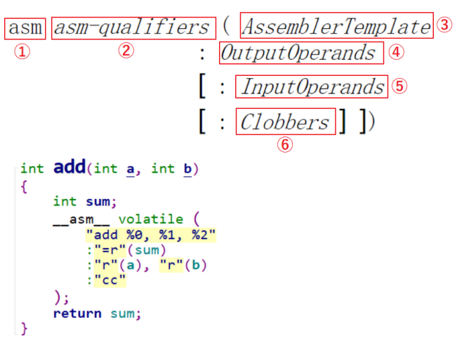

内联汇编语法：

- ① `asm` : 也可以写作`__asm__`, 表示这是一段内联汇编.
- ② `asm-qualifiers` : 有3个取值：`volatile`,`inline`,`goto`。
	- volatile的意思是易变的, 不稳定的, 用来告诉编译器不要随便优化这段代码, 否则可能出问题. 比如汇编指令"`mov  r0, r0`", 它把r0的值复制到r0, 并没有实际做什么事情, 你的本意可能是用这条指令来延时. 编译器看到这指令后, 可能就把它去掉了. 加上volatile的话, 编译器就不会擅自优化.
	- 其他2个取值我们不关心, 也比较难以理解, 不讲.

- ③ `AssemblerTemplate`: 汇编指令, 用双引号包含起来, 每条指令用"\n"分开, 比如:
```asm
“mov  %0, %1\n”
“add  %0, %1, %2\n”
```

- ④ `OutputOperands`: 输出操作数, 内联汇编执行时, 输出的结果保存在哪里.
	- 格式如下, 当有多个变量时, 用逗号隔开:
	- `[ [asmSymbolicName] ] constraint (cvariablename)`
	- `asmSymbolicName`是符号名, 随便取, 也可以不写.
	- `constraint`表示约束, 有如下常用取值:
	    - 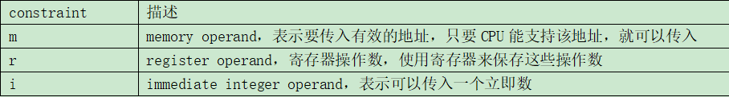
	- `constraint`前还可以加上一些`修饰字符`，比如“``=r`”, “`+r`”, “`=&r`”, 含义如下：
	    - 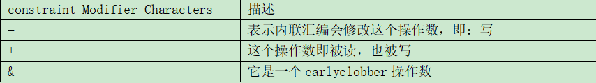
	- `cvariablename`：C语言的变量名.
	- Example:
	    - 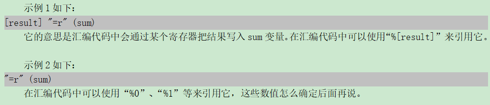

- ⑤ `InputOperands`: 输入操作数, 内联汇编执行前, 输入的数据保存在哪里.
    - 格式如下, 当有多个变量时, 用逗号隔开：
    - `[ [asmSymbolicName] ] constraint (cexpression)`
        - `asmSymbolicName`是符号名, 随便取, 也可以不写.
        - `constraint`表示约束, 参考上面, 跟`OutputOperands`类似.
        - `cexpression`：C语言的表达式.
        - 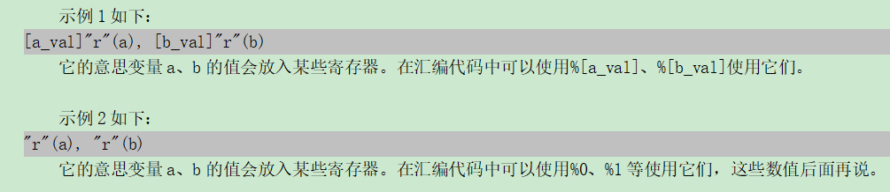


- ⑥ `Clobbers`

    - 在汇编代码中, 对于"`OutputOperands`"所涉及的寄存器, 内存, 肯定是做了修改. 但是汇编代码中, 也许要修改的寄存器, 内存会更多. 比如在计算过程中可能要用到r3保存临时结果, 我们必须在"`Clobbers`"中声明r3会被修改.
    - 下面是一个例子：`:"r0", "r1", "r2", "r3", "r4", "r5", "memory"`
    - 我们常用的是有`"cc", "memory"`, 意义如下:
        - 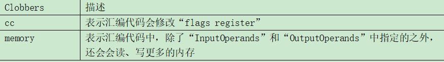

### 1.1.4 编写内联汇编实现加法

`source\01_inline_assembly\03_inline_assembly\main.c`:

```c
04 int add(int a, int b)
05 {
06      int sum;
07      __asm__ volatile (
08              "add %0, %1, %2"
09              :"=r"(sum)
10              :"r"(a), "r"(b)
11              :"cc"
12      );
13      return sum;
14 }
```

- 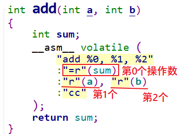

- 所以第08行代码就是: 把第1, 2个操作数相加, 存入第0个操作数. 也就是把a, b相加, 存入sum.
- 还可以使用另一种写法, 在Linux内核中这种用法比较少见.
    - 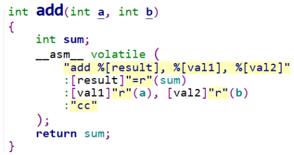

### 1.1.5 earlyclobber的例子

`OutputOperands`的约束中经常可以看到“`=&r`”, 其中的“&”表示`earlyclobber`, 它是最难理解的. 有一些输出操作数在汇编代码中早早就被写入了新值A, 在这之后, 汇编代码才去读取某个输入操作数, 这个输出操作数就被称为`earlyclobber`(早早就被改了).

这可能会有问题: 假设早早写入的新值A, 写到了r0寄存器; 后面读输入操作数时得到数值B, 也可能写入r0寄存器, 这新值A就被破坏了.

核心原因就在于输出操作数, 输入操作数都用了同一个r0寄存器. 为什么要用同一个? 因为编译器不知道你是`earlyclobber`的, 它以为是先读入了所有输入操作数, 都处理完了, 才去写输出操作数的. 按这流程, 没人来覆盖新值A.

所以, 如果汇编代码中某个输出操作数是`earlyclobber`的, 它的`constraint`就要加上“&”, 这就是告诉编译器: 给我`分配一个单独的寄存器`, 别为了省事跟输入操作数用同一个寄存器.

`source\01_inline_assembly\04_earlyclobber\main.c`:

- 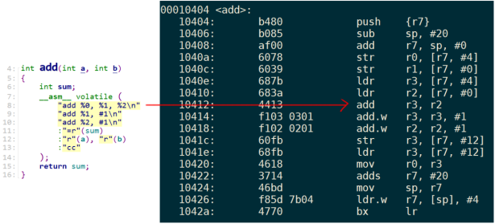
- 上面的代码中, 输出操作数%0对应的寄存器是r3, 输入操作数%1对应的寄存器也是r3.
- 第8行更新了%0的值后, 第9行修改%1的值, 由于%0, %1是同一个寄存器, 所以%0的值也被修改了.
- 最终返回的累加值是错的, 增加了1, 如下图所示:
    - 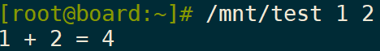

- 怎么修改？在第11行加“&”就可以了, 这是告诉编译器, 对于`%0操作数它是earlyclobber的`, 不能跟其他操作数共用寄存器, 如下:
    - 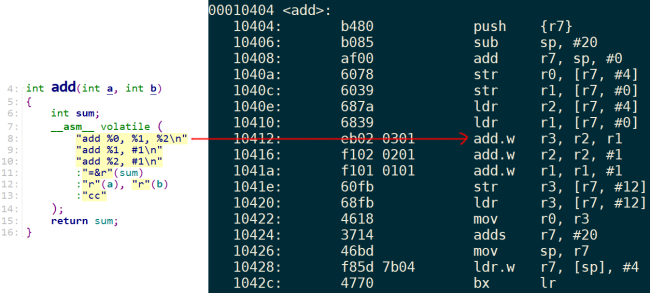
    - 从右边的反汇编码可以知道, %0跟%1, %2使用不一样的寄存器, 所以后面第9, 10行无法影响到%0的值.
    - 程序运行结果如下图所示：
    - 

- 内核内联汇编的实例:

```c
static inline void arch_spin_lock(arch_spinlock_t *lock)
{
	unsigned long tmp;
	u32 newval;
	arch_spinlock_t lockval;

	prefetchw(&lock->slock);
	__asm__ __volatile__(
		"1:	ldrex %0, [%3]\n"
		"	add	%1, %0, %4\n"
		"	strex %2, %1, [%3]\n"
		"	teq	%2, #0\n"
		"	bne	1b"
		: "=&r" (lockval), "=&r" (newval), "=&r" (tmp)
		: "r" (&lock->slock), "I" (1 << TICKET_SHIFT)
		: "cc"
	);

	while (lockval.tickets.next != lockval.tickets.owner) {
		wfe();
		lockval.tickets.owner = ACCESS_ONCE(lock->tickets.owner);
	}

	smp_mb();
}
```

## 1.2 同步与互斥的失败例子

- 一句话理解同步与互斥: 我等你用完厕所, 我再用厕所.
- 什么叫同步? 就是条件不允许, 我要等等.
- 什么是互斥? 你我早起都要用厕所, 谁先抢到谁先用, 中途不被打扰.
- 同步与互斥经常放在一起讲, 是因为它们之的关系很大, “互斥”操作可以使用“同步”来实现. 我“等”你用完厕所, 我再用厕所. 这不就是用“同步”来实现“互斥”吗?
- 看代码更容易理解, 伪代码如下:

```c
01 void 抢厕所(void)
02 {
03   if (有人在用) 我眯一会;
04   用厕所;
05   喂，醒醒，有人要用厕所吗;
06 }
```

- 假设有A, B两人早起抢厕所, A先行一步占用了; B慢了一步, 于是就眯一会; 当A用完后叫醒B, B也就愉快地上厕所了.
- 在这个过程中, A, B是互斥地访问“厕所”, “厕所”被称之为临界资源. 我们使用了“休眠-唤醒”的同步机制实现了“临界资源”的“互斥访问”.

### 1.2.1 失败例子1

```c
01 static int valid = 1;
02
03 static ssize_t gpio_key_drv_open (struct inode *node, struct file *file)
04 {
05      if (!valid)
06      {
07              return -EBUSY;
08      }
09      else
10      {
11              valid = 0;
12      }
13
14      return 0; //成功
15 }
16
17 static int gpio_key_drv_close (struct inode *node, struct file *file)
18 {
19      valid = 1;
20      return 0;
21 }
```

- 看第5行，我们使用一个全局变量valid来实现互斥访问。这有问题吗？很大概率没问题，但是并非万无一失。
- ***注意***：编写驱动程序时，要有系统的概念，程序A调用驱动程序时，它可能被程序B打断，程序B也去调用这个驱动程序。
- 下图是一个例子，程序A在调用驱动程序的中途被程序B抢占了CPU资源：
    - 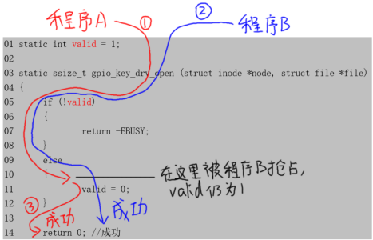

- 程序A执行到第11行之前, 被程序B抢占了, 这时valid尚未被改成0;
- 程序B调用`gpio_key_drv_open`时, 发现valid等于1, 所以成功返回0;
- 当程序A继续从第11行执行时, 它最终也成功返回0;
- 这样程序A, B都成功打开了驱动程序.

***注意***: 在内核态, 程序A不是主动去休眠, 主动放弃CPU资源; 而是被优先级更高的程序B抢占了, 这种行为被称为“`preempt`”(抢占).

### 1.2.2 失败例子2

上面的例子是不是第5行到第11行的时间跨度大长了？再优化一下程序行不行？代码如下：

```c
01 static int valid = 1;
02
03 static ssize_t gpio_key_drv_open (struct inode *node, struct file *file)
04 {
05      if (--valid)
06      {
07              valid++;
08              return -EBUSY;
09      }
10      return 0;
11 }
12
13 static int gpio_key_drv_close (struct inode *node, struct file *file)
14 {
15      valid = 1;
16      return 0;
17 }
```

- 第5行先减1再判断，这样可以更大概率地避免问题，但是还是不能确保万无一失。对数据的修改分为3步：读出来、修改、写进去。请看下图：
    - 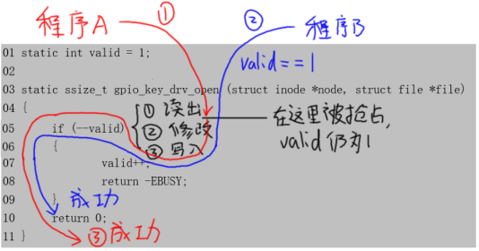

- 进程A在读出valid时发现它是1，减1后为0，这时if不成立；但是修改后的值`尚未写回内存`；
- 假设这时被程序B抢占，程序B读出valid仍为1，减1后为0，这时if不成立，最后成功返回；
- 轮到A继续执行，它把0值写到valid变量，最后也成功返回。
- 这样程序A、B都成功打开了驱动程序。

### 1.2.3 失败例子3

- 前面2个例子, 都是在修改valid的过程中被别的进程抢占了, 那么在修改valid的时候直接关中断不就可以了吗?

```c
01 static int valid = 1;
02
03 static ssize_t gpio_key_drv_open (struct inode *node, struct file *file)
04 {
05       unsigned long flags;
06       raw_local_irq_save(flags); // 关中断
07      if (--valid)
08      {
09              valid++;
10              raw_local_irq_restore(flags);  // 恢复之前的状态
11              return -EBUSY;
12      }
13       raw_local_irq_restore(flags);          // 恢复之前的状态
14      return 0;
15 }
16
17 static int gpio_key_drv_close (struct inode *node, struct file *file)
18 {
19      valid = 1;
20      return 0;
21 }
```

- 第06行直接关中断, 这样别的线程, 中断都不能来打扰本线程了, 在它读取, 修改valid变量的过程中无人打扰.
    - 这样就没有问题了?

- 对于`单CPU核的系统`上述代码是没问题的; 但是对于`SMP系统`, 你只能关闭当前CPU核的中断, 别的CPU核还可以运行程序, 它们也可以来执行这个函数, 同样导致问题, 如下图:
    - 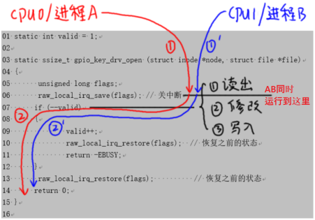
- 假设CPU0上进程A, CPU1上进程B同时运行到上图中读出valid的地方, 它们同时发现valid都是1, 减减后都等于0, 在第07行判断条件都不成立, 所以在第14行都可以返回0, 都可以成功打开驱动.

## 1.3 原子操作的实现原理与使用

- 在上面的第2个失败例子里, 问题在于`对valid变量的修改被打断了`. 如果对valid变量的操作不能被打断, 就解决这个问题了.
- 这可以使用`原子操作`, 所谓“原子操作”就是这个`操作不会被打断`. Linux有2种原子操作: 原子变量, 原子位.
    - 原子操作: 要么执行完不被打断, 要么就不执行. 不会有其它情况.

### 1.3.1 原子变量的内核操作函数

- 原子变量的操作函数在Linux内核文件`arch/arm/include/asm/atomic.h`中.
- 原子变量类型如下, 实际上就是一个结构体(内核文件`include/linux/types.h`):

```c
typedef struct {
	int counter;
} atomic_t;

#ifdef CONFIG_64BIT
typedef struct {
	long counter;
} atomic64_t;
#endif
```

- 特殊的地方在于它的操作函数, 如下(下表中v都是`atomic_t`指针): 

|         函数名         | 作用    |
| :--------------------:| :------------------------------|
|`atomic_read(v)`| 读出原子变量的值,即`v->counter` |
|`atomic_set(v,i)`| 设置原子变量的值,即`v->counter = i` |
|`atomic_inc(v)`| `v->counter++`  |
|`atomic_dec(v)` | `v->counter--`  |
|`atomic_add(i,v)`| `v->counter += i` |
|`atomic_sub(i,v)`| `v->counter -= i` |
|`atomic_inc_and_test(v)`|先加1,再判断新值是否等于0; 等于0的话,返回值为1|
|`atomic_dec_and_test(v)`|先减1,再判断新值是否等于0; 等于0的话,返回值为1|

### 1.3.2 原子变量的内核实现

- ***注意***: SMP就是`Symmetric Multi-Processors`, 对称多处理器; UP即`Uni-Processor`, 系统只有一个单核CPU.
- 这些函数都是在Linux内核文件`arch/arm/include/asm/atomic.h`中.
- `atomic_read`,`atomic_set`这些操作都只需要`一条汇编指令`, 所以它们本身就是不可打断的.
- 问题在于`atomic_inc`这类操作, 要读出, 修改, 写回.
- 以`atomic_inc`为例, 在`atomic.h`文件中, 如下定义:
    - `#define atomic_inc(v)	 atomic_add(1, v)`
- `atomic_add`又是怎样实现的呢? 用下面这个宏:`ATOMIC_OPS(add, +=, add)`
    - 把这个宏展开：

```c
#define ATOMIC_OPS(op, c_op, asm_op)		\
	ATOMIC_OP(op, c_op, asm_op)			    \
	ATOMIC_OP_RETURN(op, c_op, asm_op)		\
	ATOMIC_FETCH_OP(op, c_op, asm_op)
```

- 从上面的宏可以知道, 一个ATOMIC_OPS定义了3个函数. 比如`"ATOMIC_OPS(add, +=, add)"`就定义了这3个函数:

```c
atomic_add
atomic_add_return
atomic_atomic_fetch_add 或 atomic_fetch_add_relaxed
```

以`ATOMIC_OP(add, +=, add)`为例, 看它是如何实现atomic_add函数的, 对于UP系统, SMP系统, 分别有不同的实现方法.

> ATOMIC_OP在UP系统中的实现

- 对于`ARMv6以下`的CPU系统, 不支持SMP. 原子变量的操作简单粗暴: `关中断`, 中断都关了, 谁能来打断我? 代码如下(`arch/arm/include/asm/atomic.h`):
    - 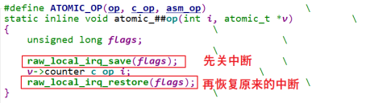

> ATOMIC_OP在SMP系统中的实现

- 对于`ARMv6及以上`的CPU, 有一些特殊的`汇编指令`来实现原子操作, 不再需要关中断, 代码如下(`arch/arm/include/asm/atomic.h`):
    - 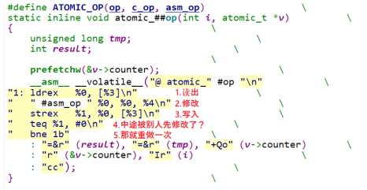
- 在`ARMv6及以上`的架构中, 有`ldrex, strex`指令, ex表示`exclude`, 意为独占地. 这2条指令要配合使用, 举例如下:
    - ① 读出:`ldrex r0, [r1]`
        - 读取r1所指内存的数据, 存入r0; 并且`标记r1所指内存为"独占访问"`.
        - 如果有其他程序再次执行"`ldrex r0, [r1]`", 一样会成功, 一样会标记r1所指内存为"独占访问".
    - ② 修改r0的值
    - ③ 写入:`strex  r2, r0, [r1]`:
        - 如果r1的"独占访问"标记还存在, 则把r0的新值写入r1所指内存, 并且清除"独占访问"的标记, 把r2设为0表示成功.
        - 如果r1的"独占访问"标记不存在了, 就不会更新内存, 并且把r2设为1表示失败

- 假设这样的抢占场景:
    - ① 程序A在读出, 修改某个变量时, 被程序B抢占了;
    - ② 程序B先完成了操作, 程序B的`strex`操作会清除"独占访问"的标记;
    - ③ 轮到程序A执行剩下的写入操作时, 它发现"独占访问"标记不存在了, 于是取消写入操作.
        - 这就避免了这样的事情发生: 程序A, B同时修改这个变量, 并且都自认为成功了.

举个例子, 比如`atomic_dec`, 假设一开始变量值为1, 程序A本想把值从1变为0; 但是中途被程序B先把值从1变成0了; 但是没关系, 程序A里会`再次`读出新值, 修改, 写入, 最终这个值被程序A从0改为-1.

在ARMv6及以上的架构中, 原子操作不再需要关闭中断, 关中断的花销太大了. 并且关中断并不适合SMP多CPU系统, 你关了CPU0的中断, CPU1也可能会来执行些操作啊. 

在ARMv6及以上的架构中, 原子操作的执行过程是可以被打断的, 但是它的效果符合"原子"的定义: 一个完整的"读, 修改, 写入"原子的, 不会被别的程序打断. 它的思路很简单: 如果被别的程序打断了, 那就重来, 最后总会成功的.

### 1.3.3 原子变量使用案例

现在可以使用原子变量实现: 只能有一个APP访问驱动程序. 代码如下:

```c
01 static atomic_t valid = ATOMIC_INIT(1);
02
03 static ssize_t gpio_key_drv_open (struct inode *node, struct file *file)
04 {
05      if (atomic_dec_and_test(&valid))
06      {
07              return 0;
08      }
09      atomic_inc(&valid);
10      return -EBUSY;
11 }
12
13 static int gpio_key_drv_close (struct inode *node, struct file *file)
14 {
15      atomic_inc(&valid);
16      return 0;
17 }
```

- 第5行的`atomic_dec_and_test`, 这是一个原子操作, 在ARMv6以下的CPU架构中, 这个函数是在关中断的情况下执行的, 它确实是"原子的", 执行过程不被打断.
- 但是在ARMv6及以上的CPU架构中, 这个函数其实是可以被打断的, 但是它实现了原子操作的效果, 如下图所示:
    - 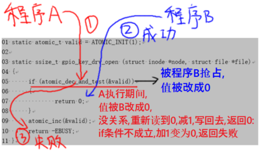

### 1.3.4 原子位介绍

> 原子位的内核操作函数

- 能操作原子变量, 再去操作其中的某一位, 不是挺简单的嘛? 不过不需要我们自己去实现, 内核做好了.
- 原子位的操作函数在Linux内核文件`arch/arm/include/asm/bitops.h`中, 下表中p是一个`unsigned long指针`.

|     函数名     | 作用       |
| :-----------------------: | :------------------------- |
|      set_bit(nr,p)       | 设置`(*p)`的bit nr为1 |
|      clear_bit(nr,p)     | 清除`(*p)`的bit nr为0 |
| change_bit(nr,p) | 改变`(*p)`的bit nr, 从1变为0, 或是从0变为1 |
|  test_and_set_bit(nr,p)   | 设置`(*p)`的bit nr为1, 返回该位的老值 |
| test_and_clear_bit(nr,p)  | 清除`(*p)`的bit nr为0, 返回该位的老值 |
| test_and_change_bit(nr,p) | 改变`(*p)`的bit nr, 从1变为0, 或是从0变为1; 返回该位的老值 |

> 原子位的内核实现

- 在`ARMv6以下`的架构里, 不支持SMP系统, 原子位的操作函数也是简单粗暴: 关中断. 以`set_bit`函数为例, 代码在内核文件`arch/arm/include/asm/bitops.h`中, 如下:
    - 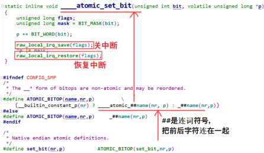
- 在`ARMv6及以上`的架构中, 不需要关中断, 有`ldrex,strex`等指令, 这些指令的作用在前面介绍过. 还是以`set_bit`函数为例, 代码如下:
    - 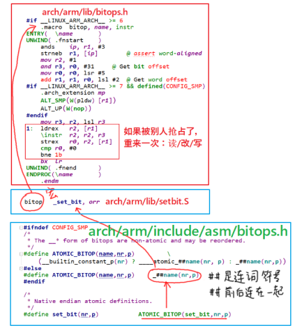

## 1.4 Linux锁的介绍与使用

本节参考: 
- https://www.kernel.org/doc/html/latest/locking/index.html
- https://mirrors.edge.kernel.org/pub/linux/kernel/people/rusty/kernel-locking/

### 1.4.1 锁的类型

Linux内核提供了很多类型的锁,它们可以分为两类：
- ① 自旋锁(spinning lock);
- ② 睡眠锁(sleeping lock).

> 自旋锁

- 简单地说就是无法获得锁时,不会休眠,会一直循环等待.有这些自旋锁:

|     自旋锁     | 描述      |
| :------------: | ---------------------- |
| `raw_spinlock_t` | 原始自旋锁(后面讲解)     |
| `bit spinlocks` | 位自旋锁(似乎没什么意义) |

- 自旋锁的加锁, 解锁函数是: spin_lock, spin_unlock, 还可以加上各种后缀, 这表示在加锁或解锁的同时, 还会做额外的事情:

| 后缀   | 描述    |
|:----------------:|:-----------------------|
|`_bh()`|加锁时禁止下半部(软中断),解锁时使能下半部(软中断)|
|`_irq()`|加锁时禁止中断,解锁时使能中断|
|`_irqsave/restore()`|加锁时禁止中断并记录状态,解锁时恢复中断为所记录的状态|
- 自旋锁的作业区时间应该尽可能短,如果比睡眠锁的系统开销时间还长, 那为什么不用睡眠锁.

> 睡眠锁

简单地说就是无法获得锁时, 当前线程就会休眠. 有这些休眠锁(互斥锁跟信号量):

|  休眠锁  | 描述  |
| :-----------------: | ------------- |
| `mutex` | `mutual exclusion`, 彼此排斥, 即互斥锁(后面讲解) |
|  `rt_mutex`   |   |
|  `semaphore` | 信号量, 旗语(后面讲解)  |
|  `rw_semaphore` | 读写信号量, 读写互斥, 但是可以多人同时读 |
|  `ww_mutex`  |   |
| `percpu_rw_semaphore` | 对`rw_semaphore`的改进, 性能更优 |

### 1.4.2 锁的内核函数

> 自旋锁

- spinlock函数在内核文件`include/linux/spinlock.h`中声明, 如下表:

|  函数名  | 作用 |
| :----------: | ------------- |
|`spin_lock_init(_lock)` | 初始化自旋锁为unlock状态 |
|   `void spin_lock(spinlock_t *lock)`   | 获取自旋锁(加锁), 返回后肯定获得了锁   |
|  `int spin_trylock(spinlock_t *lock)`  | 尝试获得自旋锁, 成功获得锁则返回1, 否则返回0 |
|  `void spin_unlock(spinlock_t *lock)`  | 释放自旋锁, 或称解锁  |
| `int spin_is_locked(spinlock_t *lock)` | 返回自旋锁的状态, 已加锁返回1, 否则返回0  |

- 自旋锁的加锁, 解锁函数是: spin_lock, spin_unlock, 还可以加上各种后缀, 这表示在加锁或解锁的同时, 还会做额外的事情:

| 后缀   | 描述   |
| :-----------: | :-------|
| `_bh()`| 加锁时禁止下半部(软中断), 解锁时使能下半部(软中断),spin_lock_bh() |
| `_irq()`| 加锁时禁止中断, 解锁时使能中断,spin_lock_irq() |
| `_irqsave/restore()` | 加锁时禁止并中断并记录状态, 解锁时恢复中断为所记录的状态(若之前是关状态,就恢复为关中断) |

> 信号量 semaphore

- semaphore函数在内核文件`include/linux/semaphore.h`中声明, 如下表: 

|  函数名  | 作用   |
| :-----------------: | -------------- |
|  `DEFINE_SEMAPHORE(name)` | 定义一个struct semaphore name结构体, count值设置为1 |
| `void sema_init(struct semaphore *sem, int val)` | 初始化semaphore |
| `void down(struct semaphore *sem)` | 获得信号量,如果暂时无法获得就会休眠; 返回之后就表示肯定获得了信号量; 在休眠过程中无法被唤醒,即使有信号发给这个进程也不处理 |
| `int down_interruptible(struct semaphore *sem)`  | 获得信号量,如果暂时无法获得就会休眠,休眠过程有可能收到信号而被唤醒, 要判断返回值: 0:获得了信号量; -EINTR:被信号打断 |
|`int down_killable(struct semaphore *sem)`| 跟down_interruptible类似,down_interruptible可以被任意信号唤醒,但down_killable只能被"fatal signal"唤醒,返回值: 0:获得了信号量; -EINTR:被信号打断 |
|`int down_trylock(struct semaphore *sem)`|尝试获得信号量, 不会休眠, 返回值: 0:获得了信号量; 1:没能获得信号量 |
| `int down_timeout(struct semaphore *sem, long jiffies)` | 获得信号量, 如果不成功, 休眠一段时间返回值: 0: 获得了信号量; -ETIME: 这段时间内没能获取信号量, 超时返回down_timeout休眠过程中, 它不会被信号唤醒 |
| `void up(struct semaphore *sem)`| 释放信号量, 唤醒其他等待信号量的进程 |

> 互斥量 mutex

- `mutex函数在内核文件include/linux/mutex.h`中声明, 如下表:

| 函数名 | 作用 |
| :----------------: | ---------------- |
| `mutex_init(mutex)` | 初始化一个struct mutex指针    |
| `DEFINE_MUTEX(mutexname)` | 初始化struct mutex mutexname  |
| `int mutex_is_locked(struct mutex *lock)` | 判断mutex的状态 1:m被锁了(locked); 0: 没有被锁 |
|`void mutex_lock(struct mutex *lock)`| 获得mutex,如果暂时无法获得,休眠返回之时必定是已经获得了mutex |
|`int mutex_lock_interruptible(struct mutex *lock)`| 获得mutex,如果暂时无法获得,休眠; 休眠过程中可以被信号唤醒,返回值: 0:成功获得了mutex; -EINTR: 被信号唤醒了|
|`int mutex_lock_killable(struct mutex *lock)`| 跟mutex_lock_interruptible类似, mutex_lock_interruptible可以被任意信号唤醒, 但mutex_lock_killable`只能`被"fatal signal"唤醒, 返回值:0:获得了mutex; -EINTR:被信号打断 |
| `int mutex_trylock(struct mutex *lock)`| 尝试获取mutex,如果无法获得,不会休眠,返回值:1:获得了mutex, 0:没有获得注意,这个返回值含义跟一般的mutex函数相反, |
|`void mutex_unlock(struct mutex *lock)`| 释放mutex,会唤醒其他等待同一个mutex的线程|
| `int atomic_dec_and_mutex_lock(atomic_t *cnt, struct mutex *lock)` | 让原子变量的值减,如果减1后等于0,则获取mutex,返回值:1:原子变量等于0并且获得了mutex; 0:原子变量减1后并不等于0,没有获得mutex |

> semaphore和mutex的区别

- semaphore中可以指定count为任意值, 比如有10个厕所, 所以10个人都可以使用厕所.
- 而mutex的值只能设置为1或0, 只有一个厕所。
- 是不是把semaphore的值设置为1后, 它就跟mutex一样了呢? 不是的.

- 看一下mutex的结构体定义,如下:
    - 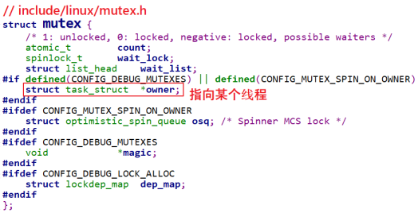

- 它里面有一项成员"`struct task_struct *owner`",  owner有2个用途：`debug`(CONFIG_DEBUG_MUTEXES)或`spin_on_owner`(CONFIG_MUTEX_SPIN_ON_OWNER). 
    - 什么叫spin on owner？
    - 我们使用mutex的目的`一般是用来保护一小段代码, 这段代码运行的时间很快`. 这意味着一个获得mutex的进程, 可能很快就会释放掉mutex.
    - 针对这点可以进行`优化`, 特别是当前获得mutex的进程是在别的CPU上运行, 并且"我"是唯一等待这个mutex的进程. 在这种情况下, 那"我"就原地spin等待吧: 懒得去休眠了, 休眠又唤醒就太慢了.
    - 所以, mutex是做了特殊的优化, 比semaphore效率更高. 但是在代码上, 并没有要求"谁获得mutex, 就必须由谁释放mutex", 只是在使用惯例上是"谁获得mutex, 就必须由谁释放mutex".

- semaphore可以用来解决"读者-写者"问题: 程序A在等待数据──想获得锁, 程序B产生数据后释放锁, 这会唤醒A来读取数据. semaphore的锁定与释放, 并不限定为同一个进程. 
- 主要区别列表如下:

|     | semaphore | mutex |
| :-----------------: | :----------- | :---------|
|  几把锁 | 任意,可设置     | 1   |
|  谁能解锁   | 别的程序,中断等都可以 | 一般惯例是谁用谁放 |
| 多次解锁 | 可以  | 不可以,因为只有1把锁 |
|  循环加锁 | 可以 | 不可以,因为只有1把锁 |
| 任务在持有锁的期间可否退出 | 可以 | 不建议,容易导致死锁 |
| 硬件中断,软件中断上下文中使用 | 可以 | 不可以  |

### 1.4.3 何时用何种锁

- 本节参考：https://wenku.baidu.com/view/26adb3f5f61fb7360b4c656e.html
- 英文原文：https://mirrors.edge.kernel.org/pub/linux/kernel/people/rusty/kernel-locking/
- 你可能看不懂下面这个表格, 请学习完后面的章节再回过头来看这个表格.

    - 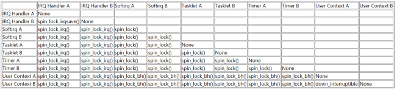

    - 举例简单介绍一下, 上表中第一行"`IRQ Handler A`"和第一列"`Softirq A`"的交叉点是"`spin_lock_irq()`", 意思就是说如果"`IRQ Handler A`"和"`Softirq A`"要竞争临界资源, 那么需要使用"`spin_lock_irq()`"函数. 为什么不能用`spin_lock`而要用`spin_lock_irq`? 也就是为什么要把中断给关掉? 假设在`Softirq A`中获得了临界资源, 这时发生了IRQ A中断, IRQ Handler A去尝试获得自旋锁,这就会导致死锁: 所以需要关中断.

### 1.4.4 内核抢占(preempt)等额外的概念

早期的的Linux内核是"不可抢占"的, 假设有A, B两个程序在运行, 当前是程序A在运行, 什么时候轮到程序B运行呢?

- ① 程序A主动放弃CPU:
    - 比如它调用某个系统调用,调用某个驱动,进入内核态后执行了schedule()主动启动一次调度.
- ② 程序A调用系统函数进入内核态,从内核态返回用户态的前夕:
    - 这时内核会判断是否应该切换程序.

- ③ 程序A正在用户态运行,发生了中断:
    - 内核处理完中断,继续执行程序A的用户态指令的前夕,它会判断是否应该切换程序.

从这个过程可知, 对于"`不可抢占`"的内核, 当程序A运行内核态代码时进程是无法切换的(除非程序A主动放弃), 比如执行某个系统调用, 执行某个驱动时, 进程无法切换.

- 这会导致2个问题:

- ① 优先级反转:
    - 一个`低优先级`的程序,因为它正在内核态执行某些很耗时的操作,在这一段时间内更高优先级的程序也无法运行.

- ② 在内核态发生的中断不会导致进程切换

为了让`系统的实时性`更佳, Linux内核引入了"抢占"(`preempt`)的功能: 进程运行于内核态时, 进程调度也是可以发生的.

回到上面的例子, 程序A调用某个驱动执行耗时的操作, 在这一段时间内系统是可以切换去执行更高优先级的程序.

对于`可抢占的内核`, 编写驱动程序时要时刻注意: 你的驱动程序随时可能被打断, 随时是可以被另一个进程来重新执行. 对于可抢占的内核, 在驱动程序中`要考虑对临界资源加锁.`

### 1.4.5 使用场景

- 本节参考：https://wenku.baidu.com/view/26adb3f5f61fb7360b4c656e.html
- 英文原文：https://mirrors.edge.kernel.org/pub/linux/kernel/people/rusty/kernel-locking/

> 只在用户上下文加锁

- 假设只有程序A, 程序B会抢占资源, 这2个程序都是可以休眠的, 所以可以使用信号量, 代码如下:

```c
static DEFINE_SPINLOCK(clock_lock); // 或 struct semaphore sem;  sema_init(&sem, 1);
if (down_interruptible(&sem))  // if (down_trylock(&sem))
{
    /* 获得了信号量 */
}
/* 释放信号量 */
up(&sem); 
```

- 对于down_interruptible函数, 如果信号量暂时无法获得, 此函数会令程序进入休眠; 别的程序调用up()函数释放信号量时会唤醒它.
- 在down_interruptible函数休眠过程中, 如果进程收到了信号, 则会从down_interruptible中返回; 对应的有另一个函数down, 在它休眠过程中会忽略任何信号.
- ***注意***："信号量"(semaphore), 不是"信号"(signal).
- 也可以使用mutex, 代码如下:

```c
static DEFINE_MUTEX(mutex);  //或 static struct mutex mutex; mutex_init(&mutex);
mutex_lock(&mutex);
/* 临界区 */
mutex_unlock(&mutex);
```
***注意***: 一般来说在同一个函数里调用`mutex_lock`或`mutex_unlock`,不会长期持有它. 这只是惯例,如果你使用mutex来实现驱动程序只能由一个进程打开,在`drv_open`中调用mutex_lock,在`drv_close`中调用mutex_unlock,这也完全没问题.

> 在用户上下文与Softirqs之间加锁

假设这么一种情况:程序A运行到内核态时,正在访问一个临界资源;这时发生了某个硬件中断,在硬件中断处理完后会处理Softirq,而某个Softirq也会访问这个临界资源.

怎么办？

在程序A访问临界资源之前,干脆禁止Softirq好了！

可以使用`spin_lock_bh`函数,它会先禁止本地CPU的中断下半部即Softirq,这样本地Softirq就不会跟它竞争了;假设别的CPU也想获得这个资源,它也会调用spin_lock_bh禁止它自己的Softirq.这2个CPU都禁止自己的Softirq,然后竞争spinlock,谁抢到谁就先执行.可见,在执行临界资源的过程中,本地CPU的Softirq,别的CPU的Softirq都无法来抢占当前程序的临界资源.

释放锁的函数是`spin_unlock_bh`.

`spin_lock_bh/spin_unlock_bh`的后缀是"`_bh`", 表示"`Bottom Halves`",中断下半部,这是软件中断的老名字.这些函数改名为spin_lock_softirq也许更恰当,请记住: spin_lock_bh会禁止Softirq,而不仅仅是禁止"中断下半部"(timer,tasklet里等都是Softirq,中断下半部只是Softirq的一种).

示例代码如下：

```c
static DEFINE_SPINLOCK(lock); // static spinlock_t lock; spin_lock_init(&lock);
spin_lock_bh(&lock);
/* 临界区 */
spin_unlock_bh(&lock);
```

> 在用户上下文与Tasklet之间加锁

Tasklet也是Softirq的一种,所以跟前面是"在用户上下文与Softirqs之间加锁"完全一样.

> 在用户上下文与Timer之间加锁

Timer也是Softirq的一种,所以跟前面是"在用户上下文与Softirqs之间加锁"完全一样.

> 在Tasklet与Timer之间加锁

假设在Tasklet中访问临界资源,另一个CPU会不会同时运行这个Tasklet? 不会的,所以如果只是在某个Tasklet中访问临界资源,无需上锁.

假设在Timer中访问临界资源,另一个CPU会不会同时运行这个timer?不会的,所以如果只是在某个Timer中访问临界资源,无需上锁.

如果在有2个不同的Tasklet或Timer都会用到一个临界资源,那么可以使用spin_lock(),spin_unlock()来保护临界资源.不需要用spin_lock_bh(),因为一旦当前CPU已经处于Tasklet或Timer中,同一个CPU不会同时再执行其他Tasklet或Timer.

> 在Softirq之间加锁

这里讲的softirq不含tasklet,time.

同一个Softirq是有可能在不同CPU上同时运行的,所以可以使用spin_lock(),spin_unlock()来访问临界区.如果追求更高的性能,可以使用"per-CPU array",本章不涉及.

不同的Softirq之间,可以使用spin_lock(),spin_unlock()来访问临界区.

总结起来,在Softirq之间(含timer,tasklet,相同的Softirq,不同的Softirq),都可以使用spin_lock(),spin_unlock()来访问临界区.

示例代码如下：
```c
static DEFINE_SPINLOCK(lock); // static spinlock_t lock; spin_lock_init(&lock);
spin_lock(&lock);
/* 临界区 */
spin_unlock(&lock);
```

> 硬中断上下文

假设一个硬件中断服务例程与一个Softirq共享数据,需要考虑2点:
- ① Softirq执行的过程中,可能会被硬件中断打断;
- ② 临界区可能会被另一个CPU上的硬件中断进入.
    - 怎么办?
    - 在Softirq获得锁之前, 禁止当前CPU的中断.
    - 在硬件中断服务例程中不需要使用spin_lock_irq(), 因为当它在执行的时间Softirq是不可能执行的; 它可以使用spin_lock()用来防止别的CPU抢占.

如果硬件中断A, 硬件中断B都要访问临界资源, 怎么办？这篇文章里说要使用spin_lock_irq()：https://mirrors.edge.kernel.org/pub/linux/kernel/people/rusty/kernel-locking/

***但是***我认为使用spin_lock()就足够了. 因为Linux不支持中断嵌套, 即当前CPU正在处理中断A时, 中断B不可能在当前CPU上被处理, 不需要再次去禁止中断; 当前CPU正在处理中断A时, 假如有另一个CPU正在处理中断B, 它们使用spin_lock()实现互斥访问临界资源就可以了.

`spin_lock_irq()/spin_unlock_irq()`会禁止/使能中断, 另一套函数是spin_lock_irqsave()/spin_unlock_irqrestore(), spin_lock_irqsave()会先保存当前中断状态(使能还是禁止), 再禁止中断; spin_unlock_irqrestore()会恢复之前的中断状态(不一定是使能中断, 而是恢复成之前的状态).

示例代码如下：

```c
static DEFINE_SPINLOCK(lock); // static spinlock_t lock; spin_lock_init(&lock);
spin_lock_irq(&lock);
/* 临界区 */
spin_unlock_irq(&lock);


unsigned long flags;
static DEFINE_SPINLOCK(lock); // static spinlock_t lock; spin_lock_init(&lock);
spin_lock_irqsave(&lock, flags);
/* 临界区 */
spin_unlock_irqrestore(&lock, flags);
```

写在最后: 这个链接是一篇很好的文档, 以后我们会完全翻译出来, 现在讲的知识暂时够用了.

https://mirrors.edge.kernel.org/pub/linux/kernel/people/rusty/kernel-locking/

## 1.5 自旋锁spinlock的实现

自旋锁, 顾名思义: 自己在原地打转, 等待资源可用, 一旦可用就上锁霸占它.

问题来了, 假设别人已经上锁了, 你原地打转会占住CPU资源了, 别的程序怎么运行? 它没有CPU怎么解锁?

这个问题, 有2个答案:

- ① 原地打转的是CPU x, 以后CPU y会解锁: 这涉及多个CPU, 适用于SMP系统;
- ② 对于单CPU系统, 自旋锁的“自旋”功能就去掉了: 只剩下禁止抢占,禁止中断

我先禁止别的线程来打断我(preempt_disable),我慢慢享用临界资源,用完再使能系统抢占(preempt_enable),这样别人就可以来抢资源了.

***注意***：SMP就是Symmetric Multi-Processors,对称多处理器; UP即Uni-Processor,系统只有一个单核CPU.

要理解spinlock, 要通过2个情景来分析:

- ① 一开始, 怎么争抢资源? 不能2个程序都抢到.
    - 这挺好解决, 使用原子变量就可以实现.
- ② 某个程序已经获得资源, 怎么防止别人来同时使用这个资源.
    - 这是使用spinlock时要注意的地方, 对应会有不同的衍生函数(`_bh/_irq/_irqsave/_restore`).

### 1.5.1 自旋锁的内核结构体

- spinlock对应的结构体如下定义, 不同的架构可能有不同的实现:
    - 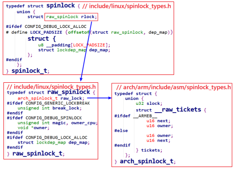
- 上述`__raw_tickets`结构体中有`owner,next`两个成员, 这是在`SMP系统中`实现spinlock的关键.

### 1.5.2 spinlock在UP系统中的实现

对于“自旋锁”，它的本意是：如果还没获得锁，我就原地打转等待。等待谁释放锁？

- ① 其他CPU
- ② 其他进程/线程

对于单CPU系统, 没有"其他CPU"; 如果内核`不支持preempt`, 当前在内核态执行的线程也不可能被其他线程抢占, 也就"没有其他进程/线程". 所以, 对于不支持preempt的单CPU系统, spin_lock是空函数, 不需要做其他事情.

如果单CPU系统的内核`支持preempt`, 即当前线程正在执行内核态函数时, 它是有可能被别的线程抢占的. 这时`spin_lock`的实现就是调用"`preempt_disable()`": 你想抢我, 我干脆禁止你运行.

- 在UP系统中, spin_lock函数定义如下:

- 
    - 从以上代码可知, 在UP系统中spin_lock()就退化为`preempt_disable()`, 如果用的内核`不支持preempt`, 那么spin_lock()什么事都不用做.

- 对于`spin_lock_irq()`, 在UP系统中就退化为`local_irq_disable()`和`preempt_disable()`, 如下图所示: 
    - 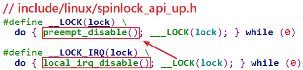
    - 假设程序A要访问临界资源, 可能会有`中断`也来访问临界资源, 可能会有程序B也来访问临界资源, 那么使用`spin_lock_irq()`来保护临界资源: 先禁止中断防止中断来抢, 再禁止`preempt`防止其他进程来抢.
- 对于`spin_lock_bh()`, 在UP系统中就退化为`禁止软件中断`和`preempt_disable()`, 如下图所示: 
    - 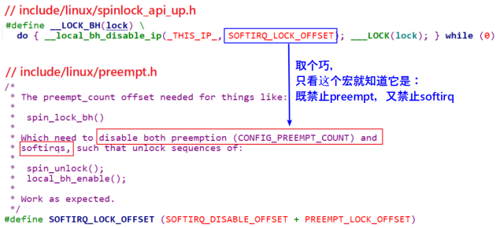
- 对于spin_lock_irqsave, 它跟spin_lock_irq类似, 只不过它是先保存中断状态再禁止中断, 如下:
    - 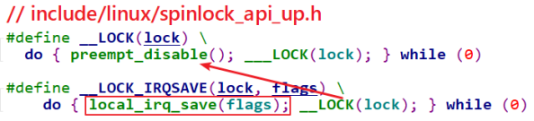

### 1.5.3 spinlock在SMP系统中的实现

要让多CPU中只能有一个获得临界资源, 使用原子变量就可以实现. 但是还要保证公平, 先到先得. 比如有CPU0, CPU1, CPU2都调用spin_lock想获得临界资源, 谁先申请谁先获得.

要想理解SMP系统中spinlock的实现, 得举一个例子. 参考这篇文章:
- Linux内核同步机制之(四): spin lock
    - http://www.wowotech.net/kernel_synchronization/spinlock.html

借用这篇文章的例子讲解, 餐厅里只有一个座位, 去吃饭的人都得先取号, 等叫号. 注意, 有2个动作: 顾客从取号机取号, 电子叫号牌叫号.

- ① 一开始取号机待取号码为0
- ② 顾客A从取号机得到号码0，电子叫号牌显示0，顾客A上座；
    - 取号机显示下一个待取号码为1。
- ③ 顾客B从取号机得到号码1，电子叫号牌还显示为0，顾客B等待；
    - 取号机显示下一个待取号码为2。
- ④ 顾客C从取号机得到号码2，电子叫号牌还显示为0，顾客C等待；
    - 取号机显示下一个待取号码为3。
- ⑤ 顾客A吃完离座，电子叫号牌显示为1，顾客B的号码等于1，他上座；
- ⑥ 顾客B吃完离座，电子叫号牌显示为2，顾客C的号码等于2，他上座；

在这个例子中有2个号码: 取号机显示的"下一个号码", 顾客取号后它会自动加1; 电子叫号牌显示"当前号码", 顾客离座后它会自动加1. 某个客户手上拿到的号码等于电子叫号牌的号码时, 该客户上座.

在这个过程中, 即使顾客B, C同时到店, 只要保证他们从取号机上得到的号码不同, 他们就不会打架.

所以, `关键点`在于: 取号机的号码发放, 必须互斥, 保证客户的号码互不相同. 而电子叫号牌上号码的变动不需要保护, 只有顾客离开后它才会变化, 没人争抢它.

- 在ARMv6及以上的ARM架构中, 支持SMP系统. 它的`spinlock结构体`定义如下:
    - 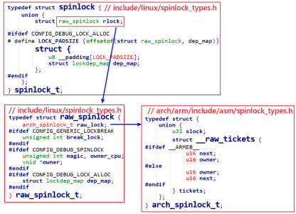
    
    - owner就相当于电子叫号牌, 现在谁在吃饭. next就当于取号机, 下一个号码是什么. 每一个CPU从取号机上取到的号码保存在spin_lock函数中的局部变量里.

- spin_lock函数调用关系如下, 核心是`arch_spin_lock`:
    - 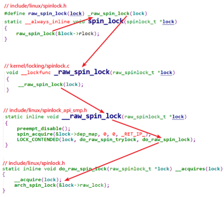

- arch_spin_lock代码如下: 
    - 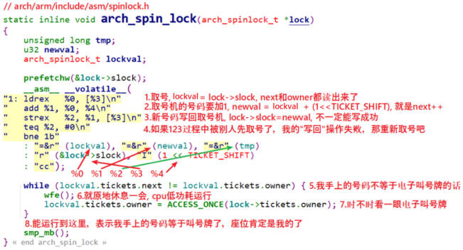

- 图中的注释把原理讲得非常清楚了, 即使不同的个体去同时取号, 也可以保证取到的号码各不相同.
- 假设第1个程序取到了号码, 它访问了临界资源后, 调用spin_unlock, 代码如下:
    - 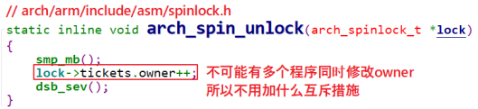
- 假如有其他程序正在spin_lock函数中循环等待, 它就会立刻判断自己手上的next是否等于`lock->tickets.owner`, 如果相等就表示输到它获得了锁.

- 深入分析`_linux_spinlock_`实现机制
    - https://blog.csdn.net/electrombile/article/details/51289813
- 深入分析Linux自旋锁
    - http://blog.chinaunix.net/uid-20543672-id-3252604.html
- Linux内核同步机制之(四): spin lock
    - http://www.wowotech.net/kernel_synchronization/spinlock.html

## 1.6 信号量semaphore的实现

### 1.6.1 semaphore的内核结构体

***注意***: 这是信号量, 不是信号. 在前面学习异步通知时, 驱动程序给应用程序发信号. 现在我们讲的信号量是一种同步, 互斥机制.

信号量的定义及操作函数都在Linux内核文件`include/linux/semaphore.h`中定义, 如下:

- 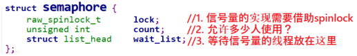
- 初始化semaphore之后, 就可以使用down函数或其他衍生版本来获取信号量, 使用up函数释放信号量. 我们只分析down, up函数的实现

### 1.6.2 down函数的实现

如果semaphore中的count大于0, 那么down函数就可以获得信号量; 否则就休眠. 在读取, 修改count时, 要使用spinlock来实现互斥.

休眠时, 要把当前进程放在semaphore的wait_list链表中, 别的进程释放信号量时去wait_list中把进程取出, 唤醒.

代码如下:
- 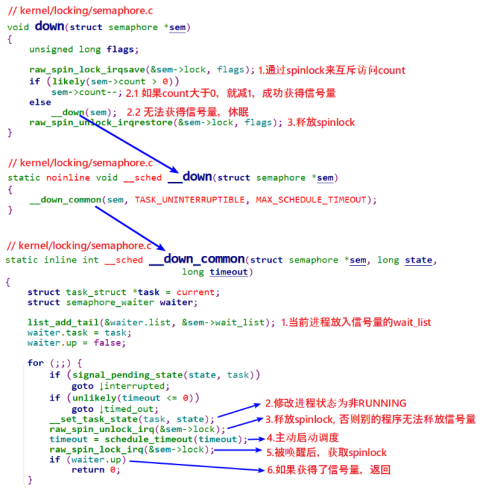

### 1.6.3 up函数的实现

如果有其他进程在等待信号量, 则count值无需调整, 直接取出第1个等待信号量的进程, 把信号量给它, 共把它唤醒.

如果没有其他进程在等待信号量, 则调整count

整个过程需要使用spinlock来保护, 代码如下:
- 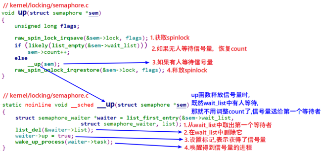

## 1.7 互斥量mutex的实现

### 1.7.1 mutex的内核结构体

mutex的定义及操作函数都在Linux内核文件`include/linux/mutex.h`中定义, 如下:
- 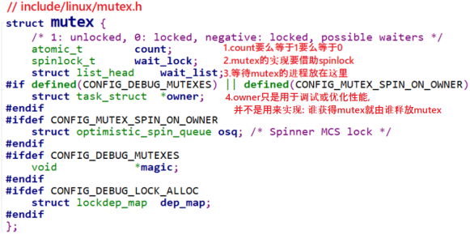

初始化mutex之后, 就可以使用mutex_lock函数或其他衍生版本来获取信号量, 使用mutex_unlock函数释放信号量. 我们只分析mutex_lock, mutex_unlock函数的实现。

### 1.7.2 mutex_lock函数的实现

> `fastpath`

mutex的设计非常精巧, 比semaphore复杂, 但是更高效.

首先要知道mutex的操作函数中有fastpath, slowpath两条路径(快速, 慢速): 如果fastpath成功, 就不必使用slowpath.

怎么理解?

这需要把mutex中的count值再扩展一下, 之前说它只有1, 0两个取值, 1表示unlocked, 0表示locked, 还有一类值"负数"表示"locked, 并且可能有其他程序在等待".

代码如下:

- 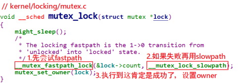
- 先看看`fastpath`的函数: `__mutex_fastpath_lock`, 这个函数在下面2个文件中都有定义:
```shell
include/asm-generic/mutex-xchg.h
include/asm-generic/mutex-dec.h
```

使用哪一个文件呢? 看看`arch/arm/include/asm/mutex.h`, 内容如下:

```c
#if __LINUX_ARM_ARCH__ < 6
#include <asm-generic/mutex-xchg.h>
#else
#include <asm-generic/mutex-dec.h>
#endif
```

- 所以, 对于ARMv6以下的架构, 使用`include/asm-generic/mutex-xchg.h`中的`__mutex_fastpath_lock`函数;
- 对于`ARMv6及以上`的架构, 使用`include/asm-generic/mutex-dec.h`中的`__mutex_fastpath_lock`函数. 这2个文件中的`__mutex_fastpath_lock`函数是类似的, `mutex-dec.h`中的代码如下
    - 
    - 大部分情况下, mutex当前值都是1, 所以通过`fastpath`函数可以非常快速地获得mutex.


> `slowpath`

如果mutex当前值是0或负数, 则需要调用`__mutex_lock_slowpath`慢慢处理: 可能会休眠等待

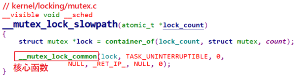

`__mutex_lock_common`函数也是在内核文件`kernel/locking/mutex.c`中实现的, 下面分段讲解.

- ① 分析第一段代码: 
    - 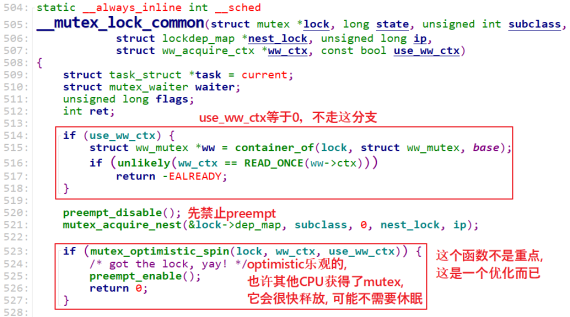
- ② 分析第二段代码: 
    - 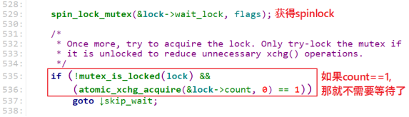
- ③ 分析第三段代码: 
    - 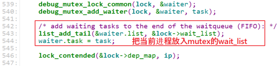
    - 这个wait_list是`FIFO(Firt In Firs Out)`, 谁先排队, 谁就可以先得到mutex.
- ④ 分析第四段代码: for循环, 这是重点
    - 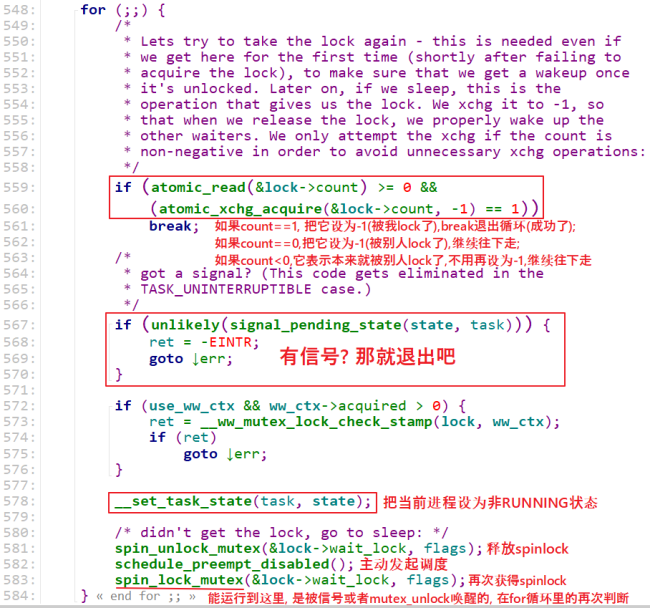
- ⑤ 分析第五段代码: 收尾工作
    - 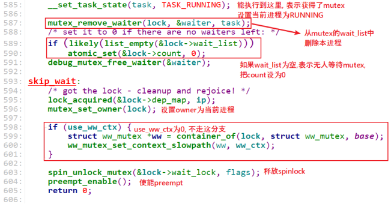

### 1.7.3 mutex_unlock函数的实现

`mutex_unlock`函数中也有`fastpath, slowpath`两条路径(快速, 慢速): 如果fastpath成功, 就不必使用slowpath.

代码如下:

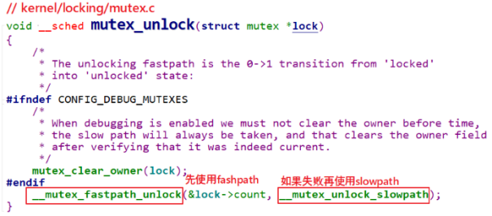

> `fastpath`

先看看`fastpath`的函数:`__mutex_fastpath_lock`, 这个函数在下面2个文件中都有定义:

```shell
include/asm-generic/mutex-xchg.h
include/asm-generic/mutex-dec.h
```

使用哪一个文件呢? 看看`arch/arm/include/asm/mutex.h`, 内容如下:

```c
#if __LINUX_ARM_ARCH__ < 6
#include <asm-generic/mutex-xchg.h>
#else
#include <asm-generic/mutex-dec.h>
#endif
```

所以, 对于`ARMv6以下`的架构, 使用`include/asm-generic/mutex-xchg.h`中的`__mutex_fastpath_unlock`函数; 

对于`ARMv6及以上`的架构, 使用`include/asm-generic/mutex-dec.h`中的`__mutex_fastpath_unlock`函数. 这2个文件中的`__mutex_fastpath_unlock`函数是类似的, `mutex-dec.h`中的代码如下:

- 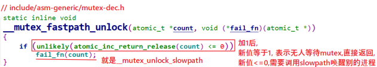
    - 大部分情况下, 加1后mutex的值都是1, 表示无人等待mutex, 所以通过`fastpath`函数直接增加mutex的count值为1就可以了.
    - 如果mutex的值加1后还是小于等于0, 就表示有人在等待mutex, 需要去wait_list把它取出唤醒, 这需要用到`slowpath`的函数:`__mutex_unlock_slowpath`.


> `slowpath`

如果mutex当前值是0或负数, 则需要调用`__mutex_unlock_slowpath`慢慢处理: 需要唤醒其他进程.

- 

`__mutex_unlock_common_slowpath`函数代码如下, 主要工作就是从wait_list中取出并唤醒第1个进程: 

- 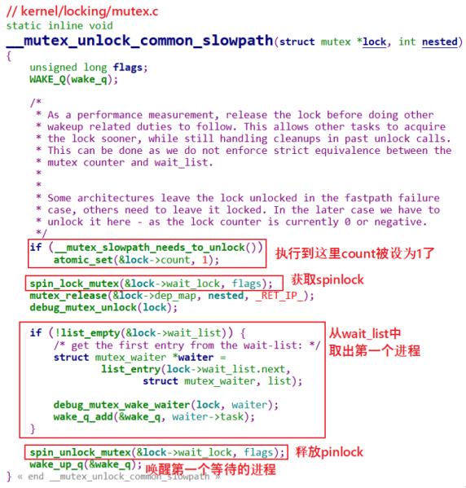

