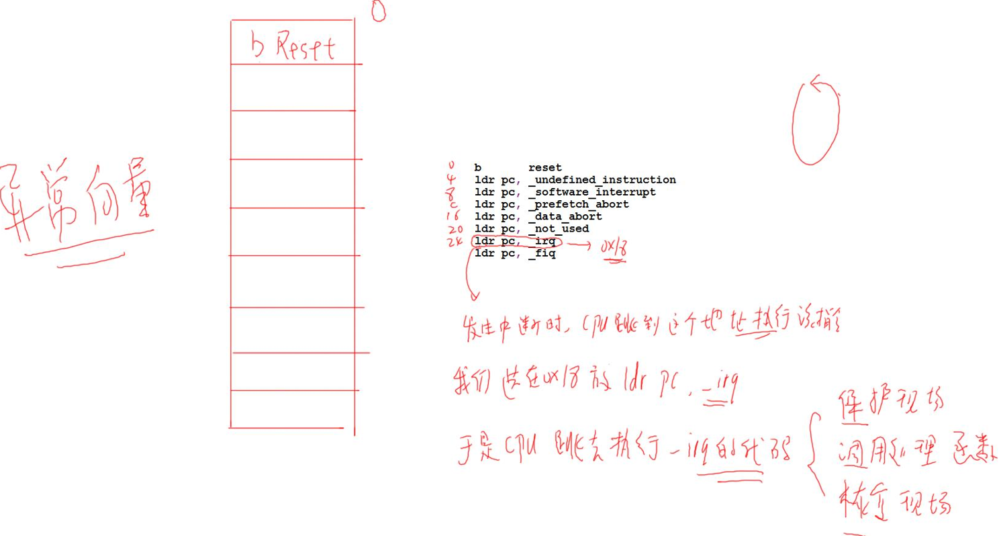
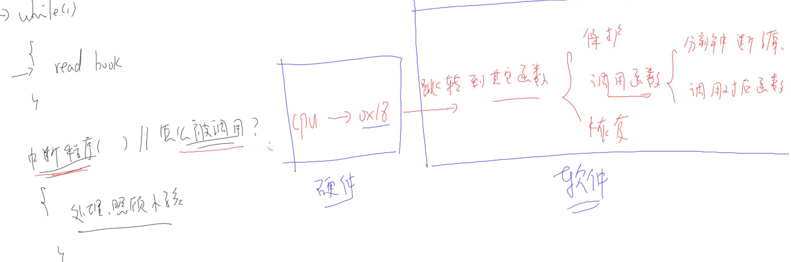

# 异常与中断的概念及处理流程

## 中断的引入

### 妈妈怎么知道孩子醒了

妈妈怎么知道卧室里小孩醒了？

- ① 查询方式：时不时进房间看一下
    - 简单，但是累
- ② 休眠-唤醒：进去房间陪小孩一起睡觉，小孩醒了会吵醒她
    - 不累，但是妈妈干不了活了
- ③ poll 方式：妈妈要干很多活，但是可以陪小孩睡一会，定个闹钟
    - 要浪费点时间，但是可以继续干活。
    - 妈妈要么是被小孩吵醒，要么是被闹钟吵醒。
- ④ 异步通知：妈妈在客厅干活，小孩醒了他会自己走出房门告诉妈妈
    - 妈妈、小孩互不耽误。
- 后面的 3 种方式，都需要“小孩来中断妈妈”：中断她的睡眠、中断她的工作。
- 实际上，能“中断”妈妈的事情可多了：
    - ① 有蜘蛛掉下来了：赶紧跑啊，救命
    - ② 可忽略的远处猫叫: 这可以被忽略
    - ③ 门铃、小孩哭声: 妈妈的应对措施不一样
    - ④ 身体不舒服：那要赶紧休息

妈妈当前正在看书, 被这些事件“中断”后她会怎么做？流程如下：

- ① 妈妈正在看书
- ② 发生了各种声音
    - 可忽略的远处猫叫
    - 快递员按门铃
    - 卧室中小孩哭了
- ③ 妈妈怎么办？
    - 第1步 先在书中放入书签，合上书
    - 第2步 去处理，对于不同的情况，处理方法不同：
        - 对于门铃：开门取快递
        - 对于哭声：照顾小孩
    - 第3步 回来继续看书

### 嵌入系统中也有类似的情况

中断与异常: 

- 

CPU 在运行的过程中，也会被各种“异常”打断。这些“异常”有：

- ① 指令未定义
- ② 指令、数据访问有问题
- ③ SWI(软中断)
- ④ 快中断
- ⑤ 中断

中断也属于一种“异常”，导致中断发生的情况有很多，比如：

-  按键
-  定时器
-  ADC 转换完成
-  UART 发送完数据, 收到数据
-  等等

这些众多的“中断源”, 汇集到“中断控制器”, 由“中断控制器”选择优先级最高的中断并通知 CPU.

## 中断的处理流程

ARM 对异常(中断)处理过程：

- ① 初始化：
    - a) 设置中断源, 让它可以产生中断
    - b) 设置中断控制器(可以屏蔽某个中断, 优先级)
    - c) 设置 CPU 总开关(使能中断). 假如那个母亲睡着了, 什么声音都没反应了.
- ② 执行其他程序：正常程序
- ③ 产生中断：比如按下按键, 中断信号--->中断控制器--->CPU
- ④ CPU 每执行完一条指令都会检查有无中断/异常产生
    - CPU的 取指 间指 执行  中断 四个周期
- ⑤ CPU 发现有中断/异常产生，开始处理。
    - 对于不同的异常, `跳去不同的地址`执行程序. 
    - 这地址上, `只是一条跳转指令`, 跳去执行某个函数(地址), 这个就是`异常向量`.
- ③④⑤都是硬件做的。
- ⑥ 这些函数做什么事情？

软件做的(总的处理过程):

- a) 保存现场(各种寄存器)
- b) 处理异常(中断):分辨中断源, 再调用不同的处理函数
- c) 恢复现场

## 异常向量表

u-boot 或是 Linux 内核, 都有类似如下的代码:

```
_start: b reset
ldr pc, _undefined_instruction
ldr pc, _software_interrupt
ldr pc, _prefetch_abort
ldr pc, _data_abort
ldr pc, _not_used
ldr pc, _irq //发生中断时，CPU 跳到这个地址执行该指令 **假设地址为 0x18**
ldr pc, _fiq
```

这就是异常向量表, 每一条指令对应一种异常.

- 发生复位时, CPU 就去 执行第 1 条指令:`b reset`.
- 发生中断时, CPU 就去执行“`ldr pc, _irq`”这条指令.
- 这些指令存放的位置是固定的, 比如对于 ARM9芯片中断向量的地址是0x18.
- 当发生中断时, CPU 就强制跳去执行 0x18 处的代码.

- 在向量表里, 一般都是放置一条跳转指令, 发生该异常时, CPU 就会执行向量表中的跳转指令, 去调用更复杂的函数.

- 当然, `向量表的位置`并`不总是从0地址开始`, 很多芯片可以设置某个 `vectorbase 寄存器`, 指定向量表在其他位置, 比如设置 vector base 为 0x80000000, 指定为 DDR 的某个地址. 但是表中的各个异常向量的偏移地址, 是固定的: 复位向量偏移地址是 0, 中断是 0x18.
    - 
    - 如何调用中断处理函数:
    - 


## 参考资料

对于 ARM 的中断控制器，述语上称之为 GIC (Generic Interrupt Controller)，到目前已经更新到 v4 版本了。
各个版本的差别可以看这里：
https://developer.arm.com/ip-products/system-ip/system-
controllers/interrupt-controllers
简单地说，GIC v3/v4 用于 ARMv8 架构，即 64 位 ARM 芯片。
而 GIC v2 用于 ARMv7 和其他更低的架构。
以后在驱动大全里讲解中断时，我们再深入分析，到时会涉及单核、多核等知识。

# Linux 系统对中断的处理

## 进程, 线程, 中断的核心: 栈

中断中断，中断谁？
中断当前正在运行的进程、线程。
进程、线程是什么？内核如何切换进程、线程、中断？
要理解这些概念，必须理解栈的作用。

### ARM 处理器程序运行的过程

ARM 芯片属于精简指令集计算机(RISC: Reduced Instruction Set Computing), 它所用的指令比较简单, 有如下特点：

- ① 对内存只有读, 写指令
- ② 对于数据的运算是在 CPU 内部实现
- ③ 使用 RISC 指令的 CPU 复杂度小一点, 易于设计

比如对于 a=a+b 这样的算式，需要经过下面 4 个步骤才可以实现：

- 

细看这几个步骤，有些疑问：

- ① 读 a，那么 a 的值读出来后保存在 CPU 里面哪里？
- ② 读 b，那么 b 的值读出来后保存在 CPU 里面哪里？
- ③ a+b 的结果又保存在哪里？

我们需要深入 ARM 处理器的内部。简单概括如下，我们先忽略各种 CPU 模式(系统模式、用户模式等等)。

注意: 如果想入理解 ARM 处理器架构, 应该从裸机开始学习. 

- 

CPU 运行时, 先去取得指令, 再执行指令:

- ① 把内存 a 的值读入 CPU 寄存器 R0
- ② 把内存 b 的值读入 CPU 寄存器 R1
- ③ 把 R0, R1 累加，存入 R0
- ④ 把 R0 的值写入内存
- 寄存器里的值会被别的程序覆盖, 所以怎么保证它里面的值中断之后还会是原来的? 

### 程序被中断时, 怎么保存现场

从上图可知, CPU 内部的寄存器很重要, 如果要暂停一个程序, 中断一个程序, 就需要把这些寄存器的值保存下来: 这就称为保存现场.

保存在哪里? 内存, 这块内存就称之为栈.

程序要继续执行, 就先从栈中恢复那些 CPU 内部寄存器的值.

这个场景并不局限于中断, 下图可以概括程序 A, B 的切换过程, 其他情况是类似的:

- 

① 函数调用：

- a) 在函数 A 里调用函数 B，实际就是中断函数 A 的执行。
- b) 那么需要把函数 A 调用 B 之前瞬间的 CPU 寄存器的值，保存到栈里；
- c) 再去执行函数 B；
- d) 函数 B 返回之后，就从栈中恢复函数 A 对应的 CPU 寄存器值，继续执行。

② 中断处理

- a) 进程 A 正在执行，这时候发生了中断。
- b) CPU 强制跳到中断异常向量地址去执行，
- c) 这时就需要保存进程 A 被中断瞬间的 CPU 寄存器值，
- d) 可以保存在进程 A 的内核态栈，也可以保存在进程 A 的内核结构体中。
- e) 中断处理完毕，要继续运行进程 A 之前，恢复这些值。

③进程切换

- a) 在所谓的多任务操作系统中，我们以为多个程序是同时运行的。
- b) 如果我们能感知微秒、纳秒级的事件，可以发现操作系统时让这些程序依次执行一小段时间，进程 A 的时间用完了，就切换到进程 B。
- c) 怎么切换？
- d) 切换过程是发生在内核态里的，跟中断的处理类似。
- e) 进程 A 的被切换瞬间的 CPU 寄存器值保存在某个地方；
- f) 恢复进程 B 之前保存的 CPU 寄存器值，这样就可以运行进程 B 了。

所以，在中断处理的过程中，伴存着进程的保存现场、恢复现场。进程的调度也是使用栈来保存、恢复现场：

- 

### 进程, 线程的概念

假设我们写一个音乐播放器, 在播放音乐的同时会根据按键选择下一首歌. 把事情简化为 2 件事: 发送音频数据, 读取按键. 那可以这样写程序:

```c
int main(int argc, char **argv)
{
	int key;
	while (1)
	{
		key = read_key();
		if (key != -1)
		{
			switch (key)
			{
				case NEXT:
					select_next_music(); // 在 GUI 选中下一首歌
					break;
			}
		}
		else
		{
			send_music();
		}
	}
	return 0;
}
```

这个程序只有一条主线, 读按键, 播放音乐都是顺序执行。
无论按键是否被按下, read_key 函数必须马上返回，否则会使得后续的send_music受到阻滞导致音乐播放不流畅.
读取按键, 播放音乐能否分为两个程序进行? 可以, 但是开销太大: 读按键的程序, 要把按键通知播放音乐的程序, 进程间通信的效率没那么高.

这时可以用多线程之编程, 读取按键是一个线程, 播放音乐是另一个线程, 它们之间可以通过全局变量传递数据, 示意代码如下:

```c
int g_key;
void key_thread_fn()
{
	while (1)
	{
		g_key = read_key();
		if (g_key != -1)
		{
			switch (g_key)
			{
				case NEXT:
					select_next_music(); // 在 GUI 选中下一首歌
					break;
			}
		}
	}
}

void music_fn()
{
	while (1)
	{
		if (g_key == STOP)
			stop_music();
		else
		{
			send_music();
		}
	}
}

int main(int argc, char **argv)
{
	int key;
	create_thread(key_thread_fn);
	create_thread(music_fn);
	while (1)
	{
		sleep(10);
	}
	return 0;
}
```

这样, 按键的读取及 GUI 显示, 音乐的播放, 可以分开来, 不必混杂在一起.
按键线程可以使用阻塞方式读取按键, 无按键时是休眠的, 这可以节省 CPU资源.

音乐线程专注于音乐的播放和控制, 不用理会按键的具体读取工作. 并且这2个线程通过全局变量 g_key 传递数据, 高效而简单.

在 Linux 中: 资源分配的单位是进程, 调度的单位是线程

也就是说, 在一个进程里, 可能有多个线程, 这些线程共用打开的文件句柄, 全局变量等等.

线程在调度的时候, 也要保存这个线程的现场呀. 而且, 单个线程要保存的现场肯定比进程要少的多.

而这些线程, 之间是互相独立的, “同时运行”, 也就是说: `每一个线程, 都有自己的栈`. 如下图示:

- 
- 在保存现场的时候, 就会把CPU寄存器里的数据, 保存在此线程的栈中.

## Linux 系统对中断处理的演进

Linux 中断系统的变化并不大. 比较重要的就是引入了 `threaded irq`: 使用内核线程来处理中断.

Linux 系统中有`硬件中断`, 也有`软件中断`. 对硬件中断的处理有 2 个原则:

- 不能嵌套 (因为不断套娃, 而内核栈只有8K很有可能不够用导致内核崩溃)
- 越快越好 

参考资料：

- https://blog.csdn.net/myarrow/article/details/9287169

### Linux 对中断的扩展: 硬件中断, 软件中断

Linux 系统把中断的意义扩展了, 对于`按键中断`等`硬件产生的中断`, 称之为`"硬件中断"(hard irq)`. 每个硬件中断都有`对应的处理函数`, 比如按键中断, 网卡中断的处理函数肯定不一样.

为方便理解, 你可以先认为`对硬件中断的处理`是用数组来实现的, 数组里存放的是`函数指针`:

- 
    - 注意: 上图是简化的, Linux 中这个数组复杂多了.

当发生 A 中断时, 对应的 `irq_function_A` 函数被调用. `硬件`导致该函数被调用. 发生了硬件中断, 驱动程序可以读取信息算出其中断号, 再根据中断号调用对应的硬件中断处理函数. 这是由硬件产生的.

相对的, 还可以`人为地制造中断`: `软件中断(soft irq)`, 如下图所示:

- 
    - 注意: 上图是简化的, Linux 中这个数组复杂多了. 软件中断里的flag被置1, 就表示这个软件中断触发了, 后面要处理.

- 问题来了:

- ① 软件中断何时生产?
    - 由`软件决定`, 对于X号软件中断, 只需要把它的 flag 设置为1就表示发生了该中断.


- ② 软件中断何时处理?

    - 软件中断嘛, 并不是那么十万火急, 有空再处理它好了.

    - 什么时候有空? 不能让它一直等吧?

    - Linux 系统中, `各种硬件中断频繁发生`, 至少定时器中断每 `10ms` 发生一次, 那取个巧?

    - 在`处理完硬件中断后,再去处理软件中断`.
        - 


③ 有哪些软件中断?	

- 查内核源码 `include/linux/interrupt.h`
- 

怎么触发软件中断?最核心的函数是 `raise_softirq`, 简单地理解就是设置`softirq_veq[nr]`的标记位: 

- 

怎么设置软件中断的处理函数:

- 
- `extern void open_softirq(int nr, void (*action)(struct soft_action*));`

后面讲到的中断下半部tasklet就是使用软件中断实现的.

### 中断处理原则 1: 不能嵌套

官方资料: 中断处理不能嵌套
https://git.kernel.org/pub/scm/linux/kernel/git/torvalds/linux.git/commit/?id=e58aa3d2d0cc

中断处理函数需要调用 C 函数, 这就需要用到 `栈`.

- 中断 A 正在处理的过程中, 假设又发生了中断 B, 那么在栈里要保存 A 的现场, 然后处理 B. 
- 在处理 B 的过程中又发生了中断 C, 那么在栈里要保存 B 的现场, 然后处理C. 

如果中断嵌套突然暴发, 那么栈将越来越大, 栈终将耗尽. 导致内核崩溃.

所以, 为了防止这种情况发生, 也是为了简单化中断的处理, 在 Linux 系统上`中断无法嵌套`: 即当前中断 A 没处理完之前, 不会响应另一个中断 B(即使它的优先级更高)

### 中断处理原则 2: 越快越好

妈妈在家中照顾小孩时, 门铃响起, 她开门取快递: 这就是中断的处理. 她取个快递敢花上半天吗?不怕小孩出意外吗?

同理, 在 Linux 系统中, 中断的处理也是越快越好. 

在单芯片系统中, 假设中断处理很慢, 那应用程序在这段时间内就无法执行: 系统显得很迟顿.

在 SMP 系统中, 假设中断处理很慢, 那么正在处理这个中断的 CPU 上的其他线程也无法执行.

在中断的处理过程中, 该 CPU 是不能进行进程调度的, 所以中断的处理要越快越好, 尽早让其他中断能被处理──进程调度靠定时器中断来实现. 

在 Linux 系统中使用中断是挺简单的, 为某个中断 irq 注册中断处理函数handler, 可以使用 request_irq 函数:

- 
- 在 handler 函数中, **代码尽可能高效**.
- 但是, 处理某个中断要做的事情就是很多, 没办法加快. 比如对于按键中断, 我们需要等待几十毫秒消除机械抖动. 难道要在 handler 中等待吗? 对于计算机来说, 这可是一个段很长的时间. 
- 怎么办? 
    - 

### 要处理的事情实在太多, 拆分为: 上半部, 下半部

当一个中断要耗费很多时间来处理时, 它的坏处是: 在这段时间内, 其他中断无法被处理. 换句话说, 在这段时间内, `系统是关中断的`. 

如果某个中断就是要做那么多事, 我们能不能把它拆分成两部分: `紧急的` 跟 `不紧急的`？

在 `handler 函数`里`只做紧急的事,` 然后就重新开中断, 让系统得以正常运行; 那些不紧急的事, 以后再处理, 处理时是开中断的.

- 

`中断下半部的实现`有很多种方法, 讲 2 种主要的: `tasklet(小任务)`, `work queue(工作队列)`.

- 

### 下半部要做的事情耗时不是太长: tasklet

假设我们把中断分为上半部, 下半部. 发生中断时, 上半部下半部的代码何时, 如何被调用?

当下半部比较耗时但是能忍受, 并且它的处理比较简单时, 可以用tasklet来处理下半部. tasklet是使用软件中断来实现.

- 

写字太多, 不如贴代码, 代码一目了然:


使用流程图简化一下: 

- 

假设硬件中断A的上半部函数为`irq_top_half_A`, 下半部为`irq_bottom_half_A`.

使用情景化的分析, 才能理解上述代码的精华. 

- 一. 硬件中断 A 处理过程中, 没有其他中断发生: 
    - 一开始, `preempt_count = 0`;
    - 上述流程图①～⑨依次执行, 上半部, 下半部的代码各执行一次.

- 二. 硬件中断 A 处理过程中, 又再次发生了中断 A:
    - 一开始, preempt_count = 0;
    - 执行到第⑥时, 一开中断后, 中断 A 又再次使得 CPU 跳到中断向量表. 
    - 注意: 这时 preempt_count 等于 1, 并且中断下半部的代码并未执行.
    - CPU 又从①开始再次执行中断 A 的上半部代码：
        - 在第①步 preempt_count 等于 2;
        - 在第③步 preempt_count 等于 1;
        - 在第④步 发现 preempt_count 等于 1, 所以直接结束当前第 2 次中断的处理;

    - 注意: 重点来了, 第2次中断发生后, 打断了第一次中断的第⑦步处理. 当第2次中断处理完毕, CPU 会继续去执行第⑦步.

可以看到, 发生2次硬件中断A时, 它的上半部代码执行了2次, 但是下半部代码只执行了一次.

所以, 同一个中断的上半部, 下半部, 在执行时是多对一的关系. 

- 三. 硬件中断 A 处理过程中, 又再次发生了中断B:
    - 一开始, preempt_count = 0;
    - 执行到第⑥时, 一开中断后, 中断 B 又再次使得 CPU 跳到中断向量表. 
    - 注意: 这时 preempt_count 等于 1, 并且中断 A 下半部的代码并未执行. 
    - CPU 又从①开始再次执行中断 B 的上半部代码: 
        - 在第①步 preempt_count 等于 2;
        - 在第③步 preempt_count 等于 1;
        - 在第④步发现 preempt_count 等于 1, 所以直接结束当前第 2 次中断的处理

    - 注意: 重点来了, 第 2 次中断发生后, 打断了第一次中断 A 的第⑦步处理. 当第2 次中断 B 处理完毕, CPU 会继续去执行第⑦步.

在第⑦步里, 它会去执行中断 A 的下半部, 也会去执行中断 B 的下半部.
所以, 多个中断的下半部, 是汇集在一起处理的.

总结：

- ① 中断的处理可以分为上半部, 下半部
- ② 中断上半部, 用来处理紧急的事, 它是在`关中断的状态`下执行的
- ③ 中断下半部, 用来处理耗时的, 不那么紧急的事, 它是在`开中断的状态`下执行的
- ④ 中断下半部执行时, 有可能会被多次打断, 有可能会再次发生同一个中断
- ⑤ 中断上半部执行完后, 触发中断下半部的处理
- ⑥ 中断上半部, 下半部的执行过程中, 不能休眠: 中断休眠的话, 以后谁来调度进程啊?


- 上半部:下半部=N:1 举例, 如按键中断, 在下半部读取中断的过程中, 再次产生按键中断. 所以在下半部读取按键时 要读取所有按键, 而不是只读一个.  读完为止.
- B的上半部结束之后, 恢复的是整个软件中断的处理. 其中包含A中断和B中断 的下半部.

### 下半部要做的事情太多并且很复杂: 工作队列

在`中断下半部的执行过程`中, 虽然是开中断的, 期间可以处理各类中断. 但是毕竟整个中断的处理还没走完, 这期间 `APP 是无法执行`的. 

假设下半部要执行1, 2分钟, 在这1, 2分钟里APP都是无法响应的. 比如GUI程序, 你点一下, 半天才有反应.

这谁受得了？所以, 如果中断要做的事情实在太耗时, 那就`不能用软件中断`来做, 而应该用`内核线程`来做: 在中断上半部唤醒内核线程. `内核线程和 APP 都一样竞争执行`, APP 有机会执行, 系统不会卡顿.


`这个内核线程是系统帮我们创建的`, 一般是 `kworker 线程`, 内核中有很多这样的线程:

- 

`kworker 线程`要去`"工作队列"(work queue)`上取出一个一个`"工作"(work)`, 来执行它里面的函数.

那我们怎么使用 work, work queue 呢?

① 创建 work：

- 你得先写出一个函数, 然后用这个函数填充一个 work 结构体. 比如:
    - 

② 要执行这个函数时, 把 work 提交给 work queue 就可以了:

- 
- 上述函数会把 work 提供给系统默认的 work queue: system_wq, 它是一个队列.

③ 谁来执行 work 中的函数?

- 不用我们管, schedule_work 函数不仅仅是把 work 放入队列, 还会把kworker 线程唤醒. 此线程抢到时间运行时, 它就会从队列中取出 work, 执行里面的函数.

④ 谁把 work 提交给 work queue?

- 在中断场景中, 可以在中断上半部调用 schedule_work 函数.

总结：

- 很耗时的中断处理, 应该放到线程里去
- 可以使用 work, work queue
- 在中断上半部调用 schedule_work 函数, 触发 work 的处理
- 既然是在线程中运行, 那对应的函数可以休眠.

### 新技术: threaded irq

使用线程来处理中断, 并不是什么新鲜事. 使用 work 就可以实现, 但是需要定义 work, 调用 schedule_work, 好麻烦啊.

内核是为懒人服务的, 再杀出一个函数：

- 
    - handler 可以为空, 完全使用线程来处理中断.

你可以只提供 `thread_fn`, 系统会为这个函数创建一个`单独的内核线程`, 而不是共用kwoker线程. 发生中断时, 上半部执行完, 执行内核线程就会执行这个函数.

以前用work来线程化地处理中断, 一个worker线程只能由一个CPU执行, 多个中断的work都由同一个worker线程来处理, 在单CPU系统中也只能忍着了. 但是在SMP系统中, 明明有那么多CPU空, 你偏偏让多个中断挤在这个CPU上?

新技术threaded irq, 为每一个中断都创建一个独立的内核线程; 多个中断的独立的内核线程就可以分配到多个CPU上执行, 这提高了效率.


## Linux 中断系统中的重要数据结构

本节内容，可以从 `request_irq(include/linux/interrupt.h)`函数一路分析得到。

能弄清楚下面这个图，对 Linux 中断系统的掌握也基本到位了.


最核心的结构体是 `irq_desc`, 之前为了易于理解, 我们说在 Linux 内核中有一个中断数组, 对于每一个硬件中断, 都有一个数组项, 这个数组就是 `irq_desc 数组`.

注意: 如果内核配置了 `CONFIG_SPARSE_IRQ`, 那么它就会用`基数树(radix tree)`来代替 irq_desc 数组. SPARSE 的意思是`"稀疏"`, 假设大小为 1000 的数组中只用到 2 个数组项, 那不是浪费嘛? 所以在中断比较"稀疏"的情况下可以用基数树来代替数组. 

任何复杂的软件结构 都是为了解决实际问题. 先看看硬件上一个中断是如何发生的. 

看一个`共享中断`例子:

- 
- `网卡` (举例而已) 跟 按键 使用同一个GPIO引脚. 上图下面的 按键中断 跟 网卡中断就是`共享中断`.
- `CPU 读取GIC寄存器`确定发生的是哪一个中断(A or A'). 假设是A号中断. 对于A号中断它的来源有很多种, 假设有GPIO0, GPIO1等等, 需要继续去`读取GPIO模块中的寄存器`来判断到底发生的是哪一个GPIO中断. 
    - 如果是A'号中断, 则需要去读取其他模块的寄存器来确定发生的是什么中断.
- 假设读取GPIO寄存器, 确定发生的是B号中断. 而B号中断有可能是`按键`, 也可能是`网卡`中断. 所以需要调用`按键中断处理函数`, 来判断是不是按键中断; 也需要调用`网卡中断处理函数`, 来判断发生的是不是网卡中断.
- A号中断 和 B号中断 在上面的数组中各有一项. 看下面图.


- 中断A 和 中断B 在`struct irq_desc数组`中各有一项.
- 中断A中的`handle_irq函数`, 要去读取GPIO的寄存器, 确定GPIO中断是B号中断.
- 然后就会去调用 B号中断数组项 中的 `handle_irq`函数.
- B号中断 数组项中 有一个`struct irqaction`指针, 指向一个或多个`struct irqaction`结构体, 于是`handle_irq函数` 就可以去调用链表中的 `按键` 跟 `网卡中断处理函数`, 来判断是不是`各自的中断`. 然后唤醒内核线程, 执行内核函数. 
    - 当我们去注册 `request_irq()`时, 内核就会帮我们创建一个`irqaction结构体`, 其中放有你的 `handler函数` 跟 `thread_fn 函数`. 
    - 共享中断就会入一个链表里. 就是说 这个链表里会有按键中断处理函数, 跟 网卡中断处理函数.
- `handle_irq函数` 会执行`irqaction链表`中的所有节点的 handler 跟 thread_fn函数.
- 对于A号中断, 里面没有用户提供的处理函数. `handler_irq` 是`BSP工程师`提供的, 只要用来区分是哪个中断, 其`irqaction链表为空`. 
- 当它确定了是哪个GPIO中断, 就会去调用`对应的handle_irq函数`(也是BSP开发者提供). handle_irq就会去irqaction链表(有可能会有多项, 多项就是共享中断.)里把具体的用户提供的处理函数拿出来执行.
    - `irq_handler handler;` 对应的就是`中断的上半部`. 紧急的, 需要非常快速处理的放这里执行.
    - `irq_handler thread_fn;` 对应的就是`中断的下半部`. 不紧急的, 在这里处理. 
        - 提供这个函数, 注册中断时, 就会创建一个内核线程, `struct task_struct *thread`
        - 处理完中断上半部后, 内核就会唤醒这个内核线程, 这个内核线程有资源执行时 就会去运行用户提供的 `thread_fn`.

- 软件中断号 硬件中断号
    - 
    - `request_irq` 的第一个`参数irq`就是`软件中断号`. 根据这个`irq`就可以在`struct irq_desc数组`中作为`下标`, 找到一项, 在里面填充 `irqaction 链表`.
    - `irq 可以用宏来表示`(老版本内核). 引入设备树之后, 不再用宏了. 首先要在设备树里声明它用哪个中断. 详细可以看 下面 `irq_domain 结构体` 节.

### irq_desc 数组

`irq_desc` 结构体在 `include/linux/irqdesc.h` 中定义, 主要内容如下图: 

- 

每一个 irq_desc 数组项中都有一个函数: handle_irq, 还有一个 action链表. 要理解它们, 需要先看中断结构图:

- 

外部设备 1, 外部设备 n 共享一个 GPIO 中断 B, 多个 GPIO 中断汇聚到GIC(通用中断控制器)的 A 号中断, GIC 再去中断 CPU. 那么软件处理时就是反过来, 先读取 GIC 获得中断号 A, 再细分出 GPIO 中断 B, 最后判断是哪一个外部芯片发生了中断. 

所以, 中断的处理函数来源有三: 

- ① GIC 的处理函数: 
    - 假设 `irq_desc[A].handle_irq` 是 XXX_gpio_irq_handler(XXX 指厂家), 这个函数需要读取芯片的 GPIO 控制器, 细分发生的是哪一个 GPIO 中断(假设是B), 再去调用 `irq_desc[B].handle_irq`. 
    - 注意: `irq_desc[A].handle_irq`细分出中断后B, 调用对应的`irq_desc[B].handle_irq`.
    - 显然中断A是CPU感受到的顶层的中断, GIC中断CPU时, CPU读取GIC状态得到中断A.

- ② 模块的中断处理函数: 
    - 比如对于GPIO模块向GIC发出的中断B, 它的处理函数是`irq_desc[B].handle_irq`.
    - BSP 开发人员会设置对应的处理函数, 一般是 handle_level_irq 或handle_edge_irq, 从名字上看是用来处理电平触发的中断, 边沿触发的中断. 
    - 注意: 导致 GPIO 中断 B 发生的原因很多, 可能是外部设备1, 可能是外部设备n, 可能只是某一个设备, 也可能是多个设备. 所以 `irq_desc[B].handle_irq`会调用某个链表里的函数, 这些函数由外部设备提供. 这些函数自行判断该中断是否自己产生, 若是则处理. 

- ③ 外部设备提供的处理函数:
    - 这里说的"外部设备"可能是芯片, 也可能总是简单的按键. 它们的处理函数由自己驱动程序提供, 这是最熟悉这个设备的"人": 它知道如何判断设备是否发生了中断, 如何处理中断.
    - 对于共享中断, 比如 GPIO 中断 B, 它的中断来源可能有多个, 每个中断源对应一个中断处理函数. 所以`irq_desc[B]`中应该有一个链表, 存放着多个中断源的处理函数.
    - 一旦程序确定发生了 GPIO 中断 B, 那么就会从链表里把那些函数取出来, 一一执行.这个链表就是 action 链表.
- 对于我们举的这个例子来说, irq_desc 数组如下:


### irqaction 结构体

irqaction 结构体在 `include/linux/interrupt.h` 中定义, 主要内容如下图: 

- 

当调用 request_irq, request_threaded_irq 注册中断处理函数时, 内核就会构造一个 irqaction 结构体. 在里面保存 name, dev_id 等, 最重要的是 handler, thread_fn, thread.

handler 是中断处理的上半部函数, 用来处理紧急的事情. 

thread_fn 对应一个内核线程 thread, 当 handler 执行完毕, Linux 内核会唤醒对应的内核线程. 在内核线程里, 会调用 thread_fn 函数. 

- 可以提供 handler 而不提供 thread_fn, 就退化为一般的 request_irq 函数. 
- 可以不提供 handler 只提供 thread_fn, 完全由内核线程来处理中断. 
- 也可以既提供 handler 也提供 thread_fn, 这就是中断上半部, 下半部. 里面还有一个名为 sedondary 的 irqaction 结构体, 它的作用以后再分析.

在 reqeust_irq 时可以传入 dev_id, 为何需要 dev_id? 作用有 2:

- ① 中断处理函数执行时, 可以使用 dev_id
- ② 卸载中断时要传入 dev_id, 这样才能在 action 链表中根据 dev_id 找到对应项

所以在`共享中断中`**必须**提供 dev_id, 非共享中断可以不提供

### irq_data 结构体

irq_data 结构体在 include/linux/irq.h 中定义，主要内容如下图：


它就是个中转站，里面有 irq_chip 指针 irq_domain 指针，都是指向别的结构体。

比较有意思的是 irq, hwirq. 

irq 是软件中断号, hwirq 是硬件中断号. 比如上面我们举的例子, 在 GPIO 中断 B 是软件中断号, 可以找到 `irq_desc[B]`这个数组项; GPIO 里的第 x 号中断, 这就是 hwirq. 

谁来建立 irq, hwirq 之间的联系呢? 由 irq_domain 来建立. irq_domain 会把本地的 hwirq 映射为全局的 irq, 什么意思? 比如 GPIO 控制器里有第 1 号中断, UART 模块里也有第 1 号中断, 这两个“第 1 号中断”是不一样的, 它们属于不同的"域"──irq_domain.

### irq_domain 结构体

- 硬件中断号 hwirq 只有在指定了 是哪个parent 才有意义. GPIO1 跟 GPIO2 的hwirq 5 是不一样的. hwirq是属于某一个域(domain)的
- 引入 irq_domain 结构体. 它是BSP工程师提供的

irq_domain 结构体在 `include/linux/irqdomain.h` 中定义, 主要内容如下图：


当我们后面从设备树讲起, 如何在设备树中指定中断, 设备树的中断如何被转换为 irq 时, irq_domain 将会起到极大的作为. 

这里基于入门的解度简单讲讲, 在设备树中你会看到这样的属性:

```
interrupt-parent = <&gpio1>;
interrupts = <5 IRQ_TYPE_EDGE_RISING>;
```

它表示要使用 gpio1 里的第 5 号中断, hwirq 就是 5.

但是我们在驱动中会使用 `request_irq(irq,handler)` 这样的函数来注册中断, irq 是什么? 它是`软件中断号`, 它应该从`"gpio1 的第5号中断"`转换得来.

谁把 hwirq 转换为 irq? 由 gpio1 的相关数据结构, 就是 gpio1 对应的 irq_domain 结构体.

irq_domain 结构体中有一个 `irq_domain_ops` 结构体, 里面有各种操作函数, 主要是: 

- xlate : 用来解析设备树的中断属性, 提取出 hwirq, type 等信息. 比如上面图中, 把5 解析成hwirq, RISING 解析成type.
- map : 把 hwirq 转换为 irq (虚拟中断号)
- 内核在解析设备树时, 会根据interrupt-parent的值, 去找到对应的irq_domain. 使用里面的函数, 解析节点. 并且用map函数把hwirq跟irq建立映射关系. irq 会被保存在platform_device里, 然后我们就可以用request_irq来注册irq中断了, 给它提供处理函数.

- hwirq 跟 irq 的对应关系, 会保存在 `unsigned int linear_revmap[]` 这个数组里. `hwirq 作为下标`去取对应irq. 取到irq之后, 就可以把irq作为下标, 去`struct irq_desc结构体数组`中去取对应项, 然后执行里面的handle_irq函数.
    - 

### irq_chip 结构体

irq_chip 结构体在 `include/linux/irq.h` 中定义, 主要内容如下图:

- 

这个结构体跟`"chip"`即芯片相关, 里面各成员的作用在头文件中也列得很清楚, 摘录部分如下:

```
* @irq_startup: start up the interrupt (defaults to ->enable if NULL)
* @irq_shutdown: shut down the interrupt (defaults to ->disable if NULL)
* @irq_enable: enable the interrupt (defaults to chip->unmask if NULL)
* @irq_disable: disable the interrupt
* @irq_ack: start of a new interrupt
* @irq_mask: mask an interrupt source
* @irq_mask_ack: ack and mask an interrupt source
* @irq_unmask: unmask an interrupt source
* @irq_eoi: end of interrupt
```

我们在 `request_irq` 后, 并`不需要手工去使能中断`, 原因就是系统调用对应的 `irq_chip` 里的 `irq_enable` 指向的函数帮我们使能了中断. 

我们提供的中断处理函数中, 也不需要执行主芯片相关的清中断操作, 也是系统帮我们调用 `irq_chip 中`的相关函数.

但是对于外部设备相关的清中断操作, 还是需要我们自己做的, 

就像上面图里的"外部设备 1", "外部设备 n", 外设备千变万化, 内核里可没有对应的清除中断操作. 

## 在设备树中指定中断_在代码中获得中断

### 设备树里中断节点的语法

参考文档：
内核 `Documentation\devicetree\bindings\interrupt-controller\interrupts.txt`

> 1 设备树里的中断控制器


- 红线右边的中断控制器由BSP工程师来完成. 这是复杂的部分.
- 作为用户我们只需要在设备结点里指定使用哪个节点即可.

中断的硬件框图如下：

- 

在`硬件上`, “中断控制器”只有 GIC 这一个, 但是我们在`软件上`也可以把上图中的“GPIO”称为“中断控制器”. 很多芯片有多个 GPIO 模块, 比如 GPIO1, GPIO2 等等. 所以软件上的“中断控制器”就有很多个: GIC, GPIO1, GPIO2 等等.

GPIO1, GPIO2 连接到 GIC，所以 GPIO1, GPIO2的父亲是 GIC。

假设 GPIO1 有 32 个中断源, 但是它把其中的 16 个汇聚起来向 GIC 发出一个中断, 把另外 16 个汇聚起来向 GIC 发出另一个中断. 这就意味着 GPIO1 会用到 GIC 的两个中断, 会涉及 GIC 里的 2 个 hwirq. 

这些层级关系, 中断号(hwirq), 都会在设备树中有所体现. 

中断控制器在设备树中如下描述:

- 在设备树中, 中断控制器节点中必须有一个属性: `interrupt-controller;`, 表明它是“中断控制器”.
- 中断控制器也必须有对应的驱动程序, 就要有 `compatible` 属性.
- 还必须有一个属性: `#interrupt-cells=<num>`, 表明别人要使用这个中断控制器中的某一个中断的话需要多少个 cell来描述这个中断.

`#interrupt-cells` 的值一般有如下取值:

- `#interrupt-cells=<1>`
    - 别的节点要使用这个中断控制器时, 只需要一个 cell 来表明使用“哪一个中断”。
- `#interrupt-cells=<2>`
    - 别的节点要使用这个中断控制器时, 需要一个 cell 来表明使用“哪一个中断”;
    - 还需要另一个 cell 来描述中断, 一般是表明`触发类型`:

```
第 2 个 cell 的 bits[3:0] 用来表示中断触发类型(trigger type and level flags):
1 = low-to-high edge triggered,上升沿触发
2 = high-to-low edge triggered,下降沿触发
4 = active high level-sensitive,高电平触发
8 = active low level-sensitive,低电平触发
```

示例如下：

```
vic: intc@10140000 {
	compatible = "arm,versatile-vic";
	interrupt-controller;
	#interrupt-cells = <1>;
	reg = <0x10140000 0x1000>;
};
```

如果中断控制器有`级联关系`, `下级`的中断控制器还需要表明它的“`interrupt-parent`”是谁, 用了interrupt-parent”中的哪一个“`interrupts`”, 请看下一小节.

> 2 设备树里使用中断

一个外设, 它的中断信号接到哪个"中断控制器"的哪个"中断引脚", 这个中断的触发方式是怎样的?

这 3 个问题, 在设备树里使用中断时, 都要有所体现.

- `interrupt-parent=<&XXXX>`
    - 你要用哪一个中断控制器里的中断?
- `interrupts`
    - 你要用哪一个中断?

Interrupts 里要用几个 cell, 由 `interrupt-parent` 对应的中断控制器决定. 在中断控制器里有"#interrupt-cells"属性, 它指明了要用几个 cell来描述中断.

比如：

```
i2c@7000c000 {
	gpioext: gpio-adnp@41 {
		compatible = "ad,gpio-adnp";
		interrupt-parent = <&gpio>;
		interrupts = <160 1>;
		gpio-controller;
		#gpio-cells = <1>;
		interrupt-controller;
		#interrupt-cells = <2>;
	};
	......
};
```

- 新写法: `interrupts-extended`
    - 一个"interrupts-extended"属性就可以既指定"interrupt-parent", 也指定“interrupts”, 比如: `interrupts-extended = <&intc1 5 1>, <&intc2 1 0>;`


### 设备树里中断节点的示例

以 100ASK_IMX6ULL 开发板为例，在 arch/arm/boot/dts 目录下可以看到2 个文件: `imx6ull.dtsi`, `100ask_imx6ull-14x14.dts`，把里面有关中断的部分内容抽取出来。


- 89号中断 通用的电源控制器 
- GPIO1 没有指定父亲, 就会`继承父节点的属性`, gpc, 其父不是顶层gic.
    - 66号中断 是 GPIO1 中0到15号引脚 发出的中断. 
    - 67号中断 是 GPIO1 中16到32号引脚 发出的中断.
    - 
- 使用
    - gpio1 中的第1个引脚, 上升沿触发
    - 如果想上升沿触发跟下降沿触发, 就可以把第2个cell改为3.

- 从设备树反推 IMX6ULL 的中断体系，如下，比之前的框图多了一个“GPC INTC”：

    - 

    - GPC INTC的英文是: General Power Controller, Interrupt Controller. 它提供中断屏蔽, 中断状态查询功能, 实际上这些功能在 GIC 里也实现了, 个人觉得有点多余. 除此之外, 它还提供唤醒功能, 这才是保留它的原因.

- 为什么要`使用3个cell`表示 (GIC数据手册)


- SPI: 共享外设中断. 对于多核处理器SoC, 一个设备发出的中断可以到达 CPU0, 也可以发给CPU1等其他core核心.
- PPI: 私有的外设中断. 某一个设备发出的中断只能到达`指定处理器`, 不能到达其他处理器.
- SGI: 用于`CPU核之间`的通信. CPU0 要通知 CPU1 就可以向它发出一个SGI中断.
- 如何使用GIC中的某一个中断:
    - 首先`指定类别`: PPI SPI SGI 三选一
    - 然后`指定`是以上三类中断里面的哪一个`中断`
    - 最后`指定触发类型`, 是边沿触发 还是电平触发.
    - 

### 在代码中获得中断

之前我们提到过, 设备树中的节点有些能被转换为内核里的 `platform_device`, 有些不能, 回顾如下:

- ① 根节点下含有 `compatible` 属性的子节点，会转换为 `platform_device`
- ② 含有特定 `compatible` 属性的节点的子节点，会转换为 platform_device
    - 如果一个节点的 compatible 属性，它的值是这 4 者之一："simple-bus","simple-mfd","isa","arm,amba-bus", 那么它的子结点(需含 compatible 属性)也可以转换为 platform_device。
- ③ 总线 I2C、SPI 节点下的子节点：不转换为 platform_device
    - 某个总线下到子节点，应该交给对应的总线驱动程序来处理, 它们不应该被转换为 platform_device。

>1 对于 platform_device

一个节点能被转换为 platform_device, 如果它的设备树里指定了中断属性, 那么可以从 platform_device 中获得`"中断资源"`, 函数如下, 可以使用下列函数获得 `IORESOURCE_IRQ` 资源, 即中断号:

```c
/**
* platform_get_resource - get a resource for a device
* @dev: platform device
* @type: resource type // 取哪类资源? IORESOURCE_MEM, IORESOURCE_REG
* // IORESOURCE_IRQ 等
* @num: resource index // 这类资源中的哪一个?
*/
struct resource *platform_get_resource(struct platform_device *dev,
										unsigned int type,
										unsigned int num);
```

>2 对于 I2C 设备 SPI 设备

对于 I2C 设备节点, I2C 总线驱动在处理设备树里的 I2C 子节点时, 也会`处理其中的中断信息`. 一个 I2C 设备会被转换为一个 i2c_client 结构体, `中断号会保存在 i2c_client 的 irq 成员里`, 代码如下(`drivers/i2c/i2c-core.c`):

- 

对于 SPI 设备节点, SPI 总线驱动在处理设备树里的 SPI 子节点时, 也会`处理其中的中断信息`. 一个 SPI 设备会被转换为一个 spi_device 结构体, `中断号会保存在 spi_device 的 irq 成员`里，代码如下(`drivers/spi/spi.c`):

- 

>3 调用 of_irq_get 获得中断号

如果你的设备节点既不能转换为 `platform_device`, 它也不是 I2C 设备, 不是 SPI 设备, 那么在驱动程序中可以自行调用 `of_irq_get` 函数去解析设备树, 得到中断号

>4 对于 GPIO

参考：`drivers/input/keyboard/gpio_keys.c`

可以使用 `gpio_to_irq` 或 `gpiod_to_irq` 获得中断号.

举例, 假设在设备树中有如下节点: 

```
gpio-keys {
	compatible = "gpio-keys";
	pinctrl-names = "default";
	user {
		label = "User Button";
		gpios = <&gpio5 1 GPIO_ACTIVE_HIGH>;
		gpio-key,wakeup;
		linux,code = <KEY_1>;
	};
};
```

那么可以使用下面的函数获得引脚和 flag：

```c
button->gpio = of_get_gpio_flags(pp, 0, &flags);
bdata->gpiod = gpio_to_desc(button->gpio);
```

再去使用 gpiod_to_irq 获得中断号：

```c
irq = gpiod_to_irq(bdata->gpiod);
```

## 编写使用中断的按键驱动程序

写在前面的话: 对于 GPIO 按键, 我们并不需要去写驱动程序, 使用内核自带的驱动程序 `drivers/input/keyboard/gpio_keys.c` 就可以, 然后你需要做的只是修改设备树指定引脚及键值. 

但是还是要了解怎么从头写按键驱动, 特别是如何使用中断. 因为中断是引入其他基础知识的前提, 后面要讲的这些内容都离不开中断: 休眠-唤醒, POLL机制, 异步通知, 定时器, 中断的线程化处理.

这些基础知识是更复杂的驱动程序的基础要素, 以后的复杂驱动也就是对硬件操作的封装彼此不同, 但是用到的基础编程知识是一样的.

### 编程思路

> 1 设备树相关

查看原理图确定按键使用的引脚，再在设备树中添加节点，在节点里指定中断信息。

例子：

```
gpio_keys_100ask {
	compatible = "100ask,gpio_key";
	gpios = <&gpio5 1 GPIO_ACTIVE_HIGH
	&gpio4 14 GPIO_ACTIVE_HIGH>;
	pinctrl-names = "default";
	pinctrl-0 = <&key1_pinctrl &key2_pinctrl>;
};
```

- GPIO比较特殊, 不需要在设备树里指定中断信息. GPIO子系统有接口可以算出中断号.
- 这个代码不涉及具体的板子, 只要内核支持GPIO子系统就可以用.

> 2 驱动代码相关

- 首先要获得中断号, 参考上面; 先获取GPIO资源, 然后获取中断号.
- 然后编写中断处理函数;
- 最后 `request_irq`.

### 先编写驱动程序

参考：内核源码 `drivers/input/keyboard/gpio_keys.c`

- 1 从设备树获得 GPIO

```c
count = of_gpio_count(node);
for (i = 0; i < count; i++)
	gpio_keys_100ask[i].gpio = of_get_gpio_flags(node, i, &flag);
```

- 2 从 GPIO 获得中断号

```c
gpio_keys_100ask[i].irq = gpio_to_irq(gpio_keys_100ask[i].gpio);
```

- 3 申请中断

```c
err = request_irq(gpio_keys_100ask[i].irq, gpio_key_isr, \
				  IRQF_TRIGGER_RISING | IRQF_TRIGGER_FALLING, "100ask_gpio_key", &gpio_keys_100ask[i]);
```

- 4 中断函数

```c
static irqreturn_t gpio_key_isr(int irq, void *dev_id)
{
	struct gpio_key *gpio_key = dev_id;
	int val;
	val = gpiod_get_value(gpio_key->gpiod);
	printk("key %d %d\n", gpio_key->gpio, val);
	return IRQ_HANDLED;
}
```

## IMX6ULL 设备树修改及上机实验

本实验的内核版本：

- https://e.coding.net/weidongshan/imx-linux4.9.88 
- commit6020a20c1277c6b511e5673eecd8523e376031c8

### 查看原理图确定按键引脚


### 修改设备树

对于一个引脚要用作中断时：

- a) 要通过 PinCtrl 把它设置为 GPIO 功能；
- b) 表明自身：是哪一个 GPIO 模块里的哪一个引脚
    运行 NXP 提供的图形化设备树配置工具“i.MX Pins Tool v6”, 点击左侧选中 GPIO5_IO01、GPIO4_IO14，如下图所示：
- 


主要内容摘录如下：

- GPIO5_IO01 的 pinctrl定义：

```
&iomuxc_snvs {
	pinctrl-names = "default_snvs";
	pinctrl-0 = <&pinctrl_hog_2>;
	imx6ul-evk {
	key1_100ask: key1_100ask{ /*!< Function assigned for the core: Cortex-A7[ca
	7] */
		fsl,pins = <
			MX6ULL_PAD_SNVS_TAMPER1__GPIO5_IO01 0x000110A0
		>;
	};
```

- GPIO4_IO14 的 pinctrl 定义：

```
&iomuxc {
	pinctrl-names = "default";
	pinctrl-0 = <&pinctrl_hog_1>;
	imx6ul-evk {
		key2_100ask: key2_100ask{ /*!< Function assigned for the core: Cortex-A7[ca7] */
		fsl,pins = <
			MX6UL_PAD_NAND_CE1_B__GPIO4_IO14 0x000010B0
		>;
	};
```

定义这 2 个按键的节点：

```
gpio_keys_100ask {
	compatible = "100ask,gpio_key";
	gpios = <&gpio5 1 GPIO_ACTIVE_HIGH
	&gpio4 14 GPIO_ACTIVE_LOW>;
	pinctrl-names = "default";
	pinctrl-0 = <&key1_100ask &key2_100ask>;
};
```

把原来的 GPIO 按键节点禁止掉：

```
gpio-keys {
	compatible = "gpio-keys";
	pinctrl-names = "default";
	status = "disabled"; // 这句是新加的
```

参考资料

- 中断处理不能嵌套：
    https://git.kernel.org/pub/scm/linux/kernel/git/torvalds/linux.git/commit/?id=e58aa3d2d0cc
- genirq: add threaded interrupt handler support
    https://git.kernel.org/pub/scm/linux/kernel/git/torvalds/linux.git/commit/?id=3aa551c9b4c40018f0e261a178e3d25478dc04a9
- Linux RT(2)－硬实时 Linux(RT-Preempt Patch)的中断线程化
    https://www.veryarm.com/110619.html
- Linux 中断管理 (1)Linux 中断管理机制
    https://www.cnblogs.com/arnoldlu/p/8659981.html

```shell
Breakpoint 1, gpio_keys_gpio_isr (irq=200, dev_id=0x863e6930) at drivers/input/keybo
ard/gpio_keys.c:393
393 {
(gdb) bt
#0 gpio_keys_gpio_isr (irq=200, dev_id=0x863e6930) at drivers/input/keyboard/gpio_k
eys.c:393
#1 0x80270528 in __handle_irq_event_percpu (desc=0x8616e300, flags=0x86517edc) at ke
rnel/irq/handle.c:145
#2 0x802705cc in handle_irq_event_percpu (desc=0x8616e300) at kernel/irq/handle.c:18
5
#3 0x80270640 in handle_irq_event (desc=0x8616e300) at kernel/irq/handle.c:202
#4 0x802738e8 in handle_level_irq (desc=0x8616e300) at kernel/irq/chip.c:518
#5 0x8026f7f8 in generic_handle_irq_desc (desc=<optimized out>) at ./include/linux/i
rqdesc.h:150
#6 generic_handle_irq (irq=<optimized out>) at kernel/irq/irqdesc.c:590
#7 0x805005e0 in mxc_gpio_irq_handler (port=0xc8, irq_stat=2252237104) at drivers/gp
io/gpio-mxc.c:274
#8 0x805006fc in mx3_gpio_irq_handler (desc=<optimized out>) at drivers/gpio/gpio-mx
c.c:291
#9 0x8026f7f8 in generic_handle_irq_desc (desc=<optimized out>) at ./include/linux/i
rqdesc.h:150
#10 generic_handle_irq (irq=<optimized out>) at kernel/irq/irqdesc.c:590
#11 0x8026fd0c in __handle_domain_irq (domain=0x86006000, hwirq=32, lookup=true, regs
=0x86517fb0) at kernel/irq/irqdesc.c:627
#12 0x80201484 in handle_domain_irq (regs=<optimized out>, hwirq=<optimized out>, dom
ain=<optimized out>) at ./include/linux/irqdesc.h:168
#13 gic_handle_irq (regs=0xc8) at drivers/irqchip/irq-gic.c:364
#14 0x8020b704 in __irq_usr () at arch/arm/kernel/entry-armv.S:464
```

