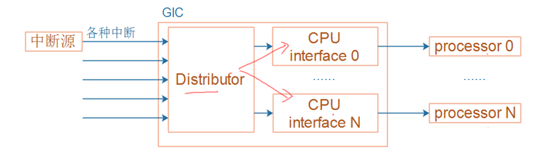
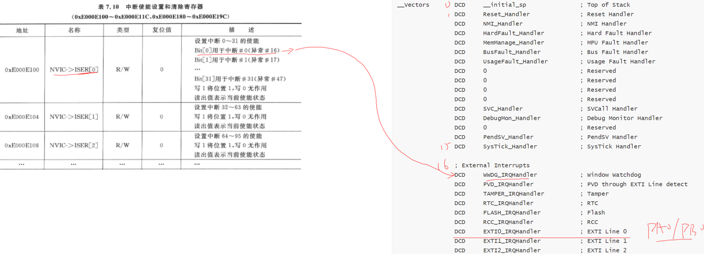
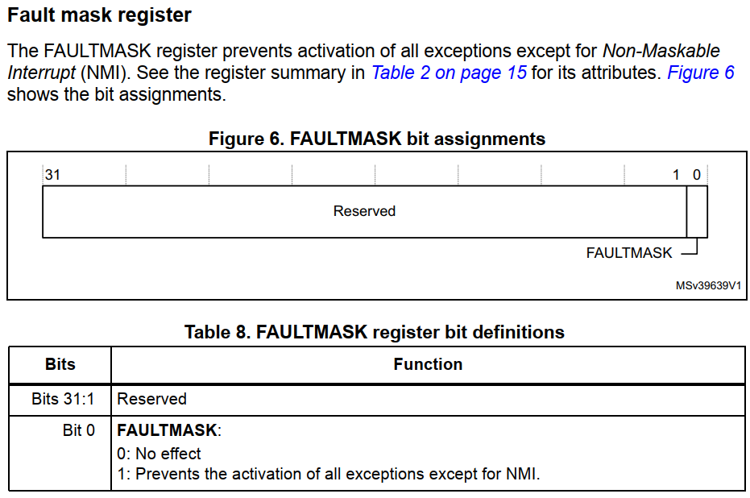
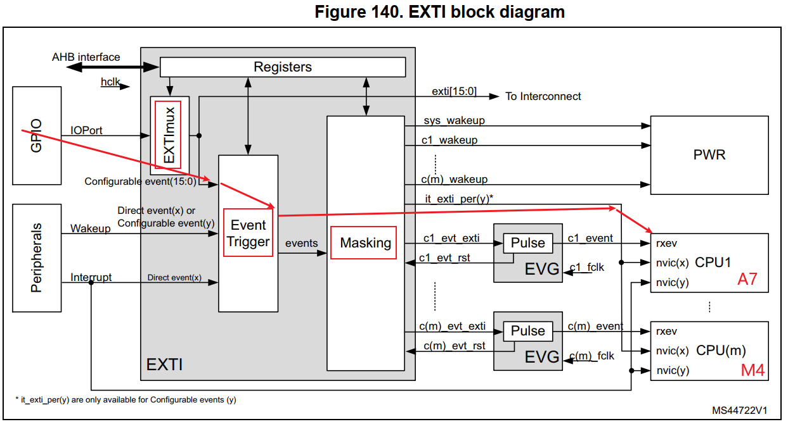
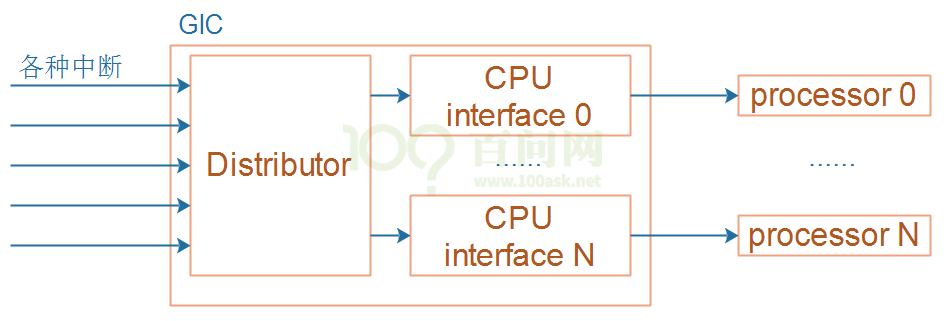
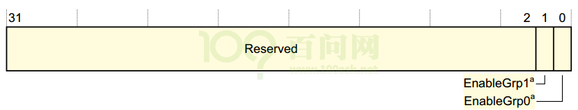
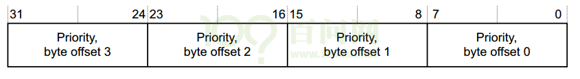
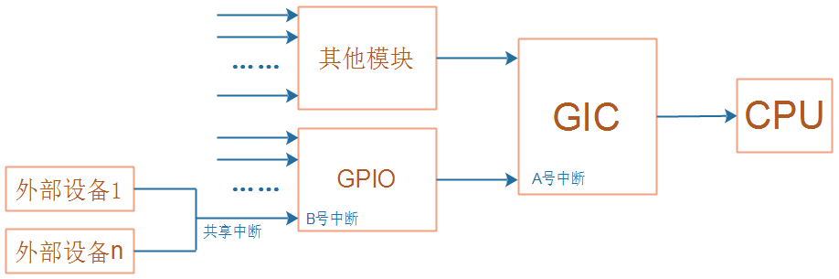
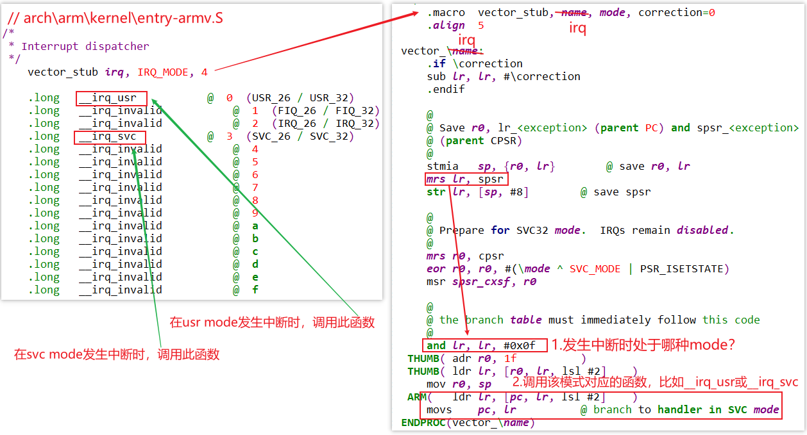
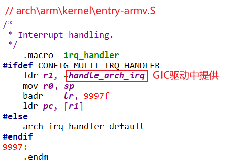

# 中断的硬件框架

这部分其实在ARM 裸机开发的部分讲过了.  在 `Driver Dev_00.md` 就有. 

## 1.1 中断路径上的3个部件

* `中断源`
  中断源多种多样, 比如GPIO, 定时器, UART, DMA等等.
  它们都有自己的寄存器, 可以进行相关设置: 使能中断, 中断状态, 中断类型等等.

* `中断控制器`
  各种中断源发出的中断信号, `汇聚到中断控制器`.
  可以在中断控制器中`设置各个中断的优先级`.
  中断控制器会`向CPU发出中断信号`, CPU可以`读取中断控制器的寄存器`, 判断当前处理的是`哪个中断`.
  中断控制器有多种实现, 比如:
  * STM32F103中被称为 NVIC: Nested Vectored Interrupt controller(`嵌套向量中断控制器`)
  * ARM9中一般是芯片厂家自己实现的, 没有统一标准
  * Cortex A7中使用`GIC`(Generic Interrupt Controller)

* `CPU`
  CPU每执行完一条指令, 都会判断一下是否有中断发生了.
  CPU也有`自己的寄存器`, 可以设置它来`使能/禁止中断`, 这是`中断处理的总开关`.

- 

## 1.2 STM32F103的GPIO中断

参考资料：`STM32F103数据手册.pdf`、`ARM Cortex-M3与Cortex-M4权威指南.pdf`、`PM0056.pdf`

对于GPIO中断，STM32F103又引入了`External interrupt/event controller (EXTI)`。
用来设置GPIO的中断类型，如下图：

- 
- 
- 

EXTI可以给NVIC提供16个中断信号：EXTI0~EXTI15。
那么某个EXTIx，它来自哪些GPIO呢？这需要设置GPIO控制器。

### 1.2.1 GPIO控制器

STM32F103的`GPIO控制器中`有 `AFIO_EXTICR1 ~ AFIO_EXTICR4` 一共4个寄存器
名为：External interrupt configuration register, 外部中断配置寄存器。(157的GPIO里就没有中断控制器)
用来选择某个外部中断EXTIx的中断源，示例如下：

- 

    - **注意**：从上图可知, EXTI0只能从PA0, ……, PG0中选择一个, 这也意味着PA0, ……, PG0中只有一个引脚可以用于中断. 这跟其他芯片不一样, 很多芯片的任一GPIO引脚都可以同时用于中断.
    - EXTI1 只能从PA1, ......, PG1里选一个引脚用于中断.

    - 


### 1.2.2 EXTI

在GPIO控制器中，可以设置某个GPIO引脚作为中断源，给EXTI提供中断信号。
但是，这个中断的触发方式是怎样的？高电平触发、低电平触发、上升沿触发、下降沿触发？
这需要进一步设置。
EXTI框图如下：

- 

沿着上面框图中的红线，我们要设置：

* Falling trigger selection register：是否选择`下降沿触发`
* Rising trigger selection register：是否选择`上升沿触发`
* Interrupt mask register：是否`屏蔽中断`

当发生中断时，可以读取下列寄存器判断是否发生了中断、发生了哪个中断：

* Pending reqeust register

要使用EXTI，流程如下：


- 

翻译如下：

* 配置EXTI_IMR：允许EXTI发出中断
* 配置EXTI_RTSR、EXTI_FTSR，选择中断触发方式
* 配置NVIC中的寄存器，允许NVIC把中断发给CPU

### 1.2.3 NVIC

多个中断源汇聚到NVIC，NVIC的职责就是从多个中断源中`取出优先级最高的中断`，向CPU发出中断信号。
处理中断时，程序可以写NVIC的寄存器，清除中断。
涉及的寄存器：

- 

我们暂时只需要关注：ISER(中断设置使能寄存器)、ICPR(中断清除挂起寄存器)。
要注意的是，这些寄存器有很多个，比如ISER0、ISER1等等。里面的每一位对应一个中断。
ISER0中的bit0对应异常向量表中的第16项(向量表从第0项开始)，如下图：

- 
- 

### 1.2.4 CPU

cortex M3/M4处理器内部有这几个寄存器：

#### 1. PRIMASK


  把PRIMASK的bit0设置为1，就可以屏蔽所有**优先级可配置**的中断。
  可以使用这些指令来设置它：

  ```
  CPSIE I  ; 清除PRIMASK，使能中断
  CPSID I  ; 设置PRIMASK，禁止中断
  
  或者：
  MOV R0, #1
  MSR  PRIMASK R0  ; 将1写入PRIMASK禁止所有中断
  
  MOV R0, #0
  MSR PRIMASK, R0  ; 将0写入PRIMASK使能所有中断
  ```


#### 2. FAULTMASK




  FAULTMASK和PRIMASK很像，它更进一步，出来一般的中断外，把HardFault都禁止了。
  只有NMI可以发生。
  可以使用这些指令来设置它：

  ```
  CPSIE F  ; 清除FAULTMASK
  CPSID F  ; 设置FAULTMASK
  
  或者：
  MOV R0, #1
  MSR  FAULTMASK R0  ; 将1写入FAULTMASK禁止中断
  
  MOV R0, #0
  MSR FAULTMASK, R0  ; 将0写入FAULTMASK使能中断
  ```


#### 3. BASEPRI


  BASEPRI用来屏蔽这些中断：它们的优先级，其值大于或等于BASEPRI。
  可以使用这些指令来设置它：

  ```
  MOVS R0, #0x60
  MSR BASEPRI, R0   ; 禁止优先级在0x60~0xFF间的中断
  
  MRS R0, BASEPRI   ; 读取BASEPRI
  
  MOVS R0, #0
  MSR BASEPRI, R0    ; 取消BASEPRI屏蔽
  ```


## 1.3 STM32MP157的GPIO中断

STM32MP157的GPIO中断在硬件上的框架，跟STM32F103是类似的。
它们的`中断控制器不一样`，STM32MP157中使用的是GIC：

- 
- 

### 1.3.1 GPIO控制器

对于STM32MP157, 除了把GPIO引脚配置为输入功能外, GPIO控制器里`没有中断相关的寄存器`。
请参考前面的课程《01_使用按键控制LED(STM32MP157)》.

### 1.3.2 EXTI

GPIO引脚可以向CPU发出中断信号，所有的GPIO引脚都可以吗？
不是的，需要在EXTI控制器中设置、选择。
GPIO引脚触发中断的方式是怎样的？高电平触发、低电平触发、上升沿触发、下降沿触发？
这需要进一步设置。
这些，都是在EXTI中配置，EXTI框图如下：



沿着红线走：

#### 1. 设置`EXTImux`

选择`哪些GPIO可以发出中断`。
只有16个EXTI中断，从EXTI0~EXTI15；每个EXTIx中断只能从PAx、PBx、……中选择某个引脚，如下图所示：


**注意**：从上图可知，EXTI0只能从PA0、……中选择一个，这也意味着PA0、……中只有一个引脚可以用于中断。这跟其他芯片不一样，很多芯片的任一GPIO引脚都可以同时用于中断。

通过EXTI_EXTICR1等寄存器来设置EXTIx的中断源是哪个GPIO引脚，入下图所示：


#### 2. 设置`Event Trigger`

设置中断触发方式：

- 

#### 3. 设置`Masking`

允许某个EXTI中断：

- 

#### 4. 查看中断状态、清中断

- 
    - 发生中断之后可以去读取`pending(待处理的)`寄存器, 看看发生了哪些中断. 
    - 处理完中断之后, 还要清除掉pending寄存器.


### 1.3.3 GIC

`ARM体系结构`定义了通用中断控制器（GIC），该控制器包括一组用于管理单核或多核系统中的中断的硬件资源。GIC提供了内存映射寄存器，可用于管理中断源和行为，以及（在多核系统中）用于将中断路由到各个CPU核。它使软件能够屏蔽，启用和禁用来自各个中断源的中断，以（在硬件中）对各个中断源进行优先级排序和生成软件触发中断。它还提供对TrustZone安全性扩展的支持。GIC接受系统级别中断的产生，并可以发信号通知给它所连接的每个内核，从而有可能导致IRQ或FIQ异常发生。

GIC比较复杂，下一个视频再详细讲解。

### 1.3.4 CPU

CPU的CPSR寄存器中有一位：I位，用来使能/禁止中断。

- 

可以使用以下汇编指令修改I位：

```
  CPSIE I  ; 清除I位，使能中断
  CPSID I  ; 设置I位，禁止中断
```

## 1.4 IMX6ULL的GPIO中断

IMX6ULL的GPIO中断在硬件上的框架，跟STM32MP157是类似的。
IMX6ULL中没有EXTI控制器，对GPIO的中断配置、控制，都在`GPIO模块内部实现`：

- 

### 1.4.1 GPIO控制器

#### 1. 配置GPIO中断

每组GPIO中都有对应的GPIOx_ICR1、GPIOx_ICR2寄存器(interrupt configuration register )。
每个引脚都可以配置为中断引脚，并配置它的触发方式：

- 

#### 2. 使能GPIO中断

- 


#### 3. 判断中断状态、清中断

- 

### 1.4.2 GIC

`ARM体系结构`定义了通用中断控制器（GIC），该控制器包括一组用于管理单核或多核系统中的中断的硬件资源。GIC提供了内存映射寄存器，可用于管理中断源和行为，以及（在多核系统中）用于将中断路由到各个CPU核。它使软件能够屏蔽，启用和禁用来自各个中断源的中断，以（在硬件中）对各个中断源进行优先级排序和生成软件触发中断。它还提供对TrustZone安全性扩展的支持。GIC接受系统级别中断的产生，并可以发信号通知给它所连接的每个内核，从而有可能导致IRQ或FIQ异常发生。

GIC比较复杂，下一个视频再详细讲解。

### 1.4.3 CPU

CPU的CPSR寄存器中有一位：I位，用来使能/禁止中断。

- 

可以使用以下汇编指令修改I位：

```
  CPSIE I  ; 清除I位，使能中断
  CPSID I  ; 设置I位，禁止中断
```

# GIC介绍与编程

参考资料：`ARM® Generic Interrupt Controller Architecture Specification Architecture version 2.0(IHI0048B_b_gic_architecture_specification_v2).pdf`

## 1.1 GIC介绍

ARM体系结构定义了`通用中断控制器（GIC）`，该控制器包括`一组用于管理单核或多核系统中的中断的硬件资源`。GIC提供了`内存映射寄存器`，可用于`管理中断源和行为`，以及（在多核系统中）用于`将中断路由到各个CPU核`。它`使软件能够屏蔽`, `启用和禁用来自各个中断源的中断`，以（在硬件中）`对各个中断源进行优先级排序和生成软件触发中断`。它还提供对`TrustZone`安全性扩展的支持。GIC`接受系统级别中断的产生`，并可以发信号`通知给它所连接的每个内核`，从而`有可能导致IRQ或FIQ异常发生`。

- **从软件角度来看，GIC具有两个主要功能模块，简单画图如下：**
    - 

- ① 分发器(Distributor)
    - `系统中的所有中断源都连接到该单元`。可以`通过仲裁单元的寄存器`来控制各个中断源的属性，例如优先级、状态、安全性、路由信息和使能状态。
    - 分发器把中断输出到“`CPU接口单元`”，后者决定`将哪个中断转发给CPU核`。

- ② CPU接口单元（CPU Interface）
    - `CPU核通过控制器的CPU接口单元接收中断`。`CPU接口单元寄存器用于屏蔽, 识别和控制 转发到CPU核的中断的状态`。系统中的每个CPU核心都有一个单独的CPU接口。
    - 中断在软件中由一个称为`中断ID的数字`标识。`中断ID唯一对应于一个中断源`。`软件`可以使用`中断ID来识别中断源`并调用相应的处理程序来处理中断。呈现给软件的中断ID`由系统设计确定`，一般在SOC的`数据手册`有记录。

**中断可以有多种不同的类型：**

- ① 软件触发中断（SGI，Software Generated Interrupt）
    - 这是由`软件`通过写入 `专用仲裁单元的寄存器` 即 `软件触发中断寄存器（ICDSGIR）`显式生成的。它最常用于 `CPU核间通信` 。SGI既可以发给所有的核，也可以发送给系统中选定的一组核心。中断号 0-15 保留用于 SGI 的中断号。用于通信的确切中断号由软件决定。 

- ② 私有外设中断（PPI，Private Peripheral Interrupt）
    - 这是由 `单个CPU核私有的外设` 生成的。PPI的中断号为 16-31 。它们`标识CPU核私有的中断源`，并且`独立于另一个内核上的相同中断源`，比如，`每个CPU核里都有的计时器`。

- ③ 共享外设中断（SPI，Shared Peripheral Interrupt）
    - 这是由外设生成的，中断控制器可以将其路由到多个核。中断号为32-1020。SPI用于从整个系统可访问的各种外围设备发出中断信号。

中断可以是边沿触发的（在中断控制器检测到相关输入的上升沿时认为中断触发，并且一直保持到清除为止）或电平触发（仅在中断控制器的相关输入为高时触发）。

- 

    - CPU某个核心的systick产生的中断, 通过GIC再返回给自己. 
    - GPIO, 串口等外设中断, 经过分发器择最高优先级的中断, 发给某个CPU接口, 再发给对应CPU核. 所以某个共享外设中断可以发给某一个, 或某几个cpu核心.  
    - CPU之间想通信, 就可以通过SGI, 触发中断, 由GIC发给目的CPU核心.
    - 0到31号中断, 各个CPU核看到的都是属于自己的, 跟别的CPU核不一样. 从32到1020号中断, 则所有CPU核看到的都是一样的.

- 下图是GIC控制器的逻辑结构：

    

    - 0到15号中断为SGI中断, 软件产生的中断
    - 16到31号中断 为PPI中断, 私有外设中断
        - 0到31号中断 是属于某一个CPU核 的, 每个CPU核 都能发出自己的0到31号中断.
    - 32到1019号中断 是共享外部中断, 所有CPU核收到的中断号一样. 32到1019是所有CPU核 都看的到的. 第0个CPU核和第1个CPU核看到的32号中断都是属于同一个设备发出的.
    - 

- **中断可以处于多种不同状态：**

① `非活动状态`（Inactive）– 这意味着该`中断未触发`。
② `挂起（Pending）`– 这意味着中断源已被触发，但正在等待CPU核处理。待处理的中断要通过转发到CPU接口单元，然后再由CPU接口单元转发到内核。
③ `活动（Active）`– 描述了一个已被内核接收并正在处理的中断。
④ `活动和挂起（Active and pending）`– 描述了一种情况，其中`CPU核正在为中断服务`，而`GIC又收到来自同一源的中断`。


`中断的优先级` 和 `可接收中断的核` 都在`分发器(distributor)` 中配置。`外设发给分发器的中断`将标记为`pending状态`（或Active and Pending状态，如触发时果状态是active）。distributor决定出可以传递给CPU核的优先级最高的pending中断，并将其转发给内核的CPU interface。通过CPU interface，该中断信号被传递给CPU核，此时CPU核将触发FIQ或IRQ异常。

作为响应，CPU核`执行异常处理程序`。异常处理程序必须`从CPU interface寄存器查询中断ID`，并开始`为中断源提供服务`。完成后，`处理程序必须写入CPU interface寄存器以报告处理结束`。然后`CPU interface准备转发`distributor发给它的下一个中断。

在`处理中断时`，中断的`状态开始为pending，active`，结束时变成`inactive`。`中断状态保存在distributor寄存器中`。

- 

### 1.1.1 配置

- GIC作为内存映射的外围设备，被软件访问。所有内核都可以访问公共的distributor单元，但是CPU interface是备份的，也就是说，每个CPU核都使用相同的地址来访问其专用CPU接口。一个CPU核不可能访问另一个CPU核的CPU接口。

**Distributor拥有许多寄存器，可以通过它们配置各个中断的属性。这些可配置属性是：**

* 中断优先级：Distributor使用它来确定接下来将哪个中断转发到CPU接口。
* 中断配置：这确定中断是对电平触发还是边沿触发。
* 中断目标：这确定了可以将中断发给哪些CPU核。
* 中断启用或禁用状态：只有Distributor中启用的那些中断变为挂起状态时，才有资格转发。
* 中断安全性：确定将中断分配给Secure还是Normal world软件.
* 中断状态。

Distributor还提供优先级屏蔽，可防止低于某个优先级的中断发送给CPU核。
每个CPU核上的CPU interface，专注于控制和处理发送给该CPU核的中断。

### 1.1.2 初始化

Distributor和CPU interface在复位时均被禁用。复位后，必须初始化GIC，才能将中断传递给CPU核。
在Distributor中，软件必须配置优先级、目标核、安全性并启用单个中断；随后必须通过其控制寄存器使能。
对于每个CPU interface，软件必须对优先级和抢占设置进行编程。每个CPU接口模块本身必须通过其控制寄存器使能。
在CPU核可以处理中断之前，软件会通过在向量表中设置有效的中断向量并清除CPSR中的中断屏蔽位来让CPU核可以接收中断。
可以通过禁用Distributor单元来禁用系统中的整个中断机制；可以通过禁用单个CPU的CPU接口模块或者在CPSR中设置屏蔽位来禁止向单个CPU核的中断传递。也可以在Distributor中禁用（或启用）单个中断。
为了使某个中断可以触发CPU核，必须将各个中断，Distributor和CPU interface全部使能，并将CPSR中断屏蔽位清零，如下图：

- 

### 1.1.3 GIC中断处理

当CPU核接收到中断时，它会跳转到中断向量表执行。
顶层中断处理程序读取CPU接口模块的Interrupt Acknowledge Register，以获取中断ID。除了返回中断ID之外，读取操作还会使该中断在Distributor中标记为active状态。一旦知道了中断ID（标识中断源），顶层处理程序现在就可以分派特定于设备的处理程序来处理中断。
当特定于设备的处理程序完成执行时，顶级处理程序将相同的中断ID写入CPU interface模块中的End of Interrupt register中断结束寄存器，指示中断处理结束。除了把当前中断移除active状态之外，这将使最终中断状态变为inactive或pending（如果状态为inactive and pending），这将使CPU interface能够将更多待处理pending的中断转发给CPU核。这样就结束了单个中断的处理。
同一CPU核上可能有多个中断等待服务，但是CPU interface一次只能发出一个中断信号。顶层中断处理程序重复上述顺序，直到读取特殊的中断ID值1023，表明该内核不再有任何待处理的中断。这个特殊的中断ID被称为伪中断ID（spurious interrupt ID）。
伪中断ID是保留值，不能分配给系统中的任何设备。

## 1.2 GIC的寄存器

GIC分为两部分:Distributor和CPU interface, 它们的寄存器都有相应的前缀：“`GICD_`”, “`GICC_`”. 这些寄存器都是映射为内存接口(memery map), CPU可以直接读写.

### 1.2.1 Distributor 寄存器描述

#### 1. **Distributor Control Register, GICD_CTLR**

- 

| 位域 | 名         | 读写 | 描述                                                         |
| ---- | ---------- | ---- | ------------------------------------------------------------ |
| 1    | EnableGrp1 | R/W  | 用于将pending Group 1中断从Distributor转发到CPU interfaces  0：group 1中断不转发  1：根据优先级规则转发Group 1中断 |
| 0    | EnableGrp0 | R/W  | 用于将pending Group 0中断从Distributor转发到CPU interfaces  0：group 0中断不转发  1：根据优先级规则转发Group 0中断 |

 

#### 2. **Interrupt Controller Type Register, GICD_TYPER**

- 

| 位域  | 名            | 读写 | 描述                                                         |
| ----- | ------------- | ---- | ------------------------------------------------------------ |
| 15:11 | LSPI          | R    | 如果GIC实现了安全扩展，则此字段的值是已实现的可锁定SPI的最大数量，范围为0（0b00000）到31（0b11111）。  如果此字段为0b00000，则GIC不会实现配置锁定。  如果GIC没有实现安全扩展，则保留该字段。 |
| 10    | SecurityExtn  | R    | 表示GIC是否实施安全扩展：  0未实施安全扩展；  1实施了安全扩展 |
| 7:5   | CPUNumber     | R    | 表示已实现的CPU  interfaces的数量。  已实现的CPU interfaces数量比该字段的值大1。  例如，如果此字段为0b011，则有四个CPU interfaces。 |
| 4:0   | ITLinesNumber | R    | 表示GIC支持的最大中断数。  如果ITLinesNumber = N，则最大中断数为32*(N+1)。  中断ID的范围是0到（ID的数量– 1）。  例如：0b00011最多128条中断线，中断ID 0-127。  中断的最大数量为1020（0b11111）。  无论此字段定义的中断ID的范围如何，都将中断ID  1020-1023保留用于特殊目的 |

#### 3. **Distributor Implementer Identification Register, GICD_IIDR**

- 

| 位域  | 名          | 读写 | 描述                                                         |
| ----- | ----------- | ---- | ------------------------------------------------------------ |
| 31:24 | ProductID   | R    | 产品标识ID                                                   |
| 23:20 | 保留        |      |                                                              |
| 19:16 | Variant     | R    | 通常是产品的主要版本号                                       |
| 15:12 | Revision    | R    | 通常此字段用于区分产品的次版本号                             |
| 11:0  | Implementer | R    | 含有实现这个GIC的公司的JEP106代码；  [11:8]：JEP106 continuation code，对于ARM实现，此字段为0x4；  [7]：始终为0；  [6:0]：实现者的JEP106code，对于ARM实现，此字段为0x3B |

#### 4. **Interrupt Group Registers, GICD_IGROUPRn**

- 

| 位域 | 名                 | 读写 | 描述                                                         |
| ---- | ------------------ | ---- | ------------------------------------------------------------ |
| 31:0 | Group  status bits | R/W  | 组状态位，对于每个位：  0：相应的中断为Group 0；  1：相应的中断为Group 1。 |

对于一个中断，如何设置它的Group ？首先找到对应的GICD_IGROUPRn寄存器，即n是多少？还要确定使用这个寄存器里哪一位。
对于interrtups ID m，如下计算：

```
n = m DIV 32，GICD_IGROUPRn里的n就确定了；
GICD_IGROUPRn在GIC内部的偏移地址是多少？0x080+(4*n)
使用GICD_IPRIORITYRn中哪一位来表示interrtups ID m？
bit = m mod 32。
```

#### 5. **Interrupt Set-Enable Registers, GICD_ISENABLERn**

- 

| 位域 | 名               | 读写 | 描述                                                         |
| ---- | ---------------- | ---- | ------------------------------------------------------------ |
| 31:0 | Set-enable  bits | R/W  | 对于SPI和PPI类型的中断，每一位控制对应中断的转发行为：从Distributor转发到CPU interface：  读：  0：表示当前是禁止转发的；  1：表示当前是使能转发的；  写：  0：无效  1：使能转发 |

**对于一个中断，如何找到GICD_ISENABLERn并确定相应的位？**

```
对于interrtups ID m，如下计算：
n = m DIV 32，GICD_ISENABLERn里的n就确定了；
GICD_ISENABLERn在GIC内部的偏移地址是多少？0x100+(4*n)
使用GICD_ISENABLERn中哪一位来表示interrtups ID m？
bit = m mod 32。
```


#### 6. **Interrupt Clear-Enable Registers, GICD_ICENABLERn**

- 

| 位域 | 名                 | 读写 | 描述                                                         |
| ---- | ------------------ | ---- | ------------------------------------------------------------ |
| 31:0 | Clear-enable  bits | R/W  | 对于SPI和PPI类型的中断，每一位控制对应中断的转发行为：从Distributor转发到CPU interface：  读：  0：表示当前是禁止转发的；  1：表示当前是使能转发的；  写：  0：无效  1：禁止转发 |

对于一个中断，如何找到GICD_ICENABLERn并确定相应的位？

```
对于interrtups ID m，如下计算：
n = m DIV 32，GICD_ICENABLERn里的n就确定了；
GICD_ICENABLERn在GIC内部的偏移地址是多少？0x180+(4*n)
使用GICD_ICENABLERn中哪一位来表示interrtups ID m？
bit = m mod 32。
```

#### 7. **Interrupt Set-Active Registers, GICD_ISACTIVERn**

- 

| 位域 | 名               | 读写 | 描述                                                         |
| ---- | ---------------- | ---- | ------------------------------------------------------------ |
| 31:0 | Set-active  bits | R/W  | 读：  0：表示相应中断不是active状态；  1：表示相应中断是active状态；  写：  0：无效  1：把相应中断设置为active状态，如果中断已处于Active状态，则写入无效 |

对于一个中断，如何找到GICD_ISACTIVERn并确定相应的位？

```
对于interrtups ID m，如下计算：
n = m DIV 32，GICD_ISACTIVERn里的n就确定了；
GICD_ISACTIVERn在GIC内部的偏移地址是多少？0x300+(4*n)
使用GICD_ISACTIVERn 中哪一位来表示interrtups ID m？
bit = m mod 32。
```

#### 8. **Interrupt Clear-Active Registers, GICD_ICACTIVERn**

- 

| 位域 | 名                 | 读写 | 描述                                                         |
| ---- | ------------------ | ---- | ------------------------------------------------------------ |
| 31:0 | Clear-active  bits | R/W  | 读：  0：表示相应中断不是active状态；  1：表示相应中断是active状态；  写：  0：无效  1：把相应中断设置为deactive状态，如果中断已处于dective状态，则写入无效 |

对于一个中断，如何找到GICD_ICACTIVERn并确定相应的位？

```
对于interrtups ID m，如下计算：
n = m DIV 32，GICD_ICACTIVERn里的n就确定了；
GICD_ICACTIVERn 在GIC内部的偏移地址是多少？0x380+(4*n)
使用GICD_ICACTIVERn中哪一位来表示interrtups ID m？
bit = m mod 32。
```

#### 9. **Interrupt Priority Registers, GICD_IPRIORITYRn**

- 

| 位域  | 名                       | 读写 | 描述                                                         |
| ----- | ------------------------ | ---- | ------------------------------------------------------------ |
| 31:24 | Priority, byte  offset 3 | R/W  | 对于每一个中断，都有对应的8位数据用来描述：它的优先级。  每个优先级字段都对应一个优先级值，值越小，相应中断的优先级越高 |
| 23:16 | Priority,  byte offset 2 | R/W  |                                                              |
| 15:8  | Priority,  byte offset 1 | R/W  |                                                              |
| 7:0   | Priority,  byte offset 0 | R/W  |                                                              |

对于一个中断，如何设置它的优先级(Priority)，首先找到对应的GICD_IPRIORITYRn寄存器，即n是多少？还要确定使用这个寄存器里哪一个字节。

```
对于interrtups ID m，如下计算：
n = m DIV 4，GICD_IPRIORITYRn里的n就确定了；
GICD_IPRIORITYRn在GIC内部的偏移地址是多少？0x400+(4*n)
使用GICD_IPRIORITYRn中4个字节中的哪一个来表示interrtups ID m的优先级？
byte offset = m mod 4。
byte offset 0对应寄存器里的[7:0]；
byte offset 1对应寄存器里的[15:8]；
byte offset 2对应寄存器里的[23:16]；
byte offset 3对应寄存器里的[31:24]。
```


#### 10. **Interrupt Processor Targets Registers, GICD_ITARGETSRn**

- 

| 位域  | 名                         | 读写 | 描述                                                         |
| ----- | -------------------------- | ---- | ------------------------------------------------------------ |
| 31:24 | CPU targets, byte offset 3 | R/W  | 对于每一个中断，都有对应的8位数据用来描述：这个中断可以发给哪些CPU。  处理器编号从0开始，8位数里每个位均指代相应的处理器。  例如，值0x3表示将中断发送到处理器0和1。  当读取GICD_ITARGETSR0～GICD_ITARGETSR7时，读取里面任意字节，返回的都是执行这个读操作的CPU的编号。 |
| 23:16 | CPU targets, byte offset 2 | R/W  |                                                              |
| 15:8  | CPU targets, byte offset 1 | R/W  |                                                              |
| 7:0   | CPU targets, byte offset 0 | R/W  |                                                              |

对于一个中断，如何设置它的目杯CPU？优先级(Priority)，首先找到对应的GICD_ITARGETSRn寄存器，即n是多少？还要确定使用这个寄存器里哪一个字节。

```
对于interrtups ID m，如下计算：
n = m DIV 4，GICD_ITARGETSRn里的n就确定了；
GICD_ITARGETSRn在GIC内部的偏移地址是多少？0x800+(4*n)
使用GICD_ITARGETSRn中4个字节中的哪一个来表示interrtups ID m的目标CPU？
byte offset = m mod 4。
byte offset 0对应寄存器里的[7:0]；
byte offset 1对应寄存器里的[15:8]；
byte offset 2对应寄存器里的[23:16]；
byte offset 3对应寄存器里的[31:24]。
```


#### 11. **Interrupt Configuration Registers, GICD_ICFGRn**

- 

| 位域          | 名                    | 读写 | 描述                                                         |
| ------------- | --------------------- | ---- | ------------------------------------------------------------ |
| [2*F*+1:2*F*] | Int_config, field *F* | R/W  | 对于每一个中断，都有对应的2位数据用来描述：它的边沿触发，还是电平触发。  对于Int_config [1]，即高位[2F + 1]，含义为：  0：相应的中断是电平触发；  1：相应的中断是边沿触发。     对于Int_config [0]，即低位[2F]，是保留位。 |

对于一个中断，如何找到GICD_ICFGRn并确定相应的位域F？

```
对于interrtups ID m，如下计算：
n = m DIV 16，GICD_ICFGRn里的n就确定了；
GICD_ICACTIVERn 在GIC内部的偏移地址是多少？0xC00+(4*n)
F = m mod 16。
```


#### 12. **Identification registers: Peripheral ID2 Register, ICPIDR2**

- 

| 位域   | 名      | 读写 | 描述                                                      |
| ------ | ------- | ---- | --------------------------------------------------------- |
| [31:0] | -       | R/W  | 由实现定义                                                |
| [7:4]  | ArchRev | R    | 该字段的值取决于GIC架构版本：  0x1：GICv1；  0x2：GICv2。 |
| [3:0]  | -       | R/W  | 由实现定义                                                |


### 1.2.2 CPU interface寄存器描述

#### 1. **CPU Interface Control Register, GICC_CTLR**

此寄存器用来控制CPU interface传给CPU的中断信号。对于不同版本的GIC，这个寄存器里各个位的含义大有不同。以GICv2为例，有如下2种格式：

- 
- 

以`GIC2 with Security Extensions, Non-secure copy` 为例，GICC_CTLR中各个位的定义如下：

| 位域    | 名            | 读写 | 描述                                                         |
| ------- | ------------- | ---- | ------------------------------------------------------------ |
| [31:10] | -             |      | 保留                                                         |
| [9]     | EOImodeNS     | R/W  | 控制对GICC_EOIR和GICC_DIR寄存器的非安全访问：  0：GICC_EOIR具有降低优先级和deactivate中断的功能；  对GICC_DIR的访问是未定义的。  1：GICC_EOIR仅具有降低优先级功能；  GICC_DIR寄存器具有deactivate中断功能。 |
| [8:7]   | -             |      | 保留                                                         |
| [6]     | IRQBypDisGrp1 | R/W  | 当CPU interface的IRQ信号被禁用时，该位控制是否向处理器发送bypass IRQ信号：  0：将bypass IRQ信号发送给处理器；  1：将bypass IRQ信号不发送到处理器。 |
| [5]     | FIQBypDisGrp1 | R/W  | 当CPU interface的FIQ信号被禁用时，该位控制是否向处理器发送bypass FIQ信号：  0：将bypass FIQ信号发送给处理器；  1：旁路FIQ信号不发送到处理器 |
| [4:1]   | -             |      | 保留                                                         |
| [0]     | -             | R/W  | 使能CPU interface向连接的处理器发出的组1中断的信号:  0：禁用中断信号  1：使能中断信号 |


#### 2. **Interrupt Priority Mask Register, GICC_PMR**

提供优先级过滤功能，优先级高于某值的中断，才会发送给CPU。

- 

| 位域   | 名   | 读写 | 描述                                  |
| ------ | ---- | ---- | ------------------------------------- |
| [31:8] | -    |      | 保留                                  |
| [7:0]  | -    | R/W  | 优先级高于这个值的中断，才会发送给CPU |

`[7:0]`共8位，可以表示256个优先级。但是某些芯片里的GIC支持的优先级少于256个，则某些位为RAZ / WI，如下所示：

```
如果有128个级别，则寄存器中bit[0] = 0b0，即使用[7:1]来表示优先级；
如果有64个级别，则寄存器中bit[1:0] = 0b00，即使用[7:2]来表示优先级；
如果有32个级别，则寄存器中bit[2:0] = 0b000，即使用[7:3]来表示优先级；
如果有16个级别，则寄存器中bit[3:0] = 0b0000，即使用[7:4]来表示优先级；
```

注意：**imx6ull最多为32个级别**


#### 3. **Binary Point Register, GICC_BPR**

​	此寄存器用来把8位的优先级字段拆分为组优先级和子优先级，组优先级用来决定中断抢占。

- 

| 位域   | 名            | 读写 | 描述                                                         |
| ------ | ------------- | ---- | ------------------------------------------------------------ |
| [31:3] | -             |      | 保留                                                         |
| [2:0]  | Binary  point | R/W  | 此字段的值控制如何将8bit中断优先级字段拆分为组优先级和子优先级，组优先级用来决定中断抢占。  更多信息还得看看GIC手册。 |

#### 4. **Interrupt Acknowledge Register, GICC_IAR**

​	CPU读此寄存器，获得当前中断的interrtup ID。

- 

| 位域    | 名           | 读写 | 描述                                                         |
| ------- | ------------ | ---- | ------------------------------------------------------------ |
| [31:13] | -            |      | 保留                                                         |
| [12:10] | CPUID        | R    | 对于SGI类中断，它表示谁发出了中断。例如，值为3表示该请求是通过对CPU  interface 3上的GICD_SGIR的写操作生成的。 |
| [9:0]   | Interrupt ID | R    | 中断ID                                                       |

#### 5. **Interrupt Register, GICC_EOIR**

​	写此寄存器，表示某中断已经处理完毕。GICC_IAR的值表示当前在处理的中断，把GICC_IAR的值写入GICC_EOIR就表示中断处理完了。

- 

| 位域    | 名       | 读写 | 描述                                           |
| ------- | -------- | ---- | ---------------------------------------------- |
| [31:13] | -        |      | 保留                                           |
| [12:10] | CPUID    | W    | 对于SGI类中断，它的值跟GICD_IAR. CPUID的相同。 |
| [9:0]   | EOIINTID | W    | 中断ID，它的值跟GICD_IAR里的中断ID相同         |

## 1.3 GIC编程

使用cortex A7处理器的芯片，一般都是使用GIC v2的中断控制器。
除了GIC的基地址不一样外，对GIC的操作都是一样的。
在NXP官网可以找到 [IMX6ULL的SDK包](https://www.nxp.com.cn/products/processors-and-microcontrollers/arm-processors/i-mx-applications-processors/i-mx-6-processors/i-mx-6ull-single-core-processor-with-arm-cortex-a7-core:i.MX6ULL?tab=Design_Tools_Tab) 。
下载后可以参考这个文件：core_ca7.h ，里面含有GIC的初始化代码。

```c
GIC_Type * get_gic_base(void)
{
	GIC_Type *dst;

	__asm volatile ("mrc p15, 4, %0, c15, c0, 0" : "=r" (dst)); 

	return dst;
}
```

- 每个芯片的GIC基地址都不一样, 可以用上面这个内联汇编来读取GIC基地址. 用协处理命令从CPU里读出来.

# 异常向量表的安装与调用

## 1. 回顾中断的发生, 处理过程

* 中断发生的硬件过程
* 

- 中断处理的软件处理流程

    * CPU执行完当前指令，检查到发生了中断，跳到向量表

    * 保存现场、执行GIC提供的处理函数、恢复现场

## 2. 异常向量表的安装

一般来讲, 异常向量表的存放位置有两个: 0地址, 跟 地址 0xffff0000.  0地址一般裸机开发用的多, 但linux下0地址一般是保留的. 而0xffff0000是一个虚拟地址, 会被映射到某个物理内存地址.

### 2.1 复制向量表

我们不能保证异常向量表在0xffff0000这个虚拟地址上, 所以需要手动拷贝. 发生异常, 就会从向量表里找到对应异常, 跳过去执行. 

* 汇编代码
    * head.s里:


```c
// arch\arm\kernel\head.S
1. bl	__lookup_processor_type
   ...... 
2. bl	__create_page_tables
3. ldr	r13, =__mmap_switched
4. b	__enable_mmu
   b	__turn_mmu_on
   mov	r3, r13
   ret	r3
5. __mmap_switched: // arch\arm\kernel\head-common.S
6. b	start_kernel
```

* 复制向量表

```c
start_kernel // init\main.c
    setup_arch(&command_line); // arch\arm\kernel\setup.c
		paging_init(mdesc);    // arch\arm\mm\mmu.c
			devicemaps_init(mdesc); // arch\arm\mm\mmu.c
				vectors = early_alloc(PAGE_SIZE * 2); // 1.分配新向量表 8K 内存
				early_trap_init(vectors);             // 2.从代码把向量表复制到新向量表

				// 3. 映射新向量表到虚拟地址0xffff0000
                /*
                 * Create a mapping for the machine vectors at the high-vectors
                 * location (0xffff0000).  If we aren't using high-vectors, also
                 * create a mapping at the low-vectors virtual address.
                 */
                map.pfn = __phys_to_pfn(virt_to_phys(vectors));
                map.virtual = 0xffff0000;
                map.length = PAGE_SIZE;
            #ifdef CONFIG_KUSER_HELPERS
                map.type = MT_HIGH_VECTORS;
            #else
                map.type = MT_LOW_VECTORS;
            #endif
                create_mapping(&map);
```

- 上面调用线中的两个关键函数:
    - 


### 2.2 向量表在哪

- 上面代码中可以看到代码中向量表位于`__vectors_start`, 它在`arch/arm/kernel/vmlinux.lds`中定义:
    - 链接脚本, 从当前处开始存放 .vectors 的段(汇编文件里的个.vectors段).

```shell
 __vectors_start = .; 
 .vectors 0xffff0000 : AT(__vectors_start) {
  *(.vectors)
 }
 . = __vectors_start + SIZEOF(.vectors);
 __vectors_end = .;
 __stubs_start = .;
 .stubs ADDR(.vectors) + 0x1000 : AT(__stubs_start) {
  *(.stubs)
 }
```

- 在代码里搜`.vectors`, 可以找到向量表:
    - 

## 3. 中断向量

- 发生中断时, CPU跳到向量表去执行`b vector_irq`.

- vector_irq函数使用宏来定义:
    - 
    - Linux中, 禁止在其他模式产生终端, 所以要么执行`__irq_usr`要么执行, `__irq_svc`.

## 4. 处理流程


- irq_handler 由gic驱动提供. 看下面:

## 5. 处理函数



