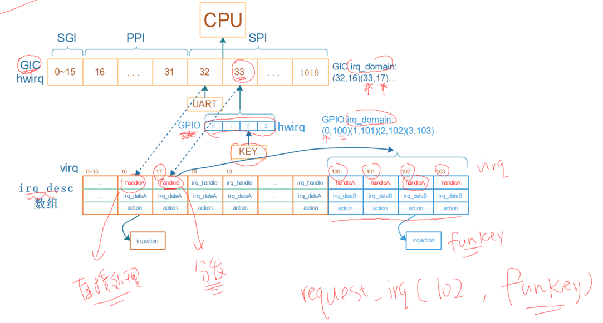
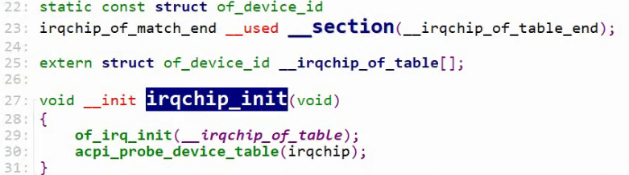
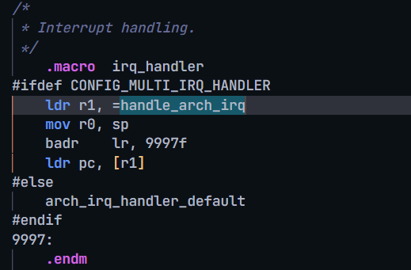

# GIC驱动程序对中断的处理流程

参考资料：

* [linux kernel的中断子系统之（七）：GIC代码分析](http://www.wowotech.net/irq_subsystem/gic_driver.html)

使用逐步演进的方法才能形象地理解.

## 0. 老内核的做法


`Linux 2.4 2.6` 的做法:

- 以前中断控制器还不是GIC, 是各个芯片厂家自己实现的, 不统一.
- 比如说某个厂的中断控制器只有32号中断. 比较小, 所以内核里干脆给你分配一个连续的内存空间, 称为为irq_desc.
- hwirq从0到31. irq_desc下标从1到32, 0号一般不用. 所以硬件中断号, 与虚拟中断号就相差1而已.
- 假如在30号hwirq这里接一个GPIO模块, 这个GPIO模块, 可以产生0到31号, 32个中断. 这时候irq_desc又可以继续扩展, 33到64.
    - GPIO模块里的hwirq 0到31, 对应irq_desc里的33到64. 以前的老内核就是这样做的. 每个模块的hwirq 与 virq有个简单的换算关系.
- 所以, 对于每一个硬件中断, 都可以事先知道virq, 就可以在内核里先定义一些宏. 

后来情况变了. 中断数量变多了. 新内核, 使用设备树的内核, 就改变了使用中断的方法.

- 对于每一个hwirq, 等`用到它时`再分配irq_desc, 确定virq, 并且记录下hwirq与virq的对应关系.

## 1. 一级中断控制器处理流程

对于irq_desc，内核有两种分配方法：

* 一次分配完所有的irq_desc
* 按需分配: 用到某个中断才分配它的irq_desc

现在的内核基本使用第1种方法。


* 假设GIC可以向CPU发出`16~1019号`中断, 这些数字被称为`hwirq`. `0~15`用于Process之间通信, 比较特殊.
* 假设要使用UART模块, 它发出的中断连接到GIC的32号中断, 分配的irq_desc序号为16(16号正好的空闲的, 如果找不到空闲的就会新分配一个.)
* 在`GIC irq_domain`中会记录(32, 16), hwirq与virq的关系.
    * `每一个中断控制器都会有一个 irq_domain`

* 那么注册中断时就是: `request_irq(16, func,...)`. 我们写的中断处理程序func 会被存放到第16项irq_desc结构体中的action成员指向的irqaction里, 并且这个irq_desc结构体中的`handleA`存放 `GIC驱动程序`提供的某一个`handle函数.`
* 发生UART中断时, 中断信号发给GIC, GIC中断CPU. CPU执行异常向量里的函数.
    * 异常向量里的程序从`GIC中读取寄存器`知道发生了`32号hwirq中断`, 通过`GIC irq_domain`可以知道这个hwirq对应的`virq为 16`
    * 调用`irq_desc[16]中的handleA函数`, 它的作用是`调用`action链表中`用户注册的函数func`, 同时屏蔽中断, 最后清除中断.
    * 屏蔽中断的函数 跟 清除中断的函数 都在 `irq_dataA`里, 他`里面有irq_chip`结构体, 里面提供这两个函数.
* 

## 2. 多级中断控制器处理流程


* 假设GPIO模块下有4个引脚, 都可以产生中断, 都连接到`GIC的33号中断`, 
* 以后在使用GPIO中断时, 必须给33号hwirq提供一个处理函数. 也得在数组里找到一个空闲位置给33号hwirq, 假设是17下标. 把33号hwirq跟17号irq记录在 `GIC irq_domain`中.
* GPIO也可以`看作一个中断控制器`, 对于它的4个中断
* 对于GPIO模块中`0~3这四个hwirq`, 一般都会`一下子分配四个irq_desc`
* 假设这4个irq_desc的序号为`100~103`, 在`GPIO irq_domain`中记录(0,100) (1,101)(2,102) (3,103). 
    * (GIC中断控制器跟GPIO中断控制器有各自的irq_domain)
* 对于KEY, 它接在第2号GPIO中断上, 那么注册中断时就是: `request_irq(102, funckey, ...)`
* 按下KEY时, GPIO模块给GIC发送中断信号, GIC中断CPU, CPU跳到中断向量表执行:
    * 程序从`GIC中读取寄存器`知道发生了33号中断, 通过`GIC irq_domain`可以知道virq为17
    * 调用`irq_desc[17]`中的`handleB函数`
        * handleB首先屏蔽33号中断, 然后处理, 就是读取GPIO寄存器, 确定是`GPIO里2号hwirq引脚`发生中断, 最后清除这个33号中断.
        * 通过`GPIO irq_domain`可以知道virq为102
        * 调用`irq_desc[102]中的handleA函数`, 它的作用是调用action链表中`用户注册的函数`
        * handleA 会屏蔽GPIO 2号hwirq中断, 调用funckey函数, 最后清除GPIO 2号中断.

总结:

- UART串口模块直接可以向GIC发中断信号时, handleA函数会屏蔽中断, 然后`马上调用用户注册的函数`, 最后清除中断.
- 对于多级中断, GPIO 引脚要通过GPIO模块, 向GIC发送中断信号, 而非直接发给GIC. 所以就是handleB调用handleA.  
    - 上面多级的例子中, GIC是第一级中断, GPIO为第二级中断, 对于hwirq 33号中断, handleB是GIC 驱动程序提供的, 它要读取GPIO模块寄存器去分辨 GPIO中断控制器里发生的是哪个中断, 然后去调用irq_desc数组中的另一个元素.  这里就是确认是GPIO中断控制器中的2号GPIO hwirq, 然后去GPIO中断控制器的 irq_domain里找到 virq 是102. 去调用irq_desc[102]中的handleA函数, handleA调用用户注册的函数.
    - 此时handleB 只是一个分发函数.

- 
    - 按键KEY向GPIO模块发中断, 然后GPIO模块向GIC发中断, GIC向发CPU中断.

- 

# GIC驱动程序分析

参考资料：

* [linux kernel的中断子系统之（七）：GIC代码分析](http://www.wowotech.net/irq_subsystem/gic_driver.html)

* Linux 4.9.88内核源码

    * `Linux-4.9.88\drivers\irqchip\irq-gic.c`
    * `Linux-4.9.88/arch/arm/boot/dts/imx6ull.dtsi`

* Linux 5.4内核源码

    * `Linux-5.4\drivers\irqchip\irq-gic.c`
    * `Linux-5.4/arch/arm/boot/dts/stm32mp151.dtsi`


## 1. 回顾GIC中断处理流程

看上面那章.

## 2. GIC中的重要函数和结构体

把用的设备树文件反汇编, 然后去找里面比较像的中断控制器.

沿着中断的处理流程，GIC涉及这4个重要部分：

* CPU从`异常向量表`中`调用handle_arch_irq`，这个`函数指针`是`由GIC驱动设置`的
    * GIC才知道怎么判断发生的是哪个GIC中断
* 从GIC获得`hwirq`后，要转换为`virq`：需要有`GIC Domain`
* 调用`irq_desc[virq].handle_irq`函数：这也应该`由GIC驱动提供`
* 处理中断时, 要`屏蔽中断`, `清除中断`等: 这些函数`保存在irq_data结构体里的irq_chip成员里`, `由GIC驱动提供`

从硬件上看，GIC的功能是什么？

* 可以使能、屏蔽中断
* 发生中断时，可以从GIC里判断是哪个中断

在内核里，使用`gic_chip_data结构体`表示GIC，gic_chip_data里有什么？

- irq_chip：中断使能、屏蔽、清除，放在irq_chip中的各个函数里实现
- 

- irq_domain
    * 申请中断时
        * 在设备树里指定hwirq、flag，可以使用irq_domain的函数来解析设备树
        * 根据hwirq可以分配virq，把(hwirq, virq)存入irq_domain中
    * 发生中断时，从GIC读出hwirq，可以通过irq_domain找到virq，从而找到处理函数

所以，GIC用`gic_chip_data`来表示，gic_chip_data中重要的成员是：`irq_chip`、`irq_domain`。

## 3. GIC初始化过程

- `gic_of_init`被调用的过程

```c
start_kernel (init\main.c)
    init_IRQ (arch\arm\kernel\irq.c)
    	irqchip_init (drivers\irqchip\irqchip.c)
    		of_irq_init (drivers\of\irq.c)
    			desc->irq_init_cb = match->data;

                ret = desc->irq_init_cb(desc->dev,
                            desc->interrupt_parent);
```

### 3.1 内核支持多种GIC

按照设备树的套路：

* 驱动程序注册platform_driver
* 它的of_match_table里有多个of_device_id，表示能支持多个设备
* 有多种版本的GIC，在内核为每一类GIC定义一个结构体of_device_id，并放在一个段里：

```c
// drivers\irqchip\irq-gic.c
IRQCHIP_DECLARE(gic_400, "arm,gic-400", gic_of_init);
IRQCHIP_DECLARE(arm11mp_gic, "arm,arm11mp-gic", gic_of_init);
IRQCHIP_DECLARE(arm1176jzf_dc_gic, "arm,arm1176jzf-devchip-gic", gic_of_init);
IRQCHIP_DECLARE(cortex_a15_gic, "arm,cortex-a15-gic", gic_of_init);
IRQCHIP_DECLARE(cortex_a9_gic, "arm,cortex-a9-gic", gic_of_init);
IRQCHIP_DECLARE(cortex_a7_gic, "arm,cortex-a7-gic", gic_of_init);
IRQCHIP_DECLARE(msm_8660_qgic, "qcom,msm-8660-qgic", gic_of_init);
IRQCHIP_DECLARE(msm_qgic2, "qcom,msm-qgic2", gic_of_init);
IRQCHIP_DECLARE(pl390, "arm,pl390", gic_of_init);
```

把宏`IRQCHIP_DECLARE`展开：

```c
// include\linux\irqchip.h
#define IRQCHIP_DECLARE(name, compat, fn) OF_DECLARE_2(irqchip, name, compat, fn)

#define OF_DECLARE_2(table, name, compat, fn) \
		_OF_DECLARE(table, name, compat, fn, of_init_fn_2)

#define _OF_DECLARE(table, name, compat, fn, fn_type)			\
	static const struct of_device_id __of_table_##name		\
		__used __section(__irqchip_of_table)			\
		 = { .compatible = compat,				\
		     .data = (fn == (fn_type)NULL) ? fn : fn  }
```

展开示例：

```c
IRQCHIP_DECLARE(cortex_a7_gic, "arm,cortex-a7-gic", gic_of_init);
展开后得到：
static const struct of_device_id __of_table_cortex_a7_gic		\
	__used __section(__irqchip_of_table)			\
	 = { .compatible = "arm,cortex-a7-gic",				\
		 .data = gic_of_init  }
```

- 这个结构体被放到了`__irqchip_of_table` 段内. 然后链接脚本里会用到.
    - 
    - 
    - 就可以在代码里找到它了.

### 3.2 在设备树里指定GIC

在设备树中指定GIC, 内核驱动程序根据设备树来选择, 初始化GIC.

`drivers\irqchip\irqchip.c`中并没有定义一个platform_driver, 但是套路是一样的.

- 

调用过程：


`of_irq_init`:

* 内核有一个`__irqchip_of_table数组`, 里面`有多个of_device_id`, 表示多种GIC
* 要使用哪类GIC? 在设备树里指定
* 根据设备树, 找到`__irqchip_of_table数组`中对应的项, 调用它的初始化函数
    * `IRQCHIP_DECLARE(cortex_a7_gic, "arm,cortex-a7-gic", gic_of_init);` 

### 3.3 gic_of_init分析

```c
int __init
gic_of_init(struct device_node *node, struct device_node *parent)
{
	struct gic_chip_data *gic;
	int irq, ret;

	if (WARN_ON(!node))
		return -ENODEV;

	if (WARN_ON(gic_cnt >= CONFIG_ARM_GIC_MAX_NR))
		return -EINVAL;
    
	gic = &gic_data[gic_cnt];

	ret = gic_of_setup(gic, node);
	if (ret)
		return ret;
	/*
	 * Disable split EOI/Deactivate if either HYP is not available
	 * or the CPU interface is too small.
	 */
	if (gic_cnt == 0 && !gic_check_eoimode(node, &gic->raw_cpu_base))
		static_key_slow_dec(&supports_deactivate);

	ret = __gic_init_bases(gic, -1, &node->fwnode);
	if (ret) {
		gic_teardown(gic);
		return ret;
	}

	if (!gic_cnt) {
		gic_init_physaddr(node);
		gic_of_setup_kvm_info(node);
	}

	if (parent) {
		irq = irq_of_parse_and_map(node, 0);
		gic_cascade_irq(gic_cnt, irq);
	}

	if (IS_ENABLED(CONFIG_ARM_GIC_V2M))
		gicv2m_init(&node->fwnode, gic_data[gic_cnt].domain);

	gic_cnt++;
	return 0;
}
```

- 先看 **gic_of_setup** 函数

```c
static int gic_of_setup(struct gic_chip_data *gic, struct device_node *node)
{
	if (!gic || !node)
		return -EINVAL;

	gic->raw_dist_base = of_iomap(node, 0);
	if (WARN(!gic->raw_dist_base, "unable to map gic dist registers\n"))
		goto error;

	gic->raw_cpu_base = of_iomap(node, 1);
	if (WARN(!gic->raw_cpu_base, "unable to map gic cpu registers\n"))
		goto error;

	if (of_property_read_u32(node, "cpu-offset", &gic->percpu_offset))
		gic->percpu_offset = 0;
    
	return 0;
error:
	gic_teardown(gic);
	return -ENOMEM;
}
```

- 可能有多个GIC, 先设置第0个GIC. 
- 首先获得GIC的物理地址, 把物理地址映射成虚拟地址. GIC里有两大部分: `分发器`跟`CPU接口`. 
    - 这两部分在设备树里都设置好了地址. 上面图里的第一项就是分发器的地址, 第二项就是CPU接口地址. 不同芯片GIC地址不同.
- 然后是**__gic_init_bases** 函数

```c
static int __init __gic_init_bases(struct gic_chip_data *gic,
				   int irq_start,
				   struct fwnode_handle *handle)
{
	char *name;
	int i, ret;

	if (WARN_ON(!gic || gic->domain))
		return -EINVAL;

	if (gic == &gic_data[0]) {
		/*
		 * Initialize the CPU interface map to all CPUs.
		 * It will be refined as each CPU probes its ID.
		 * This is only necessary for the primary GIC.
		 */
		for (i = 0; i < NR_GIC_CPU_IF; i++)
			gic_cpu_map[i] = 0xff;
#ifdef CONFIG_SMP
		set_smp_cross_call(gic_raise_softirq);
#endif
		cpuhp_setup_state_nocalls(CPUHP_AP_IRQ_GIC_STARTING,
					  "AP_IRQ_GIC_STARTING",
					  gic_starting_cpu, NULL);
		set_handle_irq(gic_handle_irq);
		if (static_key_true(&supports_deactivate))
			pr_info("GIC: Using split EOI/Deactivate mode\n");
	}

	if (static_key_true(&supports_deactivate) && gic == &gic_data[0]) {
		name = kasprintf(GFP_KERNEL, "GICv2");
		gic_init_chip(gic, NULL, name, true);
	} else {
		name = kasprintf(GFP_KERNEL, "GIC-%d", (int)(gic-&gic_data[0]));
		gic_init_chip(gic, NULL, name, false);
	}

	ret = gic_init_bases(gic, irq_start, handle);
	if (ret)
		kfree(name);

	return ret;
}
```

- 关键代码: **set_handle_irq**(**gic_handle_irq**); 这个函数就是设置 gic_handle_irq的.

```c
#ifdef CONFIG_MULTI_IRQ_HANDLER
void __init set_handle_irq(void (*handle_irq)(struct pt_regs *))
{
	if (handle_arch_irq)
		return;

	handle_arch_irq = handle_irq;
}
#endif
```

- **gic_handle_irq** 这个函数在 ``arch/arm/kernel/entry-armv.S` 文件中被用到.
    - 
    - handle_arch_irq 已经被赋值为 gic_handle_irq函数的地址了.
    - CPU从`异常向量表`中`调用handle_arch_irq`，这个`函数指针`是`由GIC驱动设置`的. 这个解决了.
- 接着是 **gic_init_chip** 函数:

```c
static void gic_init_chip(struct gic_chip_data *gic, struct device *dev,
			  const char *name, bool use_eoimode1)
{
	/* Initialize irq_chip */
	gic->chip = gic_chip; /*这个结构体在下面*/
	gic->chip.name = name;
	gic->chip.parent_device = dev;

	if (use_eoimode1) {
		gic->chip.irq_mask = gic_eoimode1_mask_irq;
		gic->chip.irq_eoi = gic_eoimode1_eoi_irq;
		gic->chip.irq_set_vcpu_affinity = gic_irq_set_vcpu_affinity;
	}

#ifdef CONFIG_SMP
	if (gic == &gic_data[0])
		gic->chip.irq_set_affinity = gic_set_affinity;
#endif
}

struct gic_chip_data {
	struct irq_chip chip;
	union gic_base dist_base;
	union gic_base cpu_base;
	void __iomem *raw_dist_base;
	void __iomem *raw_cpu_base;
	u32 percpu_offset;
#if defined(CONFIG_CPU_PM) || defined(CONFIG_ARM_GIC_PM)
	u32 saved_spi_enable[DIV_ROUND_UP(1020, 32)];
	u32 saved_spi_active[DIV_ROUND_UP(1020, 32)];
	u32 saved_spi_conf[DIV_ROUND_UP(1020, 16)];
	u32 saved_spi_target[DIV_ROUND_UP(1020, 4)];
	u32 __percpu *saved_ppi_enable;
	u32 __percpu *saved_ppi_active;
	u32 __percpu *saved_ppi_conf;
#endif
	struct irq_domain *domain;
	unsigned int gic_irqs;
#ifdef CONFIG_GIC_NON_BANKED
	void __iomem *(*get_base)(union gic_base *);
#endif
};
static struct irq_chip gic_chip = {
	.irq_mask		= gic_mask_irq,
	.irq_unmask		= gic_unmask_irq,
	.irq_eoi		= gic_eoi_irq,
	.irq_set_type		= gic_set_type,
	.irq_get_irqchip_state	= gic_irq_get_irqchip_state,
	.irq_set_irqchip_state	= gic_irq_set_irqchip_state,
	.flags			= IRQCHIP_SET_TYPE_MASKED |
				  IRQCHIP_SKIP_SET_WAKE |
				  IRQCHIP_MASK_ON_SUSPEND,
};
```

- 对于`GICv2` use_eoimode1参数为 true.
- irq_chip是用来处理硬件中断的. 里面好几个函数, 屏蔽, 取消屏蔽, 清除中断(irq_eoi)
    - 处理中断时, 要`屏蔽中断`, `清除中断`等: 这些函数`保存在irq_data结构体里的irq_chip成员里`, `由GIC驱动提供` . 这个解决.

- 最后是 **gic_init_bases** 函数, 代码太长不贴了. `drivers/irqchip/irq-gic.c` 
    - 创建一个domain: 
        - 

    - 从GIC获得`hwirq`后, 要转换为`virq`: 需要有`GIC Domain`. 这个域 就是用这个函数创建的. 
        - 
    - gic_irq_domain_hierarchy_ops 函数, 是域的操作函数. 看看.
        - 
    - 第一个函数用来解析设备树. 可以从设备树里解析出 hwirq和flag.
        - 
    - 申请中断的过程: a. 设备树里声明; b. domain解析设备树; c.为解析出GIC_SPI的200号hwirq找到一个空闲的virq; d.在domain里记录 hwirq virq. e. 最后就是 `.alloc `来处理.
        - 
        - 
        - 这个`.alloc`函数就是设置这个 irq_desc结构体的. hwirq找到一个virq, 对应找到一个irq_desc数组的元素. 然后就用这个函数来设置.
        - 

- 域的操作函数 完成了 解析设备树, 保存(hwirq,virq)的映射关系, 设置`irq_desc[virq] `结构体 三个任务.
    - 至此4个重要部分都完成了.

## 4. 申请GIC中断

### 4.1 在设备树里指定中断


### 4.2 内核对设备树的处理

- 函数调用过程如下，使用图片形式可以一目了然：
    - 
    - 设备树中的`中断节点信息`, 最终被内核转成一个virq, 放入`platform_device`的`resource`里.

函数调用过程如下, 使用文字格式方便复制:

* 为设备树节点分配设备
    ```c
        of_device_alloc (drivers/of/platform.c)
            dev = platform_device_alloc("", -1);  // 分配 platform_device   
            num_irq = of_irq_count(np);  // 计算中断数    
        	
        	// drivers/of/irq.c, 根据设备节点中的中断信息, 构造中断资源
        	of_irq_to_resource_table(np, res, num_irq) 
                of_irq_to_resource // drivers\of\irq.c
                	int irq = irq_of_parse_and_map(dev, index);  // 获得virq, 中断号
    ```

    * `of_irq_to_resource_table` : 中断节点信息, 放到 平台设备 的 资源 里.
    
* 解析设备树映射中断: irq_of_parse_and_map

    ```c
    // drivers/of/irq.c, 解析设备树中的中断信息, 保存在of_phandle_args结构体中
    of_irq_parse_one(dev, index, &oirq)
    
    // kernel/irq/irqdomain.c, 创建中断映射
    irq_create_of_mapping(&oirq);             
    	irq_create_fwspec_mapping(&fwspec);
    		// 调用irq_domain->ops的translate或xlate,把设备节点里的中断信息解析为hwirq, type
    		irq_domain_translate(domain, fwspec, &hwirq, &type)  
    		
    		// 看看这个hwirq是否已经映射, 如果virq非0就直接返回
    		virq = irq_find_mapping(domain, hwirq); 
    		
    		// 否则创建映射	
    		if (irq_domain_is_hierarchy(domain)) {
    			// 返回未占用的virq
    			// 并用irq_domain->ops->alloc函数设置irq_desc
    			virq = irq_domain_alloc_irqs(domain, 1, NUMA_NO_NODE, fwspec);
    			if (virq <= 0)
    				return 0;
    		} else {
    			/* Create mapping */
    			// 返回未占用的virq
    			// 并通过irq_domain_associate调用irq_domain->ops->map设置irq_desc
    			virq = irq_create_mapping(domain, hwirq);
    		if (!virq)
    				return virq;
    		}
    ```

- gic_irq_domain_translate 函数

    ```c
static int gic_irq_domain_translate(struct irq_domain *d,
				    struct irq_fwspec *fwspec,
				    unsigned long *hwirq,
				    unsigned int *type)
{
	if (is_of_node(fwspec->fwnode)) {
		if (fwspec->param_count < 3)
			return -EINVAL;

		/* Get the interrupt number and add 16 to skip over SGIs */
		*hwirq = fwspec->param[1] + 16;
		/*
		 * For SPIs, we need to add 16 more to get the GIC irq
		 * ID number
		 */
		if (!fwspec->param[0])
			*hwirq += 16;

		*type = fwspec->param[2] & IRQ_TYPE_SENSE_MASK;
		return 0;
	}
	if (is_fwnode_irqchip(fwspec->fwnode)) {
		if(fwspec->param_count != 2)
			return -EINVAL;

		*hwirq = fwspec->param[0];
		*type = fwspec->param[1];
		return 0;
	}
	return -EINVAL;
}
    ```

- 以上面的设备树为例:

    - 
    - 一上来啥也不管, 先给设备树的第二个参数+16, 就是89+16. 跳过SGI的编号.
    - 第一个参数 GIC_SPI为0 就是fwspec->param[0]是0. 所以hwirq 先+16 再+16, 先加16是为了跳过SGI, 再加16是为了跳过PPI. 符合IMX6ULL GIC中断序号安排.
        - 
    - 而且是GIC_SPI里的第89号中断, 所以统一编号下, 应该是89+32=121号.
    - 开发板 `cat /proc/interrupts` 看一下:
        - 
    - 具体可以到 `/sys/kernel/irq/` 下搜 121.
        - 
        - cat chip_name, 看看名字: 这个就是我们的节点.
        - 

### 插讲: 中断调试信息

- `cat /proc/interrupts` 显示的信息都是来自`/sys/kernel/irq`目录
- `cd /sys/kernel/irq/16`
- `cat name` , `cat chip_name`, `cat hwirq`
- `cat per_cpu_count` : 从cpu0 开始的各个cpu核上的中断触发次数
    - 

- `cat actions`: 看看用户注册的处理函数

## 5. GIC中断处理流程源码分析

- 从`gic_handle_irq`入手
- 它肯定会先去`读取GIC的寄存器`, 看看发生的是哪个硬件中断.
    - 
- **gic_handle_irq** -> **handle_domain_irq**(处理这个domain里的硬件中断) -> **__handle_domain_irq** 
    - 在 **__handle_domain_irq** 里 **irq_find_mapping** 在这个 `domain里` 找到 hwirq对应的virq
    - 然后 **generic_handle_irq** 中, **irq_to_desc** 把拿到的virq作为索引, 去取出对应的 `struct irq_desc`. 然后 **generic_handle_irq_desc** 里调用 `desc->handle_irq(desc);`
        - 就是调用 `struct irq_desc` 中的handle函数.
        - 这个 `handle_irq` 就是之前 解析设备树时, 在域的操作函数里完成的. 是domain里的 `.alloc`函数.
        - 就是 `handle_fasteoi_irq` 这个函数.
        - 
    - `handle_fasteoi_irq` 这个函数 会先 ``struct irq_chip *chip = desc->irq_data.chip;`` 取出 irq_chip. 里面有屏蔽中断函数, 清理中断函数.
        - 然后屏蔽中断, **mask_irq**(desc); 处理中断, **handle_irq_event**(desc); 处理完解除屏蔽, **cond_unmask_eoi_irq**
    - `handle_irq_event` 处理中断: -> **handle_irq_event_percpu** -> **__handle_irq_event_percpu** -> for_each_action_of_desc(desc, action) , action**->**handler(irq, action**->**dev_id);
        - 就是去调用 用户注册的函数.

# 两类中断控制器处理流程_链式和层级

参考资料：

* [linux kernel的中断子系统之（七）：GIC代码分析](http://www.wowotech.net/irq_subsystem/gic_driver.html)

* Linux 4.9.88内核源码

    * `Linux-4.9.88\drivers\gpio\gpio-mxc.c`
    * `Linux-4.9.88\arch\arm\boot\dts\imx6ull.dtsi`

* Linux 5.4内核源码

    * `Linux-5.4\drivers\pinctrl\stm32\pinctrl-stm32mp157.c`
    * `Linux-5.4\drivers\irqchip\irq-stm32-exti.c`
    * `Linux-5.4\arch\arm\boot\dts\stm32mp151.dtsi`

## 1. 下级中断控制器的类别

在后续课程中我们把GIC之下的中断控制器分为两类：链式(chained)、层级(hierarchy)。

这个分类并没有官方定义，是我们根据代码概括出来的(Linux内核本来就缺乏文档)。


### 1.1 链式中断控制器(chained)

上图中, 左边的"chained intc"就是`链式中断控制器`.

它底下的`4个中断触发时`, 都会`导致GIC的33号中断被触发`.

处理中断时, 需要**分辨**: 是谁触发了GIC 33号中断? 这需要读取"chained intc"中的寄存器.

### 1.2 层级中断控制器(hierarchy)

上图中，右边边的"hierarchy intc"就是层级中断控制器。

它底下的`4个中断`, 跟GIC中的4个中断`一一对应`.

处理GIC 100~103号中断时, **不需要**读取"hierarchy intc"的寄存器来**分辨**是谁触发了中断.


## 2. 链式中断控制器的处理流程

下图中：

* handleA, irq_dataA由`GIC驱动`提供
* handleB, irq_dataB由`GPIO驱动`提供
* handleC也是GPIO驱动提供
* 内核里保存这个索引关系的不一定是数组, 为了节省内存可能用的是 radix tree 基数树. 反正你拿到virq就一定能找到对应的struct irq_desc.


* 假设GPIO模块下**有4个引脚**, 都可以产生中断, 都**连接到GIC的33号中断**

* GPIO就是一个链式中断控制器, 它底下有4个中断

* 对于GPIO模块中0~3这四个hwirq, 分配四个irq_desc
    * 可以一下子分配4个: legacy, 老方法
    * 也可以用到时再分配: linear, 新方法
    
* 假设这4个irq_desc的序号为100~103, 在GPIO domain中记录(0,100) (1,101)(2,102) (3,103)

* 对于KEY, 注册中断时就是: `request_irq(102, ...)`

* 按下KEY时:
    * 程序从GIC中读取寄存器知道发生了33号中断, 通过GIC irq_domain可以知道virq为17
    * 处理virq 17号中断: 调用irq_desc[17].handle_irq, 即handleB(GPIO驱动提供.)
        * mask/ack中断: 调用irq_desc[17].irq_data->irq_chip的函数, 即irq_dataA(GIC驱动提供)
        * 细分中断源, 处理
            * 读取GPIO寄存器, 确定是GPIO里2号引脚发生中断
            * 通过GPIO irq_domain可以知道virq为102
            * 处理virq 102号中断: 调用irq_desc[102].handle_irq, 即handleC
                * mask/ack中断: 调用irq_desc[102].irq_data->irq_chip的函数
                * 调用irq_desc[102].action链表中用户注册的函数
                * unmask中断: 调用irq_desc[102].irq_data->irq_chip的函数
        * unmask中断: 调用irq_desc[17].irq_data->irq_chip的函数,  即irq_dataA(GIC驱动提供)
    


## 3. 层级中断控制器的处理流程

下图中:

* handleA, irq_dataA由GIC驱动提供
* irq_dataB由GPIO驱动提供, 不需要handleB


* 假设GPIO模块下有4个引脚, 都可以产生中断, 分别链接到GIC的100~103号中断
* GPIO就是一个层级中断控制器
* 对于GPIO模块中0~3这四个hwirq, 分配四个irq_desc, 用到时再分配
* 假设这4个irq_desc的序号为234~237
    * 在GIC domain中记录(100,234) (101,235)(102,236) (103,237)
    * 在GPIO domain中记录(0,234) (1,235)(2,236) (3,237)
* 对于KEY, 注册中断时就是: `request_irq(236, ...)`
* 按下KEY时:
    * 程序从GIC中读取寄存器知道发生了102号中断, 通过GIC irq_domain可以知道virq为236
    * 处理virq 236号中断: 调用irq_desc[236].handle_irq, 即handleA
        * mask/ack中断: 
            * 调用irq_desc[236].irq_data->irq_chip的函数, 即irq_dataB, 屏蔽GPIO中的中断
                * 它会`调用父级`irq_dataA->irq_chip的函数, 屏蔽GIC中的中断
        * 调用irq_desc[236].action链表中用户注册的函数
        * unmask中断: 
            * 调用irq_desc[236].irq_data->irq_chip的函数, 即irq_dataB, 取消屏蔽GPIO中的中断
                * 它会`调用父级`irq_dataA->irq_chip的函数, 取消屏蔽GIC中的中断

## 4. 处理流程对比


# 链式中断控制器驱动程序编写

参考资料：

* [linux kernel的中断子系统之（七）：GIC代码分析](http://www.wowotech.net/irq_subsystem/gic_driver.html)

* Linux 4.9.88内核源码

    * `Linux-4.9.88\drivers\gpio\gpio-mxc.c`
    * `Linux-4.9.88\arch\arm\boot\dts\imx6ull.dtsi`

* Linux 5.4内核源码

    * `Linux-5.4\drivers\pinctrl\stm32\pinctrl-stm32mp157.c`
    * `Linux-5.4\drivers\irqchip\irq-stm32-exti.c`
    * `Linux-5.4\arch\arm\boot\dts\stm32mp151.dtsi`

* 本节视频源码在GIT仓库里

    ```shell
    doc_and_source_for_drivers\IMX6ULL\source\08_Interrupt\03_virtual_int_controller_legacy
    doc_and_source_for_drivers\STM32MP157\source\A7\08_Interrupt\03_virtual_int_controller_legacy
    ```

## 1. 链式中断控制器的重要函数和结构体

### 1.1 回顾处理流程

为方便描述，假设下级的链式中断控制器就是GPIO控制器。


沿着中断的处理流程，GIC之下的中断控制器涉及这4个重要部分：handleB、GPIO Domain、handleC、irq_chip

* **handleB**：处理GIC 33号中断，handleB由GPIO驱动提供
    * 屏蔽GIC 33号中断：调用irq_dataA的irq_chip的函数，irq_dataA由GIC驱动提供
    * 细分并处理某个GPIO中断：
        * 读取GPIO寄存器得到hwirq，通过**GPIO Domain**转换为virq，假设是102
        * 调用irq_desc[102].handle_irq，即handleC
    * 清除GIC 33号中断：调用irq_dataA的irq_chip的函数，由GIC驱动提供

* **handleC**：处理GPIO 2号中断，handleC由GPIO驱动提供
    * 屏蔽GPIO 2号中断：调用irq_dataB的**irq_chip**的函数，由GPIO驱动提供
    * 处理：调用actions链表中用户注册的函数
    * 清除GPIO 2号中断：调用irq_dataB的irq_chip的函数，由GPIO驱动提供

### 1.2 irq_domain的核心作用

怎么把handleB, GPIO Domain, handleC, irq_chip这4个结构体组织起来, `irq_domain`是核心. 我们写驱动主要就是构造这个irq_domain.

我们从使用中断的流程来讲解。

* 在设备树里指定使用哪个中断

    ```shell
        gpio_keys_100ask {
            compatible = "100ask,gpio_key";
    		interrupt-parent = <&gpio5>;
    		interrupts = <3 IRQ_TYPE_EDGE_BOTH>,
        };
    ```

* 内核解析, 处理设备树的中断信息

    * 根据`interrupt-parent`找到驱动程序注册的`irq_domain`
    * 使用`irq_domain.ops`中的`translate或xlate函数`解析设备树, 得到hwirq 3和type IRQ_TYPE_EDGE_BOTH

    * 分配/找到irq_desc, 得到`virq` (自动确定虚拟中断号)
        * 把(hwirq, virq)的关系存入irq_domain
        * 把virq存入这个设备节点所对应的platform_device的resource中
    * 使用`irq_domain.ops`中的`alloc或map函数`进行设置
        * 可能是替换irq_desc[virq].handle_irq函数
        * 也可能是替换irq_desc[virq].irq_data, 里面有irq_chip

* `用户的驱动程序`注册中断

    * 从platform_device的resource中 得到中断号virq
    * request_irq(virq, ..., func)

* 发生中断, 处理中断: 处理流程见上面。  

## 2. 硬件模型

下图中列出了链式中断控制器、层级中断控制器，本节课程只涉及左边的链式中断控制器。

内核中有各类中断控制器的驱动程序，它们涉及的硬件过于复杂，从这些杂乱的代码中去讲清楚中断体系，比较难。

我们实现一些虚拟的中断控制器，如下图所示。

实际板子中，我们可以通过按键触发中断。

对于这些虚拟的中断控制器，我们没有真实按键，通过`devmem指令`写GIC的`PENDING寄存器`触发中断


##  3. 编程

会涉及2个驱动程序: 虚拟的`中断控制器驱动程序`, `按键驱动程序`, 以及对应的设备树.

中断控制器:

```c
static int virtual_intc_probe(struct platform_device* pdev)
{
    int irq_to_parent;
    /* 1. virtual intc 会向GIC发出n号中断. */
    /* 1.1 从设备树里获得virq_n */
    irq_to_parent = platform_get_irq(pdev, 0);

    /* 1.2 设置irq_desc[].handle_irq (handleB),
     *  其功能是分辨hwirq, 调用对应的设置irq_desc[].handle_irq */
    irq_set_chained_handler_and_data(irq_to_parent, virtual_intc_irq_handler,
                                     NULL);

    /* 2. 分配/设置/注册一个irq_domain */
    return 0;
}

static void virtual_intc_irq_handler(struct irq_desc* desc)
{
    //分辨hwirq, 调用对应的设置irq_desc[].handle_irq
    u32 irq_stat;
    int hwirq;

    struct irq_chip* chip = irq_desc_get_chip(desc);
    chained_irq_enter(chip, desc); /*调用irq_dataA 中的irq_chip 屏蔽中断*/

    chained_irq_exit(chip, desc); /*调用irq_dataA 中的irq_chip 恢复中断*/
}
```

