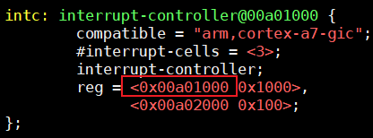

# legacy方式代码的上机实验

参考资料：

* [linux kernel的中断子系统之（七）：GIC代码分析](http://www.wowotech.net/irq_subsystem/gic_driver.html)

* Linux 4.9.88内核源码

    * `Linux-4.9.88\drivers\gpio\gpio-mxc.c`
    * `Linux-4.9.88\arch\arm\boot\dts\imx6ull.dtsi`

* Linux 5.4内核源码

    * `Linux-5.4\drivers\pinctrl\stm32\pinctrl-stm32mp157.c`
    * `Linux-5.4\drivers\irqchip\irq-stm32-exti.c`
    * `Linux-5.4\arch\arm\boot\dts\stm32mp151.dtsi`

* 芯片手册

    * IMX6ULL: imx6ullrm.pdf
    * STM32MP157: DM00327659.pdf

* 本节视频源码在GIT仓库里

    ```shell
    doc_and_source_for_drivers\
    	IMX6ULL\source\08_Interrupt\
    		04_virtual_int_controller_legacy_ok
    		
    doc_and_source_for_drivers\
    	STM32MP157\source\A7\08_Interrupt\
    		04_virtual_int_controller_legacy_ok
    ```


## 1. 确定中断号n

查看芯片手册，选择一个保留的、未使用的GIC SPI中断即可。

- 
    - 对于IMX6ULL 这几个是保留的.

### 1.1 IMX6ULL

看芯片手册第3章：


看上图，选择122号中断，它是SPI里的122号中断，GIC里的编号是(32+122)=154。

- mp157的话选择210号中断，它是SPI里的210号中断，GIC里的编号是(32+210)=242。

## 2. 怎么触发中断

可以通过`devmem`命令直接写`GIC的PENDING寄存区`。


`GICD_ISPENDRn`有多个寄存器，每个寄存器中 `每一位`对应`一个GIC中断`，写入1就可以触发该中断。

写哪一个`GICD_ISPENDRn`寄存器？写哪一位？使用下列公式来确定：


查看内核设备树文件imx6ull.dtsi、stm32mp151.dtsi，可以知道：

- IMX6ULL的GIC Distributor 地址是：0x00a01000
    - 
- STM32MP157的GIC Distributor 地址是：0xa0021000
    - 


| 芯片       | SPI中断号 | GIC中断号 | n,bit | GICD_ISPENDRn地址 | 命令                         |
| ---------- | --------- | --------- | ----- | ----------------- | ---------------------------- |
| IMX6LLL    | 122       | 154       | 4,26  | 0xa01210          | devmem 0xa01210 32 0x4000000 |
| STM32MP157 | 210       | 242       | 7,18  | 0xa002121c        | devmem 0xa002121c 32 0x40000 |

- 6ull: SPI的122号中断, 第4个寄存器的第26位. 第4个寄存器的地址: 0x200 + 4*4 = 0x210. 基地址0xa01000, 所以是0xa01210. 第26位, 是0x4000000. 157的算法一样.

## 3. 上机实验

### 3.1 设置工具链

1. STM32MP157

  ```shell
export ARCH=arm
export CROSS_COMPILE=arm-buildroot-linux-gnueabihf-
export PATH=$PATH:/home/book/100ask_stm32mp157_pro-sdk/ToolChain/arm-buildroot-linux-gnueabihf_sdk-buildroot/bin
  ```

2. IMX6ULL

  ```shell
export ARCH=arm
export CROSS_COMPILE=arm-linux-gnueabihf-
export PATH=$PATH:/home/book/100ask_imx6ull-sdk/ToolChain/gcc-linaro-6.2.1-2016.11-x86_64_arm-linux-gnueabihf/bin
  ```

### 3.2 编译、替换设备树

1. STM32MP157

  * 修改`arch/arm/boot/dts/stm32mp157c-100ask-512d-lcd-v1.dts`，添加如下代码：

    ```shell
    / {
    	virtual_intc: virtual_intc_100ask {
    		compatible = "100ask,virtual_intc";
    		
    		interrupt-controller;
    		#interrupt-cells = <2>;
    
    		interrupt-parent = <&intc>;
    		interrupts = <GIC_SPI 210 IRQ_TYPE_LEVEL_HIGH>;
    		
    	};
    	
        gpio_keys_100ask {
            compatible = "100ask,gpio_key";
    		interrupt-parent = <&virtual_intc>;
    		interrupts = <0 IRQ_TYPE_LEVEL_HIGH>,
    		             <1 IRQ_TYPE_LEVEL_HIGH>,
    					 <2 IRQ_TYPE_LEVEL_HIGH>,
    					 <3 IRQ_TYPE_LEVEL_HIGH>;
        };
    };
    ```

  * 编译设备树：
    在Ubuntu的STM32MP157内核目录下执行如下命令,
    得到设备树文件：`arch/arm/boot/dts/stm32mp157c-100ask-512d-lcd-v1.dtb`

    ```shell
    make dtbs
    ```

  * 复制到NFS目录：

    ```shell
    $ cp arch/arm/boot/dts/stm32mp157c-100ask-512d-lcd-v1.dtb ~/nfs_rootfs/
    ```

  * 开发板上挂载NFS文件系统

    * vmware使用NAT(假设windowsIP为192.168.1.100)

        ```shell
        [root@100ask:~]# mount -t nfs -o nolock,vers=3,port=2049,mountport=9999 
        192.168.1.100:/home/book/nfs_rootfs /mnt
        ```

    * vmware使用桥接，或者不使用vmware而是直接使用服务器：假设Ubuntu IP为192.168.1.137

        ```shell
        [root@100ask:~]#  mount -t nfs -o nolock,vers=3 192.168.1.137:/home/book/nfs_rootfs /mnt
        ```

* 更新设备树

    ```shell
    [root@100ask:~]# mount  /dev/mmcblk2p2  /boot
    [root@100ask:~]# cp /mnt/stm32mp157c-100ask-512d-lcd-v1.dtb /boot
    [root@100ask:~]# sync
    ```

* 重启开发板


2. IMX6ULL

  * 修改`arch/arm/boot/dts/100ask_imx6ull-14x14.dts`，添加如下代码：

    ```shell
    / {
    	virtual_intc: virtual_intc_100ask {
    		compatible = "100ask,virtual_intc";
    		
    		interrupt-controller;
    		#interrupt-cells = <2>;
    
    		interrupt-parent = <&intc>;
    		interrupts = <GIC_SPI 122 IRQ_TYPE_LEVEL_HIGH>;
    		
    	};
    	
        gpio_keys_100ask {
            compatible = "100ask,gpio_key";
    		interrupt-parent = <&virtual_intc>;
    		interrupts = <0 IRQ_TYPE_LEVEL_HIGH>,
    		             <1 IRQ_TYPE_LEVEL_HIGH>,
    					 <2 IRQ_TYPE_LEVEL_HIGH>,
    					 <3 IRQ_TYPE_LEVEL_HIGH>;
        };
    };
    ```

  * 编译设备树：
    在Ubuntu的IMX6ULL内核目录下执行如下命令,
    得到设备树文件：`arch/arm/boot/dts/100ask_imx6ull-14x14.dtb`

    ```shell
    make dtbs
    ```

  * 复制到NFS目录：

    ```shell
    $ cp arch/arm/boot/dts/100ask_imx6ull-14x14.dtb ~/nfs_rootfs/
    ```

* 开发板上挂载NFS文件系统

    * vmware使用NAT(假设windowsIP为192.168.1.100)

        ```shell
        [root@100ask:~]# mount -t nfs -o nolock,vers=3,port=2049,mountport=9999 
        192.168.1.100:/home/book/nfs_rootfs /mnt
        ```

    * vmware使用桥接，或者不使用vmware而是直接使用服务器：假设Ubuntu IP为192.168.1.137

        ```shell
        [root@100ask:~]#  mount -t nfs -o nolock,vers=3 192.168.1.137:/home/book/nfs_rootfs /mnt
        ```

    * 更新设备树

        ```shell
        [root@100ask:~]# cp /mnt/100ask_imx6ull-14x14.dtb /boot
        [root@100ask:~]# sync
        ```

* 重启开发板

### 3.3 编译、安装驱动程序

* 编译：

    * 在Ubuntu上
    * 修改`04_virtual_int_controller_legacy_ok`中的Makefile，指定内核路径`KERN_DIR`，在执行`make`命令即可。

* 安装：

    * 在开发板上

    * 挂载NFS，复制文件，insmod，类似如下命令：

        ```shell
        mount -t nfs -o nolock,vers=3 192.168.1.137:/home/book/nfs_rootfs /mnt
        // 对于IMX6ULL，想看到驱动打印信息，需要先执行
        echo "7 4 1 7" > /proc/sys/kernel/printk
        
        insmod -f /mnt/virtual_int_controller.ko
        // 安装virtual_int_controller之后即可进入/sys/kernel/irq目录查看分配的中断号
        
        insmod -f /mnt/gpio_key_drv.ko
        cat /proc/interrupts
        
        // 触发中断
        devmem 0xa01210 32 0x4000000 // imx6ull
        devmem 0xa002121c 32 0x40000 // stm32mp157
        ```

* 观察内核打印的信息

    * insmod
    * 
    * 
        * 58号virq, 对应157的242号硬件中断, 是GIC_SPI的210. 
        * 83号virq开始就是 GPIO的4个irq_desc了.
        * 
    * insmod gpio_xx.ko
        * 
        * 中断号就是从83到86. 然后加载GPIO模块之后, probe里 request_irq会导致 unmask 使能 65号中断.
    * `cat /proc/interrupts`
        * 
    * 使用命令随机产生中断:
        * 
        * 先ack 回应中断, 后处理中断. 我们并没有看到 `mask` 跟 `unmask`. 为啥? 
        * 因为handlec 我们是 **irq_set_chip_and_handler**(virq, &virtual_intc_irq_chip,**handle_edge_irq**); 是用`handle_edge_irq`边沿处理. 电平条边才触发. 所以没有屏蔽.
        * 我们把它改成 `handle_level_irq`. 高/低电平一般都会持续一段时间, 这段时间这个中断持续触发, 就必须屏蔽中断了.
        * 
        * 电平处理就会 先mask_ack, 屏蔽, 响应, 然后处理, 然后解除屏蔽.

# 链式中断控制器驱动程序编写_linear方式

参考资料：

* [linux kernel的中断子系统之（七）：GIC代码分析](http://www.wowotech.net/irq_subsystem/gic_driver.html)

* Linux 4.9.88内核源码

    * `Linux-4.9.88\drivers\gpio\gpio-mxc.c`
    * `Linux-4.9.88\arch\arm\boot\dts\imx6ull.dtsi`

* Linux 5.4内核源码

    * `Linux-5.4\drivers\pinctrl\stm32\pinctrl-stm32mp157.c`
    * `Linux-5.4\drivers\irqchip\irq-stm32-exti.c`
    * `Linux-5.4\arch\arm\boot\dts\stm32mp151.dtsi`

* 本节视频源码在GIT仓库里

    ```shell
    doc_and_source_for_drivers\
    	IMX6ULL\source\08_Interrupt\
    		05_virtual_int_controller_linear_ok
    	
    doc_and_source_for_drivers\
    	STM32MP157\source\A7\08_Interrupt\
    		05_virtual_int_controller_linear_ok
    ```


## 1. 两种方式的对比

linear、legacy方式，都是用来编写链式中断控制器驱动程序，它们的关系如下表所示。

|              |                    legacy                     | linear                |
| -----------: | :-------------------------------------------: | --------------------- |
|         函数 |             irq_domain_add_legacy             | irq_domain_add_linear |
|     irq_desc |                 一次性分配完                  | 用到再分配            |
| (hwirq,virq) | domain->linear_revmap[hwirq] = irq_data->irq; | 同左边                |

## 2. 编程

改动的地方就是 probe函数.

```c
static int virtual_intc_probe(struct platform_device *pdev)
{	
	struct device_node *np = pdev->dev.of_node;
	int irq_to_parent;
	//int irq_base;
	
	/* 1. virutal intc 会向GIC发出n号中断 */
	/* 1.1 从设备树里获得virq_n */
	irq_to_parent = platform_get_irq(pdev, 0);
	printk("virtual_intc_probe irq_to_parent = %d\n", irq_to_parent);
	
	/* 1.2 设置它的irq_desc[].handle_irq, 它的功能时分辨是哪一个hwirq, 调用对应的irq_desc[].handle_irq */
	irq_set_chained_handler_and_data(irq_to_parent, virtual_intc_irq_handler, NULL);

	
	/* 2. 分配/设置/注册一个irq_domain */
	//irq_base = irq_alloc_descs(-1, 0, 4, numa_node_id());
	//printk("virtual_intc_probe irq_base = %d\n", irq_base);

	/* Usage:
	 *  a. dts: 定义使用哪个hwirq
	 *  b. 内核解析设备树时分配irq_desc，得到virq
	 *  c. (hwirq, virq) ==>存入domain
	 */

	virtual_intc_domain = irq_domain_add_linear(np, 4, 
					     &virtual_intc_domain_ops, NULL);
	
	return 0;
}
```

- 设备树还是跟上面一样.

## 3. 上机实验

跟上节操作完全一样, 参考上面一节的上机. IMX6ULL上机如下:

- insmod 
    - 
    - 没有用到的时候, 找不到. 用到的时候才会给分配virq
- 安装gpio驱动
    - 
    - 使用了中断之后才能搜得到
    - 


- legacy 方式的对比:
    - 
    - 我们不安装gpio驱动程序.
    - 
    - 直接就能搜到了.

# 层级中断控制器驱动程序编写

参考资料：

* [linux kernel的中断子系统之（七）：GIC代码分析](http://www.wowotech.net/irq_subsystem/gic_driver.html)

* Linux 4.9.88内核源码

    * `Linux-4.9.88\drivers\gpio\gpio-mxc.c`
    * `Linux-4.9.88\arch\arm\boot\dts\imx6ull.dtsi`

* Linux 5.4内核源码

    * `Linux-5.4\drivers\pinctrl\stm32\pinctrl-stm32mp157.c`
    * `Linux-5.4\drivers\irqchip\irq-stm32-exti.c`
    * `Linux-5.4\arch\arm\boot\dts\stm32mp151.dtsi`

* 本节视频源码在GIT仓库里

    ```shell
    doc_and_source_for_drivers\
    	IMX6ULL\source\08_Interrupt\
    		06_virtual_int_controller_hierarchy
    
    doc_and_source_for_drivers\
    	STM32MP157\source\A7\08_Interrupt\
    		06_virtual_int_controller_hierarchy
    ```

    

## 1. 层级中断控制器的重要函数和结构体

### 1.1 回顾处理流程

为方便描述，假设下级的层级中断控制器就是GPIO控制器。

下图中：

* handleA、irq_dataA由GIC驱动提供
* irq_dataB由GPIO驱动提供，不需要handleB


* 假设GPIO模块下有`4个引脚`，都可以产生中断，`分别连接`到GIC的100~103号中断
* GPIO就是一个`层级中断控制器`
* 对于GPIO模块中0~3这四个hwirq，分配四个irq_desc，`用到时再分配`
* 假设这4个irq_desc的序号为234~237
    * 在GIC domain中记录(100,234) (101,235)(102,236) (103,237)
    * 在GPIO domain中记录(0,234) (1,235)(2,236) (3,237)
* 对于KEY，注册中断时就是：`request_irq(236, ...)`
* 按下KEY时：
    * 程序从`GIC中读取寄存器`知道发生了102号中断，通过`GIC irq_domain`可以知道virq为236
    * 处理virq 236号中断：调用`irq_desc[236].handle_irq`，即`handleA`
        * mask/ack中断: 
            * 调用`irq_desc[236].irq_data->irq_chip`的函数，即`irq_dataB`
                * 它会调用父级`irq_dataA->irq_chip`的函数
        * 调用`irq_desc[236].action链表`中用户注册的函数
        * unmask中断: 
            * 调用irq_desc[236].irq_data->irq_chip的函数，即irq_dataB
                * 它会调用父级irq_dataA->irq_chip的函数


## 1.2 irq_domain的核心作用

怎么把handleA、GIC Domain和GPIO Domain、irq_chipA和irq_chipB这4个结构体组织起来，irq_domain是核心。

为方便描述，我们把上图中的层级中断控制器当做GPIO控制器。

我们从使用中断的流程来讲解。

* 1.在设备树里指定使用哪个中断

    ```shell
        gpio_keys_100ask {
            compatible = "100ask,gpio_key";
    		interrupt-parent = <&gpio5>;
    		interrupts = <3 IRQ_TYPE_EDGE_BOTH>,
        };
    ```

* 2.内核解析, 处理设备树的中断信息

    * 根据`interrupt-parent`找到驱动程序注册的`GPIO irq_domain`
    * GPIO irq_domain对设备树的解析
        * 使用GPIO `irq_domain.ops`中的`translate或xlate函数`解析设备树, 得到hwirq和type
        * 分配/找到`irq_desc`, 得到`virq`
            * 把(hwirq, virq)的关系存入`GPIO irq_domain`
            * 把`virq`存入`platform_device`的`resource`中
        * 修改得到对应的`GIC_hwirq`, 调用`父级GIC irq_domain`继续解析
            * GIC_hwirq跟GPIO_hwirq一一对应, 所以GPIO_hwirq可以得到GIC_hwirq.
            * 把(GIC_hwirq, virq)的关系存入GIC irq_domain
        * ***注意***：对于同一个硬件中断，它在两个irq_domain里的virq是相同的，hwirq可能不一样。
    * GPIO irq_domain对设备树的设置
        * 使用GPIO `irq_domain.ops`中的`alloc函数`进行设置
            * 替换irq_desc[virq].irq_data, 里面有irq_chip改为irq_chipB, 即GPIO的irq_chip
            * **调用父级GIC irq_domain的alloc继续设置**
                * 设置irq_desc[virq].handle_irq为GIC的handle_irq, 即上图中的handleA

* 用户的驱动程序注册中断

    * 从platform_device的resource中得到中断号virq
    * request_irq(virq, ..., func)

* 发生中断、处理中断：处理流程见上面。

## 2. 硬件模型

跟 链式中断控制器驱动程序编写 这个章节一样. 通过devmem指令写GIC的PENDING寄存器触发中断.

##  3. 编程

会涉及2个驱动程序：虚拟的中断控制器驱动程序，按键驱动程序，以及对应的设备树。

虚拟的中断控制器驱动程序中，涉及2个递归处理。

### 3.1 alloc的递归处理


### 3.2 irq_chip的递归处理


# 层级中断控制器驱动程序上机实验

参考资料：

* [linux kernel的中断子系统之（七）：GIC代码分析](http://www.wowotech.net/irq_subsystem/gic_driver.html)

* Linux 4.9.88内核源码

    * `Linux-4.9.88\drivers\gpio\gpio-mxc.c`
    * `Linux-4.9.88\arch\arm\boot\dts\imx6ull.dtsi`

* Linux 5.4内核源码

    * `Linux-5.4\drivers\pinctrl\stm32\pinctrl-stm32mp157.c`
    * `Linux-5.4\drivers\irqchip\irq-stm32-exti.c`
    * `Linux-5.4\arch\arm\boot\dts\stm32mp151.dtsi`

* 芯片手册

    * IMX6ULL: imx6ullrm.pdf
    * STM32MP157: DM00327659.pdf

* 本节视频源码在GIT仓库里

    ```shell
    doc_and_source_for_drivers\
    	IMX6ULL\source\08_Interrupt\
    		07_virtual_int_controller_hierarchy_ok
    		
    doc_and_source_for_drivers\
    	STM32MP157\source\A7\08_Interrupt\
    		07_virtual_int_controller_hierarchy_ok
    ```


前面的内容跟legacy方式上机一样.

| 芯片       | SPI中断号 | GIC中断号 | n,bit | GICD_ISPENDRn地址 | 命令                          |
| ---------- | --------- | --------- | ----- | ----------------- | ----------------------------- |
| IMX6LLL    | 122       | 154       | 4,26  | 0xa01210          | devmem 0xa01210 32 0x4000000  |
|            | 123       | 155       | 4,27  | 0xa01210          | devmem 0xa01210 32 0x8000000  |
|            | 124       | 156       | 4,28  | 0xa01210          | devmem 0xa01210 32 0x10000000 |
|            | 125       | 157       | 4,29  | 0xa01210          | devmem 0xa01210 32 0x20000000 |
| STM32MP157 | 210       | 242       | 7,18  | 0xa002121c        | devmem 0xa002121c 32 0x40000  |
|            | 211       | 243       | 7,19  | 0xa002121c        | devmem 0xa002121c 32 0x80000  |
|            | 212       | 244       | 7,20  | 0xa002121c        | devmem 0xa002121c 32 0x100000 |
|            | 213       | 245       | 7,21  | 0xa002121c        | devmem 0xa002121c 32 0x200000 |

## 上机实验

### 设置工具链

### 编译、替换设备树

1. STM32MP157

  * 修改`arch/arm/boot/dts/stm32mp157c-100ask-512d-lcd-v1.dts`，添加如下代码：

    ```shell
    / {
       virtual_intc: virtual_intc_100ask {
            compatible = "100ask,virtual_intc";
    
            interrupt-controller;
            #interrupt-cells = <2>;
    
            interrupt-parent = <&intc>;
            //upper_hwirq_base = <122>;  // imx6ull
            upper_hwirq_base = <210>;  // stm32mp157
        };
    
        gpio_keys_100ask {
            compatible = "100ask,gpio_key";
            interrupt-parent = <&virtual_intc>;
            interrupts = <0 IRQ_TYPE_LEVEL_HIGH>,
                         <1 IRQ_TYPE_LEVEL_HIGH>,
                         <2 IRQ_TYPE_LEVEL_HIGH>,
                         <3 IRQ_TYPE_LEVEL_HIGH>;
        };
    };
    ```

  * 编译设备树：
    在Ubuntu的STM32MP157内核目录下执行如下命令,
    得到设备树文件：`arch/arm/boot/dts/stm32mp157c-100ask-512d-lcd-v1.dtb`

    ```shell
    make dtbs
    ```

  * 复制到NFS目录：

    ```shell
    $ cp arch/arm/boot/dts/stm32mp157c-100ask-512d-lcd-v1.dtb ~/nfs_rootfs/
    ```

  * 开发板上挂载NFS文件系统

    * vmware使用NAT(假设windowsIP为192.168.1.100)

        ```shell
        [root@100ask:~]# mount -t nfs -o nolock,vers=3,port=2049,mountport=9999 
        192.168.1.100:/home/book/nfs_rootfs /mnt
        ```

    * vmware使用桥接，或者不使用vmware而是直接使用服务器：假设Ubuntu IP为192.168.1.137

        ```shell
        [root@100ask:~]#  mount -t nfs -o nolock,vers=3 192.168.1.137:/home/book/nfs_rootfs /mnt
        ```

* 更新设备树

    ```shell
    [root@100ask:~]# mount  /dev/mmcblk2p2  /boot
    [root@100ask:~]# cp /mnt/stm32mp157c-100ask-512d-lcd-v1.dtb /boot
    [root@100ask:~]# sync
    ```

* 重启开发板


2. IMX6ULL

  * 修改`arch/arm/boot/dts/100ask_imx6ull-14x14.dts`，添加如下代码：

    ```shell
    / {
       virtual_intc: virtual_intc_100ask {
            compatible = "100ask,virtual_intc";
    
            interrupt-controller;
            #interrupt-cells = <2>;
    
            interrupt-parent = <&intc>;
            upper_hwirq_base = <122>;  // imx6ull
            //upper_hwirq_base = <210>;  // stm32mp157
        };
    
        gpio_keys_100ask {
            compatible = "100ask,gpio_key";
            interrupt-parent = <&virtual_intc>;
            interrupts = <0 IRQ_TYPE_LEVEL_HIGH>,
                         <1 IRQ_TYPE_LEVEL_HIGH>,
                         <2 IRQ_TYPE_LEVEL_HIGH>,
                         <3 IRQ_TYPE_LEVEL_HIGH>;
        };
    
    };
    ```

  * 编译设备树：
    在Ubuntu的IMX6ULL内核目录下执行如下命令,
    得到设备树文件：`arch/arm/boot/dts/100ask_imx6ull-14x14.dtb`

    ```shell
    make dtbs
    ```

  * 复制到NFS目录：

    ```shell
    $ cp arch/arm/boot/dts/100ask_imx6ull-14x14.dtb ~/nfs_rootfs/
    ```

* 开发板上挂载NFS文件系统

    * vmware使用NAT(假设windowsIP为192.168.1.100)

        ```shell
        [root@100ask:~]# mount -t nfs -o nolock,vers=3,port=2049,mountport=9999 
        192.168.1.100:/home/book/nfs_rootfs /mnt
        ```

    * vmware使用桥接，或者不使用vmware而是直接使用服务器：假设Ubuntu IP为192.168.1.137

        ```shell
        [root@100ask:~]#  mount -t nfs -o nolock,vers=3 192.168.1.137:/home/book/nfs_rootfs /mnt
        ```

    * 更新设备树

        ```shell
        [root@100ask:~]# cp /mnt/100ask_imx6ull-14x14.dtb /boot
        [root@100ask:~]# sync
        ```

* 重启开发板

### 编译、安装驱动程序

* 编译：

    * 在Ubuntu上
    * 修改`07_virtual_int_controller_hierarchy_ok`中的Makefile，指定内核路径`KERN_DIR`，在执行`make`命令即可。

* 安装：

    * 在开发板上

    * 挂载NFS，复制文件，insmod，类似如下命令：

        ```shell
        mount -t nfs -o nolock,vers=3 192.168.1.137:/home/book/nfs_rootfs /mnt
        // 对于IMX6ULL，想看到驱动打印信息，需要先执行
        echo "7 4 1 7" > /proc/sys/kernel/printk
        
        insmod -f /mnt/virtual_int_controller.ko
        // 安装virtual_int_controller之后即可进入/sys/kernel/irq目录查看分配的中断号
        
        insmod -f /mnt/gpio_key_drv.ko
        cat /proc/interrupts
        
        // 触发中断
        // 对于IMX6ULL
        devmem 0xa01210 32 0x4000000
        devmem 0xa01210 32 0x8000000
        devmem 0xa01210 32 0x10000000
        devmem 0xa01210 32 0x20000000
        
        // 对于stm32mp157
        devmem 0xa002121c 32 0x40000 
        devmem 0xa002121c 32 0x80000
        devmem 0xa002121c 32 0x100000  // 它不能触发中断,可能是被占用了
        devmem 0xa002121c 32 0x200000
        ```

* 观察内核打印的信息

    * 安装 virtual_int_controller.ko gpio_key_drv.ko 之后, 触发4个按键中断:
    * 
