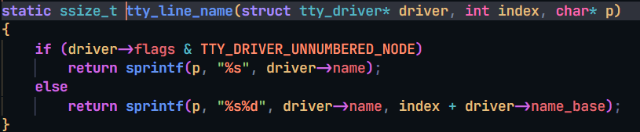
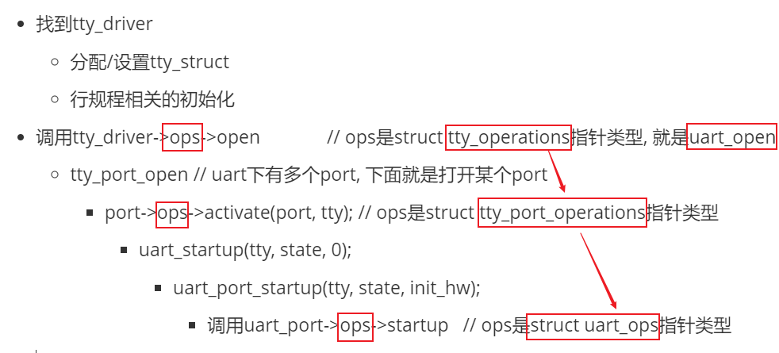
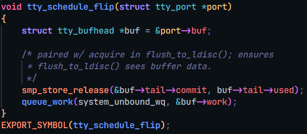
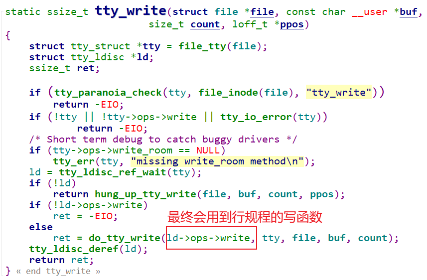
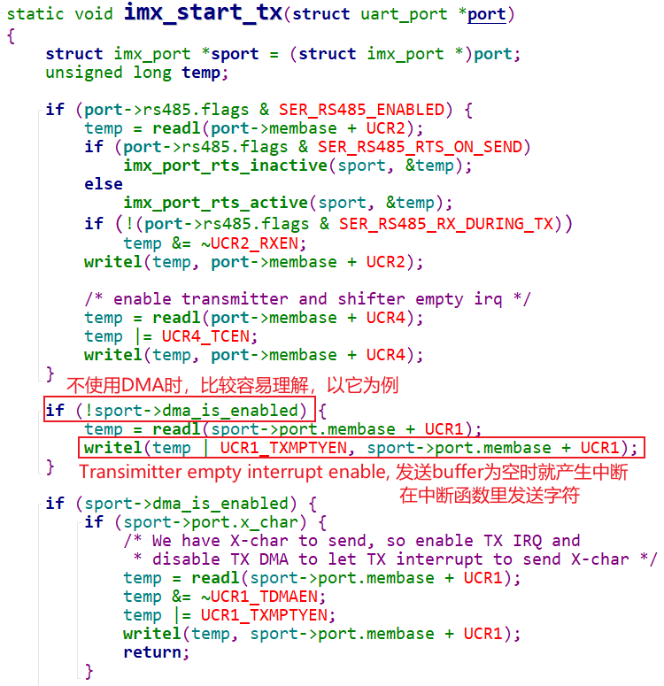

# UART驱动情景分析_open

参考资料

* 参考代码：

    ```shell
    硬件相关：
    drivers/tty/serial/imx.c
    drivers/tty/serial/stm32-usart.c
    
    串口核心层：
    drivers/tty/serial/serial_core.c
    
    TTY层:
    drivers/tty/tty_io.c
    ```


## 1. 情景分析大纲

* 注册过程分析
* open过程分析
* read过程分析
* write过程分析

## 2. 源码框架回顾


## 3. 设备节点是哪个

* 为什么是/dev/ttymxc、/dev/ttySTM？ 名字怎么确定的?

* 为什么是/dev/ttymxc5、/dev/ttySTM3？ 名字后面的数字是怎么确定的?

回顾一下普通的字符驱动程序, 是如何创建字符设备节点的:

- `class_create` 宏 会在`sysfs虚拟文件系统`中, 以`创建类的方式`创建一些信息, Linux系统会有程序帮你用这些信息创建设备节点. 
- 创建信息的方式, 就是创建类.  然后在这个类下, 创建设备节点.
- **device_create** 函数的参数中提供, 设备节点的主次设备号, 设备节点的名字, 已经使用到的类等信息. 然后就会有程序帮你自动创建一个节点. 而不用mknod自己来.
    - 这里有个device, 他会创建一个device, 这就是核心.

**tty_register_device_attr** 函数中:

- 
    - 分配了一个dev类, 然后给他设置一个class, 设置设备名字(/dev/xxx). name 这个参数就是上面 tty_line_name设置的.
    - 
    - tty_driver是来自 uart_driver 的. `normal->name = drv->dev_name;` normal就是由uart_driver创建的tty_driver
        - 
        - `#define DEV_NAME "ttymxc"` 所以 ttymxc 的原因找到了. STM32MP157 的流程也差不多.
    - 后面的数字如上上图, `%d` 是 `index + driver->name_base`. `driver->name_base` 这个前面没有设置, 默认是0. 所以就由`index`决定.
        - index 的实参是 `uport->line`. 而`uport`又来自 **serial_imx_probe** 的 `sport->port`.  probe里先调用**serial_imx_probe_dt**(sport, pdev); 来设置line, 用的是`设备树里的uart的别名`. 
        - 如果失败再调用**serial_imx_probe_pdata**函数, 里面`sport->port.line = pdev->id;`来设置line成员. pdev 就是**serial_imx_probe** 的参数 `struct platform_device* pdev`, 来自`设备树`转换而来的platform_device. 
        - 
        - `别名`里, 6ull的设备树 `uart1` 就是 `serial0`. 所以,uport->line就是0, 那么6ull的tty名字就是 /dev/ttymxc0.
        - probe 函数中调用 **serial_imx_probe_dt**, 这个函数 **of_alias_get_id**(np, "serial"); 从device_node结构体里取出别名, 赋值给`sport->port.line`. 
        - 所以ttymxc后面的0就是这么来的.

## 4. open过程分析

它要做的事情：

* 找到之前注册的tty_driver

    * 分配/设置tty_struct
    * 行规程相关的初始化

* 调用tty_driver->ops->open              // ops是struct tty_operations指针类型, 就是uart_open

    * tty_port_open // uart下有多个port, 下面就是打开某个port
        * port->ops->activate(port, tty); // ops是struct tty_port_operations指针类型
            * uart_startup(tty, state, 0);
                * uart_port_startup(tty, state, init_hw);
                    * 调用uart_port->ops->startup   // ops是struct uart_ops指针类型

图形化说明：有3种ops：

- 

- 
    - 用定义的uart_driver来构造tty_driver. 构造好之后 向上注册, 注册好之后, 就是一个tty_driver. 这个tty_driver是串口自己的. 如何体现串口的特性? 有些tty_driver是来支持键盘的, 就需要设置tty_operations 结构体, 设置成串口自己提供的操作函数. `tty_set_operations(normal, &uart_ops);`
    - tty_driver继续向上注册.
    - 再看一下右边: 注册uart_port. uart_add_one_port, 在注册uart_port的时候, 有一个port.ops成员, 被赋值了uart_ops结构体 imx_pops.   sport**->**port**.**ops = &imx_pops;
    - 我们给某个uart_driver注册一个uart_port的时候, 用的是uart_add_one_port接口. 会导致在tty_driver这边, 会为那个port分配一个cdev, cdev里面又有fpos成员. driver**->**cdevs[index]**->**ops = &tty_fops;
        - 设置好之后, 再cdev_add. 看这个函数. **tty_cdev_add**(driver, devt, index, 1); 
        - dev**->**class  = tty_class;  tty_class 在 **static** int __init **tty_class_init**(void); 里被创建了.
        - 最后创建设备, **device_register**(dev); APP就可以打开这个设备结点了.
        - APP open设备节点时, 就会导致cdev.fops里的open被调用.
    - 我们就可以猜测 open 的过程:
        - 先找到tty_driver, 然后构造tty_struct放在tty_driver结构里的对应成员存放, 行规程相关的初始化
        - 调用tty_driver结构体里tty_operations成员(是uart_ops)里的open函数.
        - 调用硬件ops(`struct uart_ops`)中的函数.
    - 前面 uart_add_one_port -> tty_cdev_add中, 有`driver->cdevs[index]->ops = &tty_fops;` 这个tty_fops 
        - 
        - 看下面:

### 4.1 tty_open

```c
tty_open
    // 如果设备节点是(5,0)也就是/dev/tty, 表示当前TTY
    // 对于普通串口, 第一次open时必定失败
    tty = tty_open_current_tty(device, filp);

	// 第一次open串口时走这个分支
	if (!tty)
        // 通过driver来open tty，就是找到tty_driver，然后分配/设置tty_struct
		tty = tty_open_by_driver(device, inode, filp);
				// 1. 先找到对应的tty_driver
				driver = tty_lookup_driver(device, filp, &index);

				// 2. 如果曾经open过，会有对应的tty_struct
				tty = tty_driver_lookup_tty(driver, filp, index);

				// 3. 第1打开这个串口时肯定没有对应的tty_struct
                //    所以使用下面的函数初始化设备
				tty = tty_init_dev(driver, index);
							// 3.1 分配tty_strct
							tty = alloc_tty_struct(driver, idx);
										tty->ops = driver->ops;
							
							// 3.2 安装tty: 也就是driver->ttys[tty->index] = tty;
							retval = tty_driver_install_tty(driver, tty);

							// 3.3 调用行规程的open函数, 过于复杂，不分析
							//     n_tty.c中的n_tty_open函数
							retval = tty_ldisc_setup(tty, tty->link);
	......
    // ops是tty_operations类型
    // 对于串口ops就是serial_core.c中的uart_ops
    // uart_open
	if (tty->ops->open)
		retval = tty->ops->open(tty, filp);
	else
		retval = -ENODEV;      
```

- open设备节点就会调用 **struct** file_operations tty_fops 里的open函数. 
- tty_open_by_driver会先找到我们之前注册的tty_driver, 然后分配设置tty_struct. 设置好后, 就`用这个tty_struct来代表这个tty设备`.
    - 这个函数里, 会tty_lookup_driver 寻找对应的tty_driver. 如果以前打开过则用tty_driver_lookup_tty.
    - 第一次打开肯定是没有, 于是接下来初始化设备. **struct** tty_struct* **tty_init_dev** 这个函数.
        - 首先调用 **alloc_tty_struct** 里面 `tty->ops = driver->ops`; 这里是ops就是`tty_set_operations(normal, &uart_ops);`来的.
        - 然后安装.
        - 行规程太复杂不分析.
- tty->ops 刚被赋值 driver**->**ops 这个ops 就是**static** **const** **struct** tty_operations uart_ops. 
    - 调用里面的open, 其实就是调用**uart_open** (serial_core.c). 进入了serial core层了.
    - 看下面: 

### 4.2 uart_open

```c
uart_open
    tty_port_open
    	// ops是tty_port_operations类型，对应serial_core.c中的uart_port_ops
    	// uart_port_activate
		if (port->ops->activate) {
			int retval = port->ops->activate(port, tty);
			if (retval) {
				mutex_unlock(&port->mutex);
				return retval;
			}
		}

uart_port_activate
	uart_startup
    	uart_port_startup
    		// ops是uart_ops类型，在硬件驱动中设置
    		// 硬件相关的驱动中uart_port的uart_ops里必须提供startup函数
    		retval = uport->ops->startup(uport);
```

- **tty_port_open** uart有多个port. 下面就是打开某个port.
    - port->ops 是 **static** **const** **struct** tty_port_operations uart_port_ops. 其中activate成员就是 **uart_port_activate**函数.
    - **uart_port_activate** 函数中, 用**uart_startup** 
    - 
        - 进入**uart_port_startup**函数, retval = uport**->**ops**->**startup(uport); 到这里 port提供的硬件相关函数最终被调用.

- 
    - 从这个过程就可以知道, 我们自己写串口驱动, 就要提供 struct uart_ops. 提供这个startup 函数.

# UART驱动情景分析_read

参考资料

* 参考代码：

    ```shell
    硬件相关：
    drivers/tty/serial/imx.c
    drivers/tty/serial/stm32-usart.c
    
    串口核心层：
    drivers/tty/serial/serial_core.c
    
    TTY层:
    drivers/tty/tty_io.c
    ```


## 1. 情景分析大纲

* 注册过程分析
* open过程分析
* read过程分析
* write过程分析

## 2. 源码框架回顾


- 在串口的shell上, 打字, 删除, 回车执行命令, 回显, 都涉及到行规程.
- 一开始读shell数据, 没有数据, 休眠. 数据由PC而来, 发给开发板的串口. 产生中断. 开发板串口驱动程序会注册一个串口接收中断的服务程序.
- 这个服务程序会去读数据, 数据会传给行规程. 行规程得到数据, 会回显, 并且把数据放到自己的buffer中. 接收到删除键, 就会删除一些内容.
- 当我们按下回车, 行规程就会去唤醒APP. APP就会继续去buffer里读到数据, 然后返回数据, 根据数据来执行某些命令, 或者打印一些错误信息.
- 下面看看串口用哪个行规程:

## 3. 使用哪个行规程

行规程有两层:

- 上一层是 tty_ldisc.c 起管理作用
- 下一层会向上一层注册各种行规程.

### 3.1 行规程注册

文件：`drivers\tty\n_tty.c`

```c
void __init n_tty_init(void)
{
	tty_register_ldisc(N_TTY, &n_tty_ops);
}
```

以后可以通过搜索标号N_TTY找到这个行规程.  这个是通用的.

### 3.2 open设备时确定行规程

```c
tty_open
    tty_open_by_driver
    	tty_init_dev
    		tty = alloc_tty_struct(driver, idx);
					tty_ldisc_init(tty);
						struct tty_ldisc *ld = tty_ldisc_get(tty, N_TTY);
						tty->ldisc = ld;
```

- 打开tty设备过程中, 会初始化行规程, 根据N_TTY找到对应的行规程结构体, 把它保存到tty结构体里. 后面用它来处理数据.

## 4. read过程分析

流程为：

* APP读

    * 使用行规程来读(从行规程的buffer里读)
    * 无数据则休眠(数据的源头在底层硬件)

* UART接收到数据, 产生中断

    * 中断程序从硬件上读入数据
    * 上报数据(即存入某个buffer, 通知行规程)
* 发给行规程
    * 行规程处理(回显等)后存入buffer
    * 行规程唤醒APP

* APP被唤醒后，从行规程buffer中读入数据，返回
    * 

### 4.1 tty_read

文件：`drivers\tty\tty_io.c`


- 里面调用到了, 行规程里的read函数. 就是n_tty_read函数, 看下面.

### 4.2 ldisk read

文件：`drivers\tty\n_tty.c`

函数：`n_tty_read` 

- 里面先声明一个等待队列.   DEFINE_WAIT_FUNC(wait, **woken_wake_function**);


- 没有数据就休眠, 有时局就会去读取数据. copy_from_read_buf().

```c
copy_from_read_buf():
		const unsigned char *from = read_buf_addr(ldata, tail);
										// return &ldata->read_buf[i & (N_TTY_BUF_SIZE - 1)];
		retval = copy_to_user(*b, from, n);
```

- read_buf_addr 获取buffer地址, 然后copy_to_user.

### 4.3 数据源头: 中断

- 4.3.1 IMX6ULL

文件：`drivers\tty\serial\imx.c`

函数：`imx_rxint` imx的串口接收中断处理

```c
imx_rxint
    // 读取硬件状态
    // 得到数据
    // 在对应的uart_port中更新统计信息, 比如sport->port.icount.rx++;
    
    // 把数据存入tty_port里的tty_buffer
    tty_insert_flip_char(port, rx, flg)
    
    // 通知行规程来处理
    tty_flip_buffer_push(port);
    	tty_schedule_flip(port);
			queue_work(system_unbound_wq, &buf->work); // 使用工作队列来处理
				// 对应flush_to_ldisc函数
```

- 注意上面的注释内容.
  - 把数据存入tty_port里的tty_buffer, 这个数据是`未经过行规程处理的`数据.
  - tty_flip_buffer_push 这函数来通知行规程. 这个函数最终会启动工作队列来处理, 启用内核线程. 工作队列里的函数就是flush_to_ldisc函数, 刷到行规程里.
  - 
  
- 回到**serial_imx_probe**函数里, 肯定有注册中断的动作.
    - 
    - 注册接收中断跟发送中断:
        - 
        - 接收中断处理函数: **imx_rxint** 发送中断处理函数: **imx_txint**
        - 硬件收到数据后, 通过中断通路发送中断信息给CPU. 最终会调用`imx_rxint`这个中断服务程序.
        - 
        - 在里面更新统计信息, 读数据.
        - 
        - 把收到的信息存到tty_buffer. tty_buffer里存的是原始数据.
        - 
        - **tty_flip_buffer_push** 调用 **tty_schedule_flip** 
        - 
        - 工作队列里的work就是 **flush_to_ldisc** 函数. 是在tty_buffer初始化的时候, 赋值的. flush_to_ldisc就是负责把数据刷到行规程的.过程很复杂.
        - 


- 4.3.2 STM32MP157

  文件：`drivers\tty\serial\stm32-usart.c`

  函数：`stm32_usart_threaded_interrupt`

```c
stm32_usart_threaded_interrupt
    stm32_usart_receive_chars(port, true);
		// 通过DMA方式得到数据
		stm32_usart_receive_chars_dma(port);
			stm32_usart_push_buffer_dma(port, dma_size);
				// 把数据存入tty_port里的tty_buffer
				dma_count = tty_insert_flip_string(ttyport, dma_start, dma_size);
				// 更新统计信息
				port->icount.rx += dma_count;

		// 通知行规程来处理
		tty_flip_buffer_push(tport);
            tty_schedule_flip(port);
                queue_work(system_unbound_wq, &buf->work); // 使用工作队列来处理
                    // 对应flush_to_ldisc函数
```

# UART驱动情景分析_write

参考资料

* 参考代码：

    ```shell
    硬件相关：
    drivers/tty/serial/imx.c
    drivers/tty/serial/stm32-usart.c
    
    串口核心层：
    drivers/tty/serial/serial_core.c
    
    TTY层:
    drivers/tty/tty_io.c
    ```


## 1. 情景分析大纲

* 注册过程分析
* open过程分析
* read过程分析
* write过程分析

## 2. 源码框架回顾


- APP 写数据, 数据存入行规程的buffer中, 经过处理后 发到serial core层的uart_write. 这函数会使用硬件相关的函数启动发送. 只是启动. 后续的发送由中断或者DMA驱动.

## 3. write过程分析

流程为：

* APP写

    * 使用行规程来写
    * 数据最终存入uart_state->xmit的buffer里

* 硬件发送：怎么发送数据？

    * 使用硬件驱动中uart_ops->start_tx开始发送
    * 具体的发送方法有2种：通过DMA，或通过中断

* 中断方式

    * 方法1：直接使能 tx empty中断，一开始tx buffer为空，在中断里填入数据
    * 方法2：写部分数据到tx fifo，使能中断，剩下的数据再中断里继续发送


### 3.1 tty_write

文件：`drivers\tty\tty_io.c`



- 传入的数据地址在参数 buf. 
- do_tty_write 里用到了行规程里的ops里的write函数. 
- **do_tty_write** 函数中:
    - 拿锁. 申请buf_chunk内存, chunk内存大小保存到 tty_struct里的write_cnt, 内存地址保存到write_buf.
    - 然后循环里, **copy_from_user** 把数据放到 write_buf. 然后用 第一个参数的函数进行发送.
    - 

### 3.2 ldisk write

文件：`drivers\tty\n_tty.c`

函数：`n_tty_write` 

接上面, do_tty_write 的第一个参数就是一个行规程的写函数.


- 我们从最上层的tty io 到了行规程 这一层了. n_tty_write 函数来继续发数据.
- n_tty_write 又调用uart_write

### 3.3 uart_write

文件：`drivers\tty\serial\serial_core.c`

函数：`uart_write` 


- 这个函数是通用函数, 不涉及具体硬件. 所以肯定还要调用硬件相关的发送函数.
- 里面有个环形缓冲区, 这个缓冲区就是struct uart_state里的. 每个串口都有一个struct uart_state. APP发送的数据最终就会放到这个环形缓冲区里.
- 
- 放到环形缓冲区之后, 就调用 **__uart_start** 启动发送.
- 
- 这个函数在serial core层, 与硬件没什么关系. 他会调用硬件相关函数. uart_port结构体里的ops就是硬件驱动程序提供的.
- 进入硬件相关的发送函数.

### 3.4 硬件相关的发送

- IMX6ULL

文件：`drivers\tty\serial\imx.c`

函数：`imx_start_tx`和`imx_txint`

- 我们发送, 就是把数据发送到串口模块的FIFO寄存器里, 串口的控制器就会把FIFO里的数据发送出去.
    - FIFO有个特性, 可以设置它的中断在什么情况下触发. 比如设置为空时, 发送中断信号. 就可以利用中断不断的发送数据.
    - 有两种方法: 
    - 一种是, 一开始就enable 发送中断. 因为一开始的时候FIFO里是空的, 就会触发中断信号. 在发送中断处理函数里, 把数据写进FIFO中去. 等FIFO里的数据发完了, 再次触发中断, 再进行下一次发送.
        - 这种情况下, start_Tx非常简单, 只要使能Tx中断就行.
    - 另一种是, 把部分数据放到FIFO, 然后使能中断, 发送完之后, 再次产生终端.
    - 
        - 这两种方法一样, 第一种是6ull用的, 第二种是157用的.



- 这就是如果不用dma, 就在环形缓冲区为空的时候, 使能发送缓冲区为空的中断, 然后触发中断.

- 一开始时，发送buffer肯定为空，会立刻产生中断：
    - 
    - 发送中断处理函数, 先拿锁, 然后调用发送函数. 把缓冲区的数据发送到对应串口设备的FIFO寄存器里. while循环条件, 是环形缓冲区不为空且FIFO寄存器没满. 满足, 就从环形寄存器往FIFO TX寄存器写入.
    - 发完了, FIFO空了, 又触发中断. 再来一次.


- STM32MP157

  文件：`drivers\tty\serial\stm32-usart.c`

  函数：`stm32_usart_threaded_interrupt`

STM32MP157发送串口数据时，有两种方法：DMA、中断。

我们来分析第二种方式：通过中断来发送数据。

* UART有Tx FIFO，可以往里面写入若干个数据，然后使能中断
* 剩下的数据通过中断函数继续发送：


# UART驱动调试方法

参考资料

* 参考代码：

    ```shell
    硬件相关：
    drivers/tty/serial/imx.c
    drivers/tty/serial/stm32-usart.c
    
    串口核心层：
    drivers/tty/serial/serial_core.c
    
    TTY层:
    drivers/tty/tty_io.c
    ```

* 我们按照数据收发流程来看怎么debug

    * 发 方向: 首先APP调试的时候要把行规程 设置成 raw原始数据模式. 然后就可以write发送数据, 数据经过行规程, serialcore, 硬件相关驱动, 最后从TxD引脚发出去.
        * 我们调试的前提是相信 linux 内核的行规程跟serial core层 不会出错.
        * 我们看看在硬件相关的驱动程序里, 看看入口数据跟出口数据 是不是一样. 
        * 在硬件相关驱动程序的入口 打印接收到的数据, 看看是不是跟app发的一样.
        * 出口也加打印, 在操作发送寄存器的函数里加打印, 看看寄存器里的数据.
        * 
        * 在硬件相关的发送函数之前, 就是uart_write. 它的buf参数, 就是从app来的. 可以把这个buf打印出来
        * 在硬件相关的发送函数里, 如果想看是不是真的发到了硬件上去, 可以看中断服务程序.
        * 
        * 6ull可以在这里打印. 在写到FIFO寄存器之前打印.

    * 收 方向: RxD引脚接收到数据, 触发 中断, 中断服务程序中 读寄存器数据, 然后tty_insert_flip_char函数把数据存到行规程的buffer里. 行规程会去唤醒APP.
        * 收方向, 必须把行规程设置成 RAW模式.
        * 除了RAW 模式 还有其他属性:
        * 
        * 
        * 
        * 
        * 可以在 tty_insert_flip_char之前打印数据出来.


## 1. 怎么得到UART硬件上收发的数据

### 1.1 接收到的原始数据

可以在接收中断函数里把它打印出来，这些数据也会存入UART对应的tty_port的buffer里：


### 1.2 发送出去的数据

所有要发送出去的串口数据，都会通过uart_write函数发送，所有可以在uart_write中把它们打印出来：


## 2. proc文件

如果不想加打印, 就可以看这里.

### 2.1 /proc/interrupts

查看中断次数。接收跟发送数据 都会产生中断.

cat /proc/interrupts  可以看看是不是真的发生了中断.

### 2.2 /proc/tty/drivers


- 看系统中支持哪些串口驱动.

### 2.3 /proc/tty/driver(非常有用)


- 这个是driver 没有s, 它可以看这些驱动里的统计信息. 上面那个是看支持多少个驱动.
- 串口发送跟接收的时候会有变量++, 这里就可以看到.

### 2.4 /proc/tty/ldiscs


### 3. sys文件

在`drivers\tty\serial\serial_core.c`中, 有如下代码:


这写代码会在/sys目录中创建串口的对应文件，查看这些文件可以得到串口的很多参数。

怎么找到这些文件？在开发板上执行：

```shell
cd /sys
find -name uartclk  // 就可以找到这些文件所在目录
```

# 编写虚拟UART驱动程序_框架

* 参考代码

    ```shell
    硬件相关：
    drivers/tty/serial/imx.c
    drivers/tty/serial/stm32-usart.c
    
    串口核心层：
    drivers/tty/serial/serial_core.c
    
    TTY层:
    drivers/tty/tty_io.c
    ```

* 本节课程源码在GIT仓库里

    ```shell
    doc_and_source_for_drivers\IMX6ULL\source\09_UART
    	04_virtual_uart_driver
    doc_and_source_for_drivers\STM32MP157\source\A7\09_UART
    	04_virtual_uart_driver
    ```


## 1. 框架回顾


- 涉及到 TTY IO, 行规程, serial core 层, 关注的重点在于 硬件相关的串口驱动程序.
- 工作中, 如果串口有问题, 要修改调试的话. 也是把精力放到 硬件相关的串口驱动程序
- 跑linux 的soc板子一般都会有串口程序了. 所以一般不需要为某个真实的板子串口写驱动程序.
- 写虚拟串口程序, 一是因为一般串口驱动都是厂家写好了. 二是可以避免硬件相关操作.

## 2. 编写UART驱动要做的事

- 硬件相关的驱动, 分左右两边.


* 注册一个uart_driver：它里面有名字、主次设备号等
* 对于每一个port，调用uart_add_one_port，里面的核心是uart_ops，提供了`硬件操作`函数
    * 注册port 又可以分为左右两边: 
        * 左边是一个虚拟平台总线驱动, 右边就是一个设备树节点.
        * 内核解析设备树, 跟虚拟平台驱动程序匹配, 匹配之后, 调用probe函数.
        * probe函数里, 用设备树节点的硬件信息, 来构造注册一个uart_port.

    * uart_add_one_port由platform_driver的probe函数调用
    * 所以要做的事：
        * 一 编写设备树节点
        * 二 注册platform_driver , probe函数构造注册uart_port
        * 三 注册uart_driver


## 3. 虚拟的UART


为了做实验，我们还要创建一个虚拟文件：/proc/virt_uart_buf

* 要发数据给虚拟串口时，执行：echo "xxx" > /proc/virt_uart_buf
* 要读取虚拟串口的数据时，执行：cat /proc/virt_uart_buf

对于真正的串口

- FIFO 空的时候产生Tx中断, 收到信息的时候, 产生Rx中断. 发送跟接收中断可以合二为一发给GIC.

对于虚拟的串口

- 发送 可以不用中断. 接收用中断. 
- 接收的时候, 把数据存入buffer就产生中断. 
- 我们需要看datasheet找到GIC SPI的保留中断号来用.


## 4. 编程

### 4.1 编写设备树

### 4.2 编写uart_driver

### 4.3 编写platform_driver

### 4.4 实现uart_ops

### 4.5 实现/proc/virt_uart_buf

# 编写虚拟UART驱动程序\_实现uart_ops

* 参考代码

    ```shell
    硬件相关：
    drivers/tty/serial/imx.c
    drivers/tty/serial/stm32-usart.c
    
    串口核心层：
    drivers/tty/serial/serial_core.c
    
    TTY层:
    drivers/tty/tty_io.c
    ```

* 本节课程源码在GIT仓库里

    ```shell
    doc_and_source_for_drivers\IMX6ULL\source\09_UART
    	05_virtual_uart_driver_uart_ops
    doc_and_source_for_drivers\STM32MP157\source\A7\09_UART
    	05_virtual_uart_driver_uart_ops
    ```

## 1. 虚拟UART的驱动组成


- probe函数里去设置uart_port, 然后注册. 设置的时候, uart_ops要设置什么内容, 这是重点跟难点.
- 从使用角度看, 有波特率, 数据位, 停止位等等. 还有读数据, 写数据. 这三大块.

## 2. 虚拟UART的数据流程


为了做实验，我们还要创建一个虚拟文件：/proc/virt_uart_buf

* 要发数据给虚拟串口时，执行：echo "xxx" > /proc/virt_uart_buf
* 要读取虚拟串口的数据时，执行：cat /proc/virt_uart_buf

## 3. 编写uart_ops

# 编写虚拟UART驱动程序\_实现数据传输

* 参考代码

    ```shell
    硬件相关：
    drivers/tty/serial/imx.c
    drivers/tty/serial/stm32-usart.c
    
    串口核心层：
    drivers/tty/serial/serial_core.c
    
    TTY层:
    drivers/tty/tty_io.c
    ```

    

* 本节课程源码在GIT仓库里

    ```shell
    doc_and_source_for_drivers\IMX6ULL\source\09_UART
    	06_virtual_uart_driver_txrx
    doc_and_source_for_drivers\STM32MP157\source\A7\09_UART
    	06_virtual_uart_driver_txrx
    ```

## 1. 虚拟UART的驱动组成

## 2. 虚拟UART的数据流程


- 先创建虚拟的文件. 应用程序读写这个文件, 肯定会触发驱动程序里这个文件的read write函数.
- 写 操作: APP写到file中, 触发这个文件的write操作, 写到某个buffer里, 产生Rx中断, buffer上报给行规程.
- 读 : APP read, 无数据休眠. 内核收到数据, 存到buffer, 唤醒APP的读操作.

## 3. 实现/proc文件

如何创建一个虚拟文件, 参考`/proc/cmdline`, 怎么找到它对应的驱动? 在Linux内核源码下执行以下命令搜索:

```shell
grep "cmdline" * -nr | grep proc
```

得到:

```shell
fs/proc/cmdline.c:26:   proc_create("cmdline", 0, NULL, &cmdline_proc_fops);
```

所以, 参考 cmdline.c 就行. 

## 4. 触发中断

使用如下函数：

```c
int irq_set_irqchip_state(unsigned int irq, enum irqchip_irq_state which,
			  bool val);
```

怎么找到它的？在中断子系统中，我们知道往GIC寄存器GICD_ISPENDRn写入某一位就可以触发中断。内核代码中怎么访问这些寄存器？
在`drivers\irqchip\irq-gic.c`中可以看到irq_chip中的"irq_set_irqchip_state"被用来设置中断状态：

```c
static struct irq_chip gic_chip = {
	.irq_mask		= gic_mask_irq,
	.irq_unmask		= gic_unmask_irq,
	.irq_eoi		= gic_eoi_irq,
	.irq_set_type		= gic_set_type,
	.irq_get_irqchip_state	= gic_irq_get_irqchip_state,
	.irq_set_irqchip_state	= gic_irq_set_irqchip_state, /* 2. 继续搜"irq_set_irqchip_state" */
	.flags			= IRQCHIP_SET_TYPE_MASKED |
				  IRQCHIP_SKIP_SET_WAKE |
				  IRQCHIP_MASK_ON_SUSPEND,
};

static int gic_irq_set_irqchip_state(struct irq_data *d,
				     enum irqchip_irq_state which, bool val)
{
	u32 reg;

	switch (which) {
	case IRQCHIP_STATE_PENDING:
		reg = val ? GIC_DIST_PENDING_SET : GIC_DIST_PENDING_CLEAR; /* 1. 找到寄存器 */
		break;

	case IRQCHIP_STATE_ACTIVE:
		reg = val ? GIC_DIST_ACTIVE_SET : GIC_DIST_ACTIVE_CLEAR;
		break;

	case IRQCHIP_STATE_MASKED:
		reg = val ? GIC_DIST_ENABLE_CLEAR : GIC_DIST_ENABLE_SET;
		break;

	default:
		return -EINVAL;
	}

	gic_poke_irq(d, reg);
	return 0;
}
```


继续搜"irq_set_irqchip_state"，在`drivers\irqchip\irq-gic.c`中可以看到：

```c
int irq_set_irqchip_state(unsigned int irq, enum irqchip_irq_state which,
			  bool val)
{
    ......
}

EXPORT_SYMBOL_GPL(irq_set_irqchip_state);
```


以后就可与使用如下代码触发某个中断：

```c
irq_set_irqchip_state(irq, IRQCHIP_STATE_PENDING, 1);
```

## 流程总结

发数据: 执行 echo xx > /proc/virt_port_buf, 导致**virt_uart_buf_write** 被调用, 里面把数据copy到rxbuf中, 然后产生RX中断. 导致 **virt_uart_rxint** 中断处理函数被调用. 这个中断处理函数, 把rxbuf中的数据取出, 放到行规程里去. 放完之后, 通知行规程处理.

收数据: 假设以后用这个虚拟串口启动一个shell, 这个shell会把结果发送虚拟串口, **virt_start_tx** 就会被执行. 这个函数把数据放到tx_buf里. 另一个程序执行 cat /proc/virt_port_buf, 就会导致**virt_uart_buf_read** 被调用.

# 编写虚拟UART驱动程序_调试

* 参考代码

    ```shell
    硬件相关：
    drivers/tty/serial/imx.c
    drivers/tty/serial/stm32-usart.c
    
    串口核心层：
    drivers/tty/serial/serial_core.c
    
    TTY层:
    drivers/tty/tty_io.c
    ```

* 本节课程源码在GIT仓库里

    ```shell
    doc_and_source_for_drivers\IMX6ULL\source\09_UART
    	07_virtual_uart_driver_ok
    doc_and_source_for_drivers\STM32MP157\source\A7\09_UART
    	07_virtual_uart_driver_ok
    ```

## 1. 实验流程


## 2. 上机实验

### 2.1 设置工具链

1. STM32MP157

  ```shell
export ARCH=arm
export CROSS_COMPILE=arm-buildroot-linux-gnueabihf-
export PATH=$PATH:/home/book/100ask_stm32mp157_pro-sdk/ToolChain/arm-buildroot-linux-gnueabihf_sdk-buildroot/bin
  ```

2. IMX6ULL

  ```shell
export ARCH=arm
export CROSS_COMPILE=arm-linux-gnueabihf-
export PATH=$PATH:/home/book/100ask_imx6ull-sdk/ToolChain/gcc-linaro-6.2.1-2016.11-x86_64_arm-linux-gnueabihf/bin
  ```

### 2.2 编译、替换设备树

1. STM32MP157

  * 修改`arch/arm/boot/dts/stm32mp157c-100ask-512d-lcd-v1.dts`，添加如下代码：

    ```shell
    / {
    	virtual_uart: virtual_uart_100ask {
    		compatible = "100ask,virtual_uart";
    		
    		interrupt-parent = <&intc>;
    		interrupts = <GIC_SPI 99 IRQ_TYPE_LEVEL_HIGH>;
    		
    	};
    };
    ```

  * 编译设备树：
    在Ubuntu的STM32MP157内核目录下执行如下命令,
    得到设备树文件：`arch/arm/boot/dts/stm32mp157c-100ask-512d-lcd-v2.dtb`

    ```shell
    make dtbs
    ```

  * 复制到NFS目录：

    ```shell
    $ cp arch/arm/boot/dts/stm32mp157c-100ask-512d-lcd-v2.dtb ~/nfs_rootfs/
    ```

  * 开发板上挂载NFS文件系统

    * vmware使用NAT(假设windowsIP为192.168.2.100)

        ```shell
        [root@100ask:~]# mount -t nfs -o nolock,vers=3,port=2049,mountport=9999 
        192.168.2.100:/home/book/nfs_rootfs /mnt
        ```

    * vmware使用桥接，或者不使用vmware而是直接使用服务器：假设Ubuntu IP为192.168.2.137

        ```shell
        [root@100ask:~]#  mount -t nfs -o nolock,vers=3 192.168.2.137:/home/book/nfs_rootfs /mnt
        ```

* 更新设备树

    ```shell
    [root@100ask:~]# mount  /dev/mmcblk2p2  /boot
    [root@100ask:~]# cp /mnt/stm32mp157c-100ask-512d-lcd-v1.dtb /boot
    [root@100ask:~]# sync
    ```

* 重启开发板


2. IMX6ULL

  * 修改`arch/arm/boot/dts/100ask_imx6ull-14x14.dts`，添加如下代码：

    ```shell
    / {
    	virtual_uart: virtual_uart_100ask {
    		compatible = "100ask,virtual_uart";
    		
    		interrupt-parent = <&intc>;
    		interrupts = <GIC_SPI 99 IRQ_TYPE_LEVEL_HIGH>;
    		
    	};
    
    };
    ```

  * 编译设备树：
    在Ubuntu的IMX6ULL内核目录下执行如下命令,
    得到设备树文件：`arch/arm/boot/dts/100ask_imx6ull-14x14.dtb`

    ```shell
    make dtbs
    ```

  * 复制到NFS目录：

    ```shell
    $ cp arch/arm/boot/dts/100ask_imx6ull-14x14.dtb ~/nfs_rootfs/
    ```

* 开发板上挂载NFS文件系统

    * vmware使用NAT(假设windowsIP为192.168.2.100)

        ```shell
        [root@100ask:~]# mount -t nfs -o nolock,vers=3,port=2049,mountport=9999 
        192.168.2.100:/home/book/nfs_rootfs /mnt
        ```

    * vmware使用桥接，或者不使用vmware而是直接使用服务器：假设Ubuntu IP为192.168.2.137

        ```shell
        [root@100ask:~]#  mount -t nfs -o nolock,vers=3 192.168.2.137:/home/book/nfs_rootfs /mnt
        ```

    * 更新设备树

        ```shell
        [root@100ask:~]# cp /mnt/100ask_imx6ull-14x14.dtb /boot
        [root@100ask:~]# sync
        ```

* 重启开发板

### 2.3 编译、安装驱动程序

* 编译：

    * 在Ubuntu上
    * 修改`07_virtual_uart_driver_ok`中的Makefile，指定内核路径`KERN_DIR`，在执行`make`命令即可。

* 安装：

    * 在开发板上

    * 挂载NFS，复制文件，insmod，类似如下命令：

        ```shell
        mount -t nfs -o nolock,vers=3 192.168.2.137:/home/book/nfs_rootfs /mnt
        // 对于IMX6ULL，想看到驱动打印信息，需要先执行
        echo "7 4 1 7" > /proc/sys/kernel/printk
        
        insmod -f /mnt/virtual_uart.ko
        
        ```

* 观察内核打印的信息

## 3. 调试

根据框架、数据流程来调试

- 如果你在 **virtual_uart_probe** 里, 不给 **struct** uart_port*    virt_port 设置 type的话, 就会导致 Error.
    - 
    - 
- 然后在 uart_port_startup函数中, 并没有判断是否提供 startup函数, 我们必须提供这个函数.
    - 
