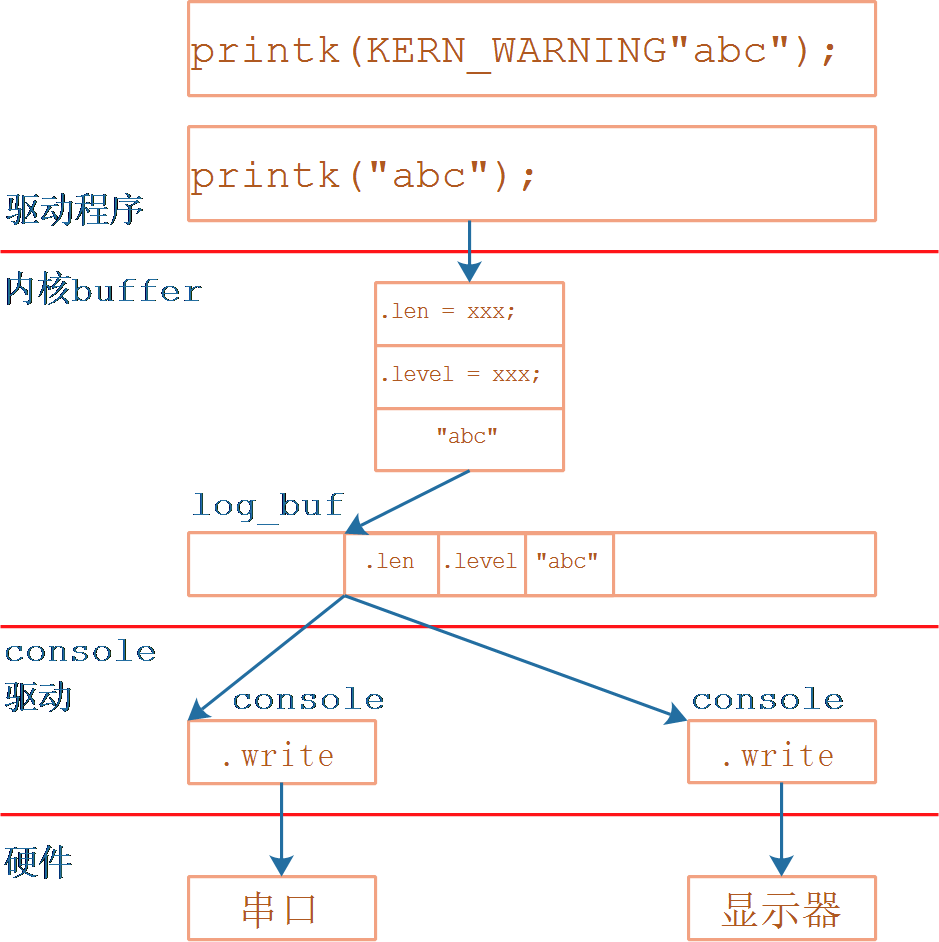
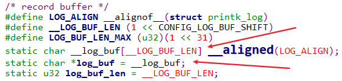
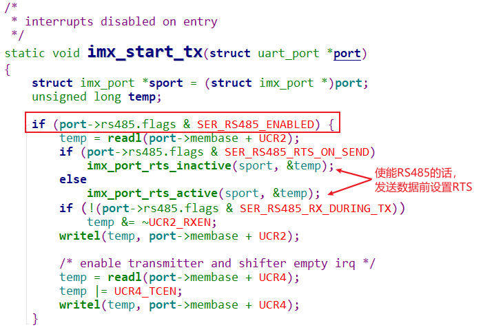

# printk执行过程

* 参考代码

    * Linux 4.9.88

        ```shell
        kernel/printk.c
        include/linux/kernel.h
        kernel/printk/internal.h
        ```

    * Linux 5.4

        ```shell
        kernel/printk.c
        include/linux/kernel.h
        kernel/printk/printk_safe.c
        ```


## 1.  printk的使用



- 信息最终存入内核buffer. printk内部会处理这信息, 会构造一个结构体, printk_log 里面记录长度, 等级跟消息本身.
- 信息存放在内核个log_buf. 
- 最后这些信息会通过console驱动程序提供的write函数 发送到硬件上去.

### 1.1  printk使用示例

调试内核、驱动的最简单方法，是使用printk函数打印信息。

printk函数与用户空间的printf函数格式完全相同，它所打印的字符串头部可以加入“\001n”样式的字符。

其中n为0～7，表示`这条信息的记录级别`，n数值越小级别越高。

**注意**：linux 2.x内核里，打印级别是用"`<n>`"来表示。

在驱动程序中，可以这样使用printk：

```c
printk("This is an example\n");
printk("\0014This is an example\n");
printk("\0014""This is an example\n");
printk(KERN_WARNING"This is an example\n");
```

在上述例子中：

* 第一条语句没有明确表明打印级别，它被处理前内核会在前面添加`默认的打印级别`："<4>"

* KERN_WARNING是一个宏，它也表示打印级别：

```c
#define KERN_SOH	"\001"		/* ASCII Start Of Header */
#define KERN_WARNING	KERN_SOH "4"	/* warning conditions */
```

现在我们知道了，内核的每条打印信息都有自己的级别，当自己的级别在数值上小于某个阈值时，内核才会打印该信息。

### 1.2 printk函数的记录级别

在内核代码`include/linux/kernel.h`中，下面几个宏确定了printk函数怎么处理打印级别：

```c
#define console_loglevel (console_printk[0])
#define default_message_loglevel (console_printk[1])
#define minimum_console_loglevel (console_printk[2])
#define default_console_loglevel (console_printk[3])
```

 

举例说明这几个宏的含义：

① 对于printk(“<n>……”)，只有n小于console_loglevel时，这个信息才会被打印。

② 假设default_message_loglevel的值等于4，如果printk的参数开头没有“`<n>`”样式的字符，则在printk函数中进一步处理前会自动加上“<4>”；

③ minimum_console_logleve是一个预设值，平时不起作用。通过其他工具来设置console_loglevel的值时，这个值不能小于minimum_console_logleve。

④ default_console_loglevel也是一个预设值，平时不起作用。它表示设置console_loglevel时的默认值，通过其他工具来设置console_loglevel的值时，用到这个值。

 

上面代码中，console_printk是一个数组，它在kernel/printk.c中定义：

```c
/* 数组里的宏在include/linux/printk.h中定义
 */
int console_printk[4] = {
	CONSOLE_LOGLEVEL_DEFAULT,	/* console_loglevel */
	MESSAGE_LOGLEVEL_DEFAULT,	/* default_message_loglevel */
	CONSOLE_LOGLEVEL_MIN,		/* minimum_console_loglevel */
	CONSOLE_LOGLEVEL_DEFAULT,	/* default_console_loglevel */
};

/* Linux 4.9.88 include/linux/printk.h */
#define CONSOLE_LOGLEVEL_DEFAULT 7 /* anything MORE serious than KERN_DEBUG */
#define MESSAGE_LOGLEVEL_DEFAULT CONFIG_MESSAGE_LOGLEVEL_DEFAULT
#define CONSOLE_LOGLEVEL_MIN	 1 /* Minimum loglevel we let people use */

/* Linux 5.4 include/linux/printk.h */
#define CONSOLE_LOGLEVEL_DEFAULT CONFIG_CONSOLE_LOGLEVEL_DEFAULT
#define MESSAGE_LOGLEVEL_DEFAULT CONFIG_MESSAGE_LOGLEVEL_DEFAULT
#define CONSOLE_LOGLEVEL_MIN	 1 /* Minimum loglevel we let people use */
```

 

### 1.3 在用户空间修改printk函数的记录级别

挂接proc文件系统后，读取/proc/sys/kernel/printk文件可以得知console_loglevel、default_message_loglevel、minimum_console_loglevel和default_console_loglevel这4个值。

比如执行以下命令，它的结果“7 4 1 7”表示这4个值：


也可以直接修改/proc/sys/kernel/printk文件来改变这4个值，比如：

```shell
# echo "1 4 1 7" > /proc/sys/kernel/printk
```

这使得console_loglevel被改为1，于是所有的printk信息都不会被打印。

 

### 1.4 printk函数记录级别的名称及使用

在内核代码include/linux/kernel.h中，有如下代码，它们表示0～7这8个记录级别的名称：

```c
#define KERN_SOH	"\001"		/* ASCII Start Of Header */
#define KERN_SOH_ASCII	'\001'

#define KERN_EMERG	KERN_SOH "0"	/* system is unusable */
#define KERN_ALERT	KERN_SOH "1"	/* action must be taken immediately */
#define KERN_CRIT	KERN_SOH "2"	/* critical conditions */
#define KERN_ERR	KERN_SOH "3"	/* error conditions */
#define KERN_WARNING	KERN_SOH "4"	/* warning conditions */
#define KERN_NOTICE	KERN_SOH "5"	/* normal but significant condition */
#define KERN_INFO	KERN_SOH "6"	/* informational */
#define KERN_DEBUG	KERN_SOH "7"	/* debug-level messages */

```


在使用printk函数时，可以这样使用记录级别；

```c
printk(KERN_WARNING”there is a warning here!\n”)
```

## 2.  printk执行过程

### 2.1  函数调用过程

在嵌入式Linux开发中，printk信息常常从串口输出，这时串口被称为串口控制台。从内核kernel/printk.c的printk函数开始，往下查看它的调用关系，可以知道printk函数是如何与具体设备的输出函数挂钩的。

printk函数调用的子函数的主要脉落如下：

```c
printk
    // linux 4.9: kernel/printk/internal.h
    // linux 5.4: kernel/printk/printk_safe.c
    vprintk_func 
    	vprintk_default(fmt, args);
			vprintk_emit
                vprintk_store // 把要打印的信息保存在log_buf中 4.9.88是log_store.
                	log_output
                
                preempt_disable();
                if (console_trylock_spinning())
                    console_unlock();
                preempt_enable();

console_unlock
	for (;;) {
    	
        msg = log_from_idx(console_idx);
        if (suppress_message_printing(msg->level)) {
            /* 如果消息的级别数值大于console_loglevel, 则不打印此信息 */
        }
        
    	printk_safe_enter_irqsave(flags);
		call_console_drivers(ext_text, ext_len, text, len); //调用console驱动
		printk_safe_exit_irqrestore(flags);
    }
```

- call_console_drivers函数调用驱动程序打印信息，此函数在`kernel\printk\printk.c`中，代码如下：
    - 
    - 所以打印printk是关中断来打印的, 所以printk信息越多, 越影响性能.


### 2.2 内核打印信息保存在哪

我们执行`dmesg`命令可以打印以前的内核信息，所以这些信息必定是保存在内核buffer中。

在`kernel\printk\printk.c`中，定义有一个全局buffer：




执行`dmesg`命令时，它就是访问虚拟文件`/proc/kmsg`，把log_buf中的信息打印出来。


### 2.3 printk信息从哪些设备打印出来？

在内核的启动信息中，有类似这样的命令行参数：

```shell
/* IMX6ULL */
[root@100ask:~]# cat /proc/cmdline
console=ttymxc0,115200 root=/dev/mmcblk1p2 rootwait rw

/* STM32MP157 */
[root@100ask:~]# cat /proc/cmdline
root=PARTUUID=491f6117-415d-4f53-88c9-6e0de54deac6 rootwait rw console=ttySTM0,115200
```

在命令行参数中，"console=ttymxc0"、"console=ttySTM0"就是用来选择printk设备的。

可以指定多个"console="参数，表示从多个设备打印信息。


命令行信息来自哪里？一般来说是设备树.

* 设备树

    ```c
    / {
    	chosen {
                    bootargs = "console=ttymxc1,115200";
            };
    };
    ```

* `UBOOT`根据环境参数修改设备树：IMX6ULL 强大的uboot利用bootargs参数 来偷偷的修改设备树.

    ```c
    /* 进入IMX6ULL的UBOOT */
    => print mmcargs
    mmcargs=setenv bootargs console=${console},${baudrate} root=${mmcroot}
    => print console
    console=ttymxc0
    => print baudrate
    baudrate=115200
    ```

* `UBOOT`从启动文件修改设备树：STM32MP157 更强大的uboot, 从flash上读取配置文件, 偷偷帮你修改设备树.

    ```c
    [root@100ask:~]# mount /dev/mmcblk2p2 /boot
    [root@100ask:~]# cd /boot
    [root@100ask:/boot]# cat mmc0_extlinux/stm32mp157c-100ask-512d-v1_extlinux.conf
    # Generic Distro Configuration file generated by OpenEmbedded
    menu title Select the boot mode
    MENU BACKGROUND /splash.bmp
    TIMEOUT 20
    DEFAULT 100ask-lcd
    LABEL 100ask-core
            KERNEL /uImage
            FDT /stm32mp157c-100ask-512d-v1.dtb
            INITRD /uInitrd
            APPEND root=/dev/mmcblk1p5  rootwait rw console=ttySTM0,115200
    LABEL 100ask-hdmi
            KERNEL /uImage
            FDT /stm32mp157c-100ask-512d-hdmi-v1.dtb
            INITRD /uInitrd
            APPEND root=/dev/mmcblk1p5  rootwait rw console=ttySTM0,115200
    LABEL 100ask-lcd
            KERNEL /uImage
            FDT /stm32mp157c-100ask-512d-lcd-v1.dtb
            INITRD /uInitrd
            APPEND root=/dev/mmcblk1p5  rootwait rw console=ttySTM0,115200
    ```

## 3. 回顾

printk有打印级别, 有默认级别, 也可以指定级别. 信息存到内核buffer里, dmesg可以随时查看. 消息的级别要小于设置的打印级别 才会被打印.

在什么硬件上打印呢? 来自设备树, 可以是纯净的设备树, 也可能是uboot修改后的设备树.


# console驱动注册过程

* 参考代码

    * Linux 4.9.88

        ```shell
        kernel/printk.c
        include/linux/kernel.h
        kernel/printk/internal.h
        drivers/tty/serial/imx.c
        ```

    * Linux 5.4

        ```shell
        kernel/printk.c
        include/linux/kernel.h
        kernel/printk/printk_safe.c
        drivers/tty/serial/stm32-usart.
        ```

## 1.  回顾printk的使用


上图可以看到有多个console驱动, 我们用哪个来打印呢? 

比如我们可以在 内核启动信息中 加上`console=ttymxc0,115200  console=ttyVIRT0`命令行参数. uboot可以向设备树传递 这个cmdline信息.

- cmdline 参数如何被处理的?
- APP 打开某个/dev/console 对应的是谁? mxc 还是 VIRT? 

## 2. console结构体分析

`include\linux\console.h`:

```c
struct console {
	char	name[16];  // name为"ttyXXX"，在cmdline中用"console=ttyXXX0"来匹配
    // 输出函数
	void	(*write)(struct console *, const char *, unsigned);
	int	    (*read)(struct console *, char *, unsigned);
    // APP访问/dev/console时通过这个函数来确定是哪个(index)设备
    // 举例:
    // a. cmdline中"console=ttymxc1"
    // b. 则注册对应的console驱动时：console->index = 1
    // c. APP访问/dev/console时调用"console->device"来返回这个index
	struct  tty_driver *(*device)(struct console *co, int *index);
	void	(*unblank)(void);
    // 设置函数, 可设为NULL
	int	    (*setup)(struct console *, char *);
    // 匹配函数, 可设为NULL
	int	    (*match)(struct console *, char *name, int idx, char *options);  
	short	flags;   
    // 哪个设备用作console: 
    // a. 可以设置为-1, 表示由cmdline确定
    // b. 也可以直接指定
	short	index;    
    // 常用: CON_PRINTBUFFER
	int	    cflag;
	void	*data;
	struct	 console *next;
};
```

## 3. console驱动注册过程

### 3.1 处理命令行参数

在`kernel\printk\printk.c`中, 可以看到如下代码:

```c
__setup("console=", console_setup);
```

这是`用来处理u-boot通过设备树传给内核的cmdline参数`, 比如cmdline中有如下代码:

```c
console=ttymxc0,115200  console=ttyVIRT0
```

对于这两个"console=xxx"就会`调用console_setup函数两次`, 构造`得到2个数组项`:

```c
struct console_cmdline
{
	char	name[16];			/* Name of the driver	    */
	int	index;				/* Minor dev. to use	    */
	char	*options;			/* Options for the driver   */
#ifdef CONFIG_A11Y_BRAILLE_CONSOLE
	char	*brl_options;			/* Options for braille driver */
#endif
};

static struct console_cmdline console_cmdline[MAX_CMDLINECONSOLES];
```

在cmdline中, 最后的"console=xxx"就是"selected_console"(被选中的console, 对应/dev/console):

- 
- 

### 3.2 register_console

console分为两类，它们通过console结构体的flags来分辨(flags中含有CON_BOOT)：

* bootconsoles：用来打印很早的信息
* real consoles：真正的console

可以注册很多的bootconsoles，但是一旦注册`real consoles`时，所有的bootconsoles都会被注销，并且以后再注册bootconsoles都不会成功。

被注册的console会放在console_drivers链表中，谁放在链表头部？

* 如果只有一个`real consoles`，它自然是放在链表头部
* 如果有多个`real consoles`，"selected_console"(被选中的console)被放在链表头部

放在链表头有什么好处？APP打开"/dev/console"时，就对应它。

```c
uart_add_one_port
    uart_configure_port
    	register_console(port->cons);
```

### 3.3 /dev/console

在`drivers\tty\tty_io.c`中，代码调用过程如下：

```c
tty_open
    tty = tty_open_by_driver(device, inode, filp);
		driver = tty_lookup_driver(device, filp, &index);
			case MKDEV(TTYAUX_MAJOR, 1): {
                struct tty_driver *console_driver = console_device(index);


/* 从console_drivers链表头开始寻找
 * 如果console->device成功，就返回它对应的tty_driver
 * 这就是/dev/console对应的tty_driver
 */ 
struct tty_driver *console_device(int *index)
{
	struct console *c;
	struct tty_driver *driver = NULL;

	console_lock();
	for_each_console(c) {
		if (!c->device)
			continue;
		driver = c->device(c, index);
		if (driver)
			break;
	}
	console_unlock();
	return driver;
}
```


# 编写console驱动

* 参考代码

    * Linux 4.9.88

        ```shell
        kernel/printk.c
        include/linux/kernel.h
        kernel/printk/internal.h
        drivers/tty/serial/imx.c
        ```

        

    * Linux 5.4

        ```shell
        kernel/printk.c
        include/linux/kernel.h
        kernel/printk/printk_safe.c
        drivers/tty/serial/stm32-usart.
        ```

* 本节视频配套源码在GIT仓库里，目录如下

    ```shell
    doc_and_source_for_drivers\IMX6ULL\source\09_UART\
    	08_virtual_uart_driver_console
    
    doc_and_source_for_drivers\STM32MP157\source\A7\09_UART\
    	08_virtual_uart_driver_console
    ```


## 1.  回顾printk的使用


## 2. console结构体分析

`include\linux\console.h`:

```c
struct console {
	char	name[16];  // name为"ttyXXX"，在cmdline中用"console=ttyXXX0"来匹配
    // 输出函数
	void	(*write)(struct console *, const char *, unsigned); 
	int	    (*read)(struct console *, char *, unsigned);
    // APP访问/dev/console时通过这个函数来确定是哪个(index)设备
    // 举例:
    // a. cmdline中"console=ttymxc1"
    // b. 则注册对应的console驱动时：console->index = 1
    // c. APP访问/dev/console时调用"console->device"来返回这个index
	struct  tty_driver *(*device)(struct console *co, int *index);
	void	(*unblank)(void);
    // 设置函数, 可设为NULL
	int	    (*setup)(struct console *, char *);
    // 匹配函数, 可设为NULL
	int	    (*match)(struct console *, char *name, int idx, char *options);  
	short	flags;
    // 哪个设备用作console: 
    // a. 可以设置为-1, 表示由cmdline=ttyVIRT0确定
    // b. 也可以直接指定
	short	index;
    // 常用: CON_PRINTBUFFER
	int	    cflag;
	void	*data;
	struct	 console *next;
};
```

## 3. 编写console驱动

```c
/*
 * Interrupts are disabled on entering
 */
static void virt_uart_console_write(struct console *co, const char *s, unsigned int count)
{
	int i;
	for (i = 0; i < count; i++)
		if (txbuf_put(s[i]) != 0)
			return;
}
struct tty_driver* virt_uart_console_device(struct console* co, int* index)
{//这个函数没有被导出到全局符号表, 自己写一个.
    struct uart_driver* p = co->data;
    *index                = co->index;
    return p->tty_driver;
}
static struct console virt_uart_console = {
	.name		= "ttyVIRT",
	.write		= virt_uart_console_write,
	.device		= uart_console_device,
	.flags		= CON_PRINTBUFFER,
	.index		= -1,
    .data       = &virt_uart_drv,
};

static struct uart_driver virt_uart_drv = {
	.owner          = THIS_MODULE,
	.driver_name    = "VIRT_UART",
	.dev_name       = "ttyVIRT",
	.major          = 0,
	.minor          = 0,
	.nr             = 1,
	.cons           = &virt_uart_console,
};
```

- console 结构体里 index成员 写成-1, 那就是由cmdline 参数来决定. 也可以手动指定.
- 为了让uart_configure_port不跳出去, **virtual_uart_probe**函数里设置 `virt_port->iobase = 1;`
- 不自动配置, 把virt_port**->**flags 改为0. (加打印调试)
- 注意: virt_uart_console_write 函数执行的时候 中断是被禁止的, 它`不能使用中断`, 所以要用查询的方式发数据.

## 4. 上机实验

### 4.1 设置工具链

1. STM32MP157

  ```shell
export ARCH=arm
export CROSS_COMPILE=arm-buildroot-linux-gnueabihf-
export PATH=$PATH:/home/book/100ask_stm32mp157_pro-sdk/ToolChain/arm-buildroot-linux-gnueabihf_sdk-buildroot/bin
  ```

2. IMX6ULL

  ```shell
export ARCH=arm
export CROSS_COMPILE=arm-linux-gnueabihf-
export PATH=$PATH:/home/book/100ask_imx6ull-sdk/ToolChain/gcc-linaro-6.2.1-2016.11-x86_64_arm-linux-gnueabihf/bin
  ```

### 4.2 编译驱动

### 4.3 修改cmdline

1. IMX6ULL

```
在uboot执行:
setenv mmcargs setenv bootargs console=${console},${baudrate} root=${mmcroot} console=ttyVIRT0

然后boot

启动linux后确认:
cat /proc/cmdline

安装驱动程序:
echo "7 4 1 7" > /proc/sys/kernel/printk
insmod virtual_uart.ko
cat /proc/consoles  /* 确认有没有ttyVIRT0 */

cat /proc/virt_uart_buf  /* 查看信息 */

echo hello > /dev/console
cat /proc/virt_uart_buf  /* 查看信息 */
```

2. STM32MP157

```shell
mount /dev/mmcblk2p2 /boot

修改/boot/mmc0_extlinux/和/boot/mmc1_extlinux下的配置文件，
配置文件里的"APPEND"表示cmdline信息,
在"APPEND"行末" console=ttyVIRT0",
在三个"APPEND"语句中都添加

启动linux后确认:
cat /proc/cmdline

安装驱动程序:
insmod virtual_uart.ko
cat /proc/consoles  /* 确认有没有ttyVIRT0 */

cat /proc/virt_uart_buf  /* 查看信息 */

echo hello > /dev/console
cat /proc/virt_uart_buf  /* 查看信息 */
```

## 实验现象:

- 没有加载驱动时, console用的就是6ull自己的控制台. 写进控制台的都会回显打印.
    - 
- console有两个了
    - 

- 读写数据:
    - 
    - 这时候/dev/console就是ttyVIRT0了.
    
    

# early_printk和earlycon

* 参考代码

    * Linux 4.9.88

        ```shell
        arch\arm\kernel\early_printk.c
        drivers\tty\serial\earlycon.c
        ```

    * Linux 5.4

        ```shell
        arch\arm\kernel\early_printk.c
        drivers\tty\serial\earlycon.c
        ```

## 1.  回顾printk的使用


## 2. 内核信息的早期打印

在上节视频里我们实现了console驱动, 它属于`uart_driver`的一部分.

注册了`uart_driver`, 并调用`uart_add_one_port`后, 它里面才`注册console`, 在这之后才能使用printk.

如果想`更早地使用printk函数`, 比如在安装UART驱动之前就使用printk, 这时就需要自己去注册console.

更早地, 单独地注册console, 有两种方法:

* `early_printk`: 自己实现write函数, 不涉及设备树, 简单明了
* `earlycon`: 通过设备树传入硬件信息, 跟内核中驱动程序匹配

earlycon是新的, `推荐的方法`, 在内核已经有驱动的前提下, 通过设备树或cmdline指定寄存器地址即可.

## 3. early_printk

源码为: `arch\arm\kernel\early_printk.c`, 要使用它, 必须实现这几点:

* 配置内核, 选择: `CONFIG_EARLY_PRINTK`
* 内核中实现: `printch函数`
* cmdline中添加: `earlyprintk`


- earlyprintk方式, 需要我们自己提供early_write函数跟printch函数.
- printch 是把字符写到某个寄存器, 所以要有个地址.

## 4. earlycon

### 4.1 提供硬件信息的2种方法

earlycon就是early console的意思，实现的功能跟earlyprintk是一样的，只是更灵活。

我们知道，对于console，最主要的是里面的write函数：它不使用中断，相对简单。

所以很多串口console的write函数，只要`确定寄存器的地址`就很容易实现了。

假设芯片的串口驱动程序，已经在内核里实现了，我们需要根据板子的配置给它提供寄存器地址。

怎么提供？两种方式:

* 设备树
* cmdline参数


- 单独 earlycon 走 early_init_dt_scan_chosen_stdout
- earlycon=xx 走 setup_earlycon
- 他们最终都会 **register_console**. 

### 4.2 设置write函数

在Linux内核中, 已经有完善的earlycon驱动程序, 它们使用`OF_EARLYCON_DECLARE`宏来定义：


问题在于，使用哪一个？

* 如果cmdline中`只有`"earlycon", 不带更多参数: 对应`early_init_dt_scan_chosen_stdout`函数

    * 使用"/chosen"下的"stdout-path"找到节点

    * 或使用"/chosen"下的"linux,stdout-path"找到节点

    * 节点里有"compatible"和"reg"属性

        * 根据"compatible"找到`OF_EARLYCON_DECLARE`, 里面有setup函数, 它会提供write函数
        * write函数写什么寄存器? 在"reg"属性里确定

* 如果cmdline中"`earlycon=xxx`", 带有更多参数: 对应`setup_earlycon`函数

    * earlycon=xxx格式为:

        ```shell
        <name>,io|mmio|mmio32|mmio32be,<addr>,<options>
        <name>,0x<addr>,<options>
        <name>,<options>
        <name>
        ```

    * 根据"`name`"遍历找到`OF_EARLYCON_DECLARE`, 里面有setup函数, 它会提供write函数

    * write函数写什么寄存器？在"addr"参数里确定
    
* 

* 

    * OF_EARLYCON_DECLARE 会用参数, 定义一个 earlycon_id 结构体, 然后把这类结构体, 放到同一个段里.


```c
int __init early_init_dt_scan_chosen_stdout(void)
{
	int offset;
	const char *p, *q, *options = NULL;
	int l;
	const struct earlycon_id *match;
	const void *fdt = initial_boot_params;

	offset = fdt_path_offset(fdt, "/chosen");//找到chosen节点
	if (offset < 0)
		offset = fdt_path_offset(fdt, "/chosen@0");//没有再找这个
	if (offset < 0)
		return -ENOENT; //都没有返回错误.

	p = fdt_getprop(fdt, offset, "stdout-path", &l); //继续找这个
	if (!p)
		p = fdt_getprop(fdt, offset, "linux,stdout-path", &l);
	if (!p || !l)
		return -ENOENT;

	q = strchrnul(p, ':');
	if (*q != '\0')
		options = q + 1;
	l = q - p;
   //根据stdout-path属性找到 对应的节点
	/* Get the node specified by stdout-path */
	offset = fdt_path_offset_namelen(fdt, p, l);
	if (offset < 0) {
		pr_warn("earlycon: stdout-path %.*s not found\n", l, p);
		return 0;
	}

	for (match = __earlycon_table; match < __earlycon_table_end; match++) {
		if (!match->compatible[0])
			continue;
/*根据compatible找到 用OF_EARLYCON_DECLARE声明的earlycon_id结构体*/
		if (fdt_node_check_compatible(fdt, offset, match->compatible))
			continue;
/*找到之后设置*/
		of_setup_earlycon(match, offset, options);
		return 0;
	}
	return -ENODEV;
}

```

```c
int __init of_setup_earlycon(const struct earlycon_id *match,
			     unsigned long node,
			     const char *options)
{
	int err;
	struct uart_port *port = &early_console_dev.port;
	const __be32 *val;
	bool big_endian;
	u64 addr;
/*去节点里取属性*/
	spin_lock_init(&port->lock);
	port->iotype = UPIO_MEM;
	addr = of_flat_dt_translate_address(node);
	if (addr == OF_BAD_ADDR) {
		pr_warn("[%s] bad address\n", match->name);
		return -ENXIO;
	}
	port->mapbase = addr;
	port->uartclk = BASE_BAUD * 16;

	val = of_get_flat_dt_prop(node, "reg-offset", NULL);
	if (val)
		port->mapbase += be32_to_cpu(*val);
	port->membase = earlycon_map(port->mapbase, SZ_4K);

	val = of_get_flat_dt_prop(node, "reg-shift", NULL);
	if (val)
		port->regshift = be32_to_cpu(*val);
	big_endian = of_get_flat_dt_prop(node, "big-endian", NULL) != NULL ||
		(IS_ENABLED(CONFIG_CPU_BIG_ENDIAN) &&
		 of_get_flat_dt_prop(node, "native-endian", NULL) != NULL);
	val = of_get_flat_dt_prop(node, "reg-io-width", NULL);
	if (val) {
		switch (be32_to_cpu(*val)) {
		case 1:
			port->iotype = UPIO_MEM;
			break;
		case 2:
			port->iotype = UPIO_MEM16;
			break;
		case 4:
			port->iotype = (big_endian) ? UPIO_MEM32BE : UPIO_MEM32;
			break;
		default:
			pr_warn("[%s] unsupported reg-io-width\n", match->name);
			return -EINVAL;
		}
	}

	if (options) {
		strlcpy(early_console_dev.options, options,
			sizeof(early_console_dev.options));
	}
	earlycon_init(&early_console_dev, match->name);
	err = match->setup(&early_console_dev, options);//调用setup
	if (err < 0)
		return err;
	if (!early_console_dev.con->write)
		return -ENODEV;


	register_console(early_console_dev.con);
	return 0;
}

```

- 看一个setup函数:
    - 
    - 
    - 
    - 
    - 这个membase就是来自 设备树节点reg属性.

### 4.3 register_console

不管是 走 **early_init_dt_scan_chosen_stdout**  -> **of_setup_earlycon** 还是走 **setup_earlycon** -> **register_earlycon** , 最终都会 **register_console**. 

# RS485简单讲解

* 参考代码

    * Linux 4.9.88

        ```shell
        Documentation\serial\serial-rs485.txt
        ```

    * Linux 5.4

        ```shell
        Documentation\driver-api\serial\serial-rs485.rst
        ```


## 1.  RS485线路图

RS485使用A、B两条差分线传输数据：

* 要发送数据时
    * 把SP3485的DE(Driver output Enable)引脚设置为高
    * 通过TxD引脚发送`1`给SP3485，SP3485会驱动A、B引脚电压差为`+2~+6V`
    * 通过TxD引脚发送`0`给SP3485，SP3485会驱动A、B引脚电压差为`-6~-2V`
    * **SP3485自动把TxD信号转换为AB差分信号**
    * 对于软件来说，通过RS485发送数据时，跟一般的串口没区别，只是`多了DE引脚的设置`
* 要读取数据时
    * 把SP3485的nRE(Receiver Output Enable)引脚设置为低
    * SP3485会根据AB引脚的电压差驱动RO为1或0
    * RO的数据传入UART的RxD引脚
    * 对于软件来说，通过RS485读取数据时，跟一般的串口没区别，只是多了nRE引脚的设置
* nRE和DE使用同一个引脚时，可以简化成这样：
    * 发送：设置DE为高，发送，设置DE为低
    * 接收：无需特殊设置


- 之前的串口, 发送的距离都比较短, 因为易受干扰. 那么要发送距离长, 就可以用485.
- 开发板还发232信号, 但是要经过一个转换芯片, 比如SP3485, 转换成485信号.
- 485信号是差值, A,B两条线, 电压差+2到+6v, 就是逻辑1, -6到-2v就是逻辑0
- 电平转换过程, 我们不用管, 只是需要把 转换芯片的引脚设置好就行.
    - 发送的时候, 使能DE引脚, 数据从板子的TxD引脚, 到转换芯片的DI引脚, 然后从A B两个引脚出去.
    - 接收的时候, 使能RE引脚, A B线接收到电平, 然后转换后数据从RO发送到板子.
- 上图是半双工的, 一方发送就不能同时刻接收, 接收就不能同时刻发送. 
    - 再用俩 转换芯片就可以全双工了.

## 2. RS485应用编程


### 2.1 标准用法

在Linux的串口驱动中，它已经支持RS485，可以`使用RTS(RequestToSend)引脚控制RS485芯片的DE引脚`(默认不使能)，分两种情况

* 有些UART驱动：使用UART的RTS引脚
* 有些UART驱动：使用GPIO作为RTS引脚，可以通过设备树指定这个GPIO
* 当我们发送数据时, 驱动程序自动帮我们使能DE引脚.
    * 不用我们自己使能的前提是, 驱动已经做了. 
    * 完善的驱动程序是支持485的, 但默认情况下驱动程序并不使能485. 我们可以去使能它.
    * 使能之后, 发送时就会先用RTS来使能模块.


- 在使用RS485发送数据前，把RTS设置为高电平就可以。

- 通过`serial_rs485`结构体控制RTS，示例代码如下：

```c
#include <linux/serial.h>
/* 用到这2个ioctl: TIOCGRS485, TIOCSRS485 */
#include <sys/ioctl.h>

struct serial_rs485 rs485conf;

/* 打开串口设备 */
int fd = open ("/dev/mydevice", O_RDWR);
if (fd < 0) {
	/* 失败则返回 */
    return -1;
}

/* 读取rs485conf */
if (ioctl (fd, TIOCGRS485, &rs485conf) < 0) {
	/* 处理错误 */
}

/* 使能RS485模式 */
rs485conf.flags |= SER_RS485_ENABLED;

/* 当发送数据时, RTS为1 */
rs485conf.flags |= SER_RS485_RTS_ON_SEND;

/* 或者: 当发送数据时, RTS为0 */
rs485conf.flags &= ~(SER_RS485_RTS_ON_SEND);

/* 当发送完数据后, RTS为1 */
rs485conf.flags |= SER_RS485_RTS_AFTER_SEND;

/* 或者: 当发送完数据后, RTS为0 */
rs485conf.flags &= ~(SER_RS485_RTS_AFTER_SEND);

/* 还可以设置: 
 * 发送数据之前先设置RTS信号, 等待一会再发送数据
 * 等多久? delay_rts_before_send(单位ms)
 */
rs485conf.delay_rts_before_send = ...;

/* 还可以设置: 
 * 发送数据之后, 等待一会再清除RTS信号
 * 等多久? delay_rts_after_send(单位ms)
 */
rs485conf.delay_rts_after_send = ...;

/* 如果想在发送RS485数据的同时也接收数据, 还可以这样设置.前提是硬件支持全双工 */
rs485conf.flags |= SER_RS485_RX_DURING_TX;

if (ioctl (fd, TIOCSRS485, &rs485conf) < 0) {
	/* 处理错误 */
}

/* 使用read()和write()就可以读、写数据了 */

/* 关闭设备 */
if (close (fd) < 0) {
	/* 处理错误 */
}
```

- 看一下 ioctl 驱动部分:
    - serial_core.c 里 uart_ioctl 中:
    - 
    - 
        - 支持485 需要提供这个函数.
        - 6ull 确实提供了
        - 
        - 

### 2.2 自己控制引脚

如果驱动程序不完善, 或者硬件不是用RTS的线路. 就需要自己手动配置了.

发送之前，自己设置GPIO控制DE/RE引脚。

## 3. 驱动速览

完善的驱动程序可以支持485, 那么是怎么支持的呢? 三种方式.

### 3.1 IMX6ULL

源码为：`Linux-4.9.88\drivers\tty\serial\imx.c`：



- 6ull的方式比较直接, 启动发送之前, 先判断是否支持.

### 3.2 STM32MP157

源码为：`Linux-5.4\drivers\tty\serial\stm32-usart.c`。

STM32MP157的UART功能强大，可以配置它：

* 发送数据时自动设置RTS信号
* 设置时间值：RTS使能后过多久发送数据，发送完数据后过多久取消RTS
* 配置好后，在发送RS485数据时就不需要显示地控制RTS了


### 3.3 使用GPIO的RS485驱动

这里只是举个例子。

源码为：`Linux-4.9.88\drivers\tty\serial\omap-serial.c`。

1. 从设备树获得用作RTS的GPIO


- 这个串口本来没有RTS功能, 可以用GPIO引脚来实现RTS的功能. 


2. 发送数据前设置GPIO


