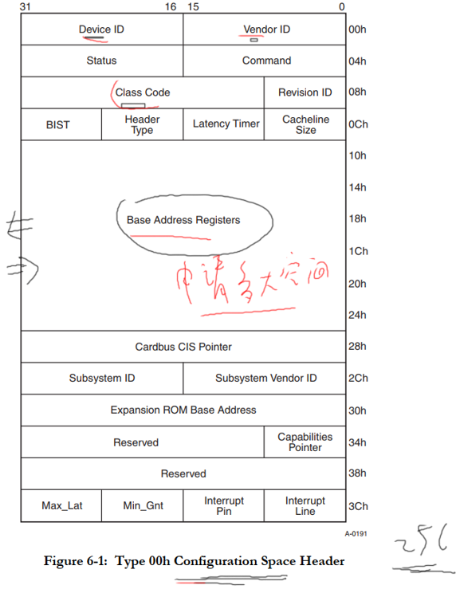
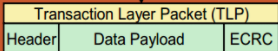

# 从软件开发角度看待PCI和PCIe

参考资料：

* 《PCI Express Technology》，Mike Jackson, Ravi Budruk; MindShare, Inc.
* [《PCIe扫盲系列博文》](http://blog.chinaaet.com/justlxy/p/5100053251)，作者Felix，这是对《PCI Express Technology》的理解与翻译
* 《PCI EXPRESS体系结构导读 (王齐)》
* 《PCI Express_Base Specification Revision 4.0 Version 0.3 ( PDFDrive )》
* 《NCB-PCI_Express_Base_5.0r1.0-2019-05-22》

## 1. 最容易访问的设备是什么

是内存！(还有显卡).

要读写内存，**知道它的地址就可以**：

```c
volatile unsigned int *p = 某个地址;
unsigned int val;
*p = val;  /* 写 */
val = *p;  /* 读 */
```

只有内存能这样简单、方便地使用吗？

不是的，所有的"`ram-like`"接口设备(FLash等)都可以这样操作。

什么叫"ram-like"接口? 任何主控芯片的手册里都有一章内存管理, 里面有各种外设的地址范围.

* 要发出地址：有地址线
* 要读写数据：有数据线
* 怎么分辨是读还是写：有读写信号
* 众多"ram-like"设备共享上面的信号，怎么才能互不影响？每个设备都有自己的`片选信号`
    * 引入内存控制器


如下图所示：


* CPU发出addr, 到达`内存控制器`, 内存控制器判断想访问哪一个设备, 随后发出片选,地址信号给RAM, Flash, GPIO等设备
* 使能设备：
    * 如果addr属于RAM的地址范围, cs0就被使能(内存控制器发出)
    * 如果addr属于Flash的地址范围, cs1就被使能
    * 如果addr属于GPIO的地址范围, cs2就被使能
    * 没有被使能的设备，就相当于没接上去一样，不会影响其他设备
* 读写数据
    * Flash可以像内存一样读, 但不能像内存一样写, 要先发出命令擦除,解锁它 再写.
    * 各个设备的特性不同, 但操作起来都是通过总线.

**关键在于: 内存控制器, 它会根据地址范围发出对应的片选信号, 选中对应的设备.**

## 2. 地址空间的概念

以人类为例：

* 爷爷生了4个小孩，排行1234
* 老大又生了4个小孩，排行1234
* 这2个"1234"辈分不一样，空间不一样


嵌入式系统中的地址空间：

* CPU发出addr, 可以用来`访问EMMC控制器`
* 但是CPU发出的addr, **不能直接到达EMMC Flash**
    * CPU发出的地址属于CPU的地址空间, EMMC控制器发出的地址, 属于EMMC控制器的地址空间.
    * CPU能直接读取EMMC控制器, 但不能直接读写EMMC Flash, 因为他们之间是被隔离的.

* 要想访问EMMC Flash
    * **必须用过EMMC控制器**
    * 就要编写复杂的EMMC控制器驱动程序(因为地址空间隔离)
        * 
* **如果CPU发出的addr, 可以直接到达EMMC Flash**, 那就简单了, `这就是PCI的做法`


- CPU发出的CPU地址空间的地址, 被转换为另一个地址空间的地址.
- 那这样, 只要CPU发出`某个地址`就可以直接读写对应的设备, 就很简单了
- 问题的关键就在于`确定这某个地址`.
- CPU把地址发给PCI控制器, PCI控制器把这个地址转换成PCI地址空间的地址, 然后去读写PCI设备. 拿到数据一路返回给CPU. 硬件帮我们做了很多工作, 关键就是 CPU发出的地址怎么获取. 看第四节.
- 类比 I2C
    - 
    - CPU要访问 I2C设备, 比如AT24C08上的某个地址. 需要设置I2C控制器的状态寄存器, 让它发出起始信号, 然后设置数据寄存器, 让它发出设备地址跟读写位, 再设置存储地址, 再设置寄存器发出真正的数据. 最后发出停止信号.
    - 非常的麻烦. 如果有PCI协议, 就直接一个地址就完成了, 多简单.

## 3. 理解PCI和PCIE的关键

### 3.1 地址空间转换


### 3.2 PCI接口速览

参考文件：`01_pci接口引脚电路示例.pdf`

- 来看看PCI/PCIe是如何传地址跟数据的.


- 上图PCI插槽, ADn 的A是指Addr, D是指Data. 复用 地址线跟数据线.
- 如何区分当下传的是地址, 还是数据? 用FRAME#那个引脚.
- 上面很多线, 用的是并行接口. 并口快, 但数据量大的时候, 会有互相干扰. 想再提高速度 就会很难了. 于是乎, PCIe就出现了.

### 3.3 PCIe接口速览

参考文件：`01_pcie接口引脚电路示例_AX99100.pdf`

- PCIe 使用差分信号, 串行口
- 用两条线发数据, 两条线发地址.
- 但是对于软件端, 对于CPU来说, PCI/PCIe没什么区别.


## 4. 访问PCI/PCIe设备的流程

在PCI/PCIe总线上, 可以接很多设备, 可以动态拔插. 这些设备都会有一个配置空间.

### 4.1 PCI/PCIe设备的配置信息

`PCI/PCIe设备上`有配置空间(配置寄存器), 配置空间里声明自己"需要多大的地址空间"。

注意, 这是PCI/PCIe地址空间.

### 4.2 主机读取设备配置信息、分配空间

主机上的程序访问PCI/PCIe设备, `读出配置信息`.

分配地址空间: 注意, 分配的是PCI/PCIe地址空间. 从PCI地址空间, 分配一段地址, 把起始地址跟长度, 写到这个设备的配置空间.

把地址空间首地址写入设备.

### 4.3 CPU地址空间和PCI/PCIe地址空间怎么转换？

假设CPU发出的addr_cpu, 是用来访问PCI设备的, 转换关系为:

```c
addr_pci  = addr_cpu + offset
```

在PCI/PCIe控制器中, 有某个寄存器, 有来保存offset值. 设置两个地址空间的偏移值.

- CPU发出一个访问PCI设备的地址, 就会选中对应的PCI控制器, PCI控制器就会把CPU发来的地址, 加上偏移值, 得到最终PCI空间的地址.
- PCI控制器把最终地址 通过PCI/PCIE总线发给设备
- 这些设备会监测PCI/PCIe总线上的地址信号, 当某个设备发现这个地址是在自己的范围内, 就回应. CPU要读设备, 就会拿到数据, 要写设备, 就会把数据写进设备.

### 4.3 主机像读写内存一样访问设备

示例代码如下：

```c
volatile unsigned int *p = addr_cpu;
unsigned int val;
*p = val;  /* 写, 硬件会把addr_cpu转换为addr_pci去写PCI/PCIe设备 */
val = *p;  /* 读, 硬件会把addr_cpu转换为addr_pci去读PCI/PCIe设备 */
```

- 所以, CPU发出自己的地址空间的地址, PCI控制器接收后做转换, 然后做剩下的工作.
- 我们就可以像访问内存一样, 去访问PCI设备.
- 然后跳回去, 看PCI/PCIE接口.

# PCI设备的访问方法_非桥设备(type0)

参考资料：GIT仓库

```shell
doc_and_source_for_drivers\IMX6ULL\doc_pic\10_PCI_PCIe\
	01_pci接口引脚电路示例.pdf
	
	协议\PCI\
		PCI_SPEV_V3_0.pdf
		pci-pci_bridge.pdf

	芯片手册\PCI-UART\MCS9865.pdf
```

偏重硬件的访问方法.

## 1. 硬件结构

PCI系统框图：


- 怎么访问到某个PCI设备？需要理解PCI本地总线信号。
- CPU发出地址, 它可能是访问GPIO, 内存, 或者是PCI设备.
- 如果是PCI设备, 桥, 就会把地址转换为 PCI地址空间. 
- 这个PCI地址, 会到达这个PCI总线上的设备. 如果有PCI挂在这个PCI总线上, 也会传过去.
- 这么多PCI设备, 谁来响应? 想要访问谁? 
    - 这就需要配置了. 
        - 扫描PCI设备, 扫描所有设备的`配置寄存器`, 获取所有设备 他们的`设备类型`和`各自想要多大的空间`. 
        - 然后驱动程序, 在pci地址空间给他们分配, 他们各自想要的空间大小. 就是把PCI地址空间中的某一段地址, 跟某一个PCI设备绑定, 把首地址跟长度`写入`该PCI设备的配置寄存器中. 以后访问这段PCI空间(首地址+长度), 就是访问对应的PCI设备.
- 所以在使用PCI设备之前, 需要先配置, 配置完就可以像内存一样读写了.
- 我们要弄清楚配置过程, 就要了解PCI总线上的硬件信号.

## 2. PCI本地总线的信号

主要分为6类：

| 类别           | 信号                                                         | 描述 |
| -------------- | ------------------------------------------------------------ | ---- |
| 系统引脚       | CLK：给PCI设备提供时钟<br />RST#：用于复位PCI设备            |      |
| 地址/数据引脚  | AD[31:00]：地址、数据复用<br />C/BE[3:0]：命令或者字节使能<br />PAR：校验引脚 |      |
| 接口控制       | FRAME#：PCI主设备驱动此信号，表示一个传输开始了、进行中<br />IRDY#：Initiator ready, 传输发起者就绪，一般由PCI主设备驱动此信号<br />TRDY#：Target ready，目标设备驱动，表示它就绪了<br />STOP#：目标设备驱动，表示它想停止当前传输<br />LOCK#：锁定总线，独占总线，有PCI桥驱动此信号<br />IDSEL：Initialization Device Select，配置设备时，用来选中某个PCI设备<br />DEVSEL#：Device Select，PCI设备驱动此信号，表示说：我就是你想访问的设备 |      |
| 仲裁引脚       | REQ#：申请使用PCI总线<br />GNT#：授予，表示你申请的PCI总线成功了，给你使用 |      |
| 错误通知引脚   | PERR#：奇偶校验错误<br />SERR#：系统错误                     |      |
| 中断引脚(可选) | INTA#、INTB#、INTC#、INTD#                                   |      |

- PCI_SPEV_V3_0.pdf
- 
    - FRAME 低电平时, 第一个时钟内, AD总线上传的是addr. 后续时钟里, 传的就是data.
    - 那么最开始的时候, PCI总线上那么多设备, 如何精确找到想要配置的那个? 一开始各个PCI设备都没有地址, 都不知道这是要访问自己还是访问别人. 一开始怎么选中, 我们想要去配置的那个设备呢?
        - IDSEL引脚, Initialization Device Select，配置设备时，用来选中某个PCI设备.
        - 
        - 不同设备的IDSEL信号是不一样的, 具体怎么选中设备. 不同的桥, 有不同的设计. 比如, 有可能是AD31引脚, 来选中1号设备, AD30来选中另一个设备(也有可能使用其他的单独的引脚来选中这个设备). 使用哪个信号作为这个设备的IDSEL, 是由桥芯片决定的.
        - 下级总线里也是一样的.  反正就是使用某些不同的引脚, 选中不同的设备.
- 
    - 我现在要去配置1号设备了, AD31连到IDSEL. 通过这个引脚选中这个设备, 我要去读这个设备里的信息, 设备类型等. 肯定有一块空间来存放这些信息. 这块空间就是配置空间, 就是一堆寄存器.
    - 通过AD31引脚选中这个设备, 那地址怎么传递, 怎么访问里面的某个配置寄存器. 配置空间格式:
        - 
        - 一共256字节, base address registers 就是存放申请空间的首地址. 以后就可以检测PCI总线上的地址了.
        - 选中设备的意思, 就是去设置配置寄存器.
        - 配置寄存器有一定的格式, 每个设备都有256字节的配置寄存器
    - 继续深化. IDSEL选中了设备, 设备又有多种功能. 一个硬件PCI设备, 最多有8种功能. 每种功能又有 256字节的配置寄存器.
        - 如何选中设备中的某个功能, 选中功能里的某个寄存器.
        - 
        - 首先, IDSEL选中设备, 然后通过AD[31:0], 指定Function Number 和 Register Number.(FRAME有效的第一个时钟内, AD是addr)
        - 确定R/W: 通过 C/BE[3:0] 寄存器. 
        - 获取到这个设备的配置信息, 返回给驱动程序.
        - 然后驱动程序, 把分配的首地址写到配置寄存器里. 于是, 又发起一次选中, 发出地址跟数据, 方向配置写, 写入配置寄存器的操作. 

- 示例：


## 3. 访问PCI设备

### 3.1 怎么访问PCI设备

以人来比喻：

* 爷爷想使唤孙子②
* 爷爷发指令给他的儿子①
* 儿子①发指令给孙子②


对于嵌入式设备，爷爷是CPU，父辈是PCI桥，孙子是PCI设备，过程如下：

* CPU发出地址addr_cpu
* PCI桥把addr_cpu转换为addr_pci
* PCI总线上所有设备都检测addr_pci地址，发现它属于某个设备的地址，该设备就负责完成此传输


- 问题1：PCI设备怎么确定自己的地址范围？
    - 回答1：需要配置，软件通过PCI桥查询PCI设备的地址需求，分配一块addr_pci空间给它

- 问题2：PCI本地的地址空间有哪些
    - 回答2：配置空间、内存空间、IO空间

- 问题3：怎么理解这些地址空间？看视频。


### 3.1 PCI设备的地址空间

* 配置空间：PCI设备的配置寄存器

    * 我是什么设备
    * 我需要多大的内存空间
    * 我需要多大的IO空间

* 内存空间或IO空间：PCI本地总线上有AD总线，它是地址、数据复用的总线

    * 传输地址时：这些地址可以是内存地址，也可以是IO地址

    * 怎么分辨是哪类地址？通过C/BE[3:0]这4个引脚来分辨

    * 内存空间、IO空间有什么差别

        * 基本没什么差别

        * 大部分适用内存空间

        * IO空间应该是x86平台的遗留


### 3.2 访问PCI设备的步骤

* 访问配置空间

* 访问内存空间/IO空间


### 3.3 示例：配置PCI Agent设备

PCI设备可以简单地分为PCI Bridge和PCI Agent：

* PCI Bridge：桥，用来扩展PCI设备，必定有一个Root Bridge，下面还可以有其他Bridge。
* PCI Agent：真正的PCI设备(比如网卡)，是PCI树的最末端


怎么配置PCI Agent设备？

* 选中：通过IDSEL来选中某个设备

* 怎么访问配置空间：发起一个type 0的配置命令

    * PCI设备最多有8个功能，每个功能都有自己的配置空间(配置寄存器)
    * 你要访问哪个功能？哪个寄存器？发起
        

* CPU读取配置空间的BAR，得知：这个PCI设备想申请多大空间

* CPU分配PCI地址，写到PCI设备的BAR里

# PCI设备的访问方法_桥设备(type1)

参考资料：

* GIT仓库

```shell
doc_and_source_for_drivers\IMX6ULL\doc_pic\10_PCI_PCIe\
	01_pci接口引脚电路示例.pdf
	
	协议\PCI\
		PCI_SPEV_V3_0.pdf
		pci-pci_bridge.pdf

	芯片手册\PCI-UART\MCS9865.pdf
```

* 《PCI EXPRESS体系结构导读 (王奇)》

## 1.硬件结构

## 2.PCI设备类别及配置方法

PCI设备可以简单地分为PCI Agent、PCI Bridge、Cardbus Bridge：

* PCI Agent：真正的PCI设备(比如网卡)，是PCI树的最末端
* PCI Bridge：桥，用来扩展PCI设备，必定有一个Root Bridge，下面还可以有其他Bridge。
* Cardbus Bridge：用得不多，不介绍

怎么判读设备的类别？`设备的配置空间`里有`Header Type`，它的取值有：

* 00h：PCI Agent
* 01h：PCI Bridge
* 02h：Cardbus Bridge


### 2.1 配置设备时怎么选中它

* 跟Root Bridge直接相连的PCI Agent、PCI Bridge，使用`Configuration Command type 0`
    

* 桥之后的设备，Root Brdige使用`Configuration Command type 1`
    

* 桥：接收到`Configuration Command type 1`后，有2个选择
    * 对于跟它直连的PCI Agent
        * 把`Configuration Command type 1`转换为`Configuration Command type 1`
        * 使用IDSEL选择设备
    * 如果还需要通过下一级的桥才能访问此设备
        * 转发`Configuration Command type 1`


- AD31, AD30, AD29 分别连接 三个设备的IDSEL引脚, 作为选中用途
- 然后设置C/BE引脚, 确定配置读/写
- AD[31:0] 传输 功能号, 寄存器号. Type0命令.
- 设备有两种, 一种是普通的PCI设备, 一种是PCI桥. 他们的配置空间里的Header Type字段是不同的.
- 
- 普通PCI设备 寄存器里存放的是需要多大空间. 驱动程序就会给该设备分配PCI地址段.
    - A到B, C到D等.
- PCI桥, 不需要额外的PCI空间, 它的功能是转发.
    - 怎么转发? 
    - 1.配置bridge
        - 这个桥设备, 也是挂载Bus0上的. Root Bridge也能访问它, 所以也可以用IDSEL来选中它.
        - 选中了, 就能去读取配置寄存器, 查看Header Type, 发现是桥, 就分配一个总线号.
        - 驱动程序写一个bus number到 Secondary Bus Number.
    - 2.通过桥去配置后面的设备
        - 驱动程序通过root Bridge AD总线 发出一个Type1命令.
        - 
        - Type1命令表示: 想通过那个桥, 访问桥后面的哪个设备, 设备里的什么功能, 哪个寄存器.
        - Type0命令, bit0是0, Type1命令, bit0是1. 
        - 上面的图, bus1里用的是AD' 31引脚, 所以Type1里Device Number字段是31.
        - Bus Number: 我想通过Bus1去操作后面的设备, 这里就写1.
    - 当这个桥设备, 检测到Bus0上 AD总线传输的是Type1命令后, 发现里面的Bus Number跟自己匹配, 该桥设备就会解析这个信息.
    - 发现目的地是31号设备, 这个桥设备就会把自己的AD' 31引脚连接目的设备的IDSEL, 用来选中目的设备.
        - 
    - 也就是说, 桥设备还有把Type1命令转成Type0命令的功能.
    - Type1命令通过AD总线发给某个桥, 如果这个桥发现目的设备 是自己可以直接访问到的, 就会把收到的Type1命令, 转换成Type0的命令. 使用桥自己的某个AD'引脚, 去选中该目的设备
        - 转成的Type0命令 只要把Type1命令里的数据拿过来就行了.
- 再引申一下, 多级桥设备呢? 
    - 
    - 从上面的Type1命令格式中, 看到有Primary Bus Number, Secondary Bus Number, Subordinate Bus Number.
    - 
        - Primary Bus Number: 上一级总线 
        - Secondary Bus Number: 我是哪一级, 
        - Subordinate Bus Number: 我的下级里, 最大数字是多少.
    - 现在要访问, 3号PCI桥下面的 31号设备
        - Type1命令从根桥发出, 信号会到桥跟普通设备. 桥4收到, 发现不归他管. 桥1收到之后, 发现Bus Number是3, 不是自己, 但是在自己的下级. 于是桥1原样转发Type1.
        - 设备11跟桥2 都会收到, 桥2跟桥1的操作一样, 继续转发.
        - 桥3收到之后, 桥3发现就是自己的号, 于是把Type1转成Type0, 并用桥3 bus3自己的AD信号, 去选中设备31. 
        - 

## 3. 配置示例

### 3.1 示例：配置PCI Agent设备

* 选中：通过IDSEL来选中某个设备

* 怎么访问配置空间：发起一个type 0的配置命令

    * PCI设备最多有8个功能，每个功能都有自己的配置空间(配置寄存器)
    * 你要访问哪个功能？哪个寄存器？发起
        

* CPU读取配置空间的BAR，得知：这个PCI设备想申请多大空间

* CPU分配PCI地址，写到PCI设备的BAR里


PCI Agent设备的配置空间：


### 3.2 示例：配置PCI桥

* 跟一般的PCI设备一样，通过IDSEL来选中它
* 通过type 0配置命令读取配置空间，发现它是PCI桥设备，把分配的总线号写给它


PCI桥的配置空间：


### 3.3 示例：配置PCI桥后面的设备

* 发起一个type 1的配置命令
    - 

* 通过Bus Number访问到PCI桥
* PCI桥根据Device Number去驱动IDSEL，选中下一级的PCI设备
* 通过Function Number、Register Number访问PCI设备的配置空间

## 4. 访问PCI设备

* CPU发出addr_cpu，被PCI Host桥转换为addr_pci
* 某个PCI设备发现这个addr_pci是自己的，就驱动DEVSEL#，表示说：是我是我
* PCI设备参与传输：接收数据、返回数据


还有个问题, 为什么前面举例子都是从AD31引脚开始用? 而不是从AD0?


- 发出Type0的配置命令, 前面11条AD都被用了. 至少从AD11开始. 
- 很多实现里, 直接从AD16开始. 因为功耗的原因, 挂不了那么多设备. AD16选中第0个设备.

# 从软件角度看PCIe设备的硬件结构

参考资料：

* 《PCI Express Technology》，Mike Jackson, Ravi Budruk; MindShare, Inc.
* [《PCIe扫盲系列博文》](http://blog.chinaaet.com/justlxy/p/5100053251)，作者Felix，这是对《PCI Express Technology》的理解与翻译
* 《PCI EXPRESS体系结构导读 (王齐)》
* 《PCI Express_ Base Specification Revision 4.0 Version 0.3 ( PDFDrive )》
* 《NCB-PCI_Express_Base_5.0r1.0-2019-05-22》

## 1. PCIe接口引脚

参考文件：01_pcie接口引脚电路示例_AX99100.pdf


PCI接口的引脚时并行的，PCEe的是串行的，每个方向的数据使用2条差分信号线来传输，发送/接收两个方向就需要4条线，这被称为1个Lane：


PCIe设备的接口上，可以有多个Lane：

* 两个PCIe设备之间有一个Link
* 一个Link中有1对或多对"发送/接收"引脚，每对"发送/接收"引脚被称为"Lane"
* 一个Lane：有发送、接收两个方向，每个方向用2条差分信号线，所以1个Lane有4条线
* 一个Link最多可以有32 Lane


## 2. 从软件角度理解硬件接口

### 2.1 PCI/PCIe地址空间转换


### 2.2 PCIe上怎么传输地址、数据

既然PCIe是串行信号，那只能在"包"里传输地址、数据了。

* 需要定义包的格式：类型(Mem R/W) + 地址 + 数据
* 包怎么传递给对方、怎么确保不出错？有重传机制、有检验码
* 包怎么通过差分线传送出去？


PCIe总线的层次结构和数据包：

* 事务层(Tansaction Layer)：传输的是Transaction Layer Packet(TLP)
    - 
* 数据链路层(Data Link Layer)：传输的是Data Link Layer Packet(DLLP)
    * 在TLP加上前缀、后缀，得到DLLP
        - 
    * 当然还有数据链路层自己的数据包

* 物理层(Physical Layer)：传输的是Physical Packet
    * 在DLLP加上前缀、后缀，得到的是Physical Packet
        - 
    * 当然还有物理层自己的数据包


## 3. PCIe系统的硬件框图

在PCI系统里，多个PCI设备都链接到相同总线上。

在PCIe系统里，是点对点传输的：

* 一条PCIe总线只能接一个PCIe设备
* 要接多个PCIe设备，必须使用Switch进行扩展


