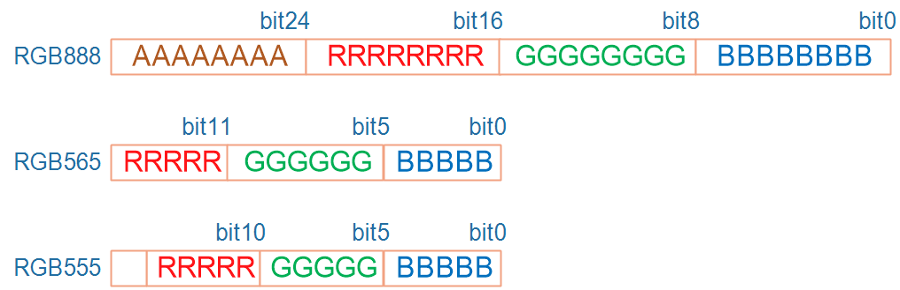
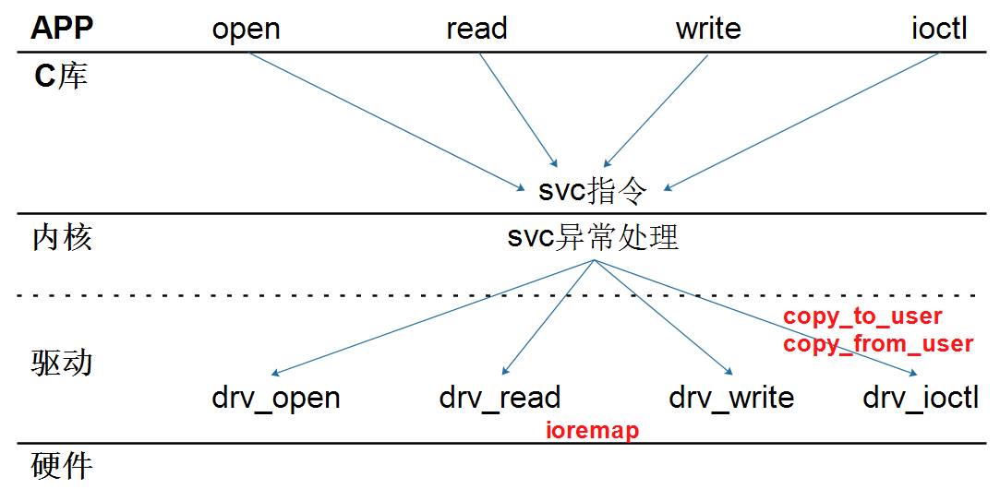
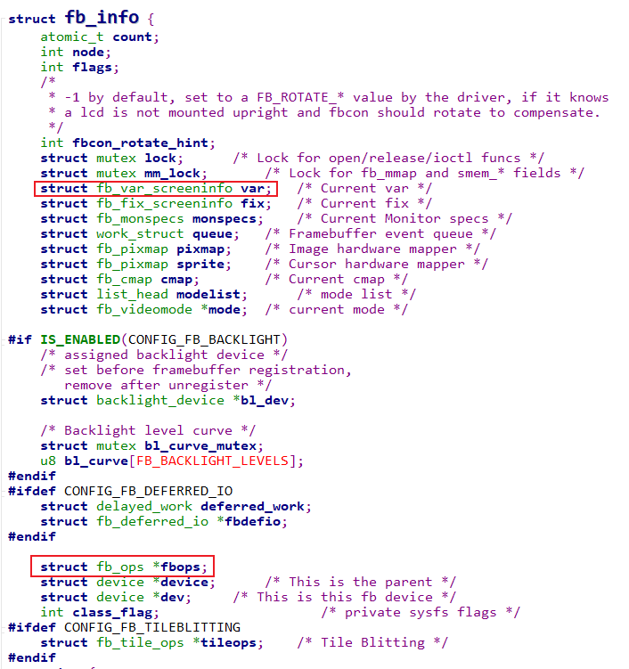

# LCD 驱动


# 不同接口的LCD硬件操作原理

参考资料：

- MIPI-DSI、MIPI-CSI、LVDS等接口解析：https://blog.csdn.net/u014470361/article/details/88891255
- ILI9488驱动芯片数据手册.pdf

## 1. 应用工程师眼里看到的LCD

LCD由一个一个像素组成：每行有xres个像素，有yres行，它的分辨率是：xres * yres。


只要我们能控制任意一个像素的颜色，就可以在LCD上绘制文字、图片。

### 1.1 像素的颜色怎么表示

用红绿蓝三颜色来表示, 可以用24位数据来表示红绿蓝, 也可以用16位等等格式, 比如:

* bpp: `bits per pixel`, 每个像素用多少位来表示
* 24bpp: 实际上会用到32位, 其中8位未使用, 其余24位中分别用8位表示红(R), 绿(G), 蓝(B)
* 16bpp: 有rbg565, rgb555
    * rgb565: 用5位表示红, 6位表示绿, 5位表示蓝
    * rgb555: 16位数据中用5位表示红, 5位表示绿, 5位表示蓝, 浪费一位
        - 

### 1.2 怎么把颜色发给LCD

假设每个像素的颜色用16位来表示, 那么一个LCD的所有像素点假设有``xres * yres`个, 需要的内存为: `xres * yres * 16 / 8`, 也就是要设置所有像素的颜色, 需要这么大小的内存.
这块内存就被称为framebuffer: 

* Framebuffer中每块数据对应一个像素
* 每块数据的大小可能是16位, 32位, 这跟LCD上像素的颜色格式有关
* 设置好LCD硬件后, 只需要把颜色数据写入Framebuffer即可


## 2. 驱动工程师眼里看到的LCD

驱动工程师对LCD的理解要深入硬件，比如要回答这几个问题：

* Framebuffer在哪里？
* 谁把Framebuffer中的数据发给LCD？

### 2.1 统一的LCD硬件模型


### 2.2 MCU常用的8080接口LCD模组


- 单片机是内存(在LCD控制器内部) LCD控制器 LCD屏 组装成一个LCM(LCD模组)
- 单片机性能较弱, 所以外接模块用内存接口最好.
    - 
    - MCU芯片跟内存相连, 有控制总线(控制读,写), 地址总线 跟数据总线. 如果有多块内存芯片, 还会有内存的片选线.
    - LCM的设计必然不可能太复杂.
- MCU连接LCM会有一个data/cmd引脚, 来控制当前发的是data还是cmd
- 使用8080接口就可以简化硬件设计.
- 内存和LCD控制器集成封装在一个芯片内, MCU通过 data bus 和 data/cmd 把命令跟地址发到芯片上, 然后把数据发送到显存上去, 芯片通过LCD控制器去刷新屏幕
    - 我们不需要了解芯片内部结构, 只需根据芯片接口发数据跟命令.
    - 对于这种模块使用很简单, 但有个确定就是LCD屏幕分辨率不高. 因为这种模组一般用的是SRAM内存, 比较贵, 显存受到限制.

### 2.3 MPU常用的TFT RGB接口


- 对于MPU则是, LCD屏幕与其他部分分开. LCD控制器位于arm芯片内部. arm芯片可能外接内存, 在外接内存里分配一块显存FB.
- 对于MPU, 使用的内存可以是DDR SDDRM 量大便宜, 显存可以分配较大, 分辨率就高.
- 每来一个DCLK, 就移动一个像素. 
- 每来一个HSYNC脉冲, 就跳到下一行行首.
- 每来一个VSYNC脉冲, 就跳到帧开始的地方(第一行第一列的像素位置.)
- 数据来自RBG三组线.
- 电子枪跳动的时候, 数据应该是无效的. DE(data enable)就是控制电子枪是否获取数据, 是否发出颜色.


### 2.4 有一个MIPI标准

**MIPI**表示`Mobile Industry Processor Interface`, 即移动产业处理器接口. 是MIPI联盟发起的为移动应用处理器制定的开放标准和一个规范. 主要是手机内部的接口(摄像头, 显示屏接口, 射频/基带接口)等标准化, 从而减少手机内部接口的复杂程度及增加设计的灵活性.

对于LCD, MIPI接口可以分为3类: 

* MIPI-DBI (Display Bus Interface) 
    * 既然是Bus(总线), 就是既能发送数据, 也能发送命令, 常用的`8080接口`就属于DBI接口.
    * Type B (i-80 system), 8-/9-/16-/18-/24-bit bus 
    * Type C (Serial data transfer interface, 3/4-line SPI) 
    
* MIPI-DPI (Display Pixel Interface) 
    * Pixel(像素), 强调的是操作单个像素, 在`MPU上的LCD控制器`就是这种接口
    * Supports 24 bit/pixel (R: 8-bit, G: 8-bit, B: 8-bit)
    * Supports 18 bit/pixel (R: 6-bit, G: 6-bit, B: 6-bit)
    * Supports 16 bit/pixel (R: 5-bit, G: 6-bit, B: 5-bit) 

* MIPI-DSI (Display Serial Interface)  
    * Serial, 相比于DBI, DPI需要使用很多接口线, DSI需要的接口线大为减少 (手机里用的比较多)
    * Supports one data lane/maximum speed 500Mbps
    * Supports DSI version 1.01
    * Supports D-PHY version 1.00  
        - 
    

# Framebuffer驱动程序框架

## 1. 怎么编写字符设备驱动程序



* 驱动主设备号
* 构造file_operations结构体, 填充open/read/write等成员函数
* 注册驱动: register_chrdev(major, name, &fops)
* 入口函数
* 出口函数

## 2. Framebuffer驱动程序框架

分为上下两层:

* fbmem.c: 承上启下
    * 实现, 注册file_operations结构体
    * 把APP的调用向下转发到具体的硬件驱动程序
* xxx_fb.c: 硬件相关的驱动程序
    * 实现, 注册fb_info结构体
    * 实现硬件操作

调用关系: 

```c
例子1：
app:  open("/dev/fb0", ...)   主设备号: 29, 次设备号: 0
--------------------------------------------------------------
kernel:
         fb_open
         	int fbidx = iminor(inode);
         	struct fb_info *info = registered_fb[0];


例子2：
app:  read()
---------------------------------------------------------------
kernel:
		fb_read
			int fbidx = iminor(inode);
			struct fb_info *info = registered_fb[fbidx];
			if (info->fbops->fb_read)
				return info->fbops->fb_read(info, buf, count, ppos);
         	
			src = (u32 __iomem *) (info->screen_base + p);
			dst = buffer;
			*dst++ = fb_readl(src++);
			copy_to_user(buf, buffer, c)
```

- 阅读 `fbmem.c` 的代码, 函数 **fbmem_init** -> **fb_open** -> **fb_write** -> **fb_ioctl** 


- 对硬件相关代码, 都会抽象出一个fb_info结构体. 对于不同的硬件, 不同的LCD会有不同的fb_info结构体
- 我们的驱动程序至少分为上下两层. 上面fbmem.c 帮我们构造好了框架性的代码. 里面的操作函数, 都是中转作用, 最终会调用硬件相关的代码. 下层硬件相关的代码都会提供fb_info结构体.

## 3. 怎么编写Framebuffer驱动程序

写Framebuffer驱动的核心就是这个结构体：



```c
struct fb_info {
	atomic_t count;
	int node;
	int flags;
	struct mutex lock;		/* Lock for open/release/ioctl funcs */
	struct mutex mm_lock;		/* Lock for fb_mmap and smem_* fields */
	struct fb_var_screeninfo var;	/* Current var */
	struct fb_fix_screeninfo fix;	/* Current fix */
	struct fb_monspecs monspecs;	/* Current Monitor specs */
	struct work_struct queue;	/* Framebuffer event queue */
	struct fb_pixmap pixmap;	/* Image hardware mapper */
	struct fb_pixmap sprite;	/* Cursor hardware mapper */
	struct fb_cmap cmap;		/* Current cmap */
	struct list_head modelist;      /* mode list */
	struct fb_videomode *mode;	/* current mode */

#ifdef CONFIG_FB_BACKLIGHT
	/* assigned backlight device */
	/* set before framebuffer registration, 
	   remove after unregister */
	struct backlight_device *bl_dev;

	/* Backlight level curve */
	struct mutex bl_curve_mutex;	
	u8 bl_curve[FB_BACKLIGHT_LEVELS];
#endif
#ifdef CONFIG_FB_DEFERRED_IO
	struct delayed_work deferred_work;
	struct fb_deferred_io *fbdefio;
#endif

	struct fb_ops *fbops;
	struct device *device;		/* This is the parent */
	struct device *dev;		/* This is this fb device */
	int class_flag;                    /* private sysfs flags */
#ifdef CONFIG_FB_TILEBLITTING
	struct fb_tile_ops *tileops;    /* Tile Blitting */
#endif
	union {
		char __iomem *screen_base;	/* Virtual address */
		char *screen_buffer;
	};
	unsigned long screen_size;	/* Amount of ioremapped VRAM or 0 */ 
	void *pseudo_palette;		/* Fake palette of 16 colors */ 
#define FBINFO_STATE_RUNNING	0
#define FBINFO_STATE_SUSPENDED	1
	u32 state;			/* Hardware state i.e suspend */
	void *fbcon_par;                /* fbcon use-only private area */
	/* From here on everything is device dependent */
	void *par;
	/* we need the PCI or similar aperture base/size not
	   smem_start/size as smem_start may just be an object
	   allocated inside the aperture so may not actually overlap */
	struct apertures_struct {
		unsigned int count;
		struct aperture {
			resource_size_t base;
			resource_size_t size;
		} ranges[0];
	} *apertures;

	bool skip_vt_switch; /* no VT switch on suspend/resume required */
};
```

* 分配fb_info
    * framebuffer_alloc

* 设置fb_info
    * var
    * fbops
    * 硬件相关操作
        * 这三个是至少的
    
* 注册fb_info
    * register_framebuffer

# 编程_写出框架

参考代码：

```shell
drivers/video/fbdev/s3c2410fb.c
```

本节视频对应源码在GIT仓库中，位置如下(这2个文件是完全一样的)：

```shell
doc_and_source_for_drivers\STM32MP157\source\A7\03_LCD\01_fb_info\lcd_drv.c
或：
doc_and_source_for_drivers\IMX6ULL\source\03_LCD\01_fb_info\lcd_drv.c
```

***注意***：

* 工作中并不需要我们从头写出驱动程序, 很多时候是去修改现成的代码
    * 但是需要你理解整个驱动
    * 需要知道改哪里, 怎么改
    * 需要学习
* 学习时
    * 如果只是对着现成的代码讲解, 讲完听完也就忘记完了
    * 所以, 强烈建议自己动手写
    * 我做Linux已经16年了, 现在录制视频还是没偷懒从0写代码, 你初学的话就想偷懒只看不练吗?

## 1. 分配fb_info

## 2. 设置fb_info

要设置哪些内容? 根据APP的需求来.

## 3. 注册fb_info

# 最简单的LCD驱动\_基于QEMU

本节视频对应源码在GIT仓库中，位置如下(这2个文件是完全一样的)：

```shell
doc_and_source_for_drivers\STM32MP157\source\A7\03_LCD\02_lcd_drv_qemu\lcd_drv.c
或：
doc_and_source_for_drivers\IMX6ULL\source\03_LCD\02_lcd_drv_qemu\lcd_drv.c
```

目前百问网主推的开发板是IMX6ULL、STM32MP157。
但是也推出了一块虚拟的开发板：IMX6ULL_QEMU，原因有2：

* 降低学习成本
    * 初学阶段，可以不买开发板，使用QEMU即可入门。
* 深入学习内核及驱动
    * 使用QEMU可以非常方便地调试内核、查看驱动程序执行过程
    * 有助于深入研究内核及驱动

后面的视频里，会使用QEMU来讲解某些驱动程序。
**注意**：

* 使用QEMU不是必须的
* QEMU只是提供另一个角度的学习方法，比如：
    * LCD驱动：使用QEMU可以时，可以简化硬件的操作
    * 中断子系统：可以跟踪调用过程
* 你可以只看QEMU相关的视频，不使用QEMU来操作
* 在真实的开发板上讲解的内容，会覆盖QEMU视频的知识

## 1. 为什么要用QEMU

Linux驱动 = 驱动框架 + 硬件操作.
如果硬件操作足够简单,我们就可以把精力放在驱动程序的框架上,这才是Linux的核心.
看看真实的LCD连线:


对于硬件操作，你至少要做这些事情：

* 设置引脚用于LCD
* 阅读LCD手册，阅读LCD控制器手册，根据LCD参数设置LCD控制器
    * 设置LCD控制器时，你还需要了解所用的主控芯片的时钟系统
* 分配Framebuffer，把Framebuffer地址告诉LCD控制器

总之，非常复杂。如果你换了芯片，这些工作又得重来一次。
如果你本身已经对阅读芯片手册很熟悉，对硬件操作很熟悉，那么学习时没必要把时间浪费在这方面。
使用QEMU，虚拟出一款简单的LCD控制器，可以简化硬件操作，让我们把精力放在驱动框架上。

## 2. LCD相关的芯片手册

### 2.1 虚拟的LCD控制器手册

百问网修改了QEMU的源码，实现了一个虚拟的LCD控制器，它的操作很简单。
只有4个寄存器，手册如下：

| 地址       | 寄存器       | 说明                         |
| ---------- | ------------ | --------------------- |
| 0x021C8000 | fb_base_phys | 用于设置Framebuffer的物理地址    |
| 0x021C8004 | fb_xres      | 用于设置Framebuffer的X方向分辨率 |
| 0x021C8008 | fb_yres      | 用于设置Framebuffer的Y方向分辨率 |
| 0x021C800C | fb_bpp       | 用于设置Framebuffer中像素的位宽  |

### 2.2虚拟的LCD芯片参数

目前这款虚拟的LCD分辨率为500x300,16bpp. 暂时未支持其他参数.

## 3. 修改LCD驱动程序添加硬件操作

## 4. 下载、安装、运行QEMU

参考：`http://wiki.100ask.org/Qemu`

## 5. 下载、编译内核

参考：`http://wiki.100ask.org/Qemu`

## 6. 替换LCD驱动程序

# 上机实验\_基于QEMU

前提：**安装了VMware，运行百问网提供的Ubuntu 18.04**
本节视频对应源码在GIT仓库中，位置如下(这2个文件是完全一样的)：

```shell
doc_and_source_for_drivers\STM32MP157\source\A7\03_LCD\03_lcd_drv_qemu_ok\lcd_drv.c
或：
doc_and_source_for_drivers\IMX6ULL\source\03_LCD\03_lcd_drv_qemu_ok\lcd_drv.c
```

## 1. 下载、安装、运行QEMU

参考：`http://wiki.100ask.org/Qemu`

### 1.1 下载百问网制作的QEMU

* 下载

在Ubuntu 18.04系统中，执行如下命令，可以得到一个目录`ubuntu-18.04_imx6ul_qemu_system`：

```shell
git  clone  https://e.coding.net/weidongshan/ubuntu-18.04_imx6ul_qemu_system.git
```

* 安装SDL

下载成功后，进入`ubuntu-18.04_imx6ul_qemu_system`目录，执行`install_sdl.sh`，如下所示：

```shell
cd ~/ubuntu-18.04_imx6ul_qemu_system/
book@100ask:~/ubuntu-18.04_imx6ul_qemu_system$ ls
imx6ull-system-image  install_sdl.sh  qemu  qemu-imx6ull-gui.sh  qemu-imx6ull-nogui.sh  README.md  ubuntu-18.04_sdl-package
book@100ask:~/ubuntu-18.04_imx6ul_qemu_system$ ./install_sdl.sh
```

### 1.2 运行QEMU

必须在Ubunut的桌面环境下启动终端，执行`./qemu-imx6ull-gui.sh`，如下所示：

```shell
cd ~/ubuntu-18.04_imx6ul_qemu_system/
book@100ask:~/ubuntu-18.04_imx6ul_qemu_system$ ls
imx6ull-system-image  install_sdl.sh  qemu  qemu-imx6ull-gui.sh  qemu-imx6ull-nogui.sh  README.md  ubuntu-18.04_sdl-package
book@100ask:~/ubuntu-18.04_imx6ul_qemu_system$ ./qemu-imx6ull-gui.sh
```

### 1.3 退出QEMU

如果在QEMU的GUI界面中发现鼠标无法移出来，可以按下"Ctrl + Alt + G"退出GUI界面。

要退出QEMU，在终端中同时按住Ctrl键、A键，然后同时松开，最后按下X键。

## 2. 下载、编译内核

参考：`http://wiki.100ask.org/Qemu`

### 2.1 下载源码

在Ubuntu中执行如下命令：

```shell
book@100ask:~$ git clone https://e.coding.net/codebug8/repo.git
book@100ask:~$ mkdir -p 100ask_imx6ull-qemu && cd 100ask_imx6ull-qemu
book@100ask:~/100ask_imx6ull-qemu$ ../repo/repo init -u https://e.coding.net/weidongshan/manifests.git -b linux-sdk -m  imx6ull/100ask-imx6ull_qemu_release_v1.0.xml --no-repo-verify
book@100ask:~/100ask_imx6ull-qemu$ ../repo/repo sync -j4
```

下载成功后，可以得到如下内容：

```shell
book@100ask:~$ cd 100ask_imx6ull-qemu/
book@100ask:~/100ask_imx6ull-qemu$ ls
buildroot2019.02  linux-4.9.88  qemu  ToolChain
```

### 2.2 设置工具链

执行如下命令：

```shell
export ARCH=arm
export CROSS_COMPILE=arm-linux-gnueabihf-
export PATH=$PATH:/home/book/100ask_imx6ull-qemu/ToolChain/gcc-linaro-6.2.1-2016.11-x86_64_arm-linux-gnueabihf/bin
```

我们并不是经常使用QEMU，所以就手工执行这些命令吧。
在一个终端里要编译内核的话，都需要手工执行上述命令。

### 2.3 配置、编译内核

执行如下命令：

```shell
book@100ask:~/100ask_imx6ull-qemu$ cd linux-4.9.88
book@100ask:~/100ask_imx6ull-qemu/linux-4.9.88$ make mrproper
book@100ask:~/100ask_imx6ull-qemu/linux-4.9.88$ make 100ask_imx6ull_qemu_defconfig
book@100ask:~/100ask_imx6ull-qemu/linux-4.9.88$ make zImage
```

### 2.4 在QEMU中使用新的zImage

把编译出来的zImage复制到QEMU目录`ubuntu-18.04_imx6ul_qemu_system/imx6ull-system-image`即可：

```shell
book@100ask:~$ cd ~/ubuntu-18.04_imx6ul_qemu_system/
book@100ask:~/ubuntu-18.04_imx6ul_qemu_system$ cp ~/100ask_imx6ull-qemu/linux-4.9.88/arch/arm/boot/zImage  imx6ull-system-image/
```

然后重新启动QEMU。

## 3. 替换LCD驱动程序

QEMU所用的内核里已经带有LCD驱动程序了，要测试我们编写的驱动程序，需要做2件事：

* 把 lcd_drv.c 放到内核目录`linux-4.9.88/drivers/video/fbdev`

* 修改`linux-4.9.88/drivers/video/fbdev/Makefile`，如下：

    ```shell
    #obj-y += 100ask_qemu_fb.o
    obj-y += lcd_drv.o
    ```
    

最后，即可重新执行`make zImage`编译内核，内核里就含有新的驱动程序了。

## 4. 测试

使用新内核启动QEMU后，执行fb-test及可测试。

# 结合APP分析LCD驱动程序

本节视频对应源码在GIT仓库中，位置如下(这2个文件是完全一样的)：

```shell
doc_and_source_for_drivers\STM32MP157\source\A7\03_LCD\04_fb_test
或：
doc_and_source_for_drivers\IMX6ULL\source\03_LCD\04_fb_test
```

## 1. open

```shell
app:  open("/dev/fb0", ...)   主设备号: 29, 次设备号: 0
--------------------------------------------------------------
kernel:
         fb_open   // fbmem.c
         	struct fb_info *info;
         	info = get_fb_info(fbidx);
			
			if (info->fbops->fb_open) {
				res = info->fbops->fb_open(info,1);   // 硬件相关的驱动
				if (res)
					module_put(info->fbops->owner);
			}         	
```


## 2. 获得可变信息(含有分辨率等)

```shell
    app:  	ioctl(fd, FBIOGET_VSCREENINFO, &fb_info->var);
--------------------------------------------------------
kernel:
         fb_ioctl   // fbmem.c
         	struct fb_info *info = file_fb_info(file);

         	do_fb_ioctl(info, cmd, arg);
         		var = info->var;     // 硬件相关的驱动设置的
         		ret = copy_to_user(argp, &var, sizeof(var)) ? -EFAULT : 0;
```

## 3. 获得固定信息(含有显存信息)

```shell
app:  	ioctl(fd, FBIOGET_FSCREENINFO, &fb_info->fix);
-------------------------------------------------------------------------
kernel:
         fb_ioctl   // fbmem.c
         	struct fb_info *info = file_fb_info(file);

         	do_fb_ioctl(info, cmd, arg);
         		fix = info->fix;     // 硬件相关的驱动设置的
         		ret = copy_to_user(argp, &fix, sizeof(fix)) ? -EFAULT : 0;
```

## 4. mmap

```shell
app：void *ptr = mmap(0,
			fb_info->var.yres_virtual * fb_info->fix.line_length,
			PROT_WRITE | PROT_READ,
			MAP_SHARED, fd, 0);
-------------------------------------------------------------------------
kernel:
         fb_mmap   // fbmem.c
         	struct fb_info *info = file_fb_info(file);

         	start = info->fix.smem_start;
         	len = info->fix.smem_len;
         	return vm_iomap_memory(vma, start, len);
```

## 5. 绘制图片

# 硬件\_8080接口LCD时序分析

参考资料，GIT仓库里：

* 8080接口LCD
    * 接口原理图：`其他资料\STM32F103\原理图\100ASK_STM32F103_V10_0707FINAL.pdf`

* LCD数据手册：
    * `其他资料\STM32F103\datasheet\LCD显示屏资料\3.5寸\LCD_3.5寸_320x480_ILI9488_液晶显示模块规格书.pdf`
    * `其他资料\STM32F103\datasheet\LCD显示屏资料\3.5寸\ILI9488驱动芯片数据手册.pdf`

## 1. 接口原理图

### 1.1 8080接口原理图


### 1.2 TFT-RGB接口原理图


## 2. 8080接口时序图


- 显存是在LCD控制内部的.
- D/C(Data/Cmd) 为了简化硬件设计, data bus 在D/C线高电平传送数据, 低电平传送命令, 地址就是命令的一种.
- 共用数据总线, 读, 写引脚, 外接一个内存. 以片选引脚来区分线上传的是谁发送的数据, 片选引脚某一时刻只有一个有效, 所以不会数据冲突.
    - 根据datasheet, 使用某一个范围的地址时, 会自动使得 对应的片选引脚 有效.


- 在写命令线的下降沿时(当前片选线是有效的), MCU把数据驱动到数据总线上, 一段时间后, 写命令线的上升沿时, LCD去读数据总线上的数据, 此时数据总线上的数据还需要保持一段时间(不同的LCD性能不同, 保持时间也不同, 看数据手册.)
- 保持一段时间后, LCD把数据读完了, MCU就可以释放数据总线上的数据了.

具体的时间长度, 如果整个LCM模组的数据手册上找不到, 就可以找一找 LCD控制器用的控制芯片的时序图.


# 硬件\_TFT-RGB接口LCD时序分析

参考资料，GIT仓库里：

* TFT-RGB LCD
    * 接口原理图：
        * `IMX6ULL\开发板配套资料\原理图\Base_board\100ask_imx6ull_v1.1.pdf``
        * ``STM32MP157\开发板配套资料\原理图\01_Base_board(底板)\100ASK_STM32MP157_PRO_V11_底板原理图.pdf`

    * LCD数据手册(这2个文件是一样的)：
        * `IMX6ULL\开发板配套资料\datasheet\Base_board\100ask_imx6ull底板_规格书\7.0-13SPEC(7寸1024600TN-RGB).pdf``
        * `STM32MP157\开发板配套资料\datasheeet\03_7寸LCD模块\LCD数据手册7.0-13SPEC(7寸1024600TN-RGB).pdf`

## 1. 接口原理图

### 1.1 TFT-RGB接口原理图


## 2. TFT-RGB接口时序图

### 2.1 LCD时序图


- 回顾之前电子枪来理解屏幕刷新. DCLK每来一次, 电子枪移动一次, 那频率肯定不能太快, 不然都来不及画这个像素. 当然频率太慢, 也会显得迟顿. 因此要有一个范围值.  看一下手册
    - 
        - DCLK 典型值51.2 MHz, 范围是45~57 MHz
- HSYNC 比较重要是上面时序图的4个值. 水平方向的时间单位是DCLK(或者是像素)
    - thd: 每行像素个数. 例如, 一行1024个像素, thd就是1024, 也有1024个DCLK
    - thfp: 当电子枪已经到了每行的最后一个像素, 它还可以继续向右移动, 还能继续移动hfp的距离(下面图). Horizontal Front Porch
        - thfp典型值 160 tCLK, 范围是140~180tCLK. 继续移动的部分就是不可见的. 
	- thpw: thfp之后 会有一个HSYNC 脉冲, 让它回到下一行开头. 这个HSYNC脉冲也要持续一段时间.  Horizontal Pulse Width
	    - thpw典型值是20 tCLK.
	- thbp: 在电子枪从上一行末尾, 移动到这一行开始, 还不能立刻画像素, 要等待一段时间, 这段时间就是thbp.  Horizontal Back Porch
	    - thbp典型值是140 tCLK. thb + thpw = 160 DCLK是固定的. 这个等待的过程中, 每个DCLK, 电子枪也会往右移一个像素, 然后移动到屏幕有效显示区域.
- 垂直方向, 单位是HSYNC, 每来一个HSYNC信号, 往下移动一行. 每来一个VSYNC信号, 电子枪就从右下角的结束位置, 移动到左上角的开始位置.
    - 
- VSYNC: 类似HSYNC. 
    - tvpw: 这个信号脉冲也需要保持一段时间, 太小电子枪感受不到. 这段时间假设是A, 在这段时间里, 每来一个HSYNC电子枪下移一行. Vertical Pulse Width
    - tvbp: 要等一段时间, 进入有效显示屏幕. 这段时间内也是, 每来一个HSYNC就下移一行. 假设这段时间是B. Vertical Back Porch.
    - tvd: 然后进入有效屏幕, 假如有600行, 就有600个HSYNC信号. 假设这段时间是C.  Vertical Valid
    - tvfp: 到了有效屏幕的最后一行之后, 电子枪还可以继续往下移动一段. 这段时间就是VFP. 假设这段时间是D. Vertical Front Porch.
    - ABCD四段时间的单位都是 Thsync, 他们各自的取值, 上面数据手册里有.

- 上面 HSYNC 和 VSYNC 是SYNC Mode, 还有一个DE mode. Data Enable mode.
    - Horizongtal Diagram DE
    - 
        - 发送像素数据时, DE处于高电平为有效.
        - Total time: 从无效数据到有效数据的一个周期时间. 
        - Black time: 有效数据前面的那一段无效数据的空白时间.
        - Effective time: 有效数据时间.
        - 

    - Verical Timing Diagram DE
    - 
        - 这是一行, 即上面所有像素一行画完. 如果一行800个像素, 那就会有800个DE高脉冲信号.
        - 根据数据手册, 有效行600, 无效行35. 一共635.
        - 

### 2.2 LCD控制器时序图


- 有外屏, 内屏(有效显示屏) 
    - 
