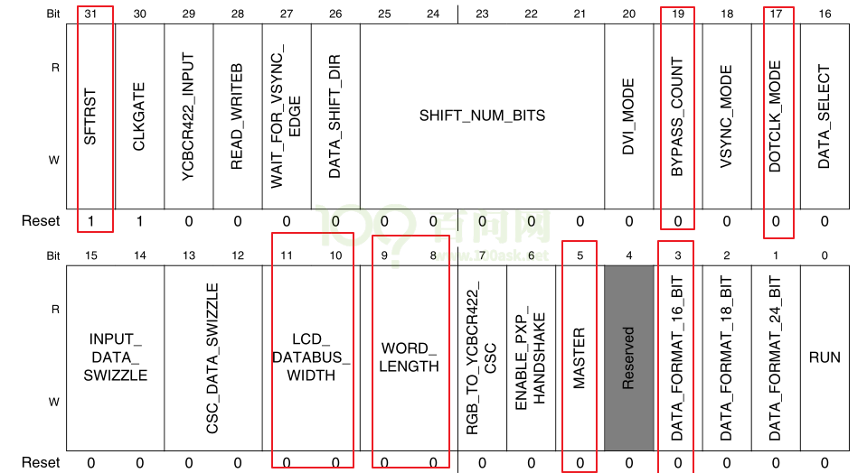
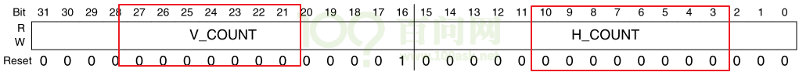
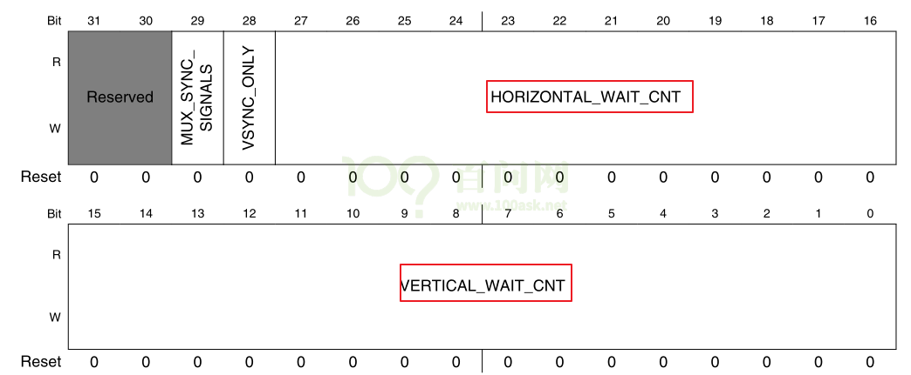

# 硬件\_IMX6ULL的LCD控制器

参考资料，GIT仓库里：

* `IMX6ULL\开发板配套资料\datasheet\Core_board\CPU\IMX6ULLRM.pdf`
    * `《Chapter 34 Enhanced LCD Interface (eLCDIF)》`

* IMX6ULL的LCD裸机程序

    * `IMX6ULL\source\03_LCD\05_参考的裸机源码\03_font_test`

## 1. LCD控制器模块介绍

### 1.1 硬件框图

IMX6ULL的LCD控制器名称为`eLCDIF`(Enhanced LCD Interface, 增强型LCD接口), 主要特性如下：

* 支持MPU模式：有些显示屏自带显存, 只需要把命令, 数据发送给显示屏即可; 就是前面讲的`8080接口`
* VSYNC模式: 跟MPU模式类似, 多了VSYNC信号(MPU+VSYNC). 针对高速数据传输(行场信号)
* 支持DOTCLK模式: RGB接口, 就是前面讲的`TFT-RGB接口`
* 支持ITU-R BT.656接口, 可以把4:2:2 YcbCr格式的数据转换为`模拟电视信号`
* 8/16/18/24/32 bit 的bpp数据都支持, 取决于IO的复用设置及寄存器配置
* MPU模式, VSYNC模式, DOTCLK模式, 都可以配置时序参数.


上图是IMX6ULL的LCD控制器框图.

- 我们在内存中划出一块内存, 称之为显存(Framebuffer), 软件把数据写入显存.
- 设置好LCD控制器之后, 它会通过`AXI总线协议`从显存把RGB数据读入FIFO, 再到达LCD接口(LCD Interface).
- LCD控制器有两个时钟域: 外设总线时钟域, LCD像素时钟域. 前者是用来让LCD控制器正常工作, 后者是用来控制电子枪移动.
- 上图的Read_Data操作, 在MPU模式下才用到; 我们采用的是DCLK模式, 因此不予考虑.

更详细的内容可以查看IMX6ull芯片手册《Chapter 34 Enhanced LCD Interface (eLCDIF)》.

我们需要关注两方面: 数据的传输与处理 还有 时序控制.

### 1.2 数据传输与处理

* 框图：
    * 
    * 
    * 这4个步骤是韦总结的, 不一定完全符合手册. 但差不多应该是这个流程.
    * 怎么把16bpp的格式告诉LCD控制器, 在framebuffer里这16位数据是怎么保存的?
        * 
        * 这个寄存器8 9位, 10 11位分别控制每个像素的字长, LCD数据总线传输宽度.
        * 
        * 这个寄存器16到19 这4位, 来表示32位 4字节中, 哪几个字节是有效位.
            * 
            * 
    * 这些格式信息, 是在第三步unpack的时候才需要知道, 一个字里, 哪些字节是有效的. 前面只是读数据而已.
    * 第1步就是读出1个或多个32位数据.
    * 第2步Swizzle
        * 
        * 这个功能可以让你在线接错的情况下修正字节顺序. 寄存器里14 15位, 4种情况如图所示.
    * 第3步 先获得像素的数据, 然后把对应的RGBxxx格式转换成RGB888. 
        * RGB565转成 RGB888 有两种方式: 
        * 一种是, 低位补0; 另一种是把高位的几个位复制到低位去.
        * 
        * 6ull用的就是第二种方法, R的5, 就是把高的R4R3R2拷贝到低三位组成8位, G的6, 就是R5R4拷贝到低2位, 组成8位.
    * 第4步 设置时序. 涉及LCDIF_VDCTRLn(n=1,2,3,4) 这些寄存器
    * 第5步 RGB 888 数据如何转成原来的数据. 把高位取出来就行了.
        * 

### 1.3 时序控制

看下面寄存器说明。

## 2. LCD控制器寄存器简介

查看任何芯片的LCD控制器寄存器时, 记住几个要点：

- ① 怎么把`LCD的信息`告诉`LCD控制器`：即分辨率, 行列时序, 像素时钟等;

- ② 怎么把显存地址, 像素格式告诉LCD控制器。

    - 

    - 上图是我们将要使用到的寄存器，下面逐个讲解这些寄存器，在后续的LCD控制编程实验会用到。

### 2.1 LCDIF_CTRL寄存器



| 位域    | 名   | 读写 | 描述       |
| ------- | ------ | ---- | ---------- |
| [31]    | SFTRST               | R/W  | 软件复位，正常工作时应设为0; 如果设为1, 它会复位整个LCD控制器 |
| [30]    | CLKGATE              | R/W  | 时钟开关, 0：正常工作时要设置为0; 1：关闭LCD控制器时钟  |
| [29]    | YCBCR422_INPUT       | R/W  | 使用RGB接口时, 设置为0; 其他接口我们暂时不关心             |
| [28]    | READ_WRITEB          | R/W  | 使用RGB接口时, 设置为0; 其他接口我们暂时不关心             |
| [27]    | WAIT_FOR_VSYNC_EDGE  | R/W  | 在VSYNC模式时, 设置为1; 我们不关心                         |
| [26]    | DATA_SHIFT_DIR       | R/W  | 在DVI模式下才需要设置, 我们不关心                           |
| [25:21] | SHIFT_NUM_BITS       | R/W  | 在DVI模式下才需要设置, 我们不关心                           |
| [20]    | DVI_MODE             | R/W  | 设置为1时, 使用DVI模式, 就是ITU-R BT.656数字接口           |
| [19]    | BYPASS_COUNT         | R/W  | DOTCLK和DVI模式下需要设置为1; MPU, VSYNC模式时设为0         |
| [18]    | VSYNC_MODE           | R/W  | 使用VSYNC模式时, 设置为1                                    |
| [17]    | DOTCLK_MODE          | R/W  | 使用DOTCLK模式时, 设置为1; 本实验用的就是这个模式          |
| [16]    | DATA_SELECT          | R/W  | MPU模式下才用到, 我们不关心                                 |
| [15:14] | INPUT_DATA_SWIZZLE   | R/W  | 显存中像素颜色的数据转给LCD控制器时, 字节位置是否交换: <br />0x0：NO_SWAP, 不交换; <br />0x0：LITTLE_ENDIAN, 小字节序, 跟NO_SWAP一样; <br />0x1：BIG_ENDIAN_SWAP, 字节0、3交换；字节1、2交换; <br />0x1：SWAP_ALL_BYTES, 字节0, 3交换; 字节1, 2交换; <br />0x2：HWD_SWAP, 半字交换, 即0x12345678转为0x56781234  <br />0x3：HWD_BYTE_SWAP, 在每个半字内部放换字节, 即0x12345678转换为0x34127856 |
| [13:12] | CSC_DATA_SWIZZLE     | R/W  | 显存中的数据被传入LCD控制器内部并被转换为24BPP后, 在它被转给LCD接口之前, 字节位置是否交换: 0x0：NO_SWAP, 不交换; 0x0: LITTLE_ENDIAN, 小字节序, 跟NO_SWAP一样; 0x1: BIG_ENDIAN_SWAP, 字节0, 3交换; 字节1, 2交换; 0x1: SWAP_ALL_BYTES, 字节0, 3交换; 字节1, 2交换; 0x2: HWD_SWAP, 半字交换, 即0x12345678转为0x56781234 ; 0x3: HWD_BYTE_SWAP, 在每个半字内部放换字节,  即0x12345678转换为0x34127856 |
| [11:10] | LCD_DATABUS_WIDTH    | R/W  | LCD数据总线宽度, 就是对外输出的LCD数据的位宽, 0x0: 16位; 0x1: 8位; 0x2: 18位; 0x3: 24位 |
| [9:8]   | WORD_LENGTH          | R/W  | 输入的数据格式, 即显存中每个像素占多少位, 0x0: 16位; 0x1: 8位; 0x2: 18位; 0x3: 24位. |
| [7]     | RGB_TO_YCBCR422_CSC  | R/W  | 设置为1时, 使能颜色空间转换: RGB转为YCbCr                  |
| [6]     | ENABLE_PXP_HANDSHAKE | R/W  | 当LCDIF_MASTER设置为1时, 再设置这位, 则LCD控制器跟PXP之间的握手机制被关闭(我们不关心) |
| [5]     | MASTER               | R/W  | 设置为1时, LCD控制器成为bus master                          |
| [4]     | RSRVD0               | R/W  | 保留                                                         |
| [3]     | DATA_FORMAT_16_BIT   | R/W  | WORD_LENGTH为0时, 表示一个像素用16位, 此位作用如下: 0: 数据格式为ARGB555; 1: 数据格式为RGB565; |
| [2]     | DATA_FORMAT_18_BIT   | R/W  | WORD_LENGTH为2时, 表示一个像素用18位, RGB数据还是保存在32位数据里, 此位作用如下: 0: 低18位用来表示RGB666, 高14位无效  1: 高18位用来表示RGB666, 低14位无效 |
| [1]     | DATA_FORMAT_24_BIT   | R/W  | WORD_LENGTH为3时, 表示一个像素用24位, 此位作用如下: 0: 所有的24位数据都有效, 格式为RGB888; 1: 转给LCD控制器的数据是24位的, 但只用到其中的18位, 每个字节用来表示一个原色, 每字节中高2位无效; |
| [0]     | RUN   | R/W  | 使能LCD控制器, 开始传输数据 |

### 2.2 LCDIF_CTRL1寄存器


本实验中使用TFT LCD, LCD控制器使用DOTCLK模式. 本寄存器中其他用不到的位, 就不介绍了.

| 位域    | 名                  | 读写 | 描述                                                         |
| ------- | ------------------- | ---- | ------------------------------------------------------------ |
| [19:16] | BYTE_PACKING_FORMAT | R/W  | 用来表示一个32位的word中, 哪些字节是有效的, 即哪些字节是用来表示颜色的. bit16, 17, 18, 19分别对应byte0, 1, 2, 3; 某位为1, 就表示对应的字节有效. 默认值是0xf, 表示32位的word中, 所有字节都有效.  对于8bpp, 可以忽略本设置, 所有的字节都是有效的; 对于16bpp, bit[1:0], bit[3:2]分别对应一个字节, 组合中的2位都为1时, 对应的字节才有效;  对于24bpp, 0x7表示32位数据中只用到3个字节, 这称为“24 bit unpacked format”, 即ARGB, 其中的A字节被丢弃 |
| [0]     | RESET               | R/W  | 用来复位了接的LCD,  0: LCD_RESET引脚输出低电平; 1: LCD_RESET引脚输出高电平 |

### 2.3 LCDIF_TRANSFER_COUNT寄存器



|    位域 |   名    | 读写 | 描述                     |
| ------: | :-----: | ---- | ------------------------ |
| [31:16] | V_COUNT | R/W  | 一帧中，有多少行有效数据 |
|  [15:0] | H_COUNT | R/W  | 一行中，有多少个像素     |

### 2.4 LCDIF_VDCTRL0寄存器


本寄存器用来设置Vsync信号相关的时序, 及极性.

| 位域   | 名                     | 读写 | 描述                                                         |
| ------ | ---------------------- | ---- | ------------------------------------------------------------ |
| [29]   | VSYNC_OEB              | R/W  | 用来控制VSYNC信号, 对于DOTCLK模式, 设为0, 0: VSYNC是输出引脚, 用LCD控制器产生; 1: VSYNC是输入引脚 |
| [28]   | ENABLE_PRESENT         | R/W  | 在DOTCLK模式下, 硬件是否会产生数据使能信号ENALBE: 0: 不产生; 1:产生 |
| [27]   | VSYNC_POL              | R/W  | 用来决定VSYNC脉冲的极性, 0: 低脉冲; 1: 高脉冲                |
| [26]   | HSYNC_POL              | R/W  | 用来决定HSYNC脉冲的极性, 0: 低脉冲; 1: 高脉冲                |
| [25]   | DOTCLK_POL             | R/W  | 用来决定DOTCLK的极性, 0: LCD控制器在DOTCLK下降沿发送数据, LCD在上升沿捕获数据; 1: 反过来 |
| [24]   | ENABLE_POL             | R/W  | 用来决定ENABLE信号的极性, 0: 数据有效期间, ENABLE信号为低; 1: 反过来 |
| [21]   | VSYNC_PERIOD_UNIT      | R/W  | 用来决定VSYNC_PERIOD的单位, 0: 单位是像素时钟(pix_clk), 这在VSYNC模式下使用; 1: 单位是“整行”, 这在DOTCLK模式下使用 |
| [20]   | VSYNC_PULSE_WIDTH_UNIT | R/W  | 用来决定VSYNC_PULSE_WIDTH的单位, 0: 单位是像素时钟(pix_clk); 1: 单位是“整行” |
| [19]   | HALF_LINE              | R/W  | VSYNC周期是否周加上半行的时间, 0: VSYNC周期=VSYNC_PERIOD; 1: VSYNC周期=VSYNC_PERIOD+HORIZONTAL_PERIOD/2 |
| [18]   | HALF_LINE_MODE         | R/W  | 0：第1帧将在一行的中间结束，第2帧在一行的中间开始;  1：所有帧结束前都加上半行时间，这样所有帧都会起始于“行的开头” |
| [17:0] | VSYNC_PULSE_WIDTH      | R/W  | VSYNC脉冲的宽度                                              |

### 2.5 LCDIF_VDCTRL1寄存器


| 位域 | 名           | 读写 | 描述                                                         |
| ---- | ------------ | ---- | ------------------------------------------------------------ |
| [29] | VSYNC_PERIOD | R/W  | 两个垂直同步信号之间的间隔, 即垂直方向同步信号的总周期; 单位由VSYNC_PERIOD_UNIT决定 |

### 2.6 LCDIF_VDCTRL2寄存器


HSYNC_PULSE_WIDTH: 水平同步信号脉冲宽度; 

HSYNC_PERIOD: 两个水平同步信号之间的总数, 即水平方向同步信号的总周期

| 位域    | 名                | 读写 | 描述                                                 |
| ------- | ----------------- | ---- | ---------------------------------------------------- |
| [31:18] | HSYNC_PULSE_WIDTH | R/W  | HSYNC脉冲的宽度(单位：pix_clk)                       |
| [17:0]  | HSYNC_PERIOD      | R/W  | 整行的宽度，即两个HYSNC信号之间的宽度(单位：pix_clk) |

### 2.7 LCDIF_VDCTRL3寄存器



| 位域    | 名                  | 读写 | 描述                                                  |
| ------- | ------------------- | ---- | ----------------------------------------------------- |
| [29]    | MUX_SYNC_SIGNALS    | R/W  | 用不着                                                |
| [28]    | VSYNC_ONLY          | R/W  | 0:DOTCLK模式时必须设置为0; 1: VSYNC模式时必须设置为1; |
| [27:16] | HORIZONTAL_WAIT_CNT | R/W  | 水平方向上的等待像素个数, 等于thp+thb                 |
| [15:0]  | VERTICAL_WAIT_CNT   | R/W  | 垂直方向上的等待行数, 等于tvp+tvb                     |

### 2.8 LCDIF_VDCTRL4寄存器


| 位域    | 名                      | 读写 | 描述                                                         |
| ------- | ----------------------- | ---- | ------------------------------------------------------------ |
| [31:29] | DOTCLK_DLY_SEL          | R/W  | 在LCD控制器内部的DOTCLK输出到LCD_DOTCK引脚时, 延时多久: 0: 2ns; 1: 4ns; 2: 6ns; 3: 8ns; 其他值保留 |
| [18]    | SYNC_SIGNALS_ON         | R/W  | DOTCLK模式下必须设为1                                        |
| [17:0]  | DOTCLK_H_VALID_DATA_CNT | R/W  | 水平方向上的有效像素个数(pix_clk), 即分辨率的y               |

### 2.9 LCDIF_CUR_BUF寄存器


| 位域   | 名   | 读写 | 描述                                    |
| ------ | ---- | ---- | --------------------------------------- |
| [31:0] | ADDR | R/W  | LCD控制器正在传输的当前帧在显存中的地址 |

### 2.10 LCDIF_NEXT_BUF寄存器


| 位域   | 名   | 读写 | 描述                 |
| ------ | ---- | ---- | -------------------- |
| [31:0] | ADDR | R/W  | 下一帧在显存中的地址 |

LCD控制器传输完当前帧后，会把LCDIF_NEXT_BUF寄存器的值复制到LCDIF_CUR_BUF寄存器。

# 分析内核自带的LCD驱动程序\_基于IMX6ULL

参考资料，GIT仓库里：

* `IMX6ULL\开发板配套资料\datasheet\Core_board\CPU\IMX6ULLRM.pdf`
  * `《Chapter 34 Enhanced LCD Interface (eLCDIF)》`

* IMX6ULL的LCD裸机程序

  * `IMX6ULL\source\03_LCD\05_参考的裸机源码\03_font_test`

* 内核自带的IMX6ULL LCD驱动程序
  * 驱动源码：`Linux-4.9.88\drivers\video\fbdev\mxsfb.c`
  * 设备树：
    * `arch/arm/boot/dts/imx6ull.dtsi`
    * `arch/arm/boot/dts/100ask_imx6ull-14x14.dts`

## 1. 驱动程序框架

Linux驱动程序 = 驱动程序框架 + 硬件编程。
在前面已经基于QEMU编写了LCD驱动程序，对LCD驱动程序的框架已经分析清楚。
核心就是：

* 分配fb_info
* 设置fb_info
* 注册fb_info
* 硬件相关的设置

框架就是: `分配, 设置, 注册fb_info结构体`. 硬件设置 重点就是 `设置LCD引脚, 时钟设置, 内部寄存器的设置`.
- 

- 如果你想抄内核的代码, 怎么找源代码在哪个文件? 假设拿到一个新板子, 厂家的配套的内核里肯定会有说明, 告诉你怎么去编译, 编译完可去`drivers/video/fbdev`目录下, 查看有哪些`.o`文件. 或者你直接在内核根目录下`make menuconfig` , 写的比较规范的内核里面一般都会有它自带的LCD程序的配置项的. 可以进入`Device drivers`, 找找有没有framebuffer的驱动程序. 

- 4.9.88 会有 Graphics support , 里面有 Frame buffer Devices:
    - 
        - 就是下图中的MX3 或者MXS 两个选项. 他们对应的.c文件就是我们要看的驱动程序.


- 

### 1.1 入口函数注册platform_driver


- 在`arch/arm/boot/dts/` 下搜索 上面三个双引号里的字符串. 能看到imx6ull.dtsi

### 1.2 设备树有对应节点


### 1.3 probe函数分析

```c
static int mxsfb_probe(struct platform_device *pdev)
{
	const struct of_device_id *of_id =
			of_match_device(mxsfb_dt_ids, &pdev->dev);
	struct resource *res;
	struct mxsfb_info *host;
	struct fb_info *fb_info;
	struct pinctrl *pinctrl;
	int irq = platform_get_irq(pdev, 0);
	int gpio, ret;
	int rst_gpio;

	if (of_id)
		pdev->id_entry = of_id->data;

	gpio = of_get_named_gpio(pdev->dev.of_node, "enable-gpio", 0);
	if (gpio == -EPROBE_DEFER)
		return -EPROBE_DEFER;

	if (gpio_is_valid(gpio)) {
		ret = devm_gpio_request_one(&pdev->dev, gpio, GPIOF_OUT_INIT_LOW, "lcd_pwr_en");
		if (ret) {
			dev_err(&pdev->dev, "faild to request gpio %d, ret = %d\n", gpio, ret);
			return ret;
		}
	}
// 获取资源
	res = platform_get_resource(pdev, IORESOURCE_MEM, 0);
	if (!res) {
		dev_err(&pdev->dev, "Cannot get memory IO resource\n");
		return -ENODEV;
	}
// host 是 struct mxsfb_info类型的, 它包含struct fb_info *fb_info 跟 其他信息
	host = devm_kzalloc(&pdev->dev, sizeof(struct mxsfb_info), GFP_KERNEL);
	if (!host) {
		dev_err(&pdev->dev, "Failed to allocate IO resource\n");
		return -ENOMEM;
	}
// 这里分配一个 struct fb_info 结构体 然后给host->fb_info
	fb_info = framebuffer_alloc(0, &pdev->dev);
	if (!fb_info) {
		dev_err(&pdev->dev, "Failed to allocate fbdev\n");
		devm_kfree(&pdev->dev, host);
		return -ENOMEM;
	}
	host->fb_info = fb_info; /*分配fb_info完成*/
	fb_info->par = host;

	ret = devm_request_irq(&pdev->dev, irq, mxsfb_irq_handler, 0,
			  dev_name(&pdev->dev), host);
	if (ret) {
		dev_err(&pdev->dev, "request_irq (%d) failed with error %d\n",
				irq, ret);
		ret = -ENODEV;
		goto fb_release;
	}

	host->base = devm_ioremap_resource(&pdev->dev, res);
	if (IS_ERR(host->base)) {
		dev_err(&pdev->dev, "ioremap failed\n");
		ret = PTR_ERR(host->base);
		goto fb_release;
	}

	host->pdev = pdev;
	platform_set_drvdata(pdev, host);

	host->devdata = &mxsfb_devdata[pdev->id_entry->driver_data];
/*时钟子系统 以后再说*/
	host->clk_pix = devm_clk_get(&host->pdev->dev, "pix");
	if (IS_ERR(host->clk_pix)) {
		host->clk_pix = NULL;
		ret = PTR_ERR(host->clk_pix);
		goto fb_release;
	}

	host->clk_axi = devm_clk_get(&host->pdev->dev, "axi");
	if (IS_ERR(host->clk_axi)) {
		host->clk_axi = NULL;
		ret = PTR_ERR(host->clk_axi);
		dev_err(&pdev->dev, "Failed to get axi clock: %d\n", ret);
		goto fb_release;
	}

	host->clk_disp_axi = devm_clk_get(&host->pdev->dev, "disp_axi");
	if (IS_ERR(host->clk_disp_axi)) {
		host->clk_disp_axi = NULL;
		ret = PTR_ERR(host->clk_disp_axi);
		dev_err(&pdev->dev, "Failed to get disp_axi clock: %d\n", ret);
		goto fb_release;
	}

	host->reg_lcd = devm_regulator_get(&pdev->dev, "lcd");
	if (IS_ERR(host->reg_lcd))
		host->reg_lcd = NULL;
/*伪调色板*/
	fb_info->pseudo_palette = devm_kzalloc(&pdev->dev, sizeof(u32) * 16,
					       GFP_KERNEL);
	if (!fb_info->pseudo_palette) {
		ret = -ENOMEM;
		dev_err(&pdev->dev, "Failed to allocate pseudo_palette memory\n");
		goto fb_release;
	}

	INIT_LIST_HEAD(&fb_info->modelist);

	pm_runtime_enable(&host->pdev->dev);
/* 初始化 host 在里面初始化fb_info fix的信息,初始化host信息,check var,给framebuffer分配内存
   在里面设置fb_info 完成
*/
	ret = mxsfb_init_fbinfo(host);
	if (ret != 0) {
		dev_err(&pdev->dev, "Failed to initialize fbinfo: %d\n", ret);
		goto fb_pm_runtime_disable;
	}

	ret = mxsfb_dispdrv_init(pdev, fb_info);
	if (ret != 0) {
		if (ret == -EPROBE_DEFER)
			dev_info(&pdev->dev,
				 "Defer fb probe due to dispdrv not ready\n");
		goto fb_free_videomem;
	}

	if (!host->dispdrv) {
		pinctrl = devm_pinctrl_get_select_default(&pdev->dev);
		if (IS_ERR(pinctrl)) {
			ret = PTR_ERR(pinctrl);
			goto fb_pm_runtime_disable;
		}
	}

	if (!host->enabled) {
		writel(0, host->base + LCDC_CTRL);
		mxsfb_set_par(fb_info);
		mxsfb_enable_controller(fb_info);
		pm_runtime_get_sync(&host->pdev->dev);
	}
/* 注册fb_info */
	ret = register_framebuffer(fb_info);
	if (ret != 0) {
		dev_err(&pdev->dev, "Failed to register framebuffer\n");
		goto fb_destroy;
	}
/*以下是硬件操作.*/
	mxsfb_overlay_init(host);

#ifndef CONFIG_FB_IMX64_DEBUG
	console_lock();
	ret = fb_blank(fb_info, FB_BLANK_UNBLANK);
	console_unlock();
	if (ret < 0) {
		dev_err(&pdev->dev, "Failed to unblank framebuffer\n");
		goto fb_unregister;
	}
#endif
        /* 100ask */
        printk("100ask, %s %s %d\n", __FILE__, __FUNCTION__, __LINE__);
        rst_gpio = of_get_named_gpio(pdev->dev.of_node, "reset-gpios", 0);
        if (gpio_is_valid(rst_gpio)) {
                ret = gpio_request(rst_gpio, "lcdif_rst");
                if (ret < 0) {
                        dev_err(&pdev->dev,
                                "Failed to request GPIO:%d, ERRNO:%d\n",
                                (s32)rst_gpio, ret);
                } else {
                        gpio_direction_output(rst_gpio, 0);
                        msleep(2);
                        gpio_direction_output(rst_gpio, 1);
                        dev_info(&pdev->dev,  "Success seset LCDIF\n");
                }
        }

	dev_info(&pdev->dev, "initialized\n");

	return 0;

#ifndef CONFIG_FB_IMX64_DEBUG
fb_unregister:
	unregister_framebuffer(fb_info);
#endif
fb_destroy:
	fb_destroy_modelist(&fb_info->modelist);
fb_free_videomem:
	mxsfb_free_videomem(host);
fb_pm_runtime_disable:
	clk_disable_pix(host);
	clk_disable_axi(host);
	clk_disable_disp_axi(host);

	pm_runtime_disable(&host->pdev->dev);
	devm_kfree(&pdev->dev, fb_info->pseudo_palette);
fb_release:
	framebuffer_release(fb_info);
	devm_kfree(&pdev->dev, host);

	return ret;
}

```

- 引脚的设置由设备树, 里面pinctrl子系统, 配合i.MX Pins Tool v6 工具来写设备树
- 时钟相关内容, 参考`9.1 Input Clock and Data Timing Diagram` 这部分数据手册. 在设备树里写. 然后probe函数会去取.
    - 上面设备树里 clock-frequency 设置为50000000, 就是50Mhz. 
    - 然后在`of_display_timing.c`里 **of_parse_display_timing** 这个函数中, 会去 **parse_timing_property**.  clock-frequency 会存放在 **struct** display_timing下的pixelclock 成员里.  pixelclock这个成员会在 `videomode.c`里被使用. 下面描述的更详细.

## 2. 编写硬件相关的代码

我们只需要针对IMX6ULL的编写硬件相关的代码，涉及3部分：

* GPIO设置
  * LCD引脚
  * 背光引脚
* 时钟设置
  * 确定LCD控制器的时钟
  * 根据LCD的DCLK计算相关时钟
* LCD控制器本身的设置
  * 比如设置Framebuffer的地址
  * 设置Framebuffer中数据格式、LCD数据格式
  * 设置时序

### 2.1 GPIO设置

有两种方法：

* 直接读写相关寄存器
* 使用设备树，在设备树中设置pinctrl
  * 本课程专注于LCD，所以使用pinctrl简化程序

设备树`arch/arm/boot/dts/100ask_imx6ull-14x14.dts`中：


### 2.2 时钟设置

IMX6ULL的LCD控制器涉及2个时钟：


代码里直接使用时钟子系统的代码。

* 在设备树里指定频率：
  * 文件：arch/arm/boot/dts/100ask_imx6ull-14x14.dts
  * 代码：clock-frequency

    ```shell
           display-timings {
                native-mode = <&timing0>;
    
                 timing0: timing0_1024x768 {
                 clock-frequency = <50000000>;
    ```

* 从设备树获得`dot clock`，存入display_timing
  * 文件：drivers\video\of_display_timing.c
  * 代码：
   ```c
    ret |= parse_timing_property(np, "clock-frequency", &dt->pixelclock);
   ```

* 使用display_timing来设置videomode
  * 文件：drivers\video\videomode.c
  * 代码：

```c
void videomode_from_timing(const struct display_timing *dt,
struct videomode *vm)
{
    vm->pixelclock = dt->pixelclock.typ;
    vm->hactive = dt->hactive.typ;
    vm->hfront_porch = dt->hfront_porch.typ;
    vm->hback_porch = dt->hback_porch.typ;
    vm->hsync_len = dt->hsync_len.typ;

    vm->vactive = dt->vactive.typ;
    vm->vfront_porch = dt->vfront_porch.typ;
    vm->vback_porch = dt->vback_porch.typ;
    vm->vsync_len = dt->vsync_len.typ;

    vm->flags = dt->flags;
}

```

* 根据videomode的值，使用`时钟子系统`的函数设置时钟：
  * 文件：drivers\video\fbdev\mxc\ldb.c
  * 代码：
  * 

### 2.3 LCD控制器的配置

以设置分辨率为例。
* 在设备树里指定频率：

  * 文件：arch/arm/boot/dts/100ask_imx6ull-14x14.dts
  * 代码：clock-frequency

    ```shell
           display-timings {
                native-mode = <&timing0>;
    
                 timing0: timing0_1024x768 {
    				hactive = <1024>;
    	            vactive = <600>;
    
    ```

* 从设备树获得`分辨率`等信息，存入display_timing
  * 文件：`drivers/video/of_display_timing.c`
  * 代码：

```c
	ret |= parse_timing_property(np, "hback-porch", &dt->hback_porch);
	ret |= parse_timing_property(np, "hfront-porch", &dt->hfront_porch);
	ret |= parse_timing_property(np, "hactive", &dt->hactive);
	ret |= parse_timing_property(np, "hsync-len", &dt->hsync_len);
	ret |= parse_timing_property(np, "vback-porch", &dt->vback_porch);
	ret |= parse_timing_property(np, "vfront-porch", &dt->vfront_porch);
	ret |= parse_timing_property(np, "vactive", &dt->vactive);
	ret |= parse_timing_property(np, "vsync-len", &dt->vsync_len);
	ret |= parse_timing_property(np, "clock-frequency", &dt->pixelclock);

	dt->flags = 0;
	if (!of_property_read_u32(np, "vsync-active", &val))
		dt->flags |= val ? DISPLAY_FLAGS_VSYNC_HIGH :
				DISPLAY_FLAGS_VSYNC_LOW;
	if (!of_property_read_u32(np, "hsync-active", &val))
		dt->flags |= val ? DISPLAY_FLAGS_HSYNC_HIGH :
				DISPLAY_FLAGS_HSYNC_LOW;
	if (!of_property_read_u32(np, "de-active", &val))
		dt->flags |= val ? DISPLAY_FLAGS_DE_HIGH :
				DISPLAY_FLAGS_DE_LOW;
	if (!of_property_read_u32(np, "pixelclk-active", &val))
		dt->flags |= val ? DISPLAY_FLAGS_PIXDATA_POSEDGE :
				DISPLAY_FLAGS_PIXDATA_NEGEDGE;

	if (of_property_read_bool(np, "interlaced"))
		dt->flags |= DISPLAY_FLAGS_INTERLACED;
	if (of_property_read_bool(np, "doublescan"))
		dt->flags |= DISPLAY_FLAGS_DOUBLESCAN;
	if (of_property_read_bool(np, "doubleclk"))
		dt->flags |= DISPLAY_FLAGS_DOUBLECLK;

```

* 使用display_timing来设置videomode
  * 文件：`drivers/video/videomode.c`
  * 代码：

 ```c
    void videomode_from_timing(const struct display_timing *dt,
    			  struct videomode *vm)
    {
    	vm->hactive = dt->hactive.typ;
    
        vm->vactive = dt->vactive.typ;
 ```

* 根据videomode的值，设置fb_videomode
  * 文件：drivers\video\fbdev\core\fbmon.c
  * 代码：
    
    ```c
    int fb_videomode_from_videomode(const struct videomode *vm,
    				struct fb_videomode *fbmode)
    {
    	unsigned int htotal, vtotal;
    	fbmode->xres = vm->hactive;
        fbmode->yres = vm->vactive;
    ```

* 根据fb_videomode的值，设置fb_info中的var：
  * 文件: `drivers/video/fbdev/core/modedb.c`
  * 代码: 
    ```c
    void fb_videomode_to_var(struct fb_var_screeninfo *var,
    			 const struct fb_videomode *mode)
    {
    	var->xres = mode->xres;
    	var->yres = mode->yres;
    
    ```

* 根据var的分辨率，设置寄存器
  * 文件：`drivers/video/fbdev/mxsfb.c`
  * 代码：

    ```c
    	writel(TRANSFER_COUNT_SET_VCOUNT(fb_info->var.yres) |
    			TRANSFER_COUNT_SET_HCOUNT(fb_info->var.xres),
    			host->base + host->devdata->transfer_count);
    ```
  
  - host->base = devm_ioremap_resource(&pdev->dev, res); 拿到了LCD控制器的基地址. 写某个寄存器, 就用base + 偏移量锁定寄存器地址.
  - 偏移量就存放在`struct mxsfb_devdata mxsfb_devdata[]`, 然后probe函数中`host->devdata = &mxsfb_devdata[pdev->id_entry->driver_data];`
  
  - var的数据是在 **mxsfb_init_fbinfo** 函数中, `fb_videomode_to_var(var, &modelist->mode);` 设置的.

硬件相关设置分在了不同的文件里, 太绕太复杂.

# 编程\_LCD驱动程序框架\_使用设备树

参考资料，GIT仓库里：

* 基于这个程序修改：
    * `IMX6ULL\source\03_LCD\03_lcd_drv_qemu_ok`
    * `STM32MP157\source\A7\03_LCD\03_lcd_drv_qemu_ok`

* 参考：内核自带的示例驱动程序

    * Linux驱动源码：`drivers/video/fbdev/simplefb.c`
    * 设备树：
        * `arch/arm/boot/dts/sun4i-a10.dtsi`

* 本节视频编写好的代码
    * `IMX6ULL\source\03_LCD\06_lcd_drv_framework_use_devicetree`
    * `STM32MP157\source\A7\03_LCD\06_lcd_drv_framework_use_devicetree`

## 1. 说明

Linux驱动程序 = 驱动程序框架 + 硬件编程。
在前面已经基于QEMU编写了LCD驱动程序，对LCD驱动程序的框架已经分析清楚。
核心就是：

* 分配fb_info
* 设置fb_info
* 注册fb_info
* 硬件相关的设置

本节课程我们基于设备树来编写驱动程序。

## 2. 入口函数注册platform_driver

## 3. 设备树有对应节点

```shell
                framebuffer-mylcd {
                        compatible = "100ask,lcd_drv";
                };

```

## 4. 编写probe函数

* 分配fb_info
* 设置fb_info
* 注册fb_info
* 硬件相关的设置
    * 引脚设置
    * 时钟设置
    * LCD控制器设置

# 编程\_配置引脚\_基于IMX6ULL

参考资料，GIT仓库里：

* 芯片资料
  
  * `IMX6ULL\开发板配套资料\datasheet\Core_board\CPU\IMX6ULLRM.pdf`
    * `《Chapter 34 Enhanced LCD Interface (eLCDIF)》`
  
* IMX6ULL的LCD裸机程序

  * `IMX6ULL\source\03_LCD\05_参考的裸机源码\03_font_test`

* 内核自带的IMX6ULL LCD驱动程序
  * 驱动源码：`Linux-4.9.88\drivers\video\fbdev\mxsfb.c`
  * 设备树：
    * `arch/arm/boot/dts/imx6ull.dtsi`
    * `arch/arm/boot/dts/100ask_imx6ull-14x14.dts`
* 本节写好的代码
  
  * `IMX6ULL\source\03_LCD\07_lcd_drv_pin_config_use_devicetree`
  
* 引脚配置工具/设备树生成工具

  * 打开：http://download.100ask.net/
  * 找到开发板："100ASK_IMX6ULL_PRO开发板"
  * 下载开发板配套资料

## 1. 硬件相关的操作

LCD驱动程序的核心就是：

* 分配fb_info
* 设置fb_info
* 注册fb_info
* 硬件相关的设置

硬件相关的设置又可以分为3部分：
* 引脚设置
* 时钟设置
* LCD控制器设置

## 2. 引脚配置

主要使用pinctrl子系统把引脚配置为LCD功能，对于背光引脚等使用GPIO子系统的函数控制它的输出电平。

### 2.1 使用pinctrl配置LCD引脚

- 先看`核心板跟底板`原理图要用到 哪些引脚, 然后用工具来搞.
- 
- 
- i.MX Pins Tool v6 里面, 外设信号.
    - 

### 2.2 使用GPIO子系统控制背光

# 编程\_配置时钟\_基于IMX6ULL

参考资料，GIT仓库里：

* 芯片资料
  
  * `IMX6ULL\开发板配套资料\datasheet\Core_board\CPU\IMX6ULLRM.pdf`
    * `《Chapter 34 Enhanced LCD Interface (eLCDIF)》`
* IMX6ULL的LCD裸机程序

  * `IMX6ULL\source\03_LCD\05_参考的裸机源码\03_font_test`
* 内核自带的IMX6ULL LCD驱动程序
  * 驱动源码：`Linux-4.9.88\drivers\video\fbdev\mxsfb.c`
  * 设备树：
    * `arch/arm/boot/dts/imx6ull.dtsi`
    * `arch/arm/boot/dts/100ask_imx6ull-14x14.dts`
* 本节写好的代码
  
  * `IMX6ULL\source\03_LCD\08_lcd_drv_clk_config_use_devicetree`

## 1. 硬件相关的操作

LCD驱动程序的核心就是：

* 分配fb_info
* 设置fb_info
* 注册fb_info
* 硬件相关的设置


硬件相关的设置又可以分为3部分：
* 引脚设置
* 时钟设置
* LCD控制器设置

## 2. 分析内核自带的驱动程序

### 2.1 芯片手册


### 2.2 设备树

参考：`arch/arm/boot/dts/imx6ull.dtsi`

```shell
lcdif: lcdif@021c8000 {
	compatible = "fsl,imx6ul-lcdif", "fsl,imx28-lcdif";
	reg = <0x021c8000 0x4000>;
	interrupts = <GIC_SPI 5 IRQ_TYPE_LEVEL_HIGH>;
	clocks = <&clks IMX6UL_CLK_LCDIF_PIX>,
		<&clks IMX6UL_CLK_LCDIF_APB>,
		<&clks IMX6UL_CLK_DUMMY>;
	clock-names = "pix", "axi", "disp_axi";
	status = "disabled";
};
```

定义了3个时钟：

* pix: Pixel clock, 用于LCD接口, 设置为LCD手册上的参数
* axi: AXI clock, 用于传输数据, 读写寄存器, 使能即可
* disp_axi: 一个虚拟的时钟, 可以不用设置, 应该是用于兼容的

### 2.3 代码

* 获得时钟

  ```c
  	host->clk_pix = devm_clk_get(&host->pdev->dev, "pix");
  	if (IS_ERR(host->clk_pix)) {
  		host->clk_pix = NULL;
  		ret = PTR_ERR(host->clk_pix);
  		goto fb_release;
  	}
  
  	host->clk_axi = devm_clk_get(&host->pdev->dev, "axi");
  	if (IS_ERR(host->clk_axi)) {
  		host->clk_axi = NULL;
  		ret = PTR_ERR(host->clk_axi);
  		dev_err(&pdev->dev, "Failed to get axi clock: %d\n", ret);
  		goto fb_release;
  	}
  
  	host->clk_disp_axi = devm_clk_get(&host->pdev->dev, "disp_axi");
  	if (IS_ERR(host->clk_disp_axi)) {
  		host->clk_disp_axi = NULL;
  		ret = PTR_ERR(host->clk_disp_axi);
  		dev_err(&pdev->dev, "Failed to get disp_axi clock: %d\n", ret);
  		goto fb_release;
  	}
  ```

* 设置频率：只需要设置pixel clock的频率

  ```c
  		ret = clk_set_rate(host->clk_pix,
  				PICOS2KHZ(fb_info->var.pixclock) * 1000U);
  ```

* 使能时钟

  ```c
  		clk_enable_pix(host);
  			clk_prepare_enable(host->clk_pix);
  		clk_enable_axi(host);
  			clk_prepare_enable(host->clk_axi);
  		clk_enable_disp_axi(host);
  			clk_prepare_enable(host->clk_disp_axi);
  ```

## 3. 自己写代码

# 编程\_配置LCD控制器\_基于IMX6ULL

参考资料，GIT仓库里：

* 芯片资料
  
  * `IMX6ULL\开发板配套资料\datasheet\Core_board\CPU\IMX6ULLRM.pdf`
    * `《Chapter 34 Enhanced LCD Interface (eLCDIF)》`
* IMX6ULL的LCD裸机程序

  * `IMX6ULL\source\03_LCD\05_参考的裸机源码\03_font_test`
* 内核自带的IMX6ULL LCD驱动程序
  * 驱动源码：`Linux-4.9.88\drivers\video\fbdev\mxsfb.c`
  * 设备树：
    * `arch/arm/boot/dts/imx6ull.dtsi`
    * `arch/arm/boot/dts/100ask_imx6ull-14x14.dts`
* 本节写好的代码
  
  * `IMX6ULL\source\03_LCD\09_lcd_drv_lcdcontroller_config_use_devicetree`

## 1. 硬件相关的操作

LCD驱动程序的核心就是：

* 分配fb_info
* 设置fb_info
* 注册fb_info
* 硬件相关的设置

硬件相关的设置又可以分为3部分：
* 引脚设置
* 时钟设置
* LCD控制器设置

## 2. 在设备树里指定LCD参数


```shell
	framebuffer-mylcd {
			compatible = "100ask,lcd_drv";
	        pinctrl-names = "default";
			pinctrl-0 = <&mylcd_pinctrl>;
			backlight-gpios = <&gpio1 8 GPIO_ACTIVE_HIGH>;

            clocks = <&clks IMX6UL_CLK_LCDIF_PIX>,
                     <&clks IMX6UL_CLK_LCDIF_APB>;
            clock-names = "pix", "axi";
            
            display = <&display0>;

			display0: display {
				bits-per-pixel = <24>;
				bus-width = <24>;

				display-timings {
					native-mode = <&timing0>;

					 timing0: timing0_1024x768 {
                         clock-frequency = <50000000>;
                         hactive = <1024>;
                         vactive = <600>;
                         hfront-porch = <160>;
                         hback-porch = <140>;
                         hsync-len = <20>;
                         vback-porch = <20>;
                         vfront-porch = <12>;
                         vsync-len = <3>;

                         hsync-active = <0>;
                         vsync-active = <0>;
                         de-active = <1>;
                         pixelclk-active = <0>;
					 };

				};
			};            
	};
```

- 
- 
- 

## 3.编程

### 3.1 从设备树获得参数

时序参数, 引脚极性等信息, 都被保存在一个display_timing结构体里:

- 
- 
- 

参考内核文件:

* `drivers\video\of_display_timing.c`
* `drivers\video\fbdev\mxsfb.c`

### 3.2 使用参数配置LCD控制器

根据芯片手册, 一个一个设置寄存器: 

* Framebuffer地址设置
* Framebuffer中数据格式设置
* LCD时序参数设置
* LCD引脚极性设置
    - 先设置LCDIF_CTRL, 读datasheet, 一个一个设置寄存器对应的位. Framebuffer的像素数据宽度, 不一定就是LCD屏数据线的条数. 寄存器里设置的是LCD屏幕实际用了多少条数据线.

# 上机实验\_基于IMX6ULL

参考资料, GIT仓库里:

* 芯片资料
  
  * `IMX6ULL\开发板配套资料\datasheet\Core_board\CPU\IMX6ULLRM.pdf`
    * `《Chapter 34 Enhanced LCD Interface (eLCDIF)》`
* IMX6ULL的LCD裸机程序

  * `IMX6ULL\source\03_LCD\05_参考的裸机源码\03_font_test`
* 内核自带的IMX6ULL LCD驱动程序
  * 驱动源码：`Linux-4.9.88\drivers\video\fbdev\mxsfb.c`
  * 设备树：
    * `arch/arm/boot/dts/imx6ull.dtsi`
    * `arch/arm/boot/dts/100ask_imx6ull-14x14.dts`
* 本节视频测试通过的代码
  
  * `IMX6ULL\source\03_LCD\11_lcd_drv_imx6ull_ok`
* 搭建开发环境

## 1. 要做的事情

* 去除内核自带的驱动程序

* 加入我们编写的驱动程序, 设备树文件

* 重新编译内核, 设备树

* 上机测试: 使用编译出来的内核, 设备树启动板子


## 2. 去除内核自带的驱动程序

修改内核文件: `drivers/video/fbdev/Makefile`, 把内核自带驱动程序mxsfb.c对应的那行注释掉, 如下:

```shell
#obj-$(CONFIG_FB_MXS)             += mxsfb.o
```

## 3. 加入新驱动程序, 设备树

* 复制驱动程序:
  * 把`11_lcd_drv_imx6ull_ok\lcd_drv.c`放到内核源码目录`drivers/video/fbdev`
  * 备份内核自带设备树文件: `arch/arm/boot/dts/100ask_imx6ull-14x14.dts`
  * 把`11_lcd_drv_imx6ull_ok\100ask_imx6ull-14x14.dts`放到内核源码目录`arch/arm/boot/dts/`

* 修改内核文件:
  * 修改：`drivers/video/fbdev/Makefile`, 使用我们提供的lcd_drv.c, 如下：

```shell
#obj-$(CONFIG_FB_MXS)            += mxsfb.o
obj-$(CONFIG_FB_MXS)             += lcd_drv.o
```

## 4. 重新编译内核, 设备树

**以下命令在Ubuntu中执行.**

* 设置工具链

  ```shell
  export ARCH=arm
  export CROSS_COMPILE=arm-linux-gnueabihf-
  export PATH=$PATH:/home/book/100ask_imx6ull-sdk/ToolChain/gcc-linaro-6.2.1-2016.11-x86_64_arm-linux-gnueabihf/bin
  ```

* 配置、编译

  ```shell
  book@100ask:~/100ask_imx6ull-sdk$ cd Linux-4.9.88
  book@100ask:~/100ask_imx6ull-sdk/Linux-4.9.88$ make 100ask_imx6ull_defconfig   
  book@100ask:~/100ask_imx6ull-sdk/Linux-4.9.88$ make zImage 
  book@100ask:~/100ask_imx6ull-sdk/Linux-4.9.88$ make dtbs
  ```

* 得到
  * 内核：`arch/arm/boot/zImage`
  * 设备树文件：`arch/arm/boot/dts/100ask_imx6ull-14x14.dtb`
  
* 复制到NFS目录：

  ```shell
  $ cp arch/arm/boot/zImage ~/nfs_rootfs/
  $ cp arch/arm/boot/dts/100ask_imx6ull-14x14.dtb ~/nfs_rootfs/
  ```


## 5. 上机测试

**以下命令在开发板中执行。**

* 挂载NFS

  * vmware使用NAT(假设windowsIP为192.168.1.100)

    ```shell
    [root@100ask:~]# mount -t nfs -o nolock,vers=3,port=2049,mountport=9999 
    192.168.1.100:/home/book/nfs_rootfs /mnt
    ```

  * vmware使用桥接，或者不使用vmware而是直接使用服务器：假设Ubuntu IP为192.168.1.137

    ```shell
    [root@100ask:~]#  mount -t nfs -o nolock,vers=3 192.168.1.137:/home/book/nfs_rootfs /mnt
    ```

* 更新单板文件

  ```shell
  [root@100ask:~]# cp /mnt/zImage /boot
  [root@100ask:~]# cp /mnt/100ask_imx6ull-14x14.dtb /boot
  [root@100ask:~]# sync
  ```

* 重启开发板观察现象

  * 如果可以看到企鹅LOGO，就表示正常
  
  * 如果在终端中可以查看到存在`/dev/fb0`节点，也表示正常
  
* 解决BUG

  * 现象：LCD上没有企鹅LOGO，在终端中执行`ls -l /dev/fb0`发现没有设备节点

  * 去`/sys/firmware/devicetree/base/` 下, 看看有没有framebuffer-mylcd这个设备树结点. 看一下里面的compatible的内容. 

  * 再看一下`/sys/bus/platform/drivers/` 下有没有mylcd. 
  
  * 观察内核启动信息，看到：
  
    ```shell
    [    0.619880] imx6ul-pinctrl 20e0000.iomuxc: pin MX6UL_PAD_GPIO1_IO08 already requested by 2080000.pwm; cannot claim for 21c8000.framebuffer-mylcd
    [    0.619920] imx6ul-pinctrl 20e0000.iomuxc: pin-31 (21c8000.framebuffer-mylcd) status -22
    [    0.619954] imx6ul-pinctrl 20e0000.iomuxc: could not request pin 31 (MX6UL_PAD_GPIO1_IO08) from group mylcd_pingrp  on device 20e0000.iomuxc
    [    0.619985] mylcd 21c8000.framebuffer-mylcd: Error applying setting, reverse things back
    [    0.620070] mylcd: probe of 21c8000.framebuffer-mylcd failed with error -22
    ```

  * 原因：引脚冲突
  
    * 设备树中pwm节点, framebuffer-mylcd节点, 都使用到的同一个引脚: PAD_GPIO1_IO08
  
  * 解决方法：修改`arch/arm/boot/dts/100ask_imx6ull-14x14.dts`, 禁止&pwm1节点, status = "disabled";

# 单Buffer的缺点与改进方法

参考资料，GIT仓库里：

* 内核自带的LCD驱动程序

    * IMX6ULL驱动源码：`Linux-4.9.88\drivers\video\fbdev\mxsfb.c`
    * STM32MP157的驱动程序是`基于GPU`的，在Linux-5.4里没有`mxsfb.c`，可以参考另一个：
        * `Linux-5.4\drivers\video\fbdev\goldfishfb.c`
    * 在视频里基于IMX6ULL的mxsfb.c来讲解，我们把这个驱动程序也放到GIT仓库里
        * `IMX6ULL\source\03_LCD\12_lcd_drv_imx6ull_from_kernel_4.9.88`
        * `STM32MP157\source\A7\03_LCD\12_lcd_drv_imx6ull_from_kernel_4.9.88`
    * 使用多buffer的APP参考程序，在GIT仓库中
        * `IMX6ULL\source\03_LCD\13_multi_framebuffer_example\testcamera`
        * `STM32MP157\source\A7\03_LCD\13_multi_framebuffer_example\testcamera`


## 1. 单Buffer的缺点

* APP 跟 LCD控制器 共同使用一个framebuffer

* 如果APP速度很慢, 可以看到它在LCD上缓慢绘制图案

* 即使APP速度很高, LCD控制器不断从Framebuffer中读取数据来显示, 而APP不断把数据写入Framebuffer

    * 假设APP想把LCD显示为整屏幕的蓝色, 红色

    * 很大几率出现这种情况：

        * LCD控制器读取Framebuffer数据，读到一半时，在LCD上显示了半屏幕的蓝色
        * 这是APP非常高效地把整个Framebuffer的数据都改为了红色
        * LCD控制器继续读取数据，于是LCD上就会显示半屏幕蓝色、半屏幕红色
        * 人眼就会感觉到屏幕闪烁、撕裂
        * 

## 2. 使用多Buffer来改进

上述两个缺点的根源是一致的: Framebuffer中的数据还没准备好整帧数据, 就被LCD控制器使用了.
使用双buffer甚至多buffer可以解决这个问题(就好像是连环画一样, 只不过计算机上只需要2页纸来回循环):

* 假设有2个Framebuffer: FB0, FB1
* LCD控制器正在读取FB0
* APP写数据到FB1
* 写好FB1后, 让LCD控制器切换到FB1
* APP写FB0
* 写好FB0后, 让LCD控制器切换到FB0

## 3. 内核驱动程序, APP互相配合使用多buffer

流程如下:
- 

- 驱动：如何分配多个buffer

    ```c
    //mxsfb_init_fbinfo()
    fb_info->fix.smem_len = SZ_32M;
    //mxsfb_map_videomem()
    fbi->screen_base = dma_alloc_writecombine(fbi->device,
    				fbi->fix.smem_len,
    				(dma_addr_t *)&fbi->fix.smem_start,
    				GFP_DMA | GFP_KERNEL);
    //fbi->screen_base 为虚拟地址  fbi->fix.smem_start 为物理地址
    ```

- 驱动：保存buffer信息

    ```c
    fb_info->fix.smem_len  // 含有总buffer大小 
    fb_info->var           // 含有单个buffer信息
    ```

    - 

- APP：读取buffer信息

    ```c
    ioctl(fd_fb, FBIOGET_FSCREENINFO, &fix);
    ioctl(fd_fb, FBIOGET_VSCREENINFO, &var);
    
    // 计算是否支持多buffer，有多少个buffer
    screen_size = var.xres * var.yres * var.bits_per_pixel / 8;
    nBuffers = fix.smem_len / screen_size;
    ```

- APP：使能多buffer

    ```c
    var.yres_virtual = nBuffers * var.yres;
    ioctl(fd_fb, FBIOPUT_VSCREENINFO, &var);
    ```

- APP：写buffer

    ```c
    fb_base = (unsigned char *)mmap(NULL , fix.smem_len, PROT_READ | PROT_WRITE, MAP_SHARED, fd_fb, 0);
    
    /* get buffer */
    pNextBuffer =  fb_base + nNextBuffer * screen_size;
    
    /* set buffer */
    lcd_draw_screen(pNextBuffer, colors[i]);
    ```

- APP：开始切换buffer

    ```c
    /* switch buffer */
    var.yoffset = nNextBuffer * var.yres;
    ioctl(fd_fb, FBIOPAN_DISPLAY, &var);
    ```

- 驱动：切换buffer

    ```c
    // fbmem.c
    fb_ioctl
        do_fb_ioctl
        	fb_pan_display(info, &var);
    			err = info->fbops->fb_pan_display(var, info) // 调用硬件相关的函数            
    ```

示例: 
- 

- APP：等待切换完成(在驱动程序中已经等待切换完成了，所以这个调用并无必要)

```c
ret = 0;
ioctl(fd_fb, FBIO_WAITFORVSYNC, &ret);
```


# 编写使用多buffer的应用程序

* 本节视频编写好的程序，在GIT仓库里
  * `IMX6ULL\source\03_LCD\14_use_multi_framebuffer`
  * `STM32MP157\source\A7\03_LCD\14_use_multi_framebuffer`

* 参考程序：应用基础课程里使用Framebuffer的精简程序
  * `IMX6ULL\source\03_LCD\14_use_multi_framebuffer\reference\07_framebuffer`
  * `STM32MP157\source\A7\03_LCD\14_use_multi_framebuffer\reference\07_framebuffer`
  
* 参考程序：使用多buffer的APP，在GIT仓库里
    * `IMX6ULL\source\03_LCD\13_multi_framebuffer_example\testcamera`
    * `STM32MP157\source\A7\03_LCD\13_multi_framebuffer_example\testcamera`

## 1. 编写一个支持单buffer、多buffer的APP

循环显示整屏幕的红、绿、蓝、黑、白。

## 2. 编译程序

### 2.1 设置工具链

* 对于IMX6ULL

  ```shell
  export ARCH=arm
  export CROSS_COMPILE=arm-linux-gnueabihf-
  export PATH=$PATH:/home/book/100ask_imx6ull-sdk/ToolChain/gcc-linaro-6.2.1-2016.11-x86_64_arm-linux-gnueabihf/bin
  ```

* 对于STM32MP157

  ```shell
  source /home/book/100ask_stm32mp157_pro-sdk/ToolChain/openstlinux_eglfs-linux-gnueabi/environment-setup-cortexa7t2hf-neon-vfpv4-ostl-linux-gnueabi
  export ARCH=arm
  export CROSS_COMPILE=arm-ostl-linux-gnueabi-
  ```


### 2.2 编译

设置好工具链后，把`14_use_multi_framebuffer`上传到Ubuntu，在该目录下执行`make`即可

## 3. 上机测试

### 3.1 恢复内核使用自带的LCD驱动

* 恢复驱动程序：修改`drivers/video/fbdev/Makefile`，恢复内核自带的mxsfb.c，如下：

```shell
obj-$(CONFIG_FB_MXS)             += mxsfb.o
#obj-$(CONFIG_FB_MXS)             += lcd_drv.o
```

* 恢复设备树

  * 把GIT仓库中的文件复制到内核arch/arm/boo/dts目录
    * `doc_and_source_for_drivers\IMX6ULL\source\03_LCD\11_lcd_drv_imx6ull_ok\origin`

* 重新编译内核、设备树

  ```shell
  make zImage
  make dtbs
  ```

* 替换内核、设备树

  * 把编译出来的`arch/arm/boot/zImage`、`arch/arm/boot/dts/100ask_imx6ull-14x14.dtb`
  * 放到开发板的/boot目录

### 3.2 禁止开发板自带的GUI程序

在开发板上执行以下命令：

```shell
[root@100ask:~]# mv /etc/init.d/S99myirhmi2 /etc/
[root@100ask:~]# reboot
```

### 3.3 把测试程序放到板子上、执行

**以下命令在开发板中执行。**

* 挂载NFS

  * vmware使用NAT(假设windowsIP为192.168.1.100)

    ```shell
    [root@100ask:~]# mount -t nfs -o nolock,vers=3,port=2049,mountport=9999 
    192.168.1.100:/home/book/nfs_rootfs /mnt
    ```

  * vmware使用桥接，或者不使用vmware而是直接使用服务器：假设Ubuntu IP为192.168.1.137

    ```shell
    [root@100ask:~]#  mount -t nfs -o nolock,vers=3 192.168.1.137:/home/book/nfs_rootfs /mnt
    ```

* 复制、执行程序

  ```shell
  [root@100ask:~]# cp /mnt/multi_framebuffer_test   /bin
  [root@100ask:~]# multi_framebuffer_test single 或 multi_framebuffer_test double
  ```

## 4. LCD自动黑屏

为了省电，LCD在10分钟左右会自动黑屏。
如果你正在运行multi_framebuffer_test程序，可能会有如下提示(以IMX6ULL为例)：

```shell
[  961.147548] mxsfb 21c8000.lcdif: can't wait for VSYNC when fb is blank
```

这表示：当屏幕为blank(黑屏)时，无法等待VSYNC。

我们可以禁止LCD自动黑屏，执行以下命令即可：

```shell
#close lcd sleep
echo -e "\033[9;0]" > /dev/tty1
echo -e "\033[?25l"  > /dev/tty1
```