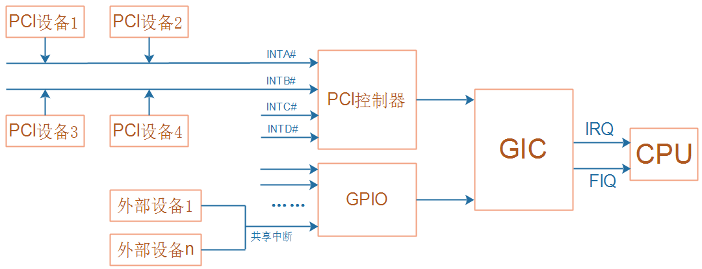
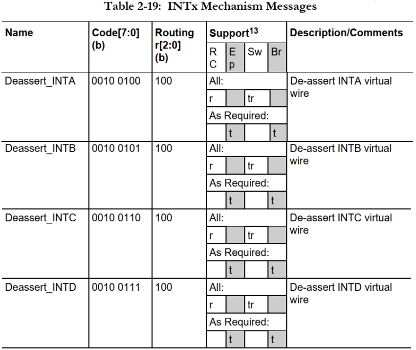

# INTx_MSI_MSIX三种中断机制分析

参考资料：

* 《PCI_SPEV_V3_0.pdf》6.8节

* [PCIe中MSI和MSI-X中断机制](https://blog.csdn.net/pieces_thinking/article/details/119431791)

* [PCIe学习笔记之MSI/MSI-x中断及代码分析](https://blog.csdn.net/yhb1047818384/article/details/106676560/)

* [msix中断分析](https://blog.csdn.net/weijitao/article/details/46566789)

* [MSI中断与Linux实现](https://www.cnblogs.com/gunl/archive/2011/06/09/2076892.html)

* [ARM GICv3中断控制器](https://blog.csdn.net/yhb1047818384/article/details/86708769)

开发板资料：

* https://wiki.t-firefly.com/zh_CN/ROC-RK3399-PC-PLUS/

本课程分析的文件：

* `linux-4.4_rk3399\drivers\pci\host\pcie-rockchip.c`

## 1. PCI设备的INTx中断机制


- 引脚连接GPIO控制器, 由它向GIC发送中断信号, 再由GIC发给CPU.
- PCI 传统方式 可以借 INTA#引脚, 通过物理线路发送中断. 跟GPIO引脚一样.  传统方式中, 还可以不通过物理引脚发中断, 可以通过MSI, MSIX.
- 但对于PCIe总线, 它是通过差分信号传数据的, 没有中断引脚.  
- PCIe驱动 兼容PCI, PCie没有物理线路, 但可以发TLP包, 特殊的TLP消息包, 表示中断产生.
- 
    - PCI通过物理引脚发中断, 触发中断时拉低电平. PCI控制器被中断, 执行中断程序, 清除中断, 会把引脚电平拉高. 电平触发. 
    - PCI设备两个动作: 发出中断, 取消中断.
    - PCIe设备发送 Assert INTA TLP包, 告诉PCIe控制器产生中断. PCIe控制器处理完会发包告诉PCIe设备, 处理完中断了. PCIe设备会再发Deassert INTA TLP包.

传统PCI设备的引脚中有4条线: INTA#, INTB#, INTC#, INTD#, "#"表示低电平有效, 如下图所示:


PCI设备就像普通的设备一样，通过物理引脚发出中断信号：




在PCI设备的配置空间，它声明：通过INTA#、INTB#、INTC#还是INTD#发出中断。


配置空间有2个寄存器：Interrupt Pin、Interrupt Line，作用如下：

* Interrupt Pin：用来表示本设备通过哪条引脚发出中断信号，取值如下

    | Interrupt Pin取值 | 含义              |
    | ----------------: | ----------------- |
    |                 0 | 不需要中断引脚    |
    |                 1 | 通过INTA#发出中断 |
    |                 2 | 通过INTB#发出中断 |
    |                 3 | 通过INTC#发出中断 |
    |                 4 | 通过INTD#发出中断 |
    |            5~0xff | 保留              |

* Interrupt Line：`给软件使用`的，PCI设备本身不使用该寄存器。软件可以写入中断相关的信息，比如在Linux系统中，可以把分配的virq(虚拟中断号)写入此寄存器。软件完全可以自己记录中断信息，`没必要依赖这个寄存器`。


INTx中断是电平触发，处理过程如下：

* PCI设备发出中断：让INTx引脚变低
* 软件处理中断，清除中断：写PCI设备的某个寄存器，导致PCI设备取消中断
* PCI设备取消中断：让INTx引脚变高


## 2. PCIe设备的INTx中断机制

PCIe设备的配置空间也同样有这2个寄存器：Interrupt Pin、Interrupt Line，它们的作用跟PCI设备完全一样。

PCI总线上有INTA#~INTD#这些真实存在的引脚，但是PCIE总线上并没有这些引脚，PCIe设备怎么兼容INTx中断机制？

PCIe设备通过"`INTx模拟`"(PCI Compatible INTx Emulation)来实现传统的INTx中断，当设备需要发出中断时，它会`发出特殊的TLP包`：


TLP头部中，`Message Code`被用来区分发出的是哪类TLP包，以"INTx模拟"为例，有两类TLP包：

* `Assert_INTx`
    - 
    - 也有ABCD几号中断. 发哪个中断, 跟传统PCI设备一样, `写Interrupt Pin 寄存器`.
* `Deassert_INTx`
    - 


跟传统PCI设备类似，这个"INTx模拟"的处理过程也是一样的：

* PCIe设备发出中断：发出Assert_INTx的TLP包
* 软件处理中断，清除中断：写PCIe设备的某个寄存器，导致PCIe设备取消中断
* PCIe设备取消中断：发出Deassert_INTx的TLP包


硬件框图如下：


对于软件开发人员来说，他感觉不到变化：

* PCI设备通过真实的引脚传输中断
* PCIe设备通过TLP实现虚拟的引脚传输中断


PCIe控制器内部接收到INTx的TLP包后，就会向GIC发出中断，最终导致CPU接收到中断信号。

对应的中断程序执行时，会读取PCIe控制器的寄存器，分辨发生的是INTA#~INTD#这4个中断的哪一个。


## 3. MSI中断机制

在PCI系统中，`使用真实的引脚`发出中断已经`带来了不方便`：

* 电路板上需要布线
* 只有4条引脚，`多个PCI设备共享这些引脚`，中断处理效率低。
* PCIe设备也是只能发出4类中断包, 多个PCIe设备也是共享中断的方式. 4类中断包只能对应4个中断. 多个设备共用中断的时候, 就会出现中断分辨的问题. 中断处理效率比较低.
* 所以引入新的中断机制.

在PCI系统中，就已经引入了新的中断机制：MSI，`Message Signaled Interrupts`。

在初始PCI设备时，可以告诉它一个地址(主控芯片的地址)、一个数据：

* PCI设备想发出中断时，往这个地址写入这个数据就可以触发中断
* 软件读到这个数据，就知道是哪个设备发出中断了


- 我们写的程序, 可以通过PCIe控制器, 主动访问到外面的PCI/PCIe控制器. 那么反过来, PCI/PCIe设备也可以主动来读写PCI/PCIe控制器, GIC模块, 甚至是内存等. PCI/PCIe设备有读写外设的能力
- 那么我们就可以在外设上, 比如PCI/PCIe控制器上, 划出一个地址, pcie设备只要把数据写到这个地址上, 就可以触发中断. 当然这个地址可以放到PCI(e)控制器上, 也可以放到GIC上. 设备主动写GIC里的这个地址, 就可以触发中断. 中断直接发给CPU.
- 这就MSI. 通过让设备往某个地址写数据, 来触发中断.
- 那么问题是什么?
    - 首先, 这个地址, 是主控器内部才知道, 设备应该写哪个地址, 写什么数据. 所以这个地址, 是我们的程序告诉pci(e)设备的.
    - 对于MSI机制, PCI/PCIe设备, 把这些信息存储在配置空间.


流程及硬件框图如下：

* 写哪个地址可以触发中断？可能是PCI/PCIe控制器里面的某个地址，也可能是GIC的某个地址
* 初始化PCI/PCIe设备时，把该地址(cpu_addr)转换为pci_addr，告知PCI/PCIe设备(写入它的配置空间)
* PCI/PCIe设备要发出中断时，会发起一个"写内存传输"：往pci_addr写入数据value
* 这导致cpu_addr被写入数据value，触发中断


上图中的"pci_addr/value"保存在哪里？`保存在设备的配置空间的capability里`。


### 3.1 capability

capability的意思是"能力"，PCI/PCIe设备可以提供各种能力，所以在配置空间里有寄存器来描述这些capability：

* 配置空间里有第1个capability的位置：`Capabilities Pointer`
* 它`指向第1个capability的多个寄存器`，`这些寄存器也是在配置空间里`
* 第1个capability的寄存器里，也会`指示第2个capability在哪里`


Capability示例图如下：

* 配置空间0x34位置，存放的是第1个capability的位置：假设是 A4H
* 在配置空间0xA4位置，找到第1个capability，capability的寄存器有如下约定
    * 第1个字节`表示ID`，`每类capability都有自己的ID`
    * 第2个字节表示`下一个capability的位置`，如果`等于0表示这是最后一个capability`
    * 其他寄存器由capability决定，所占据的寄存器数量由capability决定
* 第1个capability里面，它表示下一个capability在5CH
* 在配置空间0x5C位置，找到第2个capability
    * 第1个字节表示ID，第2个字节表示下一个capability的位置(图里是E0H)
    * 其他字节由capability本身决定
* 在配置空间0xE0位置，找到第3个capability
    * 第1个字节表示ID
    * 第2个字节表示下一个capability的位置，这里是00H表示没有更多的capability了
    * 其他字节由capability本身决定


- 假设 capabilities pointer指向这个位置, 有这个结构体. 
- capability ID 每一种能力(功能), 都有自己的ID. 比如若值为5, 表示这是MSI Capability. 主要是用来告诉PCI/PCIe设备, 以后要发出中断, 应该往哪个地址, 写什么数据. 
    - 对应的是 Message Address, Message Data
- 在PCI/PCIe控制器初次扫描枚举PCI/PCIe设备时, 就会把控制器内的cpu_addr先转换成pci_addr, 把这个地址写到设备配置空间的Message Address中, 同时把data也写给 Message Data中.
    - 以后设备想发中断, 就把data写到 Message Address中的地址即可. 它会发起一个数据的写传输, 这些信号会出现在PCI/PCIe总线上. PCI/PCIe控制器或者 GIC 收到这些信号就会触发中断.
- 核心就在于 设备的配置空间里, 有MSI Capability. 里面有寄存器保存 地址, 数据, 还有控制寄存器, 具体数据看下面.

### 3.2 MSI capability

一个PCI设备是否支持MSI，需要读取配置空间的capability来判断: 有MSI capability的话就支持MSI机制。

在配置空间中，MSI capability用来保存：pci_addr、data。表示：PCI设备往这个pci_addr写入data，就可以触发中断。

有如下问题要确认：

* pci_addr是32位、还是64位？
* 能触发几个中断？通过地址来分辨，还是通过数据来分辨？
* 这些中断能否屏蔽？
* 能否读出中断状态？
* 这些问题，都由capability里面的"`Message Control`"决定。

MSI capability格式如下：


### 3.3 格式解析

MSI Capability格式的含义如下：

* Capability ID：对于MSI capability，它的ID为05H

* Next Pointer：下一个capability的位置，00H表示这是最后一个capability

* `Message Control`

    |   位 |             域             | 描述                                                         |
    | ---: | :------------------------: | :----------------------------------------------------------- |
    |    8 | Per-vector masking capable | 是否支持屏蔽单个中断(vector)：<br>1: 支持<br>0: 不支持<br>这是只读位。 |
    |    7 |   64 bit address capable   | 是否支持64位地址：<br />1: 支持<br />0: 不支持<br />这是只读位。 |
    |  6:4 |  Multiple Message Enable   | 系统软件可以支持多少个MSI中断？<br />PCI设备可以表明自己想发出多少个中断，<br />但是到底能发出几个中断？<br />由系统软件决定，它会写这些位，表示能支持多少个中断：<br />000: 系统分配了1个中断<br />001: 系统分配了2个中断<br />010: 系统分配了4个中断<br />011: 系统分配了8个中断<br />100: 系统分配了16个中断<br />101: 系统分配了32个中断<br />110: 保留值<br />111: 保留值<br />这些位是可读可写的。 |
    |  3:1 |  Multiple Message Capable  | PCI设备可以表明自己想发出多少个中断：<br />000: 设备申请1个中断<br />001: 设备申请2个中断<br />010: 设备申请4个中断<br />011: 设备申请8个中断<br />100: 设备申请16个中断<br />101: 设备申请32个中断<br />110: 保留值<br />111: 保留值<br />这些位是只读的。 |
    |    0 |         MSI Enable         | 使能MSI：<br />1: 使能<br />0: 禁止                          |

* Message Address/Message Uper Address: 地址

    * `32位地址`保存在Message Address中
    * `64位地址`：低32位地址保存在Message Address中，高32位地址保存在Message Uper Address中
    * 这些地址是系统软件`初始化PCI设备时分配的`，系统软件把分配的地址写入这些寄存器
    * 这些地址属于`PCI地址空间`

* Message Data：数据

    * 这个寄存器`只有16位`，PCI设备发出中断时数据是32位的，其中`高16位数据为0`
    * 这个寄存器的数值是系统软件初始化设备时写入的
    * 当PCI设备想发出中断是会发起一次写传输：
        * 往Message Address寄存器表示的地址，写入Message Data寄存器的数据
        * 如果可以发出多个中断的话，发出的数据中低位可以改变
        * 比如"Multiple Message Enable"被设置为"010"表示`可以发出4个中断`
        * 那么PCI设备发出的`数据中bit1,0可以修改` (00 01 10 11)
        * 所以说可以增加 中断数

* `Mask Bits/Pending Bits:` 屏蔽位/挂起位，这是可选的功能，`PCI设备不一定实现它`

    * Mask Bits：每一位用来`屏蔽`一个中断，被系统软件设置为1表示禁止对应的中断
    * Pending Bits：每一位用来表示一个中断的状态，这是软件`只读位`，它的值为1表示对应中断发生了，待处理


对于MSI机制, PCI 与 PCIe 是类似的.


- 地址分配至PCI设备之后, 它会通过地址总线, 数据总线 发送写传输.
- 而PCIe 是通过差分线, 发送TLP包, 内含addr 与data, 表示中断信号.

## 4. MSI-X中断机制

MSI机制有几个缺点：

* 每个设备的中断数最大是32，太少了
* 需要系统软件分配`连续的`中断号，很可能失败，也就是说设备想发出N个中断，但是系统软件分配给它的中断少于N个
* 通过MSI发出中断时，地址是固定的

于是引入了`MSI-X机制`：Enhanced MSI interrupt support，它解决了MSI的缺点：

* 可以支持多达2048个中断
* 系统软件可以单独设置每个中断，不需要分配连续的中断号
* 每个中断可以单独设置：PCI设备使用的"地址/数据"可以单独设置
    * 同样的数据可以发给不同的地址.


假设MSI-X可以支持很多中断，每个中断的"地址/数据"都不一样。提问：在哪里描述这些信息？

* "地址/数据"：
    * `不放在配置空间`，空间不够
    * 放在PCI设备的`内存空间`：哪个内存空间？哪个BAR？内存空间哪个位置(偏移地址)？
    * 系统软件可以读写这些内存空间
* 中断的控制信息
    * 使能/禁止？
    * 地址是32位还是64位？
    * 这些控制信息也是`保存`在PCI设备的`内存空间`
* 中断的状态信息(挂起？)
    * 这些信息也是保存在PCI设备的内存空间


### 4.1 MSI-X capability

一个PCI设备是否支持MSI-X，需要读取配置空间的capability来判断: 有MSI-X capability的话就支持MSI-X机制。

MSI-X capability格式如下：


### 4.2 MSI-X capability格式解析

格式解析如下：

* Capability ID：对于MSI-X capability，它的ID为11H

* Next Pointer：下一个capability的位置，00H表示这是最后一个capability

* Message Control

    | 位   | 名            | 描述                                                         |
    | ---- | ------------- | ------------------------------------------------------------ |
    | 15   | MSI-X Enable  | 是否使能MSI-X：<br />1: 使能<br />0: 禁止<br />注意: MSI-X和MSI不能同时使能。 |
    | 14   | Function Mask | 相当于MSI-X中断总开关：<br />1: 所有中断禁止<br />0: 有各个中断的Mask位决定是否使能对应中断 |
    | 13   | 保留          |                                                              |
    | 10:0 | Table Size    | 系统软件读取这些位，算出MSI-X Table的大小，也就是支持多少个中断<br />读出值为"N-1"，表示支持N个中断 |

* Table Offset/Table BIR ：BIR意思为"BAR Indicator register"，表示使用哪个BAR。

    | 位   | 域           | 描述                                                         |
    | ---- | ------------ | ------------------------------------------------------------ |
    | 31:3 | Table Offset | MSI-X Table保存在PCI设备的内存空间里，<br />在哪个内存空间？有下面的"Table BIR"表示。<br />在这个内存空间的哪个位置？由当前这几位表示。 |
    | 2:0  | Table BIR    | 使用哪个内存空间来保存MSI-X Table？<br />也就是系统软件使用哪个BAR来访问MSI-X Table？<br />取值为0~5，表示BAR0~BAR5 |

* PBA Offset/PBA BIR：PBA意思为"Pending Bit Array"，用来表示MSI-X中断的挂起状态。

    | 位   | 域         | 描述                                                         |
    | ---- | ---------- | ------------------------------------------------------------ |
    | 31:3 | PBA Offset | PBA保存在PCI设备的内存空间里，<br />在哪个内存空间？有下面的"PBA BIR"表示。<br />在这个内存空间的哪个位置？由当前这几位表示。 |
    | 2:0  | PBA BIR    | 使用哪个内存空间来保存PBA？<br />也就是系统软件使用哪个BAR来访问PBA？<br />取值为0~5，表示BAR0~BAR5 |


### 4.3 MSI-X Table

PCI设备可以往某个地址写入某个数据，从而触发MSI-X中断。

这些"地址/数据"信息，是由`系统软件分配`的，系统软件要把"地址/数据"发给PCI设备。

PCI设备在哪里保存这些信息？

* 在PCI设备的内存空间
* 在哪个内存空间？由MSI-X capability的"Table BIR"决定
* 在这个内存空间的哪个位置？由MSI-X capability的"Table Offset"决定

MSI-X Table格式如何？如下图所示：


上图中，Msg Data、Msg Addr Msg Upper Addr含义与MSI机制相同：PCI设备要发出MSI-X中断时，往这个地址写入这个数据。如果使用32位地址的话，写哪个地址由Msg Addr寄存器决定；如果使用64位地址的话，写哪个地址由Msg Addr和Msg Upper Addr这两个寄存器决定。

Vector Control寄存器中，`只有Bit0有作用`，表示"Mask Bit"。系统软件写入1表示禁止对应中断，写入0表示使能对应中断。


### 4.4 PBA

PBA意思为"`Pending Bit Array`"，用来`表示MSI-X中断的挂起状态`。它的格式如下：

这些"挂起"信息，是由PCI设备设置，系统软件`只能读取这些信息`。

PCI设备在哪里保存这些信息？

* 在`PCI设备的内存空间`
* 在哪个内存空间？由`MSI-X capability`的"`PBA BIR`"决定
* 在这个内存空间的哪个位置？由MSI-X capability的"`PBA Offset`"决定

PBA格式如下：`每一位对应一个中断`，`值为1表示中断发生`了、等待处理。


### 4.5 笔记


- Capability ID 为11h 表示 MSI-X Capability.
- Table BIR: 基地址寄存器, 一共6个基地址寄存器, 取值0到5. 
- MSI-X 可以支持多个中断, 需要把 addr 跟 data保存 到设备的内存空间. 
- 每个BAR对应一个内存空间, 可能不会有6个内存空间, 但至少有一个.
- 如果 Table BIR 为0 , 就表示 把addr data 放到第0个内存空间. 这个内存空间就是存放 MSI-X table, 即 addr data.
    - 内存空间很大, 存在哪里? 由offset定位. 这个offset的值由 Table Offset决定.
- 内存空间里的 MSI-X Table 就是由一行一行的数据组成的. 每一行就是一项(entry). 有N个中断, 那么就有N项(entry).
- 这些信息都是在扫描枚举设备的时候, 配置进来的.
- addr 同样是由主控确定了 然后转换成pci地址, 写给设备的. 主控发过来, 设备保存到自己的内存空间.
- 支持多少个中断, 是在Message Control里确定的, 知道了支持多少个中断. 就会给它分配 addr 和 data. 保存的位置, 由 BIR,  Offset决定. 而这些信息是硬件出厂就写好的.
    - 我们能改的, 就是根据这些出厂设置的信息, 找到对应的内存空间. 把entry信息写进这个内存空间.
- 使能中断: 使用entry里的Vector Control来使能单个中断. 或者使用 Message Control 使能所有中断. 
    - 要先使能Message Control里的总开关, 才能再单独使能某一中断.

## 5. MSI/MSI-X操作流程

### 5.1 扫描设备

扫描设备，读取capability，确定是否含有MSI capability、是否含有MSI-X capability。只能选择一个机制.


### 5.2 配置设备

一个设备，可能都支持INTx、MSI、MSI-X，这3中方式只能选择一种。INTx不用配置.


> 5.2.1 MSI配置

系统软件读取MSI capability，确定设备想申请多少个中断。

系统软件确定能分配多少个中断给这个设备，并把"地址/数据"写入MSI capability。

如果MSI capability支持中断使能的话，还需要系统软件设置MSI capability来使能中断。

注意：如果`支持多个MSI中断`，PCI设备发出中断时，写的是`同一个地址`，但是`数据的低位可以发生变化`。(多个data都往一个地址发)

比如支持4个MSI中断时，通过数据的bit1、bit0来表示是哪个中断。

- 设备可能会申请很多中断, 而系统可能会分配很少的中断.


> 5.2.2 MSI-X配置

MSI-X机制中，中断相关的更多信息保存在设备的内存空间。所以要使用MSI-X中断，要先配置设备、分配内存空间。

然后，系统软件读取MSI-X capability，确定设备需要多少个中断。

系统软件确定能分配多少个中断给这个设备，并把多个"地址/数据"写入MSI-X Table。

注意：PCI设备要发出MSI-X中断时，它会往"地址"写入"数据"，这些"地址/数据"一旦配置后是不会变化的。MSI机制中，数据可以变化，MSI-X机制中数据不可以变化。

MSI-X的每一个中断, 都可以对应不同的地址. 可以用不同的地址, 也可以用相同的地址. 但data是不会变的.

`使能中断`：设置`总开关`、MSI-X Table中某个中断的开关。


注意：MSI-X Table中，每一项都可以保存一个"地址/数据"，Table中"地址/数据"可以相同，也就是说：PCI设备发出的中断可以是同一个。


### 5.3 设备发出中断

PCI设备发出MSI中断、MSI-X中断时，都是发起"数据写"传输，就是往指定地址写入指定数据。

PCI控制器接收到数据后，就会触发CPU中断。


### 5.4 中断函数

系统软件执行中断处理函数。


# INTx中断机制源码分析

参考资料：

* 《PCI_SPEV_V3_0.pdf》6.8节
* 《devicetree-specification-v0.2.pdf》

开发板资料：

* https://wiki.t-firefly.com/zh_CN/ROC-RK3399-PC-PLUS/

本课程分析的文件：

* `linux-4.4_rk3399\drivers\pci\host\pcie-rockchip.c`


## 1. 配置空间

无论是PCI设备还是PCIe设备，它们都可以在配置空间里声明：通过INTA#、INTB#、INTC#还是INTD#发出中断。


配置空间有2个寄存器：Interrupt Pin、Interrupt Line，作用如下：

* Interrupt Pin：用来表示本设备通过哪条引脚发出中断信号，取值如下

    | Interrupt Pin取值 | 含义              |
    | ----------------: | ----------------- |
    |                 0 | 不需要中断引脚    |
    |                 1 | 通过INTA#发出中断 |
    |                 2 | 通过INTB#发出中断 |
    |                 3 | 通过INTC#发出中断 |
    |                 4 | 通过INTD#发出中断 |
    |            5~0xff | 保留              |

* Interrupt Line：给软件使用的，PCI设备本身不使用该寄存器。软件可以写入中断相关的信息，比如在Linux系统中，可以把分配的virq(虚拟中断号)写入此寄存器。软件完全可以自己记录中断信息，没必要依赖这个寄存器。


## 2. 扫描设备时分配中断号

PCIe设备在硬件信息里表明自己可以发出哪个中断，比如INTA、INTB、INTC或INTD，这个中断要转换为`中断号`，我们编写的软件才可以为它注册中断处理函数。

`怎么得到中断号`？下面只列出调用过程，后面再分析：

```shell
rockchip_pcie_probe
    bus = pci_scan_root_bus(&pdev->dev, 0, &rockchip_pcie_ops, rockchip, &res);
		pci_scan_root_bus_msi
            pci_scan_child_bus
            	pci_scan_slot
            		dev = pci_scan_single_device(bus, devfn);
						dev = pci_scan_device(bus, devfn);
							struct pci_dev *dev;
							dev = pci_alloc_dev(bus);
							pci_setup_device
                                pci_read_bases(dev, 6, PCI_ROM_ADDRESS);	
                        pci_device_add(dev, bus);
                        	pcibios_add_device(struct pci_dev *dev)
                        		dev->irq = of_irq_parse_and_map_pci(dev, 0, 0);
```


解析出中断信息后，分配的中断号放在pci_dev的irq里面：

```c
pci_scan_single_device
    pci_device_add
    	pcibios_add_device(struct pci_dev *dev)
    		dev->irq = of_irq_parse_and_map_pci(dev, 0, 0);
```


## 3. 使用INTx中断

每个PCIe设备，在Linux内核里都对应一个pci_dev结构体：


可以为这个设备注册中断：

```c
request_irq(pci_dev->irq, ....);
```


## 4. PCIe中断树

要分析PCIe设备中断号的分配过程，需要从RK3399的芯片资料开始学习。

层级结构为：PCIe设备 => PCIe控制器 => GIC =>CPU


在设备树中：

```shell
       gic: interrupt-controller@fee00000 {
                compatible = "arm,gic-v3";
                #interrupt-cells = <4>;
                #address-cells = <2>;
                #size-cells = <2>;
                ranges;
                interrupt-controller;
                /* 省略 */
		};

       pcie0: pcie@f8000000 {
                compatible = "rockchip,rk3399-pcie";
                #address-cells = <3>;
                #size-cells = <2>;
                aspm-no-l0s;
                clocks = <&cru ACLK_PCIE>, <&cru ACLK_PERF_PCIE>,
                         <&cru PCLK_PCIE>, <&cru SCLK_PCIE_PM>;
                clock-names = "aclk", "aclk-perf",
                              "hclk", "pm";
                bus-range = <0x0 0x1f>;
                max-link-speed = <1>;
                linux,pci-domain = <0>;
                msi-map = <0x0 &its 0x0 0x1000>;
                interrupts = <GIC_SPI 49 IRQ_TYPE_LEVEL_HIGH 0>,
                             <GIC_SPI 50 IRQ_TYPE_LEVEL_HIGH 0>,
                             <GIC_SPI 51 IRQ_TYPE_LEVEL_HIGH 0>;
                interrupt-names = "sys", "legacy", "client";
                #interrupt-cells = <1>;
                interrupt-map-mask = <0 0 0 7>;
                interrupt-map = <0 0 0 1 &pcie0_intc 0>,
                                <0 0 0 2 &pcie0_intc 1>,
                                <0 0 0 3 &pcie0_intc 2>,
                                <0 0 0 4 &pcie0_intc 3>;
	};
```

- 中断的初始化流程: pcie控制器, 会向上一级发送3个中断, SPI 49(81), 50(82), 51(83). 对应的是sys系统中断, legacy传统中断(兼容PCI,处理INTA, B, C, D), 还有client中断.
- 81 82 83三个中断具体是什么, 看下面5.1.


发出中断的过程：

* 任何一个`PCIe设备`向`PCIe控制器`发出"`Assert INTx`"(x=A/B/C/D)这类`TLP包`
* PCIe控制器就会`向GIC发出第50号SPI(Shared Peripheral Interrupts)中断`
* GIC再给CPU发出中断。

中断的处理过程是反过来的：

* CPU接收到中断，跳转到`异常向量表`处理代码，会`调用GIC驱动`
* GIC：`读取寄存器`，得知发生的是SPI 50号中断，这个`中断函数`由`PCIe控制器驱动提供`
* PCIe控制器：读取`PCIe控制器的寄存器`，`分辨`是INTA还是INTB、INTC、INTD，`调用对应函数`，这个函数由`PCIe设备驱动程序提供`
* PCI设备：`提供设备相关的驱动程序`


- Pcie控制器内也有一个中断控制器, 也会有irq_domain, 来保存硬件中断号跟虚拟中断号的映射关系.


- INTA是个共享中断, 多个PCIe设备都可以注册中断函数. 这些函数就在irqaction链表里.
- 上面几个图, 发生中断, 是1234. 处理中断是ABCD.

## 5. PCIe INTx中断映射过程

文件：`drivers\pci\host\pcie-rockchip.c`

### 5.1 PCIe控制器支持的中断

对于RK3399，PCIe控制器可以向GIC发出3个中断：sys、legacy、client：

* sys：下图中Event ID为81，就是SPI 49号中断(81=32+49)，用来处理一些系统性的中断，比如电源状态、热拔插
* legacy：用来处理PCIe设备发来的INTA/INTB/INTC/INTD中断
* client：跟外接的PCIe设备通信时，可能会发送传输错误，用这个中断来处理


在设备树中，这3类中断如下定义：

```shell
       pcie0: pcie@f8000000 {
       			/* 省略 */
                interrupts = <GIC_SPI 49 IRQ_TYPE_LEVEL_HIGH 0>,
                             <GIC_SPI 50 IRQ_TYPE_LEVEL_HIGH 0>,
                             <GIC_SPI 51 IRQ_TYPE_LEVEL_HIGH 0>;
                interrupt-names = "sys", "legacy", "client";
```


### 5.2 PCIe控制器注册中断

- 
    - 82号中断对应的虚拟中断号, 就是从platform_get_irq_byname函数中返回的. 然后给他申请一个中断处理函数
    - 
    - 这个 rockchip_pcie_legacy_int_handler 就是要去 读pcie控制器的寄存器. 分辨中断. 然后把读到的硬件中断号 转成 虚拟终端号.


为什么legacy中断的函数，不是使用`devm_request_irq`而是使用`irq_set_chained_handler_and_data`?

- 因为发生legacy中断时，rockchip_pcie_legacy_int_handler函数要进一步分辨发生的是INTA还是INTB、INTC、INTD中断，然后处理。


### 5.3 PCIe设备中断号的分配

5.3.1 IRQ domain

在设备树里，PCIe控制器的节点里有一个更下一级的中断控制器，这是一个虚拟的中断控制器：

```shell
          pcie0: pcie@f8000000 {
          		#address-cells = <3>;
          		#interrupt-cells = <1>;
          		
               	interrupt-map-mask = <0 0 0 7>;
                interrupt-map = <0 0 0 1 &pcie0_intc 0>,
                                <0 0 0 2 &pcie0_intc 1>,
                                <0 0 0 3 &pcie0_intc 2>,
                                <0 0 0 4 &pcie0_intc 3>;
          
                pcie0_intc: interrupt-controller {
                        interrupt-controller;
                        #address-cells = <0>;
                        #interrupt-cells = <1>;
                };                    
          };
```


在代码里，对于`pcie0_intc`会创建出一个IRQ domain：


在设备树的`interrupt-map`里面就用到了这个子节点，也就是用到了对应的IRQ domain：

```shell
               	interrupt-map-mask = <0 0 0 7>;
                interrupt-map = <0 0 0 1 &pcie0_intc 0>,
                                <0 0 0 2 &pcie0_intc 1>,
                                <0 0 0 3 &pcie0_intc 2>,
                                <0 0 0 4 &pcie0_intc 3>;
```


- PCIe设备会向PCIe控制器发送, INTA, INTB, INTC, INTD四个中断, 再PCIe中断控制器中对应0, 1, 2, 3. 然后PCIe中断控制器, 向GIC发送三种GIC_SPI.
- 所以PCIe中断控制器, 会把4个硬件中断号, 转成4个virq号, 并分配irq_desc.


5.3.2 得到PCIe设备的中断号

从PCIe设备得到的硬件中断信息，将会映射得到pcie0_intc，从它里面得到中断号。

这会涉及`interrupt-map-mask`、`interrupt-map`，比较复杂，在视频里讲解。

```shell
pci_scan_single_device
    pci_device_add
    	pcibios_add_device(struct pci_dev *dev)
    		dev->irq = of_irq_parse_and_map_pci(dev, 0, 0);

of_irq_parse_and_map_pci
	ret = of_irq_parse_pci(dev, &oirq);
				rc = pci_read_config_byte(pdev, PCI_INTERRUPT_PIN, &pin);

                out_irq->np = ppnode;
                out_irq->args_count = 1;
                out_irq->args[0] = pin;
                laddr[0] = cpu_to_be32((pdev->bus->number << 16) | (pdev->devfn << 8));
                laddr[1] = laddr[2] = cpu_to_be32(0);
                rc = of_irq_parse_raw(laddr, out_irq);				
	
	return irq_create_of_mapping(&oirq);
```


- 现在接了一个PCIe设备, 在它的配置空间里, 再Interrupt Pin中 表明自己想发 INTA 1号中断. 驱动程序读取这个设备的配置空间, 发现它想申请1号 INTA中断, 那应该给它分配一个虚拟中断号.
- 这个虚拟中断号如何确定. 
    - 看上图的设备树. 
    - 想要申请1号中断, Interrupt-map 就把 1号中断 映射到 pcie0中断控制器域中的 0号中断. 2对1, 3对2, 4对3. 一一映射.
    - 映射过程: 
        - 首先配置PCIe设备的时候, 给它写了 bus/device/func 三个号, 来确定它. 这三个值, 组成一个整型数, 放在一个数组里. 也就是说一个PCIe设备会得到 三个整数, 第一个整数(下标[0]) 是B/D/F的组合数, 第2个(下标[1]) 第3个(下标[2])都是0.
        - 读设备的配置空间, 它可能会申请 4种中断的其中之一,  假设是1.
        - 上面读硬件信息得到了, 4个整数: [0] 是bus/device/func 三个号的组合数, 称之为x; [1]是0, [2]是0; 最后一个整数是 想要申请的中断号 1.
            - 然后 x 0 0 1 这4个整数跟 设备树里的 Interrupt-map-mask进行 按位与 运算. 即x 0 0 1 和 0 0 0 7 按位与, 得到 0 0 0 1. 
            - 再把这个结果跟 Interrupt-map里 每一项的前4位比较. 就是对应这个 pcie0 中断控制器域中的 哪一项. 这个例子里就是第0项.
        - 然后去pcie0中断控制器对应的代码里, 找到硬件中断号0对应的virq以及对应的信息.

- 

- of_irq_parse_raw 中:
    - 
    - 然后进行比较. 比较过程比较复杂. 最终得到结果, 对应域中哪个中断号.
- 解析完创建映射. irq_create_of_mapping

 

