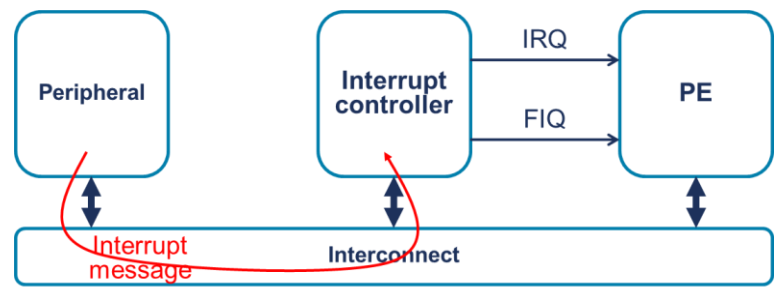
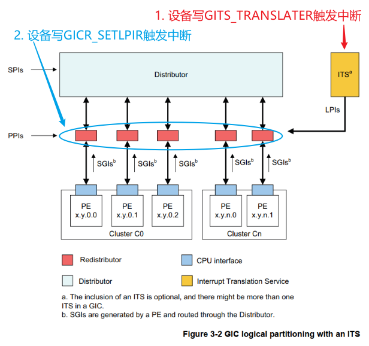
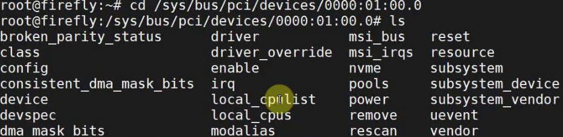
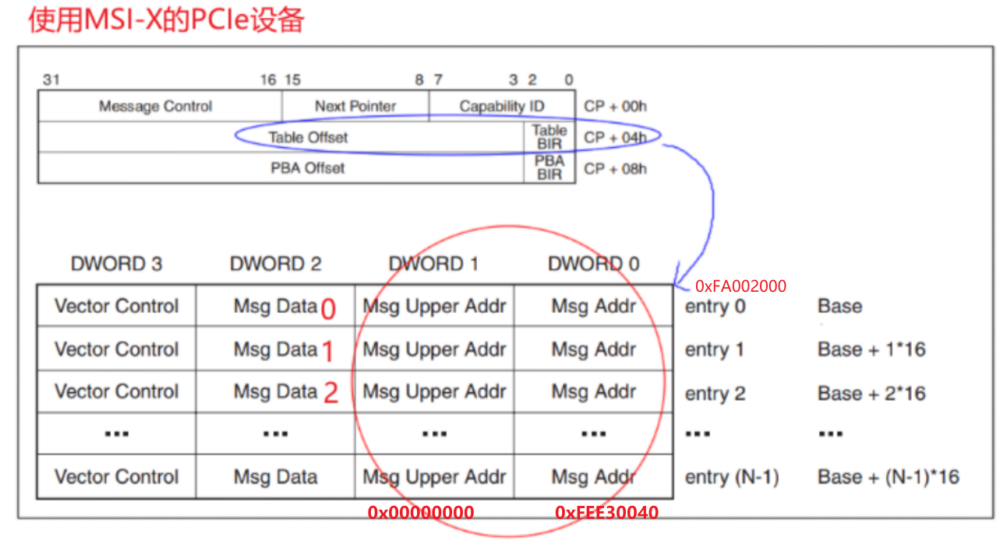
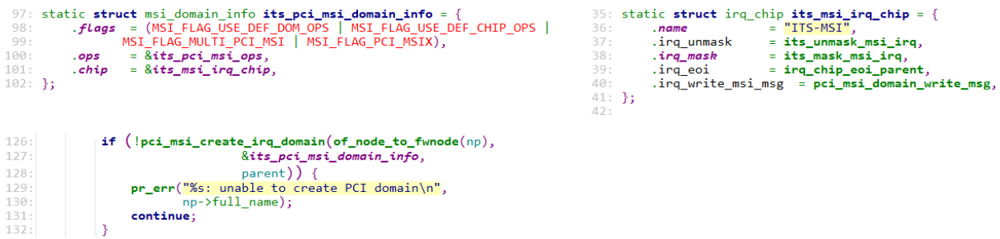
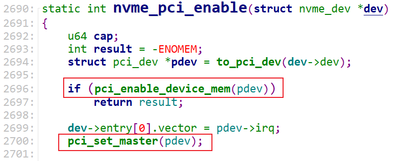

# GICv3_LPI机制

参考资料：这几个PDF文档在GIT仓库的`IMX6ULL\doc_pic\08_Interrupt`里

* 《ARM® Generic Interrupt Controller Architecture Specification Architecture version 2.0(IHI0048B_b_gic_architecture_specification_v2).pdf》
* 《IHI0069G_gic_architecture_specification.pdf》第5章
* 《GICv3_Software_Overview_Official_Release_B.pdf》
* [ARM GIC（六）gicv3架构-LPI](http://www.lujun.org.cn/?p=3921)

## 1. GICv2

框图如下：


`GIC V2`有3种中断：

① 软件触发中断（SGI，Software Generated Interrupt）
  	这是由软件通过`写入专用仲裁单元的寄存器`即软件触发中断寄存器（ICDSGIR）显式生成的。它`最常用于CPU核间通信`。SGI既可以发给所有的核，也可以发送给系统中选定的一组核心。`中断号0-15保留用于SGI的中断号`。用于通信的确切中断号由软件决定。 

② 私有外设中断（PPI，Private Peripheral Interrupt）
	这是由单个CPU核私有的外设生成的。PPI的中断号为16-31。它们标识CPU核私有的中断源，并且独立于另一个内核上的相同中断源，比如，每个核的计时器。

③ 共享外设中断（SPI，Shared Peripheral Interrupt）
	这是由外设生成的，中断控制器可以将其路由到多个核。中断号为32-1020。SPI用于从整个系统可访问的各种外围设备发出中断信号。


在`GICv2`里，设备向中断控制器发出中断，`必须`使用`物理上`的线路：


在复杂系统中有成百上千的中断时，就需要成百上千的中断信号线，这太复杂了。硬件设计太复杂.

于是在`GICv3`中引入MSI("`message-based interrupts`")，`设备往某个地址写入数值`，即可`触发中断`。


## 2. GICv3

### 2.1 MSI

在`GICv3`里，添加了`MSI`("message-based interrupts")，`设备往某个地址写入数值`，即可触发中断：



使用消息来发送中断，好处是可以`省略硬件线路`。在大型系统中有成百上千个中断，使用MSI可以`省下很多线路`。


### 2.2 GICv3内部结构

`GIC V3`里新增加了一类中断：`LPI(Locality-specific Peripheral Interrupts)`

框图如下：



对于`原来的SPI`，它也是`可以使用MSI的方式传递`的，这个功能是可选的。如果GICv3支持MSI方式的SPI，要产生/清除中断时，操作如下GIC寄存器：

* 产生中断：`写寄存器GICD_SETSPI_NSR` 或 `GICD_SETSPI_SR  `
* 清除中断：`写寄存器GICD_CLRSPI_NSR` 或 `GICD_CLRSPI_SR  `

对于`LPI中断`，有`两种触发方式`：

* 写寄存器`GITS_TRANSLATER`
    * 设备把`数据写入GITS_TRANSLATER寄存器`，写入的值被称为`EventID`
* 写寄存器`GICR_SETLPIR`


### 2.3 中断号

0~1023跟GICv2保存一致。

|         INTID | 中断类型 | 描述                       |
| ------------: | :------: | -------------------------- |
|          0~15 |   SGI    |                            |
|         16~31 |   PPI    |                            |
|       32~1019 |   SPI    | 设备发出的中断             |
|     1020~1023 |   SPI    | 用于特殊目的               |
|     1024~1055 |    -     | 保留                       |
|     1056~1119 |   PPI    | 扩展的PPI，`GICv3.1`才支持 |
|     1120~4095 |    -     | 保留                       |
|     4096~5119 |   SPI    | 扩展的SPI，`GICv3.1`才支持 |
|     5120~8191 |    -     | 保留                       |
| 8192~芯片实现 |   LPI    |                            |


## 3. LPI的触发方式

LPI有两种触发中断的方式：

* 把`INTID`直接写入`GICR_SETLPIR寄存器`
* `使用ITS把EventID 转换为LPI INTID`，会用到"`GITS_TRANSLATER`"寄存器

这两种方法只能支持一种。


### 3.1 使用GICR_SETLPIR

这个寄存器格式如下：


把`LPI的中断号写入这个寄存器`即可触发中断。


### 3.2 使用ITS

ITS的意思是：`Interrupt Translation Service`，中断转换服务。


能产生MSI中断的设备，都有一个`DeviceID`(设备ID)，它产生的`每一个MSI中断`都有一个`EventID`(事件ID)。"`DeviceID+EventID`"组合被`传入ITS`，`ITS会把它们转换为INTID`。

过程如下：

* `外设发生中断消息(Interrupt Message)到ITS`
    * 外设只要`写GITS_TRANSLATER`就可以`构造, 发送消息`, 这个寄存器格式如下：
        - 
    * `消息里`包含有: `DeviceID`(哪一个设备), `EventID`(这个设备的哪一个中断)
* ITS`使用DeviceID`在`Device Table`中找到一项
    * `只有一个Device Table`
    * 每一个`能发生MSI中断的设备`在Device Table里面都`有一项`, 这一项存放的是 这个设备的`Interrupt Translation Table`(中断转换表，简称ITT) 的首地址.
    * 每一个能发生MSI中断的设备, 都有一个ITT
* ITS使用`EventID在ITT中找到一项`, 从中`返回 INTID 和 Collection ID`
* ITS使用`Collection ID`在`Collection Table`中找到一项, 从中返回"`Target Redistributor`", 即: 中断发给哪个CPU
* `ITS 把 INTID 发给 Redistributor`


上图中`Device Table`, `Interrupt Translation Table`, `Collection Table`都是`在内存里`, 但是我们`不能直接去设置内存`. 而是`通过发送ITS命令来设置这些表格`. 

我们不研究ITS的内部细节，暂且了解这些内容即可。


- 假设有N个设备可以发出MSI/LPI中断. 每个设备都有唯一的DeviceID. 每个设备都有一个ITT. 
- 每个设备在Device Table里都有一项, 这一项存放 ITT的首地址.
- 设备发出的 Interrupt Message 里面有DeviceID  跟 EventID
- EventID就是 发出的中断号. 每个设备都可以发出多个中断, 比如M个中断吧.
- 那么ITT里, 就有M项, 每一项都有 INTID跟 Collection ID.
- 所以. DeviceID找到这个设备对应的Device Table项, 根据项中的地址, 找到自己的ITT. 再根据EventID在ITT里找到 INTID跟Collection ID.
- 再用Collection ID 在Collection Table里找到一项, 项里保存着Target Redistributor, 即这个中断的目的地, 哪个CPU核.

我们学 PCIe 记住 GITS_TRANSLATER 这个寄存器就行了.

# MSI_MSI-X中断之体验与使用

开发板资料：

* https://wiki.t-firefly.com/zh_CN/ROC-RK3399-PC-PLUS/

参考内核文件：

* `Documentation\PCI\MSI-HOWTO.txt`
* `drivers\pci\host\pcie-rockchip.c`
* `drivers\nvme\host\pci.c`
* `drivers\irqchip\irq-gic-v3.c`
* `drivers\irqchip\irq-gic-v3-its.c`
* `drivers\irqchip\irq-gic-v3-its-pci-msi.c`


## 1. 怎么发出MSI/MSI-X中断

PCIe设备向发出中断，它发出TLP包，往某个地址写入某个数据即可：

* 往哪个地址？GICv3 ITS的GITS_TRANSLATER寄存器，TLP包里使用的是PCI地址
* 写什么数据？0、1、2、……，要发出第1个中断时写0，要发出第2个中断时写1，……


在设备树文件rk3399.dtsi中，可以看到ITS的基地址是0xfee20000：

```shell
its: interrupt-controller@fee20000 {
                        compatible = "arm,gic-v3-its";
                        msi-controller;
                        reg = <0x0 0xfee20000 0x0 0x20000>;
                };
```

在`IHI0069G_gic_architecture_specification.pdf`中有`ITS寄存器`的偏移地址：


`GITS_TRANSLATER寄存器`的`CPU地址`是：0xfee20000 + 0x010000 + 0x0040 = `0xfee30040`.

对应的`PCI地址`也是0xfee30040(驱动程序里为例方便, 故意使得CPU地址跟PCI地址相同, 这2个地址属于不同地址空间)，

所以下图中PCI地址都是`0xfee30040`.


- 之前说过, PCIe控制器在扫描枚举PCIe设备的时候, 就会把 中断目的地址(CPU地址空间) 转换成PCIe地址空间的地址, 写到设备的配置空间里.
    - 使用MSI的设备是写到配置空间, 使用MSI-X是写到 内存空间(从配置空间指向)的中断向量表里.

问题来了: 我去哪找到这个PCIe设备, 找到其中的中断向量表所在的位置呢?

- 往下面看

### 1.1 在RK3399上体验

我们使用RK3399开发板，插上了**NVMe** SSD固态硬盘。


> 1.1.1 安装工具

请给RK3399刷入Ubuntu映像文件，然后在开发板上执行：

```c
udhcpc  # 获取IP
apt update  # 更新源
apt install pciutils  # 安装lspci工具
apt install devmem2   # 安装devmem2工具 用来读任意物理地址
```


> 1.1.2 查看设备MSI-X信息

先看看有哪些设备:

- 
    - 前面4个0, 是域. 我们这个rk3399上只有一个pcie控制器, 所以是0000, 如果有第二个控制器, 就是0001.
    - 第二个参数是总线, 00号总线 01号总线
    - 第三个参数是设备号, 00 
    - 最后点后面的就是设备里的 功能号. 
    - 这个PCIe控制器对应的是 第二个: 0000:01:00.0
- 进去看看
    - 
    - ls -l 一下
    - 

执行`lspci -vvv`，得到如下信息：

- 
    - 00总线, 00设备, 0功能, 就是pci 桥.

```shell
01:00.0 Non-Volatile memory controller: Silicon Motion, Inc. Device 2263 (rev 03) (prog-if 02 [NVM Express])
        Subsystem: Silicon Motion, Inc. Device 2263
        Control: I/O- Mem+ BusMaster+ SpecCycle- MemWINV- VGASnoop- ParErr- Stepping- SERR- FastB2B- DisINTx+
        Status: Cap+ 66MHz- UDF- FastB2B- ParErr- DEVSEL=fast >TAbort- <TAbort- <MAbort- >SERR- <PERR- INTx-
        Latency: 0
        Interrupt: pin A routed to IRQ 231
        Region 0: Memory at fa000000 (64-bit, non-prefetchable) [size=16K]
        Capabilities: [40] Power Management version 3
                Flags: PMEClk- DSI- D1- D2- AuxCurrent=0mA PME(D0-,D1-,D2-,D3hot-,D3cold-)
                Status: D0 NoSoftRst+ PME-Enable- DSel=0 DScale=0 PME-
        Capabilities: [50] MSI: Enable- Count=1/8 Maskable+ 64bit+
                Address: 0000000000000000  Data: 0000
                Masking: 00000000  Pending: 00000000
        Capabilities: [70] Express (v2) Endpoint, MSI 00
                DevCap: MaxPayload 128 bytes, PhantFunc 0, Latency L0s unlimited, L1 unlimited
                        ExtTag- AttnBtn- AttnInd- PwrInd- RBE+ FLReset+ SlotPowerLimit 0.000W
                DevCtl: Report errors: Correctable- Non-Fatal- Fatal- Unsupported-
                        RlxdOrd+ ExtTag- PhantFunc- AuxPwr- NoSnoop- FLReset-
                        MaxPayload 128 bytes, MaxReadReq 512 bytes
                DevSta: CorrErr- UncorrErr- FatalErr- UnsuppReq- AuxPwr+ TransPend-
                LnkCap: Port #0, Speed 8GT/s, Width x4, ASPM L1, Exit Latency L0s <1us, L1 <8us
                        ClockPM+ Surprise- LLActRep- BwNot- ASPMOptComp+
                LnkCtl: ASPM Disabled; RCB 64 bytes Disabled- CommClk-
                        ExtSynch- ClockPM- AutWidDis- BWInt- AutBWInt-
                LnkSta: Speed 2.5GT/s, Width x4, TrErr- Train- SlotClk+ DLActive- BWMgmt- ABWMgmt-
                DevCap2: Completion Timeout: Range ABCD, TimeoutDis+, LTR+, OBFF Not Supported
                DevCtl2: Completion Timeout: 50us to 50ms, TimeoutDis-, LTR-, OBFF Disabled
                LnkCtl2: Target Link Speed: 8GT/s, EnterCompliance- SpeedDis-
                         Transmit Margin: Normal Operating Range, EnterModifiedCompliance- ComplianceSOS-
                         Compliance De-emphasis: -6dB
                LnkSta2: Current De-emphasis Level: -3.5dB, EqualizationComplete-, EqualizationPhase1-
                         EqualizationPhase2-, EqualizationPhase3-, LinkEqualizationRequest-
        Capabilities: [b0] MSI-X: Enable+ Count=16 Masked-
                Vector table: BAR=0 offset=00002000
                PBA: BAR=0 offset=00002100
        Capabilities: [100 v2] Advanced Error Reporting
                UESta:  DLP- SDES- TLP- FCP- CmpltTO- CmpltAbrt- UnxCmplt- RxOF- MalfTLP- ECRC- UnsupReq- ACSViol-
                UEMsk:  DLP- SDES- TLP- FCP- CmpltTO- CmpltAbrt- UnxCmplt- RxOF- MalfTLP- ECRC- UnsupReq- ACSViol-
                UESvrt: DLP+ SDES+ TLP- FCP+ CmpltTO- CmpltAbrt- UnxCmplt- RxOF+ MalfTLP+ ECRC- UnsupReq- ACSViol-
                CESta:  RxErr- BadTLP- BadDLLP- Rollover- Timeout- NonFatalErr-
                CEMsk:  RxErr- BadTLP- BadDLLP- Rollover- Timeout- NonFatalErr+
                AERCap: First Error Pointer: 00, GenCap+ CGenEn- ChkCap+ ChkEn-
        Capabilities: [158 v1] #19
        Capabilities: [178 v1] Latency Tolerance Reporting
                Max snoop latency: 0ns
                Max no snoop latency: 0ns
        Capabilities: [180 v1] L1 PM Substates
                L1SubCap: PCI-PM_L1.2+ PCI-PM_L1.1+ ASPM_L1.2+ ASPM_L1.1+ L1_PM_Substates+
                          PortCommonModeRestoreTime=10us PortTPowerOnTime=10us
                L1SubCtl1: PCI-PM_L1.2- PCI-PM_L1.1- ASPM_L1.2- ASPM_L1.1-
                           T_CommonMode=0us LTR1.2_Threshold=0ns
                L1SubCtl2: T_PwrOn=10us
        Kernel driver in use: nvme
```

- 01:00.0 就是我们的固态硬盘了. Non-Volatile memory controller 非易失性内存控制器.
- Region 0: Memory at fa000000 : Region0的地址, 是pcie地址空间的, 这里是指BAR0?

从上述信息可以看到：

```shell
        Region 0: Memory at fa000000 (64-bit, non-prefetchable) [size=16K]
        Capabilities: [b0] MSI-X: Enable+ Count=16 Masked-
                Vector table: BAR=0 offset=00002000
                PBA: BAR=0 offset=00002100
```

这表示：

* MSI-X: Enable+：使用MSI-X功能
* Vector table: BAR=0 offset=00002000：MSI的向量在BAR 0偏移地址0x00002000处
* Region 0: Memory at fa000000：
    * BAR 0的PCI地址是0xfa000000，
    * 驱动程序里为了方便令CPU地址等于PCI地址，所以BAR的CPU地址也是0xfa000000。

我们可以去读取 `0xfa000000 + 0x00002000`开始的向量表，验证里：

* msg addr为0xfee30040
* msg data为0、1、……



> 1.1.3 验证MSI-X信息


## 2. 怎么使用MSI/MSI-X

参考内核文档: `Documentation\PCI\MSI-HOWTO.txt`,`drivers\nvme\host\pci.c`

我们写程序, 怎么来使用MSI/MSI-X 中断. 我们优先使用MSI-X中断, 不行就用MSI. MSI也不能用, 就用传统的中断线路.

主要函数是这2个:

```c
int pci_enable_msix_range(struct pci_dev *dev, struct msix_entry *entries, int minvec, int maxvec);
int pci_enable_msi_range(struct pci_dev *dev, int minvec, int maxvec);
```

- MSI-X第3个参数是向量最小值.

示例代码如下:

```c
	// 分配 msix_entry 数组，每一数组项用来保存一个中断的信息
	dev->entry = kzalloc_node(num_possible_cpus() * sizeof(*dev->entry),
							GFP_KERNEL, node);

	// 先尝试使用MSI-X
	vecs = pci_enable_msix_range(pdev, dev->entry, 1, nr_io_queues);//最小向量从1开始
	if (vecs < 0) {
        // 失败了, 再尝试使用MSI
		vecs = pci_enable_msi_range(pdev, 1, min(nr_io_queues, 32));
		if (vecs < 0) {
			vecs = 1;
		} else {
			for (i = 0; i < vecs; i++)
				dev->entry[i].vector = i + pdev->irq;
		}
	}

	//然后就可以 request_irq: 中断号都保存在dev->entry[i].vector里
		request_irq(dev->entry[i].vector, ...);

static void nvme_create_io_queues(struct nvme_dev *dev)
{
    for (i = dev->online_queues; i <= dev->queue_count - 1; i++)
		if (nvme_create_queue(dev->queues[i], i)) {
			nvme_free_queues(dev, i);
			break;
		}
}
static int nvme_create_queue(struct nvme_queue *nvmeq, int qid)
{
    result = queue_request_irq(dev, nvmeq, nvmeq->irqname);
}
static int queue_request_irq(struct nvme_dev *dev, struct nvme_queue *nvmeq,
							const char *name)
{
	if (use_threaded_interrupts)
		return request_threaded_irq(dev->entry[nvmeq->cq_vector].vector,
					nvme_irq_check, nvme_irq, IRQF_SHARED,
					name, nvmeq);
	return request_irq(dev->entry[nvmeq->cq_vector].vector, nvme_irq,
				IRQF_SHARED, name, nvmeq);
}
中断注册:
nvme_probe
	nvme_probe_work
		nvme_setup_io_queues
			nvme_create_io_queues
				nvme_create_queue
    				queue_request_irq
```

**注意**，在`pci_enable_msix_range`或者`pci_enable_msi_range`函数中：

* minvec从1开始
* 对于pci_enable_msix_range,` 中断号`保存在dev->entry的`entry[i].vector`里
* 对于pci_enable_msi_range, 第1个中断号保存在`pdev->irq`里

看一下 MSI-HOWTO.txt


## 3. MSI/MSI-X中断源码分析


- 涉及到4层. PCIe设备发中断给控制器, PCIe控制器发中断给ITS, ITS 发LPI中断. 其他中断直接发给GIC.
- PCIe控制器 识别到设备之后, 就一路往上, 使用3个域, 分配中断号. 并且用硬件信息, 初始化中断. 会把硬件信息, PCI地址写到MSI-X的内存空间entry里.
- 从源头开始看.
- 
    - PCIe控制器发现pcie设备, 设备有Bus/Dev/Func 三个号, 组成 Request ID, 用这个ID表示. 
    - 这个设备会对应到上面的ITS里的中断号. RequestID为0, 对应ITS里的0号中断. 依次类推.

### 3.1 IRQ Domain创建流程

从PCI设备触发，涉及三个IRQ Domain：

* `drivers\irqchip\irq-gic-v3-its-pci-msi.c`
* `drivers\irqchip\irq-gic-v3-its.c`
* `drivers\irqchip\irq-gic-v3.c`


> 3.1.1 GIC

设备树：

```shell
        gic: interrupt-controller@fee00000 {
                compatible = "arm,gic-v3";
                #interrupt-cells = <4>;
                #address-cells = <2>;
                #size-cells = <2>;
                ranges;
                interrupt-controller;

                reg = <0x0 0xfee00000 0 0x10000>, /* GICD */
                      <0x0 0xfef00000 0 0xc0000>, /* GICR */
                      <0x0 0xfff00000 0 0x10000>, /* GICC */
                      <0x0 0xfff10000 0 0x10000>, /* GICH */
                      <0x0 0xfff20000 0 0x10000>; /* GICV */
                interrupts = <GIC_PPI 9 IRQ_TYPE_LEVEL_HIGH 0>;
                its: interrupt-controller@fee20000 {
                        compatible = "arm,gic-v3-its";
                        msi-controller;
                        reg = <0x0 0xfee20000 0x0 0x20000>;
                };
```


驱动代码：`drivers\irqchip\irq-gic-v3.c`


> 3.1.2 ITS

设备树：

```shell
its: interrupt-controller@fee20000 {
                        compatible = "arm,gic-v3-its";
                        msi-controller;
                        reg = <0x0 0xfee20000 0x0 0x20000>;
                };
```


驱动代码：`drivers\irqchip\irq-gic-v3-its.c`


> 3.1.3 PCI MSI

对应的设备节点跟ITS驱动使用的一样的：

```shell
its: interrupt-controller@fee20000 {
                        compatible = "arm,gic-v3-its";
                        msi-controller;
                        reg = <0x0 0xfee20000 0x0 0x20000>;
                };
```


驱动代码：`drivers\irqchip\irq-gic-v3-its-pci-msi.c`，它只是在ITS下面再增加了一个处理层：




> 3.1.4 PCIe控制器

设备树：

```shell
        pcie0: pcie@f8000000 {
                compatible = "rockchip,rk3399-pcie";
                #address-cells = <3>;
                #size-cells = <2>;
                aspm-no-l0s;
                clocks = <&cru ACLK_PCIE>, <&cru ACLK_PERF_PCIE>,
                         <&cru PCLK_PCIE>, <&cru SCLK_PCIE_PM>;
                clock-names = "aclk", "aclk-perf",
                              "hclk", "pm";
                bus-range = <0x0 0x1f>;
                max-link-speed = <1>;
                linux,pci-domain = <0>;
                msi-map = <0x0 &its 0x0 0x1000>;
```

里面的`msi-map = <0x0 &its 0x0 0x1000>;`是用来把PCIe设备映射到MSI控制器，它的格式为：

```shell
msi-map = <rid-base &msi-controller msi-base length>;
```

* rid-base：第1个Request ID，就是使用<bus, dev, function>组成的一个数字
* msi-controller：这个PCIe设备映射到哪个MSI控制器？
* msi-base：第1个PCIe设备映射到MSI控制器哪个中断？
* length：能映射多少个设备


### 3.2 分配中断

代码：`drivers\nvme\host\pci.c`

```c
nvme_probe > nvme_probe_work > nvme_setup_io_queues 
    	pci_enable_msix_range
    		pci_enable_msix(dev, entries, nvec);
				msix_capability_init(dev, entries, nvec);
    	
    	pci_enable_msi_range
            	msi_capability_init(dev, nvec);
    
msix_capability_init/msi_capability_init
    pci_msi_setup_msi_irqs
        pci_msi_domain_alloc_irqs
            msi_domain_alloc_irqs
    			ret = ops->msi_prepare(domain, dev, nvec, &arg); // its_pci_msi_prepare
					its_pci_msi_prepare // irq-gic-v3-its-pci-msi.c
                        // rid = (bus << 8) | (dev << 4) | function
                        info->scratchpad[0].ul = pci_msi_domain_get_msi_rid(domain, pdev);	
						return msi_info->ops->msi_prepare(...) // 上一层irq-gic-v3-its.c its_msi_prepare
                            	its_msi_prepare
                            		dev_id = info->scratchpad[0].ul;  // rid bus/dev/func
									its_dev = its_create_device(its, dev_id, nvec);
												// 从ITS全局的位图里找到空闲位 chunk
												// 一个chunk表示32个中断
												// its的hwirq = (chunk << 5) + 8192
												// 这也是GIC的hwirq
												lpi_map = its_lpi_alloc_chunks(nvecs, &lpi_base, &nr_lpis);
														// 等于(chunk << 5) + 8192 
														dev->event_map.lpi_base = lpi_base;
                            		
    			__irq_domain_alloc_irqs
    				irq_domain_alloc_irqs_recursive
    					ret = domain->ops->alloc(domain, irq_base, nr_irqs, arg);
								its_irq_domain_alloc
                                    err = its_alloc_device_irq(its_dev, &hwirq);
												*hwirq = dev->event_map.lpi_base + idx;
									irq_domain_set_hwirq_and_chip
                                        irq_data->hwirq = hwirq;
										irq_data->chip = chip ? chip : &no_irq_chip;
    			irq_domain_activate_irq(irq_data); //激活中断
					domain->ops->activate(domain, irq_data);
						msi_domain_activate
                            irq_chip_compose_msi_msg(irq_data, &msg)	
                            	   // 构造msg，里面含有MSI或msi-x的addr/val
                                   its_irq_compose_msi_msg
                            			addr = its->phys_base + GITS_TRANSLATER;
                                        msg->address_lo		= addr & ((1UL << 32) - 1);
                                        msg->address_hi		= addr >> 32;
										// its_get_event_id:
										// d->hwirq - its_dev->event_map.lpi_base;
                                        msg->data		= its_get_event_id(d);                   
                            // 设置msi-x的entry地址	
                            irq_chip_write_msi_msg(irq_data, &msg);
                            data->chip->irq_write_msi_msg(data, msg);
                            pci_msi_domain_write_msg
                                __pci_write_msi_msg(desc, msg);

__pci_write_msi_msg(desc, msg);
    // 对于MSI-X
    writel(msg->address_lo, base + PCI_MSIX_ENTRY_LOWER_ADDR);
    writel(msg->address_hi, base + PCI_MSIX_ENTRY_UPPER_ADDR);
    writel(msg->data, base + PCI_MSIX_ENTRY_DATA);

	// 对于MSI
	pci_write_config_word(dev, pos + PCI_MSI_FLAGS, msgctl);
	pci_write_config_dword(dev, pos + PCI_MSI_ADDRESS_LO,
				       msg->address_lo);

// 为PCI设备确定hwirq
its_domain_ops.alloc
its_irq_domain_alloc
    its_alloc_device_irq
        *hwirq = dev->event_map.lpi_base + idx;
```

- msi_domain_alloc_irqs 里面的msi_prepare在哪不好找. 加打印
    - 
    - 
    - 找到了 是its_pci_msi_prepare. 它是属于PCIe中断控制器 的域. drivers\irqchip\irq-gic-v3-its-pci-msi.c
    - 
    - 用rid 来指定设备ID.  然后用此域的父亲域里的msi_prepare. 对应的真实函数入口是在ITS域里.
    - `drivers\irqchip\irq-gic-v3-its.c` 中 **its_msi_prepare** 函数.
    - 
        - LPI中断起始中断号是8192. EventID的0, 跟这个8192要建立一定的关系
        - 
        - 中断ID 是全局资源, 一个设备用了, 其他设备就不能申请了. 所以需要一个bitmap 表示那些ID被占用了.
        - 代码调用继续看上面

# 怎么编写PCIe设备驱动程序

参考内核文件：

* `Documentation\PCI\MSI-HOWTO.txt`
* `drivers\nvme\host\pci.c`

## 1. PCI总线设备驱动模型


PCI总线设备驱动模型：

* 右边是pci_dev，由`PCIe控制器的驱动程序`扫描PCIe总线，识别出设备，并构造、注册pci_dev
    * pci_dev 不由我们编写, 也不由设备树解析构造. 因为用户在插槽上插什么设备, 我们完全不知道.
    * pci_dev结构体含有丰富的信息，比如vid、pid、class、已经分配得到的mem/io资源、INTx中断资源

* 左边是`PCIe设备驱动程序pci_driver`，需要我们编写、注册
    * 使用函数`pci_register_driver`来注册
    * pci_driver结构体里含有`id_table`，表示它能支持哪些设备
    * pci_driver结构体里含有`probe`函数，表示发现能匹配的pci_dev后，这个probe函数将被调用

怎么判断pci_driver和pci_dev是否匹配？使用如下图所示函数：

- 

- 

`pci_bus_match`核心代码如下：

```c
pci_bus_match
    found_id = pci_match_device(pci_drv, pci_dev);
			found_id = pci_match_id(drv->id_table, dev);
				pci_match_one_device(ids, dev)
```

- 
- 
- 
- 
    - 我们不看动态ID, 用id_table. 如果是PCI_ANY_ID 后面就不用比了.

示例，下图`表示支持这样的pci_dev`：

* `pci_dev的class & 0xffffff` == `PCI_CLASS_STORAGE_EXPRESS`
* pci_dev的VID为`PCI_VENDOR_ID_APPLE`、DID为`0x2001`

- 
    - 
    - 

匹配之后, 就要去调用probe函数了.

之所以引入PCIe总线, 是为了让CPU像访问片上设备一样的访问外面的PCie设备.

- 
- 如何访问设备? 
    - pci_dev里的资源, 也可以ioremap. 以后驱动程序, 就可以像访问本地的GPIO寄存器一样的去访问外面接的PCIe设备.

## 2. 获得PCIe设备的资源

PCIe控制器扫描出PCIe设备后，会`为这个设备分配资源`、并`记录在`对应的`pci_dev`里：

* `struct resource resource[DEVICE_COUNT_RESOURCE]`：含有mem/io资源
* `irq`：含有INTx中断号

### 2.1 获得内存/IO空间

参考代码：`kernel\drivers\scsi\3w-9xxx.c`


- 访问resource数组里的起始值

判断资源类型，参考代码：


### 2.2 获得中断号

> 2.2.1 获得INTx中断号

直接使用`pci_dev->irq`.


> 2.2.2 获得MSI-X/MSI中断号

参考代码：`drivers\nvme\host\pci.c`


## 3. 使能设备

参考代码：`drivers\nvme\host\pci.c`


