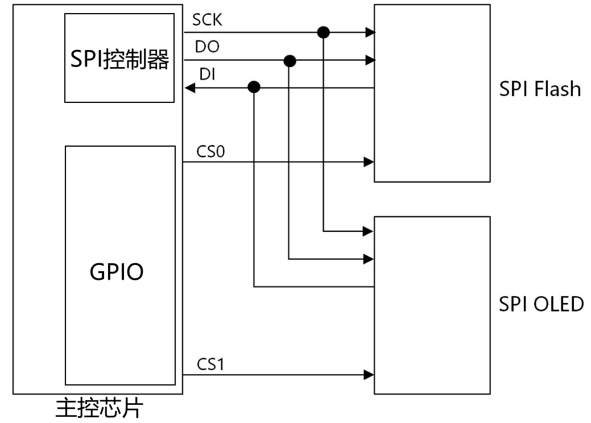
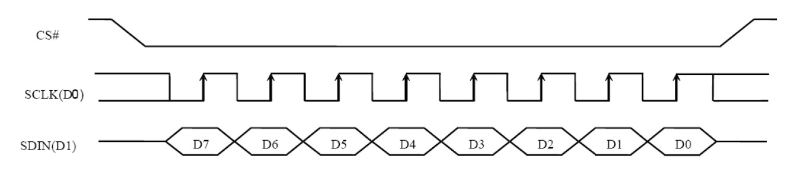
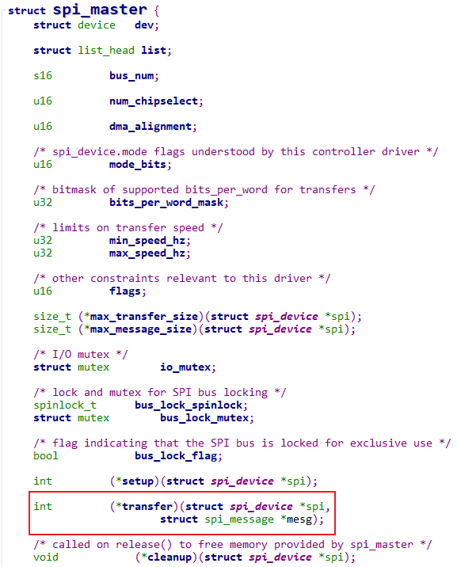
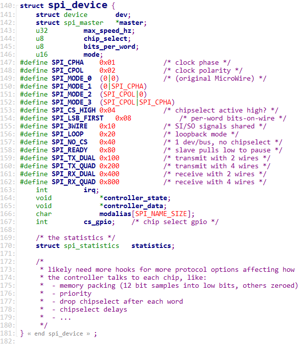
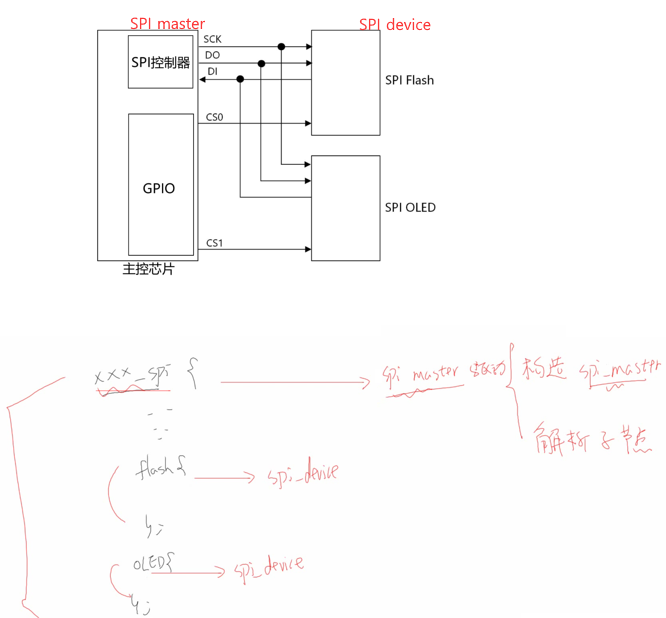
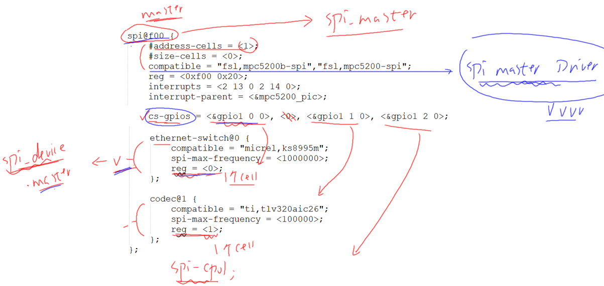
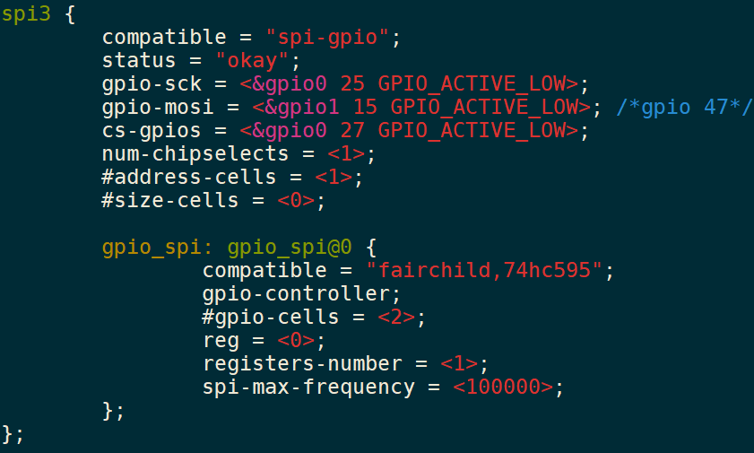
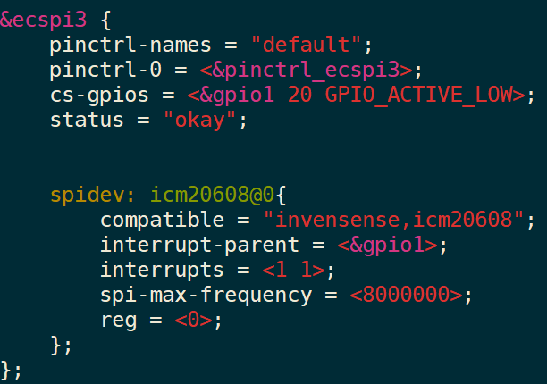
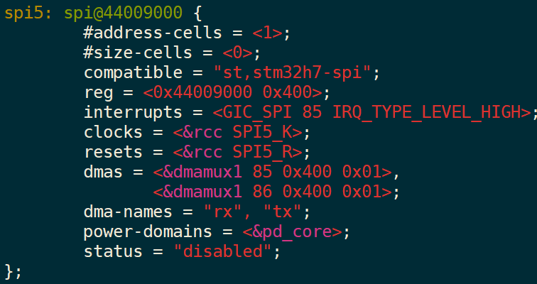
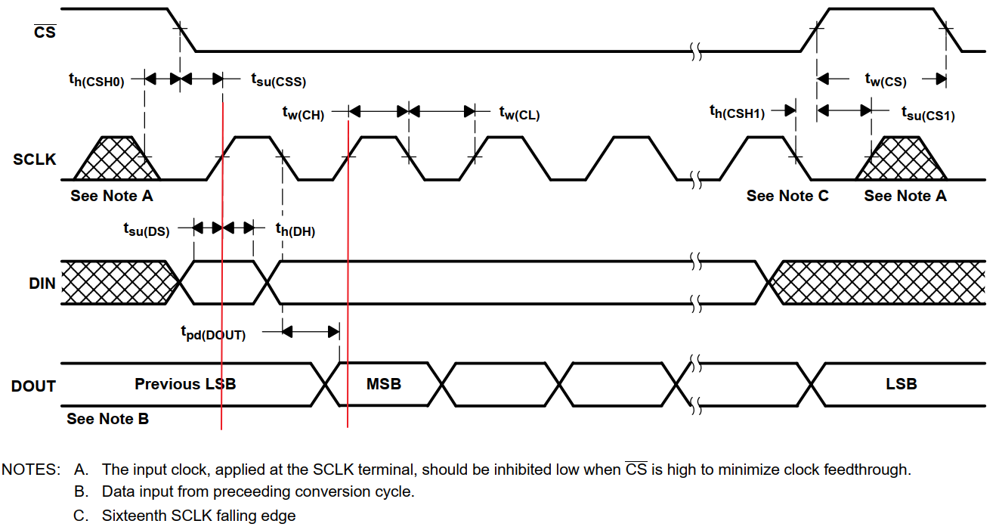

# SPI 子系统

SPI视频涉及的内容

- SPI协议
- SPI驱动程序框架
    - SPI总线设备驱动模
    - SPI设备树处理过程
- 简单的SPI设备驱动
    - SPI ADC
    - SPI OLED
    - 内核自带的spi dev驱动
- 复杂的SPI设备驱动
    - SPI+FrameBuffer
- SPI控制器驱动程序
    - 使用GPIO实现
    - 具体芯片的SPI控制器驱动程序分析
- SPI调试工具
    - spi-tools
- 高性能：QSPI
- 主控芯片用作SPI从设备

留意这些知识点：

- SPI3线和SPI4线
- bits_per_word设置8和16会影响到啥
- 硬件片选和软件片选在驱动咋用

# SPI协议介绍

参考资料：

- 《SPI Block Guide V04.01.pdf》
- 《S3C2440A_UserManual_Rev13.pdf》

SPI（Serial Peripheral Interface）接口是`全双工的同步串行通讯总线`，支持通过多个不同的片选信号来连接多个外设。SPI 接口通常由`四根线`组成，分别是提供时钟的 `SCLK`，提供数据输出的 `MOSI`(Master Out Slave In)，提供数据输入的 `MISO`(Master In Slave Out)和提供片选信号的 `CS`。

`同一时刻只能有一个 SPI 设备处于工作状态`，即`多个 CS 信号中某时间只能有一个有效`。为了适配不同的外设 ，SPI 支持通过寄存器来配置片选信号和时钟信号的极性和相位。（imx6ull 支持 ecspi，即增强配置型 spi，这里为了与其他兼容，统一用 spi 来称呼）。

为什么是全双工: 因为有两条线, 一条用来收, 一条同来发可以同时并行收发.

## 1 SPI硬件知识

### 1.1 硬件连线

SPI 支持 `slave `和 `master `两种模式，作为 MPU 来说，多数情况下是作为master 来使用的。在 master 模式下，通过不同的`片选`引脚 `ss[n](n=0,1,2,3)`来连接多个不同的设备。下图为 MASTER 模式下的 SPI 单线通讯模式框图：

- 



引脚含义如下：

|   引脚   | 含义                                                         |
| :------: | :----------------------------------------------------------- |
| DO(MOSI) | Master Output, Slave Input，<br />SPI主控用来发出数据，SPI从设备用来接收数据 |
| DI(MISO) | Master Input, Slave Output，<br />SPI主控用来发出数据，SPI从设备用来接收数据 |
|   SCK    | Serial Clock，时钟                                           |
|    CS    | Chip Select，芯片选择引脚                                    |

片选引脚同一时刻, 只能有一个有效, 以保证单个设备的数据传输不受其他设备影响. 在时序体现就是只有在片选线有效期间, 时钟线和数据线的传输才有意义.


### 1.2 SPI控制器内部结构

- 

- `控制寄存器`, 在这里面可以控制极性和相位.
- `状态寄存器`, 通过这个寄存器来分辨 数据是否已经`发送完了`. 也可以通过这个寄存器`使能中断`
- `波特率寄存器`, 可以通过这个寄存器 设置SCK时钟频率
- `数据寄存器`, 把八位数据写入这个寄存器, 就可以一位一位发送出去. 同时从DI 来获取数据.

## SPI协议

### 2.1 传输示例

- 在 master 模式下，ss、sclk 和 mosi 作为`信号输出接口`，MISO 作为`信号输入接口`。通过 SS `片选`信号`使能`外部 SPI 设备，SCLK `同步`数据传输。MOSI 和MISO 信号在 SCLK 上升沿变化，在下降沿锁存数据。SPI 的具体通讯格式如下图所示（默认高位在前，低位在后），输出数据为 0xD2，输入数据为 0x66。
    - 


- 假设现在主控芯片要传输一个0x56数据给SPI Flash，时序如下：
    - 

- 首先`CS0`先拉低`选中SPI Flash`, 0x56的二进制就是`0b0101 0110`, 因此在每个SCK时钟周期, DO输出对应的电平. 每个时钟周期传输一位.
- SPI Flash会在`每个时钟周期`的`上升沿`读取D0上的电平.
    - 
    - 时钟线SCK 的初始电平, 称为CPOL, 极性, 是可以设置的.
    - 时钟线SCK 是第1个, 还是在第2个跳变沿 传数据, 也是可以设置的, 称为CPHA, 相位.

### 2.2 SPI模式

- SPI 支持不同的 SPI 时钟和 CS 片选`相位和极性设置`, 通过设置 `PHA` 和 `POL值`的不同来设置相位和极性. 

- 在SPI协议中，有`两个值来确定SPI的模式`。 
    - `CPOL:`极性, 表示SPI CLK的`初始电平`，0为低电平，1为高电平 
    - `CPHA:`表示相位, 即第一个还是第二个时钟沿`采样数据`, 0为第一个时钟沿, 1为第二个时钟沿


| CPOL | CPHA | 模式 | 含义                                           |
| ---: | ---: | ---: | :--------------------------------------------- |
|    0 |    0 |    0 | SPICLK初始电平为低电平，在第一个时钟沿采样数据 |
|    0 |    1 |    1 | SPICLK初始电平为低电平，在第二个时钟沿采样数据 |
|    1 |    0 |    2 | SPICLK初始电平为高电平，在第一个时钟沿采样数据 |
|    1 |    1 |    3 | SPICLK初始电平为高电平，在第二个时钟沿采样数据 |

上述表格在时序图如下:

- 
- 
- 
- 

- 实际时钟和相位关系如下图所示，我们`常用的是模式 0 和模式 3`，因为它们`都是在上升沿采样数据`，不用去在乎时钟的初始电平是什么，只要在上升沿采集数据就行。

- POL 和 PHA 怎么选择？通常去`参考外接的模块的芯片手册`。
    - 

- 比如对于OLED，查看它的芯片手册时序部分：
    - 
- SCLK的初始电平我们并不需要关心，只要保证在上升沿采样数据就行。

# SPI总线设备驱动模型

参考资料：

* 内核头文件：`include\linux\spi\spi.h`

* 百问网驱动直播课里对应的源码
    * GIT仓库：https://e.coding.net/weidongshan/livestream/doc_and_source_for_livestream.git (70天)
    * 06_总线设备驱动模型彻底分析
    * 07_设备树入门
    * 28_SPI设备驱动开发1_OLED屏幕硬件操作

## 1 回顾平台总线设备驱动模型

Linux驱动程序开始基于`"平台总线设备驱动"`模型，把驱动程序分成2边：

- 左边注册一个`platform_driver`结构体，里面是比较固定的、通用的代码
- 右边注册一个`platform_device`结构体，里面是硬件资源
    - 可以在C文件中注册`platform_device`
    - 也可以使用设备树创建一个节点，内核解析设备树时注册`platform_device`

- 
    - 实现了左右分离.


## 2 数据结构

SPI子系统中涉及2类硬件：**SPI控制器、SPI设备**。


- SPI控制器使用哪些引脚. 硬件信息应该分离出来.


- `probe函数` 抽象` 构造`一个`spi_master结构体`, `填充`里面的`函数`
- 然后 `解析子节点`, `构造spi_dev`.
- 对于spi_dev, 它得有对应的驱动程序呀. 得有`spi_driver`
- 怎么管理 spi_dev 跟 spi_driver. `spi_bus_type`


`SPI控制器`有驱动程序，提供SPI的传输能力。

`SPI设备`也有自己的驱动程序, 提供SPI设备的访问能力：

- 它知道怎么访问这个设备，它知道这个设备的数据含义是什么
- 它`会调用SPI控制器的函数`来收发数据。


### 2.1 SPI控制器数据结构

参考内核文件：`include\linux\spi\spi.h`

Linux中使用`spi_master`结构体描述``SPI控制器``，里面最重要的成员就是`transfer`函数指针：



### 2.2 SPI设备数据结构

- 参考内核文件：`include\linux\spi\spi.h`
- Linux中使用`spi_device`结构体描述`SPI设备`，里面记录有设备的片选引脚、频率、挂在哪个SPI控制器下面：



### 2.3 SPI设备驱动

参考内核文件：`include\linux\spi\spi.h`

Linux中使用`spi_driver`结构体描述`SPI设备驱动`：


## 3 SPI驱动框架


### 3.1 SPI控制器驱动程序

SPI控制器的驱动程序可以基于"`平台总线设备驱动`"模型来实现：

- 在设备树里描述SPI控制器的硬件信息，在设备树子节点里描述挂在下面的SPI设备的信息
- 在platform_driver中提供一个probe函数
    - 它会注册一个spi_master
    - 还会解析设备树子节点，创建spi_device结构体

### 3.2 SPI设备驱动程序

跟"平台总线设备驱动模型"类似，Linux中也有一个"`SPI总线设备驱动模型`"：

- 左边是spi_driver，使用C文件实现，里面有id_table表示能支持哪些SPI设备，有probe函数
- 右边是spi_device，用来描述SPI设备，比如它的片选引脚、频率
    - 可以来自设备树：比如由SPI控制器驱动程序解析设备树后创建、注册spi_device
    - 可以来自C文件：比如使用`spi_register_board_info`创建、注册spi_device

# SPI设备树处理过程

参考资料：

- 内核头文件：`include\linux\spi\spi.h`
- 内核文档：`Documentation\devicetree\bindings\spi\spi-bus.txt`	
- 内核源码：`drivers\spi\spi.c`

## 1 spi_device结构体

```c
struct spi_device {
	struct device		dev;
	struct spi_master	*master;
	u32			max_speed_hz;
	u8			chip_select;
	u8			bits_per_word;
	u16			mode;
#define	SPI_CPHA	0x01			/* clock phase */
#define	SPI_CPOL	0x02			/* clock polarity */
#define	SPI_MODE_0	(0|0)			/* (original MicroWire) */
#define	SPI_MODE_1	(0|SPI_CPHA)
#define	SPI_MODE_2	(SPI_CPOL|0)
#define	SPI_MODE_3	(SPI_CPOL|SPI_CPHA)
#define	SPI_CS_HIGH	0x04			/* chipselect active high? */
#define	SPI_LSB_FIRST	0x08			/* per-word bits-on-wire */
#define	SPI_3WIRE	0x10			/* SI/SO signals shared */
#define	SPI_LOOP	0x20			/* loopback mode */
#define	SPI_NO_CS	0x40			/* 1 dev/bus, no chipselect */
#define	SPI_READY	0x80			/* slave pulls low to pause */
#define	SPI_TX_DUAL	0x100			/* transmit with 2 wires */
#define	SPI_TX_QUAD	0x200			/* transmit with 4 wires */
#define	SPI_RX_DUAL	0x400			/* receive with 2 wires */
#define	SPI_RX_QUAD	0x800			/* receive with 4 wires */
	int			irq;
	void			*controller_state;
	void			*controller_data;
	char			modalias[SPI_NAME_SIZE];
	int			cs_gpio;	/* chip select gpio */

	/* the statistics */
	struct spi_statistics	statistics;

	/*
	 * likely need more hooks for more protocol options affecting how
	 * the controller talks to each chip, like:
	 *  - memory packing (12 bit samples into low bits, others zeroed)
	 *  - priority
	 *  - drop chipselect after each word
	 *  - chipselect delays
	 *  - ...
	 */
};
```

各个成员含义如下：

* max_speed_hz：该设备能支持的SPI时钟最大值
* chip_select：是这个spi_master下的第几个设备
    * 在spi_master中有一个cs_gpios数组,里面存放有下面各个spi设备的片选引脚
    * spi_device的`片选引脚`就是：cs_gpios[`spi_device.chip_select`]
* cs_gpio：这是可选项，也可以把spi_device的片选引脚记录在这里
* bits_per_word：每个基本的SPI传输涉及多少位
    * word：我们使用SPI控制器时，一般是往某个寄存器里写入数据，SPI控制器就会把这些数据一位一位地发送出去
    * 一个寄存器是32位的，被称为一个word(有时候也称为double word)
    * 这个寄存器里多少位会被发送出去？使用bits_per_word来表示
    * 扩展：bits_per_word是可以大于32的，也就是每次SPI传输可能会发送多于32位的数据，这适用于DMA突发传输
* mode：含义广泛，看看结构体里那些宏
    * SPI_CPHA：在第1个周期采样，在第2个周期采样？
    * SPI_CPOL：平时时钟极性
        * SPI_CPHA和SPI_CPOL组合起来就可以得到4种模式
        * SPI_MODE_0：平时SCK为低(SPI_CPOL为0)，在第1个周期采样(SPI_CPHA为0)
        * SPI_MODE_1：平时SCK为低(SPI_CPOL为0)，在第2个周期采样(SPI_CPHA为1)
        * SPI_MODE_2：平时SCK为高(SPI_CPOL为1)，在第1个周期采样(SPI_CPHA为0)
        * SPI_MODE_3：平时SCK为高(SPI_CPOL为1)，在第2个周期采样(SPI_CPHA为1)
    * SPI_CS_HIGH：一般来说片选引脚时低电平有效，SPI_CS_HIGH表示高电平有效
    * SPI_LSB_FIRST：
        * 一般来说先传输MSB(最高位)，SPI_LSB_FIRST表示先传LSB(最低位)；
        * 很多SPI控制器并不支持SPI_LSB_FIRST
    * SPI_3WIRE：SO、SI共用一条线
    * SPI_LOOP：回环模式，就是SO、SI连接在一起
    * SPI_NO_CS：只有一个SPI设备，没有片选信号，也不需要片选信号
    * SPI_READY：SPI从设备可以拉低信号，表示暂停、表示未就绪
    * SPI_TX_DUAL：发送数据时有2条信号线
    * SPI_TX_QUAD：发送数据时有4条信号线
    * SPI_RX_DUAL：接收数据时有2条信号线
    * SPI_RX_QUAD：接收数据时有4条信号线

## 2 SPI设备树格式

- 对于`SPI Master`, 就是SPI控制器, 它下面可以连接多个SPI设备.
- 在设备树里, 使用`一个节点`来表示SPI Master, 使用`子节点`来表示挂在下面的SPI设备.
    - SPI控制器 可以用作`Master主模式`, 也可以用作`Slave从模式`, 一般用作主模式.



### 2.1 SPI Master

在设备树中, 对于SPI Master, 必须的属性如下:

- `#address-cells`: 这个SPI Master下的SPI设备, 需要多少个cell来表述它的`片选引脚`
- `#size-cells`: `必须`设置为`0`
- `compatible`: 根据它找到SPI Master驱动

可选的属性如下: 

- `cs-gpios`: SPI Master可以使用多个GPIO当做片选, 可以在这个属性列出那些GPIO
- `num-cs`: 片选引脚总数

其他属性都是驱动程序相关的, 不同的`SPI Master`驱动程序要求的属性可能不一样.

### 2.2 SPI Device

在SPI Master对应的设备树节点下, 每一个`子节点`都对应一个SPI设备, 这个SPI设备连接在该SPI Master下面.

这些子节点中, `必选`的属性如下:

* `compatible`: 根据它找到SPI Device驱动
* `reg`: 用来表示它使用哪个片选引脚
* `spi-max-frequency`: 必选, 该SPI设备支持的最大SPI时钟

可选的属性如下：

* `spi-cpol`: 这是一个空属性(没有值), 表示CPOL为1, 即平时SPI时钟为低电平
    * 空属性就是 写了就行, 不写就是0, 写了就是1. 子节点里写一行 spi-cpol; 就行了.

* `spi-cpha`: 这是一个空属性(没有值), 表示CPHA为1), 即在时钟的第2个边沿采样数据
* `spi-cs-high`: 这是一个空属性(没有值), 表示片选引脚高电平有效
* `spi-3wire`: 这是一个空属性(没有值), 表示使用SPI 三线模式
* `spi-lsb-first`: 这是一个空属性(没有值), 表示使用SPI传输数据时先传输最低位(LSB)
* `spi-tx-bus-width`: 表示有几条MOSI引脚; 没有这个属性时默认只有1条MOSI引脚
* `spi-rx-bus-width`: 表示有几条MISO引脚; 没有这个属性时默认只有1条MISO引脚
* `spi-rx-delay-us`: 单位是毫秒, 表示每次读传输后要延时多久
* `spi-tx-delay-us`: 单位是毫秒, 表示每次写传输后要延时多久


- mode的 bit1 是极性(初始电平), bit0是相位(第几个跳变采样).
- mode的 bit2 是SPI_CS_HIGH
- chip_select 成员变量 来自于设备节点里的reg属性


- bits_per_word 不来自设备树, 是应用程序想发起传输时, 可以设置的一个值.
    - 每次传输至少传输 8/12/16位.  每次传输的bit数. 

### 2.3 设备树示例

```shell
	spi@f00 {
		#address-cells = <1>;
		#size-cells = <0>;
		compatible = "fsl,mpc5200b-spi","fsl,mpc5200-spi";
		reg = <0xf00 0x20>;
		interrupts = <2 13 0 2 14 0>;
		interrupt-parent = <&mpc5200_pic>;

		ethernet-switch@0 {
			compatible = "micrel,ks8995m";
			spi-max-frequency = <1000000>;
			reg = <0>;
		};

		codec@1 {
			compatible = "ti,tlv320aic26";
			spi-max-frequency = <100000>;
			reg = <1>;
		};
	};
```



- `spi@f00` 对于这个子节点, 会有一个驱动程序, SPI master驱动, 这驱动会解析这个节点, 构造出一个spi_master结构体. 同时也会解析其下的子节点.
- `#address-cells=<1>;` 下面子节点reg都用1个数来表示地址.
- 对其下挂载的子节点, 每个子节点都会生成一个spi_device结构体. 
    - 对于设备树的SPI节点, 是由某个SPI master驱动程序做的. 
- `cs-gpios 片选引脚`, 里面有3个`<>`, 从0计数, 下面子节点中的`reg=<?>`, 对应的就是第几个.
    - `reg = <0>;` 对应着 `<&gpio1 0 0>` 
    - `reg = <1>;` 对应着 `<&gpio1 1 0>` 

## 3 设备树实例

- 在设备树里, 会有一个节点用来表示SPI控制器.
- 在这个SPI控制器下面, 连接有哪些SPI设备? 会在设备树里使用子节点来描述SPI设备.

### 3.1 使用GPIO模拟的SPI控制器

内核对应的程序: `drivers/spi/spi-gpio.c`



### 3.2 IMX6ULL SPI控制器

内核文件：`arch/arm/boot/dts/imx6ull.dtsi`


内核文件：`arch/arm/boot/dts/100ask_imx6ull-14x14.dts`



### 3.3 STM32MP157 SPI控制器

内核文件：`arch/arm/boot/dts/stm32mp151.dtsi`



内核文件：`arch/arm/boot/dts/stm32mp157c-100ask-512d-lcd-v1.dts`


## 4 设备树处理过程

内核源码: `drivers/spi/spi.c`

```c
#if defined(CONFIG_OF)
static struct spi_device *
of_register_spi_device(struct spi_master *master, struct device_node *nc)
{
	struct spi_device *spi;
	int rc;
	u32 value;

	/* Alloc an spi_device */
	spi = spi_alloc_device(master);
	if (!spi) {
		dev_err(&master->dev, "spi_device alloc error for %s\n",
			nc->full_name);
		rc = -ENOMEM;
		goto err_out;
	}

	/* Select device driver */
	rc = of_modalias_node(nc, spi->modalias,
				sizeof(spi->modalias));
	if (rc < 0) {
		dev_err(&master->dev, "cannot find modalias for %s\n",
			nc->full_name);
		goto err_out;
	}

	/* Device address */
	rc = of_property_read_u32(nc, "reg", &value);
	if (rc) {
		dev_err(&master->dev, "%s has no valid 'reg' property (%d)\n",
			nc->full_name, rc);
		goto err_out;
	}
	spi->chip_select = value;

	/* Mode (clock phase/polarity/etc.) */
	if (of_find_property(nc, "spi-cpha", NULL))
		spi->mode |= SPI_CPHA;
	if (of_find_property(nc, "spi-cpol", NULL))
		spi->mode |= SPI_CPOL;
	if (of_find_property(nc, "spi-cs-high", NULL))
		spi->mode |= SPI_CS_HIGH;
	if (of_find_property(nc, "spi-3wire", NULL))
		spi->mode |= SPI_3WIRE;
	if (of_find_property(nc, "spi-lsb-first", NULL))
		spi->mode |= SPI_LSB_FIRST;

	/* Device DUAL/QUAD mode */
	if (!of_property_read_u32(nc, "spi-tx-bus-width", &value)) {
		switch (value) {
		case 1:
			break;
		case 2:
			spi->mode |= SPI_TX_DUAL;
			break;
		case 4:
			spi->mode |= SPI_TX_QUAD;
			break;
		default:
			dev_warn(&master->dev,
				"spi-tx-bus-width %d not supported\n",
				value);
			break;
		}
	}

	if (!of_property_read_u32(nc, "spi-rx-bus-width", &value)) {
		switch (value) {
		case 1:
			break;
		case 2:
			spi->mode |= SPI_RX_DUAL;
			break;
		case 4:
			spi->mode |= SPI_RX_QUAD;
			break;
		default:
			dev_warn(&master->dev,
				"spi-rx-bus-width %d not supported\n",
				value);
			break;
		}
	}

	/* Device speed */
	rc = of_property_read_u32(nc, "spi-max-frequency", &value);
	if (rc) {
		dev_err(&master->dev, "%s has no valid 'spi-max-frequency' property (%d)\n",
			nc->full_name, rc);
		goto err_out;
	}
	spi->max_speed_hz = value;

	/* Store a pointer to the node in the device structure */
	of_node_get(nc);
	spi->dev.of_node = nc;

	/* Register the new device */
	rc = spi_add_device(spi);
	if (rc) {
		dev_err(&master->dev, "spi_device register error %s\n",
			nc->full_name);
		goto err_of_node_put;
	}

	return spi;

err_of_node_put:
	of_node_put(nc);
err_out:
	spi_dev_put(spi);
	return ERR_PTR(rc);
}
```

- `spi_gpio_probe `中, 先`spi_gpio_probe_dt`, 这个函数分配一个 `struct spi_gpio_platform_data` 结构体, 然后从设备树创建的device_node里取得, gpio-sck, gpio-miso, gpio-mosi, num-chipselects信息, 放到`spi_gpio_platform_data `结构体里, 然后把这个结构体, 放到参数`struct platform_device` 里的dev.platform_data成员.
- 分配一个 `struct spi_master` , 然后做一些设置. 
- spi_bitbang_start ->  spi_register_master -> of_spi_register_master
    - 解析 spi master有多少个`cs引脚`. 申请一个int数组, 存放`各个cs引脚`信息. 然后数组首地址放在 master->cs_gpios里.
- of_spi_register_master 结束后, spi_register_master最后就会去注册spi device了: of_register_spi_devices
    - for_each_available_child_of_node -> of_register_spi_device
    - 对于每一个mater的子节点, 就是设备了. 都会执行of_register_spi_device.
    - spi_alloc_device(master); 分配一个 struct spi_device 结构体.
    - 解析 reg 属性, 值放到 spi->chip_select 里. 然后去看有没有极性, 相位等属性, 有就往mode里写对应位.
    - 最后 spi_add_device(spi); 注册设备.

# spidev的使用(SPI用户态API) #

参考资料：

* 内核驱动：`drivers\spi\spidev.c`

* 内核提供的测试程序：`tools\spi\spidev_fdx.c`

* 内核文档：`Documentation\spi\spidev`


- spidev.c 中直接访问某个spi_master结构里, 去调用其中的发送函数.

## 1. spidev驱动程序分析

内核驱动：`drivers\spi\spidev.c`

### 1.1 驱动框架

设备树示例：

```shell
spidev0: spidev@0 {
    compatible = “spidev”;
    reg = <0>;
    spi-max-frequency = <50000000>;
};
```


设备树里某个spi设备节点的compatible属性等于下列值，就会跟spidev驱动匹配：

* "rohm,dh2228fv"
* "lineartechnology,ltc2488"
* "spidev"


匹配之后，spidev.c的`spidev_probe`会被调用，它会：

* 分配一个`spidev_data`结构体，用来记录`对应的spi_device`
* `spidev_data`会被`记录在一个链表里`
* 分配一个`次设备号`，以后可以根据这个次设备号在链表里`找到spidev_data`
* `device_create`：这会生产一个设备节点`/dev/spidevB.D`，B表示`总线号`，D表示它是这个SPI Master下`第几个设备`


以后，我们就可以通过`/dev/spidevB.D`来访问spidev驱动程序。


- 把spi_device 放进spidev_data结构体的spi指针成员. 然后找到次设备号, 创建设备节点`/dev/spidevB.D`.
- 然后把这个spidev_data结构体 放到device_list链表里去. 
- 后面app打开这个`/dev/spidevB.D`设备节点, 就会`根据次设备号`从这个链表里找到对应的`spidev_data结构体`.
- 再根据spidev_data结构体 里的`spi指针成员`, 找到`spi_device 结构体`. 
- 而spi_device 结构体里面又有 `struct spi_master *master` 成员, 找到`控制器`, 拿到里面的`发送函数`.
- 次设备号: 来自位图中第1个未被占用的号码
- chip_select: 来自设备树, 表示它是这个spi_master下的第几个设备

spidev通用驱动框架:


- spidev.c 入口中, 就注册了一个字符驱动程序. 也注册了一个spi driver驱动程序.
- 当这个 spi driver 发现能支持的spi device时. 调用spidev_probe. 


- init 函数里, 先注册字符设备驱动. 再创建类, 这时候没创建设备. 因为这时候还不知道支持什么设备, 在后面的 spi_register_driver 才知道.

### 1.2 驱动程序分析

spidev.c通过file_operations向APP提供接口：


- open 函数


- 遍历 找设备号. dvet 就是由主设备号跟次设备号组成的.
- 然后分配发送跟接收缓冲区的内存.
- 把这个spidev_data放到 文件的私有数据里. 后面读写的时候, 直接拿出来用了.


1.2.1 读函数


1.2.2 写函数


1.2.3 通过ioctl读写参数


1.2.4 通过ioclt读写数据


## 2. spidev应用程序分析

内核提供的测试程序：`tools\spi\spidev_fdx.c`

### 2.1 使用方法

```shell
spidev_fdx [-h] [-m N] [-r N] /dev/spidevB.D
```

* -h: 打印用法
* -m N：先写1个字节0xaa，再读N个字节，**注意：**不是同时写同时读
* -r N：读N个字节

### 2.2 代码分析

2.2.1 显示设备属性


2.2.2 读数据


2.2.3 先写再读


2.2.4 同时读写


## 3. spidev的缺点

使用read、write函数时，只能读、写，这是半双工方式。

使用`ioctl`可以达到`全双工的读写`。

但是spidev有2个缺点：

* 不支持中断
* 只支持同步操作，不支持异步操作：就是read/write/ioctl这些函数只能执行完毕才可返回

# 使用spidev操作SPI_DAC模块 #

参考资料：

* 内核驱动：`drivers\spi\spidev.c`

* 内核提供的测试程序：`tools\spi\spidev_fdx.c`

* 内核文档：`Documentation\spi\spidev`	

* DAC芯片手册：`TLC5615.pdf`


## 1. 硬件

### 1.1 原理图

IMX6ULL:


STM32MP157:


原理图：


### 1.2 连接

1.2.1 IMX6ULL

DAC模块接到IMX6ULL扩展板的SPI_A插座上：


1.2.2 STM32MP157

## 2. DAC操作原理

### 2.1 内部框图


操作过程为：

* `CS拉低`
* 在`SCLK的上升沿`，`从DIN采集16位数据`，存入上图中的`16-Bit Shift Register`
* 在`CS的上升沿`，把`16-Bit Shift Register`中的10位数据传入`10-Bit DAC Register`，作为模拟量在OUT引脚输出

**注意**：

* 传输的16位数据中，`高4位`是无意义的
* `中间10位`才被转换为模拟量
* `最低2位必须是0`

### 2.2 时序图



使用SPI传输的细节：

* SCLK初始电平为低
* 使用16个SCLK周期来传输16位数据
* 在SCLK上升沿读取DIN电平, 把数据移到16位移位寄存器里, 先移MSB最高有效位.
* 在SCLK上升沿发出DOUT信号
* DOUT数据来自`16-Bit Shift Register`
    * 第1个数据是上次数据遗留下的LSB位
    * 其余15个数据来自`16-Bit Shift Register`的高15位
    * `16-Bit Shift Register`的LSB在下一个周期的第1个时钟传输
    * LSB必定是0，所以当前的周期里读出`16-Bit Shift Register`的15位数据也足够了
* 在CS上升沿把`16-Bit Shift Register`中的10位, 传输到`10-Bit DAC Register`.

级连:


- 通过芯片的OUT引脚 把数据传给下一个DAC设备.
- 我们可以把SPI控制器的MOSI引脚接DAC的DIN引脚, MISO引脚接DAC的DOUT引脚.

有一个问题:

- DIN 刚传入一位数据, DOUT刚传出一位数据, 那传出的这一位数据, 是这个MSB吗?
    - 
        -  时钟信号 拉高的瞬间, 是来不及把16位寄存器里的数据发出去的. 所以当前SCLK拉高瞬间, 第一个时钟是上上次的LSB, 第二个时钟里才是上次的MSB
        - 本次DIN传进去16位, 但此时DOUT先传的是上次的LSB, 然后才是本次的MSB.

### 2.3 DAC公式


```shell
输出电压 = 2 * VREFIN * n / 1024 = 2 * 2.048 * n / 1024
其中: n为10位数值
```

## 3. 编写APP

源码在GIT仓库里，这2个位置里的源码是一样的：


# SPI_DAC模块上机实验 #

参考资料：

* 内核驱动：`drivers\spi\spidev.c`

* 内核提供的测试程序：`tools\spi\spidev_fdx.c`

* 内核文档：`Documentation\spi\spidev`	

* DAC芯片手册：`TLC5615.pdf`


## 1. 硬件

### 1.1 原理图

IMX6ULL:


STM32MP157:


原理图：


### 1.2 连接

#### 1.2.1 IMX6ULL

DAC模块接到IMX6ULL扩展板的SPI_A插座上：


#### 1.2.2 STM32MP157

DAC模块接到STM32MP157扩展板的SPI_A插座上：


## 2. 编写设备树

确认SPI时钟最大频率：


```shell
T = 25 + 25 = 50ns  
F = 20000000 = 20MHz 
```

1 / (50x10e-9) = 20000000

设备树如下：

```shell
    dac: dac {
        compatible = "spidev";
        reg = <0>;
        spi-max-frequency = <20000000>;
    };
```

### 2.1 IMX6ULL


DAC模块接在这个插座上，那么要在设备树里spi1的节点下创建子节点。

代码在`arch/arm/boot/dts/100ask_imx6ull-14x14.dtb`中，如下：

```shell
&ecspi1 {
    pinctrl-names = "default";
    pinctrl-0 = <&pinctrl_ecspi1>;

    fsl,spi-num-chipselects = <2>;
    cs-gpios = <&gpio4 26 GPIO_ACTIVE_LOW>, <&gpio4 24 GPIO_ACTIVE_LOW>;
    status = "okay";

    dac: dac {
        compatible = "spidev";
        reg = <0>;
        spi-max-frequency = <20000000>;
    };
};
```

- 
- id_match_table里没有 compatible 是"spidev" , 那么是怎么匹配上的.
- 
- 这个节点的 compatible =  "spidev"; 就是他的别名. 就匹配上了.

### 2.2 STM32MP157


DAC模块接在这个插座上，那么要在设备树里spi5的节点下创建子节点。

代码在`arch/arm/boot/dts/stm32mp157c-100ask-512d-lcd-v1.dts`中，如下：

```shell
&spi5 {
        pinctrl-names = "default", "sleep";
        pinctrl-0 = <&spi5_pins_a>;
        pinctrl-1 = <&spi5_sleep_pins_a>;
        status = "okay";
        cs-gpios = <&gpioh 5 GPIO_ACTIVE_LOW>, <&gpioz 4 GPIO_ACTIVE_LOW>;
        spidev: icm20608@0{
                compatible = "invensense,icm20608";
                interrupts = <0 IRQ_TYPE_EDGE_FALLING>;
                interrupt-parent = <&gpioz>;
                spi-max-frequency = <8000000>;
                reg = <0>;
        };
        dac_test: dac_test@1{
                compatible = "spidev";
                spi-max-frequency = <20000000>;
                reg = <1>;
        };
};
```

## 3. 编译替换设备树

### 3.1 IMX6ULL

#### 3.1.1 设置工具链

```shell
export ARCH=arm
export CROSS_COMPILE=arm-buildroot-linux-gnueabihf-
 export PATH=$PATH:/home/book/100ask_imx6ull-sdk/ToolChain/arm-buildroot-linux-gnueabihf_sdk-buildroot/bin
```


#### 3.1.2 编译、替换设备树

  * 编译设备树：
    在Ubuntu的IMX6ULL内核目录下执行如下命令,
    得到设备树文件：`arch/arm/boot/dts/100ask_imx6ull-14x14.dtb`

    ```shell
    make dtbs
    ```

  * 复制到NFS目录：

    ```shell
    $ cp arch/arm/boot/dts/100ask_imx6ull-14x14.dtb ~/nfs_rootfs/
    ```

  * 开发板上挂载NFS文件系统

    ```shell
    [root@100ask:~]#  mount -t nfs -o nolock,vers=3 192.168.1.137:/home/book/nfs_rootfs /mnt
    ```

* 更新设备树

    ```shell
    [root@100ask:~]# cp /mnt/100ask_imx6ull-14x14.dtb /boot
    [root@100ask:~]# sync
    ```

* 重启开发板

### 3.2 STM32MP157

#### 3.2.1 设置工具链

```shell
export ARCH=arm
export CROSS_COMPILE=arm-buildroot-linux-gnueabihf-
export PATH=$PATH:/home/book/100ask_stm32mp157_pro-sdk/ToolChain/arm-buildroot-linux-gnueabihf_sdk-buildroot/bin
```


#### 3.2.2 编译、替换设备树

  * 编译设备树：
    在Ubuntu的STM32MP157内核目录下执行如下命令,
    得到设备树文件：`arch/arm/boot/dts/stm32mp157c-100ask-512d-lcd-v1.dtb`

    ```shell
    make dtbs
    ```

  * 复制到NFS目录：

    ```shell
    $ cp arch/arm/boot/dts/stm32mp157c-100ask-512d-lcd-v1.dtb ~/nfs_rootfs/
    ```

  * 开发板上挂载NFS文件系统

    ```shell
    [root@100ask:~]#  mount -t nfs -o nolock,vers=3 192.168.1.137:/home/book/nfs_rootfs /mnt
    ```

* 确定设备树分区挂载在哪里

    由于版本变化，STM32MP157单板上烧录的系统可能有细微差别。
    在开发板上执行`cat /proc/mounts`后，可以得到两种结果(见下图)：

    * mmcblk2p2分区挂载在/boot目录下(下图左边)：无需特殊操作，下面把文件复制到/boot目录即可

    * mmcblk2p2挂载在/mnt目录下(下图右边)

        * 在视频里、后面文档里，都是更新/boot目录下的文件，所以要先执行以下命令重新挂载：
            * `mount  /dev/mmcblk2p2  /boot`

        

* 更新设备树

    ```shell
    [root@100ask:~]# cp /mnt/stm32mp157c-100ask-512d-lcd-v1.dtb /boot/
    [root@100ask:~]# sync
    ```

* 重启开发板

## 4. 编译spidev驱动

首先要确定内核中已经含有spidev。在内核目录下执行make menuconfig，查看是否有改驱动，如下图：

```shell
-> Device Drivers
  -> SPI support (SPI [=y]) 
    < >   User mode SPI device driver support  
```

如果`User mode SPI device driver support`前面不是`<Y>`或`<M>`，可以输入`M`表示把它编译为模块。

* 如果已经是`<Y>`，则不用再做其他事情。
* 如果你设置为`<M>`，在内核目录下执行`make modules`，把生成的`drivers/spi/spidev.ko`复制到NFS目录备用

## 5. 编译APP

```shell
arm-buildroot-linux-gnueabihf-gcc  -o  dac_test  dac_test.c
```

## 6. 上机实验

设备树更换后: 


看到已经匹配上了.

如果spidev没有被编译进内核，那么先执行：

```shell
insmod spidev.ko
```

确定设备节点：

```shell
ls /dev/spidev*
```

假设设备节点为`/dev/spidev0.0`，执行测试程序：

```shell
./dac_test  /dev/spidev0.0  500
./dac_test  /dev/spidev0.0  600
./dac_test  /dev/spidev0.0  1000
```

## 7. 纠错

- 按照原datesheet的描述, 我们读到的DOUT数据老是我们输入的数值乘以2, 意思是往左移了一位.


- 平时(未被选中时)就已经把16位数据中的MSB 驱动到DOUT上了.
- DIN传入当前16位数据时, DOUT就会传出之前的16位数据.


