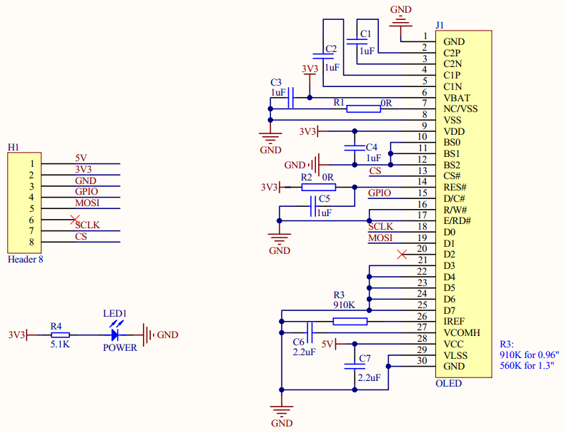
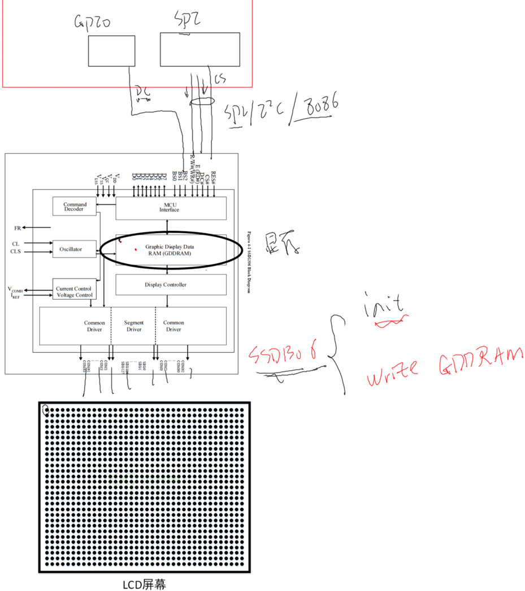
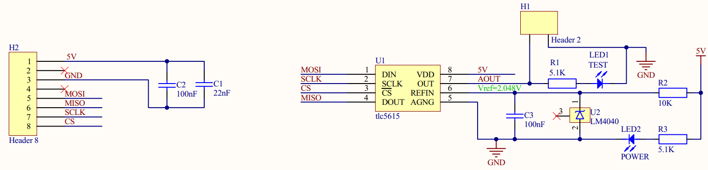

# SPI_OLED模块操作方法 #

参考资料：

* OLEDC芯片手册：`SPEC UG-2864TMBEG01 .pdf`、`SSD1306-Revision 1.1 (Charge Pump).pdf`

    

## 1. 硬件

### 1.1 原理图

IMX6ULL:


STM32MP157:


原理图：



SSD1306芯片:

- 
    - OLED屏幕驱动芯片.
    - 芯片控制接口可以是SPI/I2C/8086 接口等.
    - 线路有数据线, 时钟线, 片选线, 还有来自GPIO模块的DC控制线(分辨SPI线路上的是命令还是数据). 这些引脚来驱动屏幕
    - 使用SPI接口来初始化SSD1306芯片, 然后把数据写入芯片中的Graphic Display Data RAM(GDDRAM)显存.
    - 显存里的每一位数据, 对应着屏幕上的每一个像素. 该位数据为1, 像素就会被点亮. 反之则熄灭.
    - 我们要使用这个屏幕就要初始化它, 如上电, 打开功能, 设置亮度等. 
    - 如何初始化, 需要看`整个模组的手册`而不仅仅是控制芯片的手册. 因为不同厂家会用SSD1303这个芯片接不同的屏幕.

### 1.2 连接

无论是使用IMX6ULL开发板还是STM32MP157开发板，都有类似的扩展板。把OLED模块接到扩展板的SPI_A插座上，如下：


## 2. OLED操作原理

原理图简化如下：


要操作OLED，只需使用SPI接口发送数据，并不需要使用SPI接口读取数据。除此之外，还需要控制D/C引脚：

* 当DC引脚是低电平时，是命令：比如复位、打开显示、设置地址
* 当DC引脚是高电平时，是数据：写入要显示的数据

### 2.1 显存和像素

OLED上有128*64个像素，每个像素只有2种状态：亮、灭。


怎么控制屏幕上每个像素的状态？OLED内部有显存GDDRAM(Graphic Display Data RAM)：


显存中，每位对应一个像素，入下图所示：

* `byte0的8位数据`对应屏幕上角`左侧`, `竖向排列`的`8个像素`, 即`COL0的像素`, bit0对应第0行, bit1对应第1行, ……
* byte0对应COL1那列第0~第7行的8个像素
* ……
* byte127对应COL127那列第0~第7行的8个像素
* byte128对应COL0那列第0~第7行的8个像素


- 128*64点阵屏, 128个字节为一页, 共8页. 

### 2.2 显存寻址模式

显存被分为8页, 127列, 要写某个字节时, 需要先指定地址, 然后写入1字节的数据

* 哪页(Page)？
* 哪列(Col)？
* 写入1字节数据

OLED有`三种寻址模式`：

* `页地址模式`(Page addressing mode)：每写入1个字节，行地址不变，列地址增1，列地址达到127后会从0开始

    - 

* `水平地址模式`(Horizontal  addressing mode)：

    * 每写入1个字节，行地址不变，列地址增1
    * 列地址达到127后从0开始，行地址指向下一页
    * 列地址达到127、行地址达到7时，列地址和行地址都被复位为0，指向左上角

    

* `垂直地址模式`(Vertical addressing mode)：

    * 每写入1个字节，行地址增1，列地址不变

    * 行地址达到7后从0开始，列地址指向下一列

    * 列地址达到127、行地址达到7时，列地址和行地址都被复位为0，指向左上角

        

### 2.3 具体操作

#### 2.3.1 初始化

对于OLED的初始化，在参考手册`SPEC UG-2864TMBEG01 .pdf`中列出的流程图：


- 上电序列, 上电之后还要发出一系列命令来初始化.


#### 2.3.2 设置地址

* 设置地址模式
* 设置page
* 设置col

如下图：

* 设置`地址模式`，比如设置为页地址模式时，先写命令0x22，再写命令0x02。`页地址模式是默认的`，可以不设置。
    - 
* 设置页地址: 有0~7页, 想设置哪一页(n)就发出命令：0xB0 | n
    - 
* 设置列地址：列地址范围是0~127，需要使用2个命令来设置列地址 
    - 


#### 2.3.4 写入数据

让DC引脚为高电平，发起SPI写操作即可。

## 3. 在OLED上显示文字

- 先获得字符的字模. 即 这个字符所有的像素, 哪些是点亮的, 哪些是熄灭的.
- 然后根据字模写显存.
- linux内核里 lib/fonts里面有font_8x16.c
    - 字符A的字模: 
    - 
    - 
    - 把1连起来, 就是一个A. 然后写到显存里
    - 

# 使用spidev操作SPI_OLED模块 #

参考资料：

* 内核驱动：`drivers\spi\spidev.c`

* 内核提供的测试程序：`tools\spi\spidev_fdx.c`

* 内核文档：`Documentation\spi\spidev`	

* OLEDC芯片手册：`SPEC UG-2864TMBEG01 .pdf`、`SSD1306-Revision 1.1 (Charge Pump).pdf`

* 所参考的代码在另一个GIT仓库里：`https://e.coding.net/weidongshan/01_all_series_quickstart.git`
    

    

## 1. 要做的事情


- 要写数据, 就要先设置 页, 然后设置 属于哪一列.  然后再写数据.
- 用xy坐标来看, 列就是x坐标, 页就是y坐标(整个页).

## 2. 编写设备树

无论是使用IMX6ULL开发板还是STM32MP157开发板，都有类似的扩展板。把OLED模块接到扩展板的SPI_A插座上，如下：


### 2.1.1 IMX6ULL


DC引脚使用GPIO4_20，不过只需要在APP里直接控制DC引脚，无需在设备树里指定。

查datasheet, 找到4-wire SPI:

- 
    - 100ns 就是 10000000Hz

设备树如下：

```shell
&ecspi1 {
    pinctrl-names = "default";
    pinctrl-0 = <&pinctrl_ecspi1>;

    fsl,spi-num-chipselects = <2>;
    cs-gpios = <&gpio4 26 GPIO_ACTIVE_LOW>, <&gpio4 24 GPIO_ACTIVE_LOW>;
    status = "okay";

    oled: oled {
        compatible = "spidev";
        reg = <0>;
        spi-max-frequency = <10000000>;
    };
};
```


### 2.1.2 STM32MP157


DC引脚使用GPIOA_13，不过只需要在APP里直接控制DC引脚，无需在设备树里指定。

设备树如下：

```shell
&spi5 {
        pinctrl-names = "default", "sleep";
        pinctrl-0 = <&spi5_pins_a>;
        pinctrl-1 = <&spi5_sleep_pins_a>;
        status = "okay";
        cs-gpios = <&gpioh 5 GPIO_ACTIVE_LOW>, <&gpioz 4 GPIO_ACTIVE_LOW>;
        spidev: icm20608@0{
                compatible = "invensense,icm20608";
                interrupts = <0 IRQ_TYPE_EDGE_FALLING>;
                interrupt-parent = <&gpioz>;
                spi-max-frequency = <8000000>;
                reg = <0>;
        };
        oled: oled@1{
                compatible = "spidev";
                spi-max-frequency = <10000000>;
                reg = <1>;
        };
};
```


## 3. 编写APP

### 3.1 怎么控制DC引脚

查看原理图，确认引脚，然后参考如下文档即可使用APP操作GPIO，假设引脚号码为100，C语言代码如下：

```c
system("echo 100  > /sys/class/gpio/export");
system("echo out > /sys/class/gpio/gpio100/direction");
system("echo 1 > /sys/class/gpio/gpio100/value");
system("echo 0 > /sys/class/gpio/gpio100/value");
system("echo 100 > /sys/class/gpio/unexport");
```


### 3.2 基于spidev编写APP

我们把裸机程序里的 oled_write_cmd_data 函数用linux的驱动方式实现就行了. 

就是用SPI 跟 GPIO子系统.

# OLED模块上机实验

参考资料：

* 内核驱动：`drivers\spi\spidev.c`

* 内核提供的测试程序：`tools\spi\spidev_fdx.c`

* 内核文档：`Documentation\spi\spidev`


## 1. 连接

### 1.1 IMX6ULL

OLED模块接到IMX6ULL扩展板的SPI_A插座上：


### 1.2 STM32MP157

OLED模块接到STM32MP157扩展板的SPI_A插座上：


## 2. 编译替换设备树

### 2.1 IMX6ULL

#### 2.1.1 设置工具链

```shell
export ARCH=arm
export CROSS_COMPILE=arm-buildroot-linux-gnueabihf-
 export PATH=$PATH:/home/book/100ask_imx6ull-sdk/ToolChain/arm-buildroot-linux-gnueabihf_sdk-buildroot/bin
```


#### 2.1.2 编译、替换设备树

  * 修改设备树`arch/arm/boot/dts/100ask_imx6ull-14x14.dts`

    ```shell
    &ecspi1 {
        pinctrl-names = "default";
        pinctrl-0 = <&pinctrl_ecspi1>;
    
    fsl,spi-num-chipselects = <2>;
        cs-gpios = <&gpio4 26 GPIO_ACTIVE_LOW>, <&gpio4 24 GPIO_ACTIVE_LOW>;
        status = "okay";
    
        oled: oled {
            compatible = "spidev";
            reg = <0>;
            spi-max-frequency = <10000000>;
        };
    };
    ```

    

  * 编译设备树：
    在Ubuntu的IMX6ULL内核目录下执行如下命令,
    得到设备树文件：`arch/arm/boot/dts/100ask_imx6ull-14x14.dtb`

    ```shell
    make dtbs
    ```

  * 复制到NFS目录：

    ```shell
    $ cp arch/arm/boot/dts/100ask_imx6ull-14x14.dtb ~/nfs_rootfs/
    ```

  * 开发板上挂载NFS文件系统

    ```shell
    [root@100ask:~]#  mount -t nfs -o nolock,vers=3 192.168.1.137:/home/book/nfs_rootfs /mnt
    ```

* 更新设备树

    ```shell
    [root@100ask:~]# cp /mnt/100ask_imx6ull-14x14.dtb /boot
    [root@100ask:~]# sync
    ```

* 重启开发板

### 2.2 STM32MP157

#### 2.2.1 设置工具链

```shell
export ARCH=arm
export CROSS_COMPILE=arm-buildroot-linux-gnueabihf-
export PATH=$PATH:/home/book/100ask_stm32mp157_pro-sdk/ToolChain/arm-buildroot-linux-gnueabihf_sdk-buildroot/bin
```


#### 2.2.2 编译、替换设备树

  * 修改设备树`arch/arm/boot/dts/stm32mp157c-100ask-512d-lcd-v1.dts`

    ```shell
    &spi5 {
            pinctrl-names = "default", "sleep";
            pinctrl-0 = <&spi5_pins_a>;
            pinctrl-1 = <&spi5_sleep_pins_a>;
        status = "okay";
            cs-gpios = <&gpioh 5 GPIO_ACTIVE_LOW>, <&gpioz 4 GPIO_ACTIVE_LOW>;
            spidev: icm20608@0{
                    compatible = "invensense,icm20608";
                    interrupts = <0 IRQ_TYPE_EDGE_FALLING>;
                    interrupt-parent = <&gpioz>;
                    spi-max-frequency = <8000000>;
                    reg = <0>;
            };
            oled: oled@1{
                    compatible = "spidev";
                    spi-max-frequency = <10000000>;
                    reg = <1>;
            };
    };
    ```

    

  * 编译设备树：
    在Ubuntu的STM32MP157内核目录下执行如下命令,
    得到设备树文件：`arch/arm/boot/dts/stm32mp157c-100ask-512d-lcd-v1.dtb`

    ```shell
    make dtbs
    ```

  * 复制到NFS目录：

    ```shell
    $ cp arch/arm/boot/dts/stm32mp157c-100ask-512d-lcd-v1.dtb ~/nfs_rootfs/
    ```

  * 开发板上挂载NFS文件系统

    ```shell
    [root@100ask:~]#  mount -t nfs -o nolock,vers=3 192.168.1.137:/home/book/nfs_rootfs /mnt
    ```

* 确定设备树分区挂载在哪里

    由于版本变化，STM32MP157单板上烧录的系统可能有细微差别。
    在开发板上执行`cat /proc/mounts`后，可以得到两种结果(见下图)：

    * mmcblk2p2分区挂载在/boot目录下(下图左边)：无需特殊操作，下面把文件复制到/boot目录即可

    * mmcblk2p2挂载在/mnt目录下(下图右边)

        * 在视频里、后面文档里，都是更新/boot目录下的文件，所以要先执行以下命令重新挂载：
            * `mount  /dev/mmcblk2p2  /boot`

        

* 更新设备树

    ```shell
    [root@100ask:~]# cp /mnt/stm32mp157c-100ask-512d-lcd-v1.dtb /boot/
    [root@100ask:~]# sync
    ```

* 重启开发板

## 3. 编译spidev驱动

首先要确定内核中已经含有spidev。在内核目录下执行make menuconfig，查看是否有改驱动，如下图：

```shell
-> Device Drivers
  -> SPI support (SPI [=y]) 
    < >   User mode SPI device driver support  
```

如果`User mode SPI device driver support`前面不是`<Y>`或`<M>`，可以输入`M`表示把它编译为模块。

* 如果已经是`<Y>`，则不用再做其他事情。
* 如果你设置为`<M>`，在内核目录下执行`make modules`，把生成的`drivers/spi/spidev.ko`复制到NFS目录备用

## 4. 编译APP

```shell
arm-buildroot-linux-gnueabihf-gcc -o spi_oled spi_oled.c
```

## 5. 上机实验

如果spidev没有被编译进内核，那么先执行：

```shell
insmod spidev.ko
```

确定设备节点：

```shell
ls /dev/spidev*
```

执行测试程序：

```shell
// IMX6ULL
./spi_oled /dev/spidev0.0 116

// STM32MP157
// 在uboot里GPIOA13被配置为open drain了, 先把它设置为推挽输出
devmem 0x50000a28 32 1; devmem 0x50002004 32 0  
./spi_oled /dev/spidev0.1 13

```
# 编写SPI设备驱动程序 #

参考资料：

* 内核头文件：`include\linux\spi\spi.h`

* 内核文档：`Documentation\spi\spidev`	

    

## 1. SPI驱动程序框架


- master 即使只想发一个字节给对方, 但它也会得到一个字节.
- 即使只想读一个字节, 也必须发出一个字节.  
- 对SPI 传输, 发出N个字节的数据, 也必然收到N个字节的数据. 如果不关心发送的数据, 发N个字节的0xFF即可. 如果你不关心接收到的数据, 那就丢掉不处理.

## 2. 怎么编写SPI设备驱动程序

### 2.1 编写设备树

* 查看原理图，确定这个设备链接在哪个SPI控制器下

* 在设备树里，找到SPI控制器的节点

* 在这个节点下，创建子节点，用来表示SPI设备

* 示例如下：

    ```shell
    &ecspi1 {
        pinctrl-names = "default";
        pinctrl-0 = <&pinctrl_ecspi1>;
    
        fsl,spi-num-chipselects = <2>;
        cs-gpios = <&gpio4 26 GPIO_ACTIVE_LOW>, <&gpio4 24 GPIO_ACTIVE_LOW>;
        status = "okay";
    
        dac: dac {
            compatible = "100ask,dac";
            reg = <0>;
            spi-max-frequency = <10000000>;
        };
    };
    ```


### 2.2 注册spi_driver

SPI设备的设备树节点，会被转换为一个spi_device结构体。

我们需要编写一个spi_driver来支持它。

示例如下：

```c
static const struct of_device_id dac_of_match[] = {
	{.compatible = "100ask,dac"},
	{}
};

static struct spi_driver dac_driver = {
	.driver = {
		.name	= "dac",
		.of_match_table = dac_of_match,
	},
	.probe		= dac_probe,
	.remove		= dac_remove,
	//.id_table	= dac_spi_ids,
};
```


### 2.3 怎么发起SPI传输

#### 2.3.1 接口函数

接口函数都在这个内核文件里：`include\linux\spi\spi.h`

* 简易函数

    ```c
    /**
     * SPI同步写
     * @spi: 写哪个设备
     * @buf: 数据buffer
     * @len: 长度
     * 这个函数可以休眠
     *
     * 返回值: 0-成功, 负数-失败码
     */
    static inline int
    spi_write(struct spi_device *spi, const void *buf, size_t len);
    
    /**
     * SPI同步读
     * @spi: 读哪个设备
     * @buf: 数据buffer
     * @len: 长度
     * 这个函数可以休眠
     *
     * 返回值: 0-成功, 负数-失败码
     */
    static inline int
    spi_read(struct spi_device *spi, void *buf, size_t len);
    
    
    /**
     * spi_write_then_read : 先写再读, 这是一个同步函数
     * @spi: 读写哪个设备
     * @txbuf: 发送buffer
     * @n_tx: 发送多少字节
     * @rxbuf: 接收buffer
     * @n_rx: 接收多少字节
     * 这个函数可以休眠
     * 
     * 这个函数执行的是半双工的操作: 先发送txbuf中的数据，在读数据，读到的数据存入rxbuf
     *
     * 这个函数用来传输少量数据(建议不要操作32字节), 它的效率不高
     * 如果想进行高效的SPI传输，请使用spi_{async,sync}(这些函数使用DMA buffer)
     *
     * 返回值: 0-成功, 负数-失败码
     */
    extern int spi_write_then_read(struct spi_device *spi,
    		const void *txbuf, unsigned n_tx,
    		void *rxbuf, unsigned n_rx);
    
    /**
     * spi_w8r8 - 同步函数，先写8位数据，再读8位数据
     * @spi: 读写哪个设备
     * @cmd: 要写的数据
     * 这个函数可以休眠
     *
     *
     * 返回值: 成功的话返回一个8位数据(unsigned), 负数表示失败码
     */
    static inline ssize_t spi_w8r8(struct spi_device *spi, u8 cmd);
    
    /**
     * spi_w8r16 - 同步函数，先写8位数据，再读16位数据
     * @spi: 读写哪个设备
     * @cmd: 要写的数据
     * 这个函数可以休眠
     *
     * 读到的16位数据: 
     *     低地址对应读到的第1个字节(MSB)，高地址对应读到的第2个字节(LSB)
     *     这是一个big-endian的数据
     *
     * 返回值: 成功的话返回一个16位数据(unsigned), 负数表示失败码
     */
    static inline ssize_t spi_w8r16(struct spi_device *spi, u8 cmd);
    
    /**
     * spi_w8r16be - 同步函数，先写8位数据，再读16位数据，
     *               读到的16位数据被当做big-endian，然后转换为CPU使用的字节序
     * @spi: 读写哪个设备
     * @cmd: 要写的数据
     * 这个函数可以休眠
     *
     * 这个函数跟spi_w8r16类似，差别在于它读到16位数据后，会把它转换为"native endianness"
     *
     * 返回值: 成功的话返回一个16位数据(unsigned, 被转换为本地字节序), 负数表示失败码
     */
    static inline ssize_t spi_w8r16be(struct spi_device *spi, u8 cmd);
    ```

* 复杂的函数

    ```c
    /**
     * spi_async - 异步SPI传输函数，简单地说就是这个函数即刻返回，它返回后SPI传输不一定已经完成
     * @spi: 读写哪个设备
     * @message: 用来描述数据传输，里面含有完成时的回调函数(completion callback)
     * 上下文: 任意上下文都可以使用，中断中也可以使用
     *
     * 这个函数不会休眠，它可以在中断上下文使用(无法休眠的上下文)，也可以在任务上下文使用(可以休眠的上下文) 
     *
     * 完成SPI传输后，回调函数被调用，它是在"无法休眠的上下文"中被调用的，所以回调函数里不能有休眠操作。
     * 在回调函数被调用前message->statuss是未定义的值，没有意义。
     * 当回调函数被调用时，就可以根据message->status判断结果: 0-成功,负数表示失败码
     * 当回调函数执行完后，驱动程序要认为message等结构体已经被释放，不能再使用它们。
     *
     * 在传输过程中一旦发生错误，整个message传输都会中止，对spi设备的片选被取消。
     *
     * 返回值: 0-成功(只是表示启动的异步传输，并不表示已经传输成功), 负数-失败码
     */
    extern int spi_async(struct spi_device *spi, struct spi_message *message);
    
    /**
     * spi_sync - 同步的、阻塞的SPI传输函数，简单地说就是这个函数返回时，SPI传输要么成功要么失败
     * @spi: 读写哪个设备
     * @message: 用来描述数据传输，里面含有完成时的回调函数(completion callback)
     * 上下文: 能休眠的上下文才可以使用这个函数
     *
     * 这个函数的message参数中，使用的buffer是DMA buffer
     *
     * 返回值: 0-成功, 负数-失败码
     */
    extern int spi_sync(struct spi_device *spi, struct spi_message *message);
    
    
    /**
     * spi_sync_transfer - 同步的SPI传输函数
     * @spi: 读写哪个设备
     * @xfers: spi_transfers数组，用来描述传输
     * @num_xfers: 数组项个数
     * 上下文: 能休眠的上下文才可以使用这个函数
     *
     * 返回值: 0-成功, 负数-失败码
     */
    static inline int
    spi_sync_transfer(struct spi_device *spi, struct spi_transfer *xfers,
    	unsigned int num_xfers);
    ```


- 对于spi_write_then_read, 会进行两次传输. 第一次先写, 读到到的数据不管, 第二次读, 写不关心.

#### 2.3.2 函数解析

在SPI子系统中，用spi_transfer结构体描述一个传输，用spi_message管理过个传输。

SPI传输时，发出N个字节，就可以同时得到N个字节。

* 即使只想读N个字节，也`必须`发出N个字节：可以发出0xff
* 即使只想发出N个字节，`也会`读到N个字节：可以忽略读到的数据。


spi_transfer结构体如下图所示：

* tx_buf：不是NULL的话，要发送的数据保存在里面, 不想发就设为NULL
* rx_buf：不是NULL的话，表示读到的数据不要丢弃，保存进rx_buf里, 不在乎接收数据可以设为NULL


可以构造多个spi_transfer结构体，把它们放入一个`spi_message`里面。

`spi_message结构体`如下图所示：


SPI传输示例：


# 编写SPI_DAC模块驱动程序 

参考资料：

* DAC芯片手册：`TLC5615.pdf`

## 1. 要做什么事情


* 查看原理图，编写设备树
* 编写驱动程序，注册一个spidrv
* 编写测试程序

## 2. 硬件

### 2.1 原理图

IMX6ULL:


STM32MP157:


原理图：




### 2.2 连接

#### 2.2.1 IMX6ULL

DAC模块接到IMX6ULL扩展板的SPI_A插座上：


#### 2.2.2 STM32MP157

## 3. 编写设备树

确认SPI时钟最大频率：


```shell
T = 25 + 25 = 50ns
F = 20000000 = 20MHz
```

设备树如下：

```shell
    dac: dac {
        compatible = "100ask,dac";
        reg = <0>;
        spi-max-frequency = <20000000>;
    };
```

### 3.1 IMX6ULL


DAC模块接在这个插座上，那么要在设备树里spi1的节点下创建子节点。

代码在`arch/arm/boot/dts/100ask_imx6ull-14x14.dtb`中，如下：

```shell
&ecspi1 {
    pinctrl-names = "default";
    pinctrl-0 = <&pinctrl_ecspi1>;

    fsl,spi-num-chipselects = <2>;
    cs-gpios = <&gpio4 26 GPIO_ACTIVE_LOW>, <&gpio4 24 GPIO_ACTIVE_LOW>;
    status = "okay";

    dac: dac {
        compatible = "100ask,dac";
        reg = <0>;
        spi-max-frequency = <20000000>;
    };
};
```

### 3.2 STM32MP157


DAC模块接在这个插座上，那么要在设备树里spi5的节点下创建子节点。

代码在`arch/arm/boot/dts/stm32mp157c-100ask-512d-lcd-v1.dts`中，如下：

```shell
&spi5 {
        pinctrl-names = "default", "sleep";
        pinctrl-0 = <&spi5_pins_a>;
        pinctrl-1 = <&spi5_sleep_pins_a>;
        status = "okay";
        cs-gpios = <&gpioh 5 GPIO_ACTIVE_LOW>, <&gpioz 4 GPIO_ACTIVE_LOW>;
        spidev: icm20608@0{
                compatible = "invensense,icm20608";
                interrupts = <0 IRQ_TYPE_EDGE_FALLING>;
                interrupt-parent = <&gpioz>;
                spi-max-frequency = <8000000>;
                reg = <0>;
        };
        dac_test: dac_test@1{
                compatible = "100ask,dac";
                spi-max-frequency = <20000000>;
                reg = <1>;
        };
};
```

## 4. 编写驱动程序

以前我们基于spidev编写过DAC的应用程序，可以参考它：


## 5. 编写测试程序

# 编写SPI_OLED模块驱动程序 #

* 源码:

    

## 1. 硬件

### 1.1 原理图

IMX6ULL:


STM32MP157:


原理图：


### 1.2 连接

无论是使用IMX6ULL开发板还是STM32MP157开发板，都有类似的扩展板。把OLED模块接到扩展板的SPI_A插座上，如下：


## 2. 编写设备树

### 2.1.1 IMX6ULL


DC引脚使用GPIO4_20，也需在设备树里指定。

设备树如下：

```shell
&ecspi1 {
    pinctrl-names = "default";
    pinctrl-0 = <&pinctrl_ecspi1>;

    fsl,spi-num-chipselects = <2>;
    cs-gpios = <&gpio4 26 GPIO_ACTIVE_LOW>, <&gpio4 24 GPIO_ACTIVE_LOW>;
    status = "okay";

    oled: oled {
        compatible = "100ask,oled";
        reg = <0>;
        spi-max-frequency = <10000000>;
        dc-gpios = <&gpio4 20 GPIO_ACTIVE_HIGH>; 
    };
};
```

### 2.1.2 STM32MP157


DC引脚使用GPIOA_13，也需要在设备树里指定。

设备树如下：

```shell
&spi5 {
        pinctrl-names = "default", "sleep";
        pinctrl-0 = <&spi5_pins_a>;
        pinctrl-1 = <&spi5_sleep_pins_a>;
        status = "okay";
        cs-gpios = <&gpioh 5 GPIO_ACTIVE_LOW>, <&gpioz 4 GPIO_ACTIVE_LOW>;
        spidev: icm20608@0{
                compatible = "invensense,icm20608";
                interrupts = <0 IRQ_TYPE_EDGE_FALLING>;
                interrupt-parent = <&gpioz>;
                spi-max-frequency = <8000000>;
                reg = <0>;
        };
        oled: oled@1{
                compatible = "100ask,oled";
                spi-max-frequency = <10000000>;
                reg = <1>;
                dc-gpios = <&gpioa 13 GPIO_ACTIVE_HIGH>;
                pinctrl-names = "default";
                pinctrl-0 = <&oled_pins>;
        };
};
```

arch/arm/boot/dts/stm32mp157-100ask-pinctrl.dtsi:

```shell
        oled_pins: oled_pins {
                pins {
                        pinmux = <STM32_PINMUX('A', 13, GPIO)>;
                        bias-disable;
                        drive-push-pull;
                        slew-rate = <1>;
                };
        };
```

## 3. 编译替换设备树

### 3.1 IMX6ULL    

#### 3.1.1 设置工具链

```shell
export ARCH=arm
export CROSS_COMPILE=arm-buildroot-linux-gnueabihf-
 export PATH=$PATH:/home/book/100ask_imx6ull-sdk/ToolChain/arm-buildroot-linux-gnueabihf_sdk-buildroot/bin
```


#### 3.1.2 编译、替换设备树

  * 编译设备树：
    在Ubuntu的IMX6ULL内核目录下执行如下命令,
    得到设备树文件：`arch/arm/boot/dts/100ask_imx6ull-14x14.dtb`

    ```shell
    make dtbs
    ```

  * 复制到NFS目录：

    ```shell
    $ cp arch/arm/boot/dts/100ask_imx6ull-14x14.dtb ~/nfs_rootfs/
    ```

  * 开发板上挂载NFS文件系统

    ```shell
    [root@100ask:~]#  mount -t nfs -o nolock,vers=3 192.168.1.137:/home/book/nfs_rootfs /mnt
    ```

* 更新设备树

    ```shell
    [root@100ask:~]# cp /mnt/100ask_imx6ull-14x14.dtb /boot
    [root@100ask:~]# sync
    ```

* 重启开发板

### 3.2 STM32MP157

#### 3.2.1 设置工具链

```shell
export ARCH=arm
export CROSS_COMPILE=arm-buildroot-linux-gnueabihf-
export PATH=$PATH:/home/book/100ask_stm32mp157_pro-sdk/ToolChain/arm-buildroot-linux-gnueabihf_sdk-buildroot/bin
```

#### 3.2.2 编译、替换设备树

  * 编译设备树：
    在Ubuntu的STM32MP157内核目录下执行如下命令,
    得到设备树文件：`arch/arm/boot/dts/stm32mp157c-100ask-512d-lcd-v1.dtb`

    ```shell
    make dtbs
    ```

  * 复制到NFS目录：

    ```shell
    $ cp arch/arm/boot/dts/stm32mp157c-100ask-512d-lcd-v1.dtb ~/nfs_rootfs/
    ```

  * 开发板上挂载NFS文件系统

    ```shell
    [root@100ask:~]#  mount -t nfs -o nolock,vers=3 192.168.1.137:/home/book/nfs_rootfs /mnt
    ```

* 确定设备树分区挂载在哪里

    由于版本变化，STM32MP157单板上烧录的系统可能有细微差别。
    在开发板上执行`cat /proc/mounts`后，可以得到两种结果(见下图)：

    * mmcblk2p2分区挂载在/boot目录下(下图左边)：无需特殊操作，下面把文件复制到/boot目录即可

    * mmcblk2p2挂载在/mnt目录下(下图右边)

        * 在视频里、后面文档里，都是更新/boot目录下的文件，所以要先执行以下命令重新挂载：
            * `mount  /dev/mmcblk2p2  /boot`

        

* 更新设备树

    ```shell
    [root@100ask:~]# cp /mnt/stm32mp157c-100ask-512d-lcd-v1.dtb /boot/
    [root@100ask:~]# sync
    ```

* 重启开发板

## 4. 编译OLED驱动

## 5. 编译APP

```shell
arm-buildroot-linux-gnueabihf-gcc  -o  spi_oled  spi_oled.c
```

## 6. 上机实验

如果spidev没有被编译进内核，那么先执行：

```shell
insmod oled_drv.ko
```

确定设备节点：

```shell
ls /dev/100ask_oled
```

假设设备节点为`/dev/100ask_oled`，执行测试程序：

```shell
./spi_oled  /dev/100ask_oled
```

