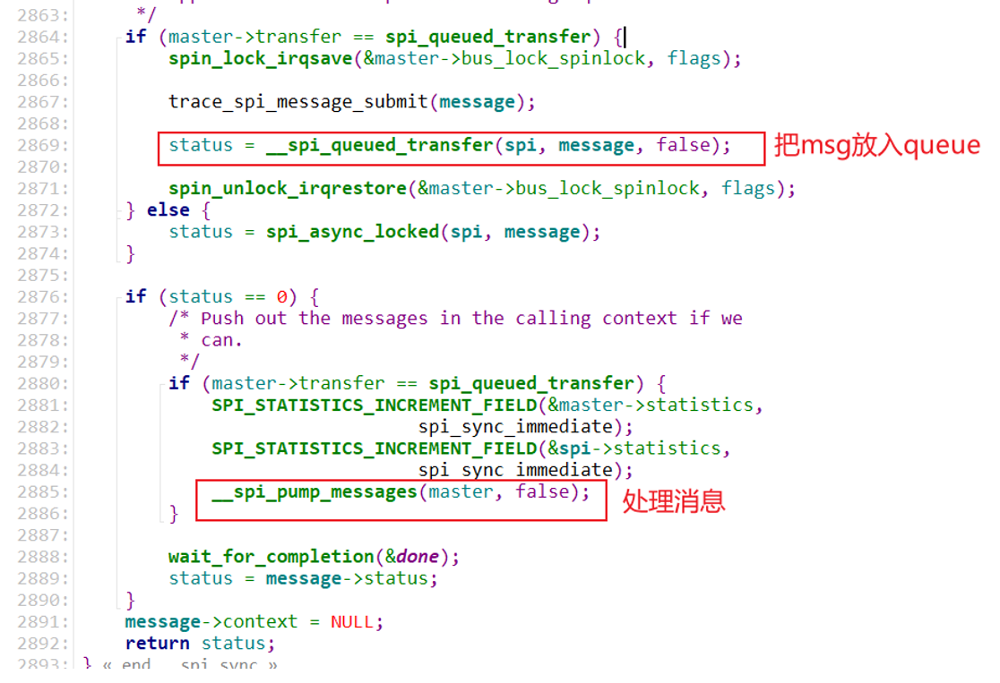

# 使用Framebuffer改造OLED驱动 #

* 源码:

    
    
    我们之前用SPI写的OLED程序, 设置像素位置, 然后写入数据, 不是屏幕程序的标准方式. 标准方式是用Framebuffer.

## 1. 思路


假设OLED的每个像素使用1位数据表示:

* Linux Framebuffer中byte0对应OLED上第1行的8个像素
* OLED显存中byte0对应OLED上第1列的8个像素


为了兼容基于Framebuffer的程序，驱动程序中分配一块Framebuffer，APP直接操作Framebuffer。

驱动程序周期性地把Framebuffer中的数据搬移到OLED显存上。

怎么搬移？

发给OLED线程的byte0、1、2、3、4、5、6、7怎么构造出来？

* 它们来自Framebuffer的byte0、16、32、48、64、80、96、112
* OLED的byte0，由Framebuffer的这8个字节的bit0组合得到
* OLED的byte1，由Framebuffer的这8个字节的bit1组合得到
* OLED的byte2，由Framebuffer的这8个字节的bit2组合得到
* OLED的byte3，由Framebuffer的这8个字节的bit3组合得到
* ……


- 对于应用程序来说, 它认为一个屏幕就是一个Framebuffer, 其他的它都不管. 你硬件怎么把Framebuffer里的数据写到屏幕上都不关心.
- APP(QT/LVGL) 它操作一行Framebuffer 就是去操作屏幕的一行像素.  1个像素 是1bpp, 那byte0 的bit0到7 就对应屏幕上, 第一行第1到8个像素.
- 注意: 一行数据, 对应一行像素.
- 硬件上, 会有一个主控soc, 内部有LCD控制器, LCD控制器会周期地把像素数据写到LCD. LCD控制器会把Framebuffer里的数据写到LCD上面去.
- 软件构造好Framebuffer, LCD控制器会把Framebuffer里的数据在屏幕上给刷新出来.


OLED 里面是有显存的. 通过SPI接口, 与主控芯片相连, 主控里有SPI控制器. 


- OLED显存中 byte0的数据, 对应这OLED屏幕的第一列的头8个像素. 所以, 没办法, 只能再开一个中转Framebuffer, 把像素转成OLED显存的格式.


转换fb里的数据到中转fb:


- 128x64, 那么APP的FB一行16个字节. 64行.  一次处理8行, 所以最外层的循环应该是8次.
- 那么OLED显存里的byte0...7 就来源于, APP的FB里的 byte0, 16, 32, 64, 80, 96, 112 里的bit0...7 
- 显存里的byte8 对应 APP FB的byte1...

## 2. 编程

### 2.1 Framebuffer编程

分配、设置、注册fb_info结构体。

* 分配fb_info
* 设置fb_info
    * fb_var
    * fb_fix
* 注册fb_info
* 硬件操作

### 2.2 数据搬移

创建内核线程，`周期性`地把`Framebuffer`中的数据通过SPI发送给OLED。

创建内核线程:

* 参考文件`include\linux\kthread.h`

* 参考文章：https://blog.csdn.net/qq_37858386/article/details/115573565

* `kthread_create`：创建内核线程，线程处于"停止状态"，要运行它需要执行`wake_up_process`

* `kthread_run`：创建内核线程，并马上让它处于"运行状态"

* `kernel_thread`

### 2.3 调试

配置内核, 把下列配置项去掉:


# OLED_Framebuffer驱动_上机实验 #

* 源码:

    

* DMA参考文章：https://www.kernel.org/doc/html/latest/core-api/dma-api-howto.html

## 1. 硬件

### 1.1 原理图

IMX6ULL:


STM32MP157:


原理图：


### 1.2 连接

无论是使用IMX6ULL开发板还是STM32MP157开发板，都有类似的扩展板。把OLED模块接到扩展板的SPI_A插座上，如下：


## 2. 编写设备树

### 2.1.1 IMX6ULL


DC引脚使用GPIO4_20，也需在设备树里指定。

设备树如下：arch/arm/boot/dts/100ask_imx6ull-14x14.dts

```shell
&ecspi1 {
    pinctrl-names = "default";
    pinctrl-0 = <&pinctrl_ecspi1>;

    fsl,spi-num-chipselects = <2>;
    cs-gpios = <&gpio4 26 GPIO_ACTIVE_LOW>, <&gpio4 24 GPIO_ACTIVE_LOW>;
    status = "okay";

    oled: oled {
        compatible = "100ask,oled";
        reg = <0>;
        spi-max-frequency = <10000000>;
        dc-gpios = <&gpio4 20 GPIO_ACTIVE_HIGH>; 
    };
};
```

### 2.1.2 STM32MP157


DC引脚使用GPIOA_13，也需要在设备树里指定。

设备树如下：`arch/arm/boot/dts/stm32mp157c-100ask-512d-lcd-v1.dts`

```shell
&spi5 {
        pinctrl-names = "default", "sleep";
        pinctrl-0 = <&spi5_pins_a>;
        pinctrl-1 = <&spi5_sleep_pins_a>;
        status = "okay";
        cs-gpios = <&gpioh 5 GPIO_ACTIVE_LOW>, <&gpioz 4 GPIO_ACTIVE_LOW>;
        spidev: icm20608@0{
                compatible = "invensense,icm20608";
                interrupts = <0 IRQ_TYPE_EDGE_FALLING>;
                interrupt-parent = <&gpioz>;
                spi-max-frequency = <8000000>;
                reg = <0>;
        };
        oled: oled@1{
                compatible = "100ask,oled";
                spi-max-frequency = <10000000>;
                reg = <1>;
                dc-gpios = <&gpioa 13 GPIO_ACTIVE_HIGH>;
        };
};
```

## 3. 编译替换设备树

### 3.1 IMX6ULL

#### 3.1.1 设置工具链

```shell
export ARCH=arm
export CROSS_COMPILE=arm-buildroot-linux-gnueabihf-
 export PATH=$PATH:/home/book/100ask_imx6ull-sdk/ToolChain/arm-buildroot-linux-gnueabihf_sdk-buildroot/bin
```


#### 3.1.2 编译、替换设备树

  * 编译设备树：
    在Ubuntu的IMX6ULL内核目录下执行如下命令,
    得到设备树文件：`arch/arm/boot/dts/100ask_imx6ull-14x14.dtb`

    ```shell
    make dtbs
    ```

  * 复制到NFS目录：

    ```shell
    $ cp arch/arm/boot/dts/100ask_imx6ull-14x14.dtb ~/nfs_rootfs/
    ```

  * 开发板上挂载NFS文件系统

    ```shell
    [root@100ask:~]#  mount -t nfs -o nolock,vers=3 192.168.1.137:/home/book/nfs_rootfs /mnt
    ```

* 更新设备树

    ```shell
    [root@100ask:~]# cp /mnt/100ask_imx6ull-14x14.dtb /boot
    [root@100ask:~]# sync
    ```

* 重启开发板

### 3.2 STM32MP157

#### 3.2.1 设置工具链

```shell
export ARCH=arm
export CROSS_COMPILE=arm-buildroot-linux-gnueabihf-
export PATH=$PATH:/home/book/100ask_stm32mp157_pro-sdk/ToolChain/arm-buildroot-linux-gnueabihf_sdk-buildroot/bin
```


#### 3.2.2 编译、替换设备树

  * 编译设备树：
    在Ubuntu的STM32MP157内核目录下执行如下命令,
    得到设备树文件：`arch/arm/boot/dts/stm32mp157c-100ask-512d-lcd-v1.dtb`

    ```shell
    make dtbs
    ```

  * 复制到NFS目录：

    ```shell
    $ cp arch/arm/boot/dts/stm32mp157c-100ask-512d-lcd-v1.dtb ~/nfs_rootfs/
    ```

  * 开发板上挂载NFS文件系统

    ```shell
    [root@100ask:~]#  mount -t nfs -o nolock,vers=3 192.168.1.137:/home/book/nfs_rootfs /mnt
    ```

* 确定设备树分区挂载在哪里

    由于版本变化，STM32MP157单板上烧录的系统可能有细微差别。
    在开发板上执行`cat /proc/mounts`后，可以得到两种结果(见下图)：

    * mmcblk2p2分区挂载在/boot目录下(下图左边)：无需特殊操作，下面把文件复制到/boot目录即可

    * mmcblk2p2挂载在/mnt目录下(下图右边)

        * 在视频里、后面文档里，都是更新/boot目录下的文件，所以要先执行以下命令重新挂载：
            * `mount  /dev/mmcblk2p2  /boot`

        

* 更新设备树

    ```shell
    [root@100ask:~]# cp /mnt/stm32mp157c-100ask-512d-lcd-v1.dtb /boot/
    [root@100ask:~]# sync
    ```

* 重启开发板

## 4. 编译OLED驱动

```shell
cd 10_oled_framebuffer_ok
make
```

## 5. 编译APP

```shell
cd  10_oled_framebuffer_ok/03_freetype_show_font_angle
make
```

## 6. 上机实验

```shell
1. 安装驱动程序, 确定新出现哪个设备节点
ls /dev/fb*
insmod oled_drv.ko
ls /dev/fb*

2. 在IMX6ULL上运行测试程序
./freetype_show_font_angle  /dev/fb2 ./simsun.ttc 0 20

2. 在STM32MP157上运行测试程序
./freetype_show_font_angle  /dev/fb1 ./simsun.ttc 0 20
```

# SPI_Master驱动程序框架

* 参考内核源码: `drivers\spi\spi.c`

## 1. SPI传输概述

### 1.1 数据组织方式

使用SPI传输时，`最小的传输单位`是"`spi_transfer`"，

对于一个设备，可以发起`多个spi_transfer`，

这些spi_transfer，会`放入一个spi_message`里。

* spi_transfer：指定tx_buf、rx_buf、len
    - 

* `同一个SPI设备`的`spi_transfer`，使用`spi_message`来管理：
    - 

* 同一个SPI Master下的spi_message，放在一个队列里：
    - 


所以，反过来，SPI传输的流程是这样的：

* 从spi_master的队列里取出每一个spi_message
    * 从spi_message的队列里取出一个spi_transfer
        * 处理spi_transfer


- 为每个不同的设备构造一个自己的spi_message 结构体.
- 然后 控制器结构体, 把这些spi_message串起来管理. 用 里面的成员`struct spi_device *spi;` 来区分是哪个设备的.
- spi_message中有一个或者多个 spi_transfer, 表示一次或多次传输.
- 

- 
    - 发起传输的时候, 要先根据buf和len构造一个spi_transfer, 再构建一个spi_message, 把spi_transfer放到spi_message中. 然后调用spi_sync.
    - spi_snyc 会根据spi_device参数, 找到spi_master, 把spi_message放入 spi_master的queue成员里. 
    - 然后发起传输. 等待传输结果. 
    - 由另一个内核线程, 来从queue里取出消息, 发起传输, 传输完成会有中断产生, 中断唤醒该等待中的发送线程. 
    - 看第2节.

### 1.2 SPI控制器数据结构

参考内核文件：`include\linux\spi\spi.h`

Linux中使用spi_master结构体描述SPI控制器，有两套传输方法：

- 

## 2. SPI传输函数的两种方法

**__spi_sync** 函数:

- 
    - 如果transfer函数 是内核提供的 spi_queued_transfer 函数, 就用新方法. 新方法帮你管理消息, 帮你把spi_message放入队列, 并且处理.
    - 否则就是用老的方法. 老方法, 就是你自己实现transfer, 自己管理queue, 自己触发传输.
- 
- 看下面老方法跟新方法.

### 2.1 老方法


- 老方法是异步的, 它不会等待执行结果. 而是在上一层 **__spi_sync**函数中, **wait_for_completion**(&done);等待. 

- 
- 
    - 内核工作线程每传输一个xfer, 就要等待这次的xfer完成. 完成时, 会产生中断, 来唤醒此工作线程, 继续从queue里取消息发送.
    - queue里全部发送完毕了, 就会调用之前初始化好的 complete 函数. 去唤醒wait_for_completion里的APP. 继续往下走.
    - 使用老方法, 必须自己实现添加消息队列 到 master的消息队列. 自己去实现内核线程, 自己实现work.


### 2.2 新方法




- 新方法 会帮你把消息放到 master的队列里去. 然后pump. 
- **__spi_pump_messages** 也是启动传输, 然后立刻返回, 在上一层等待完成.
- **__spi_pump_messages** 是核心, 它有可能是同步的, 也可能是异步的.
    - 同步还是异步取决于消息链表的情况.
    - 
    - 假如说我们把我们的消息放到队列里去了, 但是当前还在传别的消息. 没有传到我们刚刚写的消息. 就返回了, 等着我们的消息被发送.
    - 这个时候是异步的.
    - 而如果当前消息正好是空的, 我们刚刚放进来的消息正是要发送的那个. 就会继续往下执行.
    - 
    -  执行这个函数, 等待传输结果, 这个时候就是同步的.


- transfer_one_message函数有一个默认函数, 是spi_transfer_one_message. 多个xfer只需要一次片选.
- transfer_one里面, 有需要我们去实现的 setup_transfer , txrx_bufs (硬件相关代码).

# 编写SPI_Master驱动程序(老方法)

本节源码：


参考资料：

* 内核头文件：`include\linux\spi\spi.h`
* 内核文档：`Documentation\devicetree\bindings\spi\spi-bus.txt`	
    * 内核源码：`drivers\spi\spi.c`、`drivers\spi\spi-sh.c`

## 1. SPI驱动框架

### 1.1 总体框架


### 1.2 怎么编写SPI_Master驱动

#### 1.2.1 编写设备树

在设备树中，对于SPI Master，必须的属性如下：

* #address-cells：这个SPI Master下的SPI设备，需要多少个cell来表述它的片选引脚
* #size-cells：必须设置为0
* compatible：根据它找到SPI Master驱动

可选的属性如下：

* cs-gpios：SPI Master可以使用多个GPIO当做片选，可以在这个属性列出那些GPIO
* num-cs：片选引脚总数

其他属性都是驱动程序相关的，不同的SPI Master驱动程序要求的属性可能不一样。


在SPI Master对应的设备树节点下，每一个子节点都对应一个SPI设备，这个SPI设备连接在该SPI Master下面。

这些子节点中，必选的属性如下：

* compatible：根据它找到SPI Device驱动
* reg：用来表示它使用哪个片选引脚
* spi-max-frequency：必选，该SPI设备支持的最大SPI时钟

可选的属性如下：

* spi-cpol：这是一个空属性(没有值)，表示CPOL为1，即平时SPI时钟为低电平
* spi-cpha：这是一个空属性(没有值)，表示CPHA为1)，即在时钟的第2个边沿采样数据
* spi-cs-high：这是一个空属性(没有值)，表示片选引脚高电平有效
* spi-3wire：这是一个空属性(没有值)，表示使用SPI 三线模式
* spi-lsb-first：这是一个空属性(没有值)，表示使用SPI传输数据时先传输最低位(LSB)
* spi-tx-bus-width：表示有几条MOSI引脚；没有这个属性时默认只有1条MOSI引脚
* spi-rx-bus-width：表示有几条MISO引脚；没有这个属性时默认只有1条MISO引脚
* spi-rx-delay-us：单位是毫秒，表示每次读传输后要延时多久
* spi-tx-delay-us：单位是毫秒，表示每次写传输后要延时多久


#### 1.2.2 编写驱动程序

* 核心为：分配/设置/注册spi_master结构体
* 对于老方法，spi_master结构体的核心是transfer函数


## 2. 编写程序

### 2.1 数据传输流程


### 2.2 写代码

不会就去抄别人的内核代码. 这里主要是抄 spi-sh.c 跟 spi-imx.c

- 设备树:

```
 spi3 {
        compatible = "my,virtual_spi_master";
        status = "okay";
        #address-cells = <1>;
        #size-cells = <0>;
        num-chipselects = <1>;
        cs-gpios = <&gpio0 27 GPIO_ACTIVE_LOW>;

        virtual_spi_dev: virtual_spi_dev@0 {
            compatible = "my,virtual_spi_device";
            reg=<0>;
            spi-max-frequency = <100000>;
        };
    };
```

# 使用老方法编写的SPI_Master驱动程序上机实验

本节源码：


参考资料：

* 内核头文件：`include\linux\spi\spi.h`
* 内核文档：`Documentation\devicetree\bindings\spi\spi-bus.txt`	
    * 内核源码：`drivers\spi\spi.c`、`drivers\spi\spi-sh.c`

## 1. 修改设备树

### 1.1 IMX6ULL

修改`arch/arm/boot/dts/100ask_imx6ull-14x14.dts`中，如下：

```shell
        virtual_spi_master {
                compatible = "100ask,virtual_spi_master";
                status = "okay";
                cs-gpios = <&gpio4 27 GPIO_ACTIVE_LOW>;
                num-chipselects = <1>;
                #address-cells = <1>;
                #size-cells = <0>;

                virtual_spi_dev: virtual_spi_dev@0 {
                        compatible = "spidev";
                        reg = <0>;
                        spi-max-frequency = <100000>;
                };
        };

```

### 2.2 STM32MP157

修改`arch/arm/boot/dts/stm32mp157c-100ask-512d-lcd-v1.dts`中，如下：

```shell
        virtual_spi_master {
                compatible = "100ask,virtual_spi_master";
                status = "okay";
                cs-gpios = <&gpioh 6 GPIO_ACTIVE_LOW>;
                num-chipselects = <1>;
                #address-cells = <1>;
                #size-cells = <0>;

                virtual_spi_dev: virtual_spi_dev@0 {
                        compatible = "spidev";
                        reg = <0>;
                        spi-max-frequency = <100000>;
                };
        };
```

## 2. 编译替换设备树

### 2.1 IMX6ULL

#### 2.1.1 设置工具链

```shell
export ARCH=arm
export CROSS_COMPILE=arm-buildroot-linux-gnueabihf-
 export PATH=$PATH:/home/book/100ask_imx6ull-sdk/ToolChain/arm-buildroot-linux-gnueabihf_sdk-buildroot/bin
```


#### 2.1.2 编译、替换设备树

  * 编译设备树：
    在Ubuntu的IMX6ULL内核目录下执行如下命令,
    得到设备树文件：`arch/arm/boot/dts/100ask_imx6ull-14x14.dtb`

    ```shell
    make dtbs
    ```

  * 复制到NFS目录：

    ```shell
    $ cp arch/arm/boot/dts/100ask_imx6ull-14x14.dtb ~/nfs_rootfs/
    ```

  * 开发板上挂载NFS文件系统

    ```shell
    [root@100ask:~]#  mount -t nfs -o nolock,vers=3 192.168.1.137:/home/book/nfs_rootfs /mnt
    ```

* 更新设备树

    ```shell
    [root@100ask:~]# cp /mnt/100ask_imx6ull-14x14.dtb /boot
    [root@100ask:~]# sync
    ```

* 重启开发板

### 2.2 STM32MP157

#### 2.2.1 设置工具链

```shell
export ARCH=arm
export CROSS_COMPILE=arm-buildroot-linux-gnueabihf-
export PATH=$PATH:/home/book/100ask_stm32mp157_pro-sdk/ToolChain/arm-buildroot-linux-gnueabihf_sdk-buildroot/bin
```


#### 2.2.2 编译、替换设备树

  * 编译设备树：
    在Ubuntu的STM32MP157内核目录下执行如下命令,
    得到设备树文件：`arch/arm/boot/dts/stm32mp157c-100ask-512d-lcd-v1.dtb`

    ```shell
    make dtbs
    ```

  * 复制到NFS目录：

    ```shell
    $ cp arch/arm/boot/dts/stm32mp157c-100ask-512d-lcd-v1.dtb ~/nfs_rootfs/
    ```

  * 开发板上挂载NFS文件系统

    ```shell
    [root@100ask:~]#  mount -t nfs -o nolock,vers=3 192.168.1.137:/home/book/nfs_rootfs /mnt
    ```

* 确定设备树分区挂载在哪里

    由于版本变化，STM32MP157单板上烧录的系统可能有细微差别。
    在开发板上执行`cat /proc/mounts`后，可以得到两种结果(见下图)：

    * mmcblk2p2分区挂载在/boot目录下(下图左边)：无需特殊操作，下面把文件复制到/boot目录即可

    * mmcblk2p2挂载在/mnt目录下(下图右边)

        * 在视频里、后面文档里，都是更新/boot目录下的文件，所以要先执行以下命令重新挂载：
            * `mount  /dev/mmcblk2p2  /boot`

* 更新设备树

    ```shell
    [root@100ask:~]# cp /mnt/stm32mp157c-100ask-512d-lcd-v1.dtb /boot/
    [root@100ask:~]# sync
    ```

* 重启开发板

## 3. 编译驱动和APP

## 4. 上机实验

先执行：

```shell
insmod virtual_spi_master.ko
```

对于IMX6ULL，因为spidev没有被编译进内核，那么再执行(对于STM32MP157，无需执行这个命令)：

```shell
insmod spidev.ko
```

看看`/sys/class/spi_master/ `下面有没有新的节点

确定设备节点：

```shell
ls /dev/spidev*
```

假设设备节点为`/dev/spidev32765.0`，执行测试程序(它并不会真正地读写数据)：

```shell
./spi_test  /dev/spidev32765.0  500
./spi_test  /dev/spidev32765.0  600
./spi_test  /dev/spidev32765.0  1000
```

# 编写SPI_Master驱动程序_新方法

内容看上面. 主要是参考 spi-imx.c

# SPI_Slave_Mode驱动程序框架

* 参考内核源码: `Linux-5.4\drivers\spi\spi-imx.c`
* 注意：`Linux 4.9`的内核`未支持SPI Slave Mode`
* 参考文档：《Linux_as_an_SPI_Slave_Handouts.pdf》

## 1. Master和Slave模式差别


- slave 模式, 是等待别人来访问你. 首先是等别人选中你, 然后别人给你发时钟, 发数据给你, 你回复数据回去.
- master模式是主动发起数据, slave是被动, 等待别人.

以IMX6ULL为例，Master和Slave模式的异同如下图：

* 初始化

    * SPI寄存器有所不同
    * 引脚有所不同：Master模式下SS、CLK引脚是输出引脚，Slave模式下这些引脚是输入引脚

* 准备数据：都需要准备好要发送的数据，填充TXFIFO

* 发起传输：Master模式下要主动发起传输，等待发送完成(等待中断)

* 使能接收中断：Slave模式下无法主动发起传输，只能被动地等待，使能接收中断即可

* 中断函数里：读取RXFIFO得到数据

* 传输完成


-  
- 
    - 先配置, master是主动发送, 要把数据放到FIFO里, 主动发送出去. 
    - slave也是要配置, 然后事先准备好数据. 但是这时候是被动等待, 等待片选跟时钟信号, 然后发送数据. 

## 2. SPI传输概述

### 2.1 数据组织方式

使用SPI传输时，最小的传输单位是"spi_transfer"，

对于一个设备，可以发起多个spi_transfer，

这些spi_transfer，会放入一个spi_message里。

* spi_transfer：指定tx_buf、rx_buf、len
    

* 同一个SPI设备的spi_transfer，使用spi_message来管理：
    

* 同一个SPI Master下的spi_message，放在一个队列里：
    


所以，反过来，SPI传输的流程是这样的：

* 从spi_master的队列里取出每一个spi_message
    * 从spi_message的队列里取出一个spi_transfer
        * 处理spi_transfer

### 2.2 SPI控制器数据结构

参考内核文件：`include\linux\spi\spi.h`

Linux中使用spi_master结构体描述SPI控制器，有两套传输方法：


## 3. SPI Slave Mode数据传输过程


## 4. 如何编写程序

### 4.1 设备树

* SPI控制器设备树节点中，需要添加一个空属性：spi-slave  
* 要模拟哪类slave设备？需要添加`slave`子节点，这是用来指定`slave protocol`


### 4.2 内核相关

* 新配置项：`CONFIG_SPI_SLAVE`
* 设备树的解析：增加对`spi-slave`、`slave`子节点的解析
* sysfs：新增加`/sys/devices/.../CTLR/slave`，对应`SPI Slave handlers`
* 新API
    * spi_alloc_slave( )
    * spi_slave_abort( )
    * spi_controller_is_slave( )

* 硬件设置不一样
    * master：SS、SCLK引脚是`输出引脚`
    * slave：SS、SCLK引脚是`输入引脚`
* 传输时等待函数不一样
    * master：master主动发起spi传输，它可以指定超时时间，使用函数`wait_for_completion_timeout() `进行等待
    * slave：slave只能被动等待传输，它无需指定超时时间，使用函数`wait_for_completion_interruptible()`进行等待 ，使用`.slave_abort() `来取消等待

### 4.3 简单的示例代码

#### 4.3.1 master和slave驱动示例


#### 4.3.2 master和slave使用示例

对于设置为spi master模式的spi控制器，下面接的是一个一个spi slave设备，我们编写各类spi slave driver，通过spi master的函数读写spi slave 设备。

对于设置为spi slave模式的spi控制器，它是作为一个spi slave设备被其他单板的spi master设备来访问，它如何接收数据、如何提供数据？我们编写对应的`spi slave handler`(用它来模拟某些设备).

对于master和slave，有两个重要概念：

* SPI Slave Driver：通过SPI Master控制器跟SPI Slave设备通信
* SPI Slave Handler：通过SPI Slave控制器监听远端的SPI Master


# SPI_Slave_Mode驱动程序源码解读 #

* 参考内核源码: `Linux-5.4\drivers\spi\spi-imx.c`
* 注意：Linux 4.9的内核未支持SPI Slave Mode
* 参考文档：《Linux_as_an_SPI_Slave_Handouts.pdf》

## 1. 设备树

Linux 5.4中IMX6ULL的设备树代码里，并未支持slave模式，下图是摘自《`Linux_as_an_SPI_Slave_Handouts.pdf`》：


## 2. 控制器驱动程序

在Linux 5.4中，SPI控制器的驱动程序仍然使用原来的名字：struct spi_master，但是它已经是一个宏：

```c
#define spi_master spi_controller
```

这意味着它可以工作于master模式，也可以工作于slave模式。

### 2.1 分配一个spi_controller


### 2.2 设置spi_controller

工作于slave模式时，跟master模式最大的差别就是如下函数不一样：

* bitbang.txrx_bufs函数不一样
    * 在IMX6ULL中，这个函数为spi_imx_transfer，里面对master、slave模式分开处理
    * master模式：使用`spi_imx_pio_transfer`函数
    * slave模式：使用`spi_imx_pio_transfer_slave`函数
* 增加了bitbang.master->slave_abort函数


#### 2.2.1 传输函数对比


### 2.3 注册spi_controller

无论是master模式，还是slave模式，注册函数时一样的：


在spi_bitbang_start内部，会处理设备树中的子节点，创建并注册spi_device：

```c
spi_bitbang_start
    spi_register_master
    	spi_register_controller
    		of_register_spi_devices
```


对于master模式，设备树中的子节点对应真实的spi设备；

但是对于slave模式，这些子节点只是用来选择对应的spi slave handler：就是使用哪个驱动来模拟spi slave设备，比如：


### 2.4 硬件操作

#### 2.4.1 引脚配置


## 3. 设备驱动程序

### 3.1 Master模式


### 3.2 Slave模式

参考代码：`Linux-5.4\drivers\spi\spi-slave-time.c`


