# I2C 子系统

参考资料：
- I2CTools：[https://mirrors.edge.kernel.org/pub/software/utils/i2c-tools/](https://mirrors.edge.kernel.org/pub/software/utils/i2c-tools/)

## 1 I2C硬件框架


- 在一个芯片(SoC)内部，有一个或多个I2C控制器
- 在一个I2C控制器上，可以连接一个或多个I2C设备
- I2C总线只需要2条线：时钟线SCL、数据线SDA
- 在I2C总线的SCL、SDA线上，都有上拉电阻

## 2 I2C软件框架


以I2C接口的存储设备AT24C02为例：

- APP：
    - 提出要求：把字符串`"hello"`写入AT24C02地址16开始的地方
    - 它是大爷，不关心底层实现的细节
    - 它只需要调用设备驱动程序提供的接口
- AT24C02驱动：
    - 它知道AT24C02要求的地址、数据格式
    - 它知道发出什么信号才能让AT24C02执行擦除、烧写工作
    - 它知道怎么判断数据是否烧写成功
    - 它构造好一系列的数据，发给I2C控制器
- I2C控制器驱动
    - 它根据I2C协议发出各类信号：I2C设备地址、I2C存储地址、数据
    - 它根据I2C协议判断

## 3 我们讲什么

### 3.1 对于Linux


从上到下：

* 先讲I2C协议
* APP可以通过`两类驱动程序`访问设备
	* I2C设备自己的驱动程序
	* 内核自带的`i2c-dev.c`驱动程序，它是i2c控制器驱动程序`暴露给用户空间`的驱动程序(i2c-dev.c)
* I2C Device Driver
	* I2C设备自己的驱动程序
	* 内核自带的i2c-dev.c驱动程序，它是i2c控制器驱动程序暴露给用户空间的驱动程序(i2c-dev.c)
* I2C Controller Driver
	* 芯片I2C控制器的驱动程序(称为adapter)
	* 使用`GPIO模拟`的I2C控制器驱动程序(i2c-gpio.c)


用户态app使用`i2c控制器`的读写能力
- APP可以通过内核暴露给用户态的驱动程序i2c-dev.c, 访问到下面的i2c控制器. App就可以原始地读写i2c设备
- 以前 I2C驱动程序要做的 发送dev_addr, reg_addr, 然后获得data, 解析数据, 这些工作现在都可以在用户态app里做了.
- 这就是用户态的驱动程序

### 3.2 对于单片机/裸机


从上到下：

- 先讲I2C协议
- APP
- I2C Device Driver
- I2C Controller Driver(也被称为adapter)

# I2C协议

参考资料：
- i2c_spec.pdf

I2C（Inter-Integrated Circuit BUS）是 I2C BUS 简称，中文为集成电路总线，是目前应用最广泛的总线之一。和 IMX6ULL 有些相关的是，刚好该总线是 NXP 前身的 PHILIPS 设计。

I2C 是一种`串行通信总线`，使用`多主从架构`，最初设计目的为了让主板、嵌入式系统或手机用来连接低速周边设备。多用于`小数据量`的场合，有传输距离短，任意时刻只能有一个主机等特性。严格意义上讲，I2C 应该是`软硬件结合体`，所以我们将分物理层和协议层来介绍该总线。

## 1 硬件连接

I2C在硬件上的接法如下所示，主控芯片引出两条线`SCL,SDA线`，在一条I2C总线上可以接很多I2C设备，我们还会放一个上拉电阻（放一个上拉电阻的原因以后我们再说）。
- 

- 

## 2 传输数据类比

怎么通过I2C传输数据，我们需要把数据从主设备发送到从设备上去，也需要把数据从从设备传送到主设备上去，数据涉及到双向传输。

举个例子：
- 

体育老师：可以把球发给学生，也可以把球从学生中接过来。
- 发球：
    - 老师：开始了(start)
    - 老师：A！我要发球给你！(地址/方向)
    - 学生A：到！(回应)
    - 老师把球发出去（传输）
    - A收到球之后，应该告诉老师一声（回应）
    - 老师：结束（停止）
	
- 接球：
    - 老师：开始了(start)
    - 老师：B！把球发给我！(地址/方向)
    - 学生B：到！
    - B把球发给老师（传输）
    - 老师收到球之后，给B说一声，表示收到球了（回应）
    - 老师：结束（停止）

我们就使用这个简单的例子, 来解释一下IIC的传输协议：

- 老师说开始了, 表示开始信号(start)
- 老师提醒某个学生要发球, 表示发送地址和方向(address/read/write)
- 老师发球/接球, 表示数据的传输
- 收到球要回应: 回应信号(ACK)
- 老师说结束, 表示IIC传输结束(P)

## 补充: 物理层

>特性 1：半双工（非全双工）

I2C 总线中只使用两条线路：SDA、SCL。

- ① SDA(串行数据线):
	- 主芯片通过一根 SDA 线既可以把数据发给从设备，也可以从 SDA 上读取数据。在 I2C 设备内部有两个引脚（发送引脚/接受引脚），它们都连接到外部的SDA 线上。
- ② SCL(串行时钟线)：
	- I2C 主设备发出时钟，从设备接收时钟。
	- SDA 和 SCL 引脚的内部电路结构一致，引脚的输出驱动与输入缓冲连在一起。其中输出为漏极开路的场效应管、输入缓冲为一只高输入阻抗的同相器。这样结构有如下特性：
-  由于 SDA、SCL 为漏极开路结构，借助于外部的上拉电阻实现了信号的“线与”逻辑；
-  引脚在输出信号的同时还作用输入信号供内部进行检测，当输出与输入不一致时，就表示有问题发生了。这为 “时钟同步”和“总线仲裁”提供硬件基础。

SDA 和 CLK 连接线上连有两个上拉电阻，当总线空闲时，两根线均为高电平。连到总线上的任一器件输出的低电平，都将使总线的信号变低。物理层连接如下图所示：
- 

>特性 2：地址和角色可配置

每个连接到总线的器件都可以通过唯一的地址和其它器件通信，主机/从机角色和地址可配置，主机可以作为主机发送器和主机接收器。

>特性 3：多主机

IIC 是真正的多主机总线，I2C 设备可以在通讯过程转变成主机。如果两个或更多的主机同时请求总线，可以通过冲突检测和仲裁防止总线数据被破坏。

> 特性 4：传输速率

传输速率在标准模式下可以达到 100kb/s，快速模式下可以达到 400kb/s。

> 特性 5：负载和距离

节点的最大数量受限于地址空间以及总线电容决定，另外`总电容`也限制了实际通信距离只有几米。

## 3 IIC传输数据的格式

### 3.1 写操作

流程如下：

- 主芯片要发出一个start信号
- 然后发出一个设备地址(用来确定是往哪一个芯片写数据)，方向(读/写，0表示写，1表示读)
- 从设备回应(用来确定这个设备是否存在)，然后就可以传输数据
- 主设备发送一个字节数据给从设备，并等待回应
- 每传输一字节数据，接收方要有一个回应信号（确定数据是否接受完成)，然后再传输下一个数据。
- 数据发送完之后，主芯片就会发送一个停止信号。

下图：白色背景表示`"主→从"`，灰色背景表示`"从→主"`
- 

### 3.2 读操作

流程如下：

- 主芯片要发出一个start信号
- 然后发出一个设备地址(用来确定是往哪一个芯片写数据)，方向(读/写，0表示写，1表示读)
- 从设备回应(用来确定这个设备是否存在)，然后就可以传输数据
- 从设备发送一个字节数据给主设备，并等待回应
- 每传输一字节数据，接收方要有一个回应信号（确定数据是否接受完成)，然后再传输下一个数据。
- 数据发送完之后，主芯片就会发送一个停止信号。

下图：白色背景表示`"主→从"`, 灰色背景表示`"从→主"`
- 

### 3.3 I2C信号

- 数据有效性: I2C 协议的数据有效性是靠`时钟`来保证的，在时钟的高电平周期内，SDA 线上的数据必须保持稳定。数据线仅可以在时钟 SCL 为低电平时改变。
	- 

- 起始和结束条件
	- 起始条件：当 SCL 为高电平的时候，SDA 线上由高到低的跳变被定义为起始条件。
	- 结束条件：当 SCL 为高电平的时候，SDA 线上由低到高的跳变被定义为停止条件。
- 要注意`起始和终止信号`都是由`主机`发出的，连接到 I2C 总线上的器件，若具有 I2C 总线的硬件接口，则很容易检测到起始和终止信号。
	- 
	- 总线在起始条件之后，视为忙状态，在停止条件之后被视为空闲状态。

- 应答
	- 每当主机向从机发送完`一个字节`的数据, 主机总是需要`等待从机`给出一个`应答信号`, 以确认从机是否成功接收到了数据, 从机应答主机`所需要的时钟`仍是`主机提供`的, 应答出现在每一次主机完成 8 个数据位传输后紧跟着的时钟周期, 低电平 0 表示应答, 1 表示非应答. 

- 数据帧格式
	- SDA 线上每个字节必须是 8 位长，在每个传输(transfer)中所传输字节数没有限制，每个字节后面必须跟一个 ACK。8 位数据中，先传输最高有效位（MSB）传输。
	- 


I2C协议中数据传输的单位是字节，也就是8位。但是要用到9个时钟：前面8个时钟用来传输8数据，第9个时钟用来传输回应信号。传输时，先传输最高位(MSB)。

- 开始信号(S)：SCL为`高电平`时，SDA山`高电平向低电平跳变`，开始传送数据。
- 结束信号(P)：SCL为`高电平`时，SDA由低电平向高电平跳变，结束传送数据。
- 响应信号(ACK)：接收端在接收到8位数据后, 在第9个时钟周期, 对方拉低SDA
- SDA上传输的数据必须在SCL为高电平期间保持稳定, SDA上的数据只能在SCL为低电平期间变化

I2C协议信号如下：
- 
- SDA数据线一会由主设备驱动, 一会又由从设备来驱动.

### 3.4 协议细节

- `I2C 硬件设计核心`

- 如何在SDA上实现双向传输？ 主芯片通过一根SDA线既可以把数据发给从设备，也可以从SDA上读取数据，连接SDA线的引脚里面必然有两个引脚（发送引脚/接受引脚）。

- 主、从设备都可以通过SDA发送数据，肯定`不能同时`发送数据，怎么错开时间？ 在9个时钟里， 前8个时钟由主设备发送数据的话，第9个时钟就由从设备发送数据； 前8个时钟由从设备发送数据的话，第9个时钟就由主设备发送数据。
  
- 双方设备中，某个设备发送数据时，另一方怎样才能`不影响`SDA上的数据？ 设备的SDA中有一个三极管，使用开极/开漏电路(三极管是开极，CMOS管是开漏，作用一样)，如下图：
	- 
	- 
	- 真值表如下：
	- 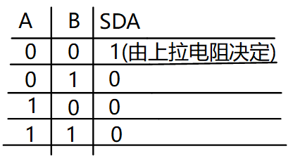

从真值表和电路图我们可以知道：

- 当某一个芯片不想影响SDA线时，那就不驱动这个三极管
- 想让SDA输出高电平，双方都不驱动三极管(SDA通过上拉电阻变为高电平)
- 想让SDA输出低电平，就驱动三极管

从下面的例子可以看看数据是怎么传的（实现双向传输）。 举例：主设备发送（8bit）给从设备

- 前8个clk
    - 从设备不要影响SDA，从设备不驱动三极管
    - 主设备决定数据，主设备要发送1时不驱动三极管，要发送0时驱动三极管
    
- 第9个clk，由从设备决定数据
    - 主设备不驱动三极管
    - 从设备决定数据，要发出回应信号的话，就驱动三极管让SDA变为0
    - 从这里也可以知道ACK信号是低电平


从上面的例子，就可以知道怎样在一条线上实现双向传输，这就是SDA上要使用上拉电阻的原因。

为何SCL也要使用上拉电阻？ 在第9个时钟之后，如果有`某一方`需要`更多的时间`来处理数据(主从设备都可以驱动SCL)，它可以一直驱动三极管把SCL拉低。 当SCL为低电平时候，大家都不应该使用IIC总线，只有当SCL从低电平变为高电平的时候，IIC总线才能被使用。 当它就绪后，就可以不再驱动三极管，这是上拉电阻把SCL变为高电平，其他设备就可以继续使用I2C总线了。

对于IIC协议它只能规定怎么传输数据，数据是什么含义由从设备决定。

# SMBus协议

参考资料：

- Linux内核文档：`Documentation\i2c\smbus-protocol.rst`
- SMBus协议：
    - [http://www.smbus.org/specs/](http://www.smbus.org/specs/)
- `SMBus_3_0_20141220.pdf`
- I2CTools: `https://mirrors.edge.kernel.org/pub/software/utils/i2c-tools/`

## SMBus是I2C协议的一个子集

SMBus: System Management Bus，系统管理总线。 SMBus最初的目的是为智能电池、充电电池、其他微控制器之间的通信链路而定义的。 SMBus也被用来连接各种设备，包括电源相关设备，系统传感器，EEPROM通讯设备等等。 SMBus 为系统和电源管理这样的任务提供了一条控制总线，使用 SMBus 的系统，设备之间发送和接收消息都是通过 SMBus，而不是使用单独的控制线，这样可以节省设备的管脚数。 

SMBus是基于I2C协议的，SMBus要求更严格，SMBus是I2C协议的子集。

SMBus有哪些更严格的要求？跟一般的I2C协议有哪些差别？

- VDD的极限值不一样
    - I2C协议：范围很广，甚至讨论了高达12V的情况
    - SMBus：1.8V~5V
    
- 最小时钟频率、最大的`Clock Stretching(时钟延长)`
    - Clock Stretching含义：某个设备需要更多时间进行内部的处理时，它可以把SCL拉低占住I2C总线
    - I2C协议：时钟频率最小值无限制，Clock Stretching时长也没有限制
    - SMBus：时钟频率最小值是10KHz，Clock Stretching的最大时间值也有限制
    
- 地址回应(Address Acknowledge)
    - 一个I2C设备接收到它的设备地址后，是否必须发出回应信号？
    - I2C协议：没有强制要求必须发出回应信号
    - SMBus：强制要求必须发出回应信号，这样对方才知道该设备的状态：busy，failed，或是被移除了
    
- SMBus协议明确了数据的传输格式
    - I2C协议：它只定义了怎么传输数据，但是并没有定义数据的格式，这完全由设备来定义
    - SMBus：定义了几种数据格式(后面分析)

- REPEATED START Condition(重复发出S信号)
    - 比如读EEPROM时，涉及2个操作：
        - 把存储地址发给设备
        - 读数据
    - 在写、读之间，可以不发出P信号，而是直接发出S信号：这个S信号就是`REPEATED START`
    - 如下图所示
    - 
    
- SMBus Low Power Version
    - SMBus也有低功耗的版本

## SMBus协议分析

对于I2C协议，它只定义了怎么传输数据，但是并没有定义数据的格式，这完全由设备来定义。 对于SMBus协议，它定义了几种数据格式。

**注意**：

- 下面文档中的`Functionality flag`是Linux的某个I2C控制器驱动所支持的功能。
- 比如`Functionality flag: I2C_FUNC_SMBUS_QUICK`，表示需要I2C控制器支持`SMBus Quick Command`

### symbols(符号)

```shell
S     (1 bit) : Start bit(开始位)
Sr    (1 bit) : 重复的开始位
P     (1 bit) : Stop bit(停止位)
R/W#  (1 bit) : Read/Write bit. Rd equals 1, Wr equals 0.(读写位)
A, N  (1 bit) : Accept and reverse accept bit.(回应位)
Address(7 bits): I2C 7 bit address. Note that this can be expanded as usual to
                get a 10 bit I2C address.
                (地址位，7位地址)
Command Code  (8 bits): Command byte, a data byte which often selects a register on the device.
                (命令字节，一般用来选择芯片内部的寄存器)
Data Byte (8 bits): A plain data byte. Sometimes, I write DataLow, DataHigh for 16 bit data.
                (数据字节，8位；如果是16位数据的话，用2个字节来表示：DataLow、DataHigh)
Count (8 bits): A data byte containing the length of a block operation.
				(在block操作总，表示数据长度)
[..]:           Data sent by I2C device, as opposed to data sent by the host
                adapter.
                (中括号表示I2C设备发送的数据，没有中括号表示host adapter发送的数据)
```

### SMBus Quick Command


只是用来发送一位数据：R/W#本意是用来表示读或写，但是在SMBus里可以用来表示其他含义。
比如某些开关设备，可以根据这一位来决定是打开还是关闭。
`Functionality flag: I2C_FUNC_SMBUS_QUICK`

### SMBus Receive Byte


I2C-tools中的函数：i2c_smbus_read_byte()。 读取一个字节，Host adapter接收到一个字节后不需要发出回应信号(上图中N表示不回应)。
`Functionality flag: I2C_FUNC_SMBUS_READ_BYTE`

### SMBus Send Byte


I2C-tools中的函数：i2c_smbus_write_byte()。 发送一个字节。
`Functionality flag: I2C_FUNC_SMBUS_WRITE_BYTE`

### SMBus Read Byte


I2C-tools中的函数：i2c_smbus_read_byte_data()。

先发出`Command Code`(它一般表示芯片内部的寄存器地址)，再读取一个字节的数据。 上面介绍的`SMBus Receive Byte`是不发送Comand，直接读取数据。
`Functionality flag: I2C_FUNC_SMBUS_READ_BYTE_DATA`

### SMBus Read Word


I2C-tools中的函数：i2c_smbus_read_word_data()。

先发出`Command Code`(它一般表示芯片内部的寄存器地址)，再读取2个字节的数据。
`Functionality flag: I2C_FUNC_SMBUS_READ_WORD_DATA`

### SMBus Write Byte


I2C-tools中的函数：i2c_smbus_write_byte_data()。

先发出`Command Code`(它一般表示芯片内部的寄存器地址)，再发出1个字节的数据。
`Functionality flag: I2C_FUNC_SMBUS_WRITE_BYTE_DATA`

### SMBus Write Word


I2C-tools中的函数：i2c_smbus_write_word_data()。

先发出`Command Code`(它一般表示芯片内部的寄存器地址)，再发出1个字节的数据。
`Functionality flag: I2C_FUNC_SMBUS_WRITE_WORD_DATA`

### SMBus Block Read

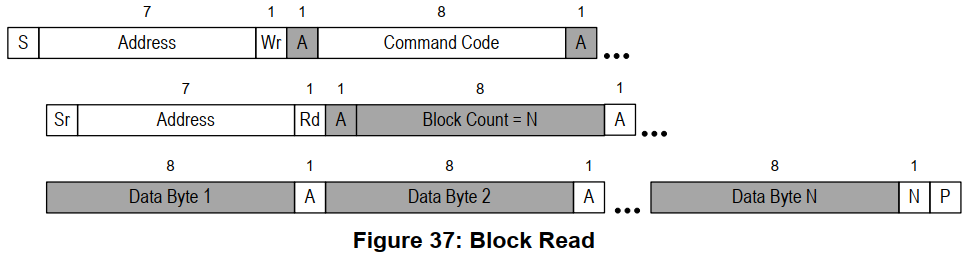

I2C-tools中的函数：i2c_smbus_read_block_data()。

先发出`Command Code`(它一般表示芯片内部的寄存器地址)，再发起度操作：
- 先读到一个字节(Block Count)，表示后续要读的字节数
- 然后读取全部数据

`Functionality flag: I2C_FUNC_SMBUS_READ_BLOCK_DATA`

### SMBus Block Write


I2C-tools中的函数：i2c_smbus_write_block_data()。

先发出`Command Code`(它一般表示芯片内部的寄存器地址)，再发出1个字节的`Byte Conut`(表示后续要发出的数据字节数)，最后发出全部数据。

`Functionality flag: I2C_FUNC_SMBUS_WRITE_BLOCK_DATA`

### I2C Block Read

在一般的I2C协议中，也可以连续读出多个字节。 它跟`SMBus Block Read`的差别在于设备发出的第1个数据不是长度N，如下图所示：
- 

I2C-tools中的函数：i2c_smbus_read_i2c_block_data()。

先发出`Command Code`(它一般表示芯片内部的寄存器地址)，再发出1个字节的`Byte Conut`(表示后续要发出的数据字节数)，最后发出全部数据。

`Functionality flag: I2C_FUNC_SMBUS_READ_I2C_BLOCK`

### I2C Block Write

在一般的I2C协议中，也可以连续发出多个字节。 它跟`SMBus Block Write`的差别在于发出的第1个数据不是长度N，如下图所示：
- 

I2C-tools中的函数：i2c_smbus_write_i2c_block_data()。

先发出`Command Code`(它一般表示芯片内部的寄存器地址)，再发出1个字节的`Byte Conut`(表示后续要发出的数据字节数)，最后发出全部数据。
`Functionality flag: I2C_FUNC_SMBUS_WRITE_I2C_BLOCK`

### SMBus Block Write - Block Read Process Call


先写一块数据，再读一块数据。 `Functionality flag: I2C_FUNC_SMBUS_BLOCK_PROC_CALL`

### Packet Error Checking (PEC)

PEC是一种错误校验码，如果使用PEC，那么在P信号之前，数据发送方要发送一个字节的PEC码(它是CRC-8码)。

以`SMBus Send Byte`为例，下图中，一个未使用PEC，另一个使用PEC：
- 

## SMBus和I2C的建议

因为很多设备都实现了SMBus，而不是更宽泛的I2C协议，所以`优先使用SMBus`。 即使I2C控制器没有实现SMBus，软件方面也是可以使用I2C协议来模拟SMBus。 所以：Linux建议优先使用SMBus。

# I2C系统的重要结构体

参考资料
- Linux驱动程序: `drivers/i2c/i2c-dev.c`
- I2CTools: `https://mirrors.edge.kernel.org/pub/software/utils/i2c-tools/`

使用一句话概括I2C传输：APP通过I2C Controller与I2C Device传输数据。


在Linux中：

- 怎么表示I2C Controller
	- 一个芯片里可能有多个I2C Controller, 比如第0个, 第1个, ……
	- 对于使用者, 只要`确定是第几个I2C Controller`即可
	- 使用i2c_adapter表示一个I2C BUS, 或称为I2C Controller
	- 里面有2个重要的成员：
		- `nr`: 第几个I2C BUS (I2C Controller)
		- `i2c_algorithm`: 里面有该I2C BUS的传输函数, 用来收发I2C数据
	- i2c_adapter
		- 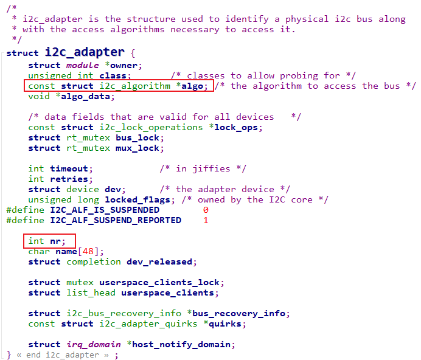
    
	- i2c_algorithm 
		- 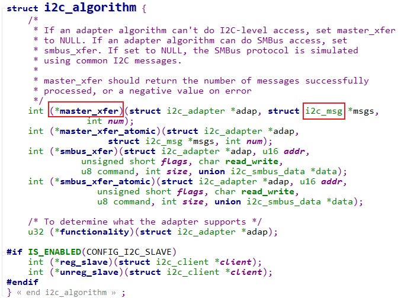
  
- 怎么表示I2C Device
	- 一个I2C Device, 一定有**设备地址**
	- 它连接在哪个`I2C Controller`上, 即对应的`i2c_adapter`是什么
	- 使用`i2c_client`来表示一个`I2C Device `
		- 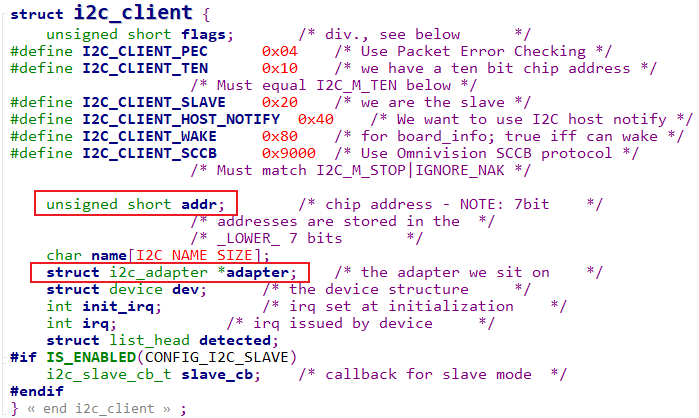
  
- 怎么表示要传输的数据
	- 在上面的i2c_algorithm结构体中可以看到要传输的数据被称为: i2c_msg
	- i2c_msg 
		- 
      
    - i2c_msg中的`flags`用来表示传输方向：bit 0等于I2C_M_RD表示读，bit 0等于0表示写
    - 一个i2c_msg要么是读，要么是写
    
	- 举例：设备地址为0x50的EEPROM，要读取它里面存储地址为0x10的一个字节，应该构造几个i2c_msg？
		- 要构造2个i2c_msg
		- 第一个i2c_msg表示写操作，把要访问的存储地址0x10发给设备
		- 第二个i2c_msg表示读操作
		- 代码如下
```c
	u8 data_addr = 0x10;  
	i8 data;  
	struct i2c_msg msgs[2];  
	
	msgs[0].addr   = 0x50;  
	msgs[0].flags  = 0;  
	msgs[0].len    = 1;  
	msgs[0].buf    = &data_addr;  
	
	msgs[1].addr   = 0x50;  
	msgs[1].flags  = I2C_M_RD;  
	msgs[1].len    = 1;  
	msgs[1].buf    = &data;
```

## 内核里怎么传输数据

使用一句话概括I2C传输：
- APP通过I2C Controller与I2C Device传输数据
- APP通过i2c_adapter与i2c_client传输i2c_msg
- 内核函数`i2c_transfer`
    - i2c_msg里含有addr, 所以这个函数里不需要i2c_client
    - 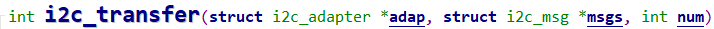

# 无需编写驱动直接访问设备\_I2C-Tools介绍

参考资料：

* Linux驱动程序: `drivers/i2c/i2c-dev.c`
* I2C-Tools-4.2: `https://mirrors.edge.kernel.org/pub/software/utils/i2c-tools/`
* AP3216C：
    * `git clone https://e.coding.net/weidongshan/01_all_series_quickstart.git`
    * 该GIT仓库中的文件《嵌入式Linux应用开发完全手册_韦东山全系列视频文档全集.pdf》
        * 第10.1篇，第十六章 I2C编程

## 1. I2C硬件连接

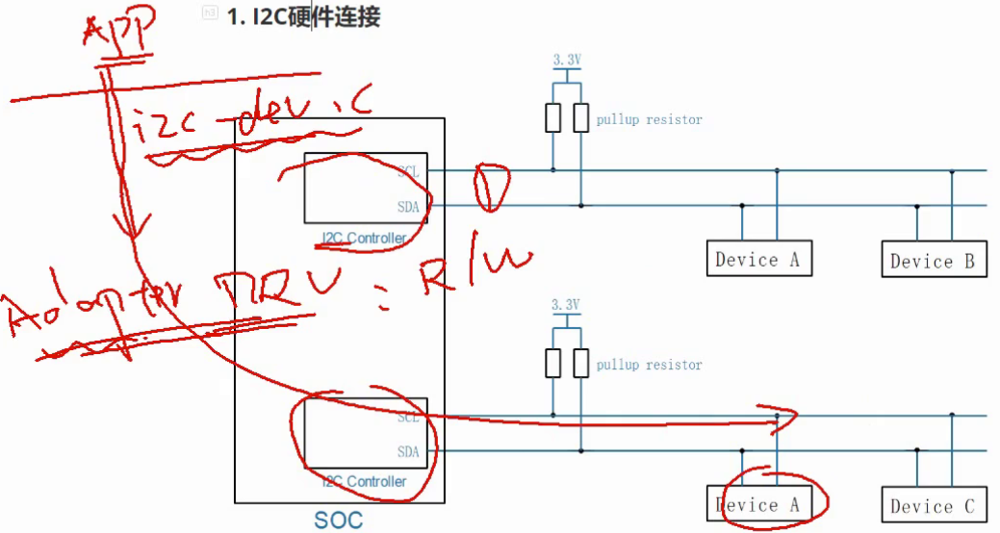

## 2. 无需编写驱动程序即可访问I2C设备

APP访问硬件肯定是需要驱动程序的, 
对于I2C设备, 内核提供了驱动程序`drivers/i2c/i2c-dev.c`, 通过它可以直接使用下面的I2C控制器驱动程序来访问I2C设备.
框架如下:


- i2c-tools是一套好用的工具, 也是一套示例代码. 

## 3. 体验I2C-Tools

使用一句话概括I2C传输：APP通过I2C Controller与I2C Device传输数据。
所以使用I2C-Tools时也需要指定：

* 哪个I2C控制器(或称为I2C BUS、I2C Adapter)
* 哪个I2C设备(设备地址)
* 数据：读还是写、数据本身

### 3.1 交叉编译

* 在Ubuntu设置交叉编译工具链

    * STM32MP157

        ```shell
        export ARCH=arm
        export CROSS_COMPILE=arm-buildroot-linux-gnueabihf-
        export PATH=$PATH:/home/book/100ask_stm32mp157_pro-sdk/ToolChain/arm-buildroot-linux-gnueabihf_sdk-buildroot/bin
        ```

    * IMX6ULL

        ```shell
        export ARCH=arm
        export CROSS_COMPILE=arm-linux-gnueabihf-
        export PATH=$PATH:/home/book/100ask_imx6ull-sdk/ToolChain/gcc-linaro-6.2.1-2016.11-x86_64_arm-linux-gnueabihf/bin
        ```

* 修改I2C-Tools的Makefile指定交叉编译工具链

    ```shell
    CC      ?= gcc
    AR      ?= ar
    STRIP   ?= strip
    改为(指定交叉编译工具链前缀, 去掉问号)：
    CC      = $(CROSS_COMPILE)gcc
    AR      = $(CROSS_COMPILE)ar
    STRIP   = $(CROSS_COMPILE)strip
    ```

    在Makefile中，“?=”在第一次设置变量时才会起效果，如果之前设置过该变量，则不会起效果。

* 执行make即可

    * 执行make时，是动态链接，需要把libi2c.so也放到单板上
    * 想静态链接的话，执行：`make USE_STATIC_LIB=1`

### 3.2 用法

* i2cdetect：I2C检测

    ```shell
    // 列出当前的I2C Adapter(或称为I2C Bus、I2C Controller)
    i2cdetect -l
    
    // 打印某个I2C Adapter的Functionalities, I2CBUS为0、1、2等整数
    i2cdetect -F I2CBUS
    
    // 看看有哪些I2C设备, I2CBUS为0、1、2等整数
    i2cdetect -y -a I2CBUS
    
    // 效果如下
    # i2cdetect -l
    i2c-1   i2c             STM32F7 I2C(0x40013000)                 I2C adapter
    i2c-2   i2c             STM32F7 I2C(0x5c002000)                 I2C adapter
    i2c-0   i2c             STM32F7 I2C(0x40012000)                 I2C adapter
    
    # i2cdetect -F 0
    Functionalities implemented by /dev/i2c-0:
    I2C                              yes
    SMBus Quick Command              yes
    SMBus Send Byte                  yes
    SMBus Receive Byte               yes
    SMBus Write Byte                 yes
    SMBus Read Byte                  yes
    SMBus Write Word                 yes
    SMBus Read Word                  yes
    SMBus Process Call               yes
    SMBus Block Write                yes
    SMBus Block Read                 yes
    SMBus Block Process Call         yes
    SMBus PEC                        yes
    I2C Block Write                  yes
    I2C Block Read                   yes
    
    // --表示没有该地址对应的设备, UU表示有该设备并且它已经有驱动程序,
    // 数值表示有该设备但是没有对应的设备驱动
    # i2cdetect -y -a 0  
         0  1  2  3  4  5  6  7  8  9  a  b  c  d  e  f
    00: 00 -- -- -- -- -- -- -- -- -- -- -- -- -- -- --
    10: -- -- -- -- -- -- -- -- -- -- UU -- -- -- 1e --
    20: -- -- UU -- -- -- -- -- -- -- -- -- -- -- -- --
    30: -- -- -- -- -- -- -- -- -- -- -- -- -- -- -- --
    40: -- -- -- -- -- -- -- -- -- -- -- -- -- -- -- --
    50: -- -- -- -- -- -- -- -- -- -- -- -- -- -- -- --
    60: -- -- -- -- -- -- -- -- -- -- -- -- -- -- -- --
    70: -- -- -- -- -- -- -- -- -- -- -- -- -- -- -- --
    ```

* i2cget：I2C读
    使用说明如下：

    ```shell
    # i2cget
    Usage: i2cget [-f] [-y] [-a] I2CBUS CHIP-ADDRESS [DATA-ADDRESS [MODE]]
      I2CBUS is an integer or an I2C bus name
      ADDRESS is an integer (0x03 - 0x77, or 0x00 - 0x7f if -a is given)
      MODE is one of:
        b (read byte data, default)
        w (read word data)
        c (write byte/read byte)
        Append p for SMBus PEC
    ```

    使用示例：

    ```shell
    // 读一个字节: I2CBUS为0、1、2等整数, 表示I2C Bus; CHIP-ADDRESS表示设备地址
    i2cget -f -y I2CBUS CHIP-ADDRESS
    
    // 读某个地址上的一个字节: 
    //    I2CBUS为0、1、2等整数, 表示I2C Bus
    //    CHIP-ADDRESS表示设备地址
    //    DATA-ADDRESS: 芯片上寄存器地址
    //    MODE：有2个取值, b-使用`SMBus Read Byte`先发出DATA-ADDRESS, 再读一个字节, 中间无P信号
    //                   c-先write byte, 在read byte，中间有P信号 
    i2cget -f -y I2CBUS CHIP-ADDRESS DATA-ADDRESS MODE  
    
    // 读某个地址上的2个字节: 
    //    I2CBUS为0、1、2等整数, 表示I2C Bus
    //    CHIP-ADDRESS表示设备地址
    //    DATA-ADDRESS: 芯片上寄存器地址
    //    MODE：w-表示先发出DATA-ADDRESS，再读2个字节
    i2cget -f -y I2CBUS CHIP-ADDRESS DATA-ADDRESS MODE  
    ```

* i2cset：I2C写
    使用说明如下：

    ```shell
    # i2cset
    Usage: i2cset [-f] [-y] [-m MASK] [-r] [-a] I2CBUS CHIP-ADDRESS DATA-ADDRESS [VALUE] ... [MODE]
      I2CBUS is an integer or an I2C bus name
      ADDRESS is an integer (0x03 - 0x77, or 0x00 - 0x7f if -a is given)
      MODE is one of:
        c (byte, no value)
        b (byte data, default)
        w (word data)
      i (I2C block data)
        s (SMBus block data)
        Append p for SMBus PEC
    ```

    使用示例：

```shell
  // 写一个字节: I2CBUS为0、1、2等整数, 表示I2C Bus; CHIP-ADDRESS表示设备地址
  //           DATA-ADDRESS就是要写的数据
  i2cset -f -y I2CBUS CHIP-ADDRESS DATA-ADDRESS
  
  // 给address写1个字节(address, value):
  //           I2CBUS为0、1、2等整数, 表示I2C Bus; CHIP-ADDRESS表示设备地址
  //           DATA-ADDRESS: 8位芯片寄存器地址; 
  //           VALUE: 8位数值
  //           MODE: 可以省略，也可以写为b
  i2cset -f -y I2CBUS CHIP-ADDRESS DATA-ADDRESS VALUE [b]
  
  // 给address写2个字节(address, value):
  //           I2CBUS为0、1、2等整数, 表示I2C Bus; CHIP-ADDRESS表示设备地址
  //           DATA-ADDRESS: 8位芯片寄存器地址; 
  //           VALUE: 16位数值
  //           MODE: w
  i2cset -f -y I2CBUS CHIP-ADDRESS DATA-ADDRESS VALUE w
  
  // SMBus Block Write：给address写N个字节的数据
  //   发送的数据有：address, N, value1, value2, ..., valueN
  //   跟`I2C Block Write`相比, 需要发送长度N
  //           I2CBUS为0、1、2等整数, 表示I2C Bus; CHIP-ADDRESS表示设备地址
  //           DATA-ADDRESS: 8位芯片寄存器地址; 
  //           VALUE1~N: N个8位数值
  //           MODE: s
  i2cset -f -y I2CBUS CHIP-ADDRESS DATA-ADDRESS VALUE1 ... VALUEN s
  
  // I2C Block Write：给address写N个字节的数据
  //   发送的数据有：address, value1, value2, ..., valueN
  //   跟`SMBus Block Write`相比, 不需要发送长度N
  //           I2CBUS为0、1、2等整数, 表示I2C Bus; CHIP-ADDRESS表示设备地址
  //           DATA-ADDRESS: 8位芯片寄存器地址; 
  //           VALUE1~N: N个8位数值
  //           MODE: i
  i2cset -f -y I2CBUS CHIP-ADDRESS DATA-ADDRESS VALUE1 ... VALUEN i
```

* i2ctransfer：I2C传输(不是基于SMBus)
    使用说明如下：

    ```shell
    # i2ctransfer
    Usage: i2ctransfer [-f] [-y] [-v] [-V] [-a] I2CBUS DESC [DATA] [DESC [DATA]]...
      I2CBUS is an integer or an I2C bus name
      DESC describes the transfer in the form: {r|w}LENGTH[@address]
        1) read/write-flag 2) LENGTH (range 0-65535) 3) I2C address (use last one if omitted)
      DATA are LENGTH bytes for a write message. They can be shortened by a suffix:
        = (keep value constant until LENGTH)
        + (increase value by 1 until LENGTH)
        - (decrease value by 1 until LENGTH)
        p (use pseudo random generator until LENGTH with value as seed)
    
    Example (bus 0, read 8 byte at offset 0x64 from EEPROM at 0x50):
      # i2ctransfer 0 w1@0x50 0x64 r8
    Example (same EEPROM, at offset 0x42 write 0xff 0xfe ... 0xf0):
      # i2ctransfer 0 w17@0x50 0x42 0xff-
    ```

    使用举例：

    ```shell
    // Example (bus 0, read 8 byte at offset 0x64 from EEPROM at 0x50):
    # i2ctransfer -f -y 0 w1@0x50 0x64 r8
    
    // Example (bus 0, write 3 byte at offset 0x64 from EEPROM at 0x50):
    # i2ctransfer -f -y 0 w9@0x50 0x64 val1 val2 val3
    
    // Example 
    // first: (bus 0, write 3 byte at offset 0x64 from EEPROM at 0x50)
    // and then: (bus 0, read 3 byte at offset 0x64 from EEPROM at 0x50)
    # i2ctransfer -f -y 0 w9@0x50 0x64 val1 val2 val3 r3@0x50  
    # i2ctransfer -f -y 0 w9@0x50 0x64 val1 val2 val3 r3 //如果设备地址不变,后面的设备地址可省略
    ```

### 3.3 使用I2C-Tools操作传感器AP3216C

百问网的开发板上有光感芯片AP3216C：


AP3216C是红外、光强、距离三合一的传感器，以读出光强、距离值为例，步骤如下：

* 复位：往寄存器0写入0x4
* 使能：往寄存器0写入0x3
* 读光强：读寄存器0xC、0xD得到2字节的光强
* 读距离：读寄存器0xE、0xF得到2字节的距离值

AP3216C的设备地址是0x1E，假设节在I2C BUS0上，操作命令如下：

* 使用SMBus协议

```shell
i2cset -f -y 0 0x1e 0 0x4
i2cset -f -y 0 0x1e 0 0x3
i2cget -f -y 0 0x1e 0xc w
i2cget -f -y 0 0x1e 0xe w
```

* 使用I2C协议

```shell
i2ctransfer -f -y 0 w2@0x1e 0 0x4
i2ctransfer -f -y 0 w2@0x1e 0 0x3
i2ctransfer -f -y 0 w1@0x1e 0xc r2
i2ctransfer -f -y 0 w1@0x1e 0xe r2
```

## 4. I2C-Tools的访问I2C设备的2种方式

I2C-Tools可以通过SMBus来访问I2C设备，也可以使用一般的I2C协议来访问I2C设备。
使用一句话概括I2C传输：APP通过I2C Controller与I2C Device传输数据。
在APP里，有这几个问题：

* 怎么指定I2C控制器？
    * i2c-dev.c提供为每个I2C控制器(I2C Bus、I2C Adapter)都生成一个设备节点：/dev/i2c-0、/dev/i2c-1等待
    * open某个/dev/i2c-X节点，就是去访问该I2C控制器下的设备
* 怎么指定I2C设备？
    * 通过ioctl指定I2C设备的地址
    * ioctl(file,  I2C_SLAVE, address)
        * 如果该设备已经有了对应的设备驱动程序，则返回失败
    * ioctl(file,  I2C_SLAVE_FORCE, address)
        * 如果该设备已经有了对应的设备驱动程序
        * 但是还是想通过i2c-dev驱动来访问它
        * 则使用这个ioctl来指定I2C设备地址
* 怎么传输数据？
    * 两种方式
    * 一般的I2C方式：ioctl(file, I2C_RDWR, &rdwr)
    * SMBus方式：ioctl(file, I2C_SMBUS, &args)

## 5. 源码分析

### 5.1 使用I2C方式

示例代码：i2ctransfer.c


### 5.2 使用SMBus方式

示例代码：i2cget.c、i2cset.c


# 编写APP直接访问EEPROM

参考资料：

* Linux驱动程序: `drivers/i2c/i2c-dev.c`
* I2C-Tools-4.2: `https://mirrors.edge.kernel.org/pub/software/utils/i2c-tools/`
* AT24cxx.pdf

本节源码：GIT仓库中

* `doc_and_source_for_drivers\IMX6ULL\source\04_I2C\01_at24c02_test`
* `doc_and_source_for_drivers\STM32MP157\source\A7\04_I2C\01_at24c02_test`

## 1. 硬件连接


## 2. AT24C02访问方法

### 2.1 设备地址

从芯片手册上可以知道，AT24C02的设备地址跟它的A2、A1、A0引脚有关：


打开I2C模块的原理图(这2个文件是一样的)：

* `STM32MP157\开发板配套资料\原理图\04_Extend_modules(外设模块)\eeprom.zip\i2c_eeprom_module_v1.0.pdf`

* `IMX6ULL\开发板配套资料\原理图\Extend_modules\eeprom.zip\i2c_eeprom_module_v1.0.pdf`

* 如下：

    * 

    - 从原理图可知，A2A1A0都是0，所以AT24C02的设备地址是：0b1010000，即0x50。

### 2.2 写数据

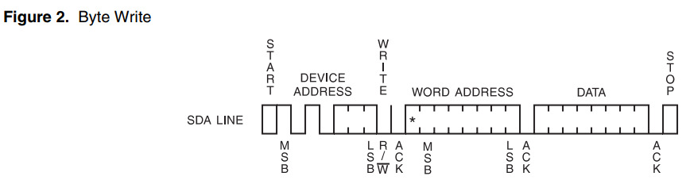


### 2.3 读数据

可以读1个字节，也可以连续读出多个字节。
连续读多个字节时，芯片内部的地址会自动累加。
当地址到达存储空间最后一个地址时，会从0开始。

- 
- 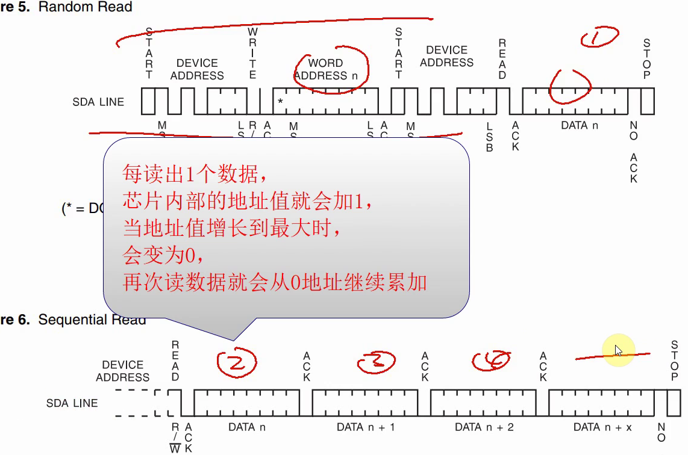

## 3. 使用I2C-Tools的函数编程

## 4. 编译

### 4.1 在Ubuntu设置交叉编译工具链

* STM32MP157

    ```shell
    export ARCH=arm
    export CROSS_COMPILE=arm-buildroot-linux-gnueabihf-
    export PATH=$PATH:/home/book/100ask_stm32mp157_pro-sdk/ToolChain/arm-buildroot-linux-gnueabihf_sdk-buildroot/bin
    ```

* IMX6ULL

    ```shell
    export ARCH=arm
    export CROSS_COMPILE=arm-linux-gnueabihf-
    export PATH=$PATH:/home/book/100ask_imx6ull-sdk/ToolChain/gcc-linaro-6.2.1-2016.11-x86_64_arm-linux-gnueabihf/bin
    ```

### 4.2 使用I2C-Tools的源码

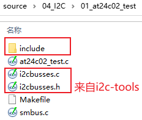


### 4.3 编译

为IMX6ULL编译时，有如下错误：


这是因为IMX6ULL的工具链自带的include目录中，没有smbus.h。

需要我们自己提供这个头文件，解决方法：

- 提供头文件：
    - 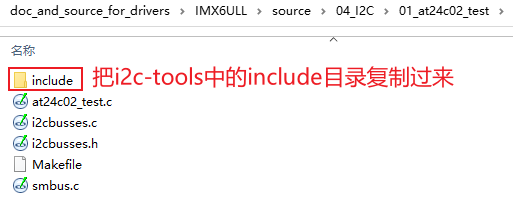
- 修改Makefile指定头文件目录

```makefile
all:
	$(CROSS_COMPILE)gcc -I ./include -o at24c02_test at24c02_test.c i2cbusses.c smbus.c
```

## 5 上机测试

**以下命令在开发板中执行。**

* 挂载NFS

    * vmware使用NAT(假设windowsIP为192.168.1.100)

        ```shell
        [root@100ask:~]# mount -t nfs -o nolock,vers=3,port=2049,mountport=9999 
        192.168.1.100:/home/book/nfs_rootfs /mnt
        ```

    * vmware使用桥接，或者不使用vmware而是直接使用服务器：假设Ubuntu IP为192.168.1.137

        ```shell
        [root@100ask:~]#  mount -t nfs -o nolock,vers=3 192.168.1.137:/home/book/nfs_rootfs /mnt
        ```

* 复制、执行程序

    ```shell
    [root@100ask:~]# cp /mnt/at24c02_test   /bin
    [root@100ask:~]# at24c02_test 0 w www.100ask.net
    [root@100ask:~]# at24c02_test 0 r
    get data: www.100ask.net
    ```


# 通用驱动i2c-dev分析

参考资料：

* Linux驱动程序: `drivers/i2c/i2c-dev.c`
* I2C-Tools-4.2: `https://mirrors.edge.kernel.org/pub/software/utils/i2c-tools/`
* AT24cxx.pdf

三个问题:

- 使用哪个i2c控制器传输数据.
- 跟哪个i2c设备传数据
- 传什么内容

## 1. 回顾字符设备驱动程序


怎么编写字符设备驱动程序？

* 确定主设备号
* 创建file_operations结构体
    * 在里面填充drv_open/drv_read/drv_ioctl等函数
* 注册file_operations结构体
    * register_chrdev(major, &fops, name)
* 谁调用register_chrdev？在入口函数调用
* 有入口自然就有出口
    * 在出口函数unregister_chrdev
* 辅助函数(帮助系统自动创建设备节点)
    * class_create
    * device_create

## 2. i2c-dev.c注册过程分析

### 2.1 register_chrdev的内部实现


### 2.2 i2c-dev驱动的注册过程

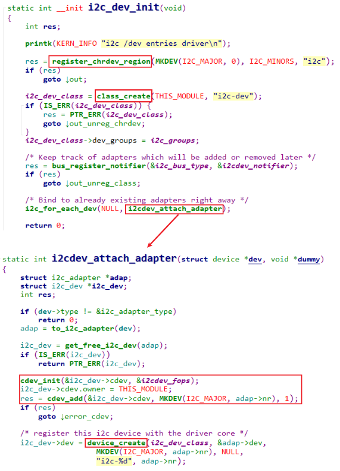

## 3. file_operations函数分析

i2c-dev.c的核心：

```c
static const struct file_operations i2cdev_fops = {
	.owner		= THIS_MODULE,
	.llseek		= no_llseek,
	.read		= i2cdev_read,
	.write		= i2cdev_write,
	.unlocked_ioctl	= i2cdev_ioctl,
	.compat_ioctl	= compat_i2cdev_ioctl,
	.open		= i2cdev_open,
	.release	= i2cdev_release,
};
```

主要的系统调用：open, ioctl：


要理解这些接口，记住一句话：APP通过I2C Controller与I2C Device传输数据。

### 3.1 i2cdev_open


### 3.2 i2cdev_ioctl: I2C_SLAVE/I2C_SLAVE_FORCE


### 3.3 i2cdev_ioctl: I2C_RDWR

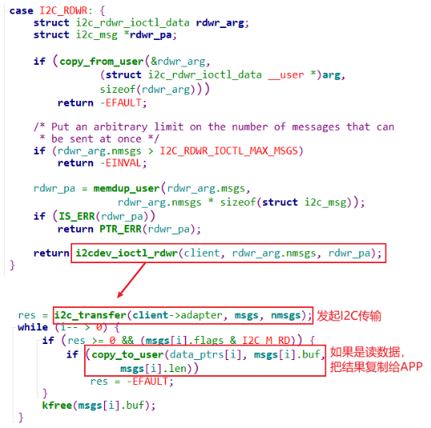

### 3.4 i2cdev_ioctl: I2C_SMBUS


### 3.5 总结

