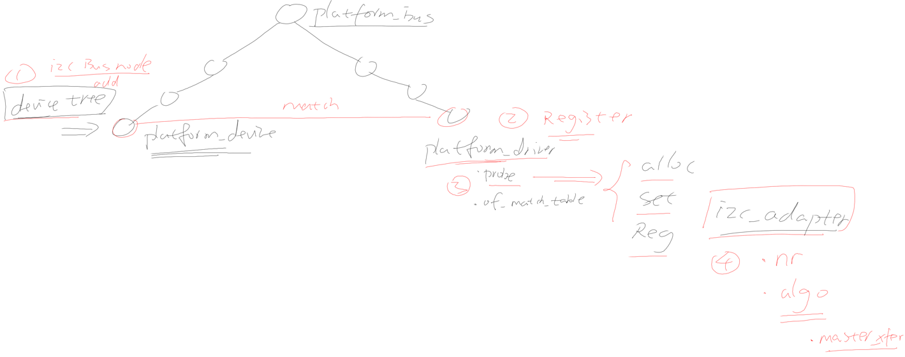
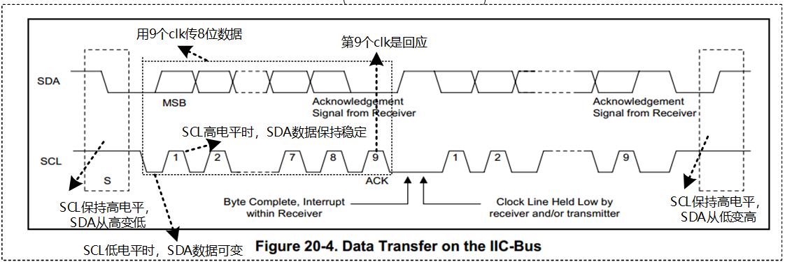
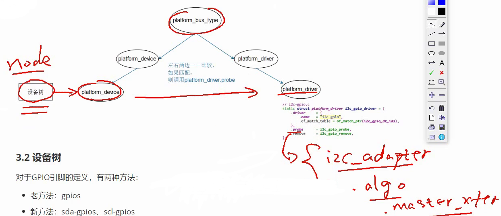
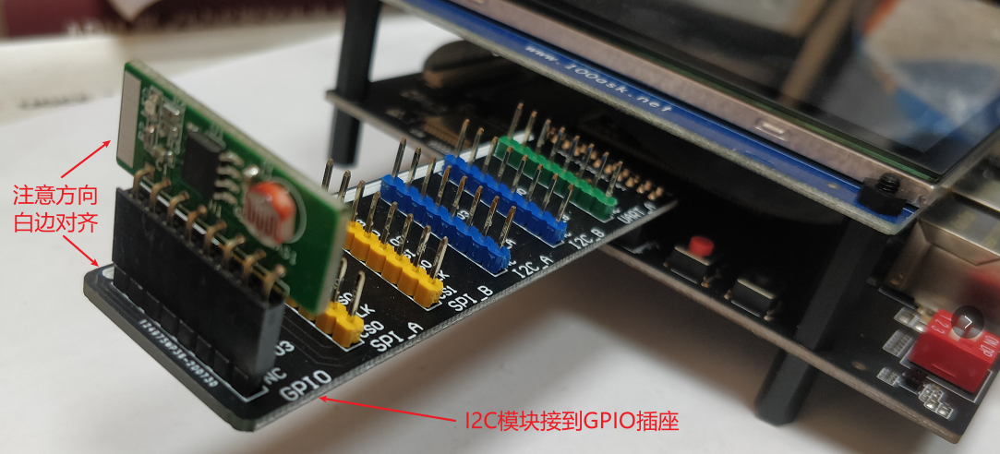
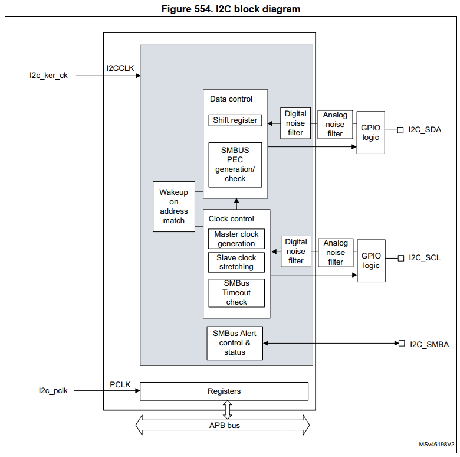
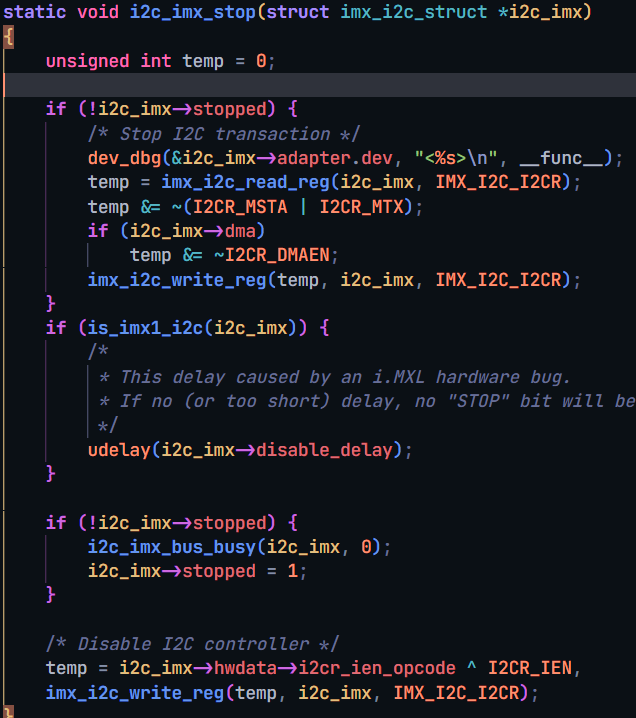
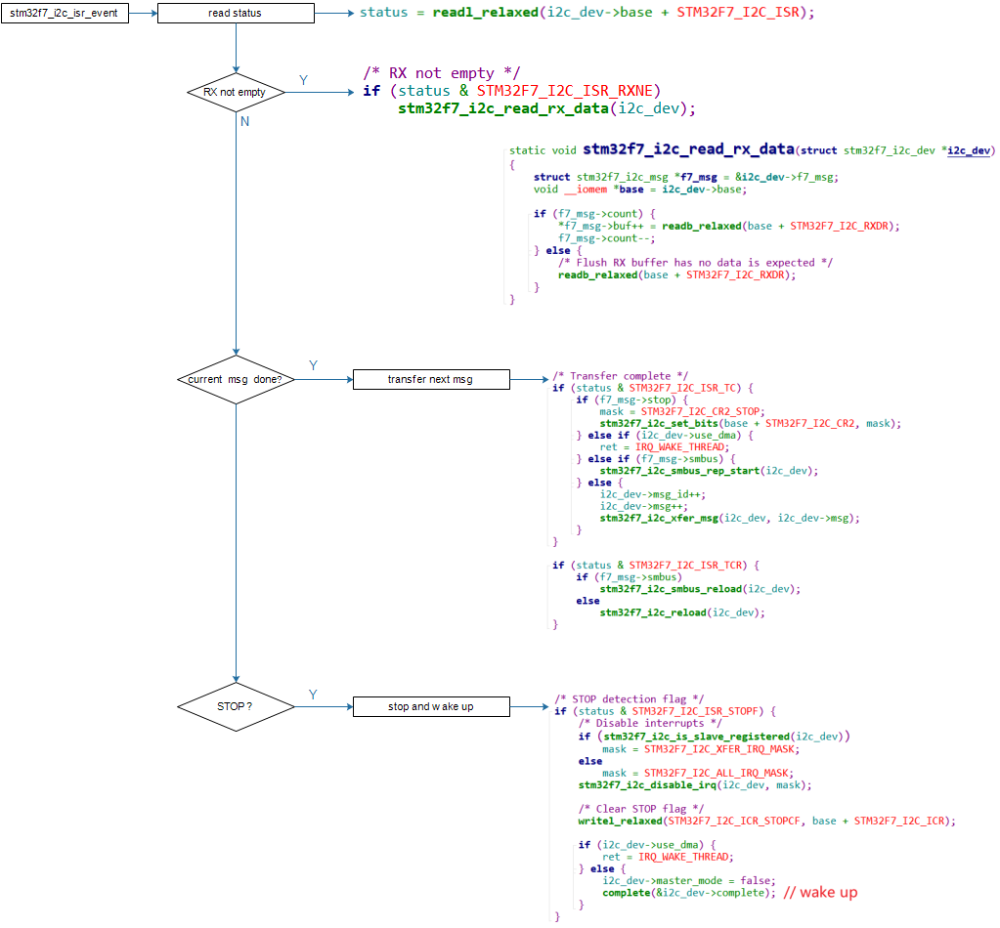

# I2C系统驱动程序模型

参考资料：

* Linux内核文档:
    * `Documentation\i2c\instantiating-devices.rst`
    * `Documentation\i2c\writing-clients.rst`
* Linux内核驱动程序示例:
    * `drivers/eeprom/at24.c`

回顾一下 platform_bus, device_tree 由内核解析. 每当有新的platform_device 加入链表, 就会经过match函数, 去跟platform_driver链表里的驱动程序逐一匹配. 匹配了就停, 匹配不到就没有对应的驱动. 反之, 有新的platform_driver驱动程序入链, 也会去和还没匹配到驱动程序的platform_device去比较, 看是否匹配.

## 1. I2C驱动程序的层次


I2C Core就是I2C核心层，它的作用：

* 提供统一的访问函数，比如i2c_transfer、i2c_smbus_xfer等
* 实现`I2C总线-设备-驱动模型`，管理：I2C设备(i2c_client)、I2C设备驱动(i2c_driver)、I2C控制器(i2c_adapter)

## 2. I2C总线-设备-驱动模型

- 之前说的平台总线是虚拟总线, 而I2C总线是真实的总线.

- 
- 跟平台总线类似, 匹配过程由.match 的函数来完成. 匹配成功, 就会去调用对应i2c_diver里的.probe_new函数.
- 注册了一个新的i2c_diver, i2c_bus_type就会拿它跟 i2c_client链表里的成员配对. 由于一个diver可以支持多个client, 所以匹配成功了, 也会继续比较链表里的下一个client. 直到取完为止.

### 2.1 i2c_driver

i2c_driver表明能支持哪些设备：

* 使用of_match_table来判断
    * 设备树中, 某个I2C控制器节点下可以创建I2C设备的节点
        * 如果`I2C设备节点的compatible属性`跟`of_match_table`的某项兼容, 则匹配成功
    * `i2c_client.name`跟某个`of_match_table[i].compatible`值相同，则匹配成功
* 使用id_table来判断
    * `i2c_client.name`跟某个`id_table[i].name`值相同, 则匹配成功

- i2c_driver跟i2c_client匹配成功后，就调用i2c_driver.probe函数

    - 
    - of_match_table 中的of 就是 open firmware 就是设备树的意思. 这个表, 用来跟设备树生成的i2c_client对象进行比较.
- **i2c_device_match**函数 (linux5.4 kernel 与4.9.88内核有不同)
    - 
    - 取出of_match_table 跟client进行比较
    - 
        - of_match_device函数, 是对比来自设备树的i2c_client
            - 如果这个i2c_client 没有of_node 就说明, 它不是从设备树经内核转来的, return NULL.
            - 
            - 设备树里的 i2c_client 长这样子:
            - 
            - of_match_table里有这条
                - 
    - **i2c_match_id** 函数
        - 
        - 参数都不为空时, 逐个比对, 找到了就return.
    

### 2.2 i2c_client

i2c_client表示一个I2C设备, 它的来源有多种, 创建i2c_client的方法有4种(从内核文档总结):

* 方法1

    * 通过I2C bus number来创建

        * 指定使用busnum i2c控制器来注册单板信息. 在这个i2c控制器上, 根据单板信息, 来生成多少个i2c_client

        ```c
        int i2c_register_board_info(int busnum, struct i2c_board_info const *info, unsigned len);
        ```

    * 通过设备树来创建

        ```shell
        	i2c1: i2c@400a0000 {
        		/* ... master properties skipped ... */
        		clock-frequency = <100000>;
        
        		flash@50 {
        			compatible = "atmel,24c256";
        			reg = <0x50>;
        		};
        
        		pca9532: gpio@60 {
        			compatible = "nxp,pca9532";
        			gpio-controller;
        			#gpio-cells = <2>;
        			reg = <0x60>;
        		};
        	};
        ```

* 方法2
    有时候无法知道该设备挂载哪个I2C bus下, 无法知道它对应的I2C bus number.
    但是可以通过其他方法知道对应的i2c_adapter结构体.
    可以使用下面两个函数来创建i2c_client:

    * i2c_new_device

        ```c
          static struct i2c_board_info sfe4001_hwmon_info = {
        	I2C_BOARD_INFO("max6647", 0x4e),
          };
        
          int sfe4001_init(struct efx_nic *efx)
          {
        	(...)
        	efx->board_info.hwmon_client =
        		i2c_new_device(&efx->i2c_adap, &sfe4001_hwmon_info);
        
        	(...)
          }
        ```

    * i2c_new_probed_device

        ```c
          static const unsigned short normal_i2c[] = { 0x2c, 0x2d, I2C_CLIENT_END };
        
          static int usb_hcd_nxp_probe(struct platform_device *pdev)
          {
        	(...)
        	struct i2c_adapter *i2c_adap;
        	struct i2c_board_info i2c_info;
        
        	(...)
        	i2c_adap = i2c_get_adapter(2);
        	memset(&i2c_info, 0, sizeof(struct i2c_board_info));
        	strscpy(i2c_info.type, "isp1301_nxp", sizeof(i2c_info.type));
        	isp1301_i2c_client = i2c_new_probed_device(i2c_adap, &i2c_info,
        						   normal_i2c, NULL);
        	i2c_put_adapter(i2c_adap);
        	(...)
          }
        ```

    * 差别：
        * i2c_new_device: 会创建i2c_client, 即使该设备并不存在
        * i2c_new_probed_device:
            * 它成功的话, 会创建i2c_client, 并且表示这个`设备肯定存在`
            * I2C设备的地址可能发生变化, 比如AT24C02的引脚A2A1A0电平不一样时, 设备地址就不一样
            * 可以罗列出可能的地址
            * i2c_new_probed_device使用这些地址判断设备是否存在

* 方法3(不推荐): 由i2c_driver.detect函数来判断是否有对应的I2C设备并生成i2c_client

* 方法4: 通过用户空间(user-space)生成

    - 调试时, 或者不方便通过代码明确地生成i2c_client时, 可以通过用户空间来生成.

```c
  // 创建一个i2c_client, .name = "eeprom", .addr=0x50, .adapter是i2c-3
  # echo eeprom 0x50 > /sys/bus/i2c/devices/i2c-3/new_device
  
  // 删除一个i2c_client
  # echo 0x50 > /sys/bus/i2c/devices/i2c-3/delete_device
```

# 编写设备驱动之i2c_driver

参考资料：

* Linux内核文档:
    * `Documentation\i2c\instantiating-devices.rst`
    * `Documentation\i2c\writing-clients.rst`
* Linux内核驱动程序示例:
    * `drivers/eeprom/at24.c`
* 本节代码：GIT仓库中
    * 框架：
        * `IMX6ULL\source\04_I2C\02_i2c_driver_example`
        * `STM32MP157\source\A7\04_I2C\02_i2c_driver_example`
    * AP3216C
        * `IMX6ULL\source\04_I2C\03_ap3216c`
        * `STM32MP157\source\A7\04_I2C\03_ap3216c`

## 1. 套路

### 1.1 I2C总线-设备-驱动模型


### 1.2 示例

分配, 设置, 注册一个i2c_driver结构体 类似`drivers/eeprom/at24.c`:

- 
    - 在`probe_new`函数中, 分配, 设置, 注册`file_operations`结构体.
    - 在`file_operations`的函数中, 使用`i2c_transfer`等函数发起I2C传输.

## 2. 编写i2c_driver

### 2.1 先写一个框架

### 2.2 在为AP3216C编写代码

百问网的6ULL开发板上有光感芯片AP3216C：

AP3216C是红外, 光强, 距离三合一的传感器, 以读出光强, 距离值为例, 步骤如下:

* 复位: 往寄存器0写入0x4
* 使能: 往寄存器0写入0x3
* 读红外: 读寄存器0xA,0xB得到2字节的红外数据
* 读光强: 读寄存器0xC,0xD得到2字节的光强
* 读距离: 读寄存器0xE,0xF得到2字节的距离值

AP3216C的设备地址是0x1E.

### 3. 构造i2c_client

下一节.

# 编写设备驱动之i2c_client

参考资料：

* Linux内核文档:
    * `Documentation\i2c\instantiating-devices.rst`
    * `Documentation\i2c\writing-clients.rst`

* Linux内核驱动程序示例:

    * `drivers/eeprom/at24.c`

* 本节代码：GIT仓库中

    * `IMX6ULL\source\04_I2C\03_ap3216c_ok`

    * `STM32MP157\source\A7\04_I2C\03_ap3216c_ok`

## 1. I2C总线-设备-驱动模型

## 2. 编译i2c_driver

## 3. 编写测试程序

**注意**：对于STM32MP157，编译内核/驱动、编译APP的工具链不一样

## 4. 多种方法生成i2c_client并测试

### 4.1 在用户态生成

示例：

```shell
// 在I2C BUS0下创建i2c_client
# echo ap3216c 0x1e > /sys/bus/i2c/devices/i2c-0/new_device

// 删除i2c_client
# echo 0x1e > /sys/bus/i2c/devices/i2c-0/delete_device
```

### 4.2 编写代码

* i2c_new_device (会创建i2c_client, 即使该设备并不存在):

```c
static struct i2c_client* client;

static int __init i2c_client_ap3216c_init(void)
{
    struct i2c_adapter*          adapter;
    static struct i2c_board_info board_info = {
        I2C_BOARD_INFO("ap3216c", 0x1e),
    };
    adapter = i2c_get_adapter(0);/*获取nr 这个i2c控制器*/
    client  = i2c_new_device(adapter, &board_info);/*用的哪个i2c控制器,设备信息*/
    if (!client)
        printk("i2c_new_device error\n");
    return 0;
}

```

* i2c_new_probed_device

```c
static struct i2c_client *ap3216c_client;
/* Addresses to scan */
static const unsigned short normal_i2c[] = {
	0x1e, I2C_CLIENT_END
};
static int __init i2c_client_ap3216c_init(void)
{
	struct i2c_adapter *adapter;
	struct i2c_board_info board_info;
	memset(&board_info, 0, sizeof(struct i2c_board_info));
	strscpy(board_info.type, "ap3216c", sizeof(board_info.type));
	
	printk("%s %s %d\n", __FILE__, __FUNCTION__, __LINE__);
	/* register I2C device */
	adapter = i2c_get_adapter(0);
	ap3216c_client = i2c_new_probed_device(adapter, &board_info,
						   normal_i2c, NULL);
	i2c_put_adapter(adapter);
	return 0;
}
```

* i2c_register_board_info
    * 内核没有`EXPORT_SYMBOL(i2c_register_board_info)`
    * 使用这个函数的驱动必须编进内核里去

### 4.3 使用设备树生成

在某个I2C控制器的节点下，添加如下代码：

```shell
		ap3216c@1e {
			compatible = "lite-on,ap3216c";
			reg = <0x1e>;
		};
```

**IMX6ULL**

  * 修改`arch/arm/boot/dts/100ask_imx6ull-14x14.dts`，添加如下代码：

    ```shell
    &i2c1 {
    		ap3216c@1e { 
    			compatible = "lite-on,ap3216c";
    			reg = <0x1e>;
    		};
    };
    ```

    - **注意**：设备树里i2c1就是I2C BUS0.

    - ap3216c@1e 中ap3216c表示名字.
    - compatible: 用来选择匹配的i2c_driver
    - reg: 表示i2c设备地址

  * 编译设备树：
    在Ubuntu的IMX6ULL内核目录下执行如下命令,
    得到设备树文件：`arch/arm/boot/dts/100ask_imx6ull-14x14.dtb`

    ```shell
    make dtbs
    ```

  * 复制到NFS目录：

    ```shell
    $ cp arch/arm/boot/dts/100ask_imx6ull-14x14.dtb ~/nfs_rootfs/
    ```

  * 更新设备树

    ```shell
    [root@100ask:~]# cp /mnt/100ask_imx6ull-14x14.dtb /boot
    [root@100ask:~]# sync
    ```

* 重启开发板

### 4.4 上机测试

**以下命令在开发板中执行。**

* 挂载NFS

    * vmware使用NAT(假设windowsIP为192.168.1.100)

        ```shell
        [root@100ask:~]# mount -t nfs -o nolock,vers=3,port=2049,mountport=9999 
        192.168.1.100:/home/book/nfs_rootfs /mnt
        ```

    * vmware使用桥接，或者不使用vmware而是直接使用服务器：假设Ubuntu IP为192.168.1.137

        ```shell
        [root@100ask:~]#  mount -t nfs -o nolock,vers=3 192.168.1.137:/home/book/nfs_rootfs /mnt
        ```

* 复制、执行程序

    看视频。

    * 先安装i2c_driver驱动

        ```shell
        // 对于IMX6ULL，想看到驱动打印信息，需要先执行
        echo "7 4 1 7" > /proc/sys/kernel/printk
        
        insmod /mnt/ap3216c_drv.ko
        ```

    * 在生成i2c_client
        有3种方法，前面介绍了：用户态生成、安装ap3216c_client驱动、使用设备树

    * 执行测试程序

        ```shell
        [root@100ask:~]# /mnt/ap3216c_drv_test
        APP read : 01 00 00 00 8f bf
        ```

        

# I2C\_Adapter驱动框架讲解与编写

参考资料：

* Linux内核文档:
    * `Linux-4.9.88\Documentation\devicetree\bindings\i2c\i2c-gpio.txt`
    * `Linux-5.4\Documentation\devicetree\bindings\i2c\i2c-gpio.yaml`

* Linux内核驱动程序：使用GPIO模拟I2C

    * `Linux-4.9.88\drivers\i2c\busses\i2c-gpio.c`
    * `Linux-5.4\drivers\i2c\busses\i2c-gpio.c`

* Linux内核真正的I2C控制器驱动程序

    * IMX6ULL: `Linux-4.9.88\drivers\i2c\busses\i2c-imx.c`
    * STM32MP157: `Linux-5.4\drivers\i2c\busses\i2c-stm32f7.c`
* 本节视频的代码在GIT仓库里
    * IMX6ULL：`doc_and_source_for_drivers\IMX6ULL\source\04_I2C\05_i2c_adapter_framework`
    * STM32MP157：`doc_and_source_for_drivers\STM32MP157\source\A7\04_I2C\05_i2c_adapter_framework`

## 1. 回顾

### 1.1 2C驱动程序的层次


### 1.2 I2C总线-设备-驱动模型

## 2. I2C_Adapter驱动框架

### 2.1 核心的结构体

- i2c_adapter
    - 
- i2c_algorithm 
    - 

* master_xfer: 这是最重要的函数, 它实现了一般的I2C传输, 用来传输一个或多个i2c_msg

* master_xfer_atomic: 

    * 可选的函数, 功能跟master_xfer一样, 在`atomic context`环境下使用
    * 比如在关机之前, 所有中断都关闭的情况下, 用来访问电源管理芯片

* smbus_xfer: 实现SMBus传输, 如果不提供这个函数, SMBus传输会使用master_xfer来模拟

* smbus_xfer_atomic:

    * 可选的函数, 功能跟smbus_xfer一样, 在`atomic context`环境下使用
    * 比如在关机之前, 所有中断都关闭的情况下, 用来访问电源管理芯片
    * functionality: 返回所支持的flags: 各类I2C_FUNC_*, 比如是否支持10位地址, 是否支持smbus中的quick命令. 

* reg_slave/unreg_slave：

    * 有些I2C Adapter也可工作与Slave模式，用来实现或模拟一个I2C设备
* reg_slave就是让把一个i2c_client注册到I2C Adapter，换句话说就是让这个I2C Adapter模拟该i2c_client
    * unreg_slave：反注册

### 2.2 驱动程序框架

分配, 设置, 注册一个i2c_adpater结构体：

* i2c_adpater的核心是i2c_algorithm
* i2c_algorithm的核心是master_xfer函数

1. **所涉及的函数**

* 分配

    ```c
    struct i2c_adpater *adap = kzalloc(sizeof(struct i2c_adpater), GFP_KERNEL);
    ```

* 设置

    ```c
    adap->owner = THIS_MODULE;
    adap->algo = &stm32f7_i2c_algo;
    ```

* 注册：i2c_add_adapter/i2c_add_numbered_adapter

    ```c
    ret = i2c_add_adapter(adap);          // 不管adap->nr原来是什么，都动态设置adap->nr
    ret = i2c_add_numbered_adapter(adap); // 如果adap->nr == -1 则动态分配nr; 否则使用该nr   
    ```

* 反注册

    ```c
    i2c_del_adapter(adap);
    ```

2. **i2c_algorithm示例**

- Linux-5.4中使用GPIO模拟I2C
    - 
- Linux-5.4中STM32F157的I2C驱动
    - 
- Linux-4.9.88中IMX6ULL的I2C驱动
    - 

## 3. 编写一个框架程序



### 3.1 设备树

在设备树里根节点下构造I2C Bus子节点:

```shell
	i2c-bus-virtual {
		 compatible = "100ask,i2c-bus-virtual";
	};
```

### 3.2 platform_driver

分配, 设置, 注册platform_driver结构体.

核心是probe函数, 它要做这几件事:

* 根据设备树信息设置硬件(引脚, 时钟等)
* probe里分配, 设置, 注册i2c_apdater

### 3.3 i2c_apdater

i2c_apdater核心是master_xfer函数, 它的实现取决于硬件, 大概代码如下:

```c
static int xxx_master_xfer(struct i2c_adapter *adapter,
						struct i2c_msg *msgs, int num)
{
    for (i = 0; i < num; i++) {
        struct i2c_msg *msg = msgs[i];
        {
        	// 1. 发出S信号: 设置寄存器发出S信号
            CTLREG = S;     
            // 2. 根据Flag发出设备地址和R/W位: 把这8位数据写入某个DATAREG即可发出信号
            //    判断是否有ACK
            if (!ACK)
                return ERROR;
            else {
	            // 3. read / write
	            if (read) {
                    STATUS = XXX; // 这决定读到一个数据后是否发出ACK给对方
                    val = DATAREG; // 这会发起I2C读操作
                } else if(write) {
                    DATAREG = val; // 这会发起I2C写操作
                    val = STATUS;  // 判断是否收到ACK
                    if (!ACK)
                        return ERROR;
                }                
            }
            // 4. 发出P信号
            CTLREG = P;
        }
    }
    return i;
}
```

# 完善虚拟的I2C\_Adapter驱动并模拟EEPROM

参考资料：

* Linux内核文档:
    * `Linux-4.9.88\Documentation\devicetree\bindings\i2c\i2c-gpio.txt`
    * `Linux-5.4\Documentation\devicetree\bindings\i2c\i2c-gpio.yaml`

* Linux内核驱动程序：使用GPIO模拟I2C

    * `Linux-4.9.88\drivers\i2c\busses\i2c-gpio.c`
    * `Linux-5.4\drivers\i2c\busses\i2c-gpio.c`

* Linux内核真正的I2C控制器驱动程序

    * IMX6ULL: `Linux-4.9.88\drivers\i2c\busses\i2c-imx.c`
* STM32MP157: `Linux-5.4\drivers\i2c\busses\i2c-stm32f7.c`
* 本节视频的代码在GIT仓库里
    * IMX6ULL：`doc_and_source_for_drivers\IMX6ULL\source\04_I2C\06_i2c_adapter_virtual_ok`
    * STM32MP157：`doc_and_source_for_drivers\STM32MP157\source\A7\04_I2C\06_i2c_adapter_virtual_ok`

## 1. 实现master_xfer函数

在虚拟的I2C\_Adapter驱动程序里，只要实现了其中的master_xfer函数，这个I2C Adapter就可以使用了。
在master_xfer函数里，我们模拟一个EEPROM，思路如下：

* 分配一个512字节的buffer，表示EEPROM
* 对于slave address为0x50的i2c_msg，解析并处理
    * 对于写：把i2c_msg的数据写入buffer
    * 对于读：从buffer中把数据写入i2c_msg
* 对于slave address为其他值的i2c_msg，返回错误
    * 


## 2. 编程

看代码.

## 3. 上机实验

### 3.1 设置工具链

* IMX6ULL

    ```shell
    export ARCH=arm
    export CROSS_COMPILE=arm-linux-gnueabihf-
    export PATH=$PATH:/home/book/100ask_imx6ull-sdk/ToolChain/gcc-linaro-6.2.1-2016.11-x86_64_arm-linux-gnueabihf/bin
    ```

* STM32MP157
    **注意**：对于STM32MP157，以前说编译内核/驱动、编译APP的工具链不一样，其实编译APP用的工具链也能用来编译内核。

    ```shell
    export ARCH=arm
    export CROSS_COMPILE=arm-buildroot-linux-gnueabihf-
    export PATH=$PATH:/home/book/100ask_stm32mp157_pro-sdk/ToolChain/arm-buildroot-linux-gnueabihf_sdk-buildroot/bin
    ```

### 3.2 编译、替换设备树

在设备树根节点下，添加如下代码：

```shell
	i2c-bus-virtual {
		 compatible = "100ask,i2c-bus-virtual";
	};
```

**IMX6ULL**

  * 修改`arch/arm/boot/dts/100ask_imx6ull-14x14.dts`，添加如下代码：

    ```shell
    / {
    	i2c-bus-virtual {
    		 compatible = "100ask,i2c-bus-virtual";
    	};
    };
    ```

  * 编译设备树：
    在Ubuntu的IMX6ULL内核目录下执行如下命令,
    得到设备树文件：`arch/arm/boot/dts/100ask_imx6ull-14x14.dtb`

    ```shell
    make dtbs
    ```

  * 复制到NFS目录：

    ```shell
    $ cp arch/arm/boot/dts/100ask_imx6ull-14x14.dtb ~/nfs_rootfs/
    ```

* 开发板上挂载NFS文件系统

    * vmware使用NAT(假设windowsIP为192.168.1.100)

        ```shell
        [root@100ask:~]# mount -t nfs -o nolock,vers=3,port=2049,mountport=9999 
        192.168.1.100:/home/book/nfs_rootfs /mnt
        ```

    * vmware使用桥接，或者不使用vmware而是直接使用服务器：假设Ubuntu IP为192.168.1.137

        ```shell
        [root@100ask:~]#  mount -t nfs -o nolock,vers=3 192.168.1.137:/home/book/nfs_rootfs /mnt
        ```

    * 更新设备树

        ```shell
        [root@100ask:~]# cp /mnt/100ask_imx6ull-14x14.dtb /boot
        [root@100ask:~]# sync
        ```

* 重启开发板

### 3.4 编译、安装驱动程序

* 编译：

    * 在Ubuntu上
    * 修改`06_i2c_adapter_virtual_ok`中的Makefile，指定内核路径`KERN_DIR`，在执行`make`命令即可。

* 安装：

    * 在开发板上

    * 挂载NFS, 复制文件, insmod, 类似如下命令:

        ```shell
        mount -t nfs -o nolock,vers=3 192.168.1.137:/home/book/nfs_rootfs /mnt
        // 对于IMX6ULL，想看到驱动打印信息，需要先执行
        echo "7 4 1 7" > /proc/sys/kernel/printk
        
        insmod /mnt/i2c_adapter_drv.ko
        ```


### 3.5 使用i2c-tools测试

在开发板上执行，命令如下：

* 列出I2C总线

    ```shell
    i2cdetect -l
    ```

    结果类似下列的信息：

    ```shell
    i2c-1   i2c             21a4000.i2c                             I2C adapter
    i2c-4   i2c             i2c-bus-virtual                         I2C adapter
    i2c-0   i2c             21a0000.i2c                             I2C adapter
    ```

    **注意**：不同的板子上，i2c-bus-virtual的总线号可能不一样，上问中总线号是4。

    

* 检查虚拟总线下的I2C设备

    ```shell
    // 假设虚拟I2C BUS号为4
    [root@100ask:~]# i2cdetect -y -a 4
         0  1  2  3  4  5  6  7  8  9  a  b  c  d  e  f
    00: -- -- -- -- -- -- -- -- -- -- -- -- -- -- -- --
    10: -- -- -- -- -- -- -- -- -- -- -- -- -- -- -- --
    20: -- -- -- -- -- -- -- -- -- -- -- -- -- -- -- --
    30: -- -- -- -- -- -- -- -- -- -- -- -- -- -- -- --
    40: -- -- -- -- -- -- -- -- -- -- -- -- -- -- -- --
    50: 50 -- -- -- -- -- -- -- -- -- -- -- -- -- -- --
    60: -- -- -- -- -- -- -- -- -- -- -- -- -- -- -- --
    70: -- -- -- -- -- -- -- -- -- -- -- -- -- -- -- --
    ```

* 读写模拟的EEPROM

    ```shell
    // 假设虚拟I2C BUS号为4
    [root@100ask:~]# i2cset -f -y 4 0x50 0 0x55   // 往0地址写入0x55
    [root@100ask:~]# i2cget -f -y 4 0x50 0        // 读0地址
    0x55
    ```

    

# 使用GPIO模拟I2C的驱动程序分析

参考资料：

* i2c_spec.pdf
* Linux文档
    * `Linux-5.4\Documentation\devicetree\bindings\i2c\i2c-gpio.yaml`
    * `Linux-4.9.88\Documentation\devicetree\bindings\i2c\i2c-gpio.txt`
* Linux驱动源码
    * `Linux-5.4\drivers\i2c\busses\i2c-gpio.c`
    * `Linux-4.9.88\drivers\i2c\busses\i2c-gpio.c`

如果芯片里没有I2C控制器或者I2C控制器数量不够用, 那就需要用GPIO来模拟I2C控制器. 用GPIO引脚来发出符合I2C协议的信号即可.

## 1. 回顾I2C协议

### 1.1 硬件连接

I2C在硬件上的接法如下所示，主控芯片引出两条线SCL,SDA线，在一条I2C总线上可以接很多I2C设备，我们还会放一个上拉电阻（放一个上拉电阻的原因以后我们再说）。

- 

### 1.2 I2C信号

I2C协议中数据传输的单位是字节，也就是8位。但是要用到9个时钟：前面8个时钟用来传输8数据，第9个时钟用来传输回应信号。传输时，先传输最高位(MSB)。

* 开始信号（S）：SCL为高电平时，SDA山高电平向低电平跳变，开始传送数据。
* 结束信号（P）：SCL为高电平时，SDA由低电平向高电平跳变，结束传送数据。
* 响应信号(ACK)：接收器在接收到8位数据后，在第9个时钟周期，拉低SDA
* SDA上传输的数据必须在SCL为高电平期间保持稳定，SDA上的数据只能在SCL为低电平期间变化

I2C协议信号如下：

- 

### 1.3 协议细节

* 如何在SDA上实现双向传输？
    主芯片通过一根SDA线既可以把数据发给从设备，也可以从SDA上读取数据，连接SDA线的引脚里面必然有两个引脚（发送引脚/接受引脚）。

* 主、从设备都可以通过SDA发送数据，肯定不能同时发送数据，怎么错开时间？
    在9个时钟里，
    前8个时钟由主设备发送数据的话，第9个时钟就由从设备发送数据；
    前8个时钟由从设备发送数据的话，第9个时钟就由主设备发送数据。
* 双方设备中，某个设备发送数据时，另一方怎样才能不影响SDA上的数据？
    设备的SDA中有一个三极管，使用开极/开漏电路(三极管是开极，CMOS管是开漏，作用一样)，如下图：
    * 
    * 真值表如下：
    * 

从真值表和电路图我们可以知道：

* 当某一个芯片不想影响SDA线时，那就不驱动这个三极管
* 想让SDA输出高电平，双方都不驱动三极管(SDA通过上拉电阻变为高电平)
* 想让SDA输出低电平，就驱动三极管

从下面的例子可以看看数据是怎么传的（实现双向传输）.
举例：主设备发送（8bit）给从设备

* 前8个clk
    * 从设备不要影响SDA，从设备不驱动三极管
    * 主设备决定数据，主设备要发送1时不驱动三极管，要发送0时驱动三极管

* 第9个clk，由从设备决定数据
    * 主设备不驱动三极管
    * 从设备决定数据，要发出回应信号的话，就驱动三极管让SDA变为0
    * 从这里也可以知道ACK信号是低电平

从上面的例子，就可以知道怎样在一条线上实现双向传输，这就是SDA上要使用上拉电阻的原因。

为何SCL也要使用上拉电阻？
在第9个时钟之后，如果有某一方需要更多的时间来处理数据，它可以一直驱动三极管把SCL拉低。
当SCL为低电平时候，大家都不应该使用IIC总线，只有当SCL从低电平变为高电平的时候，IIC总线才能被使用。
当它就绪后，就可以不再驱动三极管，这是上拉电阻把SCL变为高电平，其他设备就可以继续使用I2C总线了。

## 2. 使用GPIO模拟I2C的要点

* 引脚设为`GPIO`
* GPIO设为`输出` 与 `开极/开漏`(open collector/open drain)
* 要有`上拉电阻`

## 3. 驱动程序分析

### 3.1 平台总线设备驱动模型

- 
- 

### 3.2 设备树

对于GPIO引脚的定义, 有两种方法：

* 老方法：gpios
* 新方法：sda-gpios、scl-gpios
* 

- 

### 3.3 驱动程序分析

1. I2C-GPIO驱动层次
    - 
    - i2c-gpio.c 中
    - probe函数里:
        -  **of_i2c_gpio_get_props** 去获得设备树中的属性值
        - 
        - 然后获得sda引脚, 跟scl引脚
        - 
        - 设置时间参数. 如果未提供参数, 会有默认值.
        - 
        - 然后, 根据解析来的属性值, 去设置i2c_adapter结构体的值. 并注册adapter.
        - 
        - **i2c_bit_add_numbered_bus** (i2c-algo-bit.c):
        - 
        - **__i2c_bit_add_bus** (i2c-algo-bit.c): 设置 `adap->algo=&i2c_bit_algo`.
        - 

2. 传输函数分析

    drivers\i2c\algos\i2c-algo-bit.c

    - bit_xfer函数:
    - 
    - i2c_start: i2c start信号是 时钟线高电平时, 数据线从低电平拉到高电平.
    - 
    - scllo函数: scl设置低电平, 延迟udelay值一半的时间.
    - sendbytes: 
    - 
    - i2c_outb函数：
    - 
        - for循环一位一位发, 先发高位, 从高位往低位发. sb存放要发送的一位数据. 然后setsda把这位数据放到sda线上.   然后保持. 随后把时钟线拉高. 
        - 然后scllo 函数把时钟线拉低, 保持udelay值的一半 时长.
        - 上面发送单个位的时序图:
        - 

## 4. 怎么使用I2C-GPIO

设置设备数, 在里面添加一个节点即可, 示例代码看上面：

* compatible = "i2c-gpio";

* 使用pinctrl子系统把 SDA, SCL所`涉及的引脚配置为GPIO,开极`

    * 可选, 因为有些系统里那些引脚默认就是GPIO功能了

* 指定SDA, SCL所用的GPIO

* 指定频率(2种方法)：
    * i2c-gpio,delay-us = <5>;	/* ~100 kHz */
    * clock-frequency = <400000>;

* #address-cells = <1>;

* #size-cells = <0>;

* i2c-gpio,sda-open-drain：

    * 它表示其他驱动, 其他系统已经把SDA设置为open drain了
    * 在驱动里不需要在设置为open drain
    * 如果需要驱动代码自己去设置SDA为open drain，就不要提供这个属性

* i2c-gpio,scl-open-drain：

    * 它表示其他驱动, 其他系统已经把SCL设置为open drain了
    * 在驱动里不需要在设置为open drain
    * 如果需要驱动代码自己去设置SCL为open drain, 就不要提供这个属性

- 

# 使用GPIO操作I2C设备_IMX6ULL

参考资料：

* i2c_spec.pdf
* Linux文档
    * `Linux-5.4\Documentation\devicetree\bindings\i2c\i2c-gpio.yaml`
    * `Linux-4.9.88\Documentation\devicetree\bindings\i2c\i2c-gpio.txt`
* Linux驱动源码
    * `Linux-5.4\drivers\i2c\busses\i2c-gpio.c`
    * `Linux-4.9.88\drivers\i2c\busses\i2c-gpio.c`
* 扩展板原理图：`imx6ull_extend_v10.pdf`
* 本节对应的代码：
    * `doc_and_source_for_drivers\IMX6ULL\source\04_I2C\07_i2c_gpio_dts_imx6ull`

## 1. 硬件连接

* IMX6ULL: 把I2C模块接到GPIO
    * 


## 2. 根据原理图编写设备树

### 2.1 原理图


### 2.2 编写设备树

```shell
i2c_gpio_100ask {
	compatible = "i2c-gpio";
	gpios = <&gpio4 20 0 /* sda */
		     &gpio4 21 0 /* scl */
		    >;
	i2c-gpio,delay-us = <5>;	/* ~100 kHz */
	#address-cells = <1>;
	#size-cells = <0>;
};
```

把上述代码, 放入`arch/arm/boot/dts/100ask_imx6ull-14x14.dts`的根节点下面.

## 3. 确认内核已经配置了I2C-GPIO

- 去看`drivers/i2c/busses/Makefile`, 看到`obj-$(CONFIG_I2C_GPIO) += i2c-gpio.o`
- 查看内核目录下的`.config`，如果未设置`CONFIG_I2C_GPIO`, 上机实验时需要配置内核, 编译I2C-GPIO驱动.
- 结果是未设置, 那就`make menuconfig`, 开启`GPIO-based bitbanging I2C`为M选项, 编译为模块. 然后`make modules`.

## 4. 上机实验

### 4.1 设置工具链

* IMX6ULL

    ```shell
    export ARCH=arm
    export CROSS_COMPILE=arm-linux-gnueabihf-
    export PATH=$PATH:/home/book/100ask_imx6ull-sdk/ToolChain/gcc-linaro-6.2.1-2016.11-x86_64_arm-linux-gnueabihf/bin
    ```

### 4.2 编译, 替换设备树

  * 编译设备树：
    在Ubuntu的IMX6ULL内核目录下执行如下命令,
    得到设备树文件：`arch/arm/boot/dts/100ask_imx6ull-14x14.dtb`

    ```shell
    make dtbs
    ```

  * 复制到NFS目录：

    ```shell
    $ cp arch/arm/boot/dts/100ask_imx6ull-14x14.dtb ~/nfs_rootfs/
    ```

  * 开发板上挂载NFS文件系统

    * vmware使用NAT(假设windowsIP为192.168.1.100)

        ```shell
        [root@100ask:~]# mount -t nfs -o nolock,vers=3,port=2049,mountport=9999 
        192.168.1.100:/home/book/nfs_rootfs /mnt
        ```

    * vmware使用桥接，或者不使用vmware而是直接使用服务器：假设Ubuntu IP为192.168.1.137

        ```shell
        [root@100ask:~]#  mount -t nfs -o nolock,vers=3 192.168.1.137:/home/book/nfs_rootfs /mnt
        ```

* 更新设备树

    ```shell
    [root@100ask:~]# cp /mnt/100ask_imx6ull-14x14.dtb /boot
    [root@100ask:~]# sync
    ```

* 重启开发板

### 4.3 编译I2C-GPIO驱动

1. 配置内核

在IMX6ULL内核源码目录下执行`make menuconfig`命令，如下配置内核：

```shell
Device Drivers  --->
    I2C support  --->
        I2C Hardware Bus support  --->
            <M> GPIO-based bitbanging I2C   // 输入M,编译为模块        
```

2. 编译模块

设置工具链后, 在内核目录下执行:

```shell
make modules   // 得到 drivers/i2c/busses/i2c-gpio.ko
```

## 5. 测试

在开发板上执行：

```shell
[root@100ask:~]# i2cdetect -l    // 加载i2c-gpio.ko前只看到2条I2C BUS
i2c-1   i2c             21a4000.i2c                             I2C adapter
i2c-0   i2c             21a0000.i2c                             I2C adapter
[root@100ask:~]#
[root@100ask:~]# insmod /mnt/i2c-gpio.ko   
[   45.067602] i2c-gpio i2c_gpio_100ask: using pins 116 (SDA) and 117 (SCL)
[root@100ask:~]# i2cdetect -l     // 加载i2c-gpio.ko后看到3条I2C BUS
i2c-1   i2c             21a4000.i2c                             I2C adapter
i2c-4   i2c             i2c_gpio_100ask                         I2C adapter
i2c-0   i2c             21a0000.i2c                             I2C adapter
[root@100ask:~]#
[root@100ask:~]# i2cdetect -y 4     // 检测到0x50的设备
     0  1  2  3  4  5  6  7  8  9  a  b  c  d  e  f
00:          -- -- -- -- -- -- -- -- -- -- -- -- --
10: -- -- -- -- -- -- -- -- -- -- -- -- -- -- -- --
20: -- -- -- -- -- -- -- -- -- -- -- -- -- -- -- --
30: -- -- -- -- -- -- -- -- -- -- -- -- -- -- -- --
40: -- -- -- -- -- -- -- -- -- -- -- -- -- -- -- --
50: 50 -- -- -- -- -- -- -- -- -- -- -- -- -- -- --
60: -- -- -- -- -- -- -- -- -- -- -- -- -- -- -- --
70: -- -- -- -- -- -- -- --
[root@100ask:~]#  
[root@100ask:~]# i2cset -f -y 4 0x50 0 0x55   // 往0地址写入0x55
[root@100ask:~]# i2cget -f -y 4 0x50 0        // 读0地址
0x55
```

- 如果没有插上i2c设备到扩展的GPIO引脚上去. 上面这个i2cdetect就会很慢. 为什么呢? 
- 因为没有插上设备, 没有上拉电阻, 可能引脚是低电平. 一直以为别人在占用i2c总线, 就等待.
    - i2c_outb函数中发送了地址之后 , 要判断有没有收到回应信号. 下图, 如果读到了SCL为低电平就循环. 所以就慢. 直到读到SCL为高电平, 才break.
    - 
- 接上I2C EEprom设备, i2cdetect就很快.

# 具体芯片的I2C_Adapter驱动分析

参考资料：

* Linux内核真正的I2C控制器驱动程序
    * IMX6ULL: `Linux-4.9.88\drivers\i2c\busses\i2c-imx.c`
    * STM32MP157: `Linux-5.4\drivers\i2c\busses\i2c-stm32f7.c`
* 芯片手册
    * IMXX6ULL：`IMX6ULLRM.pdf`
        * `Chapter 31: I2C Controller (I2C)`
    * STM32MP157：`DM00327659.pdf`
        * `52 Inter-integrated circuit (I2C) interface`

上面i2c-gpio, 是用GPIO引脚模拟i2c传输, 在整个传输过程中, 驱动程序是不能做其他事情的, 包括不能使用中断, 必须等待整个传输完成, 才能去做其他事情. 

假设传输1位需要10us, 8位就是80us, 加上一个start, 一个回应信号, 大于90us没跑. 数据要是更多, 整个系统就干不了其他事了. 效率很低. 

所以一般芯片里都会集成i2c控制器.

## 1. I2C控制器内部结构

### 1.1 通用的简化结构

- 不同芯片设计的i2c控制器结构可能会有些差异, 但也是大同小异. 把他们抽象出来都会有下面这些部分:

- 
- 里面肯定会有控制寄存器, 可以设置SCL频率等
- 发送数据时只需要把数据送到tx_register里就行了. 控制器就会通过移位寄存器把数据一位一位地经过SDA线发出去. 
- 程序把数据送到tx_register就不用管了, 等发送完, 控制器就会发送一个中断信号. 
- 所以写tx_register寄存器跟接收到中断的期间, 就可以休眠. CPU就可以去进行其他任务.
- 接收过程: SDA -> shift_register->rx_register-> 中断产生. 在中断处理程序里就可以去读 rx_register里的数据了.
- status_register 寄存器里存放 什么时候发完, 什么时候该去读的信息. 通过它来判断.

### 1.2 IMX6ULL的I2C控制器内部结构


- 6ULL只有一个data寄存器用于读写用.

### 1.3 STM32MP157的I2C控制器内部结构



## 2. I2C控制器操作方法

* 使能时钟, 设置时钟
* 发送数据：
    * 把数据写入**tx_register**, 等待中断发生
    * 中断发生后, 判断状态: 是否发生错误, 是否得到回应信号(ACK)
    * 把下一个数据写入**tx_register**, 等待中断: 如此循环
* 接收数据:
    * 设置**controller_register**，进入接收模式，启动接收，等待中断发生
    * 中断发生后，判断状态，读取**rx_register**得到数据
    * 如此循环

## 3. 分析代码

### 3.1 设备树

* IMX6ULL:  `arch/arm/boot/dts/imx6ull.dtsi`

    ```shell
    i2c1: i2c@021a0000 {
    		#address-cells = <1>;
    		#size-cells = <0>;
    		compatible = "fsl,imx6ul-i2c", "fsl,imx21-i2c";
    		reg = <0x021a0000 0x4000>;
    		interrupts = <GIC_SPI 36 IRQ_TYPE_LEVEL_HIGH>;
    		clocks = <&clks IMX6UL_CLK_I2C1>;
    		status = "disabled";   // 在100ask_imx6ull-14x14.dts把它改为了"okay"
    };
    ```

* STM32MP157:  `arch/arm/boot/dts/stm32mp151.dtsi`

    ```shell
    i2c1: i2c@40012000 {
    		compatible = "st,stm32mp15-i2c";
    		reg = <0x40012000 0x400>;
    		interrupt-names = "event", "error";
    		interrupts-extended = <&exti 21 IRQ_TYPE_LEVEL_HIGH>,
    							  <&intc GIC_SPI 32 IRQ_TYPE_LEVEL_HIGH>;
    		clocks = <&rcc I2C1_K>;
    		resets = <&rcc I2C1_R>;
    		#address-cells = <1>;
    		#size-cells = <0>;
    		dmas = <&dmamux1 33 0x400 0x80000001>,
    			   <&dmamux1 34 0x400 0x80000001>;
    		dma-names = "rx", "tx";
    		power-domains = <&pd_core>;
    		st,syscfg-fmp = <&syscfg 0x4 0x1>;
    		wakeup-source;
    		status = "disabled";   // 在stm32mp15xx-100ask.dtsi把它改为了"okay"
    };
    ```

### 3.2 驱动程序分析

读I2C数据时, 要先发出设备地址, 这是写操作, 然后再发起读操作, 涉及写, 读操作. 所以以读I2C数据为例讲解核心代码.

* IMX6ULL: 函数`i2c_imx_xfer`分析:
    * 
        * I2CR_MSTA 为0x20 (100000)是寄存器第5位.
        * 
        * 从0变为1, 就会发送一个Start信号.
    * i2c_imx_read: 先构造八位数据, 把设备地址跟读写位标志组成8位, 写进IMX_I2C_I2DR寄存器. 发完就等待.
        * 
        * 如果在超时时限内, 有中断来. 就会被唤醒. 否则超时返回.
        * 然后 imx_i2c_read_reg函数, 把总线设置为读数据. 
        * 按照芯片手册, 启动读. 然后for循环开始读数据. 读比较慢, 所以要等待一下. 等有下一个数据到达i2c控制器中, 再次唤醒, 再去读一个.
        * 读完了就可以发送停止信号.
        * 

- STM32MP157：函数`stm32f7_i2c_xfer`分析
    这函数完全有驱动程序来驱动：启动传输后, 就等待; 在中断服务程序里传输下一个数据，知道传输完毕。
    * 启动传输
    * 
    * 通过中断进行后续传输
    * 
