# 	Input子系统

参考资料：

* Linux 5.x内核文档
* Documentation\input\input-programming.rst
    * Documentation\input\event-codes.rst
* Linux 4.x内核文档
    * Documentation\input\input-programming.txt
    * Documentation\input\event-codes.txt
* Input子系统 还是属于 字符设备一类

## 1. 输入设备的种类

输入设备种类很多, 有GPIO按键, 鼠标, 电阻触摸屏, 电容触摸屏, USB键盘, 遥控手柄等等.
安装它能产生的数据类型, 可以分为(前面3项比较容易理解, 后面的就属于扩展了):

* 按键：EV_KEY, 比如键盘
* 相对位移：EV_REL, 比如鼠标
* 绝对位移：EV_ABS, 比如触摸屏
* 杂项：EV_MSC
* 软件：EV_SW
* LED：EV_LED
* 声音：EV_SND
* 会自动发出重复按键：EV_REP
* 电源开关, 按键：EV_PWR

## 2. 输入设备的驱动程序框架

有没有一个驱动程序, 能支持那么多的设备？没有! 
有没有一套驱动程序, 容易扩展, 最终能支持那么多的设备? 有!
这就是输入子系统的驱动程序, 框架如下:

- 

- 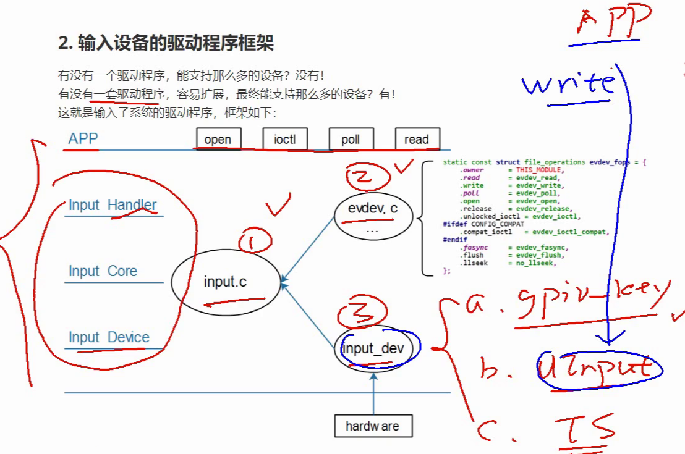

## 3. 有什么内容

### 3.1 框架

### 3.2 evdev.c剖析

### 3.3 input_dev驱动编写

### 3.4 GPIO按键驱动分析与使用

* 分析内核自带的GPIO按键驱动：drivers\input\keyboard\gpio_keys.c
* 使用

### 3.5 在QEMU上实现最简单的触摸屏驱动

### 3.6 I2C接口的触摸屏驱动分析与实践

### 3.7 UInput: 用户态模拟输入设备

# 输入系统应用编程

## 什么是输入系统

先来了解什么是输入设备？

常见的输入设备有键盘、鼠标、遥控杆、书写板、触摸屏等等,用户通过这些输入设备与Linux系统进行数据交换。

什么是输入系统？

输入设备种类繁多，能否统一它们的接口？既在驱动层面统一，也在应用程序层面统一？可以的。

Linux系统为了统一管理这些输入设备，实现了一套能兼容所有输入设备的框架：输入系统。驱动开发人员基于这套框架开发出程序，应用开发人员就可以使用统一的API去使用设备。用一样的代码, 去获取不一样的数据.

## 输入系统框架及调试

### 框架概述

作为应用开发人员, 可以只基于API使用输入子系统. 但是了解内核中输入子系统的框架, 了解数据流程, 有助于解决开发过程中碰到的硬件问题, 驱动问题.

输入系统框架如下图所示：

- 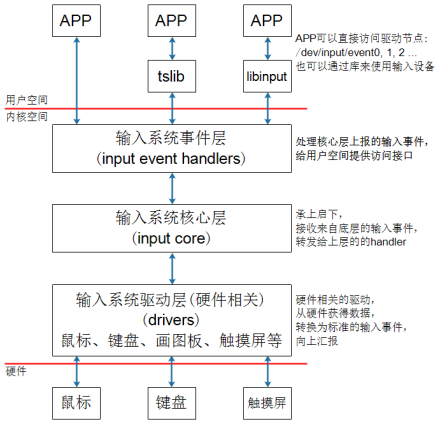
- `驱动层`只是从硬件读取数据. `核心层`把读到的数据整理成统一的格式, 把各种各样的数据统一格式之后, 上报给`事件层`. 
- `事件层`有多种处理方式, 最常用`evdev_handler`, 它把统一的数据分发给一个或者多个app, 只要app打开了某个设备结点, 此设备上一旦有数据, 所有打开这个设备结点的app都可以得到这些数据.

假设用户程序直接访问`/dev/input/event0`设备节点, 或者使用tslib访问设备节点, 数据的流程如下:

- ① APP打开设备结点, 发起读操作, 若无数据则休眠; 
    - 比如执行`hexdump /dev/input/event0 `一开始没有数据
- ② 用户操作设备, 硬件上`产生中断`;
- ③ 输入系统驱动层对应的驱动程序`处理中断`:
  - 中断服务程序读取到数据, 转换为`标准的输入事件`, 向核心层汇报. 核心层把数据转换为`统一格式`
  - `所谓输入事件`就是一个"`struct input_event`"结构体.
- ④ 核心层可以决定把输入事件转发给上面哪个handler来处理:
    - 从`handler`的名字来看, 它就是用来处输入操作的. 有多种`handler`, 比如: `evdev_handler`, `kbd_handler, joydev_handler`等等.
    - 最常用的是`evdev_handler`: 它只是把`input_event结构体`保存在内核buffer等, APP来读取时就原原本本地返回. 它支持多个APP同时访问输入设备, 每个APP都可以获得同一份输入事件.
    - 当`APP正在等待`数据时, `evdev_handler`会把它`唤醒`, 这样APP就可以得到数据, 返回数据

- ⑤ APP对输入事件的处理:
    - APP获得数据的方法有2种: 直接访问设备节点(比如/dev/input/event0,1,2,...), 或者通过tslib, libinput这类库来间接访问设备节点. 这些库简化了对数据的处理. 

linux下有很多不同的设备, 键盘, 鼠标, 触摸屏等等, 输入子系统是如何把这些不同的硬件数据转换成统一的格式的? 统一的格式又是什么格式.

驱动程序上报的数据含义三项重要内容:

- type: 哪类? 比如EV_KEY, 按键类.
- code: 哪个? 比如KEY_A
- value: 值, 比如0-松开, 1-按下, 2-长按

除了上报这些信息, 还会上报更多信息. 看下面.

## 编写APP需要掌握的知识

基于编写应用程序的角度，只需要理解这些内容：

### 1.内核中怎么表示一个输入设备？

使用input_dev结构体来表示输入设备，它的内容如下：

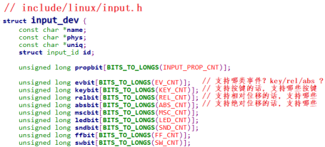

### 2.APP可以得到什么数据？

可以得到一系列的输入事件, 就是一个一个"struct input_event", 它定义如下:
- 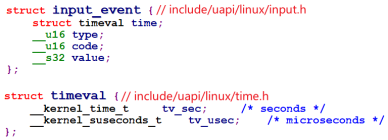

每个输入事件input_event中都含有发生时间: timeval表示的是"`自系统启动以来`过了多少时间", 它是一个结构体, 含有"tv_sec、tv_usec"两项(即秒, 微秒).

输入事件input_event中更重要的是: type(哪类事件), code(哪个事件), value(事件值), 细讲如下:

- ① `type`: 表示哪类事件

    - 比如EV_KEY表示按键类, EV_REL表示相对位移(比如鼠标), EV_ABS表示绝对位置(比如触摸屏). 有这几类事件(参考Linux内核头文件):
    - 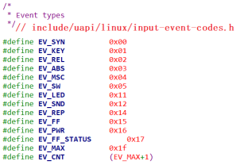

- ② `code`: 表示该类事件下的哪一个事件

    - 比如对于EV_KEY(按键)类事件, 它表示键盘. 键盘上有很多按键, 比如数字键1, 2, 3, 字母键A, B, C里等. 所以可以有这些事件:
    - 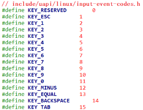

- 对于触摸屏, 它提供的是`绝对位置信息`, 有X方向, Y方向, 还有压力值. 所以code值有这些:

    - 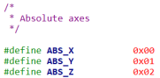

- ③ `value`: 表示事件值
    - 对于按键, 它的value可以是0(表示按键被按下), 1(表示按键被松开), 2(表示长按); 
    - 对于触摸屏, 它的value就是坐标值, 压力值.

- ④ 事件之间的界线
    - APP读取数据时, 可以得到一个或多个数据, 比如一个触摸屏的一个触点会上报X, Y位置信息, 也可能会上报压力值.

    - APP怎么知道它已经读到了完整的数据?

    - 驱动程序上报完一系列的数据后, 会上报一个"`同步事件`"(EV_SYN), 表示数据上报完毕. APP读到"同步事件"时, 就知道已经读完了当前的数据.

    - `同步事件`也是一个`input_event结构体`, 它的type, code, value三项`都是0`.

### 3.输入子系统支持完整的API操作

支持这些机制: 阻塞, 非阻塞, POLL/SELECT, 异步通知.

## 调试技巧

### 1. 确定设备信息

输入设备的设备节点名为/dev/input/eventX(也可能是/dev/eventX, X表示0, 1, 2等数字). 查看设备节点, 可以执行以下命令: `ls /dev/input/* -l`或 `ls /dev/event* -l`.

可以看到类似下面的信息:
- 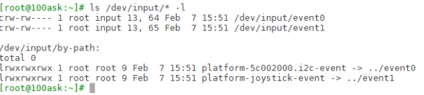

怎么知道这些设备节点对应什么硬件呢? 可以在板子上执行以下命令:`cat /proc/bus/input/devices`.这条指令的含义就是获取与event对应的相关设备信息, 可以看到类似以下的结果:

- 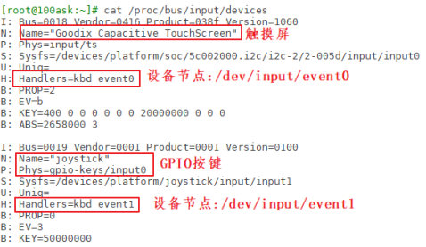

那么这里的I、N、P、S、U、H、B对应的每一行是什么含义呢？

- ① `I:id of the device`(设备ID)
    - 该参数由结构体struct input_id来进行描述，驱动程序中会定义这样的结构体: 
        - 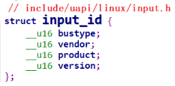
- ②`N:name of the device` :设备名称
- ③P: physical path to the device in the system hierarchy :系统层次结构中设备的物理路径
- ④S: sysfs path : 位于sys文件系统的路径
- ⑤U: unique identification code for the device(if device has it) 设备的唯一标识码
- ⑥H:list of input handles associated with the device. 与设备关联的输入句柄列表.
- ⑦ B:bitmaps(位图)
    - PROP:device properties and quirks(设备属性)
    - EV:types of events supported by the device(设备支持的事件类型)
    - KEY:keys/buttons this device has(此设备具有的键/按钮)
    - MSC:miscellaneous events supported by the device(设备支持的其他事件)
    - LED:leds present on the device(设备上的指示灯)
    - 值得注意的是B位图, 比如上图中“B: EV=b”用来表示该设备支持哪类输入事件. b的二进制是1011, bit0, 1, 3为1, 表示该设备支持0, 1, 3这三类事件, 即EV_SYN, EV_KEY, EV_ABS.
    - 再举一个例子, "`B: ABS=2658000 3`"如何理解?
    - 它表示该设备支持EV_ABS这一类事件中的哪一些事件. 这是2个32位的数字: 0x2658000, 0x3, 高位在前低位在后, 组成一个64位的数字: "0x2658000,00000003", 数值为1的位有: 0, 1, 47, 48, 50, 53, 54, 即: 0, 1, 0x2f, 0x30, 0x32, 0x35, 0x36, 对应以下这些宏:
    - 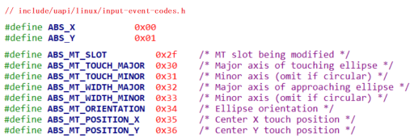
    - 即这款输入设备支持上述的ABS_X, ABS_Y, ABS_MT_SLOT, ABS_MT_TOUCH_MAJOR, ABS_MT_WIDTH_MAJOR, ABS_MT_POSITION_X, ABS_MT_POSITION_Y这些绝对位置事件(它们的含义在后面电容屏时再细说).

### 2. 使用命令读取数据

- 调试输入系统时, 直接执行类似下面的命令, 然后操作对应的输入设备即可读出数据:`hexdump /dev/input/event0`. 

- 在开发板上执行上述命令之后, 点击按键或是点击触摸屏, 就会打印以下信息:

    - 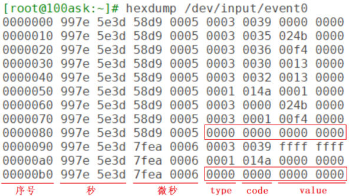

    - 上图中的type为3, 对应EV_ABS; code为0x35对应ABS_MT_POSITION_X; code为0x36对应ABS_MT_POSITION_Y.

    - 上图中还发现有2个同步事件: 它的type, code, value都为0. 表示电容屏上报了2次完整的数据.

## 不使用库的应用程序示例

### 输入系统支持完整的 API 操作

支持这些机制：阻塞、非阻塞、POLL/SELECT、异步通知.

### APP 访问硬件的 4 种方式

查询方式, 休眠-唤醒, poll 方式, 异步通知.

### 获取设备信息

通过 ioctl 获取设备信息, ioctl 的参数如下:

- `int ioctl(int fd, unsigned long request, ...);`
- 有些驱动程序对 request 的格式有要求, 它的格式如下:
- 
- 比如 dir 为`_IOC_READ`(即 2)时, 表示 APP 要读数据; 为_IOC_WRITE(即 4)时, 表示 APP 要写数据
    - size 表示这个 ioctl 能传输数据的最大字节数
    - type, nr 的含义由具体的驱动程序决定
    - 比如要读取输入设备的 evbit 时, ioctl 的 request 要写为"EVIOCGBIT(0,
        size)", size 的大小可以由你决定: 你想读多少字节就设置为多少. 这个宏的
        定义如下:
    - 

### 查询方式

APP 调用 open 函数时，传入“O_NONBLOCK”表示“非阻塞”。
APP 调用 read 函数读取数据时，如果驱动程序中有数据，那么 APP 的 read函数会返回数据，否则也会立刻返回错误。

### 休眠-唤醒方式

APP 调用 open 函数时，不要传入“O_NONBLOCK”。
APP 调用 read 函数读取数据时，如果驱动程序中有数据，那么 APP 的 read函数会返回数据；否则 APP 就会在内核态休眠，当有数据时驱动程序会把 APP 唤醒，read 函数恢复执行并返回数据给 APP。

### POLL/SELECT 方式

POLL 机制, SELECT 机制是完全一样的, 只是 APP 接口函数不一样.
简单地说, 它们就是“定个闹钟”: 在调用 poll, select 函数时可以传入“超时时间”. 在这段时间内, 条件合适时(比如有数据可读, 有空间可写)就会立刻返回, 否则等到“超时时间”结束时返回错误. 

用法如下:

- APP 先调用 open 函数时, 
- APP 不是直接调用 read 函数，而是先调用 poll 或 select 函数，这 2 个函数中可以传入“超时时间”. 它们的作用是：如果驱动程序中有数据，则立刻返回；否则就休眠. 在休眠期间，如果有人操作了硬件，驱动程序获得数据后就会把 APP 唤醒，导致 poll 或 select 立刻返回；如果在“超时时间”内无人操作硬件，则时间到后 poll 或 select 函数也会返回。APP 可以根据函数的返回值判断返回原因：有数据？无数据超时返回？
- APP 根据 poll 或 select 的返回值判断有数据之后，就调用 read 函数读取数据时，这时就会立刻获得数据.
- poll/select 函数可以监测多个文件，可以监测多种事件：
    - 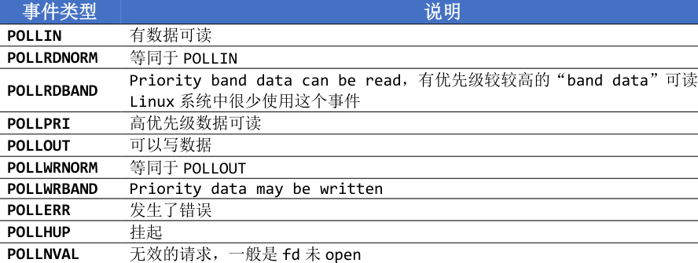
- 在调用 poll 函数时，要指明：
    - 你要监测哪一个文件：哪一个 fd
    - 你想监测这个文件的哪种事件：是 POLLIN、还是 POLLOUT. 最后，在 poll 函数返回时，要判断状态。

应用程序代码如下：

```c
struct pollfd fds[1];
int timeout_ms = 5000;
int ret;
fds[0].fd = fd;
fds[0].events = POLLIN;
ret = poll(fds, 1, timeout_ms);
if ((ret == 1) && (fds[0].revents & POLLIN))
{
read(fd, &val, 4);
printf("get button : 0x%x\n", val);
}
```

```c
14 int main(int argc, char **argv)
15 {
16 		int fd;
26 		struct pollfd fds[1];
……
61 		fd = open(argv[1], O_RDWR | O_NONBLOCK);
……
94 		while (1)
95 		{
96 			fds[0].fd = fd;
97 			fds[0].events = POLLIN;
98 			fds[0].revents = 0;
99 			ret = poll(fds, nfds, 5000);
100 		if (ret > 0)
101 		{
102 			if (fds[0].revents == POLLIN)
103 			{
104 				while (read(fd, &event, sizeof(event)) == sizeof(event))
105 				{
106 					printf("get event: type = 0x%x, code = 0x%x, value = 0x%x\n", event.type, event.code, event.value);
107 				}
108 			}
109 		}
110 		else if (ret == 0)
111 		{
112 			printf("time out\n");
113 		}
114 		else
115 		{
116 			printf("poll err\n");
117 		}
118 	}
119
120 return 0;
121 }
```

第 61 行：打开设备文件。
第 96~98 行：设置 pollfd 结构体。
第 96 行：想查询哪个文件(fd)？
第 97 行：想查询什么事件(POLLIN)？
第 98 行：先清除“返回的事件”(revents)。
第 99 行：使用 poll 函数查询事件，指定超时时间为 5000(ms)。
第 100、110 行判断返回值：大于 0 表示期待的事件发生了，等于 0 表示超时。

### 异步通知方式

所谓同步，就是“你慢我等你”。
那么异步就是：你慢那你就自己玩，我做自己的事去了，有情况再通知我。
所谓异步通知，就是 APP 可以忙自己的事，当`驱动程序有数据时`它会`主动给APP 发信号`，这会导致 APP 执行信号处理函数。
仔细想想“发信号”，这只有 3 个字，却可以引发很多问题:

- 谁发：驱动程序发
- 发什么：信号
- 发什么信号：SIGIO
- 怎么发：内核里提供有函数
- 发给谁：APP，APP 要把自己告诉驱动
- APP 收到后做什么：执行信号处理函数
- 信号处理函数和信号，之间怎么挂钩：APP 注册信号处理函数

Linux 系统中也有很多信号，在 Linux 内核源文件 include\uapi\asm-generic\signal.h 中，有很多信号的宏定义：

- 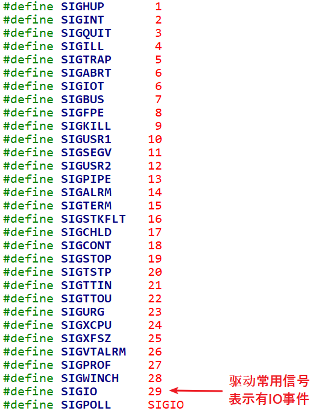

- 驱动程序通知 APP 时，它会发出“`SIGIO`”这个信号，表示有“IO 事件”要处理。

- 就 APP 而言，你想处理 SIGIO 信息，那么需要提供信号处理函数，并且要跟SIGIO 挂钩。这可以通过一个 signal 函数来“给某个信号注册处理函数”，用法如下：
- 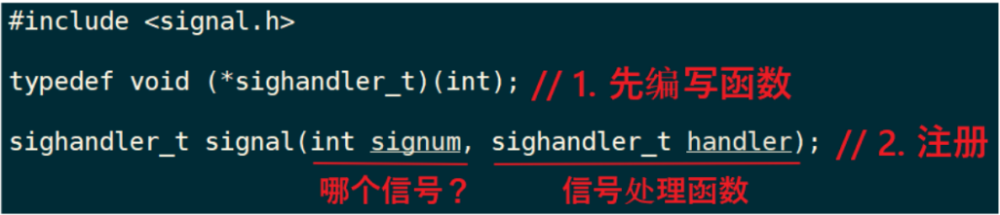
- 除了注册 SIGIO 的处理函数，APP 还要做什么事？想想这几个问题：
- 内核里有那么多驱动，你想让哪一个驱动给你发 SIGIO 信号？
    - APP 要打开驱动程序的设备节点
- 驱动程序怎么知道要发信号给你而不是别人？APP 要把自己的进程 ID 告诉驱动程序。
- APP 有时候想收到信号，有时候又不想收到信号：应该可以把 APP 的意愿告诉驱动：设置 Flag 里面的 FASYNC 位为 1，使能“异步通知”。

应用程序要做的事情有这几件：

- ① 编写信号处理函数：
```c
static void sig_func(int sig)
{
    int val;
    read(fd, &val, 4);
    printf("get button : 0x%x\n", val);
}
```
- ② 注册信号处理函数：`signal(SIGIO, sig_func);`
- ③ 打开驱动：`fd = open(argv[1], O_RDWR);`
- ④ 把进程 ID 告诉驱动：`fcntl(fd, F_SETOWN, getpid());`
- ⑤ 使能驱动的 FASYNC 功能:
```c
    flags = fcntl(fd, F_GETFL);
    fcntl(fd, F_SETFL, flags | FASYNC);
```

## 电阻屏和电容屏

触摸屏分为电阻屏, 电容屏. 电阻屏结构简单, 在以前很流行; 电容屏支持多点触摸, 现在的手机基本都是使用电容屏. 

***注意***: LCD, 触摸屏不是一回事, LCD是输出设备, 触摸屏是输入设备, 制作触摸屏时特意把它的尺寸做得跟LCD一模一样, 并且把触摸屏覆盖在LCD上.

### 电阻屏

1. 复习一下欧姆定律

- 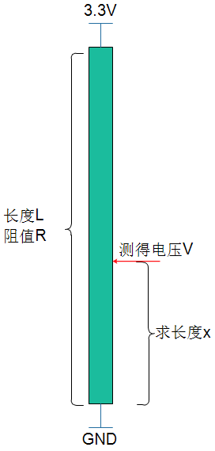

- 电阻假设是均匀的，就是长度和阻值成正比关系。电阻长度为L，阻值为 R，在两端施加 3.3V 电压。在某点测得电阻为 V，求上图中长度 X.
- 根据欧姆定律：`3.3/R = V/Rx`, 因为长度和阻值成正比关系, 上述公式转换为: `3.3∕L = V/X`，所以 `X=L*V/3.3`.

2. 电阻屏原理

电阻屏就是基于欧姆定律制作的，它有上下两层薄膜，这两层薄膜就是两个电阻，如下图所示：

- 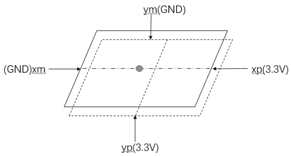
- 平时上下两层薄膜无接触, 当点击触摸屏时, 上下两层薄膜接触: 这时就可以测量触点电压. 过程如下:
- ① 测量 X 坐标：
    - 在 xp, xm 两端施加 3.3V 电压, yp 和 ym 不施加电压(yp 就相当于探针), 测量 yp 电压值. 该电压值就跟 X 坐标成正比关系, 假设: `X = 3.3*Vyp/Xmax`
- ② 测量 Y 坐标：
    - 在 yp, ym 两端施加 3.3V 电压, xp 和 xm 不施加电压(xp 就相当于探针), 测量 xp 电压值. 该电压值就跟 Y 坐标成正比关系, 假设:`Y = 3.3*Vxp/Ymax`
    - 在实际使用时，电阻屏的 Xmax、Ymax 无从得知，所以使用之前要先较准：依次点击触摸屏的四个角和中心点，推算出 X、Y 坐标的公式：`X = func(Vyp)` `Y = func(Vxp)`
- 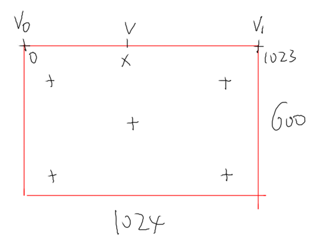

3. 电阻屏数据

Linux 驱动程序中，会上报触点的 X、Y 数据，注意：这不是 LCD 的坐标值，需要 APP 再次处理才能转换为 LCD 坐标值。
对应的 input_event 结构体中，“type、code、value”如下：

- 按下时：

```c
EV_KEY  BTN_TOUCH    1 /* 按下 */
EV_ABS  ABS_PRESSURE 1 /* 压力值，可以上报，也可以不报，可以是其他压力值 */
EV_ABS  ABS_X        x_value /* X 坐标 */
EV_ABS  ABS_Y        y_value /* Y 坐标 */
EV_SYNC 0            0 /* 同步事件 */
```

- 松开时：

```c
EV_KEY  BTN_TOUCH    0 /* 松开 */
EV_ABS  ABS_PRESSURE 0 /* 压力值，可以上报，也可以不报 */
EV_SYNC 0            0 /* 同步事件 */
```

### 电容屏

1. 原理

原理如图所示：

- 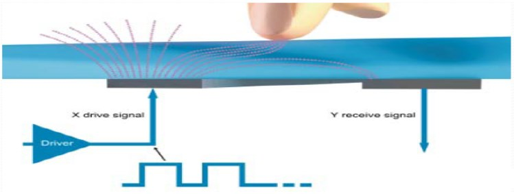
- 电容屏中有一个控制芯片，它会周期性产生驱动信号，接收电极接收到信号，并可测量电荷大小。当电容屏被按下时，相当于引入了新的电容，从而影响了接收电极接收到的电荷大小。主控芯片根据电荷大小即可计算出触点位置。
- 怎么通过电荷计算出触点位置？这由控制芯片实现，这类芯片一般是 I2C 接口。我们只需要编写程序，通过 I2C 读取芯片寄存器即可得到这些数据。

2. 电容屏数据

参考文档: Linux内核`Documentation\input\multi-touch-protocol.rst`.

电容屏可以支持多点触摸(Multi touch)，驱动程序上报的数据中怎么分辨触点？

这有两种方法：Type A, Type B，这也对应两种类型的触摸屏：

- ① Type A

    - 该类型的触摸屏不能分辨是哪一个触点，它只是把所有触点的坐标一股脑地上报，由软件来分辨这些数据分别属于哪一个触点。
    - Type A 已经过时，Linux 内核中都没有 Type A 的源码了。

- ② Type B

    - 该类型的触摸屏能分辨是哪一个触点，上报数据时会先上报触点 ID，再上报它的数据。
    - 具体例子如下，这是最简单的示例，使用场景分析来看看它上报的数据。
    - 当有 2 个触点时(type, code, value)：

    ```c
    EV_ABS ABS_MT_SLOT        0 // 这表示“我要上报一个触点信息了”，用来分隔触点信息
    EV_ABS ABS_MT_TRACKING_ID 45 // 这个触点的 ID 是 45
    EV_ABS ABS_MT_POSITION_X  x[0] // 触点 X 坐标
    EV_ABS ABS_MT_POSITION_Y  y[0] // 触点 Y 坐标
        
    EV_ABS ABS_MT_SLOT        1 // 这表示“我要上报一个触点信息了”，用来分隔触点信息
    EV_ABS ABS_MT_TRACKING_ID 46 // 这个触点的 ID 是 46
    EV_ABS ABS_MT_POSITION_X  x[1] // 触点 X 坐标
    EV_ABS ABS_MT_POSITION_Y  y[1] // 触点 Y 坐标
    EV_SYNC SYN_REPORT        0 // 全部数据上报完毕
    ```
    
    - 当 ID 为 45 的触点正在移动时：
    
    ```c
    EV_ABS ABS_MT_SLOT 0 //这表示“我要上报一个触点信息了”,之前上报过ID,就不用再上报ID了
    EV_ABS ABS_MT_POSITION_X x[0] // 触点 X 坐标
    EV_SYNC SYN_REPORT 0 // 全部数据上报完毕
    ```
    
    - 松开 ID 为 45 的触点时(在前面 slot 已经被设置为 0，这里这需要再重新设置slot，slot 就像一个全局变量一样：如果它没变化的话，就无需再次设置)：
    
    ```c
    //刚刚设置了ABS_MT_SLOT为0,它对应ID为45,这里设置ID为-1就表示ID为45的触点被松开了
    EV_ABS  ABS_MT_TRACKING_ID -1
    EV_SYNC SYN_REPORT 0    //全部数据上报完毕
    ```
    
    - 最后，松开 ID 为 46 的触点：
    
    ```c
    EV_ABS ABS_MT_SLOT 1 //这表示“我要上报一个触点信息了”,在前面设置过slot 1的ID为46
    EV_ABS ABS_MT_TRACKING_ID -1 //ID为-1,表示slot 1被松开,即ID为46的触点被松开
    EV_SYNC SYN_REPORT   //全部数据上报完毕
    ```

3. 电容屏的实验数据

- 假设你的开发板上电容屏对应的设备节点是/dev/input/event0，执行以下命令：`hexdump /dev/input/event0`
- 然后用一个手指点击触摸屏，得到类似下图的数据：
    - 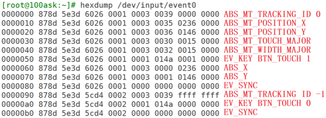
    - 在上面的数据中，为了兼容老程序，它也上报了 ABS_X、ABS_Y 数据，电阻触摸屏就是使用这类型的数据。所以基于电阻屏的程序，也可以用在电容屏上。

- 使用两个手指点击触摸屏时，得到类似如下的数据：
    - 
    - 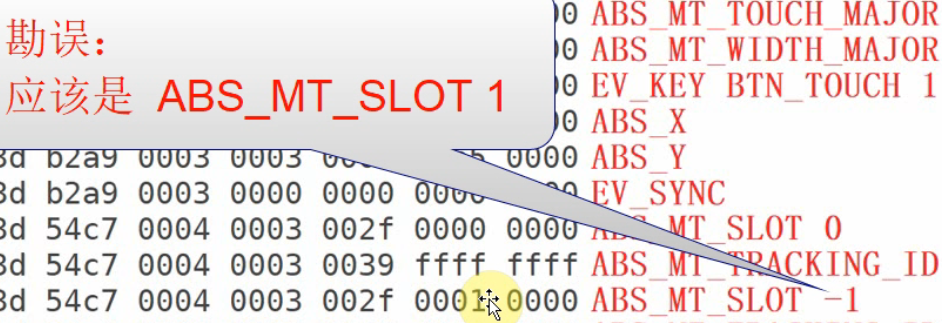
    - 为了兼容老程序, 它也上报了 ABS_X, ABS_Y 数据, 但是只上报第 1 个触点的数据
    - ABS_MT_TOUCH_MAJOR 跟  ABS_MT_WIDTH_MAJOR 
        - TOUCH: 是触点的大小, 触点是椭圆形, 有长轴Major 和 短轴Minor. 
        - WIDTH: 是手指的宽度
        - 想长传触点的形状的话, ABS_MT_TOUCH_MAJOR, ABS_MT_WIDTH_MAJOR, ABS_MT_TOUCH_MINOR, ABS_MT_WIDTH_MINOR 都要上传才行.
        - 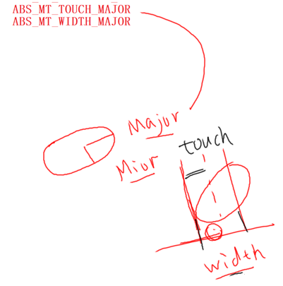


## tslib

tslib 是一个触摸屏的开源库, 可以使用它来访问触摸屏设备, 可以给输入设备添加各种"filter"(过滤器, 就是各种处理), 地址是 ：http://www.tslib.org/.

编译 tslib 后, 可以得到 libts 库, 还可以得到各种工具:较准工具, 测试工具。

### tslib 框架分析

- tslib 的主要代码如图
    - 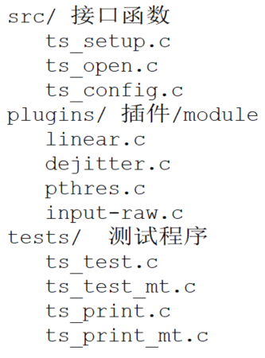
- 核心在于“plugins”目录里的“插件”，或称为“module”。这个目录下的每个文件都是一个 module，每个 module 都提供 2 个函数：read、read_mt，前者用于读取单点触摸屏的数据，后者用于读取多点触摸屏的数据。
- 要分析 tslib 的框架，先看看示例程序怎么使用，我们参考 ts_test.c 和ts_test_mt.c，前者用于一般触摸屏(比如电阻屏、单点电容屏)，后者用于多点触摸屏。
- 一个图就可以弄清楚 tslib 的框架: 
    - 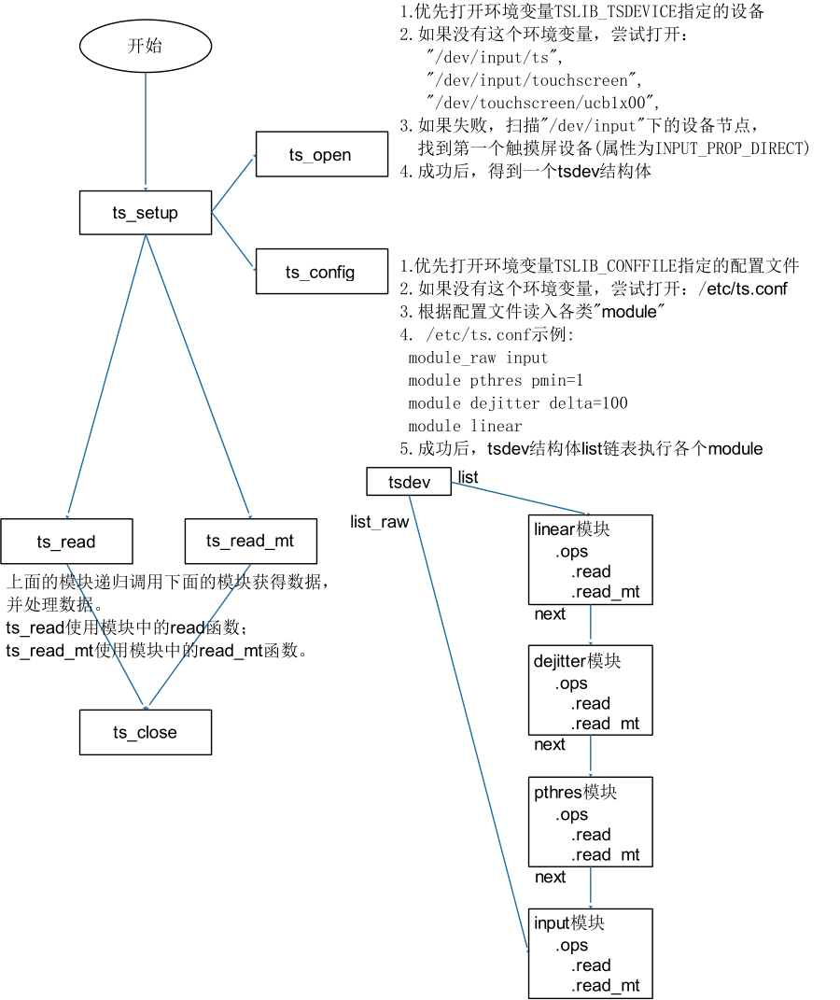

- 调用 ts_open 后，可以打开某个设备节点，构造出一个 tsdev 结构体。然后调用 ts_config 读取配置文件的处理，假设/etc/ts.conf 内容如下：

```makefile
module_raw input
module pthres pmin=1
module dejitter delta=100
module linear
```

- 每行表示一个“module”或“moduel_raw”。
- 对于所有的“module”，都会插入 tsdev.list 链表头，也就是 tsdev.list执行配置文件中最后一个“module”，配置文件中第一个“module”位于链表的尾部。
- 对于所有的“module_raw”，都会插入 tsdev.list_raw 链表头，一般只有一个“module_raw”。
- 注意：tsdev.list 中最后一个“module”会指向 ts_dev.list_raw 的头部。
- 无论是调用 ts_read 还是 ts_read_mt，都是通过 tsdev.list 中的模块来处理数据的。这写模块是递归调用的，比如 linear 模块的 read 函数如图:
    - 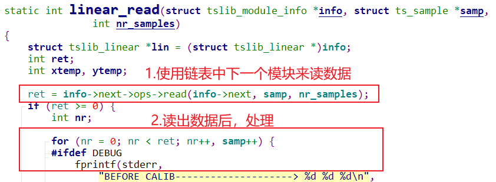
- linear 模块的 read_raw 函数如图:
    - 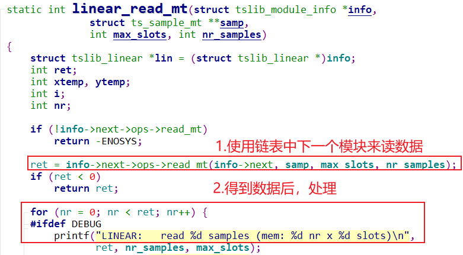
- 因为是递归调用, 所有最先使用 input 模块读取设备节点得到原始数据, 再依次经过 pthres 模块, dejitter 模块, linear 模块处理后, 才返回最终数据。

### 交叉编译, 测试 tslib

1. 交叉编译 tslib

```shell
// 对于 IMX6ULL，命令如下
export ARCH=arm
export CROSS_COMPILE=arm-linux-gnueabihf-
export PATH=$PATH:/home/book/100ask_imx6ull-sdk/ToolChain/gcc-linaro-6.2.1-2016.11-x86_64_arm-linux-gnueabihf/bin
```

- 交叉编译 tslib:

```shell
// 对于 IMX6ULL，命令如下
./configure --host=arm-linux-gnueabihf --prefix=/
make
make install DESTDIR=$PWD/tmp
```

- 确定工具链中头文件, 库文件目录:

```shell
// 对于 IMX6ULL，命令如下
echo 'main(){}'| arm-buildroot-linux-gnueabihf-gcc -E -v -
```

- 把头文件, 库文件放到工具链目录下:

```shell
// 对于 IMX6ULL，命令如下
cd tslib-1.21/tmp/
cp include/* /home/book/100ask_imx6ull-sdk/ToolChain/gcc-linaro-6.2.1-2016.11-x86_64_arm-linux-gnueabihf/bin/../arm-linux-gnueabihf/libc/usr/include
cp -d lib/*so* /home/book/100ask_imx6ull-sdk/ToolChain/gcc-linaro-6.2.1-2016.11-x86_64_arm-linux-gnueabihf/bin/../arm-linux-gnueabihf/libc/usr/lib/
```

2. 测试 tslib

把库文件放到单板上: 运行程序要用. 先在开发板上使用 NFS 挂载 Ubuntu的目录, 再把前面编译出来的 tslib-1.21/tmp/部分文件复制到板子上, 示例命令如下:

```shell
cp /mnt/tslib-1.21/tmp/lib/*so* -d /lib
cp /mnt/tslib-1.21/tmp/bin/* /bin
cp /mnt/tslib-1.21/tmp/etc/ts.conf -d /etc
```

对于 IMX6ULL, 首先需要关闭默认的 qt gui 程序, 才可以执行 ts_test_mt测试命令, 关闭 qt 命令如下所示:

```shell
mv /etc/init.d/S07hmi /root
reboot
```

- 在单板上执行测试程序:`ts_test_mt`

### 写一个测试程序

1. 接口函数深入分析

前面演示过, 用两个手指点击屏幕时, 可以得到类似下图的数据:

- 

- 驱动程序使用 slot, tracking_id 来标识一个触点; 当 tracking_id 等于-1 时, 标识这个触点被松开了.
- 触摸屏可能支持多个触点, 比如 5 个: tslib 为了简化处理, 即使只有 2 个触点, ts_read_mt 函数也会返回 5 个触点数据, 可以根据标志位判断数据是否有效.
- ts_read_mt 函数原型如图
    - 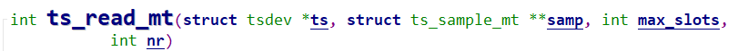
    - 假设nr设置为1, max_slots设置为5, 那么读到的数据保存在: `samp[0][0]`, `samp[0][1]`, `samp[0][2]`, `samp[0][3]`, `samp[0][4]`中.
    - 假设nr设置为2, max_slots设置为5, 那么读到的数据保存在: `samp[0][0]`, `samp[0][1]`, `samp[0][2]` , `samp[0][3]` ,`samp[0][4]` 和 `samp[1][0]` ,`samp[1][1]`, `samp[1][2]`, `samp[1][3]`, `samp[1][4]`中.
- ts_sample_mt 结构体如图:
    - 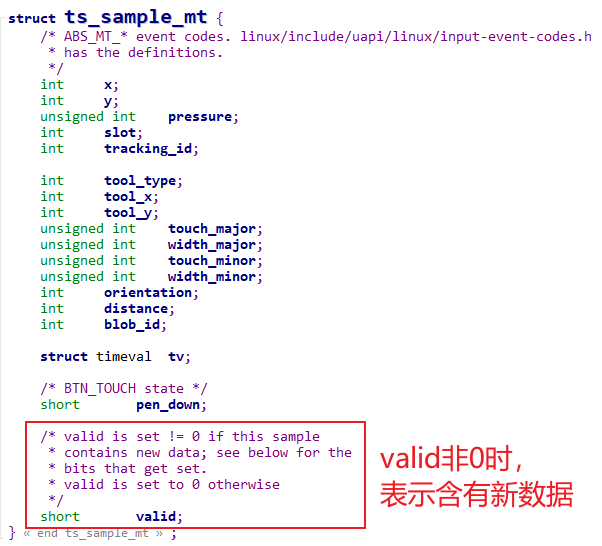

2. 编写代码

- 实现一个程序, 不断打印 2 个触点的距离.
- 思路: 假设是 5 点触摸屏, 调用一次 ts_read_mt 可以得到 5 个新数据; 使用新旧数据进行判断, 如果有 2 个触点, 就打印出距离.

# Input子系统框架详解

参考资料：

* Linux 5.x内核文档
* Documentation\input\input-programming.rst
    * Documentation\input\event-codes.rst
* Linux 4.x内核文档
    * Documentation\input\input-programming.txt
    * Documentation\input\event-codes.txt

## 1. 回顾字符设备驱动程序

- 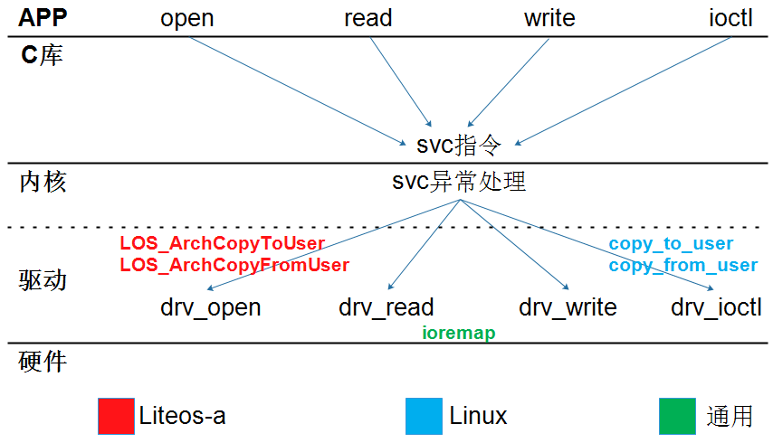

- 怎么编写字符设备驱动程序？
    * 确定主设备号
    * 创建file_operations结构体
        * 在里面填充drv_open/drv_read/drv_ioctl等函数
    * 注册file_operations结构体
        * register_chrdev(major, &fops, name)
    * 谁调用register_chrdev？在入口函数调用
    * 有入口自然就有出口
        * 在出口函数unregister_chrdev
    * 辅助函数(帮助系统自动创建设备节点)
        * class_create
        * device_create

## 2. Input子系统框架

- 

## 3. Input子系统内部实现

### 3.1 重要结构体

- 
- 左边的`input_dev`表示输入设备
    - 
- 右边的`input_handler`表示"处理程序"
- 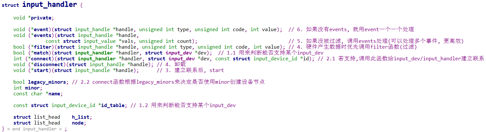
- 匹配之后使用`input_handle`保存2者之间的联系
    - 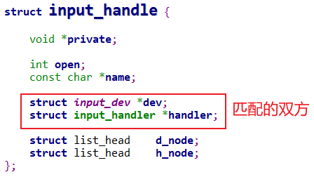
- 设备获取, 上报数据: `input_event`
    - 
- 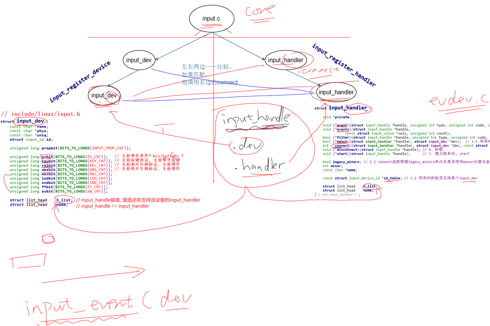
    - 核心层提供 input_register_device 来注册input_dev, 提供input_register_handler 来注册 input_handler. 都是向核心层注册
    - evbit: 事件 bit map 表示支持哪些事件.
    - 注册之后, 类似platform_bus_type, input_dev跟 input_handler 一一比较. 匹配了, 就用connect函数建立联系.
    - input_handler 结构体里, match可以写也可以不写. 但id_table必须要有, 它表示这个input_handler能支持哪些input_dev. 可以用id_table表示支持哪些input_dev, 也可以使用match来作更复杂的判断, 判断它能不能支持某些设备.
    - 左边注册了input_dev之后, 就会把右边各个handler取出来, 使用他们的match函数或id_table来判断handler是否支持input_dev. 支持的话就调用connect函数建立联系.
        - 比如evdev.c 里的evdev_connect函数:
        - 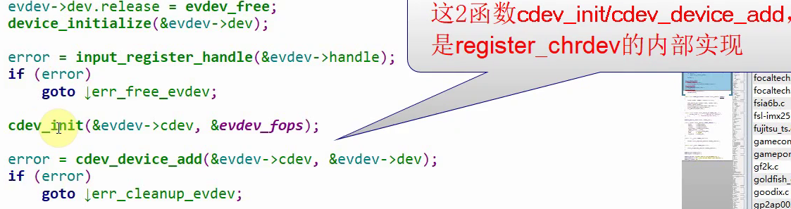
            - connect函数里注册一个字符设备.

    - 注册一个input_handler的过程也是类似的.
    - 假如input_dev和input_handler匹配了, 就会创建一个input_handle(可以看做一个句柄), 里面有一个dev和handler成员, 保存匹配双方.
    - input_handle结构体, 会放到input_dev里的h_list链表里, 也会放到input_handler里的h_list链表里.  所以, input_dev有数据了就可以发给多个input_handler. 而一个input_handler也可以支持多个input_dev.
    - input_dev有数据了, 如何发给handler. 用input_event. 
        - input_event里有dev, 根据其中的h_list找到handler, 优先调filter函数处理事件, 如果没被过滤掉, 就再优先调用handler里的events函数处理(可以处理多个事件.). 最后再去调用event一个一个处理(如果不能一次处理多个事件).


### 3.2 注册流程

* 注册`input_dev`: `input_register_device`	

    * 把input_dev放入input.c的input_dev_list链表
        * `list_add_tail(&dev->node, &input_dev_list);`
    * 对于input.c的`input_handler_list`链表中的`每一个input_handler`, 一一比较
        * 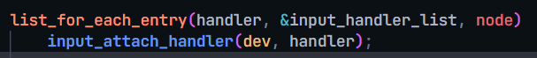
        * 
        * 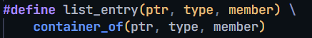
        * 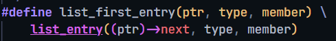
        * 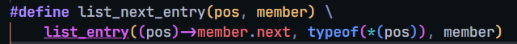
    * 如果匹配则调用`input_handler.connect`
        * 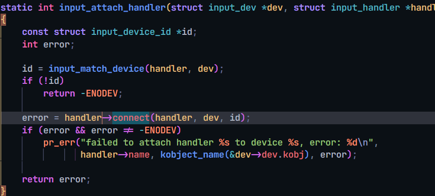

* 注册`input_handler`: `input_register_handler`

    * 把input_dev放入input.c的input_handler_list链表
    * 对于input.c的input_dev_list链表中的每一个input_dev, 一一比较
    * 如果匹配则调用input_handler.connect

* 怎么判断input_dev和input_handler是否匹配

    * input_handler中有一个`id_table`, 表示它支持哪类设备
    * input_handler还有一个`match函数`, 可以用来进行复杂的判断
    * match函数`可以省略`
    * 判断是否匹配流程
        * 如果没有match函数: input_dev跟id_table比较即可
        * 如果有match函数: input_dev先跟id_table比较, 成功后再用match函数再次判断

* 匹配后做的事情

    * 调用`input_handler.connect`

        * 创建/注册一个`input_handle`, 把`input_dev, input_handler`放在里面

            ```shell
            类似：
                evdev->handle.dev = input_get_device(dev);
            	evdev->handle.handler = handler;
            
            	error = input_register_handle(&evdev->handle);
            ```

        * 注册字符设备驱动程序

            ```shell
            类似：
            	cdev_init(&evdev->cdev, &evdev_fops);
            
            	error = cdev_device_add(&evdev->cdev, &evdev->dev);
            ```

* evdev.c 通用handler:

    * 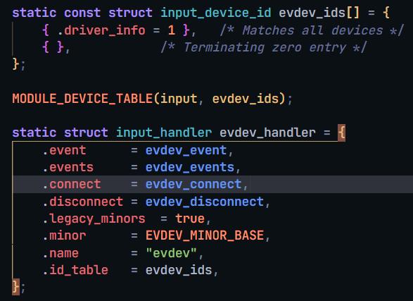
    * `evdev_connect`
        * 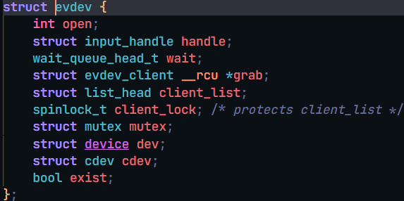.
        * 分配这个结构体:
        * 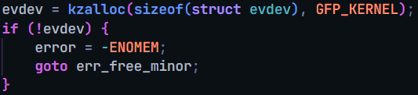
        * struct evdev里有一个struct input_handle 结构体成员. 它是这么被设置的.
        * 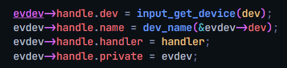
        * 把input_handle 放到链表里: `error = input_register_handle(&evdev->handle);`
        * 
        * 最后, 注册字符设备
        * 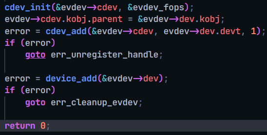


### 3.3 读取一个数据的流程

* APP调用open函数打开`/dev/input/event0`

    * 在驱动程序`evdev_open`里, 创建一个`evdev_client`, 表示一个"客户"
    * 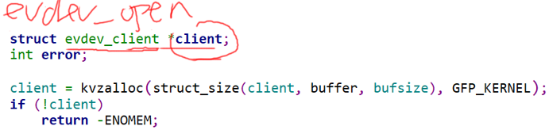
        * 注: 这是5.4的代码, 4.x的代码不一样, 但功能和意图一样.
    * 
        * 把这个client放到 evdev这个设备的用户链表里. 
    * 用户打开一个input设备时, 就会找到之前分配过的一个evdev
    * 在硬件相关层, 用input_dev表示一个输入设备. 在input handler层的evdev.c里, 用evdev表示一个输入设备.
    * 可以由app1 来打开这个节点, 也可以由APP2 同时打开.

* APP调用`read/poll`读取, 等待数据

    * 没有数据时休眠: `wait_event_interruptible(evdev->wait, ...)`
    * 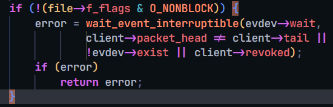
        * 上面这个休眠代码是在一个**for** (;;){ } 中的.  休眠是在wait队列上.

* 点击, 操作输入设备, `产生中断`

* 在中断服务程序里

    * 从硬件`读取到数据`

    * 使用以下函数`上报数据`

        ```shell
        void input_event(struct input_dev *dev,
        		 unsigned int type, unsigned int code, int value);
        		 
        static inline void input_sync(struct input_dev *dev); // 实质也是 input_event
        ```

    * input_event做什么?

        * 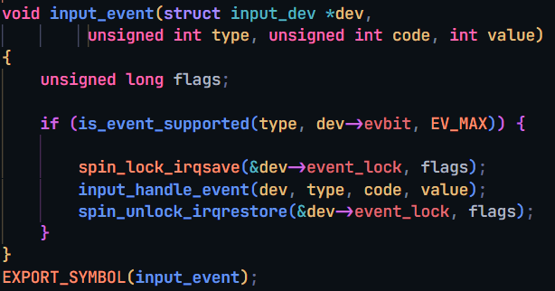
    * 从`dev->h_list`中取出`input_handle`, 从`input_handle`取出`input_handler`
    * 优先调用`input_handler->filter`来处理
    * 如果没有`input_handler->filter`或者没处理成功
        * 调用`input_handler->events`
        * 没有input_handler->events的话, 调用`input_handler->event`

* 以evdev.c为例

    * 它有`evdev_events`: 用来处理多个事件
    * 也有`evdev_event`: 实质还是调用`evdev_events`
    * 唤醒"客户": `wake_up_interruptible(&evdev->wait);`

- **input_event ** -> **input_handle_event** -> **input_pass_values** -> **input_to_handler**
    - 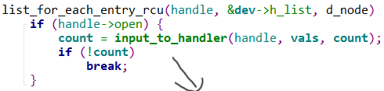
    - 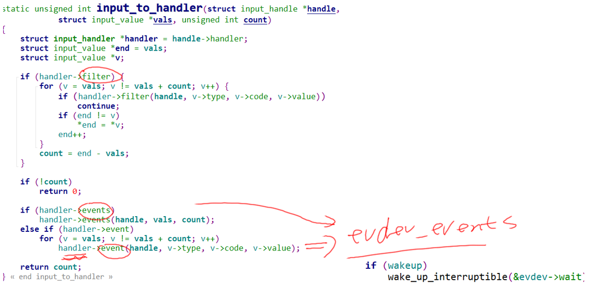

- evdev.c 举例:
    - **evdev_events** 
        - 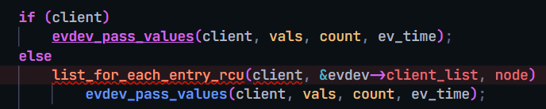
    - **evdev_pass_values**
        - 
        - 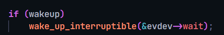

# 编写input_dev驱动框架

参考资料：

* Linux 5.x内核文档

* Documentation\input\input-programming.rst

    * Documentation\input\event-codes.rst

* Linux 4.x内核文档

    * Documentation\input\input-programming.txt
    * Documentation\input\event-codes.txt

* 本节视频代码：GIT仓库中

    ```shell
    IMX6ULL\source\05_Input\02_input_dev_framework
    STM32MP157\source\A7\05_Input\02_input_dev_framework
    ```

    ## 1. 回顾框架

* 

## 2. 怎么编写input_dev驱动

### 2.1 分配/设置/注册input_dev

- 

### 2.2 硬件相关的操作

* 申请中断

* 在中断服务程序里

    * 读取硬件获得数据

    * 上报数据

        ```shell
        void input_event(struct input_dev *dev,
        		 unsigned int type, unsigned int code, int value);
        		 
        static inline void input_sync(struct input_dev *dev); // 实质也是 input_event
        ```


## 3. 现场编程

- 
- 在设备树里创建一个节点
    * 指定硬件资源等信息
- 编译一个plartform_driver驱动
    * 在probe函数里
        * 从设备树获得资源
        * 分配/设置/注册input_dev
        * 硬件相关的操作
            * request_irq等

# GPIO按键驱动分析与使用

参考资料：

* Linux 5.x内核

    * Documentation\devicetree\bindings\input\gpio-keys.txt
    * drivers\input\keyboard\gpio_keys.c

* Linux 4.x内核

    * Documentation\devicetree\bindings\input\gpio-keys.txt
    * drivers\input\keyboard\gpio_keys.c

* 设备树

    * IMX6ULL：`Linux-4.9.88/arch/arm/boot/dts/100ask_imx6ull-14x14.dts`
    * STM32MP157：`Linux-5.4/arch/arm/boot/dts/stm32mp15xx-100ask.dtsi`
    * QEMU：`linux-4.9.88/arch/arm/boot/dts/100ask_imx6ull_qemu.dts`

    

## 1. 驱动程序框架

- 

## 2. 设备树示例

### 2.1 设备树讲解

属性：

* 必备：`compatible = "gpio-keys";`

* 可选：

    * `autorepeat`: 表示自动重复, 按下按键不松开, 驱动会自动重复上报按键值

* 对于每一个GPIO按键, 都是一个子节点, 有这些属性:
    * `gpios`: 使用哪个GPIO
    * `interrupts`: 对应的中断
    * `linux,code`: 对应的按键值
    * **注意**: `gpios`和`interrupts`至少要保留一个, 不能都省略
    * `debounce-interval`: 消除抖动的间隔, 单位: ms, 默认是5ms

- 整个节点会被内核转换成platform_device, 根据compatible属性找到对应的platform_driver, 同时调用platform_driver中的probe函数.
    - probe函数里 分配设置注册input_dev结构体
    - 

### 2.2 100ASK_IMX6ULL

```shell
gpio-keys {
	compatible = "gpio-keys";
	pinctrl-names = "default";

	user1 {
		label = "User1 Button";
		gpios = <&gpio5 1 GPIO_ACTIVE_LOW>;
		gpio-key,wakeup;
		linux,code = <KEY_1>;
	};

	user2 {
		label = "User2 Button";
		gpios = <&gpio4 14 GPIO_ACTIVE_LOW>;
		gpio-key,wakeup;
		linux,code = <KEY_2>;
	};
};
```

### 2.3 100ASK_STM32MP157

```shell
joystick {
		compatible = "gpio-keys";
		#size-cells = <0>;
		button-0 {
				 label = "usr_button0";
				 linux,code = <KEY_A>;
				interrupt-parent = <&gpiog>;
				interrupts = <3 IRQ_TYPE_EDGE_RISING>;
		};
	   button-1 {
				 label = "usr_button1";
				 linux,code = <KEY_ENTER>;
				interrupt-parent = <&gpiog>;
				interrupts = <2 IRQ_TYPE_EDGE_RISING>;
		};

};
```

### 2.4 QEMU

```shell
gpio-keys@0 {
				compatible = "gpio-keys";
				pinctrl-names = "default";
				pinctrl-0 = <&pinctrl_gpio_keys>;
				status = "okay";

				Key0{
						label = "Key 0";
						gpios = <&gpio5 1 GPIO_ACTIVE_HIGH>;
						linux,code = <KEY_1>;
				};
};

gpio-keys@1 {
				compatible = "gpio-keys";
				pinctrl-names = "default";
				pinctrl-0 = <&pinctrl_gpio_key1>;
				status = "okay";

				Key0{
						label = "Key 1";
						gpios = <&gpio1 18 GPIO_ACTIVE_HIGH>;
						linux,code = <KEY_2>;
				};
};
```

## 3. gpio_keys.c驱动程序分析

### 3.1 套路

* 根据设备树`获得硬件信息`: 哪个GPIO, 对应什么按键
* 分配/设置/注册input_dev结构体
* `request_irq`: 在中断处理函数中`确定按键值`, `上报按键值`
    * 有`两种IRQ函数`
    * `gpio_keys_gpio_isr`: 设备树中的用`gpios`来描述用到的引脚
    * `gpio_keys_irq_isr`: 设备树中的用`interrupts`来描述用到的引脚

**gpio_keys_probe**函数:

- 一开始从设备树里得到GPIO按键信息: 

    ```c
    struct device *dev = &pdev->dev;
    const struct gpio_keys_platform_data *pdata = dev_get_platdata(dev);
    if (!pdata) {
    		pdata = gpio_keys_get_devtree_pdata(dev);
    		if (IS_ERR(pdata))
    			return PTR_ERR(pdata);
    	}
    
    //gpio_keys_get_devtree_pdata
    nbuttons = of_get_available_child_count(node); 先确定有几个子节点, 每个子节点都对应一个按键.
    pdata = devm_kzalloc(dev,sizeof(*pdata) + nbuttons * sizeof(*button),
                         GFP_KERNEL);  分配结构体
    后面就是各种获取设备树里的属性信息了
    ```

- 获取按键信息之后, 分配input_dev结构体, 再作一些常规设置

    ```c
    struct input_dev *input;
    input = devm_input_allocate_device(dev);
    ddata->pdata = pdata;
    ddata->input = input;
    mutex_init(&ddata->disable_lock);
    
    platform_set_drvdata(pdev, ddata);
    input_set_drvdata(input, ddata);
    
    input->name = pdata->name ? : pdev->name;
    input->phys = "gpio-keys/input0";
    input->dev.parent = &pdev->dev;
    input->open = gpio_keys_open;
    input->close = gpio_keys_close;
    
    input->id.bustype = BUS_HOST;
    input->id.vendor = 0x0001;
    input->id.product = 0x0001;
    input->id.version = 0x0100;
    ```

- 如果有autorepeat

    ```c
    	if (pdata->rep)/* Enable auto repeat feature of Linux input subsystem */
    		__set_bit(EV_REP, input->evbit);
    ```

- 然后处理每个按键, 也就是每个子节点

    ```c
    	for (i = 0; i < pdata->nbuttons; i++) {
    		const struct gpio_keys_button *button = &pdata->buttons[i];
    		struct gpio_button_data *bdata = &ddata->data[i];
    
    		error = gpio_keys_setup_key(pdev, input, bdata, button);
    		if (error)
    			return error;
    
    		if (button->wakeup)
    			wakeup = 1;
    	}
    ```

- 如何处理每个子节点

    - 子节点有两种方式描述.
        - GPIO方式描述(如6ULL), 故GPIO要转换为中断号irq, request_irq, 用到的是GPIO相关的中断处理函数, gpio_isr
        - 中断信息方式描述(如MP157), 直接有irq中断号, request_irq, 用到的是中断相关的处理函数, irq_isr
    - 以上是第一点, 注册中断.
    - 第二点, 子节点里还有linux,code属性, 表示此引脚对应哪个按键. 
        - 所以第二点要做的就是设置input_dev. 它里面有evbit, 跟keybit数组. 
        - 这keybit数组的设置 就是由 linux,code属性而来.

    - 这个部分对应在 **gpio_keys_setup_key** 函数里. 根据子节点描述方式不同, 而有两个分支, 来注册中断. 注册完中断就设置keybit, 对应函数**input_set_capability**.

- 最后probe函数注册input_dev : **input_register_device**(input);

### 3.2  gpio_keys_gpio_isr分析

- 3.3 描述的gpio_keys_irq_isr方式有个致命缺点, 就是它没办法得知按键的确被释放了. 因为它要么立即上报释放, 要么延迟一定时间上报释放. 不能等到检测到按键被松开才上报.
- 所以 gpio_keys_gpio_isr 才是常规的作法.

理想状况是: 按下, 松开按键, 各产生一次中断, 也只产生一次中断.
但是对于机械开关, 它的金属弹片会反复震动. GPIO电平会反复变化, 最后才稳定. 一般是几十毫秒才会稳定. 
如果不处理抖动的话, 用户只操作一次按键, 会发生多次中断, 驱动程序可能会上报多个数据.

- 

怎么处理按键抖动?

* 在按键中断程序中, 可以循环判断几十亳秒, 发现电平稳定之后再上报
* 使用定时器

显然第1种方法太耗时, 违背“中断要尽快处理”的原则, 你的系统会很卡.

怎么使用定时器? 看下图:

- 

核心在于: 在GPIO中断中并不立刻记录按键值, 而是修改定时器超时时间, 10ms后再处理.
如果10ms内又发生了GPIO中断, 那就认为是抖动, 这时再次修改超时时间为10ms.
只有10ms之内再无GPIO中断发生, 那么定时器的函数才会被调用.
在定时器函数中上报按键值.

- 用**mod_delayed_work**(system_wq, &bdata**->**work,**msecs_to_jiffies**(bdata**->**software_debounce)); 来`处理机械抖动`.
- bdata**->**work 之前被赋值gpio_keys_gpio_work_func了. 看看gpio_keys_gpio_work_func.

```c
static void gpio_keys_gpio_work_func(struct work_struct *work)
{
	struct gpio_button_data *bdata =
		container_of(work, struct gpio_button_data, work.work);

	gpio_keys_gpio_report_event(bdata);

	if (bdata->button->wakeup)
		pm_relax(bdata->input->dev.parent);
}
static void gpio_keys_gpio_report_event(struct gpio_button_data *bdata)
{
	const struct gpio_keys_button *button = bdata->button;
	struct input_dev *input = bdata->input;
	unsigned int type = button->type ?: EV_KEY;
	int state;

	state = gpiod_get_value_cansleep(bdata->gpiod); //得到引脚电平
	if (state < 0) {
		dev_err(input->dev.parent,
			"failed to get gpio state: %d\n", state);
		return;
	}

	if (type == EV_ABS) {
		if (state) //根据引脚电平上传事件
			input_event(input, type, button->code, button->value);
	} else {
		input_event(input, type, button->code, state);
	}
	input_sync(input);
}
```


### 3.3 gpio_keys_irq_isr分析

有个变量key_pressed, 用来表示当前按键状态: 初始值是false, 表示按键没有被按下.

* 发生中断

    * 上报"按下的值": `input_event(input, EV_KEY, button->code, 1); input_sync(input);`

     * 如果`不延迟(!bdata->release_delay)`
     * 马上上报"松开的值": `input_event(input, EV_KEY, button->code, 0); input_sync(input);`
    * 如果`延迟(bdata->release_delay)`
    * 启动定时器. 过若干毫秒再上报"松开的值" `mod_timer`

* 所以, 使用`gpio_keys_irq_isr`时, 一次中断就会导致上报2个事件: 按下, 松开

* `缺点:` 无法准确判断一个按键`确实已经被松开`了

```c
	spin_lock_irqsave(&bdata->lock, flags);

	if (!bdata->key_pressed) {
		if (bdata->button->wakeup)
			pm_wakeup_event(bdata->input->dev.parent, 0);

		input_event(input, EV_KEY, button->code, 1);
		input_sync(input);

		if (!bdata->release_delay) {
			input_event(input, EV_KEY, button->code, 0);
			input_sync(input);
			goto out;
		}

		bdata->key_pressed = true;
	}

	if (bdata->release_delay)
		mod_timer(&bdata->release_timer,
			jiffies + msecs_to_jiffies(bdata->release_delay));
out:
	spin_unlock_irqrestore(&bdata->lock, flags);
	return IRQ_HANDLED;

```

定时器超时处理函数:

```c
static void gpio_keys_irq_timer(unsigned long _data)
{
	struct gpio_button_data *bdata = (struct gpio_button_data *)_data;
	struct input_dev *input = bdata->input;
	unsigned long flags;

	spin_lock_irqsave(&bdata->lock, flags);
	if (bdata->key_pressed) {
		input_event(input, EV_KEY, bdata->button->code, 0);
		input_sync(input);
		bdata->key_pressed = false;
	}
	spin_unlock_irqrestore(&bdata->lock, flags);
}
```


## 4. QEMU上机实验

IMX6ULL、STM32MP157的出厂系统都已经配置的GPIO按键.
可以执行以下命令确认设备节点:

```shell
cat /proc/bus/input/devices
```

然后执行`hexdump  /dev/input/event?`(?表示某个数值), 并且操作按键来观察输出信息.

- 也可以在QEMU上做实验: 原理图如下:
    - 


### 4.1 设置工具链

在Ubuntu中执行:

```shell
export ARCH=arm
export CROSS_COMPILE=arm-linux-gnueabihf-
export PATH=$PATH:/home/book/100ask_imx6ull-qemu/ToolChain/gcc-linaro-6.2.1-2016.11-x86_64_arm-linux-gnueabihf/bin
```

### 4.2 配置内核

QEMU的内核里已经配置了GPIO按键的设备树，只需要编译出gpio_keys驱动程序即可。
配置内核：执行`make menuconfig`

```shell
-> Device Drivers
  -> Input device support
    -> Generic input layer   
      -> Keyboards
         <M>   GPIO Buttons      
```

### 4.3 编译驱动

```shell
book@100ask:~/100ask_imx6ull-qemu$ cd linux-4.9.88
book@100ask:~/100ask_imx6ull-qemu/linux-4.9.88$ make modules
```

成功的话, 可以得到:

```shell
drivers/input/keyboard/gpio_keys.ko
```

复制到如下目录:

```shell
$ cp drivers/input/keyboard/gpio_keys.ko ~/nfs_rootfs/
```

### 4.4 启动QEMU

在Ubuntu中执行:

```shell
$ cd ubuntu-18.04_imx6ul_qemu_system
$ ./qemu-imx6ull-gui.sh
```

### 4.5 挂载NFS, 实验

在QEMU中执行:

```shell
$ mount -t nfs -o nolock,vers=3 10.0.2.2:/home/book/nfs_rootfs /mnt
$ insmod /mnt/gpio_keys.ko
$ cat /proc/bus/input/devices   // 确认设备节点
$ hexdump /dev/input/event3
```

在QEMU的GUI界面操作:

- 


# I2C接口触摸屏驱动分析

参考资料：

* Linux 5.x内核

    * Documentation\devicetree\bindings\input\touchscreen\goodix.txt
    * drivers/input/touchscreen/goodix.c
* Linux 4.x内核
    * Documentation\devicetree\bindings\input\touchscreen\goodix.txt
    * drivers/input/touchscreen/gt9xx/gt9xx.c

* 设备树

    * IMX6ULL：`Linux-4.9.88/arch/arm/boot/dts/100ask_imx6ull-14x14.dts`
    * STM32MP157：`Linux-5.4/arch/arm/boot/dts/stm32mp15xx-100ask.dtsi`


## 1. 驱动程序框架

- 
- input_handler 已经被写好了, 我们要处理的就是左边. i2c_clent 匹配 i2c_driver, 调用probe, 分配 设置 注册 input_dev. 注册input_dev时又去匹配input_handler.
- 看原理图, 确定用的是哪个i2c总线, 然后确认i2c设备的地址, 最后是其他的硬件信息 如中断 
- 设备树里找到对应i2c结点. 然后在里面创建一个触摸屏子节点, 属性: 地址, 中断, compatible等 其他的如是否支持升级之类的.
- 触摸屏上按下按键, 会触发中断, 中断服务程序里, 去读取相关i2c信息, 获取按键, 然后去上报.
    - 

## 2. 设备树示例

### 2.1 设备树讲解

示例:

```shell
i2c@00000000 {
	/* ... */
	gt928@5d {
		compatible = "goodix,gt928";
		reg = <0x5d>;
		interrupt-parent = <&gpio>;
		interrupts = <0 0>;

		irq-gpios = <&gpio1 0 0>;
		reset-gpios = <&gpio1 1 0>;
	};
	/* ... */
};
```

作为一个I2C设备, 在某个I2C控制器节点下创建一个子节点.
属性:

* 必备, 根据这个属性找到驱动程序: `compatible = "xxxx";`
* 必备, I2C设备地址: `reg = <0xXX>;`
* 可选:

    * 中断
* 复位引脚

### 2.2 100ASK_IMX6ULL

```shell
&i2c2 {
	gt9xx@5d {
			compatible = "goodix,gt9xx";
			reg = <0x5d>;
			status = "okay";
			interrupt-parent = <&gpio1>;
			interrupts = <5 IRQ_TYPE_EDGE_FALLING>;
			pinctrl-names = "default";
			pinctrl-0 = <&pinctrl_tsc_reset &pinctrl_touchscreen_int>;
			/*pinctrl-1 = <&pinctrl_tsc_irq>;*/
			/*
			 pinctrl-names = "default", "int-output-low", "int-output-high", "int-input";
			 pinctrl-0 = <&ts_int_default>;
			 pinctrl-1 = <&ts_int_output_low>;
			 pinctrl-2 = <&ts_int_output_high>;
			 pinctrl-3 = <&ts_int_input>;
			*/
			reset-gpios = <&gpio5 2 GPIO_ACTIVE_LOW>;
			irq-gpios = <&gpio1 5 IRQ_TYPE_EDGE_FALLING>;
			irq-flags = <2>;                /*1:rising 2: falling*/

			touchscreen-max-id = <5>;
			touchscreen-size-x = <800>;
			touchscreen-size-y = <480>;
			touchscreen-max-w = <1024>;
			touchscreen-max-p = <1024>;
			/*touchscreen-key-map = <172>, <158>;*/ /*KEY_HOMEPAGE, KEY_BACK*/

			goodix,type-a-report = <0>;
			goodix,driver-send-cfg = <0>;
			goodix,create-wr-node = <1>;
			goodix,wakeup-with-reset = <0>;
			goodix,resume-in-workqueue = <0>;
			goodix,int-sync = <0>;
			goodix,swap-x2y = <0>;
			goodix,esd-protect = <0>;
			goodix,pen-suppress-finger = <0>;
			goodix,auto-update = <0>;
			goodix,auto-update-cfg = <0>;
			goodix,power-off-sleep = <0>;
			/* ...... */
	};
};	
```

### 2.3 100ASK_STM32MP157

```shell
&i2c4 {
    gt911@5d {
		compatible = "goodix,gt928";
		reg = <0x5d>;
		interrupt-parent = <&gpioe>;
		interrupts = <4 IRQ_TYPE_EDGE_FALLING>;
		reset-gpios = <&gpioe 12 GPIO_ACTIVE_LOW>;
		irq-gpios = <&gpioe 4 IRQ_TYPE_EDGE_FALLING>;
		irq-flags = <2>;                /*1:rising 2: falling*/
		touchscreen-max-id = <5>;
		touchscreen-size-x = <1024>;
		touchscreen-size-y = <600>;
	};
};
```

## 3. 驱动程序分析

`gt9xx.c`

###  3.1 分配/设置/注册input_dev

* IMX6ULL Linux 4.x

```shell
gtp_probe
	ret = gtp_request_input_dev(ts);
			ts->input_dev = input_allocate_device();
			......
			ret = input_register_device(ts->input_dev);

	ret = gtp_request_irq(ts);			
```

* STM32MP157 Linux 5.x

```shell
goodix_ts_probe
		error = request_firmware_nowait(THIS_MODULE, true, ts->cfg_name,
						&client->dev, GFP_KERNEL, ts,
						goodix_config_cb);

goodix_config_cb
	goodix_configure_dev(ts);
		ts->input_dev = devm_input_allocate_device(&ts->client->dev);
		......
		error = input_register_device(ts->input_dev);
		
		error = goodix_request_irq(ts);		
```

### 3.2 注册中断处理函数

* IMX6ULL Linux 4.x

```shell
		ret = request_threaded_irq(ts->client->irq, NULL,
				gtp_irq_handler,
				ts->pdata->irq_flags | IRQF_ONESHOT,
				ts->client->name,
				ts);
```

* STM32MP157 Linux 5.x

```shell
static int goodix_request_irq(struct goodix_ts_data *ts)
{
	return devm_request_threaded_irq(&ts->client->dev, ts->client->irq,
					 NULL, goodix_ts_irq_handler,
					 ts->irq_flags, ts->client->name, ts);
}
```

### 3.3 中断处理函数分析

通过I2C函数读取数据、上报数据。

* IMX6ULL Linux 4.x

```shell
gtp_irq_handler
	gtp_work_func(ts);
		point_state = gtp_get_points(ts, points, &key_value);
			gtp_i2c_read
				i2c_transfer
		gtp_mt_slot_report(ts, point_state & 0x0f, points);
			input_mt_slot
			input_mt_report_slot_state
			input_report_abs
```

* STM32MP157 Linux 5.x

```shell
goodix_ts_irq_handler
	goodix_process_events(ts);
		touch_num = goodix_ts_read_input_report(ts, point_data);
			goodix_i2c_read
				i2c_transfer
		goodix_ts_report_touch_9b
			input_mt_slot
			input_mt_report_slot_state
			touchscreen_report_pos
			input_report_abs
```

# UInput分析_用户态创建input_dev

参考资料：

* Linux 5.x内核

    * Documentation\input\uinput.rst
    * drivers\input\misc\uinput.c

* Linux 4.x内核

    * 内核没有对应文档
    * drivers\input\misc\uinput.c

* 本节视频对应的源码：GIT仓库中

    ```shell
    doc_and_source_for_drivers\STM32MP157\source\A7\05_Input\04_uinput
    doc_and_source_for_drivers\IMX6ULL\source\05_Input\04_uinput
    ```


## 1. 概念

uinput是一个内核模块(驱动)，它允许应用程序模拟输入设备(input_dev)。
应用程序通过访问`/dev/uinput`或`/dev/input/uinput`：

* 创建一个虚拟的输入设备
* 设置它的属性
* APP发送数据给它, 让它产生输入事件
* uinput就会把这些输入事件分发给其他使用者(APP或内核里其他模块)

框图如下:

- 
- 右边的程序分辨不出 设备跟事件都是虚拟的

## 2. 编写应用程序

## 3. 上机实验

### 3.1 设置工具链

在Ubuntu中执行：

```shell
export ARCH=arm
export CROSS_COMPILE=arm-linux-gnueabihf-
export PATH=$PATH:/home/book/100ask_imx6ull-qemu/ToolChain/gcc-linaro-6.2.1-2016.11-x86_64_arm-linux-gnueabihf/bin
```

### 3.2 配置内核

配置内核：执行`make menuconfig`

```shell
-> Device Drivers
  -> Input device support
    -> Generic input layer   
      -> Miscellaneous devices
         <M>   User level driver support
```

### 3.3 编译驱动

```shell
book@100ask:~/100ask_imx6ull-qemu$ cd linux-4.9.88
book@100ask:~/100ask_imx6ull-qemu/linux-4.9.88$ make modules
```

成功的话，可以得到：

```shell
drivers/input/misc/uinput.ko
```

复制到如下目录：

```shell
$ cp drivers/input/misc/uinput.ko ~/nfs_rootfs/
```

### 3.4 编译测试程序

把代码`04_uinput`上传到Ubuntu，设置好交叉编译工具链后，在`04_uinput`目录下执行make命令即可。

```shell
$ make
$ cp uinput_test ~/nfs_rootfs/
```

### 3.5 启动QEMU

在Ubuntu中执行：

```shell
$ cd ubuntu-18.04_imx6ul_qemu_system
$ ./qemu-imx6ull-gui.sh
```

### 3.6 挂载NFS、实验

在QEMU中执行：

```shell
$ mount -t nfs -o nolock,vers=3 10.0.2.2:/home/book/nfs_rootfs /mnt
$ insmod /mnt/uinput.ko
$ ls -l /dev/uinput   // 确认设备节点

// 后台运行uinput_test
/mnt/uinput_test &

// 看到提示这个提示时: Will sleep 60s, in this time you should run ts_calibreate
// 运行校准程序
// 注意：如果有真实的触摸屏驱动，需要指定使用虚拟的设备节点
//      方法示例: export TSLIB_TSDEVICE=/dev/input/event3
ts_calibrate

// 看到提示这个提示时: Will sleep 60s, in this time you should run ts_test
// 运行测试程序
ts_test
```

## 4. 结合应用程序分析uinput

内核驱动代码: `Linux-4.9.88/drivers/input/misc/uinput.c`

- 分配: **uinput_open** 时没有给 `struct uinput_device`结构体里的 `struct input_dev *dev`分配空间. 而是在**uinput_ioctl_handler** 中, 如果这个指针还是空的, 就给分配空间.
- 设置: 应用程序用 ioctl设置struct input_dev 结构体. **uinput_ioctl_handler** 来处理这里设置.
- 注册: 应用程序用 `ioctl(fd, UI_DEV_CREATE);`, 驱动程序对应调用 `retval = uinput_create_device(udev);`, 里面会有`input_register_device(udev->dev);` 注册struct input_dev 结构体.

- 产生数据: 虚拟输入设备, 是应用程序构造好数据, 调用write, 来产生数据. 驱动程序的uinput_write函数 去获取用户传进来的buffer, 使用input_event来上报这些数据.
    - app:

```c
void emit(int fd, int type, int code, int val)
{
   struct input_event ie;

   ie.type = type;
   ie.code = code;
   ie.value = val;
   /* timestamp values below are ignored */
   ie.time.tv_sec = 0;
   ie.time.tv_usec = 0;

   write(fd, &ie, sizeof(ie));
}
```

- 内核驱动: 从用户态拷贝数据, 然后用input_event上报.

```c
static ssize_t uinput_inject_events(struct uinput_device *udev,
				    const char __user *buffer, size_t count)
{
	struct input_event ev;
	size_t bytes = 0;

	if (count != 0 && count < input_event_size())
		return -EINVAL;

	while (bytes + input_event_size() <= count) {
		/*
		 * Note that even if some events were fetched successfully
		 * we are still going to return EFAULT instead of partial
		 * count to let userspace know that it got it's buffers
		 * all wrong.
		 */
		if (input_event_from_user(buffer + bytes, &ev))
			return -EFAULT;

		input_event(udev->dev, ev.type, ev.code, ev.value);
		bytes += input_event_size();
	}

	return bytes;
}
```

- app 模拟5点校准:

```c
 /* upper left */
   emit(fd, EV_KEY, BTN_TOUCH, 1);
   emit(fd, EV_ABS, ABS_X, 100);
   emit(fd, EV_ABS, ABS_Y, 100);
   emit(fd, EV_SYN, SYN_REPORT, 0);
   emit(fd, EV_KEY, BTN_TOUCH, 0);
   emit(fd, EV_SYN, SYN_REPORT, 0);
   sleep(5);

   /* upper right */
   emit(fd, EV_KEY, BTN_TOUCH, 1);
   emit(fd, EV_ABS, ABS_X, 1000);
   emit(fd, EV_ABS, ABS_Y, 100);
   emit(fd, EV_SYN, SYN_REPORT, 0);
   emit(fd, EV_KEY, BTN_TOUCH, 0);
   emit(fd, EV_SYN, SYN_REPORT, 0);
   sleep(5);

   /* lower right */
   emit(fd, EV_KEY, BTN_TOUCH, 1);
   emit(fd, EV_ABS, ABS_X, 1000);
   emit(fd, EV_ABS, ABS_Y, 1000);
   emit(fd, EV_SYN, SYN_REPORT, 0);
   emit(fd, EV_KEY, BTN_TOUCH, 0);
   emit(fd, EV_SYN, SYN_REPORT, 0);
   sleep(5);

   /* lower left */
   emit(fd, EV_KEY, BTN_TOUCH, 1);
   emit(fd, EV_ABS, ABS_X, 100);
   emit(fd, EV_ABS, ABS_Y, 1000);
   emit(fd, EV_SYN, SYN_REPORT, 0);
   emit(fd, EV_KEY, BTN_TOUCH, 0);
   emit(fd, EV_SYN, SYN_REPORT, 0);
   sleep(5);

   /* center */
   emit(fd, EV_KEY, BTN_TOUCH, 1);
   emit(fd, EV_ABS, ABS_X, 550);
   emit(fd, EV_ABS, ABS_Y, 550);
   emit(fd, EV_SYN, SYN_REPORT, 0);
   emit(fd, EV_KEY, BTN_TOUCH, 0);
   emit(fd, EV_SYN, SYN_REPORT, 0);
   sleep(5);

```

- 销毁:

```c
uinput_ioctl_handler:
	case UI_DEV_DESTROY:
			uinput_destroy_device(udev);
```

- qemu 模拟:
    - 
