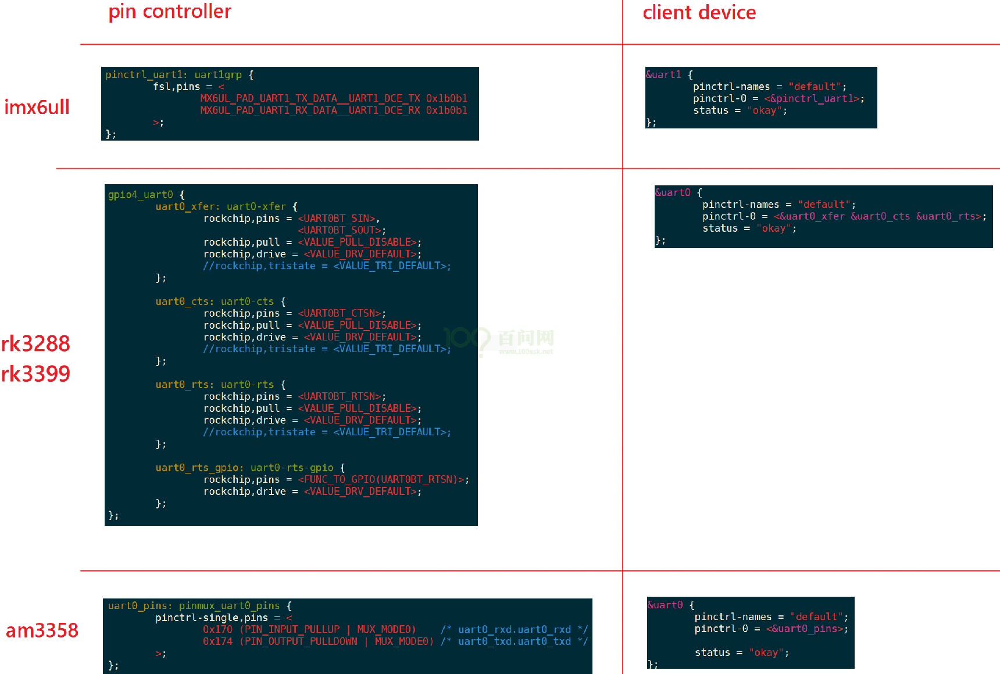

# Pinctrl子系统视频介绍参考资料：

* Linux 5.x内核文档
    * Documentation\devicetree\bindings\pinctrl\pinctrl-bindings.txt
* Linux 4.x内核文档
    * Documentation\pinctrl.txt
    * Documentation\devicetree\bindings\pinctrl\pinctrl-bindings.txt

## 1. Pinctrl作用

- 

Pinctrl: Pin Controller, 顾名思义, 就是用来控制引脚的:

* 引脚枚举与命名(Enumerating and naming)
* 引脚复用(Multiplexing): 比如用作GPIO, I2C或其他功能
* 引脚配置(Configuration): 比如上拉, 下来, open drain, 驱动强度等

Pinctrl驱动由芯片厂家的BSP工程师提供, 一般的驱动工程师只需要在设备树里:

* 指明使用那些引脚
* 复用为哪些功能
* 配置为哪些状态

在一般的设备驱动程序里, 甚至可以没有pinctrl的代码.

对于一般的驱动工程师, 只需要知道"怎么使用pinctrl"即可.

## 2. 内容

* 基于使用的角度驱动工程师要掌握的Pinctrl重要概念

* Pinctrl子系统使用示例

* 主要数据结构与调试方法

* pincontroller的数据结构构造过程情景分析

    * 根据开发板的设备树信息动态地演示

* client端的数据结构构造过程情景分析

    * 根据开发板的设备树信息动态地演示

* 编写一个虚拟的pincontroller驱动程序

# Pinctrl子系统重要概念

## 引入

无论是哪种芯片, 都有类似下图的结构:

- 

要想让pinA, B用于GPIO, 需要设置IOMUX让它们连接到GPIO模块;

要想让pinA, B用于I2C, 需要设置IOMUX让它们连接到I2C模块.

所以GPIO, I2C应该是并列的关系, 它们能够使用之前, 需要设置IOMUX. 有时候并不仅仅是设置IOMUX, 还要配置引脚, 比如上拉, 下拉, 开漏等等.

现在的芯片动辄几百个引脚, 在使用到GPIO功能时, 让你一个引脚一个引脚去找对应的寄存器, 这要疯掉. 术业有专攻, 这些累活就让芯片厂家做吧──他们是BSP工程师. 我们在他们的基础上开发, 我们是驱动工程师. 开玩笑的, BSP工程师是更懂他自家的芯片, 但是如果驱动工程师看不懂他们的代码, 那你的进步也有限啊.

所以, 要把引脚的复用, 配置抽出来, 做成Pinctrl子系统, 给GPIO, I2C等模块使用.

BSP工程师要做什么? 看下图:

- 

等BSP工程师在GPIO子系统, Pinctrl子系统中把自家芯片的支持加进去后, 我们就可以非常方便地使用这些引脚了: 点灯简直太简单了. 

等等, GPIO模块在图中跟I2C不是并列的吗? 干嘛在讲Pinctrl时还把GPIO子系统拉进来? 

大多数的芯片, 没有单独的IOMUX模块, 引脚的复用, 配置等等, 就是在GPIO模块内部实现的.

在硬件上GPIO和Pinctrl是如此密切相关, 在软件上它们的关系也非常密切.

所以这2个子系统我们一起看.

## 重要概念

从设备树开始学习Pintrl会比较容易.

主要参考文档是: 内核Documentation\devicetree\bindings\pinctrl\pinctrl-bindings.txt

这会涉及2个对象: pin controller, client device。

前者提供服务: 可以用它来复用引脚, 配置引脚。

后者使用服务: 声明自己要使用哪些引脚的哪些功能, 怎么配置它们.

a. pin controller:

- 在芯片手册里你找不到pin controller, 它是一个软件上的概念, 你可以认为它对应IOMUX──用来复用引脚, 还可以配置引脚(比如上下拉电阻等).
- 注意, pin controller和GPIO Controller不是一回事, 前者控制的引脚可用于GPIO功能, I2C功能; 后者只是把引脚配置为输入, 输出等简单的功能. 即先用pin controller把引脚配置为GPIO, 再用GPIO Controler把引脚配置为输入或输出.

b. client device

- “客户设备”, 谁的客户? Pinctrl系统的客户, 那就是使用Pinctrl系统的设备, 使用引脚的设备. 它在设备树里会被定义为一个节点, 在节点里声明要用哪些引脚.
- 下面这个图就可以把几个重要概念理清楚:
- 

上图中, 左边是pin controller节点, 右边是client device节点:

- a. pin state:
    - 对于一个"client device"来说, 比如对于一个UART设备, 它有多个"状态": default, sleep等, 那对应的引脚也有这些状态.
    - 怎么理解?
    - 比如默认状态下, UART设备是工作的, 那么所用的引脚就要复用为UART功能.
    - 在休眠状态下, 为了省电, 可以把这些引脚复用为GPIO功能; 或者直接把它们配置输出高电平.
    - 上图中, pinctrl-names里定义了2种状态: default, sleep.
    - 第0种状态用到的引脚在pinctrl-0中定义, 它是state_0_node_a, 位于pincontroller节点中.
    - 第1种状态用到的引脚在pinctrl-1中定义, 它是state_1_node_a, 位于pincontroller节点中.
    - 当这个设备处于default状态时, pinctrl子系统会自动根据上述信息把所用引脚复用为uart0功能.
    - 当这这个设备处于sleep状态时, pinctrl子系统会自动根据上述信息把所用引脚配置为高电平.
- b. groups和function:
    - 一个设备会用到一个或多个引脚, 这些引脚就可以归为一组(group);
    - 这些引脚可以复用为某个功能: function.
    - 当然: 一个设备可以用到多组引脚, 比如A1, A2两组引脚, A1组复用为F1功能, A2组复用为F2功能.
- c. Generic pin multiplexing node和Generic pin configuration node
    - 在上图左边的pin controller节点中, 有子节点或孙节点, 它们是给client device使用的.
    - 可以用来描述复用信息: 哪组(group)引脚复用为哪个功能(function);
    - 可以用来描述配置信息: 哪组(group)引脚配置为哪个设置功能(setting), 比如上拉, 下拉等.

***注意***: pin controller节点的格式, 没有统一的标准！！每家芯片都不一样. 甚至上面的group, function关键字也不一定有, 但是概念是有的.

## 示例



## 代码中怎么引用pinctrl

这是透明的, 我们的驱动基本不用管. 当设备切换状态时, 对应的pinctrl就会被调用.

比如在platform_device和platform_driver的枚举过程中, 流程如下:

- 

当系统休眠时, 也会去设置该设备sleep状态对应的引脚, 不需要我们自己去调用代码.

非要自己调用, 也有函数:

```c
devm_pinctrl_get_select_default(struct device *dev);      // 使用"default"状态的引脚
pinctrl_get_select(struct device *dev, const char *name); // 根据name选择某种状态的引脚
pinctrl_put(struct pinctrl *p);      // 不再使用, 退出时调用
```

# Pinctrl子系统使用示例_基于IMX6ULL

参考资料：

* Linux 5.x内核文档
    * Documentation\devicetree\bindings\pinctrl\pinctrl-bindings.txt
* Linux 4.x内核文档
    * Documentation\pinctrl.txt
    * Documentation\devicetree\bindings\pinctrl\pinctrl-bindings.txt

## 1. 要做什么

- 以I2C为例:
    - 
- 查看原理图确定使用哪些引脚: 比如pinA, pinB
- 生成pincontroller设备树信息
    * 选择功能: 比如把pinA配置为I2C_SCL, 把pinB配置为I2C_SDA
    * 配置: 比如把pinA, pinB配置为open drain
- 使用pincontroller设备树信息: 比如在i2c节点里定义"pinctrl-names", "pinctrl-0"

## 2. 生成pincontroller设备树信息

生成pincontroller设备树信息, 有3中方法:

* 有些芯片有图形化的工具, 可以点点鼠标就可以配置引脚信息, 得到pincontroller中的信息
* 有些芯片, 只能看厂家给的设备树文档或者参考设备树的例子.
* 最差的就是需要阅读驱动代码才能构造设备树信息.

### 2.1 安装工具

对于IMX6ULL, 有引脚配置工具/设备树生成工具 `i.MX Pins Tool v6`:

* 打开: http://download.100ask.net/
* 找到开发板: "100ASK_IMX6ULL_PRO开发板"
* 下载开发板配套资料

### 2.2 根据原理图生成pinctrl信息

```shell
&iomuxc {
    pinctrl-names = "default";
    pinctrl-0 = <&BOARD_InitPins>;
    imx6ull-board {
        i2c1_pins: i2c1_pins {                /*!< Function assigned for the core: Cortex-A7[ca7] */
            fsl,pins = <
                MX6UL_PAD_UART4_RX_DATA__I2C1_SDA   0x000018B0
                MX6UL_PAD_UART4_TX_DATA__I2C1_SCL   0x000018B0
            >;
        };
    };
};
```

## 3. 在client节点使用pinctrl

```shell
&i2c1 {
    clock-frequency = <100000>;
    pinctrl-names = "default";
    pinctrl-0 = <&i2c1_pins>;
    status = "okay";
};
```

## 4. 使用过程

这是透明的, 我们的驱动基本不用管. 当设备切换状态时, 对应的pinctrl就会被调用.

比如在platform_device和platform_driver的枚举过程中, 流程如下:

- 