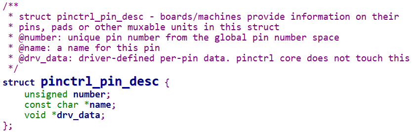
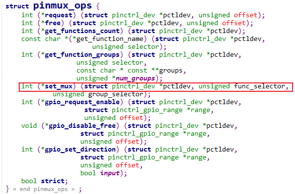
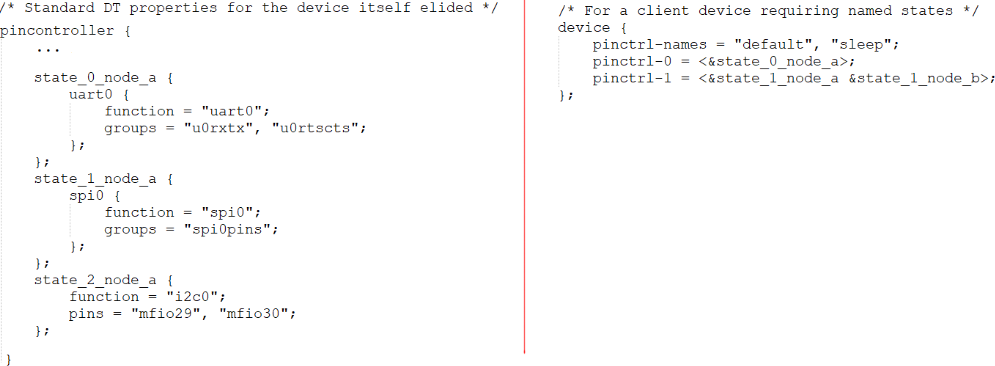
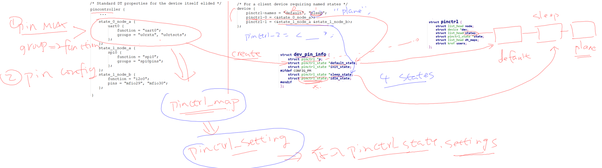
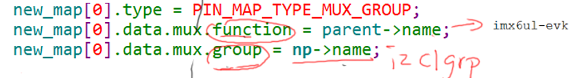

# Pinctrl子系统介绍

参考资料：

* Linux 5.x内核文档
    * Documentation\devicetree\bindings\pinctrl\pinctrl-bindings.txt
* Linux 4.x内核文档
    * Documentation\pinctrl.txt
    * Documentation\devicetree\bindings\pinctrl\pinctrl-bindings.txt

## 1. Pinctrl作用

- 

Pinctrl: Pin Controller, 顾名思义, 就是用来控制引脚的:

* `引脚枚举与命名`(Enumerating and naming)
* `引脚复用(Multiplexing)`: 比如用作GPIO, I2C或串口等 其他功能
* `引脚配置(Configuration)`: 比如上拉电阻, 下拉电阻, open drain, 驱动强度等

Pinctrl驱动由芯片厂家的BSP工程师提供, 一般的驱动工程师只需要在设备树里:

* 指明使用那些引脚
* 复用为哪些功能
* 配置为哪些状态

在一般的设备驱动程序里, 甚至可以没有pinctrl的代码.

对于一般的驱动工程师, 只需要知道"怎么使用pinctrl"即可.

## 2. 内容

* 基于使用的角度驱动工程师要掌握的Pinctrl重要概念

* Pinctrl子系统使用示例

* 主要数据结构与调试方法

* pincontroller的数据结构构造过程情景分析

    * 根据开发板的设备树信息动态地演示

* client端的数据结构构造过程情景分析

    * 根据开发板的设备树信息动态地演示

* 编写一个虚拟的pincontroller驱动程序

# Pinctrl子系统重要概念

## 引入

无论是哪种芯片, 都有类似下图的结构:

- 

要想让pinA, B 用于GPIO, 需要设置`IOMUX`让它们连接到GPIO模块;

要想让pinA, B 用于I2C, 需要设置`IOMUX`让它们连接到I2C模块.

所以GPIO, I2C应该是并列的关系, 它们能够使用之前, 需要`设置IOMUX`. 有时候并不仅仅是设置IOMUX, 还要配置引脚, 比如上拉, 下拉, 开漏等等.

现在的芯片动辄几百个引脚, 在使用到GPIO功能时, 让你一个引脚一个引脚去找对应的寄存器, 这要疯掉. 术业有专攻, 这些累活就让芯片厂家做吧──他们是BSP工程师. 我们在他们的基础上开发, 我们是驱动工程师. 开玩笑的, BSP工程师是更懂他自家的芯片, 但是如果驱动工程师看不懂他们的代码, 那你的进步也有限啊.

所以, 要`把引脚的复用, 配置抽出来, 做成Pinctrl子系统`, 给GPIO, I2C等模块使用.

BSP工程师要做什么? 看下图:

- 

等BSP工程师在GPIO子系统, Pinctrl子系统中把自家芯片的支持加进去后, 我们就可以非常方便地使用这些引脚了: 点灯简直太简单了. 

等等, GPIO模块在图中跟I2C不是并列的吗? 干嘛在讲Pinctrl时还把GPIO子系统拉进来? 

大多数的芯片, `没有单独的IOMUX模块,` 引脚的复用, 配置等等, 就是`在GPIO模块内部实现`的.

在硬件上GPIO和Pinctrl是如此密切相关, 在软件上它们的关系也非常密切.

所以这2个子系统我们一起看.

## 重要概念

从设备树开始学习Pintrl会比较容易.

主要参考文档是: 内核Documentation\devicetree\bindings\pinctrl\pinctrl-bindings.txt

这会涉及2个对象: `pin controller`, `client device`.

- 前者提供服务: 可以用它来复用引脚, 配置引脚.

- 后者使用服务: 声明自己要使用哪些引脚的哪些功能, 怎么配置它们.

- 

a. `pin controller`:

- 在芯片手册里你找不到pin controller, 它`是一个软件上的概念`, 你可以认为它对应IOMUX──用来复用引脚, 还可以配置引脚(比如上下拉电阻等).
- `注意`, pin controller和GPIO Controller不是一回事, 前者控制的引脚可用于GPIO功能, I2C功能; 后者只是把引脚配置为输入, 输出等简单的功能. 即先用pin controller把引脚配置为GPIO, 再用GPIO Controler把引脚配置为输入或输出.

b. `client device`

- "客户设备", 谁的客户? Pinctrl系统的客户, 那就是使用Pinctrl系统的设备, 使用引脚的设备. 它在设备树里会被定义为一个节点, 在节点里声明要用哪些引脚.
- 下面这个图就可以把几个重要概念理清楚:
- 
- 

上图中, 左边是`pin controller`节点, 右边是`client device`节点:

- a. `pin state`:
    - 对于一个"`client device`"来说, 比如对于一个UART设备, 它有多个"`状态`": default, sleep等, 那对应的引脚也有这些状态.
    - 怎么理解?
    - 比如`默认状态`下, UART设备是工作的, 那么`所用的引脚就要复用为UART功能`.
    - 在`休眠状态`下, 为了省电, 可以把这些`引脚复用为GPIO功能`; 或者直接把它们配置输出高电平.
    - 上图中, pinctrl-names里定义了`2种状态`: default, sleep.
    - `第0种状态`用到的引脚在`pinctrl-0`中定义, 它是`state_0_node_a`, 位于`pincontroller节点`中.
    - `第1种状态`用到的引脚在`pinctrl-1`中定义, 它是`state_1_node_a`, 位于`pincontroller节点`中.
    - 当这个`设备处于default状态`时, `pinctrl子系统`会自动根据上述信息把`所用引脚复用为uart0功能`.
    - 当这这个`设备处于sleep状态`时, `pinctrl子系统`会自动根据上述信息把`所用引脚配置为高电平`.
- b. `groups和function`:
    - 一个设备会用到一个或多个引脚, 这些引脚就可以`归为一组(group)`;
    - 这些引脚可以`复用为`某个功能: function.
    - 当然: 一个设备可以用到`多组引脚`, 比如A1, A2两组引脚, A1组复用为F1功能, A2组复用为F2功能.
- c. `Generic pin multiplexing node` 和 `Generic pin configuration node`
    - 在上图左边的pin controller节点中, 有子节点或孙节点, 它们是给client device使用的.
    - 可以用来`描述复用信息`: 哪组(group)引脚复用为哪个功能(function);
    - 可以用来`描述配置信息`: 哪组(group)引脚配置为哪个设置功能(setting), 比如上拉, 下拉等.

***注意***: pin controller节点的格式, 没有统一的标准！！每家芯片都不一样. 甚至上面的group, function关键字也不一定有, 但是概念是有的.

## 示例


## 代码中怎么引用pinctrl

这是透明的, 我们的驱动基本不用管. 当设备切换状态时, 对应的pinctrl就会被调用.

比如在platform_device和platform_driver的枚举过程中, 流程如下:

- 

当系统休眠时, 也会去设置该设备sleep状态对应的引脚, 不需要我们自己去调用代码.

非要自己调用, 也有函数:

```c
devm_pinctrl_get_select_default(struct device *dev);      // 使用"default"状态的引脚
pinctrl_get_select(struct device *dev, const char *name); // 根据name选择某种状态的引脚
pinctrl_put(struct pinctrl *p);      // 不再使用, 退出时调用
```

# Pinctrl子系统使用示例_基于IMX6ULL

参考资料：

* Linux 5.x内核文档
    * Documentation\devicetree\bindings\pinctrl\pinctrl-bindings.txt
* Linux 4.x内核文档
    * Documentation\pinctrl.txt
    * Documentation\devicetree\bindings\pinctrl\pinctrl-bindings.txt

## 1. 要做什么

- 以I2C为例:
    - 
- 查看原理图确定使用哪些引脚: 比如pinA, pinB
- 生成pincontroller设备树信息
    * 选择功能: 比如把pinA配置为I2C_SCL, 把pinB配置为I2C_SDA
    * 配置: 比如把pinA, pinB配置为open drain
- 使用pincontroller设备树信息: 比如在i2c节点里定义"pinctrl-names", "pinctrl-0"

## 2. 生成pincontroller设备树信息

生成pincontroller设备树信息, 有3中方法:

* 有些芯片有图形化的工具, 可以点点鼠标就可以配置引脚信息, 得到pincontroller中的信息
* 有些芯片, 只能看厂家给的设备树文档或者参考设备树的例子.
* 最差的就是需要阅读驱动代码才能构造设备树信息.

### 2.1 安装工具

对于IMX6ULL, 有引脚配置工具/设备树生成工具 `i.MX Pins Tool v6`:

* 打开: http://download.100ask.net/
* 找到开发板: "100ASK_IMX6ULL_PRO开发板"
* 下载开发板配套资料

### 2.2 根据原理图生成pinctrl信息

```shell
&iomuxc {
    pinctrl-names = "default";
    pinctrl-0 = <&BOARD_InitPins>;
    imx6ull-board {
        i2c1_pins: i2c1_pins {      /*!< Function assigned for the core: Cortex-A7[ca7] */
            fsl,pins = <
                MX6UL_PAD_UART4_RX_DATA__I2C1_SDA   0x000018B0
                MX6UL_PAD_UART4_TX_DATA__I2C1_SCL   0x000018B0
            >;
        };
    };
};
```

## 3. 在client节点使用pinctrl

```shell
&i2c1 {
    clock-frequency = <100000>;
    pinctrl-names = "default";
    pinctrl-0 = <&i2c1_pins>;
    status = "okay";
};
```

## 4. 使用过程

这是透明的, 我们的驱动基本不用管. 当设备切换状态时, 对应的pinctrl就会被调用.

比如在platform_device和platform_driver的枚举过程中, 流程如下:

- 

# Pinctrl子系统主要数据结构

参考资料:

* Linux 5.x内核
    * Documentation\devicetree\bindings\pinctrl\pinctrl-bindings.txt
    * arch/arm/boot/dts/stm32mp151.dtsi
    * arch/arm/boot/dts/stm32mp157-100ask-pinctrl.dtsi  
    * arch/arm/boot/dts/stm32mp15xx-100ask.dtsi
    * drivers\pinctrl\stm32\pinctrl-stm32mp157.c
    * drivers\pinctrl\stm32\pinctrl-stm32.c
* Linux 4.x内核文档
    * Documentation\pinctrl.txt
    * Documentation\devicetree\bindings\pinctrl\pinctrl-bindings.txt
    * arch/arm/boot/dts/imx6ull-14x14-evk.dts
    * arch/arm/boot/dts/100ask_imx6ull-14x14.dts
    * drivers\pinctrl\freescale\pinctrl-imx6ul.c
    * drivers\pinctrl\freescale\pinctrl-imx.c

## 1. 设备树

### 1.1 理想模型


- 左边pincontroller会抽象成一个pinctrl_dev结构体, 右边抽象成一个device结构体. 
- device结构体中肯定有pinctrl相关的成员, 这个成员肯定会跟左边的某一个pinctrl_dev成员挂钩.

### 1.2 实际的例子

- IMX6ULL
- 
    - 这个iomuxc: iomuxc@020e0000结点就是一个pincontroller. 它会被转换成一个平台设备, 跟平台驱动匹配就会调用probe

- STM32MP157
- 

## 2. pincontroller的数据结构

记住pinctrl的`三大作用`, 有助于理解所涉及的数据结构：

* 引脚枚举与命名(Enumerating and naming)
* 引脚复用(Multiplexing): 比如用作GPIO, I2C或其他功能
* 引脚配置(Configuration): 比如上拉, 下拉, open drain, 驱动强度等

### 2.1 pinctrl_desc和pinctrl_dev

1. ***结构体引入***

pincontroller虽然是一个软件的概念, 但是它背后是有硬件支持的, 所以可以使用一个结构体来表示它: `pinctrl_dev`.

怎么构造出pinctrl_dev? 我们只需要描述它: 提供一个`pinctrl_desc`, 然后调用`pinctrl_register`就可以:

```c
struct pinctrl_dev *pinctrl_register(struct pinctrl_desc *pctldesc,
				    struct device *dev, void *driver_data);
```

怎么使用`pinctrl_desc`, `pinctrl_dev`来描述一个`pin controller`? 这两个结构体定义如下:


`pinctrl_desc`示例如下:


- `pinctrl-imx.c`:  **imx_pinctrl_probe**函数 申请一块`struct imx_pinctrl` 内存, 这个结构体里有`struct device`跟`struct pinctrl_dev` 两个指针.

- 然后申请一块 `struct pinctrl_desc` 内存. 再设置相关的值, 看上图.

2. ***作用1: 描述, 获得引脚***

- 使用结构体`pinctrl_pin_desc`来描述`一个引脚`, 一个pin controller有多个引脚:
    - 
- 注意: pins 和 npins 描述的是`单个引脚`, 用来枚举单个引脚. 
- 但是, 比如i2c 用到的2个引脚, 是一组引脚. 如何描述一组引脚呢? 用下面的pctlops. 它是`struct pinctrl_ops` 结构体, 具体看下面内容
- 使用`pinctrl_ops`来操作引脚, 主要功能有二:
    * 来取出`某组`的引脚: `get_groups_count`(有多少组引脚), `get_group_pins`(获得某一组里的引脚们)
    * 处理设备树中pin controller中的某个节点: dt_node_to_map, 把device_node转换为一系列的pinctrl_map

* 
    * 必须为`struct pinctrl_desc` 中的成员`struct pinctrl_ops *pctlops` 赋值, 也就是要提供一个pinctrl_ops结构体, 里面包含上面途中的这些函数指针类型的函数. 
    * `struct pinctrl_ops *pctlops` 就是来处理一组里的引脚的.

3. ***作用2: 引脚复用***

- 
    - `struct pinctrl_desc`结构体中还有一个成员, `struct pinmux_ops *pmxops;` 它用来把某一组引脚配置成某个功能.
    - `struct pinmux_ops`中, 比较重要的函数指针, set_mux, 把某一组引脚配置成某个功能.
    - get_functions_count: 这个设备里支持多少个功能
    - get_function_name: 获得功能名字
    - get_function_groups: 这个功能下面有多少组引脚(比如I2C 可以用AB这一组引脚, 也可以使用CD这一组).

4. ***作用3: 引脚配置***

- 
    - `struct pinctrl_desc` 结构体下另一个成员: `struct pinconf_ops *confops;`用来配置引脚. 

5. ***使用pinctrl_desc注册得到pinctrl_dev***

调用devm_pinctrl_register或pinctrl_register, 就可以根据pinctrl_desc构造出pinctrl_dev, 并且把pinctrl_dev放入链表:

```c
devm_pinctrl_register
    pinctrl_register
    	struct pinctrl_dev *pctldev;
		pctldev = kzalloc(sizeof(*pctldev), GFP_KERNEL);

		pctldev->owner = pctldesc->owner;
		pctldev->desc = pctldesc;
		pctldev->driver_data = driver_data;

		/* check core ops for sanity */
		ret = pinctrl_check_ops(pctldev);

		/* If we're implementing pinmuxing, check the ops for sanity */
		ret = pinmux_check_ops(pctldev);

		/* If we're implementing pinconfig, check the ops for sanity */
		ret = pinconf_check_ops(pctldev);

		/* Register all the pins */
		ret = pinctrl_register_pins(pctldev, pctldesc->pins, pctldesc->npins);

		list_add_tail(&pctldev->node, &pinctrldev_list);
```

## 3. client的数据结构

在设备树中, 使用pinctrl时格式如下:

```shell
/* For a client device requiring named states */
device {
    pinctrl-names = "active", "idle";
    pinctrl-0 = <&state_0_node_a>;
    pinctrl-1 = <&state_1_node_a &state_1_node_b>;
};
```

设备节点要么被转换为`platform_device`, 或者`其他结构体(比如i2c_client)`, 但是里面都会有一个`device`结构体, 比如:


### 3.1 dev_pin_info

`每个device结构体`里都有一个`dev_pin_info结构体`, 用来`保存设备的pinctrl信息`:

- 
- 设备树里client使用pinctrl时, 会有多种状态, 那默认就 default, init, sleep, idle 四种状态. 如果你想`自定义其他状态`, 就会被放入 `struct pinctrl *p`里.
    - 
    -  `struct pinctrl` 结构体里有一个通用链表, 各个状态都存在这个链表里. 
    - 这里的重点就是 `struct pinctrl_state`, 设备进入某种状态时, 就是让其引脚进入某种`struct pinctrl_state`
- 那我们如何构造这个 `struct pinctrl_state` 呢?
    - 设备树里某个pinctrl 状态, 用某个pincontroller子节点表示. 所以就用pincontroller子节点来构造出pinctrl_state.
        - 

    - 那么如何处理这个设备树呢?
        - `struct pinctrl_desc` -> `struct pinctrl_ops` -> `dt_node_to_map`函数指针
        - 
        - device tree node to map 设备树中pincontroller子结点被转换成一系列 pinctrl_map 结构体,  pinctrl_map又被转换成 pinctrl_setting, pinctrl_setting 又被存入 pinctrl_state里的settings 通用链表.

### 3.2 pinctrl

假设芯片上有多个pin controller, 那么这个设备使用哪个pin controller?

这需要`通过设备树`来确定:

* 分析设备树, 找到pin controller
* `对于每个状态`, 比如default, init, 去`分析pin controller中的设备树节点`
    * 使用pin controller的`pinctrl_ops.dt_node_to_map`来处理`设备树的pinctrl节点`信息, 得到`一系列的pinctrl_map`
    * 这些`pinctrl_map`放在`pinctrl.dt_maps`链表中
    * `每个pinctrl_map`都被转换为`pinctrl_setting`, 放在对应的`pinctrl_state.settings链表`中


- 
- pincontroller的子节点有两大作用: 1. 引脚复用, 某组引脚复用为某个功能 2. 引脚配置, 如上下拉等. 1 2 两点的信息就会记录在pinctrl_map 或者 pinctrl_setting里
- `struct pinctrl_map` 中 有一个union, 其中是两个结构体, `struct pinctrl_map_mux` (引脚复用)和 `struct pinctrl_map_configs`(引脚配置)

```c
struct pinctrl_map_mux {
	const char *group;
	const char *function;
};
struct pinctrl_map_configs {
	const char *group_or_pin;
	unsigned long *configs; //用数组表示配置, 有一个或多个配置项(上拉,驱动强度等配置项)
	unsigned num_configs;
};
```

- `struct pinctrl_map`会被转换成 `struct pinctrl_settting`, 后者跟前者非常的类似.

### 3.3 pinctrl_map和pinctrl_setting

设备引用pin controller中的某个节点时, 这个节点会被转换为一些列的pinctrl_map:

* 转换为多少个pinctrl_map, 完全由具体的驱动决定
* 每个pinctrl_map, 又被转换为一个pinctrl_setting
* 举例, 设备节点里有: `pinctrl-0 = <&state_0_node_a>`
    * pinctrl-0对应一个状态, 会得到一个pinctrl_state
    * state_0_node_a节点被解析为一系列的pinctrl_map
    * 这一系列的pinctrl_map被转换为一系列的pinctrl_setting
    * 这些pinctrl_setting被放入pinctrl_state的settings链表
    
    - 
    
* 

## 4. 使用pinctrl_setting

调用过程: 

```shell
really_probe
	pinctrl_bind_pins
		pinctrl_select_state
			/* Apply all the settings for the new state */
			list_for_each_entry(setting, &state->settings, node) {
				switch (setting->type) {
				case PIN_MAP_TYPE_MUX_GROUP:
					ret = pinmux_enable_setting(setting);
							ret = ops->set_mux(...);
				break;
				case PIN_MAP_TYPE_CONFIGS_PIN:
				case PIN_MAP_TYPE_CONFIGS_GROUP:
					ret = pinconf_apply_setting(setting);
							ret = ops->pin_config_group_set(...);
					break;
				default:
					ret = -EINVAL;
				break;
			}		
```

- 


# Pincontroller构造过程情景分析_基于IMX6ULL

参考资料:

* Linux 4.x内核文档
    * Documentation\pinctrl.txt
    * Documentation\devicetree\bindings\pinctrl\pinctrl-bindings.txt
    * arch/arm/boot/dts/imx6ull-14x14-evk.dts
    * arch/arm/boot/dts/100ask_imx6ull-14x14.dts
    * drivers\pinctrl\freescale\pinctrl-imx6ul.c
    * drivers\pinctrl\freescale\pinctrl-imx.c

pincontroller节点被处理的过程. 以三大作用为主轴.

## 1. 设备树


## 2. 驱动代码执行流程

- 驱动程序位置:

```shell
drivers\pinctrl\freescale\pinctrl-imx6ul.c
drivers\pinctrl\freescale\pinctrl-imx.c
```

```c
static struct imx_pinctrl_soc_info imx6ul_pinctrl_info = {
	.pins = imx6ul_pinctrl_pads, //是一个struct pinctrl_pin_desc结构体 里面描述了很多引脚
	.npins = ARRAY_SIZE(imx6ul_pinctrl_pads),
	.gpr_compatible = "fsl,imx6ul-iomuxc-gpr",
};
static struct imx_pinctrl_soc_info imx6ull_snvs_pinctrl_info = { 
	.pins = imx6ull_snvs_pinctrl_pads, // 是struct pinctrl_pin_desc结构体
	.npins = ARRAY_SIZE(imx6ull_snvs_pinctrl_pads),
	.flags = ZERO_OFFSET_VALID,
};
static struct of_device_id imx6ul_pinctrl_of_match[] = {
	{ .compatible = "fsl,imx6ul-iomuxc", .data = &imx6ul_pinctrl_info, }, //上面struct imx_pinctrl_soc_info 
	{ .compatible = "fsl,imx6ull-iomuxc-snvs", .data = &imx6ull_snvs_pinctrl_info, }, //上面 struct imx_pinctrl_soc_info
	{ /* sentinel */ }
};
static int imx6ul_pinctrl_probe(struct platform_device *pdev)
{
	const struct of_device_id *match;
	struct imx_pinctrl_soc_info *pinctrl_info;
/*根据compatible属性, 找到对应的数组项, 取出里面的私有数据.*/
	match = of_match_device(imx6ul_pinctrl_of_match, &pdev->dev);

	if (!match)
		return -ENODEV;
/*把私有数据放到 pinctrl_info */
	pinctrl_info = (struct imx_pinctrl_soc_info *) match->data; //即 imx6ul_pinctrl_of_match 中的 .data
/*作为参数传给 imx_pinctrl_probe*/
	return imx_pinctrl_probe(pdev, pinctrl_info); //pinctrl-imx.c
}
static struct platform_driver imx6ul_pinctrl_driver = {
	.driver = {
		.name = "imx6ul-pinctrl",
		.of_match_table = of_match_ptr(imx6ul_pinctrl_of_match),
	},
	.probe = imx6ul_pinctrl_probe,
};
static int __init imx6ul_pinctrl_init(void)
{
	return platform_driver_register(&imx6ul_pinctrl_driver);
}
```

- 调用过程:

```c

imx6ul_pinctrl_probe
    imx_pinctrl_probe(pdev, pinctrl_info); /*这个函数中关键之处如下: */
        imx_pinctrl_desc->name = dev_name(&pdev->dev); 
        imx_pinctrl_desc->pins = info->pins; /*imx6ul_pinctrl_probe 拿到的参数*/
        imx_pinctrl_desc->npins = info->npins;
        imx_pinctrl_desc->pctlops = &imx_pctrl_ops;
        imx_pinctrl_desc->pmxops = &imx_pmx_ops;
        imx_pinctrl_desc->confops = &imx_pinconf_ops;
        imx_pinctrl_desc->owner = THIS_MODULE;
		
		ret = imx_pinctrl_probe_dt(pdev, info);

        ipctl->pctl = devm_pinctrl_register(&pdev->dev,
                            imx_pinctrl_desc, ipctl);
```

- 

## 3. 作用1: 描述, 获得引脚: 解析设备树

### 3.1 单个引脚

- IMX6ULL是在代码里写死了, 就是那个数组.

```c
	imx_pinctrl_desc->pins = info->pins;
	imx_pinctrl_desc->npins = info->npins;
```

可以在开发板上查看 `/sys/kernel/debug/pinctrl/`: 

```shell
/sys/kernel/debug/pinctrl/20e0000.iomuxc]# cat pins
```

- 
- 
- 然后执行 `cat pins`就可以看到支持的引脚了

### 3.2 某组引脚

- 比如i2c可以用AB一组引脚, 也可以用CD这一组引脚. 
- 获得引脚组的方法有2种, 一是代码写死, 二是从设备树获取.
- MP157用的是方法一, IMX6ULL用的是方法二

```c
static const struct pinctrl_ops imx_pctrl_ops = {
	.get_groups_count = imx_get_groups_count,
	.get_group_name = imx_get_group_name,
	.get_group_pins = imx_get_group_pins,
	.pin_dbg_show = imx_pin_dbg_show,
	.dt_node_to_map = imx_dt_node_to_map,
	.dt_free_map = imx_dt_free_map,
};
```

某组引脚中, 有哪些引脚? 这要**分析设备树**: `imx_pinctrl_probe_dt`. 从而获取引脚的组的信息

```shell
[root@100ask:/sys/kernel/debug/pinctrl/20e0000.iomuxc]# cat pingroups
```

- `/sys/kernel/debug/pinctrl/20e0000.iomuxc`  下, 有很多组, 组里有很多引脚.
    - 

- 反汇编设备树dtb文件, 就会发现它们一一对应.
    - 

- 某一组引脚比如AB, 它可以用作i2c也可以用作其他功能, 但是在imx6ull里有点奇怪.
    - 
    - 列出的function 是imx6ul-evk 开发板. 这是6ull做的不太好的地方.

### 3.3 设备树解析情景分析

分析：`imx_pinctrl_probe_dt`

```c
struct imx_pinctrl_soc_info {
	struct device *dev;
	const struct pinctrl_pin_desc *pins;
	unsigned int npins;
	struct imx_pin_reg *pin_regs;
	struct imx_pin_group *groups;
	unsigned int ngroups;
	unsigned int group_index;
	struct imx_pmx_func *functions;
	unsigned int nfunctions;
	unsigned int flags;
	const char *gpr_compatible;

	/* MUX_MODE shift and mask in case SHARE_MUX_CONF_REG */
	unsigned int mux_mask;
	u8 mux_shift;
	u32 ibe_bit;
	u32 obe_bit;
};
```

- 从上面知道6ull的function 就一个imx6ul-evk. 所以nfunctions 就是1. 具体分析在**imx_pinctrl_dt_is_flat_functions** 函数:

    - 
    - 走下面这个分支, 因为`iomuxc@020e0000`节点下只有一个子节点, 所以nfuncs = 1;  随后info**->**nfunctions = nfuncs;
    - 

- 

    - 余下代码. 从申请nfuncs(为1) 个`imx_pmx_func结构体`大小的连续内存空间开始.
    - 上面得到 flat_funcs 是false. 所以找else 分支. else分支里, 对`iomuxc@020e0000`下的`imx6ul-evk子节点`进行遍历, 看看imx6ul-evk有多少个子节点, 就是有多少个组.
    - 然后 再申请, ngroups个 imx_pin_group 结构体大小的连续内存空间.
    - 最后去解析functions. 走的是else里的分支, 对于每个子节点, 都去调用**imx_pinctrl_parse_functions**函数解析functions.

    

- **imx_pinctrl_parse_functions** 函数中:
  
    - 
    - 从第一个functions开始, 因为6ull就一个, 所以就是imx6ul-evk了.  func->name 就是imx6ul-evk. func->num_groups 就是 imx6ul-evk 下有几个组. 
    - 然后申请 num_groups 个` char *`连续内存空间. 起势地址放在func->groups. 它是个二级指针, 就是存放imx6ul-evk下各个子节点的名字, 就是"hoggrp-1", "hdmigrp"等.
    - 然后对于每个组. 都用**imx_pinctrl_parse_groups** 函数进行解析. 就是去解析 imx6ul-evk 下的某个子节点.
- **imx_pinctrl_parse_groups** 函数中:
  
    - 会先解析你有多少个引脚. 然后计算`fsl,pins` 这个属性有多大. 6ull是 用24个字节描述一个引脚, 设备树里就是6个16进制数. 每个16进制数就是4个字节.
    - 然后总size 除以每个引脚的size 就拿到引脚个数.  
    - 用 `struct imx_pin`结构体来描述单个引脚.
    - 
    - 最后解析引脚.
        - 
        - 根据设备树里的信息记录寄存器的值.

总结:


## 4.作用2: 引脚复用

## 5.作用3: 引脚配置

# client端使用pinctrl过程的情景分析_基于IMX6ULL

参考资料：
* Linux 5.x内核
  * Documentation\devicetree\bindings\pinctrl\pinctrl-bindings.txt
  * arch/arm/boot/dts/stm32mp151.dtsi
  * arch/arm/boot/dts/stm32mp157-100ask-pinctrl.dtsi  
  * arch/arm/boot/dts/stm32mp15xx-100ask.dtsi
  * drivers\pinctrl\stm32\pinctrl-stm32mp157.c
  * drivers\pinctrl\stm32\pinctrl-stm32.c

* Linux 4.x内核
  * Documentation\pinctrl.txt
  * Documentation\devicetree\bindings\pinctrl\pinctrl-bindings.txt
  * arch/arm/boot/dts/imx6ull-14x14-evk.dts
  * arch/arm/boot/dts/100ask_imx6ull-14x14.dts
  * drivers\pinctrl\freescale\pinctrl-imx6ul.c
  * drivers\pinctrl\freescale\pinctrl-imx.c

## 1. 回顾client的数据结构

在设备树中, 使用pinctrl时格式如下:


设备节点要么被转换为platform_device, 或者其他结构体(比如i2c_client), 但是里面都会有一个device结构体, 比如:


### 1.1 dev_pin_info

每个device结构体里都有一个dev_pin_info结构体，用来保存设备的pinctrl信息：


### 1.2 pinctrl

假设芯片上有多个pin controller, 那么这个设备使用哪个pin controller？

这需要通过设备树来确定: 

* 分析设备树, 找到pin controller
* 对于每个状态, 比如default, init, 去分析pin controller中的设备树节点
  * 使用pin controller的pinctrl_ops.dt_node_to_map来处理设备树的pinctrl节点信息, 得到一系列的pinctrl_map
  * 这些pinctrl_map放在pinctrl.dt_maps链表中
  * 每个pinctrl_map都被转换为pinctrl_setting，放在对应的pinctrl_state.settings链表中


### 1.3 pinctrl_map和pinctrl_setting

设备引用pin controller中的某个节点时, 这个节点会被转换为一些列的pinctrl_map:

* 转换为多少个pinctrl_map, 完全由具体的驱动决定
* 每个pinctrl_map, 又被转换为一个pinctrl_setting
* 举例, 设备节点里有: `pinctrl-0 = <&state_0_node_a>`
  * pinctrl-0对应一个状态, 会得到一个pinctrl_state
  * state_0_node_a节点被解析为一系列的pinctrl_map
  * 这一系列的pinctrl_map被转换为一系列的pinctrl_setting
  * 这些pinctrl_setting被放入pinctrl_state的settings链表


- 以i2c设备树节点为例:


- `iomuxc: iomuxc@020e0000`这个节点被构造成 `struct imx_pinctrl_soc_info`结构体. 6ull下只要imx6ul-evk 这个function
- 结构体`struct imx_pmx_func`里的 `const char **groups` 存放就是 `imx6ul-evk`下的子节点(每个子节点就是一组引脚) 的节点名, 上图是有3个节点.
- 结构体`struct imx_pin_group` 用来存放设备树中 每组引脚的信息. 其内部的 `struct imx_pin *pins` 成员用来存放, 这组引脚内部的每个引脚.
- 结构体`struct imx_pin_memmap` 用来存放 每一个引脚配置解析出来的信息.

## 2.client节点的pinctrl构造过程

### 2.1 函数调用

```shell
really_probe
	pinctrl_bind_pins
		dev->pins = devm_kzalloc(dev, sizeof(*(dev->pins)), GFP_KERNEL);
		
		dev->pins->p = devm_pinctrl_get(dev);
							pinctrl_get
								create_pinctrl(dev);
									ret = pinctrl_dt_to_map(p);
									
                                    for_each_maps(maps_node, i, map) {
	                                    ret = add_setting(p, map);
                                    }
		
		dev->pins->default_state = pinctrl_lookup_state(dev->pins->p,
					PINCTRL_STATE_DEFAULT);			
```

- 一. 设备树怎么转换成一系列的pinctrl_map
- 二. 这一系列的pinctrl_map怎么转换为一系列的pinctrl_setting

### 2.2 情景分析

1. 设备树转换为pinctrl_map

- **really_probe**函数 -> **pinctrl_bind_pins** 函数 -> **devm_pinctrl_get**函数 -> **pinctrl_get**函数 -> **create_pinctrl**函数
    - 执行**pinctrl_get**函数时, 第一次调用**find_pinctrl**(dev) 肯定返回空, 然后执行 **create_pinctrl**(dev);
        - 
    - 为上面这个设备创建pinctrl
        - 
    - `create_pinctrl`函数中, 调用 **pinctrl_dt_to_map**(p); 把设备树转换成一系列`pinctrl_map`. 然后, 对于每一个map (`for_each_maps(maps_node, i, map)`), 执行**add_setting**(p, map); 转换成`pinctrl_setting`.
    - **pinctrl_dt_to_map** 函数内: 
    - 
        - 对于每一个状态都一一处理, `propname = kasprintf(GFP_KERNEL, "pinctrl-%d", state);`取出其名 `pinctrl-0`,`pinctrl-1`等. 我们的例子里只有一个状态. 
        - prop = **of_find_property**(np, propname, &size); 然后根据其名`pinctrl-0`取出 property, 存放在`struct property`结构体里.
        - ret = **of_property_read_string_index**(np, "pinctrl-names", state, &statename); 然后会从 `pinctrl-names` 里取出每个状态的名字, 比如`pinctrl-0` 对应`default`.
        - 如上图, state = 0时, 解析的就是`pinctrl-0`, 然后config相关就是 `pinctrl-0`等于号后面 尖括号里的内容, 每个`&`号后面作为一个config. 用`dt_to_map_one_config` 来处理这些config.
    - **dt_to_map_one_config** 函数内: 
        - `ret = ops->dt_node_to_map(pctldev, np_config, &map, &num_maps);` 是最关键的一句. 这个函数用来处理 pincontroller里, 当前状态对应的那个节点, 我们的例子里, 这个函数就是为了处理`i2clgrp`这个子节点的.
        - 对于imx6ull, `ops->dt_node_to_map`对应的函数是:
        - 
        - 
        - 前面pincontroller构造过程, 已经解析了pincontroller 下面的子节点, 孙节点. 这时候肯定要去用到 对应的`struct imx_pin_group`, 包括其中指向的解析后的引脚信息. 然后去做后续处理.
        - `imx_dt_node_to_map`函数内: 先通过名字, 找到对应的group. 然后申请 map_num个 `struct pinctrl_map`结构体大小的连续内存空间. 注意: 如果有`2个引脚`, 会申请``3个struct pinctrl_map`. 第一个结构体内容 如上图中, `new_map[0]`. new_map[0]的成员意思是, 把group复用为function, 就是把 i2clgrp 复用为 imx6ul-evk.
        - 剩下2个map, 就是处理里面的引脚 配置信息了.


2. pinctrl_map转换为pinctrl_setting

- **really_probe**函数 -> **pinctrl_bind_pins** 函数 -> **devm_pinctrl_get**函数 -> **pinctrl_get**函数 -> **create_pinctrl**函数-> **add_setting** 函数
- 
- 如上图, `add_setting`函数中, 把某组引脚复用成某个功能:**pinmux_map_to_setting** , 处理引脚配置或者某组引脚配置的:**pinconf_map_to_setting**.
- 
- 之前说到, 把某组引脚复用成某个功能, 就是结构体里的成员mux.group的名字, 对应到mux.function的名字就好. 但是`struct pinctrl_setting_mux`里group跟func都是用无符号整数类型的.
- 所以需要把名字转换成整数. 用的就是 **pinmux_func_name_to_selector** 函数, 然后记录下来`setting->data.mux.func = ret;`.
- 然后`pmxops->get_function_groups` 来查看这个功能下有哪些组.
- 接下来, 判断 `struct pinctrl_map`里的group能否转换为该功能. **match_string**函数.
- 然后组的名字 转换为组的索引号. **pinctrl_get_group_selector**函数.
- 最后设置这个组 索引号. setting**->**data**.**mux.group = ret;

## 3. 切换state情景分析

### 3.1 函数调用过程

涉及pinctrl子系统的其他2个作用: 引脚复用, 引脚配置

```shell
really_probe
	pinctrl_bind_pins
		pinctrl_select_state
			/* Apply all the settings for the new state */
			list_for_each_entry(setting, &state->settings, node) {
				switch (setting->type) {
				case PIN_MAP_TYPE_MUX_GROUP:
					ret = pinmux_enable_setting(setting);
							ret = ops->set_mux(...);
				break;
				case PIN_MAP_TYPE_CONFIGS_PIN:
				case PIN_MAP_TYPE_CONFIGS_GROUP:
					ret = pinconf_apply_setting(setting);
							ret = ops->pin_config_group_set(...);
					break;
				default:
					ret = -EINVAL;
				break;
			}		
```

### 3.2 情景分析

