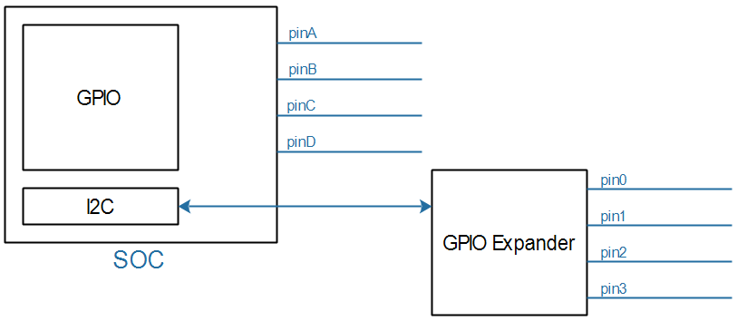
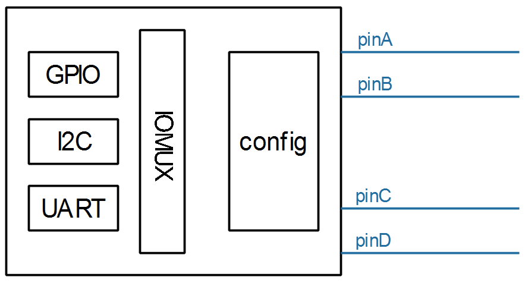

# GPIO子系统视频介绍

参考资料：

* Linux 5.x内核文档
  * Linux-5.4\Documentation\driver-api
  * Linux-5.4\Documentation\devicetree\bindings\gpio\gpio.txt
* Linux 4.x内核文档
  * Linux-4.9.88\Documentation\gpio
  * Linux-4.9.88\Documentation\devicetree\bindings\gpio\gpio.txt

## 1. GPIO子系统的作用

芯片内部有很多引脚, 这些引脚可以接到GPIO模块, 也可以接到I2C等模块.

通过Pinctrl子系统来选择引脚的功能(mux function), 配置引脚：


当一个引脚被复用为GPIO功能时, 我们可以去设置它的方向, 设置/读取它的值.

GPIO名为"General Purpose Input/Output", 通用目的输入/输出, 就是常用的引脚.

GPIO可能是芯片自带的, 也可能通过I2C, SPI接口扩展:




GPIO有一些通用功能, 通用属性.

### 1.1 通用功能

* 可以设为输出: 让它输出高低电平;
* 可以设为输入, 读取引脚当前电平;
* 可以用来触发中断

对于芯片自带的GPIO, 它的访问时很快的, 可以在获得spinlocks的情况下操作它.

但是, 对于通过I2C, SPI等接口扩展的GPIO, 访问它们时可能导致休眠, 所以这些"GPIO Expander"就不能在获得spinlocks的情况下使用.

### 1.2 通用属性

* Active-High and Active-Low

  以LED为例, 需要设置GPIO电平. 但是有些电路可能是高电平点亮LED, 有些是低电平点亮LED.

  可以使用如下代码:

  ```c
  gpiod_set_value(gpio, 1);  // 输出高电平点亮LED
  gpiod_set_value(gpio, 0);  // 输出低电平点亮LED
  ```

  对应同一个目标: 点亮LED, 对于不同的LED, 就需要不同的代码, 原因在于上面的代码中1, 0表示的是"物理值".

  如果能使用"逻辑值", 同样的逻辑值在不同的配置下输出对应的物理值, 就可以保持代码一致, 比如:

  ```c
  gpiod_set_value(gpio, 1);  // 输出逻辑1
                             // 在Active-High的情况下它会输出高电平
                             // 在Active-Low的情况下它会输出低电平
  ```

* Open Drain and Open Source

  有`多个GPIO驱动同时驱动一个电路时`, 就需要设置Open Drain或Open Source.

  * Open Drain：引脚被设置为低电平时才会驱动电路, 典型场景是I2C接口.
  * Open Source：引脚被设置为高电平时才会驱动电路

### 1.3 GPIO子系统的作用

管理GPIO, 既能支持芯片本身的GPIO, 也能支持扩展的GPIO.

提供统一的, 简便的访问接口, 实现: 输入, 输出, 中断.

## 2. 内容

* 使用GPIO子系统要掌握的重要概念
* 基于GPIO子系统的LED驱动程序
* LED驱动程序上机实验(分为多个单板)
* GPIO子系统层次与数据结构
* 具体单板上GPIO子系统源码分析(分为多个单板)
* 编写一个GPIO扩展芯片的驱动程序
* GPIO子系统与Pinctrl子系统的交互
* GPIO子系统的sysfs接口

# GPIO子系统重要概念

## 引入

要操作GPIO引脚, 先把所用引脚配置为GPIO功能, 这通过Pinctrl子系统来实现.

然后就可以根据设置引脚方向(输入还是输出), 读值──获得电平状态, 写值──输出高低电平.

以前我们通过寄存器来操作GPIO引脚, 即使LED驱动程序, 对于不同的板子它的代码也完全不同.

当BSP工程师实现了GPIO子系统后, 我们就可以:

- a. 在设备树里指定GPIO引脚

- b. 在驱动代码中:

使用GPIO子系统的标准函数获得GPIO, 设置GPIO方向, 读取/设置GPIO值.

这样的驱动代码, 将是单板无关的.

## 在设备树中指定引脚

在几乎所有ARM芯片中, GPIO都分为几组, 每组中有若干个引脚. 所以在使用GPIO子系统之前, 就要先确定: 它是哪组的? 组里的哪一个?

在设备树中, "GPIO组"就是一个GPIO Controller, 这通常都由芯片厂家设置好. 我们要做的是找到它名字, 比如"gpio1", 然后指定要用它里面的哪个引脚, 比如<&gpio1  0>.

有代码更直观, 下图是一些芯片的GPIO控制器节点, 它们一般都是厂家定义好, 在xxx.dtsi文件中:


我们暂时只需要关心里面的这2个属性：

```shell
gpio-controller;
#gpio-cells = <2>;
```

- "gpio-controller"表示这个节点是一个`GPIO Controller`, 它下面有很多引脚.
- "#gpio-cells = <2>"表示`这个控制器下每一个引脚要用2个32位的数(cell)来描述`.
- 为什么要用2个数? 其实使用多个cell来描述一个引脚, 这是GPIO Controller自己决定的. 比如可以`用其中一个cell`来表示那是哪一个引脚, `用另一个cell`来表示它是高电平有效还是低电平有效, 甚至还可以用更多的cell来示其他特性.
- 普遍的用法是, 用第1个cell来表示哪一个引脚, 用第2个cell来表示有效电平:

```shell
GPIO_ACTIVE_HIGH ： 高电平有效
GPIO_ACTIVE_LOW  :  低电平有效
```

定义GPIO Controller是芯片厂家的事, 我们怎么引用某个引脚呢? 在自己的设备节点中使用属性"[<name>-]gpios", 示例如下：

- 
- 上图中, 可以使用gpios属性, 也可以使用name-gpios属性.

## 在驱动代码中调用GPIO子系统

在设备树中指定了GPIO引脚, 在驱动代码中如何使用?

也就是GPIO子系统的接口函数是什么?

`GPIO子系统有两套接口`: 

- 基于描述符的(descriptor-based), 
- 老的(legacy). 
    - 前者的函数都有前缀“`gpiod_`”, 它`使用gpio_desc结构体`来表示一个引脚；
    - 后者的函数都有前缀“`gpio_`”, 它`使用一个整数`来表示一个引脚.

要操作一个引脚, 首先要get引脚, 然后设置方向, 读值, 写值。

驱动程序中要包含头文件:

```c
#include <linux/gpio/consumer.h>   // descriptor-based
或
#include <linux/gpio.h>            // legacy
```

下表列出常用的函数:

| descriptor-based       | legacy                | 说明 |
| ---------------------- | --------------------- | ---- |
| 获得GPIO               |                       |      |
| gpiod_get              | gpio_request          |      |
| gpiod_get_index        |                       |      |
| gpiod_get_array        | gpio_request_array    |      |
| devm_gpiod_get         |                       |      |
| devm_gpiod_get_index   |                       |      |
| devm_gpiod_get_array   |                       |      |
| 设置方向               |                       |      |
| gpiod_direction_input  | gpio_direction_input  |      |
| gpiod_direction_output | gpio_direction_output |      |
| 读值、写值             |                       |      |
| gpiod_get_value        | gpio_get_value        |      |
| gpiod_set_value        | gpio_set_value        |      |
| 释放GPIO               |                       |      |
| gpio_free              | gpio_free             |      |
| gpiod_put              | gpio_free_array       |      |
| gpiod_put_array        |                       |      |
| devm_gpiod_put         |                       |      |
| devm_gpiod_put_array   |                       |      |

- 有前缀“`devm_`”的含义是“`设备资源管理`”(Managed Device Resource), 这是`一种自动释放资源的机制`. 它的思想是“`资源是属于设备的, 设备不存在时资源就可以自动释放`”.
- 比如在Linux开发过程中, 先申请了GPIO, 再申请内存; 如果内存申请失败, 那么在返回之前就需要先释放GPIO资源. `如果使用devm的相关函数`, 在`内存申请失败时可以直接返回`: 设备的销毁函数会自动地释放已经申请了的GPIO资源.
- 建议使用“`devm_`”版本的相关函数.

举例，假设备在设备树中有如下节点：

```c
foo_device {
		compatible = "acme,foo";
		...
		led-gpios = <&gpio 15 GPIO_ACTIVE_HIGH>, /* red */
			    <&gpio 16 GPIO_ACTIVE_HIGH>, /* green */
			    <&gpio 17 GPIO_ACTIVE_HIGH>; /* blue */

		power-gpios = <&gpio 1 GPIO_ACTIVE_LOW>;
	};
```

- 那么可以使用下面的函数获得引脚:

```c
struct gpio_desc *red, *green, *blue, *power;
red = gpiod_get_index(dev, "led", 0, GPIOD_OUT_HIGH);
green = gpiod_get_index(dev, "led", 1, GPIOD_OUT_HIGH);
blue = gpiod_get_index(dev, "led", 2, GPIOD_OUT_HIGH);
power = gpiod_get(dev, "power", GPIOD_OUT_HIGH);
```

要注意的是, `gpiod_set_value`设置的值是“`逻辑值`”，不一定等于物理值。


旧的“`gpio_`”函数`没办法根据设备树信息获得引脚`, 它需要先知道`引脚号`。

引脚号怎么确定?

在GPIO子系统中, 每注册一个GPIO Controller时会确定它的“base number”, 那么这个控制器里的第n号引脚的号码就是: `base number + n`.

但是如果硬件有变化, 设备树有变化, 这个base number并不能保证是固定的, 应该`查看sysfs`来确定base number.

## sysfs中的访问方法_IMX6ULL

在sysfs中访问GPIO, 实际上用的就是`引脚号`, 老的方法.

a. 先确定某个GPIO Controller的`基准引脚号(base number)`, 再计算出某个引脚的号码. 

方法如下：

- ① 先在开发板的/sys/class/gpio目录下, 找到各个gpiochipXXX目录:
- 
- ② 然后进入某个gpiochip目录, `查看文件label的内容`
- ③ 根据label的内容`对比设备树`
- label内容来自设备树, 比如它的寄存器基地址. 用来跟设备树(dtsi文件)比较, 就可以知道这对应哪一个GPIO Controller.
- 下图是在100asK_imx6ull上运行的结果, 通过`对比设备树`可知gpiochip96对应gpio4:
- 
- 所以gpio4这组引脚的基准引脚号就是96, 这也可以“cat  base”来再次确认.

b. 基于sysfs操作引脚：

- 以100ask_imx6ull为例, 它有一个按键, 原理图如下:
- 
- 那么GPIO4_14的号码是96+14=110, 可以如下操作读取按键值:

```shell
echo  110 > /sys/class/gpio/export
echo in > /sys/class/gpio/gpio110/direction
cat /sys/class/gpio/gpio110/value
echo  110 > /sys/class/gpio/unexport
```

- ***注意***: 如果驱动程序已经使用了该引脚, 那么将会export失败, 会提示下面的错误:
- 
- 对于输出引脚. 假设引脚号为N. 可以用下面的方法设置它的值为1:

```shell
echo  N > /sys/class/gpio/export
echo out > /sys/class/gpio/gpioN/direction
echo 1 > /sys/class/gpio/gpioN/value
echo  N > /sys/class/gpio/unexport
```

## sysfs中的访问方法_STM32MP157

在sysfs中访问GPIO, 实际上用的就是引脚号, 老的方法.

a. 先确定某个GPIO Controller的基准引脚号(base number), 再计算出某个引脚的号码.

方法如下:

- ① 先在开发板的/sys/class/gpio目录下, 找到各个gpiochipXXX目录：
-  
- ② 然后进入某个gpiochip目录, 查看文件label的内容
- ③ 根据label的内容就知道它是哪组引脚
- 下图是在100ask_stm32mp157上运行的结果, 可知gpiochip96对应GPIOG:
-  
- 所以GPIOG这组引脚的基准引脚号就是96, 这也可以“cat  base”来再次确认.

b. 基于sysfs操作引脚：

- 以100ask_stm32mp157为例, 它有一个按键, 原理图如下:
-  
- 那么PG2的号码是96+2=98, 可以如下操作读取按键值:

```shell
echo 98 > /sys/class/gpio/export
echo in > /sys/class/gpio/gpio98/direction
cat /sys/class/gpio/gpio98/value
echo  98 > /sys/class/gpio/unexport
```

- ***注意***: 如果驱动程序已经使用了该引脚, 那么将会export失败, 会提示下面的错误:

-  

- 对于输出引脚, 假设引脚号为N, 可以用下面的方法设置它的值为1: 

```shell
echo  N > /sys/class/gpio/export
echo out > /sys/class/gpio/gpioN/direction
echo 1 > /sys/class/gpio/gpioN/value
echo  N > /sys/class/gpio/unexport
```

# 基于GPIO子系统的LED驱动程序

## 编写思路

- GPIO的地位跟其他模块，比如I2C、UART的地方是一样的，要使用某个引脚，需要先把引脚配置为GPIO功能，这要使用Pinctrl子系统，只需要在设备树里指定就可以。在驱动代码上不需要我们做任何事情。
- GPIO本身需要确定引脚，这也需要在设备树里指定。
- 设备树节点会被内核转换为platform_device。
- 对应的，驱动代码中要注册一个platform_driver，在probe函数中：获得引脚、注册file_operations。
- 在file_operations中：设置方向、读值/写值。

下图就是一个设备树的例子：

- 
- 

## 在设备树中添加Pinctrl信息

有些芯片提供了设备树生成工具，在GUI界面中选择引脚功能和配置信息，就可以自动生成Pinctrl子结点。把它复制到你的设备树文件中，再在client device结点中引用就可以。

有些芯片只提供文档，那就去阅读文档，一般在内核源码目录Documentation\devicetree\bindings\pinctrl下面，保存有该厂家的文档。

如果连文档都没有，那只能参考内核源码中的设备树文件，在内核源码目录arch/arm/boot/dts目录下。

最后一步，网络搜索。

Pinctrl子节点的样式如下：

- 

## 在设备树中添加GPIO信息

先查看电路原理图确定所用引脚，再在设备树中指定：添加”[name]-gpios”属性，指定使用的是哪一个GPIO Controller里的哪一个引脚，还有其他Flag信息，比如GPIO_ACTIVE_LOW等。具体需要多少个cell来描述一个引脚，需要查看设备树中这个GPIO Controller节点里的“#gpio-cells”属性值，也可以查看内核文档。

示例如下：

- 

## 编程示例

在实际操作过程中也许会碰到意外的问题，现场演示如何解决。

- a. 定义、注册一个platform_driver

- b. 在它的probe函数里：

    - b.1 根据platform_device的设备树信息确定GPIO：gpiod_get

    - b.2 定义、注册一个file_operations结构体

    - b.3 在file_operarions中使用GPIO子系统的函数操作GPIO：
        - gpiod_direction_output、gpiod_set_value

- ***好处***：这些代码对所有的板子都是完全一样的！

摘录重点内容：

- a. 注册platform_driver
- 注意下面第122行的"100ask,leddrv"，它会跟设备树中节点的compatible对应：

```c
121 static const struct of_device_id ask100_leds[] = {
122     { .compatible = "100ask,leddrv" },
123     { },
124 };
125
126 /* 1. 定义platform_driver */
127 static struct platform_driver chip_demo_gpio_driver = {
128     .probe      = chip_demo_gpio_probe,
129     .remove     = chip_demo_gpio_remove,
130     .driver     = {
131         .name   = "100ask_led",
132         .of_match_table = ask100_leds,
133     },
134 };
135
136 /* 2. 在入口函数注册platform_driver */
137 static int __init led_init(void)
138 {
139     int err;
140
141     printk("%s %s line %d\n", __FILE__, __FUNCTION__, __LINE__);
142
143     err = platform_driver_register(&chip_demo_gpio_driver);
144
145     return err;
146 }
```

- b. 在probe函数中获得GPIO
- 核心代码是第87行，它从该设备(对应设备树中的设备节点)获取名为“led”的引脚。在设备树中，必定有一属性名为“led-gpios”或“led-gpio”。

```c
77 /* 4. 从platform_device获得GPIO
78  *    把file_operations结构体告诉内核：注册驱动程序
79  */
80 static int chip_demo_gpio_probe(struct platform_device *pdev)
81 {
82      //int err;
83
84      printk("%s %s line %d\n", __FILE__, __FUNCTION__, __LINE__);
85
86      /* 4.1 设备树中定义有: led-gpios=<...>; */
87     led_gpio = gpiod_get(&pdev->dev, "led", 0);
88      if (IS_ERR(led_gpio)) {
89              dev_err(&pdev->dev, "Failed to get GPIO for led\n");
90              return PTR_ERR(led_gpio);
91      }
92
```

- c. 注册file_operations结构体：
- 这是老套路了：

```c
93      /* 4.2 注册file_operations      */
94      major = register_chrdev(0, "100ask_led", &led_drv);  /* /dev/led */
95
96      led_class = class_create(THIS_MODULE, "100ask_led_class");
97      if (IS_ERR(led_class)) {
98              printk("%s %s line %d\n", __FILE__, __FUNCTION__, __LINE__);
99              unregister_chrdev(major, "led");
100             gpiod_put(led_gpio);
101             return PTR_ERR(led_class);
102     }
103
104     device_create(led_class, NULL, MKDEV(major, 0), NULL, "100ask_led%d", 0); /* /dev/100ask_led0 */
105
```

- d. 在open函数中调用GPIO函数设置引脚方向：

```c
51 static int led_drv_open (struct inode *node, struct file *file)
52 {
53      //int minor = iminor(node);
54
55      printk("%s %s line %d\n", __FILE__, __FUNCTION__, __LINE__);
56      /* 根据次设备号初始化LED */
57      gpiod_direction_output(led_gpio, 0);
58
59      return 0;
60 }
```

- e. 在write函数中调用GPIO函数设置引脚值：

```c
34 /* write(fd, &val, 1); */
35 static ssize_t led_drv_write (struct file *file, const char __user *buf, size_t size, loff_t *offset)
36 {
37      int err;
38      char status;
39      //struct inode *inode = file_inode(file);
40      //int minor = iminor(inode);
41
42      printk("%s %s line %d\n", __FILE__, __FUNCTION__, __LINE__);
43      err = copy_from_user(&status, buf, 1);
44
45      /* 根据次设备号和status控制LED */
46      gpiod_set_value(led_gpio, status);
47
48      return 1;
49 }
```

- f. 释放GPIO：

```c
gpiod_put(led_gpio);
```

## 在100ASK_IMX6ULL上机实验

### 确定引脚并生成设备树节点

NXP公司对于IMX6ULL芯片，有设备树生成工具。

100ASK_IMX6ULL使用的LED原理图如下，可知引脚是GPIO5_3.

在设备树工具中，如下图操作：

- 

把自动生成的设备树信息，放到内核源码arch/arm/boot/dts/100ask_imx6ull-14x14.dts中，代码如下：

- a. Pinctrl信息:

```shell
&iomuxc_snvs {
……
    imx6ul-evk {    
    myled_for_gpio_subsys: myled_for_gpio_subsys{ 
            fsl,pins = <
                MX6ULL_PAD_SNVS_TAMPER3__GPIO5_IO03        0x000110A0
            >;
        };
……
}
```

- b. 设备节点信息(放在根节点下)：

```shell
myled {
	compatible = "100ask,leddrv";
	pinctrl-names = "default";
	pinctrl-0 = <&myled_for_gpio_subsys>;
	led-gpios = <&gpio5 3 GPIO_ACTIVE_LOW>;
};
```

为避免引脚冲突，还要修改arch/arm/boot/dts/100ask_imx6ull-14x14.dts，在leds节点中如下增加status属性，禁止它：

```shell
leds {
        compatible = "gpio-leds";
        pinctrl-names = "default";
        pinctrl-0 = <&pinctrl_leds>;

        status = "disabled";

        led0: cpu {
            label = "cpu";
            gpios = <&gpio5 3 GPIO_ACTIVE_LOW>;
            default-state = "on";
            linux,default-trigger = "heartbeat";
        };
    };
```

最后, 编译运行.

# GPIO子系统层次与数据结构

参考资料：

* Linux 5.x内核文档
    * Linux-5.4\Documentation\driver-api
    * Linux-5.4\Documentation\devicetree\bindings\gpio\gpio.txt
    * Linux-5.4\drivers\gpio\gpio-74x164.c
* Linux 4.x内核文档
    * Linux-4.9.88\Documentation\gpio
    * Linux-4.9.88\Documentation\devicetree\bindings\gpio\gpio.txt
    * Linux-4.9.88\drivers\gpio\gpio-74x164.c

## 1. GPIO子系统的层次

### 1.1 层次

- 
- 我们写的驱动, 用gpiod_get来获得某个引脚, 这个函数接口就是在GPIO库(gpiolib.c)实现的. 
- gpiod_set_value-> **`_gpiod_set_raw_value`** -> `chip->set ` . 这个chip->set 函数的来源就是GPIO控制器驱动那层提供的.

### 1.2 GPIOLIB向上提供的接口

| descriptor-based       | legacy                | 说明 |
| ---------------------- | --------------------- | ---- |
| 获得GPIO               |                       |      |
| gpiod_get              | gpio_request          |      |
| gpiod_get_index        |                       |      |
| gpiod_get_array        | gpio_request_array    |      |
| devm_gpiod_get         |                       |      |
| devm_gpiod_get_index   |                       |      |
| devm_gpiod_get_array   |                       |      |
| 设置方向               |                       |      |
| gpiod_direction_input  | gpio_direction_input  |      |
| gpiod_direction_output | gpio_direction_output |      |
| 读值, 写值             |                       |      |
| gpiod_get_value        | gpio_get_value        |      |
| gpiod_set_value        | gpio_set_value        |      |
| 释放GPIO               |                       |      |
| gpio_free              | gpio_free             |      |
| gpiod_put              | gpio_free_array       |      |
| gpiod_put_array        |                       |      |
| devm_gpiod_put         |                       |      |
| devm_gpiod_put_array   |                       |      |

### 1.3 GPIOLIB向下提供的接口

- 
- 向下管理多个驱动程序. 当我们创建一个gpio_chip结构体, 并完成构造之后, 就可以用这个接口来注册.

## 2. 重要的3个核心数据结构

记住GPIO Controller的要素，这有助于理解它的驱动程序：

* 一个GPIO Controller里有多少个引脚？有哪些引脚？
* 需要提供函数，设置引脚方向、读取/设置数值
* 需要提供函数，把引脚转换为中断

以Linux面向对象编程的思想，一个GPIO Controller必定会使用一个结构体来表示，这个结构体必定含有这些信息：

* GPIO引脚信息
* 控制引脚的函数
* 中断相关的函数

### 2.1 gpio_device

每个GPIO Controller用一个gpio_device来表示:

* 里面每一个gpio引脚用一个gpio_desc来表示
* gpio引脚的函数(引脚控制, 中断相关), 都放在gpio_chip里

- 

### 2.2 gpio_chip

我们并不需要自己创建gpio_device，编写驱动时`要创建的是gpio_chip`，里面提供了：

* 控制引脚的函数
* 中断相关的函数
* 引脚信息：支持多少个引脚？各个引脚的名字？

- 
- 创建这个结构体完成后, 用gpiochip_add_data来注册.

### 2.3 gpio_desc

我们去使用GPIO子系统时，首先是获得某个引脚对应的gpio_desc。

gpio_device表示一个GPIO Controller，里面支持多个GPIO。

在gpio_device中有一个gpio_desc数组，每一引脚有一项gpio_desc。

- 


- 如果有多个GPIO控制器, 那么这些控制器会放到一个链表中. 就是 gpio_device 结构体的链表.
- 第0个控制器, 里面有4个引脚, 所以会有4个gpio_desc结构体来描述这4个引脚, 这个4个结构体放在数组中. 这4个引脚的base是0. 
- 第1个控制器, 里面有32个引脚. 所以会有32个`gpio_desc`结构体, 放在一块连续内存空间中, 来描述这32个引脚. 这32个引脚的base是4, 因为跟前一个控制器里的引脚统一计数.
- 现在假设设备树里某个设备用到了GPIO1 里的第10个引脚.
    - 首先是用 `gpiod_get` 函数去从设备树获得这个引脚. 这个函数返回的是 `struct gpio_desc` 指针.
    - 内核根据设备树里的`led-gpios`中的 `&gpio1`, 找到第1个GPIO controller(从0计数)对应的 `struct gpio_device`.  再根据`10`找到 第1个控制器对应的结构体中的 `struct gpio_desc *descs` 数组中的下标为10的那一个元素.
    - 之后用 `gpiod_set_value` 函数来设置它的值. 这个函数最终调用 `gpio_chip里的 set函数指针`. set 函数指针里有个`offset 参数`, 表示的是要设置这个控制器里的第几个引脚. `struct gpio_desc`里有 `struct gpio_device *gdev`记录着此引脚所在的GPIO控制器. 通过 gpio_device找到 gpio_chip 里的函数指针. 
        - 
    - `offset参数`是由 这个结构体所在地址, 减去数组首地址得到. 这本质是`指针操作`, 实际上是 此结构体所在地址 减去 首元素结构体所在地址, 然后结果除以 结构体的size.
        - 
- 以上是新接口

老的接口:

- 
- 把gpio号, 转换成gpio_desc结构体指针. 如果gpio_request函数的第一个`参数是10`, 那么最后找到的是 GPIO1控制器里的, `第6号引脚`(从0开始), 因为所有引脚统一计数.
- 老的接口在设置值时, 一样是先把gpio号转换成gpio_desc结构体指针.
- 新老接口 寻址引脚时有些不同, 新的接口里的offset参数, 是在此引脚所在的GPIO控制器里从0开始找. 而老的接口的offset是指, 从第一个GPIO控制器开始统一计数引脚, 然后从头开始找.
    - 
    - `gpio_to_desc`: 老的接口就是所有GPIO控制器里的引脚统一计数.
        - 


gpio_device结构体保存着gpio_chip结构体的地址, gpio_chip里有各个操作函数, 来操作下面的GPIO控制器. 同时gpio_device结构体, 存放着此GPIO控制器中所有引脚的gpio_desc的数组地址. 所有核心就是gpio_device, 这个结构体在注册gpio_chip的时候由内核代码创建. 编程的核心就是gpio_chip结构体.

使用过程:

- 从设备树获取 gpio 引脚的结构体, gpio_desc. 这个结构体里保存着它所属的GPIO控制器的信息, gpio_device 结构体.  gpio_device 结构体 里又有gpio_chip 结构体指针, 可以去操作其对应的GPIO控制器硬件.

## 3. 怎么编写GPIO Controller驱动程序

`分配, 设置, 注册gpio_chip结构体`, 示例：`drivers\gpio\gpio-74x164.c`


# IMX6ULL的GPIO驱动源码分析

参考资料：

* Linux 4.x内核文档
    * Linux-4.9.88\Documentation\gpio
    * Linux-4.9.88\Documentation\devicetree\bindings\gpio\gpio.txt
    * Linux-4.9.88\drivers\gpio\gpio-mxc.c
    * Linux-4.9.88\arch\arm\boot\dts\imx6ull.dtsi

## 1. 设备树

先反汇编我们使用的设备树, 找到gpio组. 然后搜这个GPIO控制器是在哪里定义的. imx6ull.dtsi, 然后去设备树里找. 找到之后, 搜compatible属性里的值, 看看它对应的驱动程序在哪个文件.

Linux-4.9.88\arch\arm\boot\dts\imx6ull.dtsi：

```shell
aliases {
		can0 = &flexcan1;
		can1 = &flexcan2;
		ethernet0 = &fec1;
		ethernet1 = &fec2;
		gpio0 = &gpio1;
};

gpio1: gpio@0209c000 {
		compatible = "fsl,imx6ul-gpio", "fsl,imx35-gpio";
		reg = <0x0209c000 0x4000>;
		interrupts = <GIC_SPI 66 IRQ_TYPE_LEVEL_HIGH>,
					 <GIC_SPI 67 IRQ_TYPE_LEVEL_HIGH>;
		gpio-controller;
		#gpio-cells = <2>;
		interrupt-controller;
		#interrupt-cells = <2>;
};
```

GPIO控制器的设备树中，有两项是`必须的`：

* gpio-controller : 表明这是一个GPIO控制器
* gpio-cells : 指定使用多少个cell(就是整数)来描述一个引脚

当解析设备节点中的GPIO信息时, 需要用到上面的属性.

比如下面的`led-gpios`, 在`#gpio-cells = <2>`的情况下, 它表示的引脚数量是1.

```shell
myled {
	compatible = "100ask,leddrv";
	led-gpios = <&gpio1 10 GPIO_ACTIVE_LOW>;
};
```

## 2. 驱动程序

Linux-4.9.88\drivers\gpio\gpio-mxc.c

### 2.1 分配gpio_chip

```c
static int mxc_gpio_probe(struct platform_device *pdev)
{
	struct device_node *np = pdev->dev.of_node;
	struct mxc_gpio_port *port;
	struct resource *iores;
	int irq_base = 0;
	int err;

	mxc_gpio_get_hw(pdev);

	port = devm_kzalloc(&pdev->dev, sizeof(*port), GFP_KERNEL);
	if (!port)
		return -ENOMEM;
......
    err = bgpio_init(&port->gc, &pdev->dev, 4, //重要函数
			 port->base + GPIO_PSR,
			 port->base + GPIO_DR, NULL,
			 port->base + GPIO_GDIR, NULL,
			 BGPIOF_READ_OUTPUT_REG_SET);
......
    port->gc.request = mxc_gpio_request;
	port->gc.free = mxc_gpio_free;
	port->gc.parent = &pdev->dev;
	port->gc.to_irq = mxc_gpio_to_irq;
	port->gc.base = (pdev->id < 0) ? of_alias_get_id(np, "gpio") * 32 :
					     pdev->id * 32;
}
struct mxc_gpio_port {
	struct list_head node;
	struct clk *clk;
	void __iomem *base;
	int irq;
	int irq_high;
	struct irq_domain *domain;
	struct gpio_chip gc; //帮我们分配了一个gpio_chip结构体
	u32 both_edges;
	int saved_reg[6];
	bool gpio_ranges;
};
```

- - 

### 2.2 设置gpio_chip

- 
- `bgpio_init` 传入了几个寄存器作为参数, GPIO_GDIR设置GPIO引脚方向, 输出引脚的话还可以设置GPIO_DR寄存器, 控制引脚输出高电平or低电平. 
    - 若是输入引脚还可以读取GPIO_PSR寄存器(pad status), 得到引脚当前电平. 当然也可以读GPIO_DR寄存器, 但GPIO_PSR寄存器更准确. 比如你想让引脚输出高电平, 但这个引脚可能被其它电路拉低了. 你想让它输出高电平, 但实际是低电平. 这时候去读GPIO_DR寄存器, 得到的还是1, 但引脚的真实电平却是0. 所以应该读GPIO_PSR寄存器.
    - 
    - 
    - 

### 2.3 注册gpio_chip

```c
	err = devm_gpiochip_add_data(&pdev->dev, &port->gc, port);
	if (err)
		goto out_bgio;
```

- 
    - **gpiochip_add_data** (gpiolib.c)

# 编写一个虚拟GPIO控制器的驱动程序

参考资料：

* Linux 5.x内核文档

    * Linux-5.4\Documentation\driver-api
    * Linux-5.4\Documentation\devicetree\bindings\gpio\gpio.txt
    * Linux-5.4\drivers\gpio\gpio-74x164.c

* Linux 4.x内核文档

    * Linux-4.9.88\Documentation\gpio
    * Linux-4.9.88\Documentation\devicetree\bindings\gpio\gpio.txt
    * Linux-4.9.88\drivers\gpio\gpio-74x164.c

* 本章课程源码位于GIT仓库里(未调试)

    ```shell
    doc_and_source_for_drivers\IMX6ULL\source\07_GPIO\02_virtual_gpio
    doc_and_source_for_drivers\STM32MP157\source\A7\07_GPIO\02_virtual_gpio
    ```


## 1. 硬件功能

假设这个虚拟的GPIO Controller有4个引脚：

- 

## 2. 编写设备树文件

```shell
gpio_virt: virtual_gpiocontroller {
	compatible = "100ask,virtual_gpio";
    gpio-controller;
    #gpio-cells = <2>;
    ngpios = <4>;
};
```

## 3. 编写驱动程序

现场编写. 

核心: 分配/设置/注册一个gpio_chip结构体.

# 调试与使用虚拟的GPIO控制器

参考资料：

* Linux 5.x内核文档

    * Linux-5.4\Documentation\driver-api
    * Linux-5.4\Documentation\devicetree\bindings\gpio\gpio.txt
    * Linux-5.4\drivers\gpio\gpio-74x164.c

* Linux 4.x内核文档

    * Linux-4.9.88\Documentation\gpio
    * Linux-4.9.88\Documentation\devicetree\bindings\gpio\gpio.txt
    * Linux-4.9.88\drivers\gpio\gpio-74x164.c

* 本章课程源码位于GIT仓库里

    ```shell
    doc_and_source_for_drivers\IMX6ULL\source\07_GPIO\03_virtual_gpio_ok
    doc_and_source_for_drivers\STM32MP157\source\A7\07_GPIO\03_virtual_gpio_ok
    ```


## 1. 硬件功能

- 假设使用这个虚拟的`GPIO Controller`的pinA来控制LED:
    - 

## 2. 编写设备树文件

```shell
gpio_virt: virtual_gpiocontroller {
	compatible = "100ask,virtual_gpio";
    gpio-controller;
    #gpio-cells = <2>;
    ngpios = <4>;
};

myled {
	compatible = "100ask,leddrv";
	led-gpios = <&gpio_virt 0 GPIO_ACTIVE_LOW>;
};
```

## 3. 上机实验

### 3.1 设置工具链

1. STM32MP157

  **注意**: 对于STM32MP157, 以前说编译内核/驱动, 编译APP的工具链不一样, 其实编译APP用的工具链也能用来编译内核.

  ```shell
export ARCH=arm
export CROSS_COMPILE=arm-buildroot-linux-gnueabihf-
export PATH=$PATH:/home/book/100ask_stm32mp157_pro-sdk/ToolChain/arm-buildroot-linux-gnueabihf_sdk-buildroot/bin
  ```

2. IMX6ULL

  ```shell
export ARCH=arm
export CROSS_COMPILE=arm-linux-gnueabihf-
export PATH=$PATH:/home/book/100ask_imx6ull-sdk/ToolChain/gcc-linaro-6.2.1-2016.11-x86_64_arm-linux-gnueabihf/bin
  ```

### 3.2 编译, 替换设备树

1. STM32MP157

  * 修改`arch/arm/boot/dts/stm32mp157c-100ask-512d-lcd-v1.dts`, 添加如下代码:

    ```shell
    / {
        gpio_virt: virtual_gpiocontroller {
            compatible = "100ask,virtual_gpio";
            gpio-controller;
            #gpio-cells = <2>;
            ngpios = <4>;
        };
    
        myled {
            compatible = "100ask,leddrv";
            led-gpios = <&gpio_virt 2 GPIO_ACTIVE_LOW>;
        };
    };
    ```

    

  * 编译设备树：
    在Ubuntu的STM32MP157内核目录下执行如下命令,
    得到设备树文件：`arch/arm/boot/dts/stm32mp157c-100ask-512d-lcd-v1.dtb`

    ```shell
    make dtbs
    ```

  * 复制到NFS目录：

    ```shell
    $ cp arch/arm/boot/dts/stm32mp157c-100ask-512d-lcd-v1.dtb ~/nfs_rootfs/
    ```

  * 开发板上挂载NFS文件系统

    * vmware使用NAT(假设windowsIP为192.168.1.100)

        ```shell
        [root@100ask:~]# mount -t nfs -o nolock,vers=3,port=2049,mountport=9999 
        192.168.1.100:/home/book/nfs_rootfs /mnt
        ```

    * vmware使用桥接，或者不使用vmware而是直接使用服务器：假设Ubuntu IP为192.168.1.137

        ```shell
        [root@100ask:~]#  mount -t nfs -o nolock,vers=3 192.168.1.137:/home/book/nfs_rootfs /mnt
        ```

* 确定设备树分区挂载在哪里

    由于版本变化，STM32MP157单板上烧录的系统可能有细微差别。
    在开发板上执行`cat /proc/mounts`后，可以得到两种结果(见下图)：

    * mmcblk2p2分区挂载在/boot目录下(下图左边)：无需特殊操作，下面把文件复制到/boot目录即可

    * mmcblk2p2挂载在/mnt目录下(下图右边)

        * 在视频里、后面文档里，都是更新/boot目录下的文件，所以要先执行以下命令重新挂载：
            * `mount  /dev/mmcblk2p2  /boot`
        * 

    * 更新设备树

        ```shell
        [root@100ask:~]# cp /mnt/stm32mp157c-100ask-512d-lcd-v1.dtb /boot
        [root@100ask:~]# sync
        ```

    * 重启开发板

        

    2. IMX6ULL

      * 修改`arch/arm/boot/dts/100ask_imx6ull-14x14.dts`，添加如下代码：

        ```shell
        / {
            gpio_virt: virtual_gpiocontroller {
                compatible = "100ask,virtual_gpio";
                gpio-controller;
                #gpio-cells = <2>;
                ngpios = <4>;
            };
        
            myled {
                compatible = "100ask,leddrv";
                led-gpios = <&gpio_virt 2 GPIO_ACTIVE_LOW>;
            };
        };
        ```

        

      * 编译设备树：
        在Ubuntu的IMX6ULL内核目录下执行如下命令,
        得到设备树文件：`arch/arm/boot/dts/100ask_imx6ull-14x14.dtb`

        ```shell
        make dtbs
        ```

      * 复制到NFS目录：

        ```shell
        $ cp arch/arm/boot/dts/100ask_imx6ull-14x14.dtb ~/nfs_rootfs/
        ```

    * 开发板上挂载NFS文件系统

        * vmware使用NAT(假设windowsIP为192.168.1.100)

            ```shell
            [root@100ask:~]# mount -t nfs -o nolock,vers=3,port=2049,mountport=9999 
            192.168.1.100:/home/book/nfs_rootfs /mnt
            ```

        * vmware使用桥接，或者不使用vmware而是直接使用服务器：假设Ubuntu IP为192.168.1.137

            ```shell
            [root@100ask:~]#  mount -t nfs -o nolock,vers=3 192.168.1.137:/home/book/nfs_rootfs /mnt
            ```

        * 更新设备树

            ```shell
            [root@100ask:~]# cp /mnt/100ask_imx6ull-14x14.dtb /boot
            [root@100ask:~]# sync
            ```

    * 重启开发板

    

    ### 3.3 编译, 安装驱动程序

    * 编译:

        * 在Ubuntu上
        * 修改`01_led`, `02_virtual_gpio`中的Makefile, 指定内核路径`KERN_DIR`, 在执行`make`命令即可.

    * 安装：

        * 在开发板上

        * 挂载NFS，复制文件，insmod，类似如下命令：

            ```shell
            mount -t nfs -o nolock,vers=3 192.168.1.137:/home/book/nfs_rootfs /mnt
            // 对于IMX6ULL，想看到驱动打印信息，需要先执行
            echo "7 4 1 7" > /proc/sys/kernel/printk
            
            insmod -f /mnt/virtual_gpio_driver.ko
            insmod -f /mnt/leddrv.ko
            
            ls /dev/100ask_led0
            /mnt/ledtest /dev/100ask_led0 on
            /mnt/ledtest /dev/100ask_led0 off
            ```

    * 观察内核打印的信息

    ## 4. STM32MP157上的bug

    在STM32MP157上做如下实验时：

    ```shell
    echo 509 > /sys/class/gpio/export
    echo out > /sys/class/gpio/gpio509/direction
    cat /sys/class/gpio/gpio509/value
    ```

    发现对于`value`执行一次cat操作，导致`virt_gpio_get_value`函数被调用3次，如下：

    ```shell
    cat /sys/class/gpio/gpio509/value
    [   96.283263] get pin 1, it's val = 0
    [   96.297803] get pin 1, it's val = 0
    [   96.312604] get pin 1, it's val = 0
    ```

    `cat value`这个操作, 会导致驱动`drivers/gpio/gpiolib-sysfs.c`中的value_show函数被调用.

    value_show只会调用一次GPIO Controller中的get函数.

    所以, 我们编写了一个read.c程序, 源码如下:

    ```c
    #include <stdio.h>
    #include <sys/types.h>
    #include <sys/stat.h>
    #include <fcntl.h>
    #include <unistd.h>
    
    int main(int argc, char **argv)
    {
        int fd = open(argv[1], O_RDONLY);
    
        char buf[10];
    
        read(fd, buf, 10);
        printf("%s\n", buf);
        return 0;
    }
    ```

    编译read.c:

    ```shell
    arm-buildroot-linux-gnueabihf-gcc -o read read.c
    ```

    放到板子上执行，发现读取value文件一次，只会导致get函数被调用一次，如下：

    ```shell
    # ./read /sys/class/gpio/gpio509/value
    [  298.663613] get pin 1, it's val = 0
    1
    ```

    所以：问题在于cat命令, 虽然我们执行了一次cat操作, 但是它发起了3次读value文件的操作。

    至于cat的bug在哪, 无关紧要, 先不花时间去查.
