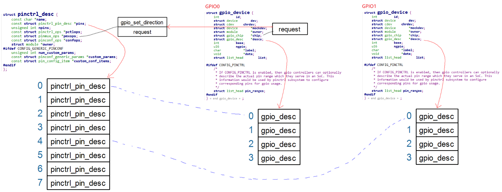

# GPIO子系统与Pinctrl子系统的交互

参考资料：

* Linux 5.x内核文档
    * Linux-5.4\Documentation\driver-api
    * Linux-5.4\Documentation\devicetree\bindings\gpio\gpio.txt
    * Linux-5.4\drivers\gpio\gpio-74x164.c

* Linux 4.x内核文档
    * Linux-4.9.88\Documentation\gpio
    * Linux-4.9.88\Documentation\devicetree\bindings\gpio\gpio.txt
    * Linux-4.9.88\drivers\gpio\gpio-74x164.c

## 1. 使用GPIO前应该设置Pinctrl

假设使用这个虚拟的GPIO Controller的pinA来控制LED:

- 

要使用pinA来控制LED, 首先要通过Pinctrl子系统把它设置为GPIO功能, 然后才能设置它为输出引脚, 设置它的输出值.

所以在设备树文件里, 应该添加Pinctrl的内容:

```shell
virtual_pincontroller {
	compatible = "100ask,virtual_pinctrl";
	myled_pin: myled_pin {
			functions = "gpio";
			groups = "pin0";
			configs = <0x11223344>;
	};
};

gpio_virt: virtual_gpiocontroller {
	compatible = "100ask,virtual_gpio";
    gpio-controller;
    #gpio-cells = <2>;
    ngpios = <4>;
};

myled {
	compatible = "100ask,leddrv";
	led-gpios = <&gpio_virt 0 GPIO_ACTIVE_LOW>;
	pinctrl-names = "default";
	pinctrl-0 = <&myled_pin>;	
};
```

但是很多芯片, 并不要求在设备树中, 把引脚复用为GPIO功能.

比如STM32MP157, 在它的设备树工具`STM32CubeMX`即使把引脚配置为GPIO功能, 它也不会在设备树中出现.

原因在于: GPIO走了后门.

现实的芯片中, 并`没有Pinctrl这样的硬件`, `它的功能大部分是在GPIO模块中实现的`.

`Pinctrl是一个软件虚拟处理的概念`, 它的`实现本来就跟GPIO密切相关`.

甚至`一些引脚默认就是GPIO功能`.

按理说:

一个引脚可能被用作GPIO, 也可能被用作I2C, GPIO和I2C这些功能时相同地位的.

要用作GPIO, 需要先通过Pinctrl把引脚复用为GPIO功能.

但是`Pinctrl和GPIO关系密切`, 当你使用`gpiod_get`获得GPIO引脚时, 它就`偷偷地`通过Pinctrl把引脚复用为GPIO功能了.

## 2. GPIO和Pinctrl的映射关系

### 2.1 示例

- 

从上图可知:

* 左边的Pinctrl支持8个引脚, 在Pinctrl的内部编号为0~7
* 图中有2个GPIO控制器
    * GPIO0内部引脚编号为`0~3`, 假设在GPIO子系统中全局编号为`100~103`
    * GPIO1内部引脚编号为`0~3`, 假设在GPIO子系统中全局编号为`104~107`

* 假设我们要使用pin1_1, 应该这样做：
    * 根据GPIO1的内部编号1, 可以换算为Pinctrl子系统中的编号5
    * 使用Pinctrl的函数, 把第5个引脚配置为GPIO功能

- 
    - 要想使用某个引脚, 首先要在pinctrl子系统里找到这个引脚在pinctrl子系统里的位置. 然后用pinmux_ops 函数把这个引脚复用为GPIO功能.
    - 所以, GPIO控制器里的引脚号, 都要跟pinctrl子系统里的引脚号建立映射关系. 如上图就是GPIO0里的引脚, 映射到Pinctrl里的0到3. GPIO1里的引脚映射到Pinctrl里的4到7.
    - 如何建立映射关系呢? 在设备树里写.
        - 
        - gpio0的 0号引脚映射到pinctrl 0号引脚. 总数有4个. 
        - gpio1的 0号引脚映射到pinctrl 4号引脚. 总数有4个. 

### 2.2 数据结构

代码中如何表示 这些映射关系:

- 
- 
    - GPIO0 控制器中的引脚号从0开始, 但是在GPIO系统中的引脚编号可能被统一编为100开始的. unsigned int base就是指统一编号的引脚号.
    - unsigned int pin_base 就是`这个pinctrl控制器`里的 第几个引脚. 我们的例子是第0号引脚.
    - 这样就建立了映射.

## 3. GPIO调用Pinctrl的过程

GPIO子系统中的request函数, 用来申请某个GPIO引脚, 

它会导致Pinctrl子系统中的这2个函数之一被调用：`pmxops->gpio_request_enable`或`pmxops->request`



- 调用关系如下:

```c
gpiod_get
    gpiod_get_index
    	desc = of_find_gpio(dev, con_id, idx, &lookupflags);
		ret = gpiod_request(desc, con_id ? con_id : devname);
					ret = gpiod_request_commit(desc, label);
								if (chip->request) {
                                    ret = chip->request(chip, offset);
                                }
```

- 我们编写GPIO驱动程序时, 所设置`chip->request`函数, 一般直接调用`gpiochip_generic_request`, 它导致Pinctrl把引脚复用为GPIO功能.

```c
gpiochip_generic_request(struct gpio_chip *chip, unsigned offset)
    pinctrl_request_gpio(chip->gpiodev->base + offset)
		ret = pinctrl_get_device_gpio_range(gpio, &pctldev, &range); // gpio是引脚的全局编号

		/* Convert to the pin controllers number space */
		pin = gpio_to_pin(range, gpio);
    	
		ret = pinmux_request_gpio(pctldev, range, pin, gpio);
					ret = pin_request(pctldev, pin, owner, range);
```

- Pinctrl子系统中的pin_request函数就会把引脚配置为GPIO功能:

```c
static int pin_request(struct pinctrl_dev *pctldev,
		       int pin, const char *owner,
		       struct pinctrl_gpio_range *gpio_range)
{
    const struct pinmux_ops *ops = pctldev->desc->pmxops;
    
	/*
	 * If there is no kind of request function for the pin we just assume
	 * we got it by default and proceed.
	 */
	if (gpio_range && ops->gpio_request_enable)
		/* This requests and enables a single GPIO pin */
		status = ops->gpio_request_enable(pctldev, gpio_range, pin);
	else if (ops->request)
		status = ops->request(pctldev, pin);
	else
		status = 0;
}
```

## 4. 我们要做什么

如果不想在使用GPIO引脚时, 在设备树中设置Pinctrl信息, 

如果想让GPIO和Pinctrl之间建立联系, 

我们需要做这些事情:

### 4.1 表明GPIO和Pinctrl间的联系

在GPIO设备树中使用`gpio-ranges`来描述它们之间的联系：

  * GPIO系统中有引脚号

  * Pinctrl子系统中也有自己的引脚号

  * 2个号码要建立映射关系

  * 在GPIO设备树中使用如下代码建立映射关系

    ```shell
    // 当前GPIO控制器的0号引脚, 对应pinctrlA中的128号引脚, 数量为12
    gpio-ranges = <&pinctrlA 0 128 12>; 
    ```

### 4.2 解析这些联系

在GPIO驱动程序中, 解析跟Pinctrl之间的联系: 处理`gpio-ranges`:

  * 这不需要我们自己写代码

  * 注册gpio_chip时会自动调用

    ```c
    int gpiochip_add_data(struct gpio_chip *chip, void *data)
        status = of_gpiochip_add(chip);
    				status = of_gpiochip_add_pin_range(chip);
    
    of_gpiochip_add_pin_range
    	for (;; index++) {
    		ret = of_parse_phandle_with_fixed_args(np, "gpio-ranges", 3,
    				index, &pinspec);
    
        	pctldev = of_pinctrl_get(pinspec.np); // 根据gpio-ranges的第1个参数找到pctldev
    
            // 增加映射关系	
            /* npins != 0: linear range */
            ret = gpiochip_add_pin_range(chip,
                                         pinctrl_dev_get_devname(pctldev),
                                         pinspec.args[0],
                                         pinspec.args[1],
                                         pinspec.args[2]);
    ```

### 4.3 编程

* 在GPIO驱动程序中, 提供`gpio_chip->request`

* 在Pinctrl驱动程序中, 提供`pmxops->gpio_request_enable`或`pmxops->request`

# 编程_GPIO使用Pinctrl

参考资料：

* Linux 5.x内核文档

    * Linux-5.4\Documentation\driver-api
    * Linux-5.4\Documentation\devicetree\bindings\gpio\gpio.txt
    * Linux-5.4\drivers\gpio\gpio-74x164.c

* Linux 4.x内核文档

    * Linux-4.9.88\Documentation\gpio
    * Linux-4.9.88\Documentation\devicetree\bindings\gpio\gpio.txt
    * Linux-4.9.88\drivers\gpio\gpio-74x164.c

* 本节视频代码在GIT仓库中

    ```shell
    doc_and_source_for_drivers\IMX6ULL\source\07_GPIO\04_gpio_use_pinctrl_ok
    doc_and_source_for_drivers\STM32MP157\source\A7\07_GPIO\04_gpio_use_pinctrl_ok
    ```

    

## 1. 我们要做什么

假设使用这个虚拟的GPIO Controller的pinA来控制LED：

- 

如果不想在使用GPIO引脚时, 在设备树中设置Pinctrl信息, 

如果想让GPIO和Pinctrl之间建立联系, 

我们需要做这些事情:

### 1.1 表明GPIO和Pinctrl间的联系

在GPIO设备树中使用`gpio-ranges`来描述它们之间的`联系`：

  * GPIO系统中有引脚号

  * Pinctrl子系统中也有自己的引脚号

  * 2个号码要建立映射关系

  * 在GPIO设备树中使用如下代码建立映射关系

    ```shell
    // 当前GPIO控制器的0号引脚, 对应pinctrlA中的128号引脚, 数量为12
    gpio-ranges = <&pinctrlA 0 128 12>; 
    ```

### 1.2 解析这些联系

在GPIO驱动程序中, 解析跟Pinctrl之间的联系: 处理`gpio-ranges`:

  * 这不需要我们自己写代码

  * 注册gpio_chip时会自动调用

    ```c
    int gpiochip_add_data(struct gpio_chip *chip, void *data)
        status = of_gpiochip_add(chip);
    				status = of_gpiochip_add_pin_range(chip);
    
    of_gpiochip_add_pin_range
    	for (;; index++) {
    		ret = of_parse_phandle_with_fixed_args(np, "gpio-ranges", 3,
    				index, &pinspec);
    
        	pctldev = of_pinctrl_get(pinspec.np); // 根据gpio-ranges的第1个参数找到pctldev
    
            // 增加映射关系	
            /* npins != 0: linear range */
            ret = gpiochip_add_pin_range(chip,
                                         pinctrl_dev_get_devname(pctldev),
                                         pinspec.args[0],
                                         pinspec.args[1],
                                         pinspec.args[2]);
    ```

### 1.3 编程

* 在GPIO驱动程序中, 提供`gpio_chip->request`

* 在Pinctrl驱动程序中, 提供`pmxops->gpio_request_enable`或`pmxops->request`

## 2. 编写设备树

- 映射之前的设备树:

```shell
virtual_pincontroller {
	compatible = "100ask,virtual_pinctrl";
	myled_pin: myled_pin {
			functions = "gpio";
			groups = "pin0";
			configs = <0x11223344>;
	};
};

gpio_virt: virtual_gpiocontroller {
	compatible = "100ask,virtual_gpio";
    gpio-controller;
    #gpio-cells = <2>;
    ngpios = <4>;
};

myled {
	compatible = "100ask,leddrv";
	led-gpios = <&gpio_virt 0 GPIO_ACTIVE_LOW>;
	pinctrl-names = "default";
	pinctrl-0 = <&myled_pin>;	
};
```

- 映射之后的设备树, 我们用的是这种.

```shell
pinctrl_virt: virtual_pincontroller {
	compatible = "100ask,virtual_pinctrl"; # 不再需要在pincontroller里写pinctrl信息.不用吧pin0复用为gpio功能了
};

gpio_virt: virtual_gpiocontroller {
	compatible = "100ask,virtual_gpio";
    gpio-controller;
    #gpio-cells = <2>;
    ngpios = <4>;
    gpio-ranges = <&pinctrl_virt 0 0 4>; # 映射
};

myled {
	compatible = "100ask,leddrv";
	led-gpios = <&gpio_virt 0 GPIO_ACTIVE_LOW>; # 也不用再写pinctrl相关信息.
};
```

## 3. 编程

### 3.1 GPIO控制器编程

- gpio_chip中提供request函数:

```c
chip->request = gpiochip_generic_request;
```

### 3.2 Pinctrl编程

```c
static const struct pinmux_ops virtual_pmx_ops = {
	.get_functions_count = virtual_pmx_get_funcs_count,
	.get_function_name = virtual_pmx_get_func_name,
	.get_function_groups = virtual_pmx_get_groups,
	.set_mux = virtual_pmx_set,
    .gpio_request_enable = virtual_pmx_gpio_request_enable,
};
```

## 4. 上机实验

### 4.1 设置工具链

1. STM32MP157

  **注意**：对于STM32MP157，以前说编译内核/驱动、编译APP的工具链不一样，其实编译APP用的工具链也能用来编译内核。

  ```shell
export ARCH=arm
export CROSS_COMPILE=arm-buildroot-linux-gnueabihf-
export PATH=$PATH:/home/book/100ask_stm32mp157_pro-sdk/ToolChain/arm-buildroot-linux-gnueabihf_sdk-buildroot/bin
  ```

2. IMX6ULL

  ```shell
export ARCH=arm
export CROSS_COMPILE=arm-linux-gnueabihf-
export PATH=$PATH:/home/book/100ask_imx6ull-sdk/ToolChain/gcc-linaro-6.2.1-2016.11-x86_64_arm-linux-gnueabihf/bin
  ```

### 4.2 编译, 替换设备树

- IMX6ULL

  * 修改`arch/arm/boot/dts/100ask_imx6ull-14x14.dts`，添加如下代码：

    ```shell
    pinctrl_virt: virtual_pincontroller {
    	compatible = "100ask,virtual_pinctrl"; # 不再需要在pincontroller里写pinctrl信息.不用吧pin0复用为gpio功能了
    };
    
    gpio_virt: virtual_gpiocontroller {
    	compatible = "100ask,virtual_gpio";
        gpio-controller;
        #gpio-cells = <2>;
        ngpios = <4>;
        gpio-ranges = <&pinctrl_virt 0 0 4>; # 映射
    };
    
    myled {
    	compatible = "100ask,leddrv";
    	led-gpios = <&gpio_virt 0 GPIO_ACTIVE_LOW>; # 也不用再写pinctrl相关信息.
    };
    ```
  
    对比之前的:
  
    ```shell
    / {
       pinctrl_virt: virtual_pincontroller {
            compatible = "100ask,virtual_pinctrl";
            myled_pin: myled_pin {
                            functions = "gpio";
                            groups = "pin0";
                            configs = <0x11223344>;
            };
            i2cgrp: i2cgrp {
                    functions = "i2c", "i2c";
                    groups = "pin0", "pin1";
                    configs = <0x11223344  0x55667788>;
            };
        };
    
        gpio_virt: virtual_gpiocontroller {
            compatible = "100ask,virtual_gpio";
            gpio-controller;
            #gpio-cells = <2>;
            ngpios = <4>;
            gpio-ranges = <&pinctrl_virt 0 0 4>; 
        };
    
        myled {
            compatible = "100ask,leddrv";
            led-gpios = <&gpio_virt 2 GPIO_ACTIVE_LOW>;
        };
    };
    ```
  
  * 编译设备树：
    在Ubuntu的IMX6ULL内核目录下执行如下命令,
    得到设备树文件:`arch/arm/boot/dts/100ask_imx6ull-14x14.dtb`
  
    ```shell
    make dtbs
    ```
  
  * 复制到NFS目录:
  
    ```shell
    $ cp arch/arm/boot/dts/100ask_imx6ull-14x14.dtb ~/nfs_rootfs/
    ```

* 开发板上挂载NFS文件系统

    * vmware使用NAT(假设windowsIP为192.168.1.100)

        ```shell
        [root@100ask:~]# mount -t nfs -o nolock,vers=3,port=2049,mountport=9999 
        192.168.1.100:/home/book/nfs_rootfs /mnt
        ```

    * vmware使用桥接，或者不使用vmware而是直接使用服务器：假设Ubuntu IP为192.168.1.137

        ```shell
        [root@100ask:~]#  mount -t nfs -o nolock,vers=3 192.168.1.137:/home/book/nfs_rootfs /mnt
        ```

    * 更新设备树

        ```shell
        [root@100ask:~]# cp /mnt/100ask_imx6ull-14x14.dtb /boot
        [root@100ask:~]# sync
        ```

* 重启开发板

### 4.3 编译, 安装驱动程序

* 编译：

    * 在Ubuntu上
    * 进入`04_gpio_use_pinctrl_ok`下的3个驱动目录, 都执行make命令

* 安装：

    * 在开发板上

    * 挂载NFS, 复制文件, insmod, 类似如下命令:

        ```shell
        mount -t nfs -o nolock,vers=3 192.168.1.137:/home/book/nfs_rootfs /mnt
        // 对于IMX6ULL，想看到驱动打印信息，需要先执行
        echo "7 4 1 7" > /proc/sys/kernel/printk
        
        insmod -f /mnt/virtual_pinctrl_driver.ko
        insmod -f /mnt/virtual_gpio_driver.ko
        insmod -f /mnt/leddrv.ko
        
        ls /dev/100ask_led0
        /mnt/ledtest /dev/100ask_led0 on
        /mnt/ledtest /dev/100ask_led0 off
        ```

* 观察内核打印的信息

    * 一装载`leddrv.ko`, 就会打印`set and enable pin pin0 as GPIO`.
    * 过程看一下:
    * leddrv.c 的 **probe** 函数中, **gpiod_get** 来获得引脚. 
        * **gpiod_get_index** 中 **of_find_gpio** 获得 引脚的`struct gpio_desc`. 若是没找到, 调用 **gpiod_find** 再找.
        * 然后 **gpiod_request** 获取引脚状态. 里面调用 **__gpiod_request** 函数来获得状态值. 
        * **`__gpiod_request`** 中, 如果我们提供了`chip->request`函数, 就会用我们提供的函数来获取. `status = chip->request(chip,gpio_chip_hwgpio(desc));`
        * chip->request 我们之前赋值`gpiochip_generic_request`. 此函数里调用**pinctrl_request_gpio**, 后者继续调用 **pinctrl_get_device_gpio_range**, **gpio_to_pin**, **pinmux_request_gpio**
        * `pinmux_request_gpio` 函数中, 调用**pin_request**, 最终会调用 我们写的 `struct pinmux_ops 结构体`中的 `gpio_request_enable`函数指针. 
        * 这个函数指针就是, 指向**virtual_pmx_gpio_request_enable** 函数, 里面打印那句话. `set and enable pin pin0 as GPIO`.

* 

    * 执行 ledtest 开灯. 就会先把引脚设置为输出, 然后设置值. 

    * 我们在设备树中, `myled节点`压根没提供pinctrl信息. 我们获得引脚的时候, `GPIO子系统`偷偷的去`调用pinctrl子系统里的函数`, 把我们的引脚`复用为GPIO功能`. 


## 5. 再次开后门

在STM32MP157的内核中, 

Pinctrl驱动中并没有提供`pmxops->gpio_request_enable`或`pmxops->request`, 

为什么也可一直接使用GPIO功能?

因为, 它的gpio_chip结构体中, 有`direction_input`, `direction_output`, 这2个函数的调用关系如下:

```c
direction_output/direction_input
    pinctrl_gpio_direction
    	ret = pinmux_gpio_direction(pctldev, range, pin, input);
					ret = ops->gpio_set_direction(pctldev, range, pin, input);
								stm32_pmx_gpio_set_direction
                                    stm32_pmx_set_mode  // 它会设置引脚为GPIO功能 这种调用不规范
```

## 6. IMX6ULL的特殊情况

IMX6ULL使用GPIO时`必须设置Pinctrl`, 如果不设置, 只有那些`默认就是GPIO功能的引脚`可以正常使用.

原因:

* GPIO控制器的设备树中, 没有`gpio-ranges`
* Pinctrl驱动中并没有提供`pmxops->gpio_request_enable`或`pmxops->request`
* gpio_chip结构体中`direction_input`, `direction_output`, 并没有配置引脚为GPIO功能

# GPIO子系统的sysfs接口

参考资料：

* Linux 5.x内核文档

    * Linux-5.4\Documentation\driver-api
    * Linux-5.4\Documentation\devicetree\bindings\gpio\gpio.txt
    * Linux-5.4\drivers\gpio\gpiolib-sysfs.c

* Linux 4.x内核文档

    * Linux-4.9.88\Documentation\gpio
    * Linux-4.9.88\Documentation\devicetree\bindings\gpio\gpio.txt
    * Linux-4.9.88\drivers\gpio\gpiolib-sysfs.c

* 本节视频代码在GIT仓库中

    ```shell
    doc_and_source_for_drivers\IMX6ULL\source\07_GPIO\04_gpio_use_pinctrl_ok
    doc_and_source_for_drivers\STM32MP157\source\A7\07_GPIO\04_gpio_use_pinctrl_ok
    ```


## 1. 驱动程序

驱动程序为`drivers\gpio\gpiolib-sysfs.c`，这里不打算分析它。

## 2. 常用的SYSFS文件

### 2.1 有哪些GPIO控制器

`/sys/bus/gpio/devices`目录下, 列出了所有的GPIO控制器, 如下表示有`11个GPIO控制器`(或者叫 GPIO Bank):

```c
/sys/bus/gpio/devices/gpiochip0
/sys/bus/gpio/devices/gpiochip1
/sys/bus/gpio/devices/gpiochip2
/sys/bus/gpio/devices/gpiochip3
/sys/bus/gpio/devices/gpiochip4
/sys/bus/gpio/devices/gpiochip5
/sys/bus/gpio/devices/gpiochip6
/sys/bus/gpio/devices/gpiochip7
/sys/bus/gpio/devices/gpiochip8
/sys/bus/gpio/devices/gpiochip9
```

- 

### 2.2 每个GPIO控制器的详细信息

`/sys/class/gpio/gpiochipXXX`下, 有这些信息:

```shell
/sys/class/gpio/gpiochip508]# ls -1
base     // 这个GPIO控制器的GPIO编号
device
label    // 名字
ngpio    // 引脚个数
power
subsystem
uevent 
```

### 2.3 查看GPIO使用情况

```shell
cat /sys/kernel/debug/gpio
```

- 
- 会列出当前在使用的所有GPIO的信息.
    - 

### 2.4 通过SYSFS使用GPIO

如果只是简单的引脚控制(比如输出, 查询输入值), 可以不编写驱动程序.

但是涉及中断的话, 就需要编写驱动程序了.

1. 确定GPIO编号

查看每个`/sys/class/gpio/gpiochipXXX`目录下的label, 确定是你要用的GPIO控制器, 也称为GPIO Bank. 注意是每个, 因为你安装了驱动程序也不能知道其引脚号.

根据它名字gpiochipXXX, 就可以知道基值是XXX.

基值加上引脚offset, 就是这个引脚的编号.

- 

2. 导出/设置方向/读写值

举例:

```shell
echo 509 > /sys/class/gpio/export
echo out > /sys/class/gpio/gpio509/direction
echo 1 > /sys/class/gpio/gpio509/value
echo 509 > /sys/class/gpio/unexport

echo 509 > /sys/class/gpio/export
echo in > /sys/class/gpio/gpio509/direction
cat /sys/class/gpio/gpio509/value
echo 509 > /sys/class/gpio/unexport
```

- 一开始没有 509 
    - 
    - 
    - 

