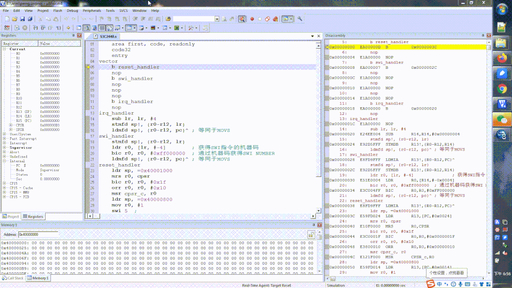

# 精简指令集结构

- Load/Store体系结构, 只能处理寄存器的数据, 需要先把数据从内存加载到寄存器中.
	- X86是mov指令用于 内存数据, 立即数 跟寄存器交互, 寄存器跟寄存器交互. 
	- ARM体系则不同, mov只能用于立即数跟寄存器的交互, 寄存器和寄存器的交互. 内存和寄存器之间, 只能通过的LDR STR指令.  任何一种体系, 都支持内存和内存之间的直接交互.
- 固定指令长度, 单周期指令
- 流水线
- 倾向于用更多的寄存器来存储数据
	- 

## ARM技术特征

ARM的成功，一方面得益于它独特的公司运作模式，另一方面，当然来自于ARM处理器自身的优良性能。作为一种先进的RISC处理器，ARM处理器有如下特点。

1. 体积小、低功耗、低成本、高性能。
2. 支持Thumb(16位）/ARM(32位）双指令集，能很好地兼容8位/16位器件。
3. 大量使用寄存器，指令执行速度更快。
4. 大多数数据操作都在寄存器中完成。
5. 寻址方式灵活简单，执行效率高。
6. 指令长度固定。此处有必要讲解一下RISC微处理器的概念及其与CISC微处理器的区别。

## ARM体系架构的发展

体系架构的定义：体系架构定义了指令集（ISA)和基于这一体系架构下处理器的编程模型。基于同种体系架构可以有多种处理器，每个处理器性能不同，所面向的应用不同，每个处理器的实现都要遵循这一体系结构。ARM体系架构为嵌入系统发展商提供很高的系统性能，同时保持优异的功耗和效率。

ARM体系架构为满足ARM合作者及设计领域的一般需求正稳步发展。目前，ARM体系架构共定义了8个版本，从版本1到版本8,ARM体系的指令集功能不断扩大，不同系列的ARM处理器，性能差别很大，应用范围和对象也不尽相同，但是，如果是相同的ARM体系架构，那么基于它们的应用软件是兼容的。

下面我们简单介绍下 V7/V8架构。

### v7架构

ARMv7架构是在ARMv6架构的基础上诞生的。该架构采用了Thumb-2技术，它是在ARM的Thumb代码压缩技术的基础上发展起来的，并且保持了对现存ARM解决方案的完整的代码兼容性。Thumb-2技术比纯32位代码少使用31%的内存，减小了系统开销，同时能够提供比已有的基于Thumb技术的解决方案高出38%的性能。ARMV7架构还采用了NEON技术，将DSP和媒体处理能力提高了近4倍。并支持改良的浮点运算，满足下一代3D图形、游戏物理应用及传统嵌入式控制应用的需求。

### v8架构

ARMv8架构是在32位ARM架构上进行开发的，将被首先用于对扩展虚拟地址和64位数据处理技术有更高要求的产品领域，如企业应用、高档消费电子产品。ARMv8架构包含两个执行状态：AArch64和AArch32。AArch64执行状态针对64位处理技术，引入了一个全新指令集A64,可以存取大虚拟地址空间；而AArch32执行状态将支持现有的ARM指令集。目前的ARMv7架构的主要特性都将在ARMv8架构中得以保留或进一步拓展，如TrustZone技术、虚拟化技术及NEON advanced SIMD技术等。

# ARM 指令集与RISC的差异

- 桶形移位寄存器: 单周期内完成数据的各种移位操作
- 并非所有arm指令都是单周期
- Thumb指令集: 32位arm指令集的压缩形式, 提高代码密度
- 条件执行: 减少了分支指令数目, 提高代码密度
- 增加DSP指令

# ARM 微处理器架构

ARM内核采用RISC体系架构。ARM体系架构的主要特征如下。

1. 采用大量的寄存器，它们都可以用于多种用途。
2. 采用Load/Store体系架构。
3. 每条指令都条件执行。
4. 采用多寄存器的Load/Store指令。
5. 能够在单时钟周期执行的单条指令内完成一项普通的移位操作和一项普通的ALU操作。
6. 通过协处理器指令集来扩展ARM指令集，包括在编程模式中增加了新的寄存器和数据类型。
7. 如果把Thumb指令集也当做ARM体系架构的一部分，那么在Thumb体系架构中还可以高密度16位压缩形式表示指令集。

# ARM/Thumb指令体系的命名


# ARM处理器系列

ARM7 ARM9 ARM9E ARM10E  SecurCore  Intel的Xscale  Intel的StrongARM

# ARM11之前的处理器和指令集架构

- ARM11芯片之前，每一个芯片对应的架构关系如下：
- 

# ARM11之后处理器和指令集架构

ARM11芯片之后，也就是从ARMv7架构开始，ARM的命名方式有所改变。

新的处理器家族，改以Cortex命名，并分为三个系列，分别是Cortex-A，Cortex-R，Cortex-M。

很巧合，又是这三个字母**A、R、M**。


## Cortex-A系列（A：Application）

针对日益增长的消费娱乐和无线产品设计，用于具有高计算要求、运行丰富操作系统及提供交互媒体和图形体验的应用领域，如智能手机、平板电脑、汽车娱乐系统、数字电视，智能本、电子阅读器、家用网络、家用网关和其他各种产品。。

## Cortex-R系列 （R：Real-time）

针对需要运行实时操作的系统应用，面向如汽车制动系统、动力传动解决方案、大容量存储控制器等深层嵌入式实时应用。

## Cortex-M系列（M：Microcontroller）

该系列面向微控制器领域，主要针对成本和功耗敏感的应用，如智能测量、人机接口设备、汽车和工业控制系统、家用电器、消费性产品和医疗器械等。

## Cortex-SC系列（SC：SecurCore）

其实，除了上述三大系列之外，还有一个主打安全的Cortex-SC系列（SC：SecurCore），主要用于政府安全芯片。


ARM11系列包括了ARM11MPCore处理器、ARM1176处理器、ARM1156处理器、ARM1136处理器，它们是基于ARMv6架构。

ARM Cortex-A5处理器、Cortex-A7处理器、Cortex-A8处理器、Cortex-A9处理器、Cortex-A15处理器隶属于Cortex-A系列，基于ARMv7-A架构。

Cortex-A53、Cortex-A57两款处理器属于Cortex-A50系列，首次采用64位ARMv8架构。

2020年ARM最近发布了一款全新的CPU架构Cortex-A78，是基于ARMv8.2指令集。

# ARM工作模式

- Cortex-A7架构的运行模式有9种, 分别为User、Sys(System)、FIQ、IRQ、ABT(Abort)、SVC(Supervisor)、UND(Undef)、MON(Monitor)、Hyp模式

|处理器模式 |  模式编号     |    简介 |
| :-: | :-: |:-:  |
 |User mode   |  0b10000  |     非特权模式,处理器正常运行时的工作模式 |
 |FIQ mode  |     0b10001    |   快速中断模式,中断优先级比IRQ高,进入 FIQ 中断异常 |
 |IRQ mode   |    0b10010     |  一般中断模式 |
 |Supervisor mode  | 0b10011  | 超级管理员模式, 操作系统的保护模式, 复位和软中断时会进入此模式 |
 |Abort mode   |  0b10111     |   数据存取异常,指令读取拒绝会进入此模式,用于虚拟存储以及存储保护 |
 |Undefined mode  | 0b11011    |未定义指令被执行, CPU进入未定义模式 |
 |System mode   |  0b11111   |  类似用户模式, 但可以运行特权级OS任务, 如切换模式. |
 |Monitor mode  | 0b10110    |   仅限于安全扩展  |
 |Hyp mode  |   | 用于虚拟化扩展  |

- 杜春雷这本书有点老了.
	- 
	- 说明
		- 
	- 用户模式, 特权模式, 异常模式

除了User模式属于非特权模式, 其它8种处理器模式都是`特权模式`(Privileged Modes). 除了User和System, 其他的称为异常模式. (ExceptionModes) 

ARM之所以设计出这么多种模式出来，就是为了「应对CPU在运行时各种突发事件」，比如要支持正常的应用程序的运行，在运行任何一个时间点又可能发生很多异常事件，比如：关机、收到网卡信息、除数为0、访问非法内存、解析到了非法指令等等，不光要能处理这些异常还要能够从异常中再返回到原来的程序继续执行。

1. 用户模式：用户模式是用户程序的工作模式，它运行在操作系统的用户态，它没有权限去操作其它硬件资源，只能执行处理自己的数据，也不能切换到其它模式下，要想访问硬件资源或切换到其它模式只能通过软中断或产生异常。

2. 系统模式：系统模式是特权模式，不受用户模式的限制。用户模式和系统模式共用一套寄存器，操作系统在该模式下可以方便的访问用户模式的寄存器，而且操作系统的一些特权任务可以使用这个模式访问一些受控的资源。

3. 一般中断模式：一般中断模式也叫普通中断模式，用于处理一般的中断请求，通常在硬件产生中断信号之后自动进入该模式，该模式为特权模式，可以自由访问系统硬件资源。(重要)

4. 快速中断模式：快速中断模式是相对一般中断模式而言的，它是用来处理对时间要求比较紧急的中断请求，主要用于`高速数据传输及通道处理`中。

5. 管理模式：管理模式是「CPU上电后默认模式」，因此在该模式下主要用来做系统的初始化，软中断处理也在该模式下，当用户模式下的用户程序请求使用硬件资源时通过软件中断进入该模式。(重要)

6. 终止模式：中止模式用于支持虚拟内存或存储器保护，当用户程序访问非法地址，没有权限读取的内存地址时，会进入该模式，linux下编程时经常出现的segment fault通常都是在该模式下抛出返回的。

7. 未定义模式：未定义模式用于`支持硬件协处理器的软件仿真`，CPU在指令的译码阶段不能识别该指令操作时，会进入未定义模式。

8. Monitor：是为了安全而扩展出的用于执行安全监控代码的模式；也是一种特权模式

# 模式切换

ARM微处理器的运行模式可以`通过软件`改变，也可以通过`外部中断或异常处理`改变。应用程序运行在用户模式下，当处理器运行在用户模式下时，某些被保护的系统资源是不能被访问的。

- 运行模式可以`通过软件`进行任意切换, 也可以`通过中断或者异常`来进行切换. 大多数的程序都运行在用户模式, 用户模式下是不能访问系统所有资源的, 有些资源是受限的, 要想访问这些受限的资源就必须进行模式切换. 
- 但是`用户模式是不能直接进行切换的`, 用户模式下`需要借助异常`来完成模式切换, 当`要切换模式的时候, 应用程序可以产生异常`, 在`异常的处理过程中完成处理器模式切换`. 

所谓“运行模式”，可以这样简单理解：

- ① 板子上电时, CPU处于SVC模式, 它用的是SVC模式下的寄存器
- ② 程序运行时发生了中断, CPU进入IRQ模式, 它用的IRQ模式下的寄存器
- ③ CPU处理完中断, 它切换回SVC模式, 继续使用SVC模式下的寄存器
- ④ CPU发生某种异常时, 比如读取内存出错, 它会进入ABT模式, 使用ABT模式下的寄存器来处理错误. 

在某种模式下, CPU执行时使用的是这种模式的资源, 比如使用的是这组模式的寄存器. 
这样就可以免去保存上一个模式所使用的寄存器. 

# 异常（Exception）

- 指由处理器执行指令导致原来运行程序的中止，
- 异常与指令运行相关，是CPU执行程序产生的，是同步的，可分为精确异常和非精确异常。
- 异常处理遵守严格的程序顺序，不能嵌套，只有当第一个异常处理完并返回后才能处理后续的异常。

## 异常源

要进入异常模式，一定要有`异常源`，ARM规定有7种异常源：

|异常源|描述|
|---|---|
|Reset|上电时执行|
|Undef|当流水线中的某个非法指令到达执行状态时执行|
|SWI|当一个软中断指令被执行完的时候执行|
|Prefetch|当一个指令被从内存中预取时，由于某种原因而失败，如果它能到达执行状态这个异常才会产生|
|Data|如果一个预取指令试图存取一个非法的内存单元，这时异常产生|
|IRQ|通常的中断|
|FIQ|快速中断|

## 异常源与模式关系

1. 重启异常进入管理模式;
2. 快速中断请求异常进入快中断模式, 支持高速数传输及通道处理(FIQ异常响应时进入此模式);
3. 中断请求异常进入中断模式, 用于通用中断处理, (IRQ异常响应时进入此模式);
4. 预取指中止, 数据中止异常进入中止模式, 用于支持虚拟内存和/或存储器保护;
5. 未定义指令异常进入未定义模式, 支持硬件协处理器的软件仿真(未定义指令异常响应时进入此模式);
6. 软件中断, 复位异常进入管理模式, 操作系统保护代码(系统复位和软件中断响应时进入此模式);

异常发生之后，CPU必须要立刻做出响应，关于异常后面会详细讲解。

# SOC

SOC:　系统芯片是一个将计算机或其他电子系统集成单一芯片的集成电路。系统芯片可以处理数字信号、模拟信号、混合信号甚至更高频率的信号。

从狭义角度讲,它是信息系统核心的芯片集成,是将系统关键部件集成在一块芯片上; 从广义角度讲, SoC是一个微小型系统,如果说中央处理器(CPU)是大脑,那么SoC就是包括大脑、心脏、眼睛和手的系统。

## ARM base Soc

嵌入式系统中常常要使用系统芯片。系统芯片的集成规模很大，一般达到几百万门到几千万门。SOC相对比较灵活，它可以将arm架构的处理器与一些专用的外围芯片集成到一起，组成一个系统。

下图是一个典型的基于ARM架构的SOC架构图。
- 

一个典型的基于ARM的Soc架构通常包含以下几个主要部件：

1. ARM Processor core    处理器核
2. Clocks and Reset Controller   时钟和复位电路
3. Interrupt Controller   中断控制器
4. ARM Propherals  外部设备
5. GPIO
6. DMA Port
7. External Memory Interface 外部内存接口
8. On chip RAM 偏上RAM
9. AHB、APB总线

其实现有的ARM处理器如Hisi-3507、exynos-4412等处理器都是一个SOC系统，尤其是应用处理器它集成了许多外围的器件，为执行更复杂的任务、更复杂的应用提供了强大的支持。

该架构是我们理解汇编指令和编写裸机程序的基石。

当我们拿到一个新的SOC的datasheet，首先就要根据这个架构，来查看SOC的「RAM空间、时钟频率、包括哪些外部设备的控制器，各个外设控制器的操作原理，各个外设对GPIO的引脚复用情况、各个控制器的SFR地址、中断控制器是如何管理众多中断源的等等」。

## 三星 Exynos 4412

2012年初，三星正式推出了自家的首款四核移动处理器Exynos4412。

下面三星的exynos 4412的SOC。


如上图所示，exynos 4412主要包括以下模块：

1. 4（quad）个Cortex-A9处理器
2. 1MB的 L2 Cache
3. Interrupt Controller 中断控制器，管理所有的中断源
4. Interrupt Combiner 中断控制器，管理soc内的一些中断源
5. NEON ARM 架构处理器扩展结构，旨在通过加速多媒体(video/audio)编解码，用户界面，2D/3D图形及游戏来提高人对多媒体的体验
6. DRAM、Internal RAM、NAND Flash、SROM Controller 各种存储设备的控制器
7. SDIO、USB、I2C、UART、SPI等总线
8. RTC、Watchdog Timer
9. Audio Subsystem 声音子系统
10. IIS(Integrate Interface of Sound)接口 ，集成语音接口
11. Power Management电源管理
12. Multimedia Block 多媒体模块

这款新Exynos四核处理器，拥有32nm HKMG(高K金属栅极技术）制程，支持双通道LPDDR21066。三星公司已将这颗图形处理器主频由此前的266MHz提升至400MHz,新闻稿指出其会比现有的双核机型整体性能提升60%,图像处理能力提升50%。

学习ARM就必须深刻了解soc架构，官方提供的datasheet是我们学习ARM、编写驱动程序的基石，该手册内容比较多，我们并不需要每一章都掌握，用到哪个地方，我们就去学习即可。

# ARM的基本数据类型

ARM采用的是32位架构，ARM的基本数据类型有以下3种。

1. Byte:字节，8bit。
2. Halfword:半字，16bit(半字必须与2字节边界对齐）。
3. Word:字，32bit(字必须与4字节边界对齐）。存储器可以看做是序号为`0~ 2^32-1`的线性字节阵列。每一个字节都有唯一的地址。

注意：

1. ARM系统结构v4以上版本支持以上3种数据类型，v4以前版本仅支持字节和字。
2. 当将这些数据类型中的任意一种声明成unsigned类型时，n位数据值表示范围为`0~2^n-1`的非负数，通常使用二进制格式。
3. 当将这些数据类型的任意一种声明成signed类型时,n位数据值表示范围为`-2^(n-1)~2^(n-1)-1`的整数, 使用二进制的补码格式。
4. 所有数据类型指令的操作数都是`字类型`的，如“ADD r1,r0,#0x1”中的操作数“0x1”就是以字类型数据处理的。
5. Load/Store 数据传输指令可以从存储器存取传输数据，这些数据可以是字节、半字、字。加载时`自动进行字节或半字的零扩展或符号扩展`。对应的指令分别为LDR/BSTRB(字节操作）、LDRH/STRH(半字操作）、LDR/STR(字操作）。
6. ARM指令`编译后是4个字节`（与字边界对齐）；Thumb指令编译后是`2个字节`（与半字边界对齐）。

# 寄存器介绍

ARM处理器有40多个寄存器. 其中包括:
- 通用处理器 包括PC寄存器. 都是32位的
- 状态寄存器, 也都是32位的, 但目前只用了12位

## 通用寄存器

- 寄存器组
	- Cortex-A7 有 9 种运行模式，每一种运行模式都有一组与之对应的寄存器组，如下图：

 

- 浅色字体是与 User 模式所共有的寄存器，浅蓝色背景是各个模式所独有的寄存器，即在所有的模式中，低寄存器组(R0~R7)是共享同一组物理寄存器的，只是一些高寄存器组在不同的模式有自己独有的寄存器，比如 FIQ 模式下 R8~R14 是独立的物理寄存器。

- 如果某个程序处于 FIQ 模式下访问寄存器 R13(SP)，那它实际访问的是寄存器 SP_fiq
- 如果某个程序处于 SVC 模式下访问寄存器 R13(SP)，那它实际访问的是寄存器 SP_svc

各模式下独立的寄存器:

- 堆栈寄存器: R13(SP) 在子程序中R13不能用作其他用途
- 链接寄存器: R14 (LR) 保存子程序的返回地址
- FIQ模式下, 有自己的R8到R12寄存器
- SPSR: 用于保存CPSR的工作状态, 每个模式下都有一个寄存器.

- **Thumb状态下寄存器的组织方式**
	- 

9 种运行模式的寄存器合计有34个，可以分为：

1. 未备份寄存器，即 R0~R7
2. 备份寄存器，即 R8~R14
3. 程序计数器 ，即 R15
4. 程序状态寄存器

- 上面前3个又叫通用寄存器

- 未备份寄存器, 包括R0到R7.
	- 未备份寄存器指的是 R0~R7，因为在所有的运行模式下R0~R7寄存器都是同一个物理寄存器，在不同的模式下，R0~R7寄存器中的数据就会被破坏，所以R0~R7寄存器并没有被用作特殊用途。R0到R7 是没有对应的备用寄存器的. 所以叫未备份.

- 备份寄存器/分组寄存器, 包括R8到R14.
- 对于分组寄存器,它们每一次所访问的物理寄存器都与当前处理器的运行模式有关。
	- 对于备份寄存器R8到R14, 每个寄存器对应两个不同的物理寄存器. 
		- 对于R8~R12来说,每个寄存器对应2个不同的物理寄存器,当使用FIQ(快速中断模式)时,访问寄存器 R8_fiq~R12_fiq;当使用除FIQ模式以外的其他模式时,访问寄存器R8_usr~R12_usr。
		- 对于R13,R14来说,每个寄存器对应7个不同的物理寄存器,其中一个是用户模式与系统模式共用,另外6个物理寄存器对应其他6种不同的运行模式,并采用以下记号来区分不同的物理寄存器:
		- 例如使用FIQ模式下的寄存器时, R8到R14被记作 R8_fiq~R14_fiq. 
		- 用户模式下又被记作R8~R14. 这两种情况下使用的, 是不同的物理寄存器. 
		- 系统没有将这几个寄存器用于任何特殊用途, 但当中断处理非常简单, 仅仅使用R8到R14寄存器时, FIQ处理程序可以`不必执行保存和恢复中断现场的指令`, 从而使中断处理过程很快.
	- 
		- 其中mode可为:**「usr,fiq,irq,svc,abt,und，mon」**。
	- 
	- (2) 异常中断发生时, 该异常模式特定的物理R14被设置成异常模式将要返回的地址, 对于有些异常模式, R14的值可能与将返回的地址有一个常数的偏移量. 具体返回方式与上面的子程序返回方式基本相同.
	- R14也可以作为`通用寄存器用`.

- 寄存器R13（sp）
	- 在ARM指令中常用作「堆栈指针」,用户也可使用其他的寄存器作为堆栈指针,而在Thumb指令集中,某些指令强制性的要求使用R13作为堆栈指针。
	- 寄存器R13在ARM指令中常用作堆栈指针，但这只是一种习惯用法，用户也可使用其他的寄存器作为堆栈指针。而在Thumb指令集中，某些指令强制性的要求使用R13作为堆栈指针。
	- 由于处理器的每种运行模式均有自己独立的物理寄存器R13，在用户应用程序的初始化部分，一般都要初始化每种模式下的R13，使其指向该运行模式的栈空间。这样，当程序的运行进入异常模式时，可以将需要保护的寄存器放入R13所指向的堆栈，而当程序从异常模式返回时，则从对应的堆栈中恢复，采用这种方式可以保证异常发生后程序的正常执行。

-  R14（LR）链接寄存器(Link Register)
	- 当执行子程序调用指令(BL)时,R14可得到R15(程序计数器PC)的备份。
	- 在每一种运行模式下，都可用R14保存子程序的返回地址，当用BL或BLX指令调用子程序时，将PC的当前值复制给R14，执行完子程序后，又将R14的值复制回PC，即可完成子程序的调用返回。以上的描述可用指令完成。
	- 从子程序返回：
		- 方法1：`MOV PC, LR`  或者 `BX LR`
		- 方法2: 在子程序入口处使用以下指令将R14存入堆栈：`STMFD SP！,{,LR}`
			- 对应的，使用以下指令可以完成子程序返回：`LDMFD SP！,{,PC}`

- 程序计数器PC, 即R15
	- 
	- 
	- 寄存器R15用作程序计数器(PC), 在ARM状态下, 位`[1:0]`为0,位`[31:2]`用于保存PC, 在Thumb状态下, 位`[0]`为1, 位`[31:1]`用于保存PC. 
		- 比如如果pc的值是0x40008001, 那么在寻址的时候其实会查找地址0x40008000, 低2位会自动忽略掉.
	- 由于ARM体系结构采用了多级流水线技术, 对于ARM指令集而言, PC总是指向当前指令的下两条指令的地址, 即PC的值为当前指令的地址值加8个字节. 
		- `即：PC值=当前程序执行位置+8`

- R0到R12 : R0到R3用来传递函数参数. R4到R11用来保存子程序的局部变量, R12常用作调用过程中的临时寄存器.

## 状态寄存器

「CPSR」(Current Program Status Register，当前程序状态寄存器)，CPSR可在任何运行模式下被访问，它包括条件标志位、中断禁止位、当前处理器模式标志位，以及其他一些相关的控制和状态位。

每一种运行模式下又都有一个专用的物理状态寄存器，称为「SPSR」(Saved Program Status Register，备份的程序状态寄存器)，当特定的异常中断发生时，`SPSR用于保存CPSR的当前值`，从异常退出时则可由SPSR来恢复CPSR。

由于用户模式和系统模式不属于异常模式，它们没有SPSR，当在这两种模式下访问SPSR，结果是未知的。

- CPSR: 当前处理器的状态 (SPSR 的格式跟CPSR一样的)
	- 
- 

1. 条件码标志(condition code flags)「N,Z,C,V」均为条件码标志位,它们的内容可被算术或逻辑运算的结果所改变,并且可以决定某条指令是否被执行。在ARM状态下,绝大多数的指令都是有条件执行的, 在Thumb状态下,仅有分支指令是有条件执行的。

- N(bit31)：当两个有符号整数运算(补码表示)时，结果用N表示，N=1/0 表示 负数/正数或零
- Z(bit30)：Z=1表示运算结果为零, Z=0表示运行结果非零. 对于 CMP 指令，Z=1 表示进行比较的两个数大小相等
- C(bit29)：
	- 在(Come)加法指令中，当结果产生了进位，则C=1，表示无符号数运算发生上溢，其它情况下 C=0
	- 在减法指令中，当运算中发生借位，则C=0，表示无符号数运算发生下溢，其它情况下 C=1
	- 对于包含移位操作的非加/减法运算指令，C为移出值的最后一位
	- 对于其它非加/减运算指令，C 位的值通常不受影响
- V(bit28)：(oVerflow)对于加/减法运算指令，当操作数和运算结果表示为二进制的补码表示的带符号数时，V=1 表示符号位溢出，通常其他位不影响 V 位
- Q(bit27)：在ARM V5及以上版本的E系列处理器中，用Q标志位指示增强的DSP运算指令是否发生了溢出。在其它版本的处理器中，Q标志位无定义. SPSR一样的, 用于异常中断发生时备份CPSR的Q标志位
- IT`[1:0](bit26:25)` 和 IT`[7:2](bit15:bit10)` 一起组成 IT`[7:0]`，作为 IF-THEN 指令执行状态
- J(bit24) 和 T(bit5)：控制指令执行状态，表明本指令是ARM指令还是Thumb指令，如表
	- 

- GE`[3:0](bit19:16)`：SIMD 指令有效，大于或等于
- E(bit9)：大小端控制位，E=1/0 表示大/小端模式

	1. 控制位 CPSR的低8位(包括I,F,T和M`[4:0]`)称为控制位, 当发生异常中断时这些位可以被改变,如果处理器运行特权模式,这些位也可以由程序修改。

- A(bit8)：禁止异步中断位，A=1 表示禁止异步中断, 禁止不精确的数据异常
- I(bit7)：I=1/0 代表 禁止/使能 IRQ  
- F(bit6)：F=1/0 代表 禁止/使能 FIQ
- M`[4:0]`：运行模式控制位，如表
	- 
	- 
- 注意观察这5个bit的特点，最高位都是1，低4位的值则各不相同，这个很重要，要想搞清楚uboot、linux的源码，尤其是异常操作的代码，必须要知道这几个bit的值。

# 协处理器


ARM体系结构允许通过增加协处理器来扩展指令集。最常用的协处理器是用于控制片上功能的系统协处理器。

例如，控制Cache和存储管理单元MMU的CP15协处理器、设置异常向量表地址的mcr指令。

ARM支持16个协处理器，在程序执行过程中，每个协处理器忽略属于ARM处理器和其他协处理器指令，当一个协处理器硬件不能执行属于她的协处理器指令时，就会产生一个未定义的异常中断，在异常中断处理程序中，可以通过软件模拟该硬件的操作，比如，如果系统不包含向量浮点运算器，则可以选择浮点运算软件模拟包来支持向量浮点运算。

ARM协处理器指令包括如下三类：

1. 用于ARM处理器初始化ARM协处理器的数据操作
2. 用于ARM处理器的寄存器和ARM协处理器的寄存器间的数据传送操作
3. 用于在ARM协处理器的寄存器和内存单元之间传送数据

这些指令包括如下5条:

1. CDP协处理器数据操作指令
2. LDC协处理器数据读入指令
3. STC协处理器数据写入指令
4. MCR ARM寄存器到协处理器寄存器的数据传送指令
5. MRC 协处理器寄存器到ARM寄存器的数据传送指令

关于协处理器指令, 我们只需要知道几个常用的即可

# Jazelle


Jazelle杰则来 或者说Java字节码状态是为了运行Java虚拟机而添加的一种状态.

ARM的Jazelle技术在硬件上提供了对Java字节码的支持, 大大提高了系统的性能.

由于ARM 架构是32-bits, 16-bits = “halfword”, “word” = 32-bits.

Java 字节码 8-bits 独立架构的指令集. Jazelle 用硬件执行大多数的字节码(另一些使用高度优化了的ARM 代码). 这是由于折衷了硬件复杂度(功耗 & 硅片面积)和速度. 

# 指令流水线

流水线技术通过多个功能部件并行工作来缩短程序执行时间，提高处理器核的效率和吞吐率，从而成为微处理器设计中最为重要的技术之一.

## 3级流水线

到ARM7为止的ARM处理器使用简单的3级流水线, 它包括下列流水线级.
- （1）取指令 从寄存器装载一条指令。
- （2）译码（decode） 识别被执行的指令，并为下一个周期准备数据通路的控制信号。在这一级，指令占有译码逻辑，不占用数据通路。
- （3）执行 处理指令并将结果写回寄存器。
	- 

当处理器执行简单的数据处理指令时，流水线使得平均每个时钟周期能完成1条指令。但一条指令需要3个时钟周期来完成，因此有3个时钟周期的延时，但吞吐率是每个周期一条指令。

对于3级流水线，PC寄存器里的值并不是正在执行的指令的地址，而是预取指令的地址，这个知识点很重要，后面我们会详细的举例来证明。

处理器要满足高性能的要求，为了满足这个要求，需要重新考虑处理器的组织结构。提高性能的方法主要有两种方法：

1. 提高时钟频率。时钟频率的提高，必然引起指令执行周期的缩短，所以要求简化流水线每一级的逻辑，流水线的级数都要增加。
2. 减少每条指令的平均指令周期数CPI。这就要求重新考虑3级流水线ARM中多余1个流水线周期的实现方法，以便使其占有较少的周期，或者减少因指令相关造成的流水线停顿，也可以将两者结合起来。

较高性能的ARM核使用了5级流水线，而且具有分开的指令和数据存储器。在Cortex-A8中有一条13级的流水线，但是ARM公司没有对其中的技术公开任何相关的细节。

从经典ARM系列到现在Cortex系列，ARM处理器的结构在向复杂的阶段发展，但没改变的是CPU的取址指令和地址关系，**「不管是几级流水线，都可以按照最初的3级流水线的操作特性来判断其当前的PC位置」**。

## 指令对流水线的影响

### 最佳流水线


这是一个理想的实例，所有的指令都在寄存器中执行，且处理器完全不必离开芯片本身。每个周期，都有一条指令被执行，流水线的容量得到了充分的发挥。指令周期数 (CPI) = 1

### LDR流水线


该例中，用6周期执行了4条指令 指令周期数 (CPI) = 1.5

与最佳流水线不同，装载(LDR) 操作将数据移进片内导致了指令/数据总线被占用，因此随后紧跟了内部的写周期（ writeback）以完成将数据写回寄存器。

1. 数据总线在周期1, 2, 3 被使用，周期6是取指，周期4用于数据装载，而周期5是一个内部周期用来完成载入的数据写回到寄存器中。
2. 周期3为执行周期：产生地址
3. 周器4为数据周期：从存储器中取数据（数据只有在周期4的末尾出现在内核中）
4. 周期5写回周期：通过数据通道中的B总线和ALU将数据写回到寄存器bank 中
5. 周期6的执行被推迟了，直到周期5写回完成（使用ALU ）。同样内部周期是不需要等待状体的，但读写存储器时可能需要。

### 分支流水线

BL指令用于实现指令流的跳转，并存储返回地址到寄存器R14（LR）中。


1. 分支指令在其第一周期计算分支的目的地，同时在现行PC处完成一次指令预取，流水线被阻断。这种预取在任何情况下都要做的，因为当判决地址产生时已来不及停止预取。
2. 第二个周期在分支的目标地址完成取指，而返回地址则存于R14如果link位已设置。
3. 第三周期完成目标地址+4的取指，重新填满流水线，并且如果跳转是带链接的还要修改R14（减去4）以便简单地返回。
4. 分支需要三个时钟周期来执行BL，随后会涉及调整阶段。

### 中断流水线


中断不可预知, 任何时候都有可能.  **「IRQ 中断的反应时间最小=7周期」**

1. 周期1: 内核被告知有中断 IRQ在现行指令执行完之前不会被响应（ MUL and LDM/STM 指令会有长的延迟） 解码阶段：中断被解码（中断已使能，设置了相应标志位… ）。如果中断被使能和服务，正常的指令将不会被解码。
2. 周期 2: 此时`总是进入ARM状态`. 执行中断 ( 获取IR向量的地址), 保存 CPSR 于 SPSR, 改变CPSR模式为 IRQ 模式并禁止进一步的 IRQ 中断输入(低5位)。
3. 周期 3: 保存 PC (0x800C) 于 r14_irq, 从IRQ异常处理向量处取指
4. 周期 4: 解码向量表中的指令; 调整r14irq 为0x8008
5. 周期 4和 5: 无有用的指令取指， 由于周期 6的跳转
6. 周期 6: 取异常处理子程序的第一条指令; 从子程序返回:  `SUBS pc,lr,#4`

这将恢复工作模式并从响应中断前的下一条指令处取指，如果有多个中断，需堆栈保存返回地址。注意最大的FIQ响应延迟为 29个周期(而非Thumb状态的28周期!)。


# ARM汇编指令

## 指令分类

1. 数据处理指令 数据处理指令可分为数据传送指令、算术逻辑运算指令和比较指令等。
2. 数据传送指令 用于在寄存器和存储器之间进行数据的双向传输。
3. 算术逻辑运算指令 完成常用的算术与逻辑的运算，该类指令不但将运算结果保存在目的寄存器中，同时更新CPSR中的相应条件标志位。
4. 跳转指令 
5. 程序状态寄存器传输指令
6. Load/Store指令
7. 协处理器指令
8. 异常中断产生指令

## 指令基本格式

- 

- ARM指令助记符表示为：
- `<opcode> {<cond>} {S} <Rd>, <Rn>, <shift_op2>`

- 其中<>里的是必选项, {}里的是可选项
- 

- 实际上的机器指令格式远比这个复杂，下图是常用的ARM指令格式：
	- 

>实际32位指令 cond是在最高4位, 而写arm汇编时, cond在opcode后

## 汇编指令每个域的含义 

### {`<cond>`}：条件码域

指令允许执行的条件编码。花括号表示此项可缺省。

ARM指令的一个重要特点是可以条件执行，每条ARM指令的条件码域包含4位条件码，共16种。几乎所有指令均根据CPSR中条件码的状态和指令条件码域的设置有条件的执行。当指令执行条件满足时，指令被执行，否则被忽略。指令条件码及其助记符后缀表示参见下表。

- 指令的条件码
	- 
	- 

- 每种条件码可用两个字符表示, 这两个字符可以作为后缀添加在指令助记符的后面和指令同时使用.
	- 例如: 跳转指令B可以加上后缀EQ变为BEQ, 表示“相等则跳转”, 即当CPSR中的Z标志置位时发生跳转。

### `<opcode>`：操作码域

指令编码的助记符; 

### {S}: 条件码设置域

这是一个可选项, 当在指令中设置{S}域时, 指令执行的结果将会影响程序状态寄存器CPSR中相应的状态标志. 例如：

```asm
ADD R0,R1,R2; R1与R2的和存放到R0寄存器中,不影响状态寄存器  
ADDS R0,R1,R2; 执行加法的同时影响状态寄存器
```

- 指令中比较特殊的是**CMP指令, 它不需要加S后缀就默认地根据计算结构更改程序状态寄存器**.

### `<Rd>`：目的操作数

ARM指令中的目的操作数总是一个寄存器. 如果与第一操作数寄存器相同, 也必须要指明, 不能缺省. 

### `<Rn>`：第一操作数

ARM指令中的第一操作数也必须是个寄存器。

###  `<shift_op2>`：第二操作数

在第二操作数中可以是`寄存器`, `内存存储单元`或者`立即数`.

如果是立即数：
```
bit:[11-8] 表示操作数向左移动的位数/2,
bit:[7-0] 表示最终的操作数
```

## MOV 指令

### MOV指令

- 语法：`MOV{条件}{S} 目的寄存器,源操作数`

- 功能：MOV指令完成从另一个寄存器, 被移位的寄存器或将一个立即数加载到目的寄存器. 其中S选项决定指令的操作是否影响CPSR中条件标志位的值, 当没有S时指令不更新CPSR中条件标志位的值。

- 指令示例：
```asm
MOV r0, #0x1    ;将立即数0x1传送到寄存器R0
MOV R1, R0      ;将寄存器R0的值传送到寄存器R1
MOV PC, R14     ;将寄存器R14的值传送到PC，常用于子程序返回
MOV R1, R0, LSL #3  ;将寄存器R0的值左移3位后传送到R1
```
- 【注：不区分大小写】

- 思考，为什么以下赋值出错？
``` asm
 MOV R0,#0xfff 
```
- 

要想搞懂这个问题，我们需要了解什么是立即数。

### 立即数

立即数是由 0-255 之间的数据 `循环右移偶数位` 生成。

判断规则如下：

1. 把数据转换成二进制形式, 从低位到高位写成4位1组的形式, 最高位一组不够4位的, 在最高位前面补0.
2. 数1的个数, 如果`大于8个`肯定不是立即数, 如果`小于等于8`进行下面步骤.
3. 如果数据中间有连续的大于等于24个0, 循环左移2的倍数, 使高位全为0.
4. 找到最高位的1, 去掉前面最大偶数个0.
5. 找到最低位的1, 去掉后面最大偶数个0.
6. 数剩下的位数, 如果小于等于8位, 那么这个数就是立即数, 反之就不是立即数.

- 而例子中的数是0xfff,我们来看下他的二进制:
	- `0000 0000 0000 0000 0000 1111 1111 1111`

- 按照上述规则，我们最终操作结果 `1111 1111 1111`

可以看到剩余的位数大于8个, 所以该数不是立即数. 为什么立即数会有这么个限定？我们需要从MOV这条指令的机器码来说起.

### MOV机器码

- 让我们执行下面代码：

```asm
 AREA Example,CODE,READONLY    ;声明代码段Example 
 ENTRY ;程序入口
 Start 
 //测试代码，添加在以下位置即可，后面不再贴完整代码
 mov r1,#0x80000001 
 OVER 
  END
```

- 然后点击debug按钮，查看对应的机器码：
	- 

得到 `mov r1, #0x80000001` 指令的机器码是 **E3A01106** .

- 我们来分析这个机器码
	- MOV机器指令格式
	- 

- 根据MOV指令格式，我们分析各个位域的值：

|bite|含义|
|---|---|
|1110|Cond忽略|
|00  1||
|1101|opcode|
|0|s 命令不含S|
|0000|rn，没有源寄存器为0|
|0001|rd   目的结存器R0|
|0001|shifter|
|0000 0110|操作数|

- 立即数0x80000001二进制为：`1000 0000 0000 0000 0000 0000 0000 0001`
- 循环左移**2**位后得到以下结果：`00 0000 0000 0000 0000 0000 0000 0001 10` 
- 所以shifter的值为2/2=1, 操作数的值为0000 0110.

## 移位操作

ARM微处理器支持数据的移位操作, 移位操作在ARM指令集中不作为单独的指令使用, 它只能作为指令格式中是一个字段, 在汇编语言中表示为指令中的选项. 移位操作包括如下6种类型, ASL和LSL是等价的, 可以自由互换: 

### LSL (或ASL) 逻辑 (算术)左移

- 寻址格式：`通用寄存器, LSL(或ASL) 操作数`
- 完成对通用寄存器中的内容进行逻辑(或算术)的左移操作, 按操作数所指定的数量向左移位, **低位用零来填充**. 其中, 操作数可以是通用寄存器, 也可以是立即数(0～31). 如:
	- `MOV R0, R1, LSL#2  ;将R1中的内容左移两位后传送到R0中`

### LSR逻辑右移

- 寻址格式：`通用寄存器, LSR 操作数`
- 完成对通用寄存器中的内容进行右移的操作, 按操作数所指定的数量向右移位, **左端用零来填充**. 其中, 操作数可以是通用寄存器, 也可以是立即数(0～31). 如:
	- `MOV  R0, R1, LSR #2  ;将R1中的内容右移两位后传送到R0中, 左端用零来填充`

### ASR算术右移

- 寻址格式：`通用寄存器, ASR 操作数`
- 完成对通用寄存器中的内容进行右移的操作, 按操作数所指定的数量向右移位, **左端用第31位的值来填充**. 其中, 操作数可以是通用寄存器, 也可以是立即数(0～31). 如:
	- `MOV R0, R1, ASR #2 ;将R1中的内容右移两位后传送到R0中, 左端用第31位的值来填充.`

### ROR循环右移

- 寻址格式: `通用寄存器, ROR 操作数`
- 完成对通用寄存器中的内容进行循环右移的操作, 按操作数所指定的数量向右循环移位, **左端用右端移出的位来填充**. 其中, 操作数可以是通用寄存器, 也可以是立即数(0～31). 显然, 当进行32位的循环右移操作时, 通用寄存器中的值不改变. 如:
	- `MOV R0, R1, ROR #2  ;将R1中的内容循环右移两位后传送到R0中`

### RRX带扩展的循环右移

- 寻址格式：`通用寄存器, RRX 操作数`
- 完成对通用寄存器中的内容进行带扩展的循环右移的操作, 按操作数所指定的数量向右循环移位, **左端用进位标志位C来填充**. 其中, 操作数可以是通用寄存器, 也可以是立即数(0～31). 如:
	- `MOV  R0, R1, RRX #2 ;将R1中的内容进行带扩展的循环右移两位后传送到R0中`

### 举例

```asm
; 第二操作数 寄存器移位操作, 5种移位方式, 9种语法  
 ;逻辑左移  
 mov r0, #0x1  
 mov r1, r0, lsl #1    ; 移位位数1-31肯定合法  
   
 mov r0, #0x2  
 mov r1, r0, lsr #1    ; 逻辑右移  
  
 mov r0, #0xffffffff  
 mov r1, r0, asr #1    ; 算术右移符号位不变， 次高位补符号位  
  
 mov r0, #0x7fffffff  
 mov r1, r0, asr #1  
  
    mov r0, #0x7fffffff  
 mov r1, r0, ror #1 ; 循环右移  
  
    mov r0, #0xffffffff  
 mov r1, r0, rrx ; 唯一不需要指定循环位数的移位方式  
 ;带扩展的循环右移  
 ;C标志位进入最高位，最低位进入C 标志位  
  
 ; 移位值可以是另一个寄存器的值低5bit， 写法如下   
 mov r2, #1  
 mov r0, #0x1  
 mov r1, r0, lsl r2    ; 移位位数1-31肯定合法  
  
 mov r0, #0xffffffff  
 mov r1, r0, asr r2    ; 算术右移符号位不变， 次高位补符号位  
  
 mov r0, #0x7fffffff  
 mov r1, r0, asr r2  
  
    mov r0, #0x7fffffff  
 mov r1, r0, ror r2 ; 循环右移
```

## CMP比较指令

- 语法: `CMP{条件} 操作数1, 操作数2`
- CMP指令用于把一个寄存器的内容和另一个寄存器的内容或立即数进行比较, 同时更新CPSR中条件标志位的值. 该`指令进行一次减法运算`, **但不存储结果, 只更改条件标志位**. cmp是做一次减法, 并不保存结果, 仅仅用来产生一个逻辑, 体现在改变CPSR相应的condition位.
- 标志位表示的是操作数1与操作数2的关系(大, 小, 相等), 指令示例：

```asm
CMP R1, R0  ;将寄存器R1的值与寄存器R0的值相减, 并根据结果设置CPSR的标志位
CMP R1, #100 ;将寄存器R1的值与立即数100相减, 并根据结果设置CPSR的标志位
```
- 

## TST条件指令

- 语法: `TST{条件}  操作数1, 操作数2`
- TST指令用于把 一个寄存器的内容 和 另一个寄存器的内容 或 立即数 进行按位的与运算, 并根据运算结果更新CPSR中条件标志位的值. 操作数1是要测试的数据, 而操作数2是一个位掩码, 根据测试结果设置相应标志位. 当位与结果为0时, EQ位被设置. 指令示例
	- `TST R1, #%1  ;用于测试在寄存器R1中是否设置了最低位(%表示二进制数)`

### 比较指令和条件执行举例

- 例1: 找出三个寄存器中数据最大的数
```asm
 mov r0, #3
 mov r1, #4
 mov r2, #5 
 cmp r1, r0
 movgt r0, r1
 cmp r2, r0
 movgt r0, r2 
```

- 例2: 求两个数的差的绝对值
```asm
 mov r0, #9  
 mov r1, #15  
 cmp r0, r1  
 beq stop  
 subgt r0, r0, r1  
 sublt r1, r1, r0
```

## 数据的处理指令

### ADD

- `ADD{条件}{S} 目的寄存器, 操作数1, 操作数2`
- ADD指令用于把两个操作数相加, 并将结果存放到目的寄存器中. 操作数1应是一个寄存器, 操作数2可以是一个寄存器, 被移位的寄存器, 或一个立即数. 指令示例:
```asm
ADD  R0, R1, R2           ;R0 = R1 + R2  
ADD  R0, R1, #256         ;R0 = R1 + 256  
ADD  R0, R2, R3, LSL#1    ;R0 = R2 + (R3 << 1)
```

### ADC

除了正常做加法运算之外, 还要加上CPSR中的C条件标志位, 如果要影响CPSR中对应位, 加后缀S.

### SUB

- SUB指令的格式为: `SUB{条件}{S} 目的寄存器, 操作数1, 操作数2`
- SUB指令用于把操作数1减去操作数2, 并将结果存放到目的寄存器中. 操作数1应是一个寄存器, 操作数2可以是一个寄存器, 被移位的寄存器, 或一个立即数. 该指令可用于有符号数或无符号数的减法运算. 
- 如:
```asm
SUB  R0, R1, R2          ;R0 = R1 - R2  
SUB  R0, R1, #256        ;R0 = R1 - 256  
SUB  R0, R2, R3, LSL#1   ;R0 = R2 - (R3 << 1)
```

### SBC

除了正常做减法运算之外, 还要再`减去CPSR中C条件标志位的反码`, 根据执行结果设置CPSR对应的标志位 

### AND 

- AND指令的格式为：`AND{条件}{S} 目的寄存器, 操作数1, 操作数2`
- AND指令用于在两个操作数上进行`逻辑与`运算, 并把结果放置到目的寄存器中. 操作数1应是一个寄存器, 操作数2可以是一个寄存器, 被移位的寄存器, 或一个立即数. 该指令常用于屏蔽操作数1的某些位. 如: `AND  R0, R0, #3 ;该指令保持R0的0,1位, 其余位清零.`

### ORR

- ORR指令的格式为: `ORR{条件}{S} 目的寄存器, 操作数1, 操作数2`
- ORR指令用于在两个操作数上进行`逻辑或`运算, 并把结果放置到目的寄存器中. 操作数1应是一个寄存器, 操作数2可以是一个寄存器, 被移位的寄存器, 或一个立即数. 该指令常用于设置操作数1的某些位.  如:  `ORR R0, R0, #3 ;该指令设置R0的0,1位, 其余位保持不变`

### BIC

这是一个非常实用的指令, 在实际寄存器操作经常要`将某些位清零`, 但是`又不想影响其他位的值`, 就可以使用该命令. 

BIC指令的格式为: `BIC{条件}{S} 目的寄存器, 操作数1, 操作数2`

操作数1应是一个寄存器, 操作数2可以是一个寄存器, 被移位的寄存器, 或一个立即数. 操作数2为32位的掩码, 如果在掩码中设置了某一位, 则清除这一位. 未设置的掩码位保持不变. 

如:  `BIC R0, R0, #%1011 ;该指令清除R0中的位0, 1,和3, 其余的位保持不变`

### 乘法指令

- 乘法 和 带累加的乘法
	- MUL R2, R1, R0     `R2 = R1 * R0`
	- MLA  R3, R2, R1, R0   `R3 = R2*R1+R0`


### 算术逻辑运算指令


### 数据处理指令举例

1. 加法运算
```asm
 mov r0, #1  
 mov r1, #2  
    
 add r2, r0, r1  ;r2 = r0 + r1  
 add r2, r0, #4  
 add r2, r0, r1, lsl #2  ;r2 = r0 + R1<<2  ;(R0 + R1*4)
```

2. adc 64位加法运算的实现
```asm
; 2. adc  64位加法 r0, r1 =  r0, r1 + r2, r3 

 mov r0, #0          ;高32位
 mov r1, #0xffffffff ;低32位
 mov r2, #0          ;高32位
 mov r3, #0x1        ;低32位 
 adds r1, r1, r3     ; r1 = r1 + r3  必须加S后缀 低32位相加
 adc r0, r0, r2      ; r0 = r0 + r2 + c ;add带扩展的加法 高32位相加
```
- 
- 可以对比下add和adds，没有加s的话是不会影响条件位的。

3. 减法
```asm
; 3. sub  rd = rn - op2  

 mov r0, #1  
 sub r0, r0, #1 ; r0 = r0 - 1
```

4. 64位减法
```asm
; 4. sbc  64位减法 r0, r1 =  r0, r1 - r2, r3   
; cpsr c 对于加法运算 C = 1 则代表有进位， C = 0 无进位  
; 对于减法运算 C = 1 则代表无借位， C = 0 有借位  
 
 mov r0, #0  
 mov r1, #0x0  
 mov r2, #0  
 mov r3, #0x1  
 subs r1, r1, r3   
 sbc r0, r0, r2   ;sbc 带扩展的减法
```

5. 位清除
```asm
; 5. bic   位清除   

 mov r0, #0xffffffff  
 bic r0, r0, #0xff       ; and r0, r0, #0xffffff00
```
- 

## 跳转指令

跳转指令用于实现程序流程的跳转，在ARM程序中有两种方法可以实现程序流程的跳转：

1. 使用专门的跳转指令;
2. 直接向程序计数器PC写入跳转地址值，通过向程序计数器PC写入跳转地址值，可以实现在4GB的地址空间中的任意跳转，在跳转之前结合使用。

使用以下指令, 可以保存将来的返回地址值, 从而实现在4GB连续的线性地址空间的子程序调用.
- `MOV LR, PC`

ARM指令集中的跳转指令可以完成从当前指令**向前或向后的32MB的地址空间**的跳转，包括以下4条指令：
```
B: Branch,跳转
BL:Branch with Link, 跳转前先把返回地址保持在LR寄存器中
BX:Branch and eXchange, 根据跳转地址的BIT0切换为ARM或Thumb状态(0:ARM状态, 1:Thumb状态)
BLX:Branch with Link and eXchange 
    根据跳转地址的BIT0切换为ARM或Thumb状态(0:ARM状态,1:Thumb状态)
```

### B 指令

- 指令的格式为：`B{条件}  目标地址`
- B指令是最简单的跳转指令。一旦遇到一个 B 指令，ARM 处理器将立即跳转到给定的目标地址，从那里继续执行。
```
  B label     程序无条件跳转到标号label处执行  
  CMP R1, #0  
  BEQ label   当CPSR寄存器中的Z条件码置位时, 程序跳转到标号Label处执行.
```
- 
- 
- 

### BL 指令

BL 指令的格式为：`BL{条件}  目标地址`

BL是另一个跳转指令，但跳转之前，会在寄存器R14中保存PC当前值，因此，可以通过将R14 的内容重新加载到PC中，来返回到跳转指令之后的那个指令处执行。该指令是实现子程序调用的一个基本但常用的手段。

`BL label 当程序无条件跳转到标号Label处执行时, 同时将当前的PC值保存到R14中`

子函数要返回执行以下指令即可：`MOV PC,LR`

### BL指令机器码

语法：
```
Branch :  B{<cond>} label  
Branch with Link : BL{<cond>} subroutine_label
```

BL机器码格式如下：
- 
- 各域含义:
	

- 其中offset是24个bite, 最高位包含一个符号位, 1个单位表示偏移一条指令, 所以可以寻址`±2^23`条指令，即±8M条指令. 
- 而一条指令是4个字节，所以最大寻址空间为 **±32MB的地址空间**. 

我们来看下以下代码：
```
AREA Example,CODE,READONLY    
 ENTRY ;程序入口  
Start              
 MOV R0,#0       
 MOV R1,#10  
 BL ADD_SUM     
 B OVER          
ADD_SUM  
 ADD R0,R0,R1   
 MOV PC,LR      
OVER  
 END
```

- BL机器码
	- 

由上图所示：

1. 第6行代码BL ADD_SUM 会跳转到第8行，即第9行的代码
2. 第6行的指令的机器码是EB000000

根据BL的机器码我们可以得到offset的值是0x000000,也就是说该指令跳转本身，而根据我们的分析第6行代码，应该是向前跳转2条指令，按道理offset是应该是2，为什么是0呢？

因为是3级流水线，所以pc存储指令地址与正在处理指令地址之间相差8个字节，pc的地址是预取指令地址，而不是正在执行的指令的地址。

### 如何访问全部32-bit地址空间？

可以手动设置LR寄存器, 然后装载到PC中.
```
MOV lr, pc  
LDR pc, =dest
```

在编译项目过程中，ARM连接器（linker）会自动为长跳转（超过32Mb范围）。

### 举例

- 子函数多重嵌套调用，如何从子函数返回？
```asm
area first, code, readonly  
  code32  
  entry  
main  
  ; bl 指令, 子函数调用  
  mov r0,#1  
  bl child_func    
  mov r0,#2  
stop   
    b stop   
child_func  
 mov r1,r0  
 mov r2,lr  
 mov r0, #3 //<===  pc  
 bl child_func_2  
 mov r0,#4  
 mov r0,r1  
 mov lr,r2  
 mov pc, lr  
child_func_2 ;叶子函数  
 mov r3,r0  
 mov r4,lr  ; 保存直接父函数用到的所有寄存器  
 mov r0, #5  
 mov r0,r3  
 mov lr,r4 ;返回到直接父函数之前，把它用到的所有寄存器内容恢复  
 mov pc, lr  
 end
```

- 由上述例子所示，每调用一级子函数，我们都把返回地址存入到未分组寄存器中，但是未分组寄存器毕竟是有限的，像Linux内核函数的调用层次往往很深，通用寄存器根本不够用，要想保存返回地址，就需要对数据进行压栈，那我们就要为每个模式的栈设置空间，那如何设置栈空间呢？下一篇我们继续讨论。

## 程序状态寄存器访问指令

ARM微处理器支持程序状态寄存器访问指令, 用于在程序状态寄存器和通用寄存器之间传送数据.

### MRS

`MRS{条件} 通用寄存器,程序状态寄存器(CPSR或SPSR)`

MRS指令用于将程序状态寄存器的内容传送到通用寄存器中。该指令一般用在以下几种情况：

1. 当需要改变程序状态寄存器的内容时，可用MRS将程序状态寄存器的内容读入通用寄存器，修改后再写回程序状态寄存器。
2. 当在异常处理或进程切换时，需要保存程序状态寄存器的值，可先用该指令读出程序状态寄存器的值，然后保存。如：
```asm
MRS R0, CPSR   ;传送CPSR的内容到R0  
MRS R0, SPSR   ;传送SPSR的内容到R0
```

### MSR

`MSR{条件} 程序状态寄存器(CPSR或SPSR)_<域>, 操作数`

MSR指令用于将操作数的内容传送到程序状态寄存器的特定域中. 其中, 操作数可以为通用寄存器或立即数. <域>用于设置程序状态寄存器中需要操作的位, 32位的程序状态寄存器可分为4个域:

```asm
位[31:24] 为条件标志位域, 用f表示;  
位[23:16] 为状态位域, 用s表示;  
位[15:8] 为扩展位域, 用x表示;  
位[7:0] 为控制位域, 用c表示;
```

该指令通常用于恢复或改变程序状态寄存器的内容, 在使用时, 一般要在MSR指令中指明将要操作的域. 如:

```asm
MSR CPSR, R0   ;传送R0的内容到CPSR  
MSR SPSR, R0   ;传送R0的内容到SPSR  
MSR CPSR_c, R0  ;传送R0的内容到CPSR, 但仅仅修改CPSR中的控制位域
```

### 应用举例

1. 使能中断

- 要是能中断, 必须将寄存器CPSR的`bit[7]`设置为0
	- 

- 要将寄存器CPSR的`bit[7]`设置为0, 但是不能影响其他位, 所以必须先用msr读取出cpsr的值到通用寄存器Rn(n取值0~8), 然后修改`bit[7]`设置为0, 再将该寄存器的值设置到CPSR中. 

```asm
 area reset,code  
 code32  
 entry  
start  
 bl enale_irq  
enale_irq  
 mrs r0,cpsr  
 bic r0,r0,#0x80  
 msr cpsr_c,r0  
 mov pc,lr
```

- 执行结果：
	- 第8行【其实第8行还没有执行】
		- 
		- 当前模式时SVC , 因为开机上电属于reset异常, 而该异常会自动进入svc模式 
		- CPSR的值是0X000000D3
	- 
		- mrs r0, cpsr 将cpsr的内容读取到寄存器r0中
		- R0的值为 0X000000D3
	- 
		- bic r0,r0,#0x80 将r0的第7个bit位置设置为0(从低往高数, 0开始计数)
		- 寄存器R0的值变成 0x00000053
	- 
		- 
		- msr cpsr_c, r0 将构造好的值写回CPSR，
		- 此时CPSR的I 位已经为0从而实现了中断使能

2. 禁止中断 同理，我们要关闭中断，只需要将CPSR的I位设置为1即可。

```asm
 area reset,code  
 code32  
 entry  
start  
 bl diable_irq  
diable_irq  
 mrs r0,cpsr  
 orr r0,r0,#0x80  
 msr cpsr_c,r0  
 mov pc,lr  
 end
```

3. 设置各模式的栈地址 要想初始化各个模式的栈地址, 必须首先切换到对应的模式, 然后再将栈地址设置到寄存器sp即可.

```asm
 area reset,code  
 code32  
 entry  
start  
  bl stack_init  
stack_init                    ; 栈指针初始化函数  
; @undefine_stack                                         
    msr cpsr_c,#0xdb          ; 切换到未定义异常  
    ldr sp,=0x34000000      ; 栈指针为内存最高地址, 栈为倒生的栈  
                             ; 栈空间的最后1M 0x34000000~0x33f00000  
; @abort_stack                                                        
    msr cpsr_c,#0xd7              ; 切换到终止异常模式  
    ldr      sp,=0x33f00000       ; 栈空间为1M, 0x33f00000~0x33e00000  
 ; @irq_stack                                                  
    msr      cpsr_c,#0xd2         ; 切换到中断模式  
    ldr      sp,=0x33e00000       ; 栈空间为1M, 0x33e00000~0x33d00000  
 ; @sys_stack                                                 
    msr  cpsr_c,#0xdf            ; 切换到系统模式  
    ldr  sp,=0x33d00000          ; 栈空间为1M, 0x33d00000~0x33c00000  
    msr  cpsr_c,#0xd3           ; 切换回管理模式  
    mov pc,lr   
 end
```

- 「结果分析：」我们只分析undef栈的初始化.

- 
	- 模式切换前, 当前模式是svc模式, CPSR的值是0x000000D3
	- 注意看下SVC和undef模式的SP值都是0
    
- 
	- `msr cpsr_c, #0xdb` 直接对CPSR进行赋值, 将当前模式设置为undef模式
	- Current模式看到的LR寄存器值变成了0, 因为模式切换成了undef模式, 该模式下有自己的LR, SP寄存器
	- SVC模式的私有寄存器SP和LR没有改变
- 
	- ldr sp, =0x34000000 将常数装载到寄存器sp中, (=表示这是一条伪指令)
	- 注意观察, SVC模式的sp没有变化, undef模式的SP被设置为 0x34000000

其他模式的栈初始化以此类推

## 存储器访问指令

- LDR：Load Register；
- LDM：Load Multiple Register；
- STR：Store Register；
- STM：Store Multiple Register。


### LDM STM

- 
- 
- 
- 

addr_mode:

- IA - Increment After,  每次传输后才增加Rn的值(默认,可省)
- IB - Increment Before, 每次传输前就增加Rn的值(ARM指令才能用)
- DA – Decrement After,  每次传输后才减小Rn的值(ARM指令才能用)
- DB – Decrement Before, 每次传输前就减小Rn的值

! : 表示修改后的Rn值会写入Rn寄存器, 
    如果没有"!", 指令执行完后Rn恢复/保持原值

^ : 会影响CPSR, 在讲异常时再细讲

### LDM/STM的地址模式


### 栈的4种方式

- 根据栈指针指向，可分为满(Full)/空(Empty)：
	- 满SP指向最后一个入栈的数据，需要先修改SP再入栈
	- 空SP指向下一个空位置，先入栈再修改SP

- 根据压栈时SP的增长方向，可分为增/减：
	- 增(Ascending)：SP变大
	- 减(Descending)：SP变小

组合后，就有4种方式：
- 满增、满减，
- 空增，空减。

常用的“满减”：
- 入栈时用STMDB，也可以用STMFD，作用一样；
- 出栈时用LDMIA，也可以用LDMFD，作用一样。

示例：源码为 “source\02_录制视频时现场编写的源码\02_VisUAL\stack.S”

STMFD sp!, {r0-r5} ; Push onto a Full Descending Stack
LDMFD sp!, {r0-r5} ; Pop from a Full Descending Stack


### 条件执行


### 跳转指令

- B label  跳转到label处, 跳转范围是0到32M
	- `CMP R2, #0`   `BEQ  label` 
	- 一般用于代码块内部的循环跳转之类的
- BL label   带链接跳转, 先把下一条指令保存到LR, 然后再跳转.
	- mov  PC, LR   通常用于函数调用, 然后从子程序返回
- BX Rm  带状态切换, Rm保存的是跳转地址, 处理器根据`Rm[0]`位决定切换到ARM还是Thumb状态. 0: 目标地址为ARM指令
- BLX  带链接和状态切换跳转

# ARM寻址方式

- 处理器根据指令中给出的地址信息来寻找物理地址的方式.
- 在讲解寻址方式之前, 我们首先来看下LDR, STR指令.

## 加载存储指令

- ARM微处理器支持 加载/存储 指令用于在 寄存器和存储器 之间传送数据, 加载指令用于将存储器中的数据传送到寄存器, 存储指令则完成相反的操作.
- 我们之前讲的寻址方式都是直接对立即数或者寄存器寻址, 如果我们想访问外部存储器的某个内存地址或者一些外设的控制器寄存器该如何操作呢?
- 那就需要进行寄存器间接寻址. 如下图所示, 访问外存需要通过AHB, APB总线, 所以往往需要`几个指令周期`才能实现1个数据的读写.
	- 访问外存
		- 

### LDR指令

- LDR指令的格式为: 
```asm
LDR{条件} 目的寄存器, <存储器地址>  
LDR指令用于从存储器中将一个32位的字数据传送到目的寄存器中
```

- 1) 用于从存储器中读取32位的字数据到通用寄存器, 然后对数据进行处理. 
- 2) 当程序计数器PC作为目的寄存器时, 指令从存储器中读取的字数据被当作目的地址, 从而可以实现程序流程的跳转. 如:
```asm
LDR R0,[R1]          ;将存储器地址为R1的字数据读入寄存器R0.  
LDR R0,[R1,R2]        ;将存储器地址为R1+R2的字数据读入寄存器R0.  
LDR R0,[R1,#8]        ;将存储器地址为R1+8的字数据读入寄存器R0. 
LDR R0,[R1,R2]!       ;将存储器地址为R1+R2的字数据读入寄存器R0,并将  
                       ;新地址R1+R2写入R1.  
LDR R0,[R1,#8]!       ;将存储器地址为R1+8的字数据读入寄存器R0,并将新  
                       ;地址R1+8写入R1.  
LDR R0,[R1],R2        ;将存储器地址为R1的字数据读入寄存器R0,并将新地  
                         ;址R1+R2写入R1.  
LDR R0,[R1,R2,LSL #2]!  ;将存储器地址为R1+R2×4的字数据读入寄存器R0,  
                         ;并将新地址R1+R2×4写入R1.  
LDR R0,[R1],R2,LSL #2   ;将存储器地址为R1的字数据读入寄存器R0,并将新地
```

### STR指令

- STR指令的格式为: `STR{条件} 源寄存器, <存储器地址>`
- STR指令用于从源寄存器中将一个32位的字数据传送到存储器中. 该指令在程序设计中比较常用, 且寻址方式灵活多样, 使用方式可参考指令LDR. 如:
```asm
STR R0,[R1], #8 ;将R0中的字数据写入以R1为地址的存储器中, 并将新地址R1+8写入R1. 
STR R0,[R1, #8] ;将R0中的字数据写入以R1+8为地址的存储器中
```

- LDR/STR指令都可以加B, H, SB, SH的后缀, 分别表示加载/存储 字节, 半字, 带符号的字节, 带符号的半字. 
	- 如 LDRB 指令表示从存储器加载一个字节进寄存器. 当使用这些后缀时, 要注意所使用的存储器要支持访问的数据宽度.

### LDRB指令

LDRB指令的格式为: `LDR{条件}B 目的寄存器,<存储器地址>`

LDRB指令用于从存储器中将一个8位的字节数据传送到目的寄存器中, `同时将寄存器的高24位清零`. 该指令通常用于从存储器中读取8位的字节数据到通用寄存器, 然后对数据进行处理.

**指令示例：**
```asm
LDRB  R0, [R1]    ;将存储器地址为R1的字节数据读入寄存器R0,并将R0的高24位清零。  
LDRB  R0, [R1,#8] ;将存储器地址为R1+8的字节数据读入寄存器R0,并将R0的高24位清零
```

### LDRH指令

LDRH指令的格式为: `LDR{条件}H 目的寄存器,<存储器地址>`

LDRH指令用于从存储器中将一个16位的半字数据传送到目的寄存器中, 同时将寄存器的高16位清零. 该指令通常用于从存储器中读取16位的半字数据到通用寄存器, 然后对数据进行处理.

**指令示例：**
```asm
LDRH R0, [R1]     ;将存储器地址为R1的半字数据读入寄存器R0, 并将R0的高16位清零.  
LDRH R0, [R1, R2] ;将存储器地址为R1+R2的半字数据读入寄存器R0,并将R0的高16位清零
```

### 举例

- `STR r0,[r1,#12]`
	- 
	- 如上图所示：
		- 1. 寄存器r0中的值是0x5, r1中的值是0x200
		- 2. 将r1的值加上#12, 得到地址0x20c
		- 3. 将r0寄存器里的值发送给该地址对应的内存, 即向地址0x20c中赋值0x5

- `STR r0,[r1],#12`
	- 
	- 如上图所示：
		- 1. 寄存器r0的值是0x5, r1中的值是0x200
		- 2. 将r0寄存器里的值发送给该r1中的值对应的内存, 即向地址0x200中赋值0x5
		- 3. 将r1的值加上#12并赋值给r1, r1的值就变成了0x20c

- **扩展:** 比如有以下c代码
```c
int *ptr;  
x = *ptr++;
```
- 经过编译器编译, 可以将这两行代码编译为一条单指令: `LDR r0, [r1], #4`

## 寄存器寻址

利用寄存器中的数值作为操作数, 这种寻址方式是各类微处理器经常采用的一种方式, 也是一种执行效率较高的寻址方式.

- mov R1, R2        ;把R2的值搬入R1
- sub R0, R1, R2   ;R1-R2 结果保存到R0
	- 操作数的值在寄存器中, 指令中直接取值
- Add R0 , R1, R2  ;R0=R1+R2

## 立即寻址

立即寻址也叫立即数寻址，这是一种特殊的寻址方式，操作数本身就在指令中给出，只要取出指令也就取到了操作数。这个操作数被称为立即数，对应的寻址方式也就叫做立即寻址。例如以下指令：

- `SUB  R0, R0, #1`  ;立即数前面加#号, R0 - 1放入R0
- `mov   R0, #0xFF00`
- 第二个源操作数即为立即数, 要求以`"#"`为前缀, 对于以十六进制表示的立即数, 还要求在`"#"` 后加上`"0x"`或`"&"`.

## 寄存器偏移寻址

- mov R0, R2, LSL, #3  R2逻辑左移3位结果给R0
- 逻辑移位, 算术移位
	- 逻辑移位 空位补0
	- 算术移位保证符号位不变, 右移空缺处补符号位, 左移空位补0
- 常用移位操作:
	- LSL 逻辑左移  (logic shift left)
	- LSR  逻辑右移
	- ASR/ASL: 算术右移/ 左移
	- ROR/ROL: 循环右移/ 左移
	- RRX: 带扩展的循环右移 (带CPSR中的c位)

## 寄存器间接寻址

以寄存器中的值作为操作数的地址, 而操作数本身存放在内存中. 例如以下指令:

- 寄存器位操作数的地址指针
- C指针操作: 寄存器间接寻址

- `LDR R0, [R1]` : 将R1中的值作为内存地址, 取出该内存地址中的值给R0
- `swp R1, R1, [R2]` : 将R2中的值作为内存地址, 取出地址中的值, 与R1交换.
- `Add R0,R1,[R2]`     ; R0=R1+`[R2]`


## 基址寻址

将寄存器(该寄存器一般称作基址寄存器)的内容与指令中给出的地址偏移量相加, 从而得到一个操作数的有效地址：

- 寄存器中的值与给出的偏移量进行相加 得到最终地址
- 取出最终地址中的值
- 常用于查找, 数组操作, 功能部件寄存器访问.
- 分为前索引和后索引基址寻址

- 前索引: `str R1, [R0, #-2]` :先将R0中的值 减2的 结果 作为内存地址, 再把R1的值写入此地址.
- 后索引: `str R1, [R0], #2` : 先把R0中的值作为内存地址, R1的值写入此地址, 再把R0中的值+2
- `ldr R2,[R3, #0x03]` 
- `LDR R0,[R1,#4]!`     ;R0=`[R1+4]`、R1=R1+4
- `LDR R0, [R1], #4`   ;`R0=[R1]` 、R1=R1+4
- `LDR R0,[R1,R2]   ;R0=[R1+R2]`

## 多寄存器寻址:

采用多寄存器寻址方式，一条指令可以完成多个寄存器值的传送。这寻址方式可以用一条指令完成传送最多16个通用寄存器的值。以下指令：
- `LDMIA  R0,{R1,R2,R3,R4}`      ;`R1=[R0] R2=[R0+4] R3=[R0+8] R4=[R0+12]`
- 该指令的`后缀IA`表示在每次执行完加载/存储操作后, R0按字长度增加, 因此, 指令可将连续存储单元的值传送到R1～R4. 

一次可以传送多个寄存器值
- `LDMIA R1!,{R2-r7, R12}` : 将R1中的值作地址, 将其中单元中的数据读出到R2到R7, R12, R1自动加1 (就是R1地址的值给R2, R1+1 地址的值给R3......)
- `STMIA R0!,{R3-R6, R10}`: 将R3到R6, R10中的数据保存到 R0指向的地址, R0自动加1
- 规则: 
	- 寄存器列表中顺序不重要, 最终编号小的寄存器会与内存低地址相对应
	- 连续的寄存器可用减号`-`连接, 寄存器之间用`,`隔开
	- LDM/STM 可用接`IA IB DA DB`

## 堆栈寻址 批量加载/存储指令

- 堆栈是一种数据结构，按先进后出（First In Last Out，FILO）的方式工作，使用一个称作堆栈指针的专用寄存器指示当前的操作位置，堆栈指针总是指向栈顶。
- 批量数据加载/存储指令可以一次在一片连续的存储器单元和多个寄存器之间传送数据。常用的加载存储指令如下：
```asm
LDM批量数据加载指令  
STM批量数据存储指令
```
- LDM（或STM）指令的格式为：
- `LDM(或STM){条件}{类型} 基址寄存器{!}, 寄存器列表{^}`

- LDM（或STM）指令用于从由基址寄存器所指示的一片连续存储器到寄存器列表所指示的多个寄存器之间传送数据，该指令的常见用途是将多个寄存器的内容入栈或出栈。其中，{类型}为以下几种情况：
```
    IA 每次传送后地址加1；  
    IB 每次传送前地址加1; 
    DA 每次传送后地址减1; 
    DB 每次传送前地址减1;  
    FD 满递减堆栈:              向低地址方向生长  
    ED 空递减堆栈:  
    FA 满递增堆栈:              向高地址方向生长  
    EA 空递增堆栈；  
【满堆栈】: 堆栈指针SP指向最后压入堆栈的有效数据项  
【空堆栈】: 堆栈指针指向下一个要放入数据的空位置
```

- **特别注意**
	- {!}为可选后缀, 若选用该后缀, 则当数据传送完毕之后, 将最后的地址写入基址寄存器, 否则基址寄存器的内容不改变.
	- 基址寄存器不允许为R15, 寄存器列表可以为R0～R15的任意组合
	- {^}为可选后缀, 当指令为LDM且寄存器列表中包含R15, 选用该后缀时表示: 除了正常的数据传送之外, 还将SPSR复制到CPSR. 同时, 该后缀还表示传入或传出的是用户模式下的寄存器, 而不是当前模式下的寄存器
- 如：
	- `STMFD R13!, {R0, R4-R12, LR}  ;将寄存器列表中的寄存器(R0,R4到R12,LR)存入堆栈,向低地址方向生长`
	- `LDMFD R13!, {R0, R4-R12, PC}  ;将堆栈内容恢复到寄存器(R0,4到R12,LR)`
- 【注意】 要压栈的寄存器顺序可以乱序，但是实际压栈和出栈仍然会将寄存器顺序调整后再操作。

- ARM中的栈操作
	- 子程序局部变量存储, 参数传递要通过堆栈完成.
	- ARM指令集里没有专门的出栈和入栈的指令 
	- ARM中栈的操作是通过STM/LDM 和 栈指针SP配合操作完成
	- ARM采用栈的类型是 `满递减堆栈`
- 栈的分类:
	- 递增堆栈A: 向上生长, 向高地址方向增长
	- 递减堆栈D: 与递增堆栈相反, 向低地址增长
	- 满栈: F  SP指向栈顶元素
	- 空栈: E  SP指向 栈顶元素的下一个要入栈的地址
- 举例:
	- STMFD SP!, {R1-R7, LR}  将R1到R7, LR入栈, 满递减栈
	- LDMFD SP!, {R1-R7, LR}  数据依次出栈, 弹出到R1-R7 LR
	- STMFD LDMFD 可以配对使用 完成堆栈的入栈和出栈操作.

## 相对寻址

- 与基址变址寻址方式相类似，相对寻址以程序计数器PC的当前值为基地址，指令中的地址标号作为偏移量，将两者相加之后得到操作数的有效地址。以下程序段完成子程序的调用和返回，跳转指令BL采用了相对寻址方式：
```asm
BL NEXT     ;跳转到子程序NEXT处执行  
......  
NEXT  
......
MOV PC,LR   ;从子程序返回
```

- 寻址方式:
	- 由PC作为基地址, 指令中的地址码段作为偏移量
	- 两者相加后得到的地址就是操作数的有效地址
	- 常见的指令: B  BL  adr

- 这个BL loop就相当于: `ADD PC, PC, #offset`
- offset为BL loop指令地址与 loop标号地址之间的偏移
- B的跳转范围 0到32M

- 使用 `gcc -fPIC` 编译出位置无关代码, 基本就是相对寻址了.

# ldrex 和 strex

## LDREX

LDREX可从内存加载数据。

如果物理地址有共享TLB属性，则「LDREX会将该物理地址标记为由当前处理器独占访问」，并且会「清除该处理器对其他任何物理地址的任何独占访问标记」。

否则，会标记：执行处理器已经标记了一个物理地址，但访问尚未完毕。

## STREX

STREX可在一定条件下向内存存储数据。

条件具体如下：

如果物理地址没有共享TLB属性，且执行处理器有一个已标记但尚未访问完毕的物理地址，那么将会进行存储，清除该标记，并在Rd中返回值0。

如果物理地址没有共享TLB属性，且执行处理器也没有已标记但尚未访问完毕的物理地址，那么将不会进行存储，而会在Rd中返回值1。

如果物理地址有共享TLB属性，且已被标记为由执行处理器独占访问，那么将进行存储，清除该标记，并在Rd中返回值0。

如果物理地址有共享TLB属性，但没有标记为由执行处理器独占访问，那么不会进行存储，且会在Rd中返回值1。

## 语 法

```
LDREX{cond}  Rt, [Rn {, #offset}]  
STREX{cond}  Rd, Rt, [Rn {, #offset}]  
LDREXB{cond} Rt, [Rn]        字节加载  
STREXB{cond} Rd, Rt, [Rn]      字节存储  
LDREXH{cond} Rt, [Rn]        半字加载  
STREXH{cond} Rd, Rt, [Rn]      半字存储  
LDREXD{cond} Rt, Rt2, [Rn]      双字加载  
STREXD{cond} Rd, Rt, Rt2, [Rn]    双字存储
```

- 其中：
```
cond  
 是一个可选的条件代码（请参阅条件执行）。  
Rd  
 是存放返回状态的目标寄存器。  
Rt  
 是要加载或存储的寄存器。  
Rt2  
 为进行双字加载或存储时要用到的第二个寄存器。  
Rn  
 是内存地址所基于的寄存器。  
offset  
 为应用于 Rn 中的值的可选偏移量。offset 只可用于 Thumb-2 指令中。如果省略 offset，则认为偏移量为 0
```

## 实现原子操作

利用 LDREX 和 STREX 可在多个处理器和共享内存系统之前实现进程间通信。

- 原理

将对一个内存地址的原子操作拆分成两个步骤,一起完成对内存的原子操作。可以理解为执行LDREX Rd [Rs]指令会标记对[Rs]这个内存地址的访问是独占状态（exclusive state）。而执行STREX R0 Rd [Rs]指令会让先前处于独占状态的内存地址[Rs]转变为正常状态，并且设置R0为0。若执行STREX R0 Rd [Rs]指令时，内存地址[Rs]是正常状态，则指令的存储动作会失败，并且R0置为1。

在 linux 中原子操作对应的数据结构为 atomic_t，定义如下：
```c
typedef struct {  
 int counter;  
} atomic_t;
```

本质上就是一个整型变量。

比如我们要对原子变量实行加操作，使用独占指令完成累加操作。

```c
#if __LINUX_ARM_ARCH__ >= 6 －－－－（1）  
static inline void atomic_add(int i, atomic_t *v)  
{  
    unsigned long tmp;  
    int result;  
// 使用独占指令读取，然后执行加操作，独占写失败时就重新执行   
    prefetchw(&v->counter); －－－－（2）  
    __asm__ __volatile__(  
        "@ atomic_add\n" －－－－（3）  
  "1:    ldrex    %0, [%3]\n" －－－－（4）  
  "    add    %0, %0, %4\n" －－－－（5）  
  "    strex    %1, %0, [%3]\n" －－－－（6）  
  "    teq    %1, #0\n" －－－－（7）  
  "    bne    1b"  
    : "=&r" (result), "=&r" (tmp), "+Qo" (v->counter) －－－对应％0，％1，％2  
    : "r" (&v->counter), "Ir" (i) －－－－对应％3，％4  
    : "cc");  
}  
#else  
#ifdef CONFIG_SMP
```

原理：

（1）ARMv6之前的CPU并不支持SMP，之后的ARM架构都是支持SMP的（例如我们熟悉的ARMv7-A）。因此，对于ARM处理，其原子操作分成了两个阵营，一个是支持SMP的ARMv6之后的CPU，另外一个就是ARMv6之前的，只有单核架构的CPU。对于UP，原子操作就是通过关闭CPU中断来完成的。

（2）这里的代码和preloading cache相关。在strex指令之前将要操作的memory内容加载到cache中可以显著提高性能。

（3）其中％3就是input operand list中的”r” (&v->counter)，r是限制符（constraint），用来告诉编译器gcc，你看着办吧，你帮我选择一个通用寄存器保存该操作数吧。

％0 对应output openrand list中的”=&r” (result)， = 表示该操作数是write only的， & 表示该操作数是一个earlyclobber operand，

编译器在处理嵌入式汇编的时候，倾向使用尽可能少的寄存器，如果output operand没有&修饰的话，汇编指令中的input和output操作数会使用同样一个寄存器。因此，&确保了％3和％0使用不同的寄存器。

（5）完成步骤（4）后，％0这个output操作数已经被赋值为atomic_t变量的old value，这里的操作是要给old value加上i。

这里％4对应”Ir” (i)，这里“I”这个限制符对应ARM平台，表示这是一个有特定限制的立即数，该数必须是0～255之间的一个整数通过rotation的操作得到的一个32bit的立即数。

这是和ARM的data-processing instructions如何解析立即数有关的。每个指令32个bit，其中12个bit被用来表示立即数，其中8个bit是真正的数据，4个bit用来表示如何rotation。

（6）这一步将修改后的new value保存在atomic_t变量中。是否能够正确的操作的状态标记保存在％1操作数中，也就是”=&r” (tmp)。

（7）检查memory update的操作是否正确完成，如果OK，皆大欢喜，如果发生了问题（有其他的内核路径插入），那么需要跳转到lable 1那里，从新进行一次read-modify-write的操作。

# 异常处理

## 异常(Exception)

异常是理解CPU运转最重要的一个知识点，几乎每种处理器都支持特定异常处理，中断是异常中的一种。有时候我们衡量一个操作系统的时候实时性就是看os最短响应中断时间以及单位时间内响应中断次数。

## 异常源

在ARM体系结构中，存在7种异常处理。当异常发生时，处理器会把PC设置为一个特定的存储器地址。这一地址放在被称为向量表（vector table）的特定地址范围内，向量表的入口是一些跳转指令，跳转到专门处理某个异常或中断的子程序。

### 异常源分类

要进入异常模式，一定要有异常源，ARM规定有7种异常源：

|异常源|描述|
|---|---|
|Reset|上电时执行|
|Undef|当流水线中的某个非法指令到达执行状态时执行|
|SWI|当一个软中断指令被执行完的时候执行|
|Prefetch|当一个指令被从内存中预取时，由于某种原因而失败，如果它能到达执行状态这个异常才会产生|
|Data|如果一个预取指令试图存取一个非法的内存单元，这时异常产生|
|IRQ|通常的中断|
|FIQ|快速中断|


1. reset复位异常

当CPU刚上电时或按下reset重启键之后进入该异常，该异常在`管理模式下`处理。

2. irq/fiq 一般/快速中断请求

CPU和外部设备是分别独立的硬件执行单元，CPU对全部设备进行管理和资源调度处理，CPU要想知道外部设备的运行状态，要么CPU定时的去查看外部设备特定寄存器，要么让外部设备在出现需要CPU干涉处理时“打断”CPU，让它来处理外部设备的请求，毫无疑问第二种方式更合理，可以让CPU“专心”去工作，这里的“打断”操作就叫做中断请求，根据请求的紧急情况，中断请求分一般中断和快速中断，快速中断具有最高中断优先级和最小的中断延迟，通常用于处理高速数据传输及通道的中数据恢复处理，如DMA等，绝大部分外设使用一般中断请求。

3. 预取指令中止异常

该异常发生在CPU流水线取指阶段，如果`目标指令地址是非法地址`进入该异常，该异常在中止异常模式下处理。

4. 未定义指令异常

该异常发生在流水线技术里的`译码阶段`，如果`当前指令不能被识别为有效指令`，产生未定义指令异常，该异常在未定义异常模式下处理。

5. 软件中断指令（swi）异常

该异常是应用程序自己调用时产生的，用于用户程序申请访问硬件资源时，例如：printf()打印函数，要将用户数据打印到显示器上，用户程序要想实现打印必须申请使用显示器，而用户程序又没有外设硬件的使用权，只能通过使用软件中断指令切换到内核态，通过操作系统内核代码来访问外设硬件，内核态是工作在特权模式下，操作系统在特权模式下完成将用户数据打印到显示器上。这样做的目的无非是为了保护操作系统的安全和硬件资源的合理使用，该异常在管理模式下处理。

6. 数据中止访问异常 该异常发生在要访问数据地址不存在或者为非法地址时，该异常在中止异常模式下处理。

### ARM的异常优先级

```
Reset→  
Data abort→  
FIQ→  
IRQ→  
Prefetch abort→  
Undefined instruction/SWI 
```

### FIQ 比 IRQ快的原因

1. fiq 比 irq 的优先级高
2. FIQ 向量位于向量表的最末端, 异常处理不需要跳转
3. FIQ 比 IRQ 多5个私有的寄存器（r8-r12）, 在中断操作时, 压栈出栈操作的少.

## 异常发生的硬件操作

### 4大步3小步

1. 保存执行状态：将CPSR复制到发生的异常模式下SPSR中；
2. 模式切换：
	- CPSR模式位强制设置为与异常类型相对应的值，
	- 处理器进入到ARM执行模式，
	- 禁止所有IRQ中断，当进入FIQ快速中断模式时禁止FIQ中断；

3. 保存返回地址：将下一条指令的地址（被打断程序）保存在LR(异常模式下LR_excep)中。
4. 跳入异常向量表：强制设置PC的值为相应异常向量地址，跳转到异常处理程序中。

### 步骤详解

1. 保存执行状态

当前程序的执行状态是保存在CPSR里面的，异常发生时，要保存当前的CPSR里的执行状态到异常模式里的SPSR里，将来异常返回时，恢复回CPSR，恢复执行状态。

2. 模式切换

硬件自动根据当前的异常类型，将异常码写入CPSR里的M[4:0]模式位，这样CPU就进入了对应异常模式下。不管是在ARM状态下还是在THUMB状态下发生异常，都会自动切换到ARM状态下进行异常的处理，这是由硬件自动完成的，将CPSR[5] 设置为 0。同时，CPU会关闭中断IRQ（设置CPSR 寄存器I位），防止中断进入，如果当前是快速中断FIQ异常，关闭快速中断（设置CPSR寄存器F位）。

3. 保存返回地址

当前程序被异常打断，切换到异常处理程序里，异常处理完之后，返回当前被打断模式继续执行，因此必须要保存当前执行指令的下一条指令的地址到LR_excep(异常模式下LR，并不存在LR_excep寄存器，为方便读者理解加上_excep，以下道理相同)，由于异常模式不同以及ARM内核采用流水线技术，异常处理程序里要根据异常模式计算返回地址。

4. 跳入异常向量表

该操作是CPU硬件自动完成的，当异常发生时，CPU强制将PC的值修改为一个固定内存地址，这个固定地址叫做异常向量。

## 异常向量表

异常向量表是一段特定内存地址空间，每种ARM异常对应一个字长空间（4Bytes），正好是一条32位指令长度，当异常发生时，CPU强制将PC的值设置为当前异常对应的固定内存地址。

### 异常向量表


跳入异常向量表操作是异常发生时，硬件自动完成的，剩下的异常处理任务完全交给了程序员。由上表可知，异常向量是一个固定的内存地址，我们可以通过向该地址处写一条跳转指令，让它跳向我们自己定义的异常处理程序的入口，就可以完成异常处理了。


正是由于异常向量表的存在，才让硬件异常处理和程序员自定义处理程序有机联系起来。异常向量表里0x00000000地址处是reset复位异常，之所以它为0地址，是因为CPU在上电时自动从0地址处加载指令，由此可见将复位异常安装在此地址处也是前后接合起来设计的，不得不感叹CPU设计师的伟大，其后面分别是其余7种异常向量，每种异常向量都占有四个字节，正好是一条指令的大小，最后一个异常是快速中断异常，将其安装在此也有它的意义，在0x0000001C地址处可以直接存放快速中断的处理程序，不用设置跳转指令，这样可以节省一个时钟周期，加快快速中断处理时间。

存储器映射地址0x00000000是为向量表保留的。在有些处理器中，向量表可以选择定位在高地址0xFFFF0000处【可以通过协处理器指令配置】，当今操作系统为了控制内存访问权限，通常会开启虚拟内存，开启了虚拟内存之后，内存的开始空间通常为内核进程空间，和页表空间，异常向量表不能再安装在0地址处了。

比如Cortex-A8系统中支持通过设置CP15的C12寄存器将异常向量表的首地址放置在任意地址。

### 安装异常向量表

我们可以通过简单的使用下面的指令来安装异常向量表：
```
b reset   ;跳入reset处理程序  
b HandleUndef  ;跳入未定义处理程序  
b HandSWI     ;跳入软中断处理程序  
b HandPrefetchAbt   ;跳入预取指令处理程序  
b HandDataAbt    ;跳入数据访问中止处理程序  
b HandNoUsed  ;跳入未使用程序  
b HandleIRQ    ;跳入中断处理程序  
b HandleFIQ    ;跳入快速中断处理程序
```

通常安装完异常向量表，跳到我们自己定义的处理程序入口，这时我们还没有保存被打断程序的现场，因此在异常处理程序的入口里先要保存打断程序现场。

### 保存执行现场

异常处理程序最开始，要保存被打断程序的执行现场，程序的执行现场无非就是保存当前操作寄存器里的数据，可以通过下面的栈操作指令实现保存现场：
- `STMFD  SP_excep!,  {R0 – R12,  LR_excep}`

注：LR_abt，SP_excep分别为对应异常模式下LR和SP，为方便读者理解加上_abt

需要注意的是，在跳转到异常处理程序入口时，已经切换到对应异常模式下了，因此这里的SP是异常模式下的SP_excep了，所以被打断程序现场（寄存器数据）是保存在异常模式下的栈里，上述指令将R0~R12全部都保存到了异常模式栈，最后将修改完的被打断程序返回地址入栈保存，之所以保存该返回地址就是将来可以通过类似：MOV  PC,  LR的指令，返回用户程序继续执行。

异常发生后，要针对异常类型进行处理，因此，每种异常都有自己的异常处理程序，中断异常处理过程通过下节的系统中断处理来进行分析。

## 异常处理的返回

异常处理完成之后，返回被打断程序继续执行，具体操作如下：

1. 恢复被打断程序运行时寄存器数据
2. 恢复程序运行时状态CPSR
3. 通过进入异常时保存的返回地址，返回到被打断程序继续执行

### 异常返回地址

一条指令的执行分为：取指，译码，执行三个主要阶段， CPU由于使用流水线技术，造成当前执行指令的地址应该是PC - 8（32位机一条指令四个字节），那么执行指令的下条指令应该是PC - 4。在异常发生时，CPU自动会将将PC – 4 的值保存到LR里，但是该值是否正确还要看异常类型才能决定。

各模式的返回地址说明如下：

1. 一般/快速中断请求：

快速中断请求和一般中断请求返回处理是一样的。通常处理器执行完当前指令后，查询FIQ/IRQ中断引脚，并查看是否允许FIQ/IRQ中断，如果某个中断引脚有效，并且系统允许该中断产生，处理器将产生FIQ/IRQ异常中断，当FIQ/IRQ异常中断产生时，程序计数器pc的值已经更新，它指向当前指令后面第3条指令（对于ARM指令，它指向当前指令地址加12字节的位置；对于Thumb指令，它指向当前指令地址加6字节的位置），当FIQ/IRQ异常中断产生时，处理器将值（pc-4）保存到FIQ/IRQ异常模式下的寄存器lr_irq/lr_irq中，它指向当前指令之后的第2条指令，因此正确返回地址可以通过下面指令算出：

`SUBS    PC，LR_irq，#4  ; 一般中断   SUBS    PC，LR_fiq，#4  ; 快速中断   `

注：LR_irq/LR_fiq分别为一般中断和快速中断异常模式下LR，并不存在LR_xxx寄存器，为方便读者理解加上_xxx，下同。

2. 预取指中止异常：

在指令预取时，如果目标地址是非法的，该指令被标记成有问题的指令，这时，流水线上该指令之前的指令继续执行，当执行到该被标记成有问题的指令时，处理器产生指令预取中止异常中断。发生指令预取异常中断时，程序要返回到该有问题的指令处，重新读取并执行该指令，因此指令预取中止异常中断应该返回到产生该指令预取中止异常中断的指令处，而不是当前指令的下一条指令。

指令预取中止异常中断由当前执行的指令在ALU里执行时产生，当指令预取中止异常中断发生时，程序计数器pc的值还未更新，它指向当前指令后面第2条指令（对于ARM指令，它指向当前指令地址加8字节的位置；对于Thumb指令，它指向当前指令地址加4字节的位置）。此时处理器将值（pc-4）保存到lr_abt中，它指向当前指令的下一条指令，所以返回操作可以通过下面指令实现：

`SUBS  PC，LR_abt，#4   `

3. 未定义指令异常:

未定义指令异常中断由当前执行的指令在ALU里执行时产生，当未定义指令异常中断产生时，程序计数器pc的值还未更新，它指向当前指令后面第2条指令（对于ARM指令，它指向当前指令地址加8字节的位置；对于Thumb指令，它指向当前指令地址加4字节的位置），当未定义指令异常中断发生时，处理器将值（pc-4）保存到lr_und中，此时（pc-4）指向当前指令的下一条指令，所以从未定义指令异常中断返回可以通过如下指令来实现：

`MOV  PC,  LR_und   `

4. 软中断指令（SWI）异常:

SWI异常中断和未定义异常中断指令一样，也是由当前执行的指令在ALU里执行时产生，当SWI指令执行时，pc的值还未更新，它指向当前指令后面第2条指令（对于ARM指令，它指向当前指令地址加8字节的位置；对于Thumb指令，它指向当前指令地址加4字节的位置），当未定义指令异常中断发生时，处理器将值（pc-4）保存到lr_svc中，此时（pc-4）指向当前指令的下一条指令，所以从SWI异常中断处理返回的实现方法与从未定义指令异常中断处理返回一样：

`MOV  PC,  LR_svc   `

5. 数据中止异常：

发生数据访问异常中断时，程序要返回到该有问题的指令处，重新访问该数据，因此数据访问异常中断应该返回到产生该数据访问中止异常中断的指令处，而不是当前指令的下一条指令。数据访问异常中断由当前执行的指令在ALU里执行时产生，当数据访问异常中断发生时，程序计数器pc的值已经更新，它指向当前指令后面第3条指令（对于ARM指令，它指向当前指令地址加12字节的位置；对于Thumb指令，它指向当前指令地址加6字节的位置）。此时处理器将值（pc-4）保存到lr_abt中，它指向当前指令后面第2条指令，所以返回操作可以通过下面指令实现：

`SUBS  PC,  LR_abt,  #8   `

上述每一种异常发生时，其返回地址都要根据具体异常类型进行重新修复返回地址，**「再次强调下，被打断程序的返回地址保存在对应异常模式下的LR_excep里」**。

### 模式恢复

异常发生后，进入异常处理程序时，将用户程序寄存器R0~R12里的数据保存在了异常模式下栈里面，异常处理完返回时，要将栈里保存的的数据再恢复回原先R0~R12里。

毫无疑问在异常处理过程中必须要保证异常处理入口和出口时栈指针SP_excep要一样，否则恢复到R0~R12里的数据不正确，返回被打断程序时执行现场不一致，出现问题，虽然将执行现场恢复了，但是此时还是在异常模式下，CPSR里的状态是异常模式下状态。

因此要恢复SPSR_excep里的保存状态到CPSR里，SPSR_excep是被打断程序执行时的状态，在恢复SPSR_excep到CPSR的同时，CPU的模式和状态从异常模式切换回了被打断程序执行时的模式和状态。

此刻程序现场恢复了，状态也恢复了，但PC里的值仍然指向异常模式下的地址空间，我们要让CPU继续执行被打断程序，因此要再手动改变PC的值为进入异常时的返回地址，该地址在异常处理入口时已经计算好，直接将PC = LR_excep即可。

上述操作可以一步一步实现，但是通常我们可以通过一条指令实现上述全部操作：

`LDMFD  SP_excp!,  {r0-r12,  pc}^   `

注：SP_excep为对应异常模式下SP，^符号表示恢复SPSR_excep到CPSR。

## 异常与模式关系

1. reset异常进入SVC模式
2. fiq快速中断请求异常进入快中断模式，支持高速数传输及通道处理（FIQ异常响应时进入此模式）
3. irq中断请求异常进入中断模式，用于通用中断处理，（IRQ异常响应时进入此模式）
4. prefetch预取指中止，数据中止异常进入中止模式，用于支持虚拟内存和/或存储器保护
5. undef未定义指令异常进入未定义模式，支持硬件协处理器的软件仿真（未定义指令异常响应时进入此模式）
6. swi软件中断，复位异常进入管理模式，操作系统保护代码（系统复位和软件中断响应时进入此模式）

## irq中断异常

### 中断的概念

什么是中断，我们从一个生活的例子引入。我们正在家中看书，突然电话铃响了，你放下书本，去接电话，和来电话的人交谈，然后放下电话，回来继续看你的书。这就是生活中的"中断"的现象，也就是正常的工作过程被外部的事件打断了。

在处理器中，所谓中断，是一个过程，即CPU在正常执行程序的过程中，遇到外部/内部的紧急事件需要处理，暂时中断（中止）当前程序的执行，而转去为事件服务，待服务完毕，再返回到暂停处（断点）继续执行原来的程序。为事件服务的程序称为中断服务程序或中断处理程序。

严格地说，上面的描述是针对硬件事件引起的中断而言的。用软件方法也可以引起中断，即事先在程序中安排特殊的指令，CPU执行到该类指令时，转去执行相应的一段预先安排好的程序，然后再返回来执行原来的程序，这可称为软中断。把软中断考虑进去，可给中断再下一个定义：中断是一个过程，是CPU在执行当前程序的过程中因硬件或软件的原因插入了另一段程序运行的过程。因硬件原因引起的中断过程的出现是不可预测的，即随机的，而软中断是事先安排的。

### 中断处理流程

中断异常发生时，整个处理流程：


如上图所示：

1. 执行执行到0x30000008时产生中断
2. cpu执行4大步3小步

```
1) 保存CPSR到SPSR_irq   
2) 根据异常类型，设置模式标识位CPSR[4:0],CPU执行状态CPSR[5]：T位=0和关闭中断   
3) 设置返回地址LR=0x30000010   
4) 将PC指向对应的异常向量表地址[中断IRQ：0x00000018]  
```

3. 进入到异常向量表后执行 b 指令，跳转到异常处理函数
4. 异常处理函数需要执行以下操作

```
1) 修正返回地址 SUBS    PC，LR_irq，#4 ，即0x3000000C   
2) 保存现场寄存器   
3) 跳入中断处理函数isr_proccess(),执行中断处理程序   
4) 恢复现场寄存器   
5) 返回现场PC=LR   
```

5. 程序又回到0x3000000C位置，继续执行

## swi异常(软中断)

### SWI指令

SWI指令的格式为：`SWI{条件} 24位的立即数`

- SWI指令用于产生软件中断，以便用户程序能调用操作系统的系统例程。
- 操作系统在SWI的异常处理程序中提供相应的系统服务，指令中24位的立即数指定用户程序调用系统例程的类型，相关参数通过通用寄存器传递，当指令中24位的立即数被忽略时，用户程序调用系统例程的类型由通用寄存器R0的内容决定，同时，参数通过其他通用寄存器传递。

举例：
```asm
SWI  0x02      ;该指令调用操作系统编号位02的系统例程
```

### BKPT指令

> Break Point

- BKPT指令的格式为：`BKPT  16位的立即数` 
- BKPT指令产生软件断点中断，可用于程序的调试。

举例:
```asm
area first, code, readonly  
 code32  
 entry  
; 定义的异常向量表  
vector  
 b reset_handler  ; 跳转到 reset_handler  
 nop   
 b swi_handler  ; SWI 指令异常跳转的地址  
 nop   
 nop   
 nop   
 nop  
 nop   
swi_handler  
 ; swi handler code   
 ; 异常处理首先要压栈保存处理器现场  
 mrs r0, cpsr  
 bic r0, r0, #0x1f  
 orr r0, r0, #0x10  
 msr cpsr_c, r0  
    
 ;ldr r0, [lr, #-4] ; 获得SWI指令的机器码，lr前面那个指令是swi指令，下标在该指令中  
 ;bic r0, r0, #0xff000000  ; 通过机器码获得SWI NUMBER   
 movs pc, lr     ; lr > pc 且 spsr -> cpsr返回 SVC -> USER  
reset_handler  
 ; 初始化 SVC 模式堆栈  
 ldr sp, =0x40001000  
 ; 修改当前的模式从SVC模式改变为USER模式  
 mrs r0, cpsr  
 bic r0, r0, #0x1f  
 orr r0, r0, #0x10  
 msr cpsr_c, r0  
    ; 初始化 USER 模式堆栈  
 ldr sp, =0x40000800  
 mov r0, #1      
 ; USER SWI  
 swi 5  ; open  APP USER 这条语句由用户程序自己出发异常     
        ; 观察并记录对比指令执行前后的 PC LR CPSR SPSR SP的变化   
        ;并思考异常产生后处理器硬件自动发生了那些变化  
 add r1, r0, r0  
stop  
 b stop  
 end
```

运行过程如下所示：
- 
- 主要是注意观察swi执行前和执行后，模式的变化，大家可以按照4大步3小步来分析。
- swi指令执行前后对比变化
- 

### 如何同时跳转并切换模式？

从swi异常返回时，我们需要执行两个动作：

1. 将spsr拷贝会cpsr，
2. pc = lr  跳转回原来的位置

这两个动作都必须要执行，但是如果分步执行的话，spsr拷贝回去后，当前模式就变回了usr模式，那么对应的lr的值就变成了lr_usr,此时的值0x0【之前没有执行过bl指令】，那怎么跳转会去呢？我们可以用以下命令
- `movs pc, lr`

此命令同时执行两个动作：
```asm
pc = lr   
cpsr = spsr 返回 SVC -> USER
```

从而实现了同时跳转并切换模式。如果入口已经使用ldm压栈可以用一下指令回复：
- `LDMFD  SP_excp!,  {r0-r12,  pc}^`

### 如何获取软中断号？

1. 要获取swi指令的中断号，我们只能从swi的机器码中得到对应的值，
- 

2. 而要想得到swi这条指令的内容，就要先找到这条指令的地址， 而lr的值是swi这条指令的下一条指令的地址，所以我们可以通过以下代码得到软中断号。

```asm
ldr r0, [lr, #-4]     ; 获得SWI指令的机器码, lr前面那个指令是swi指令, 下标在该指令中   bic r0, r0, #0xff000000  ; 通过机器码获得SWI NUMBER
```

### 系统调用与swi

- 系统调用

linux的应用程序有很多的系统调用，比如open，read，socket等实际上会触发swi异常，触发系统调用sys_open,sys_read等，内核根据swi的值来执行具体的操作。

每个系统调用都有自己惟一的编号，系统调用函数的标识符在以下文件定义：
- `linux/arch/arm/kernel/calls.S`

内容如下：
```
/* 0 */  CALL(sys_restart_syscall)  
  CALL(sys_exit)  
  CALL(sys_fork)  
  CALL(sys_read)  
  CALL(sys_write)  
  ...... 
/* 375 */ CALL(sys_setns)  
  CALL(sys_process_vm_readv)  
  CALL(sys_process_vm_writev)  
  CALL(sys_kcmp)  
  CALL(sys_finit_module)  
#ifndef syscalls_counted  
.equ syscalls_padding, ((NR_syscalls + 3) & ~3) - NR_syscalls  
#define syscalls_counted  
#endif  
.rept syscalls_padding  
  CALL(sys_ni_syscall)  
.endr
```

### SWI代码片段分析

搜索下vector_swi，找到入口函数`arch\arm\kernel\entry-common.S`

```asm
.align  5  
ENTRY(vector_swi)  
    @ 保存现场  
      
    sub sp, sp, #S_FRAME_SIZE  
    stmia   sp, {r0 - r12}          @ Calling r0 - r12  
    add r8, sp, #S_PC  
    stmdb   r8, {sp, lr}^           @ Calling sp, lr  
    mrs r8, spsr            @ called from non-FIQ mode, so ok.  
    str lr, [sp, #S_PC]         @ Save calling PC  
    str r8, [sp, #S_PSR]        @ Save CPSR  
    str r0, [sp, #S_OLD_R0]     @ Save OLD_R0  
    zero_fp  
   
    @ 获得swi的指令地址，确保是swi指令  
    ldr scno, [lr, #-4]         @ get SWI instruction  
    A710(   and ip, scno, #0x0f000000       @ check for SWI     )  
    A710(   teq ip, #0x0f000000                     )  
    A710(   bne .Larm710bug                     )  
      
    @ tbl等于数组表基地址  
    get_thread_info tsk  
    adr tbl, sys_call_table     @ load syscall table pointer  
    ldr ip, [tsk, #TI_FLAGS]        @ check for syscall tracing  
   
    @清除高8位  
    bic scno, scno, #0xff000000     @ mask off SWI op-code  
    @ #define __NR_SYSCALL_BASE 0x900000  这里swi的值实际上是0x900000 0x900001 ...所以要清除这个高位的9  
    eor scno, scno, #__NR_SYSCALL_BASE  @ check OS number  
   
    @根据索引号，去tbl 这个数组中调用函数  
    @ tbl:数组表基地址,  scno:要调用的sys_write()的索引值     lsl #2:左移2位,一个函数指针占据4个字节  
    cmp scno, #NR_syscalls      @ check upper syscall limit  
    adr lr, ret_fast_syscall        @ return address  
    ldrcc   pc, [tbl, scno, lsl #2]     @ call sys_* routine
```

1. 这里首先获得swi这条指令的内容，swi指令位于`lr-4`,原因如下图
- 

2. 然后分析确保是swi指令，也就是`and ip, scno, #0x0f000000`
- 

3. 获得全局的一个存有系统调用函数的数组的地址 4. 通过swi的值去找到这个数组的索引，执行函数

# ARM 汇编伪指令、lds详解

- 是为了方便写程序定义的伪指令, 并不是ARM指令集中的指令. 
- 编译时会翻译成ARM指令集中等效的一条或多条机器指令.

## MDK和GNU伪指令区别

我们在学习汇编代码的时候经过会看到以下两种风格的代码：

- gnu代码开头是:
```asm
.global _start  
_start:      @汇编入口  
 ldr sp,=0x41000000  
.end         @汇编程序结束
```

- MDK代码开头是:
```asm
AREA Example,CODE,READONLY    ;声明代码段Example  
 ENTRY ;程序入口  
Start               
 MOV R0,#0       
OVER  
 END
```

这两种风格的代码是要使用不同的编译器，我们之前的实例代码都是MDK风格的。

那么多对于我们初学者来说要学习哪种风格呢？答案是肯定的，学习GNU风格的汇编代码，因为做Linux驱动开发必须掌握的linux内核、uboot，而这两个软件就是GNU风格的。

为了大家不要把过多精力浪费在暂时没用的知识上，下面我们只讲GNU风格汇编。

## GNU汇编书写格式

1. 代码行中的注释符号

‘@’ 整行注释符号: ‘#’ 语句分离符号:  
直接操作数前缀: ‘#’ 或 ‘$’

2. 全局标号：

标号只能由`a~z，A~Z，0~9，“.”，_`等（由点、字母、数字、下划线等组成，除局部标号外，不能以数字开头）字符组成，标号的后面加“：”。
```
段内标号的地址值在汇编时确定;  
段外标号的地址值在连接时确定.
```

3. 局部标号:

局部标号主要在局部范围内使用而且局部标号可以重复出现。它由两部组成开头是一个0-99直接的数字局部标号 后面加“:”
```
F: 指示编译器只向前搜索,代码行数增加的方向/代码的下一句  
B: 指示编译器只向后搜索,代码行数减小的方向
```

- 
- 
- 
- 
- 
- 
- 

注意局部标号的跳转，就近原则:

- 文件位置arch/arm/kernel/entry-armv.S
	- 
	- 

- 
- 
- 
- 

## GNU 跟 ARM 汇编差别


## 伪操作

1. 符号定义伪指令

|标号|含义|
|---|---|
|.global|使得符号对连接器可见，变为对整个工程可用的全局变量|
|`_start`|汇编程序的缺省入口是`_start`标号,用户也可以在连接脚本文件中用ENTRY标志指明其它入口点.|
|.local|表示符号对外部不可见，只对本文件可见|

2. 数据定义(Data Definition)伪操作

数据定义伪操作一般用于为特定的数据分配存储单元，同时可完成已分配存储单元的初始化。常见的数据定义伪操作有如下几种：

|标号|含义|
|---|---|
|.byte|单字节定义               0x12,‘a’,23    【必须偶数个】|
|.short|定义2字节数据         0x1234,65535|
|.long /.word|定义4字节数据          0x12345678|
|.quad|定义8字节       .quad     0x1234567812345678|
|.float|定义浮点数       .float    0f3.2|
|.string/.asciz/.ascii|定义字符串       .ascii   “abcd\0”,    注意：.ascii  伪操作定义的字符串需要每行添加结尾字符 '\0'，其他不需要|
|.space/.skip|用于分配一块连续的存储区域(比如栈)并初始化为指定的值，如果后面的填充值省略不写则在后面填充为0;|
|.rept|重复执行接下来的指令，以.rept开始，以.endr结束|

【举例】

.word

```
val:   
.word  0x11223344   
mov r1,#val  ;将值0x11223344设置到寄存器r1中
```

.space

```
label: 
.space size,expr     ;expr可以是4字节以内的浮点数    

a:  
.space 8, 0x1  ;8个字节 填充为0x1
```
- 

.rept

```
.rept cnt   ;cnt是重复次数
...code...
.endr
```

注意：

- 变量的定义放在stop后, .end前
- `标号是地址的助记符`, 标号不占存储空间. 位置在end前就可以, 相对随意.

3. if选择

语法结构

- 类似c语言里的条件编译, 根据表达式的真假来决定编译哪部分代码
```
.if  logical-expressing   
  ......                                     
.else  
  ......  
.endif
```

【举例】
```
.if  val2==1  
   mov r1,#val2  
.endif
```

4. macro宏定义

.macro，.endm 宏定义类似c语言里的宏函数 。

macro伪操作可以将一段代码定义为一个整体，称为宏指令。然后就可以在程序中通过宏指令多次调用该段代码。

语法格式：

```
.macro    {$label} 名字{$parameter{,$parameter}…}  
    ......code  
.endm
```

其中，$标号在宏指令被展开时，标号会被替换为用户定义的符号。

宏操作可以使用一个或多个参数，当宏操作被展开时，这些参数被相应的值替换。

**「注意」**：先定义后使用

举例：

**「【例1】：没有参数的宏实现子函数返回」**

```
 .macro MOV_PC_LR    ;定义宏名字
     MOV PC,LR       ;宏体
 .endm
```

- 调用方式如下：`MOV_PC_LR`

**「【例2】：带参数宏实现子函数返回」**

```
.macro MOV_PC_LR ,param  ;带个参数
    mov r1,\param     ; 这里的反斜杠注意别忘了
    MOV PC,LR  
.endm
```
- 调用方法如下: `MOV_PC_LR  #12`  给一个参数

- 

## 杂项伪操作

|标号|含义|
|---|---|
|.global/.globl|用来声明一个全局的符号|
|.arm|定义一下代码使用ARM指令集编译|
|.thumb|定义一下代码使用Thumb指令集编译|
|.section|.section expr 定义一个段。expr可以使.text   .data.   .bss|
|.text|.text {subsection}    将定义符开始的代码编译到代码段|
|.data|.data {subsection}    将定义符开始的代码编译到数据段,初始化数据段|
|.bss|.bss {subsection}     将变量存放到.bss段,未初始化数据段|
|.align|.align{alignment}{,fill}{,max}  通过用零或指定的数据进行填充来使当前位置与指定边界对齐|
||.align  4     --- 16字节对齐 2的4次方|
||.align  (4)   --- 4字节对齐|
|.org|.org offset{,expr}    指定从当前地址加上offset开始存放代码，并且从当前地址到当前地址加上offset之间的内存单元，用零或指定的数据进行填充|
|.extern|用于声明一个外部符号，用于兼容性其他汇编|
|.code 32|同.arm|
|.code 16|同.thumb|
|.weak|用于声明一个弱符号，如果这个符号没有定义，编译就忽略，而不会报错|
|.end|文件结束|
|.include|.include “filename” 包含指定的头文件, 可以把一个汇编常量定义放在头文件中|
|.equ|格式：.equ    symbol,    expression把某一个符号(symbol)定义成某一个值(expression).该指令并不分配空间，类似于c语言的 `#define`|
|.set|给一个全局变量或局部变量赋值，和.equ的功能一样|
- 
- 
- 
- GNU汇编和C混合编程
 - 
 - 

举例：.set

```
.set start, 0x40   
mov  r1, #start   ;r1里面是0x40   
```

举例 .equ

- `.equ   start,  0x40`                                       
- `mov r1, #start   ;r1里面是0x40`

- `#define  PI  3.1415` 等价于 `.equ   PI, 31415`

## GNU伪指令

关键点：伪指令在编译时会转化为对应的ARM指令

1. ADR伪指令 : 该指令把标签所在的地址加载到寄存器中. ADR伪指令为小范围地址读取伪指令,使用的相对偏移范围: 当地址值是字节对齐 (8位) 时, 取值范围为-255～255, 当地址值是字对齐 (32位) 时, 取值范围为-1020～1020. 语法格式:
```
ADR{cond}   register,label  
ADR      R0, lable
```

2. ADRL伪指令：将中等范围地址读取到寄存器中

ADRL伪指令为中等范围地址读取伪指令。使用相对偏移范围：当地址值是字节对齐时，取值范围为-64～64KB；当地址值是字对齐时，取值范围为-256～256KB

语法格式：
```
ADRL{cond}   register,label  
ADRL        R0，lable
```

3. LDR伪指令: LDR伪指令装载一个32位的常数和一个地址到寄存器。语法格式：
```
LDR{cond}  register,=[expr|label-expr]  
LDR    R0, =0XFFFF0000      ；mov r1,#0x12   对比一下
```

注意：（1）ldr伪指令和ldr指令区分 下面是ldr伪指令：

```
ldr r1,=val  @ r1 = val   是伪指令，将val标号 `地址` 赋给r1       
【与MDK不一样，MDK只支持ldr r1,=val】   
```
- 类似 `int p =10; r1=&p;`

下面是ldr指令：

```
ldr r2,val   @ r1 = *val    是arm指令,将标号val地址里的`内容`给r2   
val: 
	.word 0x11223344   
```
- 类似 `int *p = 10; r2 = *p;`

（2）如何利用ldr伪指令实现长跳转

  `ldr  pc, =32位地址`

（3）编码中解决非立即数的问题 用arm伪指令ldr

`ldr r0,=0x999   ;0x999  不是立即数，`
- 

# GNU汇编的编译

## 不含lds文件的编译

假设我们有以下代码，包括1个main.c文件，1个start.s文件：start.s

```asm
.global _start   
_start:      @汇编入口    
ldr sp,=0x41000000    
b main   
.global mystrcopy   
.text   
mystrcopy: //参数dest->r0,src->r2     
LDRB r2, [r1], #1     
STRB r2, [r0], #1     
CMP r2, #0 //判断是不是字符串尾     
BNE mystrcopy     
MOV pc, lr   
stop:    
b stop   @死循环，防止跑飞 等价于while(1)   
.end         @汇编程序结束
``` 

main.c

```c
extern void mystrcopy(char *d,const char *s);   
int main(void)   {    
	const char *src ="yikoulinux";    
	char dest[20]={};    
	mystrcopy(dest,src);//调用汇编实现的mystrcopy函数    
	while(1) ;       
	return 0;   
}  
``` 

Makefile编写方法如下：

```
1. TARGET=start     
2. TARGETC=main  
3. all:  
4.    arm-none-linux-gnueabi-gcc -O0 -g -c -o $(TARGETC).o  $(TARGETC).c  
5.    arm-none-linux-gnueabi-gcc -O0 -g -c -o $(TARGET).o $(TARGET).s  
6.    #arm-none-linux-gnueabi-gcc -O0 -g -S -o $(TARGETC).s  $(TARGETC).c    
7.    arm-none-linux-gnueabi-ld $(TARGETC).o $(TARGET).o -Ttext 0x40008000 -o $(TARGET).elf  
8.    arm-none-linux-gnueabi-objcopy   -O binary -S  $(TARGET).elf  $(TARGET).bin  
9. clean:  
10.  rm -rf *.o *.elf *.dis *.bin
```

Makefile含义如下：

1. 定义环境变量TARGET=start，start为汇编文件的文件名
2. 定义环境变量TARGETC=main，main为c语言文件
3. 目标：all，4~8行是该指令的指令语句
4. 将main.c编译生成main.o,$(TARGETC)会被替换成main
5. 将start.s编译生成start.o,$(TARGET)会被替换成start
6. 4-5也可以用该行1条指令实现
7. 通过ld命令将main.o、start.o链接生成start.elf, -Ttext 0x40008000表示设置代码段起始地址为0x40008000
8. 通过objcopy将start.elf转换成start.bin文件，-O binary (或--out-target=binary) 输出为原始的二进制文件,-S (或 --strip-all)输出文件中不要重定位信息和符号信息，缩小了文件尺寸，
9. clean目标
10. clean目标的执行语句，删除编译产生的临时文件

【补充】

1. gcc的代码优化级别，在 makefile 文件中的编译命令 4级  O0 -- O3  数字越大，优化程度越高。O3最大优化
2. volatile作用 volatile修饰的变量，编译器不再进行优化，每次都真正访问内存地址空间。

## 依赖lds文件编译

实际的工程文件，段复杂程度远比我们这个要复杂的多，尤其Linux内核有几万个文件，段的分布及其复杂，所以这就需要我们借助lds(链接脚本)文件来定义内存的分布。

- 文件列表
	- 

main.c和start.s和上一节一致。

- map.lds
```
OUTPUT_FORMAT("elf32-littlearm", "elf32-littlearm", "elf32-littlearm")  
/*OUTPUT_FORMAT("elf32-arm", "elf32-arm", "elf32-arm")*/  
OUTPUT_ARCH(arm)  
ENTRY(_start)  
SECTIONS  
{  
 . = 0x40008000;  
 . = ALIGN(4);  
 .text      :  
 {  
  .start.o(.text)  
  *(.text)  
 }  
 . = ALIGN(4);  
    .rodata :   
 { *(.rodata) }  
    . = ALIGN(4);  
    .data :   
 { *(.data) }  
    . = ALIGN(4);  
    .bss :  
     { *(.bss) }  
}
```

- 解释一下上述的例子:

1. OUTPUT_FORMAT("elf32-littlearm", "elf32-littlearm", "elf32-littlearm") 指定输出object档案预设的binary 文件格式。可以使用objdump -i列出支持的binary 文件格式；
2. OUTPUT_ARCH(arm) 指定输出的平台为arm，可以透过objdump -i查询支持平台；
3. ENTRY(`_start`) ：将符号`_start`的值设置成入口地址；
4. . = 0x40008000: 把定位器符号置为0x40008000(若不指定, 则该符号的初始值为0)；
5. `.text : { .start.o(.text) *(.text) } `: 前者表示将start.o放到text段的第一个位置, 后者表示将所有(`*`符号代表任意输入文件)输入文件的.text section合并成一个.text section；
6. .rodata : { `*(.data) `} : 将所有输入文件的.rodata section合并成一个.rodata section；
7. .data : { `*(.data)` } : 将所有输入文件的.data section合并成一个.data section；
8. .bss : { `*(.bss) `} : 将所有输入文件的.bss section合并成一个.bss section；该段通常存放全局未初始化变量
9. . = ALIGN(4);表示下面的段4字节对齐

连接器每读完一个section描述后, 将定位器符号的值增加该section的大小。

来看下，Makefile应该如何写：

```
# CORTEX-A9 PERI DRIVER CODE  
# VERSION 1.0  
# MODIFY DATE  
# 2020.11.17  Makefile  
#=================================================#  
CROSS_COMPILE = arm-none-linux-gnueabi-  
NAME =start  
CFLAGS=-mfloat-abi=softfp -mfpu=vfpv3 -mabi=apcs-gnu -fno-builtin  -fno-builtin-function -g -O0 -c                                     
LD = $(CROSS_COMPILE)ld  
CC = $(CROSS_COMPILE)gcc  
OBJCOPY = $(CROSS_COMPILE)objcopy  
OBJDUMP = $(CROSS_COMPILE)objdump  
OBJS=start.o  main.o  
#================================================#  
all:  $(OBJS)  
 $(LD)  $(OBJS) -T map.lds -o $(NAME).elf  
 $(OBJCOPY)  -O binary  $(NAME).elf $(NAME).bin   
 $(OBJDUMP) -D $(NAME).elf > $(NAME).dis   
%.o: %.S   
 $(CC) $(CFLAGS) -c -o  $@ $<  
%.o: %.s   
 $(CC) $(CFLAGS) -c -o  $@ $<  
%.o: %.c  
 $(CC) $(CFLAGS) -c -o  $@ $<  
clean:  
 rm -rf $(OBJS) *.elf *.bin *.dis *.o
```

编译结果如下：


编译结果

最终生成start.bin, 该文件可以烧录到开发板测试, 因为本例没有直观现象, 后续文章我们加入其它功能再测试. 

【注意】

1. 其中交叉编译工具链「arm-none-linux-gnueabi-」要根据自己实际的平台来选择，本例是基于三星的exynos-4412工具链实现的。
2. 地址0x40008000也不是随便选择的.

- exynos4412 地址分布
	- 

读者可以根据自己手里的开发板对应的soc手册查找该地址。

> linux内核的异常向量表

linux内核的内存分布也是依赖lds文件定义的，linux内核的编译我们暂不讨论，编译好之后会再以下位置生成对应的lds文件:

`arch/arm/kernel/vmlinux.lds `

我们看下该文件的部分内容：

- vmlinux.lds
	- 

1. OUTPUT_ARCH(arm)制定对应的处理器；
2. ENTRY(stext)表示程序的入口是stext。

同时我们也可以看到linux内存的划分更加的复杂，后续我们讨论linux内核，再继续分析该文件。

## elf文件和bin文件区别：

### ELF

ELF文件格式是一个开放标准，各种UNIX系统的可执行文件都采用ELF格式，它有三种不同的类型：

- 可重定位的目标文件（Relocatable，或者Object File）
- 可执行文件（Executable）
- 共享库（Shared Object，或者Shared Library）

ELF格式提供了两种不同的视角，链接器把ELF文件看成是Section的集合，而加载器把ELF文件看成是Segment的集合。

### bin

BIN文件是直接的二进制文件，内部没有地址标记。bin文件内部数据按照代码段或者数据段的物理空间地址来排列。一般用编程器烧写时从00开始，而如果下载运行，则下载到编译时的地址即可。

在Linux OS上，为了运行可执行文件，他们是遵循ELF格式的，通常gcc -o test test.c，生成的test文件就是ELF格式的，这样就可以运行了，执行elf文件，则内核会使用加载器来解析elf文件并执行。

在Embedded中，如果上电开始运行，没有OS系统，如果将ELF格式的文件烧写进去，包含一些ELF文件的符号表字符表之类的section，运行碰到这些，就会导致失败，如果用objcopy生成纯粹的二进制文件，去除掉符号表之类的section，只将代码段数据段保留下来，程序就可以一步一步运行。

elf文件里面包含了符号表等。BIN文件是将elf文件中的代码段，数据段，还有一些自定义的段抽取出来做成的一个内存的镜像。

并且elf文件中代码段数据段的位置并不是它实际的物理位置。他实际物理位置是在表中标记出来的。


# C和汇编如何互相调用

## gcc 内联汇编

内联汇编即在C中直接使用汇编语句进行编程, 使程序可以在C程序中实现C语言不能完成的一些工作, 例如, 在下面几种情况中必须使用内联汇编或嵌入型汇编.

1. 程序中使用饱和算术运算(Saturating Arithmetic)
2. 程序需要对协处理器进行操作
3. 在C程序中完成对程序状态寄存器的操作

格式：
```
__asm__ __volatile__(
"asm code"  
 :output  
 :input  
 :changed registers);
```

- asm或`__asm__`开头, 小括号+分号, 括号内容写汇编指令. 指令+`\n\t` 用双引号引上.

参数:
- **「asm code」** 主要填写汇编代码: 
```
"mov r0, r0\n\t"   
"mov r1,r1\n\t"   
"mov r2,r2"
```

- **「output(asm->C)」** 用于定义输出的参数, 通常只能是变量：
```
:"constraint" (variable)  
"constraint" 用于定义variable的存放位置:  
 r 表示使用任何可用的寄存器  
 m 表示使用变量的内存地址  
 + 可读可写  
 = 只写  
 & 表示该输出操作数不能使用输入部分使用过的寄存器,只能用 "+&" 或 "=&" 的方式使用
```

- **「input(C->asm)」** 用于定义输入的参数, 可以是变量也可以是立即数：
```
:"constraint" (variable/immediate)  
"constraint" 用于定义 variable 的存放位置:  
 r 表示使用任何可用的寄存器(立即数和变量都可以)  
 m 表示使用变量的内存地址  
 i 表示使用立即数
```

Note:

1. 使用 `__asm__和__volatile__` 表示编译器将不检查后面的内容, 而是直接交给汇编器.
2. 如果希望编译器为你优化, `__volatile__`可以不加
3. 没有asm code也不能省略`""`
4. 没有前面的和中间的部分, 不可以相应的省略`:`
5. 没有changed 部分, 必须相应的省略`:`
6. 最后的`;`不能省略, 对于C语言来说这是一条语句
7. 汇编代码必须放在一个字符串内, 且字符串中间不能直接按回车换行, 可以写成多个字符串, 注意中间不能有任何符号, 这样就会将两个字符串合并为一个
8. 指令之间必须要换行, 还可以使用`\t`使指令在汇编中保持整齐

举例
- 例1：无参数，无返回值 这种情况，output和input可以省略：
```c
asm  
 ( //汇编指令  
  "mrs r0,cpsr     \n\t"  
  "bic r0,r0,#0x80 \n\t"  
  "msr cpsr,r0     \n\t"  
 );
```

- 例2：有参数, 有返回值 让内联汇编做加法运算, 求a+b, 结果存在c中
```c
int a =100， b =200， c =0;  
 asm  
 (  
  "add %0,%1,%2\n\t"  
  : "=r"(c)  
  : "r"(a),"r"(b)  
  : "memory"  
 );
```

- `%0` 对应变量c  `%1` 对应变量a `%2` 对应变量b

- 例3：有参数 2 ，有返回值
- 让内联汇编做加法运算，求a+b，结果存在sum中，把a-b的存在d中
```c
asm volatile  
 (  
  "add %[op1],%[op2],%[op3]\n\t"  
  "sub %[op4],%[op2],%[op3]\n\t"  
  :[op1]"=r"(sum),[op4]"=r"(d)  
  :[op2]"r"(a),[op3]"r"(b)  
  :"memory"  
 );
```

- `%0` 对应变量c `%1` 对应变量a `%2` 对应变量b

## ATPCS 和 AAPCS

为了使单独编译的C语言程序和汇编程序之间能够相互调用, 必须为子程序之间的调用规定一定的规则. ATPCS就是ARM程序和THUMB程序中子程序调用的基本规则。

基本ATPCS规定了在子程序调用时的一些基本规则，包括下面3方面的内容：

1. 各寄存器的使用规则及其相应的名称。
2. 数据栈的使用规则。
3. 参数传递的规则。

- ATPCS: ARM-Thumb过程调用标准(ARM-THUMB procedure call standard) 
- AAPCS: ARM结构过程调用规范(ARM Architecture Procedure Call Standard)

### 寄存器的使用必须满足下面的规则

- 1）子程序间通过寄存器 `R0~R3` 来传递参数, 这时, 寄存器R0～R3可以记作A1-A4. 被调用的子程序在返回前无需恢复寄存器R0～R3的内容. 
    
- 2）在子程序中，使用寄存器R4～R11来保存局部变量．这时，寄存器 R4 ～ R11可以记作V1 ～ V8。
	- 如果在子程序中使用到了寄存器V1～V8中的某些寄存器，子程序进入时必须保存这些寄存器的值，在返回前必须恢复这些寄存器的值；对于子程序中没有用到的寄存器则不必进行这些操作。在Thumb程序中，通常只能使用寄存器R4～R7来保存局部变量。
    
- 3）寄存器R12用作过程调用时的临时寄存器 (用于保存SP，在函数返回时使用该寄存器出栈), 记作ip. 在子程序间的连接代码段中常有这种使用规则。
    
- 4）寄存器R13用作数据栈指针，记作sp。在子程序中寄存器R13不能用作其他用途。寄存器sp在进入子程序时的值和退出子程序时的值必须相等。
    
- 5）寄存器R14称为连接寄存器，记作lr。它用于保存子程序的返回地址。如果在子程序中保存了返回地址，寄存器R14则可以用作其他用途。
    
- 6）寄存器R15是程序计数器，记作pc。它不能用作其他用途。

ATPCS下ARM寄存器的命名：

|寄存器|别名|功能|
|---|---|---|
|R0|a1|工作寄存器|
|R1|a2|工作寄存器|
|R2|a3|工作寄存器|
|R3|a4|工作寄存器|
|R4|v1|必须保护;局部变量寄存器|
|R5|v2|必须保护;局部变量寄存器|
|R6|v3|必须保护;局部变量寄存器|
|R7|v4|必须保护;局部变量寄存器|
|R8|v5|必须保护;局部变量寄存器|
|R9|v6|必须保护;局部变量寄存器|
|R10|sl|栈限制|
|R11|fp|帧指针|
|R12|ip|指令指针|
|R13|sp|栈指针|
|R14|lr|连接寄存器|

### 堆栈使用规则

ATPCS规定堆栈为FD类型，即满递减堆栈。并且堆栈的操作是8字节对齐。

而对于汇编程序来说,如果目标文件中包含了外部调用,则必须满足以下条件:

1. 外部接口的数据栈一定是8位对齐的，也就是要保证在进入该汇编代码后,直到该汇编程序调用外部代码之间,数据栈的栈指针变化为偶数个字;

2. 在汇编程序中使用PRESERVE8伪操作告诉连接器,本汇编程序是8字节对齐的.

### 参数的传递规则

根据参数个数是否固定, 可以将子程序分为参数个数固定的子程序和参数个数可变的子程序. 这两种子程序的参数传递规则是不同的.

- 参数个数可变的子程序参数传递规则

对于参数个数可变的子程序,当参数不超过4个时,可以使用寄存器R0~R3来进行参数传递,当参数超过4个时,还可以使用数据栈来传递参数.

在参数传递时,将所有参数看做是存放在连续的内存单元中的字数据. 然后, 依次将各名字数据传送到寄存器R0, R1, R2, R3; 如果参数多于4个, 将剩余的字数据传送到数据栈中, 入栈的顺序与参数顺序相反, 即最后一个字数据先入栈.

按照上面的规则,一个浮点数参数可以通过寄存器传递,也可以通过数据栈传递,也可能一半通过寄存器传递，另一半通过数据栈传递。

```c
void func(a,b,c,d,e)  
    a -- r0  
    b -- r1  
    c -- r2  
    d -- r3  
    e -- 栈
```

- 参数个数固定的子程序参数传递规则

对于参数个数固定的子程序,参数传递与参数个数可变的子程序参数传递规则不同,如果系统包含浮点运算的硬件部件。

浮点参数将按照下面的规则传递: （1）各个浮点参数按顺序处理; （2）为每个浮点参数分配FP寄存器;

分配的方法是,满足该浮点参数需要的且编号最小的一组连续的FP寄存器.第一个整数参数通过寄存器R0~R3来传递,其他参数通过数据栈传递.

- 子程序结果返回规则

- 1.结果为一个32位的整数时,可以通过寄存器R0返回.
- 2.结果为一个64位整数时,可以通过R0和R1返回，依此类推.
- 3.对于位数更多的结果,需要通过调用内存来传递.

举例：  
- 使用r0 接收返回值

```c
int func1(int m, int n)  
  m  -- r0  
  n  -- r1  
  返回值给 r0
```

- 
- 用汇编实现一个strcpy函数
- 
- 

**「为什么有的编程规范要求自定义函数的参数不要超过4个？」**

答：因为参数超过4个就需要压栈退栈, 而压栈退栈需要增加很多指令周期. 对于`参数比较多的情况`, 我们可以`把数据封装到结构体中`, 然后`传递结构体变量的地址`. 


## C语言和汇编相互调用

C和汇编相互调用要特别注意遵守相应的ATPCS规则。

### C调用汇编

- 例1：c调用汇编文件中函数带返回值 简化代码如下
```asm
;.asm                                       
add:  
 add r2,r0,r1  
 mov r0,r2  
    MOV pc, lr
```

- main.c
```c
extern int add(int a,int b);  
  
printf("%d \n",add(2,3));
```

1. a->r0, b->r1
2. 返回值通过r0返回计算结果给c代码

- 例2, 用汇编实现一个strcopy函数

```
;.asm   
.global strcopy  
strcopy:      ;R0指向目的字符串 ;R1指向源字符串   
 LDRB R2, [R1], #1   ;加载字字符并更新源字符串指针地址   
 STRB R2, [R0], #1   ;存储字符并更新目的字符串指针地址   
 CMP R2, #0   ;判断是否为字符串结尾   
 BNE strcopy   ;如果不是，程序跳转到strcopy继续循环   
 MOV pc, lr   ;程序返回
```

```c
//.c   
#include <stdio.h>   
extern void strcopy(char* des, const char* src);   
int main(){   
 const char* srcstr = "yikoulinux";   
 char desstr[]="test";  
 strcopy(desstr, srcstr);   
 return 0;   
}
```

### 汇编调用C

```c
//.c   
int fcn(int a, int b , int c, int d, int e)  
{   
 return a+b+c+d+e;   
}
```

```
;.asm ;  
.text .global _start   
_start:   
 STR lr, [sp, #-4]! ;保存返回地址lr   
 ADD R1, R0, R0 ;计算2*i(第2个参数)   
 ADD R2, R1, R0 ;计算3*i(第3个参数)   
 ADD R3, R1, R2 ;计算5*i   
 STR R3, [SP, #-4]! ;第5个参数通过堆栈传递   
 ADD R3, R1, R1 ;计算4*i(第4个参数)   
 BL fcn ;调用C程序   
 ADD sp, sp, #4 ;从堆栈中删除第五个参数   
 .end
```

- 假设程序进入f时, R0中的值为i;
```c
int f(int i){  
 return fcn(i, 2*i, 3*i, 4*i, 5*i);  
}
```

## 内核实例

为了让读者有个更加深刻的理解, 以内核中的例子为例：
- arch/arm/kernel/setup.c

```c
void notrace cpu_init(void) {  
    unsigned int cpu = smp_processor_id();－－－－获取CPU ID   
    struct stack *stk = &stacks[cpu];－－－－获取该CPU对于的irq abt和und的stack指针  
……  
#ifdef CONFIG_THUMB2_KERNEL   
#define PLC    "r"－－－－Thumb-2下，msr指令不允许使用立即数，只能使用寄存器。   
#else   
#define PLC    "I"   
#endif    __asm__ (   
    "msr    cpsr_c, %1\n\t"－－－－让CPU进入IRQ mode   
    "add    r14, %0, %2\n\t"－－－－r14寄存器保存stk->irq   
    "mov    sp, r14\n\t"－－－－设定IRQ mode的stack为stk->irq   
    "msr    cpsr_c, %3\n\t"   
    "add    r14, %0, %4\n\t"   
    "mov    sp, r14\n\t"－－－－设定abt mode的stack为stk->abt   
    "msr    cpsr_c, %5\n\t"   
    "add    r14, %0, %6\n\t"   
    "mov    sp, r14\n\t"－－－－设定und mode的stack为stk->und   
    "msr    cpsr_c, %7"－－－回到SVC mode   
        :－－－－上面是code，下面的output部分是空的   
        : "r" (stk),－－－－对应上面代码中的%0   
          PLC (PSR_F_BIT | PSR_I_BIT | IRQ_MODE),－－－－对应上面代码中的%1   
          "I" (offsetof(struct stack, irq[0])),－－－－对应上面代码中的%2   
          PLC (PSR_F_BIT | PSR_I_BIT | ABT_MODE),－－－－以此类推，下面不赘述  
          "I" (offsetof(struct stack, abt[0])),   
          PLC (PSR_F_BIT | PSR_I_BIT | UND_MODE),   
          "I" (offsetof(struct stack, und[0])),   
          PLC (PSR_F_BIT | PSR_I_BIT | SVC_MODE)   
        : "r14");－－－－上面是input操作数列表，r14是要clobbered register列表
}
```


# 为什么建议使用结构体

很多程序猿新手, 在编写代码的时候, 特别喜欢定义很多独立的全局变量, 而不是把这些变量封装到一个结构体中, 主要原因是图方便, 但是要知道, 这其实是一个不好的习惯, 而且会降低整体代码的性能.

另一方面, 最近有幸与大神交流的时候, 他聊到: “其实Cortex在架构层面就是更偏好面向对象的(哪怕你只是使用了结构体), 其表现形式就是: **「Cortex所有的寻址模式都是间接寻址」** ——换句话说 **「一定依赖一个寄存器作为基地址」**.

举例来说，同样是访问外设寄存器，过去在8位和16位机时代，人们喜欢给每一个寄存器都单独绑定地址——当作全局变量来访问，而现在Cortex在架构上更鼓励底层驱动以寄存器页（也就是结构体）为单位来定义寄存器，这也就是说，同一个外设的寄存器是借助拥有同一个基地址的结构体来访问的。”

以Cortex A9架构为前提, 解释为什么使用结构体效率会更高一些.

## 全局变量代码反汇编

### 源文件

- **「gcd.s」**
```
.text  
.global _start  
_start:  
  ldr  sp,=0x70000000         /*get stack top pointer*/  
  b  main
```

- **「main.c」**
```c
/*  
 * main.c  
 *  
 *  Created on: 2020-12-12  
 *      Author: pengdan  
 */  
int xx=0;  
int yy=0;  
int zz=0;  
  
int main(void)  
{  
 xx=0x11;  
 yy=0x22;  
 zz=0x33;  
  
 while(1);  
    return 0;  
}
```

- **「map.lds」**
```
OUTPUT_FORMAT("elf32-littlearm", "elf32-littlearm", "elf32-littlearm")  
/*OUTPUT_FORMAT("elf32-arm", "elf32-arm", "elf32-arm")*/  
OUTPUT_ARCH(arm)  
ENTRY(_start)  
SECTIONS  
{  
 . = 0x40008000;  
 . = ALIGN(4);  
 .text      :  
 {  
  gcd.o(.text)  
  *(.text)  
 }  
 . = ALIGN(4);  
    .rodata :   
 { *(.rodata) }  
    . = ALIGN(4);  
    .data :   
 { *(.data) }  
    . = ALIGN(4);  
    .bss :  
     { *(.bss) }  
}
```

- **「Makefile」**
```
TARGET=gcd  
TARGETC=main  
all:  
 arm-none-linux-gnueabi-gcc -O1 -g -c -o $(TARGETC).o  $(TARGETC).c  
 arm-none-linux-gnueabi-gcc -O1 -g -c -o $(TARGET).o $(TARGET).s  
 arm-none-linux-gnueabi-gcc -O1 -g -S -o $(TARGETC).s  $(TARGETC).c  
 arm-none-linux-gnueabi-ld $(TARGETC).o $(TARGET).o -Tmap.lds  -o  $(TARGET).elf   
 arm-none-linux-gnueabi-objcopy -O binary -S $(TARGET).elf $(TARGET).bin  
 arm-none-linux-gnueabi-objdump -D $(TARGET).elf > $(TARGET).dis  
  
clean:  
 rm -rf *.o *.elf *.dis *.bin
```

### 反汇编结果


由上图可知，每存储1个int型全局变量需要 **「8个字节」**，**「literal pool （文字池）占用4个字节」** .

literal pool的本质就是ARM汇编语言代码节中的一块用来存放常量数据而非可执行代码的内存块。


- 使用literal pool （文字池）的原因

- 当想要在一条指令中使用一个 4字节长度的常量数据（这个数据可以是内存地址，也可以是数字常量）的时候，由于ARM指令集是定长的（ARM指令4字节或Thumb指令2字节），所以就无法把这个4字节的常量数据编码在一条编译后的指令中。此时，ARM编译器（编译C源程序）/汇编器（编译汇编程序） 就会在代码节中分配一块内存，并把这个4字节的数据常量保存于此，之后，再使用一条指令把这个4 字节的数字常量加载到寄存器中参与运算。

- 在C源代码中，文字池的分配是由编译器在编译时自行安排的，在进行汇编程序设计时，开发者可以自己进行文字池的分配，如果开发者没有进行文字池的安排，那么汇编器就会代劳。

- **「bss段占用4个字节」**
- 

- 每访问1次全局变量，总共需要3条指令，访问3次全局变量用了 **「12条指令」**。
- 

	- 14. 通过当前pc值40008018偏移32个字节，找到xx变量的链接地址40008038，然后取出其内容40008044存放在r3中，该值就是xx在bss段的地址  
	- 15. 通过将立即数0x11即#17赋值给r2  
	- 16. 将r2的内容那个写入到r3对应的指向的内存，即xx标号对应的内存中

## 结构体代码反汇编

- 修改main.c如下

```c 
struct  
{  
	int xx;  
	int yy;  
	int zz;  
}peng;  
int main(void)  
{  
	 peng.xx=0x11;  
	 peng.yy=0x22;  
	 peng.zz=0x33;  
 
	 while(1);  
	    return 0;  
 }
```

- 反汇编代码如下
	- 

由上图可知：

1. 结构体变量peng位于bss段，地址是4000802c
2. 访问结构体成员也需要利用pc找到结构体变量peng对应的文字池中地址40008028，然后间接找到结构体变量peng地址4000802c

与定义成3个全局变量相比，优点：

1. 结构体的所有成员在literal pool 中共用同一个地址；而每一个全局变量在literal pool 中都有一个地址, **「节省了8个字节」** .
2. 访问结构体其他成员的时候，不需要再次装载基地址，只需要2条指令即可实现赋值；访问3个成员，总共需要 **「7条指令」** , **「节省了5条指令」**

所以对于需要大量访问结构体成员的功能函数，所有访问结构体成员的操作只需要加载一次基地址即可。

使用结构体就可以大大的节省指令周期，而节省指令周期对于提高cpu的运行效率自然不言而喻。

**「尽量使用结构体」** **「尽量使用结构体」** **「尽量使用结构体」**

## 继续优化

那么指令还能不能更少一点呢？答案是可以的， 修改Makefile如下：

```
TARGET=gcd
TARGETC=main  
all: 
    arm-none-linux-gnueabi-gcc -Os -lto -g -c -o $(TARGETC).o $(TARGETC).c
    arm-none-linux-gnueabi-gcc -Os -lto -g -c -o $(TARGET).o $(TARGET).s  
    arm-none-linux-gnueabi-gcc -Os -lto -g -S -o $(TARGETC).s $(TARGETC).c  
    arm-none-linux-gnueabi-ld $(TARGETC).o $(TARGET).o -Tmap.lds -o $(TARGET).elf  
    arm-none-linux-gnueabi-objcopy -O binary -S $(TARGET).elf $(TARGET).bin  
    arm-none-linux-gnueabi-objdump -D $(TARGET).elf > $(TARGET).dis  
clean: 
     rm -rf *.o *.elf *.dis *.bin
```


可以看到代码已经被优化到5条。

- 14 把 peng 的地址 40008024 装载到 r3 中  
- 15 r0 写入立即数 0x11  
- 16 r1 写入立即数 0x22  
- 17 r0 写入立即数 0x33  
- 18 通过 stm 指令将 r0, r1, r2 的值顺序写入到 40008024 内存中

# 什么是位置无关码？

## 为什么需要位置无关码？

首先我们需要了解一下ARM板子的启动流程。

### exynos 4412启动流程

1. 首先看一下 exynos 4412 memory map ：
	- 

可知：iROM基地址是0x00000000 iRAM基地址是0x02020000. 这两块内存都在 SOC中。

2. 查看exynos 4412 Booting Sequence
	- 

上图是exynos4412上电复位时的启动流程，大致如下：

<1>执行内部只读存储器iROM中的一段代码(厂家固化在里面的)，这段代码主要是初始化一些系统的基本配置，比如初步时钟配置、堆栈、启动模式（对应图中的标志①）。

<2>iROM中的代码根据阶段一获取的启动模式(OM_STAT寄存器),从相应的存储介质中拷贝BL1镜像到内部静态随机存储器SRAM，BL1主要是完善系统时钟的初始化工作、内存控制器一些时序的配置。做完这些工作后把OS镜像拷贝到内存中（对应图中标志②③）。

<3>跳转到OS中执行。

SRAM只有256KB，而uboot镜像一般是超过这个大小的，也就是说它不能把完整的uboot镜像拷贝到SRAM中，因此，推测这里的拷贝方式应该还是：**「BL1拷贝的仅仅是uboot的一部分」**，这一部分除了能设置好基本的硬件运行环境外，**「还能把其自身(uboot镜像)完整的拷贝到内存中」**，然后uboot在内存中运行，完成OS镜像的拷贝和引导

一般情况下两者的地址并不相同，程序在DRAM中的地址重定位过程必须由程序员来完成。

这样就有了**「位置无关代码」**的概念，指代码不在连接时指定的运行地址空间，也可以执行，它一段加载到任意地址空间都能执行的特殊代码。

uboot搬移到DRAM中，然后跳转到DRAM继续运行uboot剩下的代码，那么在搬移之前的这段代码必须是位置无关，而且不能使用绝对寻址指令，否则寻址就会出错。

## 怎么实现位置无关码?

### 什么是《编译地址》？什么是《运行地址》？

**「编译地址：」**

32位的处理器，它的每一条指令是4个字节，以4个字节存储顺序，进行顺序执行，CPU是顺序执行的，只要没发生什么跳转，它会顺序进行执行， 编译器会对每一条指令分配一个编译地址，这是编译器分配的，在编译过程中分配的地址，我们称之为编译地址。

**「运行地址：」**

是指程序指令真正运行的地址，是由用户指定的，用户将运行地址烧录到哪里，哪里就是运行的地址。比如有一个指令的编译地址是0x40008000，实际运行的地址是0x40008000，如果用户将指令烧到0x60000000上，那么这条指令的运行地址就是0x60000000。

当编译地址和运行地址不同的时候会出现什么结果？结果是不能跳转，编译后会产生跳转地址，如果实际地址和编译后产生的地址不相等，那么就不能跳转。

**「C语言编译地址：」**

都希望把编译地址和实际运行地址放在一起的，但是汇编代码因为不需要做C语言到汇编的转换，可以直接的去写地址，所以直接写的就是他的运行地址，这就是为什么任何bootloader刚开始会有一段汇编代码，因为起始代码编译地址和实际地址不相等，这段代码和汇编无关，跳转用的运行地址。

### 举例

实现位置无关码主要考虑以下两个方面：

`1. 位置无关的函数跳转   2. 位置无关的常量访问   `

下面我们通过两个例子详细讲解。

- 编译代码使用的连接文件 **「map.lds」** 如下：
```
OUTPUT_FORMAT("elf32-littlearm", "elf32-littlearm", "elf32-littlearm")  
/*OUTPUT_FORMAT("elf32-arm", "elf32-arm", "elf32-arm")*/  
OUTPUT_ARCH(arm)  
ENTRY(_start)  
SECTIONS  
{  
 . = 0x40008000;  
 . = ALIGN(4);  
 .text      :  
 {  
  gcd.o(.text)  
  *(.text)  
 }  
 . = ALIGN(4);  
    .rodata :   
 { *(.rodata) }  
    . = ALIGN(4);  
    .data :   
 { *(.data) }  
    . = ALIGN(4);  
    .bss :  
     { *(.bss) }  
}
```

如文件map.lds所示：**「0x40008000」** 就是链接地址，

其他源文件如下：**「gcd.s」** 

```
.text  
.global _start  
_start:  
  ldr  sp,=0x70000000         /*get stack top pointer*/  
  bl func  
  ldr pc,=func  
  b  main  
func:  
 mv pc,lr
```

**「main.c」**

```c
int aaaa=0;   
int main(void)  
{  
 aaaa = 0x11;  
 while(1);  
    return 0;  
}
```

**「Makefile」**

```
TARGET=gcd  
TARGETC=main  
all:  
 arm-none-linux-gnueabi-gcc -O1 -g -c -o $(TARGETC).o  $(TARGETC).c  
 arm-none-linux-gnueabi-gcc -O1 -g -c -o $(TARGET).o $(TARGET).s  
 arm-none-linux-gnueabi-gcc -O1 -g -S -o $(TARGETC).s  $(TARGETC).c  
 arm-none-linux-gnueabi-ld $(TARGETC).o $(TARGET).o -Tmap.lds  -o  $(TARGET).elf   
 arm-none-linux-gnueabi-objcopy -O binary -S $(TARGET).elf $(TARGET).bin  
 arm-none-linux-gnueabi-objdump -D $(TARGET).elf > $(TARGET).dis  
  
clean:  
 rm -rf *.o *.elf *.dis *.bin
```

反汇编文件 **「gcd.dis」**


如上图所示：

1. `_start` 对应的链接地址是0x40008000
2. 9行 bl func对应的指令
3. 10行 ldr pc,=pc对应的指令
4. func的链接地址0x40008010
5. 全局变量aaaa对应的内存位于bss段0x4000802c
6. 19行 aaaa = 0x11 赋值语句对应的机器码

如果我们将生成的bin文件拷贝到内存0x40008000位置运行必然没有问题，

```
bl func 和 ldr pc,=func 都能跳转到func函数，  
而19行代码，也能访问到全局变量aaaa
```

如果我们将该程序拷贝到其他地址是否能正常运行呢

假定我们拷贝到0地址运行, 那么程序的执行地址需要从0开始重新编排, 即`_start`对应0地址，main对应0x18. 

拷贝到0地址后内存布局：


拷贝到0地址运行后，**内存中指令(机器码)**的内容还和以前一样， pc的值会根据实际运行地址重新修正。

1. 首先看bl func

对应的汇编代码是 第9行；该指令的机器码是0xeb000001, 我们在《4. 从0开始学ARM-ARM指令，移位、数据处理、BL、机器码》讲过该机器码格式 是从pc的位置向前偏移1条指令 因为三级流水线，所以应该往下偏移3条指令，即func的位置, 所以bl仍然可以正确找到func这个函数。


2. ldr pc,=func 对应的汇编代码是 第10行；


我们可以看到是从pc值+4位置取出对应的内存的值，pc值+4是14，该位置对应15行， 即将40008010写入到pc，


而我们的bin文件只有44个字节大小，所以此时内存40008010并没有我们编写的任何代码。所以ldr pc,=func 无法跳转到func。

3. c访问全局变量aaaa

对应的汇编代码是 第19行；


我们可以看到是从pc值+4位置取出对应的内存的值，pc值+4是28，该位置对应22行， 即将4000802c写入到r3，然后20行会将r2中值写入到0x4000802c这个地址， 而此时该地址并不是全局变量aaaa， 所以此指令是无法找到bss段的aaaa变量的内存。

## 总结

### 1. 位置无关码：

CPU取指时用相对地址取指令（比如pc +4），只要其相对地址没有变，都能够取指并运行。即该段代码无论放在内存的哪个地址，都能正确运行。究其原因，是因为代码里没有使用绝对地址，都是相对地址。

### 2. 位置相关码：

利用绝对地址取指并运行，这就需要你存放程序（链接过程中）需要按照连接脚本的要求那样执行（Makefile里面有 -Ttext xxx指定或连接脚本）。即它的地址与代码处于的位置相关，是绝对地址，如：mov PC ，#0xff；ldr pc，=0xffff等。

### 3. 位置无关码的应用：

1）. 程序在运行期间动态加载到内存；  
2）. 程序在不同场合与不同程序组合后加载到内存（共享的动态链接库）；  
3）. 在运行期间不同地址相互之间的映射（如bootloader）

### 4. 结论

1. 使用 **「mov pc , xxx ;  ldr pc , xxx」** 等就是位置相关码。这些使用绝对指令寻址。
    
2. 而使用 **「bl ,b ,adr,ldr」** 一般为位置无关码。
    
3. 在使用 **「b, bl」** 调用C语言中的函数里 **「不要使用全局变量」** ，因为C中全局变量的地址 **「也是根据链接地址生成」** 的。
    
4. 使用=和不使用=号是有很大区别的。**「无=号：取该标号处的值，位置无关 有=号：取该标号的地址，位置相关」**
    

【考一考】 考一考大家为什么uboot的异常向量表的reset异常，指令是b reset，而其他异常却是我们本文所说的位置相关码，ldr pc,XXXXXX？

arm对应的uboot异常向量表如下：

`arch/arm/cpu/armv7/start.S   `


